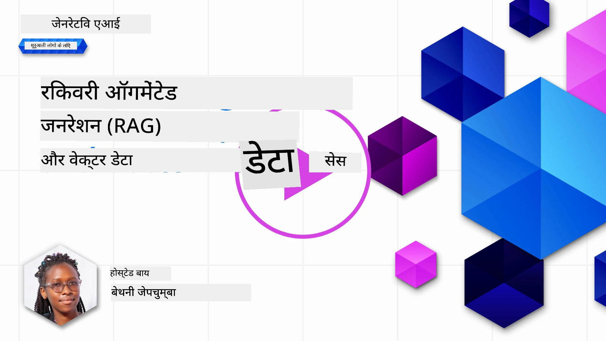
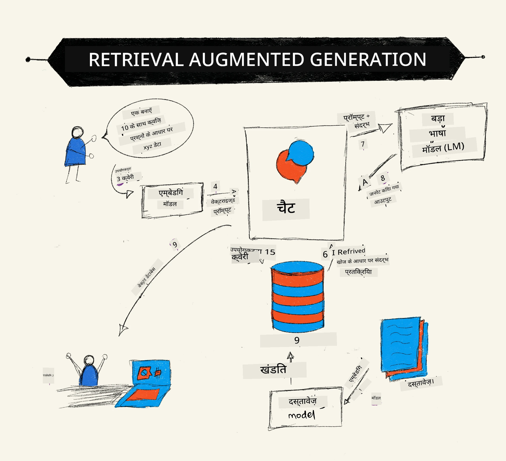
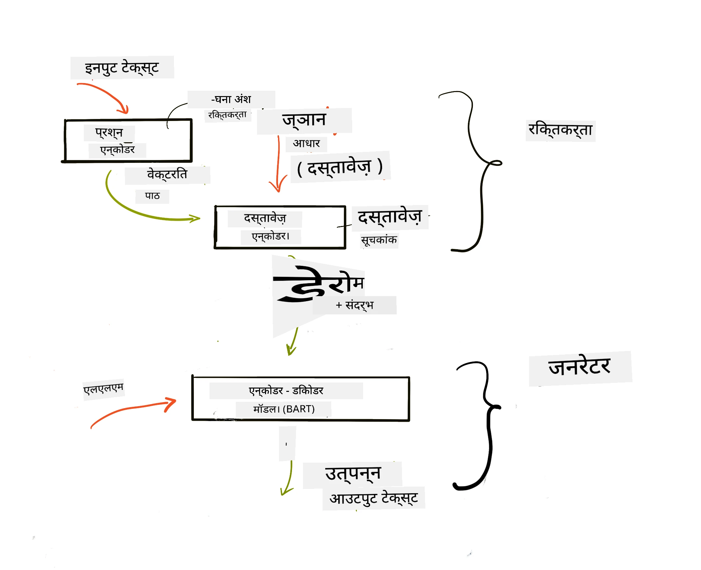
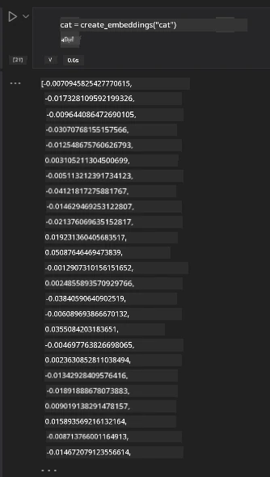

# Retrieval Augmented Generation (RAG) और वेक्टर डेटाबेस

[](https://youtu.be/4l8zhHUBeyI?si=BmvDmL1fnHtgQYkL)

सर्च एप्लिकेशन सबक में, हमने संक्षेप में सीखा कि अपने डेटा को बड़े भाषा मॉडलों (LLMs) में कैसे एकीकृत करें। इस पाठ में, हम अपने LLM आवेदन में अपने डेटा को ग्राउंड करने के सिद्धांतों, प्रक्रिया की यांत्रिकी और डेटा संग्रहण के तरीकों पर अधिक गहराई से चर्चा करेंगे, जिसमें एम्बेडिंग्स और टेक्स्ट दोनों शामिल हैं।

> **वीडियो जल्द आ रहा है**

## परिचय

इस पाठ में हम निम्नलिखित को कवर करेंगे:

- RAG का परिचय, यह क्या है और AI (कृत्रिम बुद्धिमत्ता) में इसका उपयोग क्यों किया जाता है।

- वेक्टर डेटाबेस क्या होते हैं समझना और अपने आवेदन के लिए एक बनाना।

- एक व्यावहारिक उदाहरण कि कैसे RAG को एक आवेदन में एकीकृत किया जाता है।

## सीखने के लक्ष्य

इस पाठ को पूरा करने के बाद, आप सक्षम होंगे:

- RAG के डेटा पुनःप्राप्ति और प्रसंस्करण में महत्व की व्याख्या करना।

- RAG आवेदन सेटअप करना और अपने डेटा को एक LLM से ग्राउंड करना।

- LLM अनुप्रयोगों में RAG और वेक्टर डेटाबेस का प्रभावी एकीकरण।

## हमारा परिदृश्य: अपने LLMs को अपने डेटा से सशक्त बनाना

इस पाठ के लिए, हम अपनी शिक्षा स्टार्टअप में अपने खुद के नोट्स जोड़ना चाहते हैं, जिससे चैटबॉट अलग-अलग विषयों पर अधिक जानकारी प्राप्त कर सके। हमारे पास मौजूद नोट्स का उपयोग करके, शिक्षार्थी बेहतर अध्ययन कर सकेंगे और विभिन्न विषयों को समझ सकेंगे, जिससे उनकी परीक्षाओं की तैयारी आसान हो जाएगी। इस परिदृश्य को बनाने के लिए, हम उपयोग करेंगे:

- `Azure OpenAI:` वह LLM जिसे हम अपना चैटबॉट बनाने के लिए उपयोग करेंगे

- `AI for beginners' lesson on Neural Networks`: यह वह डेटा होगा जिस पर हम अपने LLM को ग्राउंड करेंगे

- `Azure AI Search` और `Azure Cosmos DB:` वेक्टर डेटाबेस जो हमारे डेटा को संग्रहीत करने और एक खोज सूचकांक बनाने के लिए

उपयोगकर्ता अपने नोट्स से प्रैक्टिस क्विज़, पुनरावृत्ति फ्लैश कार्ड बना सकेंगे और उसे संक्षिप्त अवलोकनों में सारांशित कर सकेंगे। आरंभ करने के लिए, आइए देखें कि RAG क्या है और यह कैसे काम करता है:

## Retrieval Augmented Generation (RAG)

एक LLM संचालित चैटबॉट उपयोगकर्ता के प्रॉम्प्ट का प्रसंस्करण करता है ताकि प्रतिक्रियाएँ उत्पन्न कर सके। इसे इंटरएक्टिव बनाने के लिए डिज़ाइन किया गया है और यह उपयोगकर्ताओं के साथ विभिन्न विषयों पर बातचीत करता है। हालांकि, इसकी प्रतिक्रियाएँ प्रदान किए गए संदर्भ और इसकी बुनियादी प्रशिक्षण डेटा तक सीमित होती हैं। उदाहरण के लिए, GPT-4 का ज्ञान कटऑफ सितंबर 2021 है, जिसका मतलब है कि इसके पास उसके बाद हुई घटनाओं का ज्ञान नहीं है। इसके अलावा, LLMs को प्रशिक्षित करने के लिए उपयोग किए गए डेटा में गोपनीय जानकारी जैसे व्यक्तिगत नोट्स या किसी कंपनी की उत्पाद मैनुअल शामिल नहीं होती।

### RAGs (Retrieval Augmented Generation) कैसे काम करते हैं



मान लीजिए आप एक ऐसा चैटबॉट तैनात करना चाहते हैं जो आपके नोट्स से क्विज़ बनाता है, तो आपको ज्ञान आधार से कनेक्शन की आवश्यकता होगी। यह वही जगह है जहाँ RAG मदद करता है। RAG निम्नलिखित तरीके से काम करता है:

- **ज्ञान आधार:** पुनःप्राप्ति से पहले, इन दस्तावेज़ों को ग्रहण और पूर्व-संसाधित करने की आवश्यकता होती है, आम तौर पर बड़े दस्तावेजों को छोटे टुकड़ों में तोड़ना, उन्हें टेक्स्ट एम्बेडिंग में परिवर्तित करना और उन्हें डेटाबेस में संग्रहीत करना।

- **उपयोगकर्ता प्रश्न:** उपयोगकर्ता कोई प्रश्न पूछता है

- **पुनःप्राप्ति:** जब उपयोगकर्ता प्रश्न पूछता है, एम्बेडिंग मॉडल हमारे ज्ञान आधार से संबंधित जानकारी पुनःप्राप्त करता है ताकि अधिक संदर्भ प्रदान किया जा सके जिसे प्रॉम्प्ट में शामिल किया जाएगा।

- **संवर्धित उत्पादन:** LLM अपनी प्रतिक्रिया को पुनःप्राप्त डेटा के आधार पर बढ़ाता है। यह प्रतिक्रिया को केवल पूर्व-प्रशिक्षित डेटा पर ही नहीं बल्कि जोड़े गए संदर्भ से संबंधित जानकारी पर भी आधारित होने की अनुमति देता है। पुनःप्राप्त डेटा का उपयोग LLM की प्रतिक्रियाओं को संवर्धित करने के लिए किया जाता है। फिर LLM उपयोगकर्ता के प्रश्न का उत्तर लौटाता है।



RAGs की वास्तुकला ट्रांसफॉर्मर्स का उपयोग करके लागू की जाती है जिसमें दो भाग होते हैं: एक एन्कोडर और एक डिकोडर। उदाहरण के लिए, जब कोई उपयोगकर्ता प्रश्न पूछता है, तो इनपुट टेक्स्ट को शब्दों के अर्थ को पकड़ने वाले वेक्टर में 'कोडित' किया जाता है और वेक्टर हमारे दस्तावेज़ सूचकांक में 'डिकोड' किए जाते हैं और उपयोगकर्ता प्रश्न पर आधारित नया टेक्स्ट उत्पन्न करते हैं। LLM आउटपुट उत्पन्न करने के लिए दोनों एन्कोडर-डिकोडर मॉडल का उपयोग करता है।

प्रस्तावित पेपर [Retrieval-Augmented Generation for Knowledge intensive NLP (natural language processing software) Tasks](https://arxiv.org/pdf/2005.11401.pdf?WT.mc_id=academic-105485-koreyst) के अनुसार RAG लागू करते समय दो तरीके हैं:

- **_RAG-Sequence_** पुनःप्राप्त दस्तावेज़ों का उपयोग करके उपयोगकर्ता प्रश्न के लिए श्रेष्ठ उत्तर की भविष्यवाणी करना

- **RAG-Token** दस्तावेज़ों का उपयोग अगला टोकन उत्पन्न करने के लिए करना, फिर उन्हें पुनःप्राप्त करना ताकि उपयोगकर्ता प्रश्न का उत्तर दिया जा सके

### आप RAGs का उपयोग क्यों करेंगे? 

- **सूचना की समृद्धता:** सुनिश्चित करता है कि टेक्स्ट प्रतिक्रियाएँ अद्यतित और वर्तमान हों। इसलिए यह डोमेन विशेष कार्यों में प्रदर्शन को बढ़ाता है आंतरिक ज्ञान आधार तक पहुँच के जरिए।

- उपयोगकर्ता प्रश्नों को संदर्भ देने के लिए ज्ञान आधार में **सत्यापनीय डेटा** का उपयोग करके झूठ या गलती को कम करता है।

- यह **लागत प्रभावी** है क्योंकि ये LLM को फाइन-ट्यून करने की तुलना में अधिक आर्थिक हैं।

## ज्ञान आधार बनाना

हमारा एप्लिकेशन हमारे व्यक्तिगत डेटा पर आधारित है, यानी, AI For Beginners के पाठ्यक्रम में न्यूरल नेटवर्क का पाठ।

### वेक्टर डेटाबेस

वेक्टर डेटाबेस परंपरागत डेटाबेस से अलग होता है, यह एक विशेष डेटाबेस होता है जिसे एम्बेडेड वेक्टरों को संग्रहित, प्रबंधित और खोजने के लिए डिज़ाइन किया गया है। यह दस्तावेज़ों के संख्यात्मक प्रतिनिधित्व संग्रहीत करता है। डेटा को संख्यात्मक एम्बेडिंग में तोड़ना हमारे AI सिस्टम के लिए डेटा को समझना और संसाधित करना आसान बनाता है।

हम अपनी एम्बेडिंग्स वेक्टर डेटाबेस में संग्रहीत करते हैं क्योंकि LLMs के लिए इनपुट के रूप में स्वीकृत टोकन की संख्या की सीमा होती है। चूंकि आप पूरे एम्बेडिंग्स को LLM में नहीं दे सकते, इसलिए हमें उन्हें टुकड़ों में तोड़ना होगा और जब उपयोगकर्ता कोई प्रश्न पूछता है, तो प्रश्न के सबसे अधिक संबंधित एम्बेडिंग्स को प्रॉम्प्ट के साथ वापस किया जाएगा। टुकड़ों में बांटना लागत भी कम करता है क्योंकि टोकन की संख्या कम हो जाती है जो LLM के माध्यम से पास होती है।

कुछ लोकप्रिय वेक्टर डेटाबेस में Azure Cosmos DB, Clarifyai, Pinecone, Chromadb, ScaNN, Qdrant और DeepLake शामिल हैं। आप Azure CLI का उपयोग करके Azure Cosmos DB मॉडल बना सकते हैं निम्नलिखित कमांड के साथ:

```bash
az login
az group create -n <resource-group-name> -l <location>
az cosmosdb create -n <cosmos-db-name> -r <resource-group-name>
az cosmosdb list-keys -n <cosmos-db-name> -g <resource-group-name>
```

### टेक्स्ट से एम्बेडिंग्स तक

अपने डेटा को स्टोर करने से पहले, हमें इसे डेटाबेस में संग्रहीत करने से पहले वेक्टर एम्बेडिंग में परिवर्तित करना होगा। यदि आप बड़े दस्तावेज़ों या लंबे टेक्स्ट के साथ काम कर रहे हैं, तो आप उन्हें संभावित प्रश्नों के आधार पर टुकड़ों में बाँट सकते हैं। टुकड़ों को वाक्य स्तर या पैरा स्तर पर किया जा सकता है। चूँकि टुकड़ों का अर्थ आस-पास के शब्दों से निकलता है, आप एक टुकड़े में कुछ अतिरिक्त संदर्भ जोड़ सकते हैं, उदाहरण के लिए, दस्तावेज़ का शीर्षक जोड़कर या टुकड़े के पहले या बाद में कुछ टेक्स्ट शामिल करके। आप डेटा को इस प्रकार टुकड़ों में बाँट सकते हैं:

```python
def split_text(text, max_length, min_length):
    words = text.split()
    chunks = []
    current_chunk = []

    for word in words:
        current_chunk.append(word)
        if len(' '.join(current_chunk)) < max_length and len(' '.join(current_chunk)) > min_length:
            chunks.append(' '.join(current_chunk))
            current_chunk = []

    # यदि अंतिम खंड न्यूनतम लंबाई तक नहीं पहुंचा, तो इसे फिर भी जोड़ें
    if current_chunk:
        chunks.append(' '.join(current_chunk))

    return chunks
```

टुकड़ों में बांटने के बाद, हम अपने टेक्स्ट को विभिन्न एम्बेडिंग मॉडल का उपयोग करके एम्बेड कर सकते हैं। कुछ मॉडल जिनका उपयोग किया जा सकता है उनमें शामिल हैं: word2vec, OpenAI का ada-002, Azure Computer Vision और कई और। किसी मॉडल का चयन आपके उपयोग की जाने वाली भाषाओं, एन्कोड किए जाने वाले सामग्री के प्रकार (टेक्स्ट/चित्र/ऑडियो), एन्कोड कर सकने वाले इनपुट का आकार और एम्बेडिंग आउटपुट की लंबाई पर निर्भर करेगा।

OpenAI के `text-embedding-ada-002` मॉडल का उपयोग करने वाला एक एम्बेडेड टेक्स्ट का उदाहरण है:


## पुनःप्राप्ति और वेक्टर खोज

जब उपयोगकर्ता कोई प्रश्न पूछता है, तो पुनःप्राप्तकर्ता इसे क्वेरी एन्कोडर का उपयोग करके वेक्टर में परिवर्तित करता है, फिर हमारा दस्तावेज़ खोज सूचकांक उन वेक्टरों के लिए खोज करता है जो इनपुट से संबंधित हैं। पूरा होने के बाद, यह इनपुट वेक्टर और दस्तावेज़ वेक्टर दोनों को टेक्स्ट में परिवर्तित करता है और LLM के माध्यम से भेजता है।

### पुनःप्राप्ति

पुनःप्राप्ति तब होती है जब सिस्टम जल्दी से उन दस्तावेज़ों को खोजने की कोशिश करता है जो खोज मानदंडों को पूरा करते हैं। पुनःप्राप्तकर्ता का लक्ष्य ऐसे दस्तावेज़ प्राप्त करना है जो संदर्भ प्रदान करने और आपके डेटा पर LLM को ग्राउंड करने के लिए उपयोग किए जाएंगे।

हमारे डेटाबेस के भीतर खोज करने के कई तरीके हैं, जैसे:

- **कीवर्ड खोज** - टेक्स्ट खोजों के लिए उपयोग की जाती है

- **वेक्टर खोज** - एम्बेडिंग मॉडल का उपयोग करके दस्तावेज़ों को टेक्स्ट से वेक्टर प्रतिरूपों में परिवर्तित करता है, जिससे शब्दों के अर्थ का उपयोग करते हुए **अर्थगर्भित खोज (semantic search)** की अनुमति मिलती है। पुनःप्राप्ति उन दस्तावेज़ों के प्रश्न द्वारा की जाएगी जिनके वेक्टर उपयोगकर्ता प्रश्न के सबसे निकट होते हैं।

- **हाइब्रिड** - दोनों कीवर्ड और वेक्टर खोज का संयोजन।

एक चुनौती तब आती है जब डेटाबेस में प्रश्न के समान कोई उत्तर नहीं होता, तब सिस्टम उपलब्ध सर्वश्रेष्ठ जानकारी लौटाएगा, हालांकि, आप प्रासंगिकता के लिए अधिकतम दूरी सेट करने जैसे उपाय कर सकते हैं या कीवर्ड और वेक्टर खोज दोनों को मिलाने वाला हाइब्रिड खोज उपयोग कर सकते हैं। इस पाठ में हम हाइब्रिड खोज का उपयोग करेंगे, जो दोनों वेक्टर और कीवर्ड खोज का संयोजन है। हम अपने डेटा को एक डेटा फ़्रेम में संग्रहीत करेंगे, जिसमें कॉलम में टुकड़े और एम्बेडिंग्स होंगे।

### वेक्टर समानता

पुनःप्राप्तकर्ता ज्ञान डेटाबेस में उन एम्बेडिंग्स की खोज करेगा जो एक-दूसरे के करीब हैं, सबसे निकटतम पड़ोसी के रूप में, क्योंकि वे समान पाठ होते हैं। परिदृश्य में जब उपयोगकर्ता कोई प्रश्न पूछता है, तो इसे पहले एम्बेड किया जाता है फिर समान एम्बेडिंग्स से मेल कराया जाता है। विभिन्न वेक्टरों के समान होने को मापने के लिए आमतौर पर उपयोग किया जाने वाला मापक कोसाइन समानता है जो दो वेक्टरों के बीच के कोण पर आधारित है।

हम समानता को मापने के लिए अन्य विकल्प भी उपयोग कर सकते हैं जैसे यूलिडियन दूरी जो वेक्टर के सिरों के बीच की सीधी रेखा है और डॉट प्रोडक्ट जो दो वेक्टरों के संबंधित तत्वों के गुणा के योग को मापता है।

### खोज सूचकांक

पुनःप्राप्ति करते समय, हमें खोज प्रदर्शन से पहले अपने ज्ञान आधार के लिए एक खोज सूचकांक बनाना होगा। एक सूचकांक हमारे एम्बेडिंग्स को संग्रहित करेगा और बड़ा डेटाबेस होने पर भी सबसे समान टुकड़ों को त्वरित रूप से पुनःप्राप्त कर सकता है। हम इसे स्थानीय रूप से बना सकते हैं:

```python
from sklearn.neighbors import NearestNeighbors

embeddings = flattened_df['embeddings'].to_list()

# खोज सूचकांक बनाएं
nbrs = NearestNeighbors(n_neighbors=5, algorithm='ball_tree').fit(embeddings)

# सूचकांक से प्रश्न करने के लिए, आप kneighbors विधि का उपयोग कर सकते हैं
distances, indices = nbrs.kneighbors(embeddings)
```

### पुनः रैंकिंग

एक बार जब आप डेटाबेस को क्वेरी कर लें, तो आपको संभवतः परिणामों को सबसे प्रासंगिक से क्रमबद्ध करने की आवश्यकता होगी। एक पुनः रैंकिंग LLM मशीन लर्निंग का उपयोग करके खोज परिणामों की प्रासंगिकता सुधारता है और उन्हें सबसे प्रासंगिक से क्रमबद्ध करता है। Azure AI Search का उपयोग करते हुए, पुनः रैंकिंग आपके लिए स्वतः ही एक अर्थगर्भित पुनः रैंकर (semantic reranker) द्वारा की जाती है। यहाँ निकटतम पड़ोसियों का उपयोग कर पुनः रैंकिंग कैसे काम करती है का एक उदाहरण है:

```python
# सबसे समान दस्तावेज़ खोजें
distances, indices = nbrs.kneighbors([query_vector])

index = []
# सबसे समान दस्तावेज़ प्रिंट करें
for i in range(3):
    index = indices[0][i]
    for index in indices[0]:
        print(flattened_df['chunks'].iloc[index])
        print(flattened_df['path'].iloc[index])
        print(flattened_df['distances'].iloc[index])
    else:
        print(f"Index {index} not found in DataFrame")
```

## सब कुछ एक साथ लाना

अंतिम चरण में हम अपना LLM जोड़ते हैं ताकि हम अपनी डेटा पर आधारित प्रतिक्रियाएं प्राप्त कर सकें। हम इसे निम्नलिखित तरीके से लागू कर सकते हैं:

```python
user_input = "what is a perceptron?"

def chatbot(user_input):
    # प्रश्न को क्वेरी वेक्टर में बदलें
    query_vector = create_embeddings(user_input)

    # सबसे समान दस्तावेज़ खोजें
    distances, indices = nbrs.kneighbors([query_vector])

    # संदर्भ प्रदान करने के लिए दस्तावेज़ों को क्वेरी में जोड़ें
    history = []
    for index in indices[0]:
        history.append(flattened_df['chunks'].iloc[index])

    # इतिहास और उपयोगकर्ता इनपुट को मिलाएं
    history.append(user_input)

    # एक संदेश वस्तु बनाएं
    messages=[
        {"role": "system", "content": "You are an AI assistant that helps with AI questions."},
        {"role": "user", "content": "\n\n".join(history) }
    ]

    # उत्तर उत्पन्न करने के लिए चैट पूर्णता का उपयोग करें
    response = openai.chat.completions.create(
        model="gpt-4",
        temperature=0.7,
        max_tokens=800,
        messages=messages
    )

    return response.choices[0].message

chatbot(user_input)
```

## अपने आवेदन का मूल्यांकन

### मूल्यांकन मापक

- प्रदान की गई प्रतिक्रियाओं की गुणवत्ता यह सुनिश्चित करना कि वे प्राकृतिक, प्रवाहपूर्ण और मानवीय लगें

- डेटा की ग्राउंडेडनेस: यह मूल्यांकन करना कि क्या प्रतिक्रिया आपूर्ति किए गए दस्तावेज़ों से आई है

- प्रासंगिकता: यह मूल्यांकन कि प्रतिक्रिया प्रश्न से मेल खाती है और उससे संबंधित है

- प्रवाहशीलता - क्या प्रतिक्रिया व्याकरणिक रूप से समझ में आती है

## Retrieval Augmented Generation (RAG) और वेक्टर डेटाबेस का उपयोग करने के लिए उपयोग के केस

आपके ऐप को बेहतर बनाने के लिए फंक्शन कॉल्स के कई अलग-अलग उपयोग हैं, जैसे:

- प्रश्न उत्तर देना: अपनी कंपनी के डेटा को एक चैट से जोड़ना जिसे कर्मचारी प्रश्न पूछने के लिए उपयोग कर सकते हैं।

- अनुशंसा प्रणालियाँ: जहाँ आप ऐसी प्रणाली बना सकते हैं जो सबसे समान मानों से मेल खाती है जैसे फिल्में, रेस्तरां और बहुत कुछ।

- चैटबॉट सेवाएँ: आप चैट इतिहास को संग्रहीत कर सकते हैं और उपयोगकर्ता डेटा के आधार पर बातचीत को व्यक्तिगत बना सकते हैं।

- वेक्टर एम्बेडिंग्स पर आधारित छवि खोज, जब इमेज पहचान और विसंगति पता लगाने के लिए उपयोगी है।

## सारांश

हमने RAG के मूलभूत क्षेत्रों को कवर किया है, अपने डेटा को एप्लिकेशन में जोड़ना, उपयोगकर्ता प्रश्न और आउटपुट। RAG के निर्माण को सरल बनाने के लिए, आप Semanti Kernel, Langchain या Autogen जैसे फ्रेमवर्क का उपयोग कर सकते हैं।

## असाइनमेंट

Retrieval Augmented Generation (RAG) का अपना अध्ययन जारी रखने के लिए आप बना सकते हैं:

- अपनी पसंद के फ्रेमवर्क का इस्तेमाल करते हुए एप्लिकेशन के लिए एक फ्रंट-एंड बनाएं

- LangChain या Semantic Kernel में से किसी एक फ्रेमवर्क का उपयोग करें और अपना एप्लिकेशन पुनर्निर्माण करें।

पाठ पूरा करने के लिए बधाई 👏।

## सीखना यहीं नहीं रुकता, यात्रा जारी रखें

इस पाठ को पूरा करने के बाद, हमारे [Generative AI Learning collection](https://aka.ms/genai-collection?WT.mc_id=academic-105485-koreyst) को देखें ताकि आप अपनी Generative AI ज्ञान को और बढ़ा सकें!

---

<!-- CO-OP TRANSLATOR DISCLAIMER START -->
**अस्वीकरण**:  
यह दस्तावेज़ AI अनुवाद सेवा [Co-op Translator](https://github.com/Azure/co-op-translator) के माध्यम से अनुवादित किया गया है। हम सटीकता के लिए प्रयासरत हैं, फिर भी कृपया ध्यान दें कि स्वचालित अनुवाद में त्रुटियाँ या अशुद्धियाँ हो सकती हैं। मूल दस्तावेज़ अपनी मूल भाषा में ही प्रामाणिक स्रोत माना जाना चाहिए। महत्वपूर्ण जानकारी के लिए, पेशेवर मानव अनुवाद की सलाह दी जाती है। इस अनुवाद के उपयोग से उत्पन्न किसी भी गलतफहमी या मिसअंतरप्रिटेशन के लिए हम उत्तरदायित्व नहीं लेते।
<!-- CO-OP TRANSLATOR DISCLAIMER END -->