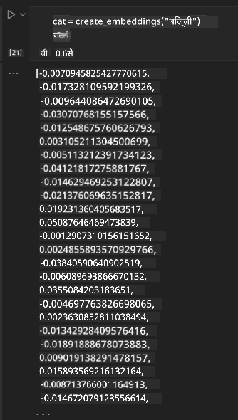

<!--
CO_OP_TRANSLATOR_METADATA:
{
  "original_hash": "e2861bbca91c0567ef32bc77fe054f9e",
  "translation_date": "2025-05-20T01:08:24+00:00",
  "source_file": "15-rag-and-vector-databases/README.md",
  "language_code": "hi"
}
-->
# पुनर्प्राप्ति संवर्धित पीढ़ी (RAG) और वेक्टर डेटाबेस

खोज अनुप्रयोगों के पाठ में, हमने संक्षेप में सीखा कि अपने स्वयं के डेटा को बड़े भाषा मॉडल (LLMs) में कैसे एकीकृत किया जाए। इस पाठ में, हम आपके LLM अनुप्रयोग में आपके डेटा को आधार देने की अवधारणाओं, प्रक्रिया के यांत्रिकी और डेटा संग्रहीत करने के तरीकों में गहराई से जाएंगे, जिसमें एम्बेडिंग और टेक्स्ट दोनों शामिल हैं।

> **वीडियो जल्द ही आ रहा है**

## परिचय

इस पाठ में हम निम्नलिखित को कवर करेंगे:

- RAG का परिचय, यह क्या है और एआई (कृत्रिम बुद्धिमत्ता) में इसका उपयोग क्यों किया जाता है।

- यह समझना कि वेक्टर डेटाबेस क्या हैं और हमारे अनुप्रयोग के लिए एक बनाना।

- RAG को एक अनुप्रयोग में एकीकृत करने का एक व्यावहारिक उदाहरण।

## सीखने के लक्ष्य

इस पाठ को पूरा करने के बाद, आप सक्षम होंगे:

- डेटा पुनर्प्राप्ति और प्रसंस्करण में RAG के महत्व की व्याख्या करें।

- RAG अनुप्रयोग सेटअप करें और अपने डेटा को LLM में आधार दें

- LLM अनुप्रयोगों में RAG और वेक्टर डेटाबेस का प्रभावी एकीकरण।

## हमारी परिदृश्य: अपने डेटा के साथ हमारे LLM को बढ़ाना

इस पाठ के लिए, हम शिक्षा स्टार्टअप में अपने स्वयं के नोट्स जोड़ना चाहते हैं, जो चैटबॉट को विभिन्न विषयों पर अधिक जानकारी प्राप्त करने की अनुमति देता है। हमारे पास जो नोट्स हैं, उनका उपयोग करके, शिक्षार्थी बेहतर तरीके से अध्ययन कर सकेंगे और विभिन्न विषयों को समझ सकेंगे, जिससे उनकी परीक्षाओं की समीक्षा करना आसान हो जाएगा। हमारे परिदृश्य को बनाने के लिए, हम उपयोग करेंगे:

- `Azure OpenAI:` वह LLM जिसका उपयोग हम अपना चैटबॉट बनाने के लिए करेंगे

- `AI for beginners' lesson on Neural Networks`: यह वह डेटा होगा जिस पर हम अपने LLM को आधार देंगे

- `Azure AI Search` और `Azure Cosmos DB:` वेक्टर डेटाबेस हमारे डेटा को संग्रहीत करने और एक खोज सूचकांक बनाने के लिए

उपयोगकर्ता अपने नोट्स से अभ्यास प्रश्नोत्तरी बना सकेंगे, संशोधन फ्लैश कार्ड और इसे संक्षिप्त अवलोकनों में सारांशित कर सकेंगे। आरंभ करने के लिए, आइए देखें कि RAG क्या है और यह कैसे काम करता है:

## पुनर्प्राप्ति संवर्धित पीढ़ी (RAG)

एक LLM संचालित चैटबॉट उपयोगकर्ता संकेतों को संसाधित करता है ताकि प्रतिक्रियाएं उत्पन्न की जा सकें। इसे इंटरैक्टिव होने के लिए डिज़ाइन किया गया है और यह उपयोगकर्ताओं के साथ कई विषयों पर बातचीत करता है। हालांकि, इसकी प्रतिक्रियाएं प्रदान किए गए संदर्भ और इसके बुनियादी प्रशिक्षण डेटा तक सीमित हैं। उदाहरण के लिए, GPT-4 का ज्ञान कटऑफ सितंबर 2021 है, जिसका अर्थ है कि यह इस अवधि के बाद हुई घटनाओं के बारे में जानकारी नहीं रखता है। इसके अलावा, LLMs को प्रशिक्षित करने के लिए उपयोग किए जाने वाले डेटा में व्यक्तिगत नोट्स या किसी कंपनी के उत्पाद मैनुअल जैसी गोपनीय जानकारी शामिल नहीं होती है।

### RAGs (पुनर्प्राप्ति संवर्धित पीढ़ी) कैसे काम करती है

मान लीजिए आप एक चैटबॉट तैनात करना चाहते हैं जो आपके नोट्स से प्रश्नोत्तरी बनाता है, तो आपको ज्ञान आधार से कनेक्शन की आवश्यकता होगी। यहीं पर RAG मदद करता है। RAGs निम्नलिखित रूप से संचालित होते हैं:

- **ज्ञान आधार:** पुनर्प्राप्ति से पहले, इन दस्तावेज़ों को आमतौर पर बड़े दस्तावेज़ों को छोटे टुकड़ों में विभाजित करके, उन्हें पाठ एम्बेडिंग में बदलकर और उन्हें डेटाबेस में संग्रहीत करके ग्रहण और पूर्व-संसाधित करने की आवश्यकता होती है।

- **उपयोगकर्ता प्रश्न:** उपयोगकर्ता प्रश्न पूछता है

- **पुनर्प्राप्ति:** जब कोई उपयोगकर्ता प्रश्न पूछता है, तो एम्बेडिंग मॉडल हमारे ज्ञान आधार से प्रासंगिक जानकारी पुनर्प्राप्त करता है ताकि अधिक संदर्भ प्रदान किया जा सके जिसे संकेत में शामिल किया जाएगा।

- **संवर्धित पीढ़ी:** LLM पुनर्प्राप्त डेटा के आधार पर अपनी प्रतिक्रिया को बढ़ाता है। यह सुनिश्चित करता है कि उत्पन्न प्रतिक्रिया केवल पूर्व-प्रशिक्षित डेटा पर आधारित न हो बल्कि जोड़े गए संदर्भ से प्रासंगिक जानकारी पर भी आधारित हो। पुनर्प्राप्त डेटा का उपयोग LLM की प्रतिक्रियाओं को बढ़ाने के लिए किया जाता है। फिर LLM उपयोगकर्ता के प्रश्न का उत्तर लौटाता है।

RAGs के लिए आर्किटेक्चर को ट्रांसफॉर्मर का उपयोग करके लागू किया जाता है जिसमें दो भाग होते हैं: एक एन्कोडर और एक डिकोडर। उदाहरण के लिए, जब कोई उपयोगकर्ता कोई प्रश्न पूछता है, तो इनपुट टेक्स्ट को वेक्टर में 'एन्कोड' किया जाता है जो शब्दों के अर्थ को कैप्चर करता है और वेक्टर को हमारे दस्तावेज़ सूचकांक में 'डिकोड' किया जाता है और उपयोगकर्ता क्वेरी के आधार पर नया टेक्स्ट उत्पन्न करता है। आउटपुट उत्पन्न करने के लिए LLM एन्कोडर-डिकोडर मॉडल दोनों का उपयोग करता है।

प्रस्तावित पेपर के अनुसार RAG को लागू करते समय दो दृष्टिकोण: [ज्ञान-गहन NLP (प्राकृतिक भाषा प्रसंस्करण सॉफ़्टवेयर) कार्यों के लिए पुनर्प्राप्ति-संवर्धित पीढ़ी](https://arxiv.org/pdf/2005.11401.pdf?WT.mc_id=academic-105485-koreyst) हैं:

- **_RAG-सीक्वेंस_** उपयोगकर्ता क्वेरी का सबसे अच्छा संभव उत्तर भविष्यवाणी करने के लिए पुनर्प्राप्त दस्तावेज़ों का उपयोग करना

- **RAG-टोकन** दस्तावेज़ों का उपयोग अगला टोकन उत्पन्न करने के लिए करना, फिर उन्हें उपयोगकर्ता की क्वेरी का उत्तर देने के लिए पुनर्प्राप्त करना

### आप RAGs का उपयोग क्यों करेंगे?

- **सूचना समृद्धि:** यह सुनिश्चित करता है कि पाठ प्रतिक्रियाएं अद्यतन और वर्तमान हैं। इसलिए, यह आंतरिक ज्ञान आधार तक पहुंचकर डोमेन विशिष्ट कार्यों पर प्रदर्शन को बढ़ाता है।

- ज्ञान आधार में **सत्यापन योग्य डेटा** का उपयोग करके उपयोगकर्ता क्वेरी के लिए संदर्भ प्रदान करके निर्माण को कम करता है।

- यह **लागत प्रभावी** है क्योंकि वे LLM को फाइन-ट्यून करने की तुलना में अधिक किफायती हैं

## एक ज्ञान आधार बनाना

हमारा आवेदन हमारे व्यक्तिगत डेटा यानी एआई फॉर बिगिनर्स पाठ्यक्रम पर न्यूरल नेटवर्क पाठ पर आधारित है।

### वेक्टर डेटाबेस

वेक्टर डेटाबेस, पारंपरिक डेटाबेस के विपरीत, एक विशेष डेटाबेस है जिसे एम्बेडेड वेक्टर को संग्रहीत, प्रबंधित और खोजने के लिए डिज़ाइन किया गया है। यह दस्तावेज़ों के संख्यात्मक प्रतिनिधित्व संग्रहीत करता है। डेटा को संख्यात्मक एम्बेडिंग में तोड़ने से हमारे एआई सिस्टम के लिए डेटा को समझना और संसाधित करना आसान हो जाता है।

हम अपने एम्बेडिंग को वेक्टर डेटाबेस में संग्रहीत करते हैं क्योंकि LLMs के पास इनपुट के रूप में स्वीकार किए जाने वाले टोकन की संख्या की एक सीमा होती है। चूंकि आप पूरे एम्बेडिंग को LLM में पास नहीं कर सकते, इसलिए हमें उन्हें टुकड़ों में तोड़ने की आवश्यकता होगी और जब कोई उपयोगकर्ता कोई प्रश्न पूछता है, तो प्रश्न के सबसे समान एम्बेडिंग को संकेत के साथ लौटाया जाएगा। चंकिंग LLM के माध्यम से पास किए गए टोकन की संख्या पर लागत को भी कम करता है।

कुछ लोकप्रिय वेक्टर डेटाबेस में Azure Cosmos DB, Clarifyai, Pinecone, Chromadb, ScaNN, Qdrant और DeepLake शामिल हैं। आप निम्नलिखित कमांड के साथ Azure CLI का उपयोग करके एक Azure Cosmos DB मॉडल बना सकते हैं:

```bash
az login
az group create -n <resource-group-name> -l <location>
az cosmosdb create -n <cosmos-db-name> -r <resource-group-name>
az cosmosdb list-keys -n <cosmos-db-name> -g <resource-group-name>
```

### टेक्स्ट से एम्बेडिंग तक

हमारा डेटा संग्रहीत करने से पहले, हमें इसे डेटाबेस में संग्रहीत करने से पहले इसे वेक्टर एम्बेडिंग में बदलने की आवश्यकता होगी। यदि आप बड़े दस्तावेज़ों या लंबे टेक्स्ट के साथ काम कर रहे हैं, तो आप उन प्रश्नों के आधार पर उन्हें चंक कर सकते हैं जिनकी आप अपेक्षा करते हैं। चंकिंग वाक्य स्तर पर या पैराग्राफ स्तर पर की जा सकती है। जैसा कि चंकिंग उनके चारों ओर के शब्दों से अर्थ प्राप्त करती है, आप किसी चंक में कुछ अन्य संदर्भ जोड़ सकते हैं, उदाहरण के लिए, दस्तावेज़ शीर्षक जोड़कर या चंक से पहले या बाद में कुछ टेक्स्ट शामिल करके। आप डेटा को निम्नानुसार चंक कर सकते हैं:

```python
def split_text(text, max_length, min_length):
    words = text.split()
    chunks = []
    current_chunk = []

    for word in words:
        current_chunk.append(word)
        if len(' '.join(current_chunk)) < max_length and len(' '.join(current_chunk)) > min_length:
            chunks.append(' '.join(current_chunk))
            current_chunk = []

    # If the last chunk didn't reach the minimum length, add it anyway
    if current_chunk:
        chunks.append(' '.join(current_chunk))

    return chunks
```

एक बार चंक किए जाने के बाद, हम विभिन्न एम्बेडिंग मॉडल का उपयोग करके अपने टेक्स्ट को एम्बेड कर सकते हैं। कुछ मॉडल जिनका आप उपयोग कर सकते हैं उनमें शामिल हैं: वर्ड2वेक, ओपनएआई द्वारा अदा-002, एज़्योर कंप्यूटर विज़न और कई अन्य। उपयोग करने के लिए मॉडल का चयन करना इस बात पर निर्भर करेगा कि आप किन भाषाओं का उपयोग कर रहे हैं, एन्कोड की गई सामग्री का प्रकार (पाठ/छवियां/ऑडियो), वह इनपुट आकार जिसे वह एन्कोड कर सकता है और एम्बेडिंग आउटपुट की लंबाई।

ओपनएआई के `टेक्स्ट-एम्बेडिंग-अदा-002` मॉडल का उपयोग करके एम्बेडेड टेक्स्ट का एक उदाहरण है:


## पुनर्प्राप्ति और वेक्टर खोज

जब कोई उपयोगकर्ता कोई प्रश्न पूछता है, तो पुनः प्राप्तकर्ता इसे क्वेरी एन्कोडर का उपयोग करके वेक्टर में बदल देता है, फिर यह इनपुट से संबंधित दस्तावेज़ में प्रासंगिक वेक्टर के लिए हमारे दस्तावेज़ खोज सूचकांक के माध्यम से खोज करता है। एक बार हो जाने के बाद, यह इनपुट वेक्टर और दस्तावेज़ वेक्टर दोनों को टेक्स्ट में बदल देता है और इसे LLM के माध्यम से पास करता है।

### पुनर्प्राप्ति

पुनर्प्राप्ति तब होती है जब सिस्टम सूचकांक से दस्तावेज़ों को जल्दी से खोजने का प्रयास करता है जो खोज मानदंडों को पूरा करते हैं। पुनः प्राप्तकर्ता का लक्ष्य उन दस्तावेज़ों को प्राप्त करना है जिनका उपयोग संदर्भ प्रदान करने और आपके डेटा पर LLM को आधार देने के लिए किया जाएगा।

हमारे डेटाबेस के भीतर खोज करने के कई तरीके हैं जैसे:

- **कीवर्ड खोज** - पाठ खोजों के लिए उपयोग किया जाता है

- **अर्थ खोज** - शब्दों के अर्थ का उपयोग करता है

- **वेक्टर खोज** - एम्बेडिंग मॉडल का उपयोग करके दस्तावेज़ों को टेक्स्ट से वेक्टर प्रतिनिधित्व में बदल देता है। पुनर्प्राप्ति उन दस्तावेज़ों को क्वेरी करके की जाएगी जिनके वेक्टर प्रतिनिधित्व उपयोगकर्ता प्रश्न के सबसे करीब हैं।

- **हाइब्रिड** - कीवर्ड और वेक्टर खोज दोनों का संयोजन।

पुनर्प्राप्ति के साथ एक चुनौती तब आती है जब डेटाबेस में क्वेरी के लिए कोई समान प्रतिक्रिया नहीं होती है, तब सिस्टम उन्हें सबसे अच्छी जानकारी लौटाएगा जो वे प्राप्त कर सकते हैं, हालांकि, आप प्रासंगिकता के लिए अधिकतम दूरी सेट करने जैसी रणनीति का उपयोग कर सकते हैं या हाइब्रिड खोज का उपयोग कर सकते हैं जो कीवर्ड और वेक्टर खोज दोनों को जोड़ती है। इस पाठ में हम हाइब्रिड खोज का उपयोग करेंगे, जो वेक्टर और कीवर्ड खोज दोनों का संयोजन है। हम अपने डेटा को एक डेटा फ्रेम में संग्रहीत करेंगे जिसमें चंक्स के साथ-साथ एम्बेडिंग भी शामिल हैं।

### वेक्टर समानता

पुनः प्राप्तकर्ता निकटतम पड़ोसी के रूप में एक साथ निकट एम्बेडिंग के लिए ज्ञान डेटाबेस के माध्यम से खोज करेगा, क्योंकि वे समान पाठ हैं। परिदृश्य में कोई उपयोगकर्ता कोई क्वेरी पूछता है, तो इसे पहले एम्बेड किया जाता है और फिर समान एम्बेडिंग के साथ मिलान किया जाता है। आमतौर पर उपयोग किया जाने वाला माप जो यह पता लगाने के लिए उपयोग किया जाता है कि विभिन्न वेक्टर कितने समान हैं, वह कोसाइन समानता है जो दो वेक्टर के बीच के कोण पर आधारित है।

हम समानता को माप सकते हैं अन्य विकल्पों का उपयोग करके जो हम उपयोग कर सकते हैं वे यूक्लिडियन दूरी है जो वेक्टर छोर बिंदुओं के बीच सीधी रेखा है और डॉट प्रोडक्ट जो दो वेक्टर के संबंधित तत्वों के उत्पादों के योग को मापता है।

### खोज सूचकांक

पुनर्प्राप्ति करते समय, खोज करने से पहले हमें अपने ज्ञान आधार के लिए एक खोज सूचकांक बनाने की आवश्यकता होगी। एक सूचकांक हमारे एम्बेडिंग को संग्रहीत करेगा और बड़ी डेटाबेस में भी सबसे समान चंक्स को जल्दी से पुनः प्राप्त कर सकता है। हम स्थानीय रूप से अपना सूचकांक निम्नलिखित का उपयोग करके बना सकते हैं:

```python
from sklearn.neighbors import NearestNeighbors

embeddings = flattened_df['embeddings'].to_list()

# Create the search index
nbrs = NearestNeighbors(n_neighbors=5, algorithm='ball_tree').fit(embeddings)

# To query the index, you can use the kneighbors method
distances, indices = nbrs.kneighbors(embeddings)
```

### पुनः रैंकिंग

एक बार जब आप डेटाबेस से क्वेरी कर लेते हैं, तो आपको सबसे प्रासंगिक से परिणामों को सॉर्ट करने की आवश्यकता हो सकती है। पुनः रैंकिंग LLM मशीन लर्निंग का उपयोग करके खोज परिणामों की प्रासंगिकता में सुधार करता है, उन्हें सबसे प्रासंगिक से क्रमबद्ध करता है। Azure AI खोज का उपयोग करके, पुनः रैंकिंग आपके लिए स्वचालित रूप से एक अर्थ पुनः रैंकिंगकर्ता का उपयोग करके की जाती है। निकटतम पड़ोसियों का उपयोग करके पुनः रैंकिंग कैसे काम करती है इसका एक उदाहरण:

```python
# Find the most similar documents
distances, indices = nbrs.kneighbors([query_vector])

index = []
# Print the most similar documents
for i in range(3):
    index = indices[0][i]
    for index in indices[0]:
        print(flattened_df['chunks'].iloc[index])
        print(flattened_df['path'].iloc[index])
        print(flattened_df['distances'].iloc[index])
    else:
        print(f"Index {index} not found in DataFrame")
```

## इसे एक साथ लाना

अंतिम चरण हमारे डेटा पर आधारित प्रतिक्रियाएं प्राप्त करने में सक्षम होने के लिए हमारे LLM को मिश्रण में जोड़ना है। हम इसे निम्नानुसार लागू कर सकते हैं:

```python
user_input = "what is a perceptron?"

def chatbot(user_input):
    # Convert the question to a query vector
    query_vector = create_embeddings(user_input)

    # Find the most similar documents
    distances, indices = nbrs.kneighbors([query_vector])

    # add documents to query  to provide context
    history = []
    for index in indices[0]:
        history.append(flattened_df['chunks'].iloc[index])

    # combine the history and the user input
    history.append(user_input)

    # create a message object
    messages=[
        {"role": "system", "content": "You are an AI assistant that helps with AI questions."},
        {"role": "user", "content": history[-1]}
    ]

    # use chat completion to generate a response
    response = openai.chat.completions.create(
        model="gpt-4",
        temperature=0.7,
        max_tokens=800,
        messages=messages
    )

    return response.choices[0].message

chatbot(user_input)
```

## हमारे आवेदन का मूल्यांकन

### मूल्यांकन मेट्रिक्स

- प्रतिक्रियाओं की गुणवत्ता सुनिश्चित करना कि यह स्वाभाविक, प्रवाहमय और मानव जैसी लगे

- डेटा की स्थिरता: यह मूल्यांकन करना कि प्रतिक्रिया आपूर्ति किए गए दस्तावेज़ों से आई थी या नहीं

- प्रासंगिकता: यह मूल्यांकन करना कि प्रतिक्रिया प्रश्न से मेल खाती है और संबंधित है

- प्रवाह - यह कि प्रतिक्रिया व्याकरणिक रूप से समझ में आती है या नहीं

## RAG (पुनर्प्राप्ति संवर्धित पीढ़ी) और वेक्टर डेटाबेस का उपयोग करने के लिए उपयोग के मामले

ऐसे कई अलग-अलग उपयोग के मामले हैं जहां फ़ंक्शन कॉल आपके ऐप को बेहतर बना सकते हैं जैसे:

- प्रश्न और उत्तर: आपके कंपनी डेटा को चैट से आधार बनाना जिसका उपयोग कर्मचारी प्रश्न पूछने के लिए कर सकते हैं।

- अनुशंसा प्रणालियाँ: जहाँ आप सबसे समान मानों का मिलान करने वाली प्रणाली बना सकते हैं जैसे कि फिल्में, रेस्तरां और बहुत कुछ।

- चैटबॉट सेवाएं: आप चैट इतिहास संग्रहीत कर सकते हैं और उपयोगकर्ता डेटा के आधार पर बातचीत को वैयक्तिकृत कर सकते हैं।

- वेक्टर एम्बेडिंग के आधार पर छवि खोज, छवि पहचान और विसंगति पहचान करते समय उपयोगी।

## सारांश

हमने RAG के मौलिक क्षेत्रों को कवर किया है, हमारे डेटा को अनुप्रयोग में जोड़ने से लेकर, उपयोगकर्ता क्वेरी और आउटपुट तक। RAG के निर्माण को सरल बनाने के लिए, आप सेमान्टिक कर्नेल, लैंगचेन या ऑटोजेन जैसे ढांचे का उपयोग कर सकते हैं।

## असाइनमेंट

पुनर्प्राप्ति संवर्धित पीढ़ी (RAG) के अपने सीखने को जारी रखने के लिए आप बना सकते हैं:

- अपनी पसंद के ढांचे का उपयोग करके अनुप्रयोग के लिए एक फ्रंट-एंड बनाएं

- एक ढांचा, लैंगचेन या सेमान्टिक कर्नेल का उपयोग करें, और अपने अनुप्रयोग को फिर से बनाएं।

पाठ पूरा करने के लिए बधाई 👏।

## सीखना यहीं नहीं रुकता, यात्रा जारी रखें

इस पाठ को पूरा करने के बाद, हमारे [जनरेटिव एआई लर्निंग संग्रह](https://aka.ms/genai-collection?WT.mc_id=academic-105485-koreyst) को देखें ताकि आप अपनी जनरेटिव एआई जानकारी को और बढ़ा सकें!

**अस्वीकरण**:  
यह दस्तावेज़ AI अनुवाद सेवा [Co-op Translator](https://github.com/Azure/co-op-translator) का उपयोग करके अनुवादित किया गया है। जबकि हम सटीकता के लिए प्रयासरत हैं, कृपया अवगत रहें कि स्वचालित अनुवादों में त्रुटियाँ या अशुद्धियाँ हो सकती हैं। मूल भाषा में मूल दस्तावेज़ को प्राधिकृत स्रोत माना जाना चाहिए। महत्वपूर्ण जानकारी के लिए, पेशेवर मानव अनुवाद की सिफारिश की जाती है। इस अनुवाद के उपयोग से उत्पन्न किसी भी गलतफहमी या गलत व्याख्या के लिए हम उत्तरदायी नहीं हैं।