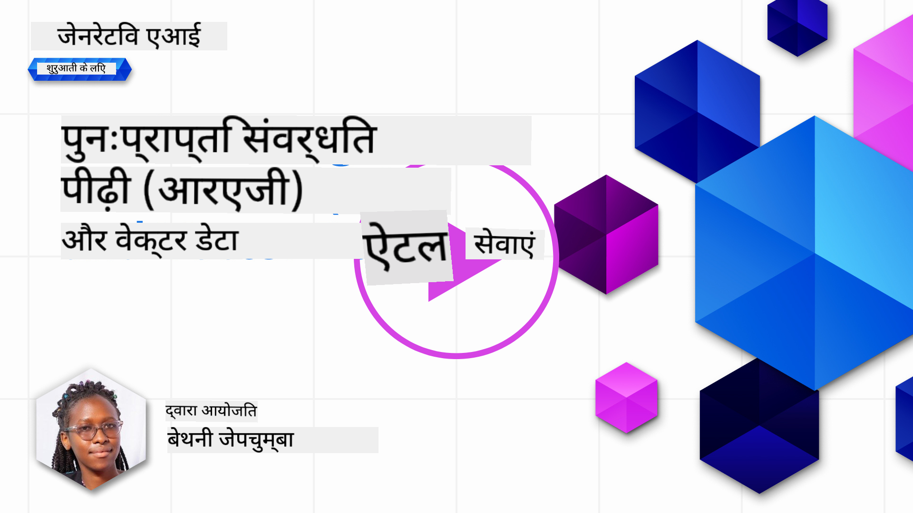
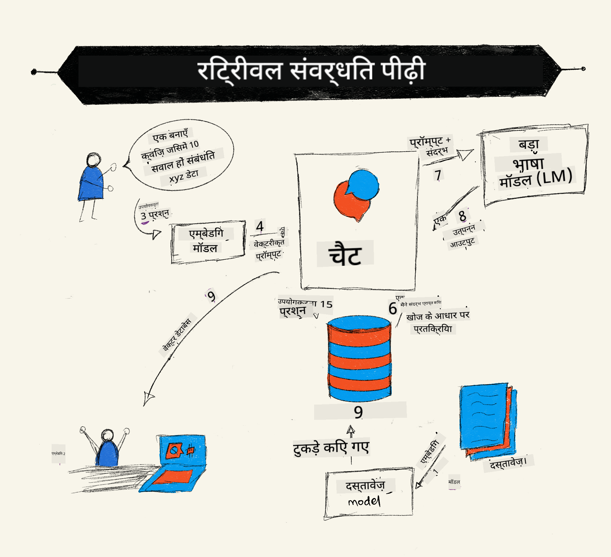
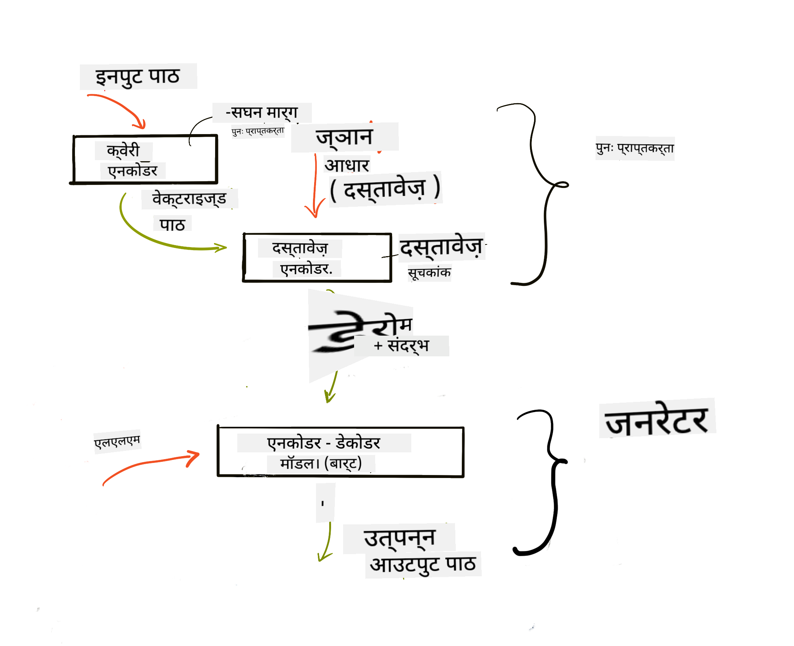
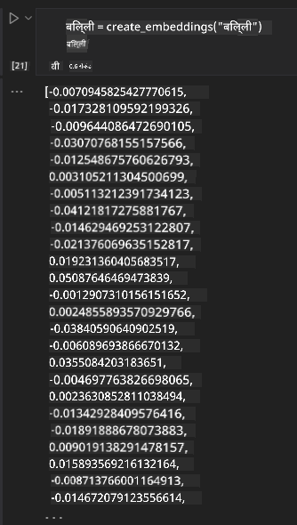

<!--
CO_OP_TRANSLATOR_METADATA:
{
  "original_hash": "e2861bbca91c0567ef32bc77fe054f9e",
  "translation_date": "2025-07-09T16:07:03+00:00",
  "source_file": "15-rag-and-vector-databases/README.md",
  "language_code": "hi"
}
-->
# Retrieval Augmented Generation (RAG) और वेक्टर डेटाबेस

[](https://aka.ms/gen-ai-lesson15-gh?WT.mc_id=academic-105485-koreyst)

सर्च एप्लिकेशन के पाठ में, हमने संक्षेप में सीखा था कि अपने डेटा को Large Language Models (LLMs) में कैसे इंटीग्रेट किया जाता है। इस पाठ में, हम अपने LLM एप्लिकेशन में डेटा को ग्राउंड करने की अवधारणा, प्रक्रिया की कार्यप्रणाली और डेटा स्टोर करने के तरीकों पर गहराई से चर्चा करेंगे, जिसमें एम्बेडिंग्स और टेक्स्ट दोनों शामिल हैं।

> **वीडियो जल्द आ रहा है**

## परिचय

इस पाठ में हम निम्नलिखित विषयों को कवर करेंगे:

- RAG का परिचय, यह क्या है और AI (कृत्रिम बुद्धिमत्ता) में इसका उपयोग क्यों किया जाता है।

- वेक्टर डेटाबेस क्या होते हैं इसे समझना और हमारे एप्लिकेशन के लिए एक बनाना।

- RAG को एक एप्लिकेशन में इंटीग्रेट करने का व्यावहारिक उदाहरण।

## सीखने के लक्ष्य

इस पाठ को पूरा करने के बाद, आप सक्षम होंगे:

- डेटा पुनःप्राप्ति और प्रोसेसिंग में RAG के महत्व को समझाना।

- RAG एप्लिकेशन सेटअप करना और अपने डेटा को LLM से जोड़ना।

- LLM एप्लिकेशन में RAG और वेक्टर डेटाबेस का प्रभावी इंटीग्रेशन।

## हमारा परिदृश्य: अपने LLMs को अपने डेटा से बेहतर बनाना

इस पाठ के लिए, हम अपनी शिक्षा स्टार्टअप में अपने नोट्स जोड़ना चाहते हैं, जिससे चैटबॉट विभिन्न विषयों पर अधिक जानकारी प्राप्त कर सके। हमारे पास मौजूद नोट्स का उपयोग करके, शिक्षार्थी बेहतर अध्ययन कर पाएंगे और विभिन्न विषयों को समझ पाएंगे, जिससे उनकी परीक्षाओं की तैयारी आसान हो जाएगी। हमारे परिदृश्य को बनाने के लिए, हम निम्नलिखित का उपयोग करेंगे:

- `Azure OpenAI:` वह LLM जिसका उपयोग हम अपना चैटबॉट बनाने के लिए करेंगे

- `AI for beginners' lesson on Neural Networks:` यह वह डेटा होगा जिस पर हम अपने LLM को ग्राउंड करेंगे

- `Azure AI Search` और `Azure Cosmos DB:` वेक्टर डेटाबेस जहां हम अपना डेटा स्टोर करेंगे और सर्च इंडेक्स बनाएंगे

उपयोगकर्ता अपने नोट्स से प्रैक्टिस क्विज़ बना सकेंगे, रिवीजन फ्लैश कार्ड्स तैयार कर सकेंगे और उन्हें संक्षिप्त सारांशों में बदल सकेंगे। शुरू करने के लिए, आइए देखें कि RAG क्या है और यह कैसे काम करता है:

## Retrieval Augmented Generation (RAG)

एक LLM संचालित चैटबॉट उपयोगकर्ता के प्रॉम्प्ट को प्रोसेस करके उत्तर उत्पन्न करता है। इसे इंटरैक्टिव बनाने के लिए डिज़ाइन किया गया है और यह उपयोगकर्ताओं के साथ विभिन्न विषयों पर संवाद करता है। हालांकि, इसके उत्तर केवल दिए गए संदर्भ और इसके मूल प्रशिक्षण डेटा तक सीमित होते हैं। उदाहरण के लिए, GPT-4 का ज्ञान कटऑफ सितंबर 2021 है, जिसका मतलब है कि इसे इस तारीख के बाद हुई घटनाओं की जानकारी नहीं है। इसके अलावा, LLMs को प्रशिक्षित करने के लिए उपयोग किया गया डेटा गोपनीय जानकारी जैसे व्यक्तिगत नोट्स या किसी कंपनी के उत्पाद मैनुअल को शामिल नहीं करता।

### RAG (Retrieval Augmented Generation) कैसे काम करता है



मान लीजिए आप एक ऐसा चैटबॉट बनाना चाहते हैं जो आपके नोट्स से क्विज़ बनाता है, तो आपको ज्ञान आधार से कनेक्शन की आवश्यकता होगी। यहीं RAG मदद करता है। RAG इस प्रकार काम करता है:

- **ज्ञान आधार:** पुनःप्राप्ति से पहले, इन दस्तावेज़ों को इन्गेस्ट और प्रीप्रोसेस करना होता है, आमतौर पर बड़े दस्तावेज़ों को छोटे हिस्सों में तोड़ना, उन्हें टेक्स्ट एम्बेडिंग में बदलना और डेटाबेस में स्टोर करना।

- **उपयोगकर्ता प्रश्न:** उपयोगकर्ता कोई सवाल पूछता है

- **पुनःप्राप्ति:** जब उपयोगकर्ता प्रश्न पूछता है, तो एम्बेडिंग मॉडल हमारे ज्ञान आधार से प्रासंगिक जानकारी पुनःप्राप्त करता है ताकि अधिक संदर्भ प्रदान किया जा सके जो प्रॉम्प्ट में शामिल किया जाएगा।

- **संवर्धित जनरेशन:** LLM अपने उत्तर को पुनःप्राप्त डेटा के आधार पर बेहतर बनाता है। यह उत्तर को केवल पूर्व-प्रशिक्षित डेटा पर आधारित नहीं बल्कि जोड़े गए संदर्भ से प्रासंगिक जानकारी के आधार पर भी बनाता है। पुनःप्राप्त डेटा का उपयोग LLM के उत्तरों को बढ़ाने के लिए किया जाता है। फिर LLM उपयोगकर्ता के प्रश्न का उत्तर देता है।



RAG की आर्किटेक्चर ट्रांसफॉर्मर्स का उपयोग करके लागू की जाती है, जिसमें दो भाग होते हैं: एक एन्कोडर और एक डिकोडर। उदाहरण के लिए, जब उपयोगकर्ता कोई प्रश्न पूछता है, तो इनपुट टेक्स्ट को शब्दों के अर्थ को पकड़ने वाले वेक्टर में 'एन्कोड' किया जाता है और वेक्टर को हमारे दस्तावेज़ इंडेक्स में 'डिकोड' किया जाता है और उपयोगकर्ता प्रश्न के आधार पर नया टेक्स्ट उत्पन्न होता है। LLM आउटपुट उत्पन्न करने के लिए एन्कोडर-डिकोडर मॉडल दोनों का उपयोग करता है।

प्रस्तावित पेपर [Retrieval-Augmented Generation for Knowledge intensive NLP Tasks](https://arxiv.org/pdf/2005.11401.pdf?WT.mc_id=academic-105485-koreyst) के अनुसार RAG को लागू करने के दो तरीके हैं:

- **_RAG-Sequence_**: पुनःप्राप्त दस्तावेज़ों का उपयोग करके उपयोगकर्ता प्रश्न का सबसे उपयुक्त उत्तर अनुमानित करना

- **RAG-Token**: दस्तावेज़ों का उपयोग अगला टोकन उत्पन्न करने के लिए करना, फिर उपयोगकर्ता के प्रश्न का उत्तर देने के लिए पुनःप्राप्त करना

### आप RAG का उपयोग क्यों करेंगे?

- **सूचना की समृद्धि:** यह सुनिश्चित करता है कि टेक्स्ट उत्तर अद्यतित और वर्तमान हों। इसलिए, यह डोमेन-विशिष्ट कार्यों में प्रदर्शन को बेहतर बनाता है क्योंकि यह आंतरिक ज्ञान आधार तक पहुंचता है।

- **सत्यापन योग्य डेटा** का उपयोग करके गलत जानकारी को कम करता है, जो उपयोगकर्ता प्रश्नों को संदर्भ प्रदान करता है।

- यह **लागत प्रभावी** है क्योंकि यह LLM को फाइन-ट्यून करने की तुलना में अधिक किफायती है।

## ज्ञान आधार बनाना

हमारा एप्लिकेशन हमारे व्यक्तिगत डेटा पर आधारित है, यानी AI For Beginners पाठ्यक्रम के Neural Network पाठ पर।

### वेक्टर डेटाबेस

एक वेक्टर डेटाबेस पारंपरिक डेटाबेस से अलग होता है, यह एक विशेष डेटाबेस है जो एम्बेडेड वेक्टर को स्टोर, प्रबंधित और खोजने के लिए डिज़ाइन किया गया है। यह दस्तावेज़ों के संख्यात्मक प्रतिनिधित्व को स्टोर करता है। डेटा को संख्यात्मक एम्बेडिंग में तोड़ने से हमारे AI सिस्टम के लिए डेटा को समझना और प्रोसेस करना आसान हो जाता है।

हम अपने एम्बेडिंग्स को वेक्टर डेटाबेस में स्टोर करते हैं क्योंकि LLMs के पास इनपुट के रूप में स्वीकार किए जाने वाले टोकन की संख्या की सीमा होती है। चूंकि आप पूरे एम्बेडिंग्स को LLM को नहीं दे सकते, इसलिए हमें उन्हें छोटे हिस्सों में तोड़ना होगा और जब उपयोगकर्ता कोई प्रश्न पूछता है, तो सबसे उपयुक्त एम्बेडिंग्स को प्रॉम्प्ट के साथ वापस किया जाएगा। चंकिंग से LLM में पास किए जाने वाले टोकन की संख्या पर लागत भी कम होती है।

कुछ लोकप्रिय वेक्टर डेटाबेस में Azure Cosmos DB, Clarifyai, Pinecone, Chromadb, ScaNN, Qdrant और DeepLake शामिल हैं। आप Azure CLI का उपयोग करके Azure Cosmos DB मॉडल बना सकते हैं:

```bash
az login
az group create -n <resource-group-name> -l <location>
az cosmosdb create -n <cosmos-db-name> -r <resource-group-name>
az cosmosdb list-keys -n <cosmos-db-name> -g <resource-group-name>
```

### टेक्स्ट से एम्बेडिंग्स तक

डेटा स्टोर करने से पहले, हमें इसे वेक्टर एम्बेडिंग्स में बदलना होगा। यदि आप बड़े दस्तावेज़ या लंबे टेक्स्ट के साथ काम कर रहे हैं, तो आप उन्हें अपेक्षित प्रश्नों के आधार पर चंक कर सकते हैं। चंकिंग वाक्य स्तर पर या पैराग्राफ स्तर पर की जा सकती है। चंकिंग शब्दों के आसपास के अर्थ निकालती है, इसलिए आप चंक में कुछ अतिरिक्त संदर्भ जोड़ सकते हैं, जैसे दस्तावेज़ का शीर्षक या चंक से पहले या बाद का कुछ टेक्स्ट। आप डेटा को इस प्रकार चंक कर सकते हैं:

```python
def split_text(text, max_length, min_length):
    words = text.split()
    chunks = []
    current_chunk = []

    for word in words:
        current_chunk.append(word)
        if len(' '.join(current_chunk)) < max_length and len(' '.join(current_chunk)) > min_length:
            chunks.append(' '.join(current_chunk))
            current_chunk = []

    # If the last chunk didn't reach the minimum length, add it anyway
    if current_chunk:
        chunks.append(' '.join(current_chunk))

    return chunks
```

चंकिंग के बाद, हम अपने टेक्स्ट को विभिन्न एम्बेडिंग मॉडल का उपयोग करके एम्बेड कर सकते हैं। कुछ मॉडल जिनका आप उपयोग कर सकते हैं: word2vec, OpenAI का ada-002, Azure Computer Vision और कई अन्य। मॉडल का चयन इस बात पर निर्भर करेगा कि आप कौन सी भाषाएँ उपयोग कर रहे हैं, एन्कोड किए जाने वाले कंटेंट का प्रकार (टेक्स्ट/इमेज/ऑडियो), इनपुट का आकार और एम्बेडिंग आउटपुट की लंबाई।

OpenAI के `text-embedding-ada-002` मॉडल द्वारा एम्बेड किए गए टेक्स्ट का एक उदाहरण:


## पुनःप्राप्ति और वेक्टर सर्च

जब उपयोगकर्ता कोई प्रश्न पूछता है, तो रिट्रीवर इसे क्वेरी एन्कोडर का उपयोग करके वेक्टर में बदलता है, फिर हमारे दस्तावेज़ सर्च इंडेक्स में प्रासंगिक वेक्टर खोजता है जो इनपुट से संबंधित होते हैं। इसके बाद, यह इनपुट वेक्टर और दस्तावेज़ वेक्टर दोनों को टेक्स्ट में बदलता है और LLM को पास करता है।

### पुनःप्राप्ति

पुनःप्राप्ति तब होती है जब सिस्टम जल्दी से उन दस्तावेज़ों को खोजने की कोशिश करता है जो खोज मानदंडों को पूरा करते हैं। रिट्रीवर का लक्ष्य ऐसे दस्तावेज़ प्राप्त करना है जो संदर्भ प्रदान करें और LLM को आपके डेटा पर ग्राउंड करें।

हमारे डेटाबेस में खोज करने के कई तरीके हैं जैसे:

- **कीवर्ड सर्च** - टेक्स्ट खोज के लिए उपयोग किया जाता है

- **सेमांटिक सर्च** - शब्दों के अर्थ का उपयोग करता है

- **वेक्टर सर्च** - दस्तावेज़ों को टेक्स्ट से वेक्टर प्रतिनिधित्व में बदलता है एम्बेडिंग मॉडल का उपयोग करके। पुनःप्राप्ति उन दस्तावेज़ों को क्वेरी करके की जाती है जिनके वेक्टर उपयोगकर्ता प्रश्न के सबसे करीब होते हैं।

- **हाइब्रिड** - कीवर्ड और वेक्टर सर्च दोनों का संयोजन।

पुनःप्राप्ति में एक चुनौती तब आती है जब डेटाबेस में प्रश्न के समान कोई उत्तर नहीं होता, तब सिस्टम सबसे अच्छा संभव जानकारी लौटाता है। हालांकि, आप प्रासंगिकता के लिए अधिकतम दूरी सेट करने या कीवर्ड और वेक्टर सर्च दोनों को मिलाने वाले हाइब्रिड सर्च का उपयोग कर सकते हैं। इस पाठ में हम हाइब्रिड सर्च का उपयोग करेंगे, जो वेक्टर और कीवर्ड सर्च का संयोजन है। हम अपने डेटा को एक डेटा फ्रेम में स्टोर करेंगे जिसमें चंक्स और एम्बेडिंग्स दोनों होंगे।

### वेक्टर समानता

रिट्रीवर ज्ञान डेटाबेस में उन एम्बेडिंग्स को खोजेगा जो एक-दूसरे के करीब हों, यानी सबसे नजदीकी पड़ोसी, क्योंकि वे समान टेक्स्ट होते हैं। जब उपयोगकर्ता कोई प्रश्न पूछता है, तो उसे पहले एम्बेड किया जाता है और फिर समान एम्बेडिंग्स से मिलान किया जाता है। विभिन्न वेक्टरों की समानता मापने के लिए सामान्यत: कोसाइन समानता का उपयोग किया जाता है, जो दो वेक्टरों के बीच के कोण पर आधारित होती है।

हम समानता मापने के लिए अन्य विकल्प भी उपयोग कर सकते हैं जैसे यूक्लिडियन दूरी, जो वेक्टर के अंत बिंदुओं के बीच की सीधी रेखा है, और डॉट प्रोडक्ट, जो दो वेक्टरों के संबंधित तत्वों के गुणनफल का योग मापता है।

### सर्च इंडेक्स

पुनःप्राप्ति करते समय, हमें खोज करने से पहले अपने ज्ञान आधार के लिए एक सर्च इंडेक्स बनाना होगा। एक इंडेक्स हमारे एम्बेडिंग्स को स्टोर करता है और बड़े डेटाबेस में भी सबसे समान चंक्स को जल्दी से पुनःप्राप्त कर सकता है। हम स्थानीय रूप से अपना इंडेक्स इस प्रकार बना सकते हैं:

```python
from sklearn.neighbors import NearestNeighbors

embeddings = flattened_df['embeddings'].to_list()

# Create the search index
nbrs = NearestNeighbors(n_neighbors=5, algorithm='ball_tree').fit(embeddings)

# To query the index, you can use the kneighbors method
distances, indices = nbrs.kneighbors(embeddings)
```

### पुनः-रैंकिंग

डेटाबेस से क्वेरी करने के बाद, आपको परिणामों को सबसे प्रासंगिक से क्रमबद्ध करने की आवश्यकता हो सकती है। एक पुनः-रैंकिंग LLM मशीन लर्निंग का उपयोग करके खोज परिणामों की प्रासंगिकता को बेहतर बनाता है और उन्हें सबसे प्रासंगिक से क्रमबद्ध करता है। Azure AI Search का उपयोग करते हुए, पुनः-रैंकिंग आपके लिए स्वचालित रूप से एक सेमांटिक रीरेंकर द्वारा की जाती है। निकटतम पड़ोसियों का उपयोग करके पुनः-रैंकिंग कैसे काम करती है इसका उदाहरण:

```python
# Find the most similar documents
distances, indices = nbrs.kneighbors([query_vector])

index = []
# Print the most similar documents
for i in range(3):
    index = indices[0][i]
    for index in indices[0]:
        print(flattened_df['chunks'].iloc[index])
        print(flattened_df['path'].iloc[index])
        print(flattened_df['distances'].iloc[index])
    else:
        print(f"Index {index} not found in DataFrame")
```

## सब कुछ एक साथ लाना

अंतिम चरण में हम अपने LLM को शामिल करते हैं ताकि हमें ऐसे उत्तर मिल सकें जो हमारे डेटा पर आधारित हों। हम इसे इस प्रकार लागू कर सकते हैं:

```python
user_input = "what is a perceptron?"

def chatbot(user_input):
    # Convert the question to a query vector
    query_vector = create_embeddings(user_input)

    # Find the most similar documents
    distances, indices = nbrs.kneighbors([query_vector])

    # add documents to query  to provide context
    history = []
    for index in indices[0]:
        history.append(flattened_df['chunks'].iloc[index])

    # combine the history and the user input
    history.append(user_input)

    # create a message object
    messages=[
        {"role": "system", "content": "You are an AI assistant that helps with AI questions."},
        {"role": "user", "content": history[-1]}
    ]

    # use chat completion to generate a response
    response = openai.chat.completions.create(
        model="gpt-4",
        temperature=0.7,
        max_tokens=800,
        messages=messages
    )

    return response.choices[0].message

chatbot(user_input)
```

## हमारे एप्लिकेशन का मूल्यांकन

### मूल्यांकन मेट्रिक्स

- प्रदान किए गए उत्तरों की गुणवत्ता: यह सुनिश्चित करना कि वे प्राकृतिक, प्रवाहपूर्ण और मानवीय लगें

- डेटा की ग्राउंडेडनेस: यह मूल्यांकन करना कि उत्तर प्रदान किए गए दस्तावेज़ों से आया है या नहीं

- प्रासंगिकता: यह जांचना कि उत्तर प्रश्न से मेल खाता है और उससे संबंधित है

- प्रवाहशीलता - क्या उत्तर व्याकरणिक रूप से सही और समझने योग्य है

## RAG (Retrieval Augmented Generation) और वेक्टर डेटाबेस के उपयोग के मामले

ऐसे कई उपयोग के मामले हैं जहां फंक्शन कॉल आपके ऐप को बेहतर बना सकते हैं, जैसे:

- प्रश्न और उत्तर: अपनी कंपनी के डेटा को चैट में ग्राउंड करना ताकि कर्मचारी प्रश्न पूछ सकें।

- सिफारिश प्रणाली: जहां आप एक ऐसा सिस्टम बना सकते हैं जो सबसे समान मानों से मेल खाता हो, जैसे फिल्में, रेस्तरां और बहुत कुछ।

- चैटबॉट सेवाएं: आप चैट इतिहास स्टोर कर सकते हैं और उपयोगकर्ता डेटा के आधार पर बातचीत को व्यक्तिगत बना सकते हैं।

- वेक्टर एम्बेडिंग्स पर आधारित इमेज सर्च, जो इमेज रिकग्निशन और विसंगति पहचान में उपयोगी है।

## सारांश

हमने RAG के मूलभूत क्षेत्रों को कवर किया है, जिसमें हमारे डेटा को एप्लिकेशन में जोड़ना, उपयोगकर्ता प्रश्न और आउटपुट शामिल हैं। RAG बनाने को सरल बनाने के लिए, आप Semanti Kernel, Langchain या Autogen जैसे फ्रेमवर्क का उपयोग कर सकते हैं।

## असाइनमेंट

Retrieval Augmented Generation (RAG) की अपनी सीख जारी रखने के लिए आप निम्न कर सकते हैं:

- अपनी पसंद के फ्रेमवर्क का उपयोग करके एप्लिकेशन के लिए फ्रंट-एंड बनाएं

- LangChain या Semantic Kernel में से किसी एक फ्रेमवर्क का उपयोग करें और अपना एप्लिकेशन फिर से बनाएं।

पाठ पूरा करने के लिए बधाई 👏।

## सीखना यहीं खत्म नहीं होता, यात्रा जारी रखें

इस पाठ को पूरा करने के बाद, हमारी [Generative AI Learning collection](https://aka.ms/genai-collection?WT.mc_id=academic-105485-koreyst) देखें और अपनी Generative AI की जानकारी को और बढ़ाएं!

**अस्वीकरण**:  
यह दस्तावेज़ AI अनुवाद सेवा [Co-op Translator](https://github.com/Azure/co-op-translator) का उपयोग करके अनुवादित किया गया है। जबकि हम सटीकता के लिए प्रयासरत हैं, कृपया ध्यान दें कि स्वचालित अनुवादों में त्रुटियाँ या अशुद्धियाँ हो सकती हैं। मूल दस्तावेज़ अपनी मूल भाषा में ही अधिकारिक स्रोत माना जाना चाहिए। महत्वपूर्ण जानकारी के लिए, पेशेवर मानव अनुवाद की सलाह दी जाती है। इस अनुवाद के उपयोग से उत्पन्न किसी भी गलतफहमी या गलत व्याख्या के लिए हम जिम्मेदार नहीं हैं।