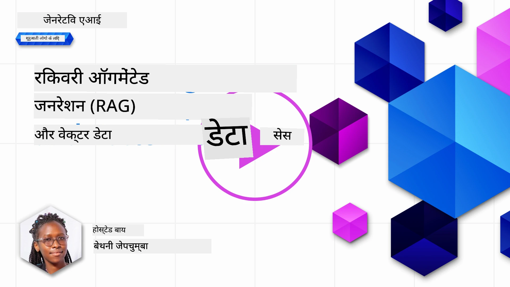
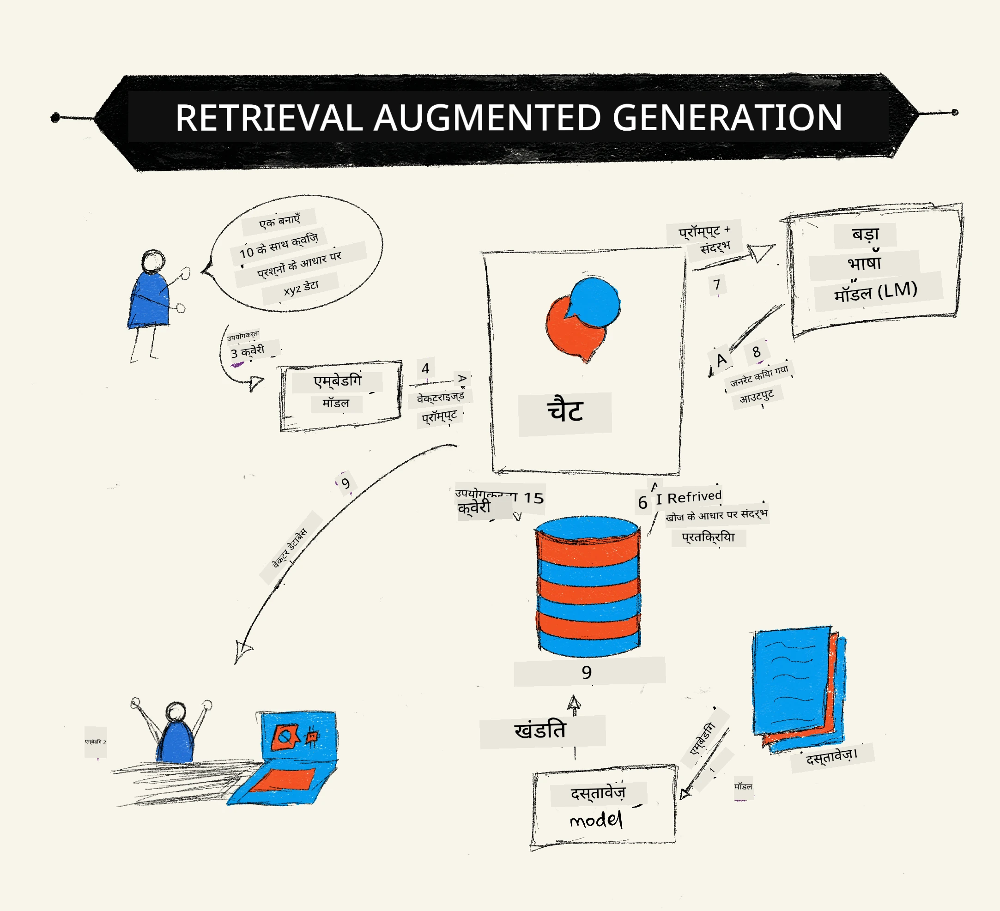
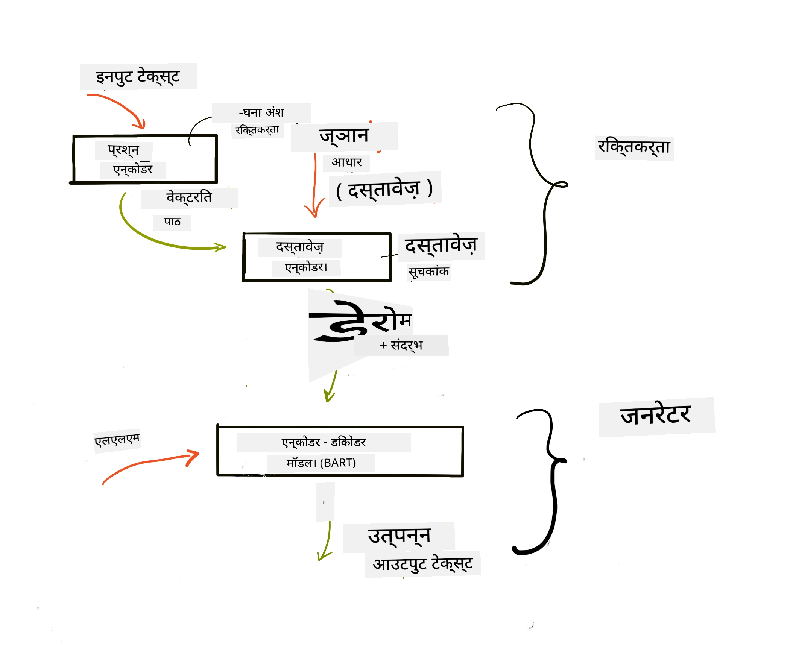
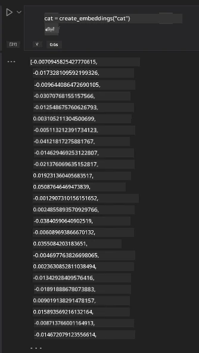

# रिट्रीवल ऑगमेंटेड जनरेशन (RAG) और वेक्टर डेटाबेस

[](https://youtu.be/4l8zhHUBeyI?si=BmvDmL1fnHtgQYkL)

खोज एप्लिकेशन पाठ में, हमने संक्षेप में सीखा कि अपने डेटा को बड़े भाषा मॉडलों (LLMs) में कैसे एकीकृत किया जाए। इस पाठ में, हम अपने LLM एप्लिकेशन में आपके डेटा को ग्राउंड करने की अवधारणाओं, प्रक्रिया के तंत्र और डेटा संग्रहीत करने के तरीकों, जिसमें एंबेडिंग और टेक्स्ट दोनों शामिल हैं, पर और गहराई से चर्चा करेंगे।

> **वीडियो जल्द आ रहा है**

## परिचय

इस पाठ में हम निम्नलिखित विषयों को कवर करेंगे:

- RAG का परिचय, यह क्या है और AI (कृत्रिम बुद्धिमत्ता) में इसका उपयोग क्यों किया जाता है।

- वेक्टर डेटाबेस क्या हैं इसे समझना और हमारे एप्लिकेशन के लिए एक बनाना।

- RAG को एक एप्लिकेशन में एकीकृत करने का एक व्यावहारिक उदाहरण।

## सीखने के उद्देश्य

इस पाठ को पूरा करने के बाद, आप सक्षम होंगे:

- डेटा पुनःप्राप्ति और प्रसंस्करण में RAG के महत्व को समझाएं।

- RAG एप्लिकेशन सेटअप करें और अपने डेटा को एक LLM से ग्राउंड करें।

- LLM एप्लिकेशन में RAG और वेक्टर डेटाबेस का प्रभावी रूप से एकीकरण।

## हमारा परिदृश्य: हमारे LLMs को हमारे अपने डेटा के साथ बेहतर बनाना

इस पाठ के लिए, हम अपनी शिक्षा स्टार्टअप में अपने स्वयं के नोट्स जोड़ना चाहते हैं, जिससे चैटबॉट विभिन्न विषयों पर अधिक जानकारी प्राप्त कर सके। हमारे पास मौजूद नोट्स का उपयोग करके, शिक्षार्थी बेहतर अध्ययन और विभिन्न विषयों को समझ सकेंगे, जिससे उनके परीक्षाओं के लिए पुनरावृत्ति आसान हो जाएगी। हमारा परिदृश्य बनाने के लिए, हम उपयोग करेंगे:

- `Azure OpenAI:` वह LLM जिसे हम अपना चैटबॉट बनाने के लिए उपयोग करेंगे।

- `AI for beginners' lesson on Neural Networks`: यह वह डेटा होगा जिस पर हम अपने LLM को ग्राउंड करेंगे।

- `Azure AI Search` और `Azure Cosmos DB:` वेक्टर डेटाबेस जिसमें हम अपने डेटा को स्टोर करेंगे और एक खोज सूचकांक बनाएंगे।

उपयोगकर्ता अपने नोट्स से अभ्यास क्विज़ बना सकेंगे, पुनरावृत्ति के लिए फ्लैश कार्ड्स बनाएंगे और इसे संक्षिप्त अवलोकनों में सारांशित कर सकेंगे। शुरू करने के लिए, आइए देखें कि RAG क्या है और यह कैसे काम करता है:

## रिट्रीवल ऑगमेंटेड जनरेशन (RAG)

एक LLM-संचालित चैटबॉट उपयोगकर्ता के संकेतों को संसाधित करता है और प्रतिक्रियाएँ उत्पन्न करता है। इसे संवादात्मक बनाया गया है और यह उपयोगकर्ताओं से विभिन्न विषयों पर बातचीत करता है। हालांकि, इसकी प्रतिक्रियाएं प्रदान किए गए संदर्भ और इसके मूल प्रशिक्षण डेटा तक सीमित होती हैं। उदाहरण के लिए, GPT-4 का ज्ञान सितंबर 2021 तक सीमित है, जिसका मतलब है कि इसे उस अवधि के बाद हुई घटनाओं का ज्ञान नहीं है। इसके अतिरिक्त, LLMs के प्रशिक्षण में गोपनीय जानकारी जैसे व्यक्तिगत नोट्स या कंपनी के उत्पाद मैनुअल को शामिल नहीं किया जाता।

### RAGs (रिट्रीवल ऑगमेंटेड जनरेशन) कैसे काम करते हैं



मान लीजिए आप एक ऐसा चैटबॉट तैनात करना चाहते हैं जो आपके नोट्स से क्विज़ बनाता है, इसके लिए आपको ज्ञान आधार से कनेक्शन की आवश्यकता होगी। यहाँ RAG मदद के लिए आता है। RAG इस प्रकार काम करता है:

- **ज्ञान आधार:** पुनःप्राप्ति से पहले, इन दस्तावेज़ों को इनजेस्ट और पूर्व-संसाधित किया जाना चाहिए, आमतौर पर बड़े दस्तावेजों को छोटे भागों में तोड़ना, उन्हें टेक्स्ट एंबेडिंग में परिवर्तित करना और डेटाबेस में संग्रहीत करना होता है।

- **उपयोगकर्ता प्रश्न:** उपयोगकर्ता कोई प्रश्न पूछता है।

- **पुनःप्राप्ति:** जब उपयोगकर्ता प्रश्न पूछता है, तो एंबेडिंग मॉडल हमारे ज्ञान आधार से प्रासंगिक जानकारी पुनःप्राप्त करता है ताकि अधिक संदर्भ प्रदान किया जा सके जिसे प्रॉम्प्ट में शामिल किया जाएगा।

- **ऑगमेंटेड जनरेशन:** LLM अपनी प्रतिक्रिया को पुनः प्राप्त डेटा के आधार पर सुधारता है। यह प्रतिक्रिया को न केवल पूर्व-प्रशिक्षित डेटा पर आधारित, बल्कि जोड़े गए संदर्भ से प्रासंगिक जानकारी के आधार पर भी बनाता है। पुनः प्राप्त डेटा का उपयोग LLM की प्रतिक्रियाओं को बढ़ाने के लिए किया जाता है। फिर LLM उपयोगकर्ता के प्रश्न का उत्तर प्रदान करता है।



RAGs की संरचना ट्रांसफॉर्मर्स का उपयोग करके दो भागों में लागू की जाती है: एक एन्कोडर और एक डिकोडर। उदाहरण के लिए, जब कोई उपयोगकर्ता प्रश्न पूछता है, तो इनपुट टेक्स्ट शब्दों के अर्थ को पकड़ने वाले वेक्टरों में 'एन्कोड' किया जाता है और वेक्टर हमारे दस्तावेज़ सूचकांक में 'डिकोड' होते हैं और उपयोगकर्ता प्रश्न के आधार पर नया टेक्स्ट उत्पन्न करते हैं। LLM आउटपुट उत्पन्न करने के लिए दोनों, एन्कोडर-डिकोडर मॉडल का उपयोग करता है।

RAG को लागू करने के दो तरीके प्रस्तावित पेपर [Retrieval-Augmented Generation for Knowledge intensive NLP (natural language processing software) Tasks](https://arxiv.org/pdf/2005.11401.pdf?WT.mc_id=academic-105485-koreyst) के अनुसार हैं:

- **_RAG-Sequence_**: प्राप्य दस्तावेजों का उपयोग करके उपयोगकर्ता प्रश्न का सर्वोत्तम संभव उत्तर अनुमानित करना

- **RAG-Token**: दस्तावेजों का उपयोग अगला टोकन उत्पन्न करने के लिए करना, फिर उन्हें पुनः प्राप्त करके उपयोगकर्ता के प्रश्न का उत्तर देना

### आप RAGs का उपयोग क्यों करेंगे? 

- **सूचना की समृद्धि:** यह सुनिश्चित करता है कि टेक्स्ट प्रतिक्रियाएं अद्यतित और वर्तमान हों। इसलिए, यह आंतरिक ज्ञान आधार तक पहुंच के माध्यम से डोमेन-विशिष्ट कार्यों पर प्रदर्शन में सुधार करता है।

- सत्यापनीय डेटा का उपयोग करके सवालों के संदर्भ में कमी को कम करता है, जिससे मिथ्या जानकारी की संभावना घटती है।

- यह **लागत प्रभावी** है क्योंकि यह एक LLM को फाइन-ट्यून करने की तुलना में अधिक किफायती है।

## ज्ञान आधार बनाना

हमारा एप्लिकेशन हमारे व्यक्तिगत डेटा, यानी AI For Beginners पाठ्यक्रम पर न्यूरल नेटवर्क पाठ पर आधारित है।

### वेक्टर डेटाबेस

एक वेक्टर डेटाबेस पारंपरिक डेटाबेस की तुलना में एक विशेष डेटाबेस होता है जो एंबेडेड वेक्टर संग्रहीत, प्रबंधित और खोजने के लिए डिज़ाइन किया गया होता है। यह दस्तावेजों के संख्यात्मक प्रतिनिधित्व को स्टोर करता है। डेटा को संख्यात्मक एंबेडिंग में तोड़ना हमारे AI सिस्टम के लिए डेटा को समझना और संसाधित करना आसान बनाता है।

हम अपनी एंबेडिंग वेक्टर डेटाबेस में संग्रहीत करते हैं क्योंकि LLMs के इनपुट के रूप में स्वीकार किए जाने वाले टोकनों की संख्या में सीमा होती है। चूंकि आप पूरी एंबेडिंग को LLM को पास नहीं कर सकते, इसलिए हमें उन्हें छोटे हिस्सों में तोड़ना होगा और जब उपयोगकर्ता प्रश्न पूछता है, तो प्रश्न के सबसे समान एंबेडिंग को प्रॉम्प्ट के साथ वापस किया जाएगा। चंकिंग LLM के माध्यम से पारित टोकनों की संख्या पर लागत भी कम करता है।

कुछ लोकप्रिय वेक्टर डेटाबेस में Azure Cosmos DB, Clarifyai, Pinecone, Chromadb, ScaNN, Qdrant और DeepLake शामिल हैं। आप Azure CLI का उपयोग करके Azure Cosmos DB मॉडल बना सकते हैं, जैसे कि निम्नलिखित कमांड द्वारा:

```bash
az login
az group create -n <resource-group-name> -l <location>
az cosmosdb create -n <cosmos-db-name> -r <resource-group-name>
az cosmosdb list-keys -n <cosmos-db-name> -g <resource-group-name>
```

### टेक्स्ट से एंबेडिंग तक

अपने डेटा को संग्रहीत करने से पहले, हमें इसे वेक्टर एंबेडिंग में परिवर्तित करना होगा ताकि इसे डेटाबेस में स्टोर किया जा सके। यदि आप बड़े दस्तावेज़ों या लंबे टेक्स्ट पर काम कर रहे हैं, तो आप उन्हें अपेक्षित प्रश्नों के आधार पर भागों में तोड़ सकते हैं। चंकिंग वाक्य स्तर पर या पैराग्राफ स्तर पर की जा सकती है। चंकिंग के आस-पास के शब्दों से अर्थ निकालती है, इसलिए आप चंक में अन्य संदर्भ जोड़ सकते हैं, उदाहरण के लिए, दस्तावेज़ शीर्षक जोड़कर या चंक के पहले या बाद में कुछ टेक्स्ट शामिल करके। आप डेटा को इस प्रकार चंक कर सकते हैं:

```python
def split_text(text, max_length, min_length):
    words = text.split()
    chunks = []
    current_chunk = []

    for word in words:
        current_chunk.append(word)
        if len(' '.join(current_chunk)) < max_length and len(' '.join(current_chunk)) > min_length:
            chunks.append(' '.join(current_chunk))
            current_chunk = []

    # यदि अंतिम खंड न्यूनतम लंबाई तक नहीं पहुंचा है, तो इसे फिर भी जोड़ें
    if current_chunk:
        chunks.append(' '.join(current_chunk))

    return chunks
```

चंकिंग के बाद, हम विभिन्न एंबेडिंग मॉडल का उपयोग करके अपने टेक्स्ट को एम्बेड कर सकते हैं। कुछ मॉडल जिनका आप उपयोग कर सकते हैं: word2vec, OpenAI का ada-002, Azure कंप्यूटर विज़न और बहुत कुछ। किस मॉडल का चयन करना है यह आपकी उपयोग की भाषा, एन्कोड किए जाने वाले कंटेंट का प्रकार (टेक्स्ट/इमेज/ऑडियो), इसके एन्कोड करने की क्षमता और एंबेडिंग आउटपुट की लंबाई पर निर्भर करेगा।

OpenAI के `text-embedding-ada-002` मॉडल द्वारा एंबेड किए गए टेक्स्ट का एक उदाहरण है:


## पुनः प्राप्ति और वेक्टर खोज

जब उपयोगकर्ता कोई प्रश्न पूछता है, पुनःप्राप्तकर्ता उसे क्वेरी एन्कोडर का उपयोग करके वेक्टर में परिवर्तित करता है, फिर हमारे दस्तावेज़ खोज सूचकांक में प्रासंगिक वेक्टरों के लिए खोज करता है जो इनपुट से संबंधित होते हैं। एक बार हो जाने पर, यह इनपुट वेक्टर और दस्तावेज़ वेक्टर दोनों को टेक्स्ट में परिवर्तित करता है और इसे LLM को पास करता है।

### पुनः प्राप्ति

पुनः प्राप्ति तब होती है जब सिस्टम जल्दी से उन दस्तावेजों को सूचकांक से ढूंढने की कोशिश करता है जो खोज मानदंडों को पूरा करते हैं। पुनःप्राप्तकर्ता का लक्ष्य ऐसे दस्तावेज प्राप्त करना है जो संदर्भ प्रदान करने और आपके डेटा पर LLM को ग्राउंड करने के लिए उपयोग किए जाएंगे।

हमारे डेटाबेस में खोज करने के कई तरीके हैं, जैसे:

- **कीवर्ड खोज** - टेक्स्ट खोज के लिए उपयोग की जाती है

- **वेक्टर खोज** - दस्तावेजों को टेक्स्ट से वेक्टर प्रतिनिधित्व में परिवर्तित करती है एंबेडिंग मॉडल का उपयोग करके, जिससे शब्दों के अर्थ के आधार पर **सामान्य अर्थ की खोज** संभव होती है। पुनः प्राप्ति उपयोगकर्ता के प्रश्न के सबसे करीब वेक्टरों वाले दस्तावेजों को क्वेरी करके की जाएगी।

- **हाइब्रिड** - कीवर्ड और वेक्टर खोज दोनों का संयोजन।

जब डेटाबेस में प्रश्न के समान कोई उत्तर नहीं होता, तब पुनः प्राप्ति में चुनौती आती है। सिस्टम फिर सबसे अच्छी जानकारी वापस करता है, हालांकि आप प्रासंगिकता के लिए अधिकतम दूरी सेट करने या हाइब्रिड खोज का उपयोग कर सकते हैं जो कीवर्ड और वेक्टर खोज को मिलाता है। इस पाठ में हम हाइब्रिड खोज का उपयोग करेंगे, यानी वेक्टर और कीवर्ड खोज दोनों का संयोजन। हम अपने डेटा को एक डेटा फ्रेम में संग्रहीत करेंगे जिसमें चंक और एंबेडिंग दोनों होंगे।

### वेक्टर समानता

पुनःप्राप्तकर्ता ज्ञान डेटाबेस में पास-पास एंबेडिंग की खोज करेगा, यानी जो सबसे निकटम पड़ोसी होंगे, क्योंकि वे समान टेक्स्ट होंगे। जब उपयोगकर्ता कोई प्रश्न पूछता है, तो इसे पहले एंबेड किया जाता है और फिर समान एंबेडिंग के साथ मिलाया जाता है। सबसे आम माप जो विभिन्न वेक्टरों की समानता देखने के लिए उपयोग होता है वह है कॉसाइन समानता, जो दो वेक्टरों के बीच कोण पर आधारित है।

समानता मापने के लिए हम अन्य विकल्पों का भी उपयोग कर सकते हैं जैसे यूलिडियन दूरी (वेक्टर एंडपॉइंट्स के बीच की सीधे रेखा) और डॉट प्रोडक्ट (दोनों वेक्टरों के संबंधित तत्वों के गुणा का योग)।

### खोज सूचकांक

पुनः प्राप्ति करते समय, हमें अपनी ज्ञान आधार के लिए खोज सूचकांक बनाना होगा इससे पहले कि हम खोज करें। एक सूचकांक हमारे एंबेडिंग को संग्रहीत करता है और बड़े डेटाबेस में भी सबसे समान चंक को जल्दी से पुनः प्राप्त कर सकता है। हम स्थानीय रूप से अपने सूचकांक इस प्रकार बना सकते हैं:

```python
from sklearn.neighbors import NearestNeighbors

embeddings = flattened_df['embeddings'].to_list()

# खोज अनुक्रमणिका बनाएं
nbrs = NearestNeighbors(n_neighbors=5, algorithm='ball_tree').fit(embeddings)

# अनुक्रमणिका से पूछताछ करने के लिए, आप kneighbors विधि का उपयोग कर सकते हैं
distances, indices = nbrs.kneighbors(embeddings)
```

### पुनः रैंकिंग

एक बार जब आप डेटाबेस को क्वेरी कर लेते हैं, तो आपको परिणामों को सबसे प्रासंगिक से क्रमबद्ध करने की आवश्यकता हो सकती है। एक पुनः रैंकिंग LLM मशीन लर्निंग का उपयोग करता है ताकि खोज परिणामों की प्रासंगिकता में सुधार हो और उन्हें सबसे प्रासंगिक से क्रमबद्ध किया जा सके। Azure AI Search का उपयोग करते समय, पुनः रैंकिंग आपके लिए स्वचालित रूप से एक सेमांटिक रीरेंकर द्वारा की जाती है। निकटतम पड़ोसियों का उपयोग करके पुनः रैंकिंग कैसे काम करती है इसका एक उदाहरण:

```python
# सबसे समान दस्तावेज़ खोजें
distances, indices = nbrs.kneighbors([query_vector])

index = []
# सबसे समान दस्तावेज़ मुद्रित करें
for i in range(3):
    index = indices[0][i]
    for index in indices[0]:
        print(flattened_df['chunks'].iloc[index])
        print(flattened_df['path'].iloc[index])
        print(flattened_df['distances'].iloc[index])
    else:
        print(f"Index {index} not found in DataFrame")
```

## सब कुछ एक साथ लाना

अंतिम चरण है हमारे LLM को शामिल करना ताकि हमें ऐसे उत्तर मिल सकें जो हमारे डेटा पर आधारित हों। हम इसे इस प्रकार लागू कर सकते हैं:

```python
user_input = "what is a perceptron?"

def chatbot(user_input):
    # प्रश्न को एक क्वेरी वेक्टर में बदलें
    query_vector = create_embeddings(user_input)

    # सबसे समान दस्तावेज़ खोजें
    distances, indices = nbrs.kneighbors([query_vector])

    # संदर्भ प्रदान करने के लिए दस्तावेज़ों को क्वेरी में जोड़ें
    history = []
    for index in indices[0]:
        history.append(flattened_df['chunks'].iloc[index])

    # इतिहास और उपयोगकर्ता इनपुट को संयोजित करें
    history.append(user_input)

    # एक संदेश वस्तु बनाएं
    messages=[
        {"role": "system", "content": "You are an AI assistant that helps with AI questions."},
        {"role": "user", "content": "\n\n".join(history) }
    ]

    # प्रतिक्रिया उत्पन्न करने के लिए Responses API का उपयोग करें
    response = client.responses.create(
        model="gpt-5-mini",
        max_output_tokens=800,
        input=messages,
        store=False,
    )

    return response.output_text

chatbot(user_input)
```

## हमारे एप्लिकेशन का मूल्यांकन

### मूल्यांकन मेट्रिक्स

- प्रदान की गई प्रतिक्रियाओं की गुणवत्ता यह सुनिश्चित करते हुए कि यह प्राकृतिक, प्रवाही और मानवीय लगे

- डेटा की ग्राउंडेडनेस: मूल्यांकन कि प्रतिक्रिया प्रदान किए गए डॉक्यूमेंट्स से आई है या नहीं

- प्रासंगिकता: मूल्यांकन कि प्रतिक्रिया प्रश्न से मेल खाती है और संबंधित है

- प्रवाह - मूल्यांकन कि प्रतिक्रिया व्याकरण के लिहाज से सार्थक है या नहीं

## RAG (रिट्रीवल ऑगमेंटेड जनरेशन) और वेक्टर डेटाबेस के उपयोग के मामले

कई विभिन्न उपयोग के मामले हैं जहां फ़ंक्शन कॉल आपके ऐप को बेहतर बना सकते हैं, जैसे:

- प्रश्न और उत्तर: अपने कंपनी के डेटा को ऐसे चैट से जोड़ना जिसे कर्मचारी प्रश्न पूछने के लिए इस्तेमाल कर सकते हैं।

- सिफारिश प्रणालियाँ: जहां आप ऐसी प्रणाली बना सकते हैं जो सब से समान मानों का मिलान करे, जैसे फिल्में, रेस्तरां और बहुत कुछ।

- चैटबॉट सेवाएँ: आप चैट का इतिहास संग्रहीत कर सकते हैं और उपयोगकर्ता डेटा के आधार पर वार्तालाप को वैयक्तिकृत कर सकते हैं।

- वेक्टर एंबेडिंग्स पर आधारित छवि खोज, जो छवि पहचान और अनियमितता पहचान में उपयोगी है।

## सारांश

हमने RAG के मूल क्षेत्रों को कवर किया है - एप्लिकेशन में हमारे डेटा को जोड़ना, उपयोगकर्ता प्रश्न और आउटपुट। RAG के निर्माण को सरल बनाने के लिए, आप Semanti Kernel, Langchain या Autogen जैसे फ्रेमवर्क का उपयोग कर सकते हैं।

## असाइनमेंट

रिट्रीवल ऑगमेंटेड जनरेशन (RAG) सीखना जारी रखने के लिए आप बना सकते हैं:

- अपनी पसंद के फ्रेमवर्क का उपयोग करके एप्लिकेशन के लिए फ्रंट-एंड बनाएं

- एक फ्रेमवर्क, चाहे LangChain या Semantic Kernel का उपयोग करें, और अपने एप्लिकेशन को पुनः बनाएँ।

पाठ पूरा करने के लिए बधाई 👏।

## सीखना यहीं खत्म नहीं होता, यात्रा जारी रखें

इस पाठ को पूरा करने के बाद, हमारी [Generative AI Learning collection](https://aka.ms/genai-collection?WT.mc_id=academic-105485-koreyst) देखें ताकि आप अपनी जेनेरेटिव AI ज्ञान को और बढ़ा सकें!

---

<!-- CO-OP TRANSLATOR DISCLAIMER START -->
**अस्वीकरण**:
इस दस्तावेज़ का अनुवाद AI अनुवाद सेवा [Co-op Translator](https://github.com/Azure/co-op-translator) का उपयोग करके किया गया है। जबकि हम सटीकता के लिए प्रयास करते हैं, कृपया ध्यान दें कि स्वचालित अनुवादों में त्रुटियाँ या अशुद्धियाँ हो सकती हैं। मूल दस्तावेज़ अपनी मूल भाषा में ही प्रामाणिक स्रोत माना जाना चाहिए। महत्वपूर्ण जानकारी के लिए, पेशेवर मानव अनुवाद की सिफारिश की जाती है। इस अनुवाद के उपयोग से उत्पन्न किसी भी गलतफहमी या गलत व्याख्या के लिए हम उत्तरदायी नहीं हैं।
<!-- CO-OP TRANSLATOR DISCLAIMER END -->