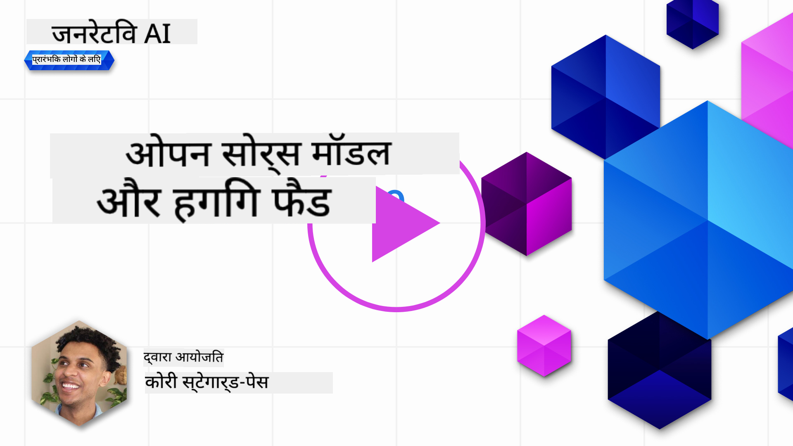
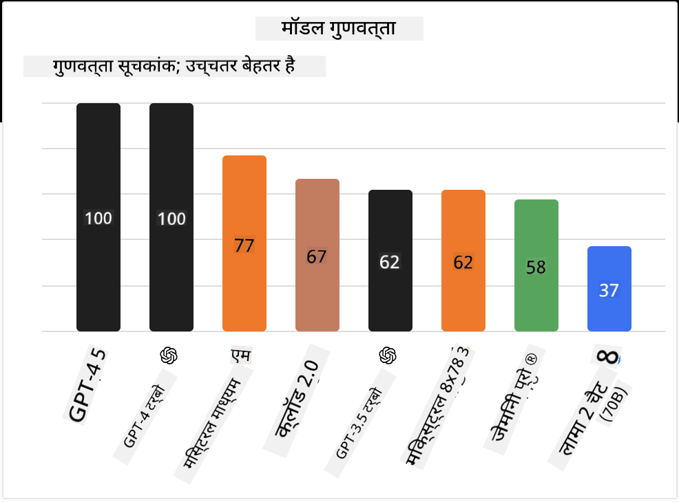

<!--
CO_OP_TRANSLATOR_METADATA:
{
  "original_hash": "0bba96e53ab841d99db731892a51fab8",
  "translation_date": "2025-07-09T17:06:44+00:00",
  "source_file": "16-open-source-models/README.md",
  "language_code": "hi"
}
-->

## परिचय

ओपन-सोर्स LLMs की दुनिया रोमांचक और लगातार विकसित हो रही है। इस पाठ का उद्देश्य ओपन सोर्स मॉडल्स पर गहराई से जानकारी प्रदान करना है। यदि आप यह जानना चाहते हैं कि प्रोपाइटरी मॉडल्स की तुलना ओपन सोर्स मॉडल्स से कैसे होती है, तो ["Exploring and Comparing Different LLMs" पाठ](../02-exploring-and-comparing-different-llms/README.md?WT.mc_id=academic-105485-koreyst) देखें। यह पाठ फाइन-ट्यूनिंग के विषय को भी कवर करेगा, लेकिन अधिक विस्तृत व्याख्या के लिए ["Fine-Tuning LLMs" पाठ](../18-fine-tuning/README.md?WT.mc_id=academic-105485-koreyst) देखें।

## सीखने के लक्ष्य

- ओपन सोर्स मॉडल्स की समझ प्राप्त करना  
- ओपन सोर्स मॉडल्स के साथ काम करने के लाभ समझना  
- Hugging Face और Azure AI Studio पर उपलब्ध ओपन मॉडल्स का अन्वेषण करना  

## ओपन सोर्स मॉडल्स क्या हैं?

ओपन सोर्स सॉफ़्टवेयर ने विभिन्न क्षेत्रों में तकनीक के विकास में महत्वपूर्ण भूमिका निभाई है। Open Source Initiative (OSI) ने [10 मानदंड](https://web.archive.org/web/20241126001143/https://opensource.org/osd?WT.mc_id=academic-105485-koreyst) निर्धारित किए हैं जिनके आधार पर सॉफ़्टवेयर को ओपन सोर्स माना जाता है। स्रोत कोड को OSI द्वारा अनुमोदित लाइसेंस के तहत खुलकर साझा किया जाना चाहिए।

जहां LLMs का विकास सॉफ़्टवेयर विकास से मिलता-जुलता है, प्रक्रिया पूरी तरह से समान नहीं है। इस कारण से, LLMs के संदर्भ में ओपन सोर्स की परिभाषा पर समुदाय में काफी चर्चा हुई है। पारंपरिक ओपन सोर्स परिभाषा के अनुसार, एक मॉडल के लिए निम्नलिखित जानकारी सार्वजनिक रूप से उपलब्ध होनी चाहिए:

- मॉडल को प्रशिक्षित करने के लिए उपयोग किए गए डेटासेट  
- प्रशिक्षण के दौरान पूर्ण मॉडल वेट्स  
- मूल्यांकन कोड  
- फाइन-ट्यूनिंग कोड  
- पूर्ण मॉडल वेट्स और प्रशिक्षण मेट्रिक्स  

वर्तमान में केवल कुछ मॉडल ही इस मानदंड को पूरा करते हैं। [Allen Institute for Artificial Intelligence (AllenAI) द्वारा बनाया गया OLMo मॉडल](https://huggingface.co/allenai/OLMo-7B?WT.mc_id=academic-105485-koreyst) इस श्रेणी में आता है।

इस पाठ में, हम आगे "ओपन मॉडल्स" शब्द का उपयोग करेंगे क्योंकि ये मॉडल लेखन के समय ऊपर दिए गए मानदंडों से पूरी तरह मेल नहीं खा सकते।

## ओपन मॉडल्स के लाभ

**अत्यधिक अनुकूलन योग्य** - चूंकि ओपन मॉडल्स विस्तृत प्रशिक्षण जानकारी के साथ जारी किए जाते हैं, शोधकर्ता और डेवलपर्स मॉडल के आंतरिक हिस्सों को संशोधित कर सकते हैं। इससे विशिष्ट कार्य या अध्ययन क्षेत्र के लिए फाइन-ट्यून किए गए अत्यंत विशेषज्ञ मॉडल बनाने में मदद मिलती है। उदाहरण के लिए कोड जनरेशन, गणितीय संचालन और जीवविज्ञान।

**लागत** - इन मॉडल्स का उपयोग और तैनाती प्रति टोकन लागत प्रोपाइटरी मॉडल्स की तुलना में कम होती है। जब जनरेटिव AI एप्लिकेशन बनाते हैं, तो प्रदर्शन और कीमत के बीच संतुलन पर ध्यान देना चाहिए।

  
स्रोत: Artificial Analysis

**लचीलापन** - ओपन मॉडल्स के साथ काम करने से आप विभिन्न मॉडल्स का उपयोग करने या उन्हें संयोजित करने में लचीलापन प्राप्त करते हैं। उदाहरण के लिए [HuggingChat Assistants](https://huggingface.co/chat?WT.mc_id=academic-105485-koreyst) में उपयोगकर्ता सीधे यूजर इंटरफेस में मॉडल चुन सकता है:

## विभिन्न ओपन मॉडल्स का अन्वेषण

### Llama 2

[LLama2](https://huggingface.co/meta-llama?WT.mc_id=academic-105485-koreyst), जो Meta द्वारा विकसित है, एक ओपन मॉडल है जो चैट आधारित एप्लिकेशन के लिए अनुकूलित है। इसका कारण इसका फाइन-ट्यूनिंग तरीका है, जिसमें बड़ी मात्रा में संवाद और मानव प्रतिक्रिया शामिल है। इस विधि से मॉडल ऐसे परिणाम देता है जो मानव अपेक्षाओं के अधिक निकट होते हैं, जिससे बेहतर उपयोगकर्ता अनुभव मिलता है।

Llama के फाइन-ट्यून किए गए संस्करणों के उदाहरण हैं [Japanese Llama](https://huggingface.co/elyza/ELYZA-japanese-Llama-2-7b?WT.mc_id=academic-105485-koreyst), जो जापानी भाषा में विशेषज्ञता रखता है, और [Llama Pro](https://huggingface.co/TencentARC/LLaMA-Pro-8B?WT.mc_id=academic-105485-koreyst), जो बेस मॉडल का उन्नत संस्करण है।

### Mistral

[Mistral](https://huggingface.co/mistralai?WT.mc_id=academic-105485-koreyst) एक ओपन मॉडल है जो उच्च प्रदर्शन और दक्षता पर केंद्रित है। यह Mixture-of-Experts दृष्टिकोण का उपयोग करता है, जिसमें विशेषज्ञ मॉडल्स के समूह को एक सिस्टम में जोड़ा जाता है, जहां इनपुट के आधार पर कुछ मॉडल्स का चयन किया जाता है। इससे गणना अधिक प्रभावी होती है क्योंकि मॉडल केवल उन्हीं इनपुट्स को संबोधित करते हैं जिनमें वे विशेषज्ञ होते हैं।

Mistral के फाइन-ट्यून किए गए संस्करणों के उदाहरण हैं [BioMistral](https://huggingface.co/BioMistral/BioMistral-7B?text=Mon+nom+est+Thomas+et+mon+principal?WT.mc_id=academic-105485-koreyst), जो चिकित्सा क्षेत्र पर केंद्रित है, और [OpenMath Mistral](https://huggingface.co/nvidia/OpenMath-Mistral-7B-v0.1-hf?WT.mc_id=academic-105485-koreyst), जो गणितीय गणना करता है।

### Falcon

[Falcon](https://huggingface.co/tiiuae?WT.mc_id=academic-105485-koreyst) एक LLM है जिसे Technology Innovation Institute (**TII**) ने बनाया है। Falcon-40B को 40 बिलियन पैरामीटर्स पर प्रशिक्षित किया गया है, जो कम कंप्यूटिंग बजट में GPT-3 से बेहतर प्रदर्शन करता है। इसका कारण FlashAttention एल्गोरिदम और मल्टीक्वेरी अटेंशन का उपयोग है, जो इन्फरेंस समय में मेमोरी की जरूरतों को कम करता है। इस कम इन्फरेंस समय के कारण, Falcon-40B चैट एप्लिकेशन के लिए उपयुक्त है।

Falcon के फाइन-ट्यून किए गए संस्करणों के उदाहरण हैं [OpenAssistant](https://huggingface.co/OpenAssistant/falcon-40b-sft-top1-560?WT.mc_id=academic-105485-koreyst), जो ओपन मॉडल्स पर आधारित एक सहायक है, और [GPT4ALL](https://huggingface.co/nomic-ai/gpt4all-falcon?WT.mc_id=academic-105485-koreyst), जो बेस मॉडल से बेहतर प्रदर्शन प्रदान करता है।

## कैसे चुनें

ओपन मॉडल चुनने का कोई एक सही उत्तर नहीं है। शुरुआत के लिए Azure AI Studio के टास्क द्वारा फ़िल्टर फीचर का उपयोग करना अच्छा होता है। इससे आपको यह समझने में मदद मिलेगी कि मॉडल किस प्रकार के कार्यों के लिए प्रशिक्षित है। Hugging Face भी एक LLM लीडरबोर्ड रखता है जो कुछ मेट्रिक्स के आधार पर सर्वश्रेष्ठ प्रदर्शन करने वाले मॉडल दिखाता है।

विभिन्न प्रकार के LLMs की तुलना करने के लिए, [Artificial Analysis](https://artificialanalysis.ai/?WT.mc_id=academic-105485-koreyst) एक और बेहतरीन संसाधन है:

  
स्रोत: Artificial Analysis

यदि आप किसी विशिष्ट उपयोग मामले पर काम कर रहे हैं, तो उसी क्षेत्र पर केंद्रित फाइन-ट्यून किए गए संस्करणों की खोज करना प्रभावी हो सकता है। कई ओपन मॉडल्स के साथ प्रयोग करना और देखना कि वे आपकी और आपके उपयोगकर्ताओं की अपेक्षाओं के अनुसार कैसे प्रदर्शन करते हैं, एक अच्छी प्रैक्टिस है।

## अगले कदम

ओपन मॉडल्स का सबसे अच्छा हिस्सा यह है कि आप इनके साथ काम करना जल्दी शुरू कर सकते हैं। [Azure AI Studio Model Catalog](https://ai.azure.com?WT.mc_id=academic-105485-koreyst) देखें, जिसमें Hugging Face का एक विशेष संग्रह है जिसमें हमने यहां चर्चा किए गए मॉडल शामिल हैं।

## सीखना यहीं खत्म नहीं होता, यात्रा जारी रखें

इस पाठ को पूरा करने के बाद, हमारे [Generative AI Learning collection](https://aka.ms/genai-collection?WT.mc_id=academic-105485-koreyst) को देखें और अपने जनरेटिव AI ज्ञान को और बढ़ाएं!

**अस्वीकरण**:  
यह दस्तावेज़ AI अनुवाद सेवा [Co-op Translator](https://github.com/Azure/co-op-translator) का उपयोग करके अनुवादित किया गया है। जबकि हम सटीकता के लिए प्रयासरत हैं, कृपया ध्यान दें कि स्वचालित अनुवादों में त्रुटियाँ या अशुद्धियाँ हो सकती हैं। मूल दस्तावेज़ अपनी मूल भाषा में ही अधिकारिक स्रोत माना जाना चाहिए। महत्वपूर्ण जानकारी के लिए, पेशेवर मानव अनुवाद की सलाह दी जाती है। इस अनुवाद के उपयोग से उत्पन्न किसी भी गलतफहमी या गलत व्याख्या के लिए हम जिम्मेदार नहीं हैं।