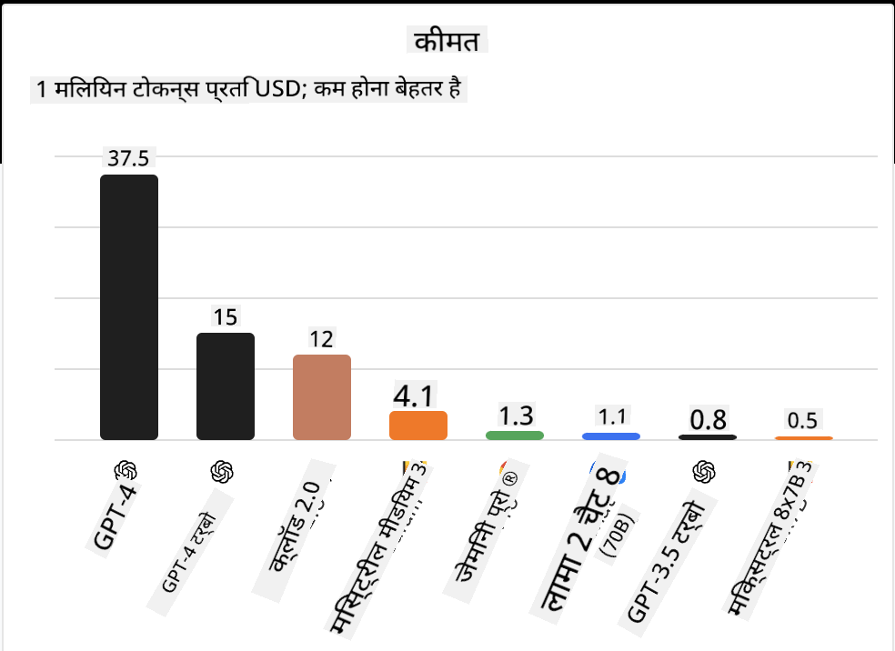
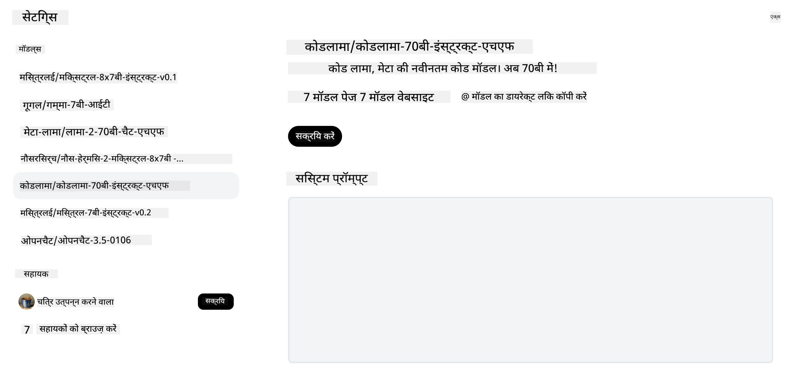

<!--
CO_OP_TRANSLATOR_METADATA:
{
  "original_hash": "0bba96e53ab841d99db731892a51fab8",
  "translation_date": "2025-05-20T06:50:44+00:00",
  "source_file": "16-open-source-models/README.md",
  "language_code": "hi"
}
-->

## परिचय

ओपन-सोर्स LLMs की दुनिया रोमांचक और लगातार बदलती रहती है। इस पाठ का उद्देश्य ओपन सोर्स मॉडल्स पर गहराई से नज़र डालना है। यदि आप यह जानना चाहते हैं कि स्वामित्व वाले मॉडल्स की तुलना ओपन सोर्स मॉडल्स से कैसे होती है, तो ["विभिन्न LLMs का अन्वेषण और तुलना" पाठ](../02-exploring-and-comparing-different-llms/README.md?WT.mc_id=academic-105485-koreyst) पर जाएं। यह पाठ फाइन-ट्यूनिंग के विषय को भी कवर करेगा, लेकिन अधिक विस्तृत व्याख्या ["फाइन-ट्यूनिंग LLMs" पाठ](../18-fine-tuning/README.md?WT.mc_id=academic-105485-koreyst) में पाई जा सकती है।

## सीखने के लक्ष्य

- ओपन सोर्स मॉडल्स की समझ प्राप्त करें
- ओपन सोर्स मॉडल्स के साथ काम करने के लाभ समझें
- हगिंग फेस और Azure AI स्टूडियो पर उपलब्ध ओपन मॉडल्स का अन्वेषण करें

## ओपन सोर्स मॉडल्स क्या हैं?

ओपन सोर्स सॉफ्टवेयर ने विभिन्न क्षेत्रों में प्रौद्योगिकी की वृद्धि में महत्वपूर्ण भूमिका निभाई है। ओपन सोर्स इनिशिएटिव (OSI) ने सॉफ्टवेयर को ओपन सोर्स के रूप में वर्गीकृत करने के लिए [10 मानदंड](https://web.archive.org/web/20241126001143/https://opensource.org/osd?WT.mc_id=academic-105485-koreyst) परिभाषित किए हैं। स्रोत कोड को OSI द्वारा अनुमोदित लाइसेंस के तहत खुले तौर पर साझा किया जाना चाहिए।

हालांकि LLMs का विकास सॉफ्टवेयर विकास के समान तत्वों को साझा करता है, प्रक्रिया बिल्कुल समान नहीं है। इसने LLMs के संदर्भ में ओपन सोर्स की परिभाषा पर समुदाय में बहुत चर्चा को जन्म दिया है। एक मॉडल को पारंपरिक ओपन सोर्स परिभाषा के साथ संरेखित करने के लिए निम्नलिखित जानकारी सार्वजनिक रूप से उपलब्ध होनी चाहिए:

- मॉडल को प्रशिक्षित करने के लिए उपयोग किए गए डेटासेट।
- प्रशिक्षण के एक हिस्से के रूप में पूर्ण मॉडल वेट्स।
- मूल्यांकन कोड।
- फाइन-ट्यूनिंग कोड।
- पूर्ण मॉडल वेट्स और प्रशिक्षण मेट्रिक्स।

वर्तमान में केवल कुछ मॉडल्स ही इस मानदंड से मेल खाते हैं। [एल्मो मॉडल जो एलन इंस्टीट्यूट फॉर आर्टिफिशियल इंटेलिजेंस (AllenAI) द्वारा बनाया गया है](https://huggingface.co/allenai/OLMo-7B?WT.mc_id=academic-105485-koreyst) इस श्रेणी में आता है।

इस पाठ के लिए, हम इन मॉडल्स को "ओपन मॉडल्स" के रूप में संदर्भित करेंगे क्योंकि वे लेखन के समय उपरोक्त मानदंड से मेल नहीं खा सकते हैं।

## ओपन मॉडल्स के लाभ

**अत्यधिक अनुकूलन योग्य** - चूंकि ओपन मॉडल्स विस्तृत प्रशिक्षण जानकारी के साथ जारी किए जाते हैं, शोधकर्ता और डेवलपर्स मॉडल के आंतरिक भागों को संशोधित कर सकते हैं। यह विशिष्ट कार्य या अध्ययन के क्षेत्र के लिए अत्यधिक विशेष मॉडल्स के निर्माण को सक्षम बनाता है। कुछ उदाहरण हैं कोड जनरेशन, गणितीय संचालन और जीवविज्ञान।

**लागत** - इन मॉडल्स का उपयोग और तैनाती के लिए प्रति टोकन लागत स्वामित्व वाले मॉडल्स की तुलना में कम होती है। जनरेटिव AI अनुप्रयोगों का निर्माण करते समय, अपने उपयोग के मामले में इन मॉडल्स के साथ काम करते समय प्रदर्शन बनाम मूल्य को देखना चाहिए।

  
स्रोत: आर्टिफिशियल एनालिसिस

**लचीलापन** - ओपन मॉडल्स के साथ काम करने से आपको विभिन्न मॉडल्स का उपयोग करने या उन्हें संयोजित करने में लचीलापन मिलता है। इसका एक उदाहरण है [हगिंगचैट असिस्टेंट्स](https://huggingface.co/chat?WT.mc_id=academic-105485-koreyst) जहां उपयोगकर्ता सीधे उपयोगकर्ता इंटरफ़ेस में उपयोग किए जा रहे मॉडल का चयन कर सकता है:

## विभिन्न ओपन मॉडल्स का अन्वेषण

### Llama 2

[LLama2](https://huggingface.co/meta-llama?WT.mc_id=academic-105485-koreyst), Meta द्वारा विकसित किया गया एक ओपन मॉडल है जो चैट आधारित अनुप्रयोगों के लिए अनुकूलित है। यह इसके फाइन-ट्यूनिंग विधि के कारण है, जिसमें संवाद और मानव प्रतिक्रिया की एक बड़ी मात्रा शामिल थी। इस विधि के साथ, मॉडल अधिक परिणाम उत्पन्न करता है जो मानव अपेक्षा के अनुरूप होते हैं, जो बेहतर उपयोगकर्ता अनुभव प्रदान करता है।

Llama के कुछ फाइन-ट्यून किए गए संस्करणों के उदाहरणों में शामिल हैं [Japanese Llama](https://huggingface.co/elyza/ELYZA-japanese-Llama-2-7b?WT.mc_id=academic-105485-koreyst), जो जापानी में विशेष है और [Llama Pro](https://huggingface.co/TencentARC/LLaMA-Pro-8B?WT.mc_id=academic-105485-koreyst), जो बेस मॉडल का एक उन्नत संस्करण है।

### Mistral

[Mistral](https://huggingface.co/mistralai?WT.mc_id=academic-105485-koreyst) एक ओपन मॉडल है जो उच्च प्रदर्शन और दक्षता पर केंद्रित है। यह विशेषज्ञों के मिश्रण की विधि का उपयोग करता है जो एक समूह में विशेष विशेषज्ञ मॉडल्स को एक प्रणाली में जोड़ता है जहां इनपुट के आधार पर, कुछ मॉडल्स का चयन किया जाता है। यह गणना को अधिक प्रभावी बनाता है क्योंकि मॉडल्स केवल उन इनपुट्स को संबोधित कर रहे हैं जिनमें वे विशेष हैं।

Mistral के कुछ फाइन-ट्यून किए गए संस्करणों के उदाहरणों में शामिल हैं [BioMistral](https://huggingface.co/BioMistral/BioMistral-7B?text=Mon+nom+est+Thomas+et+mon+principal?WT.mc_id=academic-105485-koreyst), जो चिकित्सा क्षेत्र पर केंद्रित है और [OpenMath Mistral](https://huggingface.co/nvidia/OpenMath-Mistral-7B-v0.1-hf?WT.mc_id=academic-105485-koreyst), जो गणितीय गणना करता है।

### Falcon

[Falcon](https://huggingface.co/tiiuae?WT.mc_id=academic-105485-koreyst) एक LLM है जिसे टेक्नोलॉजी इनोवेशन इंस्टीट्यूट (**TII**) द्वारा बनाया गया है। Falcon-40B को 40 अरब पैरामीटर पर प्रशिक्षित किया गया था, जो GPT-3 की तुलना में कम गणना बजट के साथ बेहतर प्रदर्शन करता है। यह इसके फ्लैशअटेंशन एल्गोरिदम और मल्टीक्वेरी अटेंशन के उपयोग के कारण है जो इसे अनुमान के समय मेमोरी आवश्यकताओं को कम करने में सक्षम बनाता है। इस कम अनुमान समय के साथ, Falcon-40B चैट अनुप्रयोगों के लिए उपयुक्त है।

Falcon के कुछ फाइन-ट्यून किए गए संस्करणों के उदाहरण हैं [OpenAssistant](https://huggingface.co/OpenAssistant/falcon-40b-sft-top1-560?WT.mc_id=academic-105485-koreyst), ओपन मॉडल्स पर आधारित एक सहायक और [GPT4ALL](https://huggingface.co/nomic-ai/gpt4all-falcon?WT.mc_id=academic-105485-koreyst), जो बेस मॉडल की तुलना में उच्च प्रदर्शन प्रदान करता है।

## कैसे चुनें

ओपन मॉडल चुनने के लिए कोई एक उत्तर नहीं है। शुरू करने के लिए एक अच्छा स्थान Azure AI स्टूडियो के टास्क द्वारा फ़िल्टर करने की सुविधा का उपयोग करना है। यह आपको यह समझने में मदद करेगा कि मॉडल को किस प्रकार के कार्यों के लिए प्रशिक्षित किया गया है। हगिंग फेस भी एक LLM लीडरबोर्ड बनाए रखता है जो आपको कुछ मेट्रिक्स के आधार पर सर्वश्रेष्ठ प्रदर्शन करने वाले मॉडल्स दिखाता है।

विभिन्न प्रकारों में LLMs की तुलना करने के लिए [आर्टिफिशियल एनालिसिस](https://artificialanalysis.ai/?WT.mc_id=academic-105485-koreyst) एक और शानदार संसाधन है:

  
स्रोत: आर्टिफिशियल एनालिसिस

यदि किसी विशिष्ट उपयोग मामले पर काम कर रहे हैं, तो उसी क्षेत्र पर केंद्रित फाइन-ट्यून किए गए संस्करणों की खोज करना प्रभावी हो सकता है। अपने और अपने उपयोगकर्ताओं की अपेक्षाओं के अनुसार प्रदर्शन करने के लिए कई ओपन मॉडल्स के साथ प्रयोग करना एक और अच्छा अभ्यास है।

## अगले कदम

ओपन मॉडल्स के बारे में सबसे अच्छी बात यह है कि आप उनके साथ काम करना जल्दी शुरू कर सकते हैं। [Azure AI स्टूडियो मॉडल कैटलॉग](https://ai.azure.com?WT.mc_id=academic-105485-koreyst) देखें, जिसमें हगिंग फेस संग्रह के साथ ये मॉडल्स शामिल हैं जिन पर हमने यहां चर्चा की।

## सीखना यहाँ नहीं रुकता, यात्रा जारी रखें

इस पाठ को पूरा करने के बाद, हमारे [जनरेटिव AI लर्निंग संग्रह](https://aka.ms/genai-collection?WT.mc_id=academic-105485-koreyst) को देखें ताकि आप अपनी जनरेटिव AI ज्ञान को और बढ़ा सकें!

**अस्वीकरण**:  
इस दस्तावेज़ का अनुवाद AI अनुवाद सेवा [Co-op Translator](https://github.com/Azure/co-op-translator) का उपयोग करके किया गया है। जबकि हम सटीकता के लिए प्रयासरत हैं, कृपया ध्यान दें कि स्वचालित अनुवादों में त्रुटियाँ या अशुद्धियाँ हो सकती हैं। मूल दस्तावेज़ को उसकी मूल भाषा में अधिकारिक स्रोत माना जाना चाहिए। महत्वपूर्ण जानकारी के लिए, पेशेवर मानव अनुवाद की सिफारिश की जाती है। इस अनुवाद के उपयोग से उत्पन्न किसी भी गलतफहमी या गलत व्याख्या के लिए हम उत्तरदायी नहीं हैं।