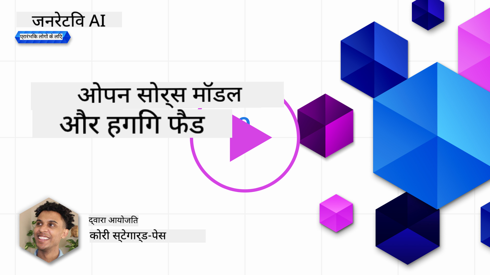
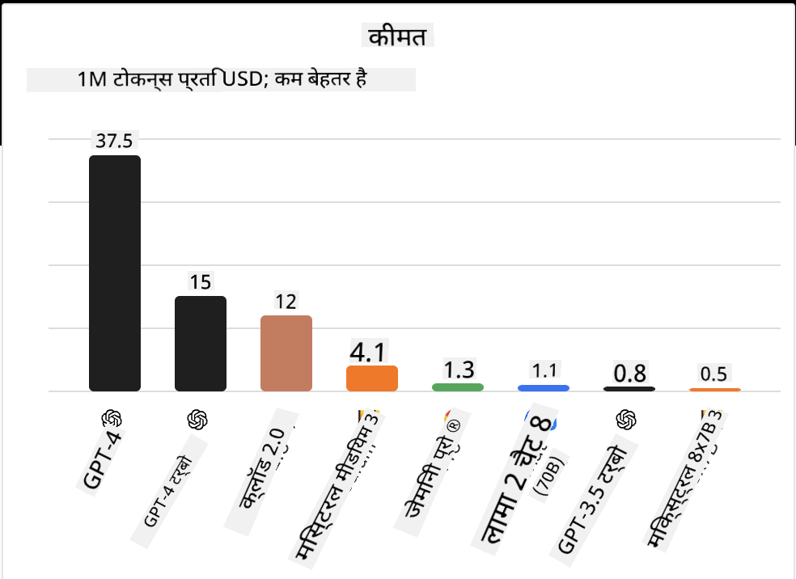
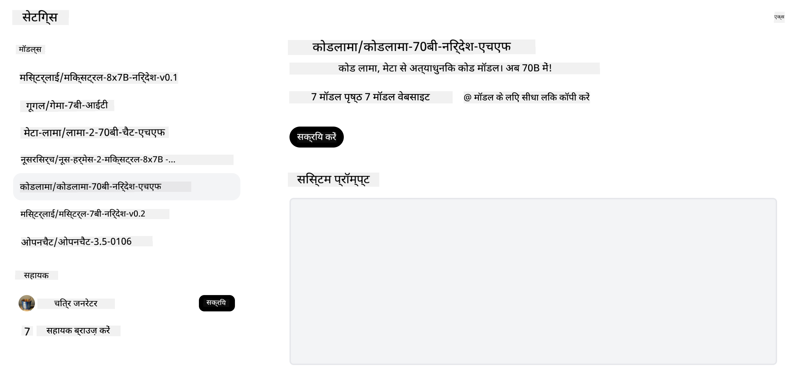
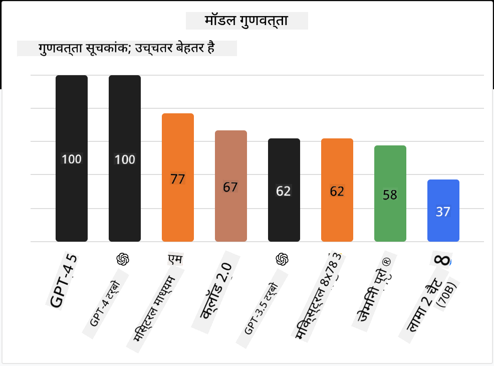

<!--
CO_OP_TRANSLATOR_METADATA:
{
  "original_hash": "0bba96e53ab841d99db731892a51fab8",
  "translation_date": "2025-06-25T23:52:09+00:00",
  "source_file": "16-open-source-models/README.md",
  "language_code": "hi"
}
-->

## परिचय

ओपन-सोर्स LLMs की दुनिया रोमांचक और लगातार विकसित हो रही है। यह पाठ ओपन सोर्स मॉडल्स पर गहराई से नज़र डालने का उद्देश्य रखता है। यदि आप जानना चाहते हैं कि मालिकाना मॉडल्स की तुलना ओपन सोर्स मॉडल्स से कैसे होती है, तो ["विभिन्न LLMs की खोज और तुलना" पाठ](../02-exploring-and-comparing-different-llms/README.md?WT.mc_id=academic-105485-koreyst) पर जाएं। यह पाठ फाइन-ट्यूनिंग के विषय को भी कवर करेगा लेकिन अधिक विस्तृत व्याख्या ["फाइन-ट्यूनिंग LLMs" पाठ](../18-fine-tuning/README.md?WT.mc_id=academic-105485-koreyst) में पाई जा सकती है।

## सीखने के लक्ष्य

- ओपन सोर्स मॉडल्स की समझ प्राप्त करें
- ओपन सोर्स मॉडल्स के साथ काम करने के लाभ समझें
- हगिंग फेस और Azure AI स्टूडियो पर उपलब्ध ओपन मॉडल्स की खोज करें

## ओपन सोर्स मॉडल्स क्या हैं?

ओपन सोर्स सॉफ़्टवेयर ने विभिन्न क्षेत्रों में प्रौद्योगिकी की वृद्धि में महत्वपूर्ण भूमिका निभाई है। ओपन सोर्स इनिशिएटिव (OSI) ने सॉफ़्टवेयर को ओपन सोर्स के रूप में वर्गीकृत करने के लिए [10 मानदंड](https://web.archive.org/web/20241126001143/https://opensource.org/osd?WT.mc_id=academic-105485-koreyst) परिभाषित किए हैं। स्रोत कोड को OSI द्वारा अनुमोदित लाइसेंस के तहत खुले तौर पर साझा किया जाना चाहिए।

हालांकि LLMs का विकास सॉफ़्टवेयर विकसित करने के समान तत्वों के साथ होता है, प्रक्रिया बिल्कुल समान नहीं है। यह LLMs के संदर्भ में ओपन सोर्स की परिभाषा पर समुदाय में बहुत चर्चा ला चुका है। एक मॉडल को पारंपरिक ओपन सोर्स की परिभाषा के अनुरूप बनाने के लिए निम्नलिखित जानकारी सार्वजनिक रूप से उपलब्ध होनी चाहिए:

- मॉडल को प्रशिक्षित करने के लिए उपयोग किए गए डेटा सेट।
- प्रशिक्षण के हिस्से के रूप में पूर्ण मॉडल वेट्स।
- मूल्यांकन कोड।
- फाइन-ट्यूनिंग कोड।
- पूर्ण मॉडल वेट्स और प्रशिक्षण मेट्रिक्स।

वर्तमान में केवल कुछ मॉडल्स हैं जो इस मानदंड से मेल खाते हैं। [Allen Institute for Artificial Intelligence (AllenAI) द्वारा बनाया गया OLMo मॉडल](https://huggingface.co/allenai/OLMo-7B?WT.mc_id=academic-105485-koreyst) इस श्रेणी में फिट बैठता है।

इस पाठ के लिए, हम आगे "ओपन मॉडल्स" के रूप में मॉडल्स का उल्लेख करेंगे क्योंकि वे लेखन के समय उपरोक्त मानदंड से मेल नहीं खाते हो सकते हैं।

## ओपन मॉडल्स के लाभ

**उच्च रूप से अनुकूलन योग्य** - चूंकि ओपन मॉडल्स विस्तृत प्रशिक्षण जानकारी के साथ जारी किए जाते हैं, शोधकर्ता और डेवलपर्स मॉडल के आंतरिक हिस्सों को संशोधित कर सकते हैं। यह विशेष कार्य या अध्ययन के क्षेत्र के लिए फाइन-ट्यून किए गए अत्यधिक विशिष्ट मॉडल्स बनाने में सक्षम बनाता है। इसके कुछ उदाहरण कोड जेनरेशन, गणितीय संचालन और जीवविज्ञान हैं।

**लागत** - इन मॉडल्स का उपयोग और तैनाती करने की लागत प्रति टोकन मालिकाना मॉडल्स की तुलना में कम होती है। जनरेटिव AI अनुप्रयोगों का निर्माण करते समय, प्रदर्शन बनाम कीमत को अपने उपयोग के मामले पर काम करते समय देखा जाना चाहिए।

स्रोत: कृत्रिम विश्लेषण

**लचीलापन** - ओपन मॉडल्स के साथ काम करने से आप विभिन्न मॉडल्स का उपयोग करने या उन्हें संयोजित करने के मामले में लचीले हो सकते हैं। इसका एक उदाहरण [HuggingChat सहायक](https://huggingface.co/chat?WT.mc_id=academic-105485-koreyst) है जहां उपयोगकर्ता सीधे उपयोगकर्ता इंटरफ़ेस में उपयोग किए जा रहे मॉडल का चयन कर सकते हैं:

## विभिन्न ओपन मॉडल्स की खोज

### Llama 2

[LLama2](https://huggingface.co/meta-llama?WT.mc_id=academic-105485-koreyst), Meta द्वारा विकसित किया गया है, एक ओपन मॉडल है जो चैट आधारित अनुप्रयोगों के लिए अनुकूलित है। यह इसके फाइन-ट्यूनिंग विधि के कारण है, जिसमें संवाद और मानव प्रतिक्रिया की एक बड़ी मात्रा शामिल थी। इस विधि के साथ, मॉडल अधिक परिणाम उत्पन्न करता है जो मानव अपेक्षा के अनुरूप होते हैं जो बेहतर उपयोगकर्ता अनुभव प्रदान करता है।

Llama के कुछ फाइन-ट्यून किए गए संस्करणों में [Japanese Llama](https://huggingface.co/elyza/ELYZA-japanese-Llama-2-7b?WT.mc_id=academic-105485-koreyst) शामिल है, जो जापानी में विशेषज्ञता रखता है और [Llama Pro](https://huggingface.co/TencentARC/LLaMA-Pro-8B?WT.mc_id=academic-105485-koreyst) शामिल है, जो बेस मॉडल का एक उन्नत संस्करण है।

### Mistral

[Mistral](https://huggingface.co/mistralai?WT.mc_id=academic-105485-koreyst) एक ओपन मॉडल है जो उच्च प्रदर्शन और दक्षता पर जोर देता है। यह विशेषज्ञों के मिश्रण के दृष्टिकोण का उपयोग करता है जो एक समूह के विशेषज्ञ मॉडल्स को एक प्रणाली में जोड़ता है जहां इनपुट के आधार पर, कुछ मॉडल्स को उपयोग करने के लिए चुना जाता है। इससे गणना अधिक प्रभावी होती है क्योंकि मॉडल्स केवल उन इनपुट्स को संबोधित कर रहे हैं जिनमें वे विशेषज्ञ हैं।

Mistral के कुछ फाइन-ट्यून किए गए संस्करणों में [BioMistral](https://huggingface.co/BioMistral/BioMistral-7B?text=Mon+nom+est+Thomas+et+mon+principal?WT.mc_id=academic-105485-koreyst) शामिल है, जो चिकित्सा क्षेत्र पर केंद्रित है और [OpenMath Mistral](https://huggingface.co/nvidia/OpenMath-Mistral-7B-v0.1-hf?WT.mc_id=academic-105485-koreyst) शामिल है, जो गणितीय गणना करता है।

### Falcon

[Falcon](https://huggingface.co/tiiuae?WT.mc_id=academic-105485-koreyst) एक LLM है जो टेक्नोलॉजी इनोवेशन इंस्टिट्यूट (**TII**) द्वारा बनाया गया है। Falcon-40B को 40 बिलियन पैरामीटर्स पर प्रशिक्षित किया गया था जो GPT-3 की तुलना में कम कंप्यूट बजट के साथ बेहतर प्रदर्शन करता है। यह इसके FlashAttention एल्गोरिथ्म और मल्टीक्वेरी ध्यान के उपयोग के कारण है जो इसे अनुमान समय पर मेमोरी आवश्यकताओं को कम करने में सक्षम बनाता है। इस कम अनुमान समय के साथ, Falcon-40B चैट अनुप्रयोगों के लिए उपयुक्त है।

Falcon के कुछ फाइन-ट्यून किए गए संस्करणों में [OpenAssistant](https://huggingface.co/OpenAssistant/falcon-40b-sft-top1-560?WT.mc_id=academic-105485-koreyst) शामिल है, जो ओपन मॉडल्स पर आधारित एक सहायक है और [GPT4ALL](https://huggingface.co/nomic-ai/gpt4all-falcon?WT.mc_id=academic-105485-koreyst) शामिल है, जो बेस मॉडल की तुलना में उच्च प्रदर्शन प्रदान करता है।

## कैसे चुनें

ओपन मॉडल चुनने का कोई एक उत्तर नहीं है। शुरू करने का एक अच्छा स्थान Azure AI स्टूडियो के कार्य द्वारा फ़िल्टर सुविधा का उपयोग करना है। यह आपको समझने में मदद करेगा कि मॉडल को किस प्रकार के कार्यों के लिए प्रशिक्षित किया गया है। हगिंग फेस भी एक LLM लीडरबोर्ड बनाए रखता है जो आपको कुछ मीट्रिक के आधार पर सर्वश्रेष्ठ प्रदर्शन करने वाले मॉडल्स दिखाता है।

विभिन्न प्रकारों के बीच LLMs की तुलना करने के लिए [Artificial Analysis](https://artificialanalysis.ai/?WT.mc_id=academic-105485-koreyst) एक और उत्कृष्ट संसाधन है:

स्रोत: कृत्रिम विश्लेषण

यदि किसी विशिष्ट उपयोग के मामले पर काम कर रहे हैं, तो उसी क्षेत्र पर केंद्रित फाइन-ट्यून किए गए संस्करणों की खोज करना प्रभावी हो सकता है। आपके और आपके उपयोगकर्ताओं की अपेक्षाओं के अनुसार प्रदर्शन करने के लिए कई ओपन मॉडल्स के साथ प्रयोग करना एक और अच्छी प्रथा है।

## अगले कदम

ओपन मॉडल्स का सबसे अच्छा हिस्सा यह है कि आप उनके साथ काम करना काफी जल्दी शुरू कर सकते हैं। [Azure AI स्टूडियो मॉडल कैटलॉग](https://ai.azure.com?WT.mc_id=academic-105485-koreyst) देखें, जिसमें हगिंग फेस संग्रह की विशेषता है जो हमने यहां चर्चा की है।

## सीखना यहां समाप्त नहीं होता, यात्रा जारी रखें

इस पाठ को पूरा करने के बाद, हमारे [Generative AI Learning संग्रह](https://aka.ms/genai-collection?WT.mc_id=academic-105485-koreyst) को देखें ताकि आप अपनी जनरेटिव AI ज्ञान को बढ़ा सकें!

**अस्वीकरण**:  
यह दस्तावेज़ AI अनुवाद सेवा [Co-op Translator](https://github.com/Azure/co-op-translator) का उपयोग करके अनुवादित किया गया है। जबकि हम सटीकता के लिए प्रयास करते हैं, कृपया ध्यान दें कि स्वचालित अनुवादों में त्रुटियाँ या अशुद्धियाँ हो सकती हैं। मूल भाषा में मूल दस्तावेज़ को आधिकारिक स्रोत माना जाना चाहिए। महत्वपूर्ण जानकारी के लिए, पेशेवर मानव अनुवाद की सिफारिश की जाती है। इस अनुवाद के उपयोग से उत्पन्न किसी भी गलतफहमी या गलत व्याख्या के लिए हम उत्तरदायी नहीं हैं।