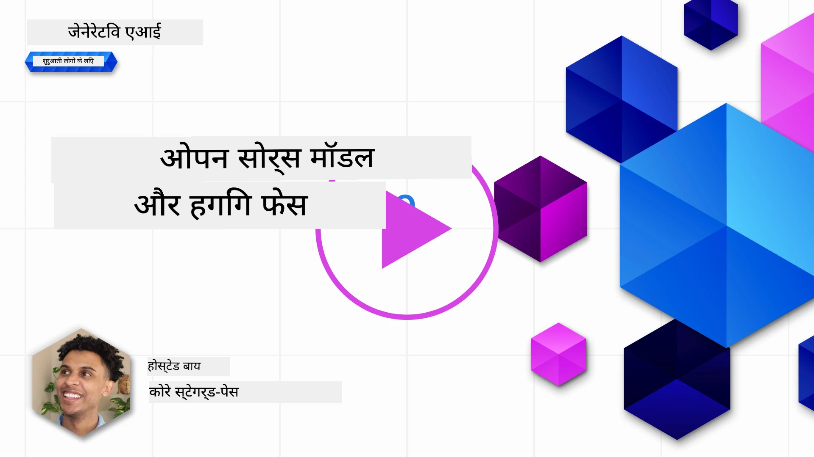
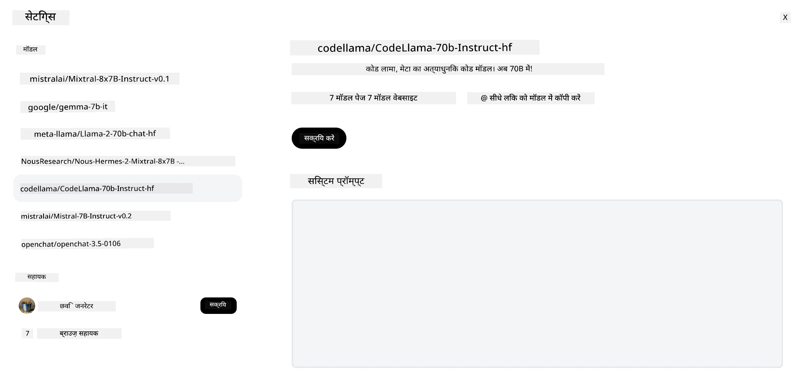
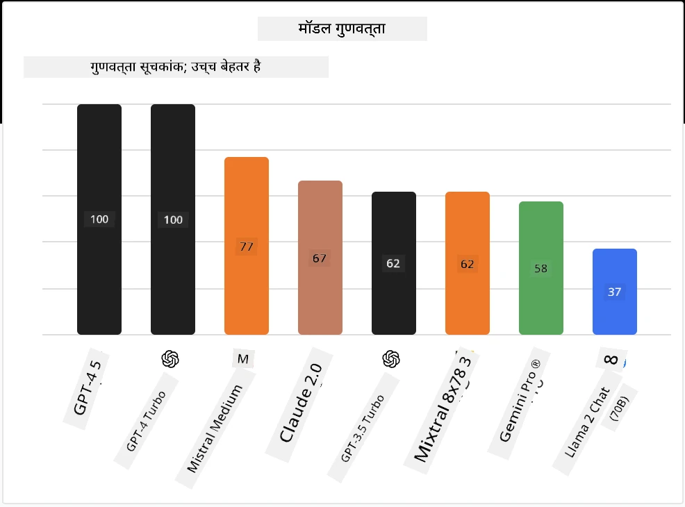

## परिचय

ओपन-सोर्स LLMs की दुनिया रोमांचक और लगातार विकसित हो रही है। इस पाठ का उद्देश्य ओपन सोर्स मॉडल्स की गहन जानकारी प्रदान करना है। यदि आप यह जानना चाहते हैं कि प्रोपाइटरी मॉडल्स की तुलना ओपन सोर्स मॉडल्स से कैसे होती है, तो ["Exploring and Comparing Different LLMs" पाठ](../02-exploring-and-comparing-different-llms/README.md?WT.mc_id=academic-105485-koreyst) देखें। यह पाठ फाइन-ट्यूनिंग के विषय को भी कवर करेगा, लेकिन अधिक विस्तृत व्याख्या ["Fine-Tuning LLMs" पाठ](../18-fine-tuning/README.md?WT.mc_id=academic-105485-koreyst) में मिल सकती है।

## सीखने के लक्ष्य

- ओपन सोर्स मॉडल्स की समझ प्राप्त करना
- ओपन सोर्स मॉडल्स के साथ काम करने के लाभों को समझना
- Hugging Face और Microsoft Foundry मॉडल कैटलॉग पर उपलब्ध खुले मॉडल्स का अन्वेषण करना

## ओपन सोर्स मॉडल्स क्या हैं?

ओपन सोर्स सॉफ्टवेयर ने विभिन्न क्षेत्रों में तकनीक की वृद्धि में महत्वपूर्ण भूमिका निभाई है। Open Source Initiative (OSI) ने सॉफ्टवेयर को ओपन सोर्स के रूप में वर्गीकृत करने के लिए [10 मापदंड](https://web.archive.org/web/20241126001143/https://opensource.org/osd?WT.mc_id=academic-105485-koreyst) निर्धारित किए हैं। स्रोत कोड को OSI द्वारा अनुमोदित लाइसेंस के तहत खुले तौर पर साझा किया जाना चाहिए।

जबकि LLMs का विकास सॉफ़्टवेयर विकास से कुछ समान तत्व रखता है, प्रक्रिया बिल्कुल समान नहीं है। इसने समुदाय में LLMs के संदर्भ में ओपन सोर्स की परिभाषा पर काफी चर्चा को जन्म दिया है। किसी मॉडल को पारंपरिक ओपन सोर्स परिभाषा के अनुरूप मानने के लिए निम्नलिखित जानकारी सार्वजनिक रूप से उपलब्ध होनी चाहिए:

- मॉडल को प्रशिक्षित करने के लिए उपयोग किए गए डाटासेट्स।
- प्रशिक्षण के हिस्से के रूप में पूर्ण मॉडल वज़न।
- मूल्यांकन कोड।
- फाइन-ट्यूनिंग कोड।
- पूर्ण मॉडल वज़न और प्रशिक्षण मेट्रिक्स।

वर्तमान में केवल कुछ ही मॉडल हैं जो इस मापदंड से मेल खाते हैं। [Allen Institute for Artificial Intelligence (AllenAI) द्वारा बनाया गया OLMo मॉडल](https://huggingface.co/allenai/OLMo-7B?WT.mc_id=academic-105485-koreyst) ऐसा एक मॉडल है।

इस पाठ में, हम आगे इस मॉडल्स को "ओपन मॉडल्स" के रूप में संदर्भित करेंगे क्योंकि लेखन के समय वे ऊपर दिए गए मापदंड को पूरी तरह से पूरा नहीं कर सकते।

## ओपन मॉडल्स के लाभ

**बहुत अनुकूलनीय** - क्योंकि ओपन मॉडल्स विस्तृत प्रशिक्षण जानकारी के साथ जारी किए जाते हैं, शोधकर्ता और डेवलपर्स मॉडल के आंतरिक भागों को संशोधित कर सकते हैं। इससे विशिष्ट कार्य या अध्ययन क्षेत्र के लिए फाइन-ट्यून किए गए विशेषीकृत मॉडल बनाने में सहायता मिलती है। इसके कुछ उदाहरण हैं कोड जेनेरेशन, गणितीय क्रियाएँ और जीवविज्ञान।

**लागत** - इन मॉडलों का उपयोग और तैनाती प्रति टोकन मूल्य प्रोपाइटरी मॉडलों की तुलना में कम होता है। जनरेटिव AI एप्लिकेशन बनाते समय, आपके उपयोग के मामले में प्रदर्शन बनाम मूल्य की तुलना करना महत्वपूर्ण होता है।

स्रोत: Artificial Analysis

**लचीलापन** - ओपन मॉडल्स के साथ काम करने पर आप विभिन्न मॉडलों का उपयोग करने या उन्हें संयोजित करने में लचीलापन प्राप्त करते हैं। इसका उदाहरण [HuggingChat सहायक](https://huggingface.co/chat?WT.mc_id=academic-105485-koreyst) है जहां उपयोगकर्ता इंटरफ़ेस में सीधे मॉडल चयन कर सकते हैं:

## विभिन्न ओपन मॉडल्स का अन्वेषण

### Llama 2

[Llama2](https://huggingface.co/meta-llama?WT.mc_id=academic-105485-koreyst), जो Meta द्वारा विकसित है, एक ओपन मॉडल है जो चैट आधारित एप्लिकेशन के लिए अनुकूलित है। इसका कारण इसका फाइन-ट्यूनिंग तरीका है, जिसमें बहुत सारे संवाद और मानव प्रतिक्रिया शामिल थी। इस पद्धति से, मॉडल अधिक मानवीय अपेक्षा के अनुरूप परिणाम देता है, जो बेहतर उपयोगकर्ता अनुभव प्रदान करता है।

Llama के कुछ फाइन-ट्यून किए गए संस्करणों के उदाहरण हैं [Japanese Llama](https://huggingface.co/elyza/ELYZA-japanese-Llama-2-7b?WT.mc_id=academic-105485-koreyst), जो जापानी भाषा में विशेषज्ञता रखता है, और [Llama Pro](https://huggingface.co/TencentARC/LLaMA-Pro-8B?WT.mc_id=academic-105485-koreyst), जो मूल मॉडल का संवर्धित संस्करण है।

### Mistral

[Mistral](https://huggingface.co/mistralai?WT.mc_id=academic-105485-koreyst) एक ओपन मॉडल है जो उच्च प्रदर्शन और दक्षता पर केंद्रित है। यह Mixture-of-Experts दृष्टिकोण का उपयोग करता है जो विशेषज्ञ मॉडलों के समूह को एक प्रणाली में संयोजित करता है, जहां इनपुट के आधार पर कुछ मॉडल चुने जाते हैं। इससे गणना अधिक प्रभावी होती है क्योंकि मॉडल केवल उन इनपुट पर ध्यान केंद्रित करते हैं जिनमें वे विशेषज्ञ होते हैं।

Mistral के कुछ फाइन-ट्यून संस्करणों के उदाहरण हैं [BioMistral](https://huggingface.co/BioMistral/BioMistral-7B?text=Mon+nom+est+Thomas+et+mon+principal?WT.mc_id=academic-105485-koreyst), जो चिकित्सा क्षेत्र पर केंद्रित है, और [OpenMath Mistral](https://huggingface.co/nvidia/OpenMath-Mistral-7B-v0.1-hf?WT.mc_id=academic-105485-koreyst), जो गणितीय गणना करता है।

### Falcon

[Falcon](https://huggingface.co/tiiuae?WT.mc_id=academic-105485-koreyst) एक LLM है जिसे Technology Innovation Institute (**TII**) ने बनाया है। Falcon-40B को 40 अरब पैरामीटर पर प्रशिक्षित किया गया था, जिसे GPT-3 की तुलना में कम कंप्यूट बजट के साथ बेहतर प्रदर्शन दिखाया गया है। इसका कारण इसका FlashAttention एल्गोरिदम और मल्टीक्वेरी अटेंशन का उपयोग है, जो अनुमान समय पर मेमोरी आवश्यकताओं को कम करता है। इस कम अनुमान समय के साथ, Falcon-40B चैट एप्लिकेशन के लिए उपयुक्त है।

Falcon के कुछ फाइन-ट्यून संस्करणों में [OpenAssistant](https://huggingface.co/OpenAssistant/falcon-40b-sft-top1-560?WT.mc_id=academic-105485-koreyst), जो ओपन मॉडल्स पर आधारित एक सहायक है, और [GPT4ALL](https://huggingface.co/nomic-ai/gpt4all-falcon?WT.mc_id=academic-105485-koreyst), जो मूल मॉडल की तुलना में उच्च प्रदर्शन प्रदान करता है, शामिल हैं।

## कैसे चुनें

ओपन मॉडल चुनने का कोई एक उत्तर नहीं है। एक अच्छी शुरुआत Microsoft Foundry मॉडल कैटलॉग में टास्क द्वारा फिल्टर फीचर का उपयोग करना है। इससे आपको यह समझने में मदद मिलेगी कि मॉडल को किस प्रकार के कार्यों के लिए प्रशिक्षित किया गया है। Hugging Face एक LLM लीडरबोर्ड भी रखता है जो आपको कुछ मेट्रिक्स के आधार पर सर्वश्रेष्ठ प्रदर्शन करने वाले मॉडल दिखाता है।

विभिन्न प्रकारों के LLMs की तुलना करते समय, [Artificial Analysis](https://artificialanalysis.ai/?WT.mc_id=academic-105485-koreyst) एक और उत्कृष्ट संसाधन है:

स्रोत: Artificial Analysis

यदि किसी विशिष्ट उपयोग मामले पर काम कर रहे हैं, तो उसी क्षेत्र पर केंद्रित फाइन-ट्यून किए गए संस्करणों की खोज प्रभावी हो सकती है। कई ओपन मॉडल्स के साथ प्रयोग करना यह देखने के लिए कि वे आपकी और आपके उपयोगकर्ताओं की अपेक्षाओं के अनुसार कैसे प्रदर्शन करते हैं, एक अच्छी प्रथा है।

## अगला कदम

ओपन मॉडल्स के साथ काम करना जल्दी शुरू करने के लिए सबसे अच्छी बात है। [Microsoft Foundry मॉडल कैटलॉग](https://ai.azure.com?WT.mc_id=academic-105485-koreyst) देखें, जिसमें इनमें से मॉडल्स के लिए Hugging Face का एक विशेष संग्रह है।

## सीखना यहीं समाप्त नहीं होता, यात्रा जारी रखें

इस पाठ को पूरा करने के बाद, हमारे [जनरेटिव AI लर्निंग संग्रह](https://aka.ms/genai-collection?WT.mc_id=academic-105485-koreyst) को देखें ताकि आप अपनी जनरेटिव AI ज्ञान को और बढ़ा सकें!

---

<!-- CO-OP TRANSLATOR DISCLAIMER START -->
**अस्वीकरण**:
इस दस्तावेज़ का अनुवाद AI अनुवाद सेवा [Co-op Translator](https://github.com/Azure/co-op-translator) का उपयोग करके किया गया है। जबकि हम सटीकता के लिए प्रयास करते हैं, कृपया ध्यान दें कि स्वचालित अनुवादों में त्रुटियाँ या अशुद्धियाँ हो सकती हैं। मूल दस्तावेज़ अपनी मूल भाषा में ही प्रामाणिक स्रोत माना जाना चाहिए। महत्वपूर्ण जानकारी के लिए, पेशेवर मानव अनुवाद की सिफारिश की जाती है। इस अनुवाद के उपयोग से उत्पन्न किसी भी गलतफहमी या गलत व्याख्या के लिए हम उत्तरदायी नहीं हैं।
<!-- CO-OP TRANSLATOR DISCLAIMER END -->