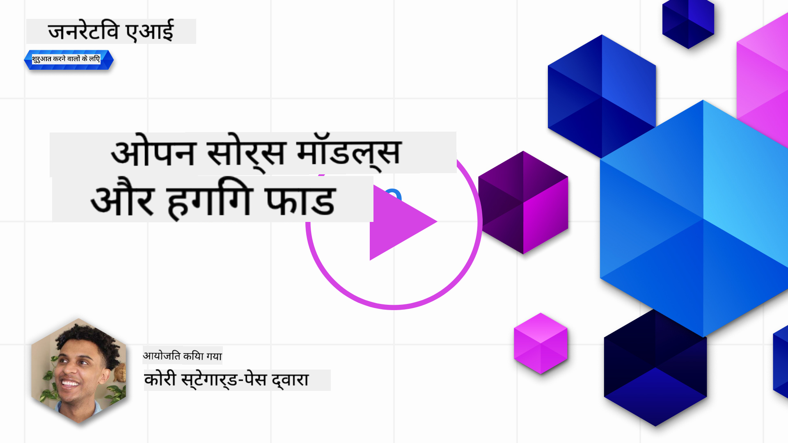

<!--
CO_OP_TRANSLATOR_METADATA:
{
  "original_hash": "a8b2d4bb727c877ebf9edff8623d16b9",
  "translation_date": "2025-09-06T10:14:05+00:00",
  "source_file": "16-open-source-models/README.md",
  "language_code": "hi"
}
-->

## परिचय

ओपन-सोर्स LLMs की दुनिया रोमांचक और लगातार बदलती रहती है। इस पाठ का उद्देश्य ओपन सोर्स मॉडल्स पर गहराई से जानकारी प्रदान करना है। यदि आप जानना चाहते हैं कि मालिकाना मॉडल्स की तुलना ओपन सोर्स मॉडल्स से कैसे होती है, तो ["Exploring and Comparing Different LLMs" पाठ](../02-exploring-and-comparing-different-llms/README.md?WT.mc_id=academic-105485-koreyst) पर जाएं। इस पाठ में फाइन-ट्यूनिंग का विषय भी शामिल होगा, लेकिन इसका अधिक विस्तृत विवरण ["Fine-Tuning LLMs" पाठ](../18-fine-tuning/README.md?WT.mc_id=academic-105485-koreyst) में पाया जा सकता है।

## सीखने के लक्ष्य

- ओपन सोर्स मॉडल्स की समझ प्राप्त करना  
- ओपन सोर्स मॉडल्स के साथ काम करने के लाभ समझना  
- Hugging Face और Azure AI Studio पर उपलब्ध ओपन मॉडल्स का अन्वेषण करना  

## ओपन सोर्स मॉडल्स क्या हैं?

ओपन सोर्स सॉफ़्टवेयर ने विभिन्न क्षेत्रों में तकनीक के विकास में महत्वपूर्ण भूमिका निभाई है। ओपन सोर्स इनिशिएटिव (OSI) ने [सॉफ़्टवेयर के लिए 10 मानदंड](https://web.archive.org/web/20241126001143/https://opensource.org/osd?WT.mc_id=academic-105485-koreyst) निर्धारित किए हैं ताकि इसे ओपन सोर्स के रूप में वर्गीकृत किया जा सके। स्रोत कोड को OSI द्वारा अनुमोदित लाइसेंस के तहत खुले तौर पर साझा किया जाना चाहिए।

हालांकि LLMs का विकास सॉफ़्टवेयर विकास के समान तत्वों को साझा करता है, प्रक्रिया बिल्कुल समान नहीं है। इसने LLMs के संदर्भ में ओपन सोर्स की परिभाषा पर समुदाय में बहुत चर्चा को जन्म दिया है। एक मॉडल को पारंपरिक ओपन सोर्स परिभाषा के साथ संरेखित करने के लिए निम्नलिखित जानकारी सार्वजनिक रूप से उपलब्ध होनी चाहिए:

- मॉडल को प्रशिक्षित करने के लिए उपयोग किए गए डेटासेट।  
- प्रशिक्षण के हिस्से के रूप में पूर्ण मॉडल वेट्स।  
- मूल्यांकन कोड।  
- फाइन-ट्यूनिंग कोड।  
- पूर्ण मॉडल वेट्स और प्रशिक्षण मेट्रिक्स।  

वर्तमान में केवल कुछ ही मॉडल्स इस मानदंड को पूरा करते हैं। [Allen Institute for Artificial Intelligence (AllenAI) द्वारा बनाया गया OLMo मॉडल](https://huggingface.co/allenai/OLMo-7B?WT.mc_id=academic-105485-koreyst) इस श्रेणी में आता है।

इस पाठ के लिए, हम आगे "ओपन मॉडल्स" शब्द का उपयोग करेंगे क्योंकि वे लेखन के समय ऊपर दिए गए मानदंडों से मेल नहीं खा सकते हैं।

## ओपन मॉडल्स के लाभ

**अत्यधिक अनुकूलन योग्य** - चूंकि ओपन मॉडल्स विस्तृत प्रशिक्षण जानकारी के साथ जारी किए जाते हैं, शोधकर्ता और डेवलपर्स मॉडल के आंतरिक हिस्सों को संशोधित कर सकते हैं। यह अत्यधिक विशिष्ट मॉडल्स बनाने में सक्षम बनाता है जो किसी विशेष कार्य या अध्ययन क्षेत्र के लिए फाइन-ट्यून किए गए हैं। कुछ उदाहरण हैं कोड जनरेशन, गणितीय संचालन और जीवविज्ञान।

**लागत** - इन मॉडल्स का उपयोग और तैनाती करने के लिए प्रति टोकन लागत मालिकाना मॉडल्स की तुलना में कम होती है। जनरेटिव AI एप्लिकेशन बनाते समय, प्रदर्शन बनाम कीमत को अपने उपयोग के मामले पर काम करते समय देखना चाहिए।

  
स्रोत: Artificial Analysis  

**लचीलापन** - ओपन मॉडल्स के साथ काम करने से विभिन्न मॉडल्स का उपयोग करने या उन्हें संयोजित करने में लचीलापन मिलता है। इसका एक उदाहरण [HuggingChat Assistants](https://huggingface.co/chat?WT.mc_id=academic-105485-koreyst) है, जहां उपयोगकर्ता सीधे यूजर इंटरफेस में उपयोग किए जा रहे मॉडल का चयन कर सकते हैं:

## विभिन्न ओपन मॉडल्स का अन्वेषण

### Llama 2

[LLama2](https://huggingface.co/meta-llama?WT.mc_id=academic-105485-koreyst), Meta द्वारा विकसित, एक ओपन मॉडल है जो चैट आधारित एप्लिकेशन के लिए अनुकूलित है। यह इसके फाइन-ट्यूनिंग विधि के कारण है, जिसमें संवाद और मानव प्रतिक्रिया की बड़ी मात्रा शामिल थी। इस विधि के साथ, मॉडल अधिक परिणाम उत्पन्न करता है जो मानव अपेक्षाओं के अनुरूप होते हैं, जिससे बेहतर उपयोगकर्ता अनुभव मिलता है।

Llama के कुछ फाइन-ट्यून किए गए संस्करणों में [Japanese Llama](https://huggingface.co/elyza/ELYZA-japanese-Llama-2-7b?WT.mc_id=academic-105485-koreyst), जो जापानी में विशेषज्ञता रखता है, और [Llama Pro](https://huggingface.co/TencentARC/LLaMA-Pro-8B?WT.mc_id=academic-105485-koreyst), जो बेस मॉडल का एक उन्नत संस्करण है, शामिल हैं।

### Mistral

[Mistral](https://huggingface.co/mistralai?WT.mc_id=academic-105485-koreyst) एक ओपन मॉडल है जो उच्च प्रदर्शन और दक्षता पर केंद्रित है। यह Mixture-of-Experts दृष्टिकोण का उपयोग करता है, जो विशेषज्ञ मॉडल्स के समूह को एक प्रणाली में जोड़ता है, जहां इनपुट के आधार पर कुछ मॉडल्स का चयन किया जाता है। यह गणना को अधिक प्रभावी बनाता है क्योंकि मॉडल्स केवल उन इनपुट्स को संबोधित करते हैं जिनमें वे विशेषज्ञ हैं।

Mistral के कुछ फाइन-ट्यून किए गए संस्करणों में [BioMistral](https://huggingface.co/BioMistral/BioMistral-7B?text=Mon+nom+est+Thomas+et+mon+principal?WT.mc_id=academic-105485-koreyst), जो चिकित्सा क्षेत्र पर केंद्रित है, और [OpenMath Mistral](https://huggingface.co/nvidia/OpenMath-Mistral-7B-v0.1-hf?WT.mc_id=academic-105485-koreyst), जो गणितीय गणना करता है, शामिल हैं।

### Falcon

[Falcon](https://huggingface.co/tiiuae?WT.mc_id=academic-105485-koreyst) एक LLM है जिसे Technology Innovation Institute (**TII**) द्वारा बनाया गया है। Falcon-40B को 40 बिलियन पैरामीटर्स पर प्रशिक्षित किया गया था, जो कम कंप्यूट बजट के साथ GPT-3 से बेहतर प्रदर्शन करता है। यह FlashAttention एल्गोरिदम और मल्टीक्वेरी अटेंशन का उपयोग करता है, जो इसे इन्फरेंस समय पर मेमोरी आवश्यकताओं को कम करने में सक्षम बनाता है। इस कम इन्फरेंस समय के साथ, Falcon-40B चैट एप्लिकेशन के लिए उपयुक्त है।

Falcon के कुछ फाइन-ट्यून किए गए संस्करणों में [OpenAssistant](https://huggingface.co/OpenAssistant/falcon-40b-sft-top1-560?WT.mc_id=academic-105485-koreyst), जो ओपन मॉडल्स पर आधारित एक सहायक है, और [GPT4ALL](https://huggingface.co/nomic-ai/gpt4all-falcon?WT.mc_id=academic-105485-koreyst), जो बेस मॉडल से बेहतर प्रदर्शन करता है, शामिल हैं।

## कैसे चुनें

ओपन मॉडल चुनने के लिए कोई एक उत्तर नहीं है। Azure AI Studio का "फिल्टर बाय टास्क" फीचर उपयोग करना एक अच्छा प्रारंभिक बिंदु हो सकता है। यह आपको यह समझने में मदद करेगा कि मॉडल को किस प्रकार के कार्यों के लिए प्रशिक्षित किया गया है। Hugging Face भी एक LLM लीडरबोर्ड बनाए रखता है, जो आपको कुछ मेट्रिक्स के आधार पर सर्वश्रेष्ठ प्रदर्शन करने वाले मॉडल्स दिखाता है।

विभिन्न प्रकार के LLMs की तुलना करने के लिए [Artificial Analysis](https://artificialanalysis.ai/?WT.mc_id=academic-105485-koreyst) एक और शानदार संसाधन है:

  
स्रोत: Artificial Analysis  

यदि आप किसी विशिष्ट उपयोग के मामले पर काम कर रहे हैं, तो उसी क्षेत्र पर केंद्रित फाइन-ट्यून किए गए संस्करणों की खोज करना प्रभावी हो सकता है। कई ओपन मॉडल्स के साथ प्रयोग करना और यह देखना कि वे आपके और आपके उपयोगकर्ताओं की अपेक्षाओं के अनुसार कैसे प्रदर्शन करते हैं, एक और अच्छा अभ्यास है।

## अगले कदम

ओपन मॉडल्स का सबसे अच्छा हिस्सा यह है कि आप उनके साथ काम करना जल्दी शुरू कर सकते हैं। [Azure AI Foundry Model Catalog](https://ai.azure.com?WT.mc_id=academic-105485-koreyst) देखें, जिसमें Hugging Face संग्रह के साथ यहां चर्चा किए गए मॉडल्स शामिल हैं।

## सीखना यहीं समाप्त नहीं होता, यात्रा जारी रखें

इस पाठ को पूरा करने के बाद, हमारे [Generative AI Learning collection](https://aka.ms/genai-collection?WT.mc_id=academic-105485-koreyst) को देखें और अपनी जनरेटिव AI की जानकारी को और बढ़ाएं!

---

**अस्वीकरण**:  
यह दस्तावेज़ AI अनुवाद सेवा [Co-op Translator](https://github.com/Azure/co-op-translator) का उपयोग करके अनुवादित किया गया है। जबकि हम सटीकता सुनिश्चित करने का प्रयास करते हैं, कृपया ध्यान दें कि स्वचालित अनुवाद में त्रुटियां या अशुद्धियां हो सकती हैं। मूल दस्तावेज़, जो इसकी मूल भाषा में है, को आधिकारिक स्रोत माना जाना चाहिए। महत्वपूर्ण जानकारी के लिए, पेशेवर मानव अनुवाद की सिफारिश की जाती है। इस अनुवाद के उपयोग से उत्पन्न किसी भी गलतफहमी या गलत व्याख्या के लिए हम उत्तरदायी नहीं हैं।