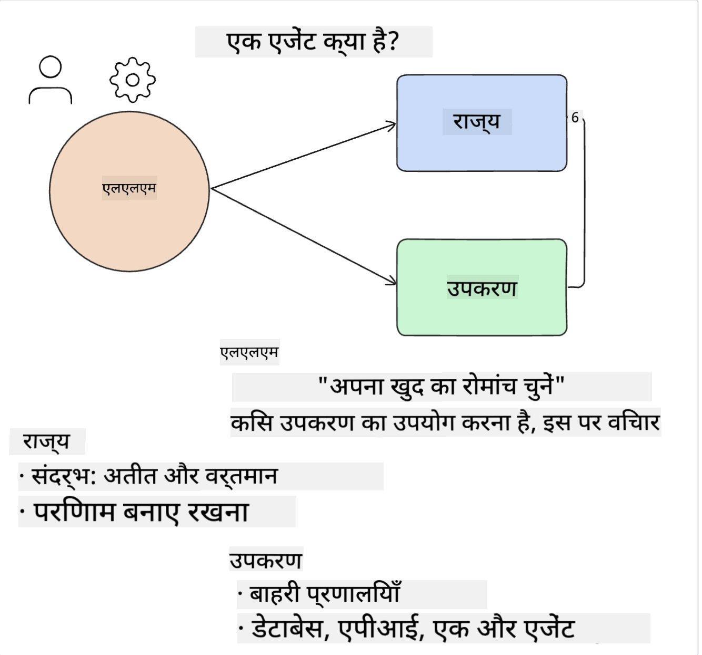
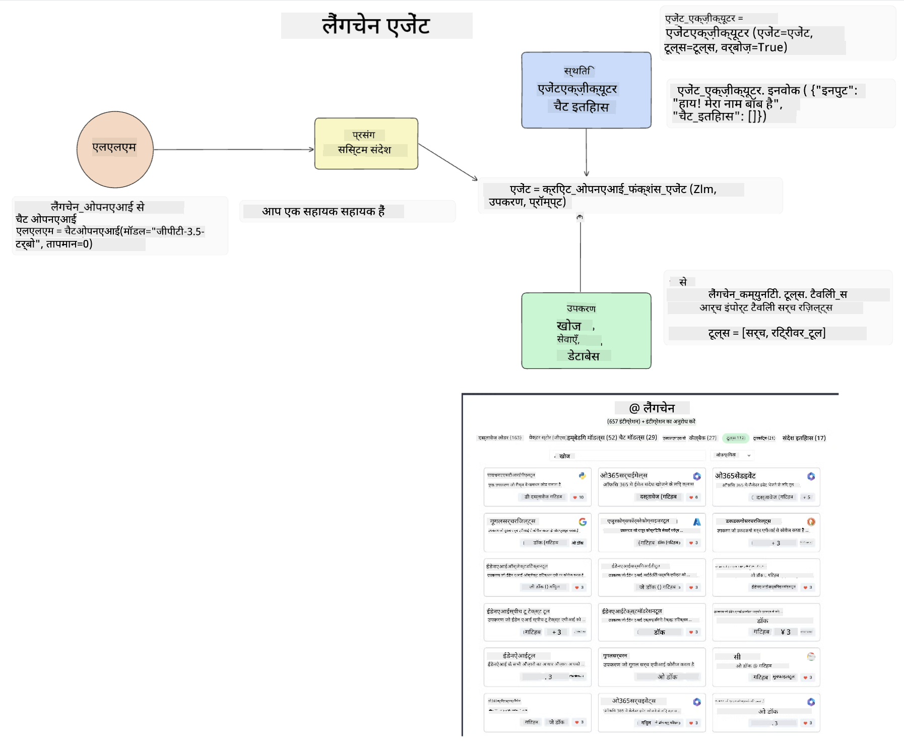
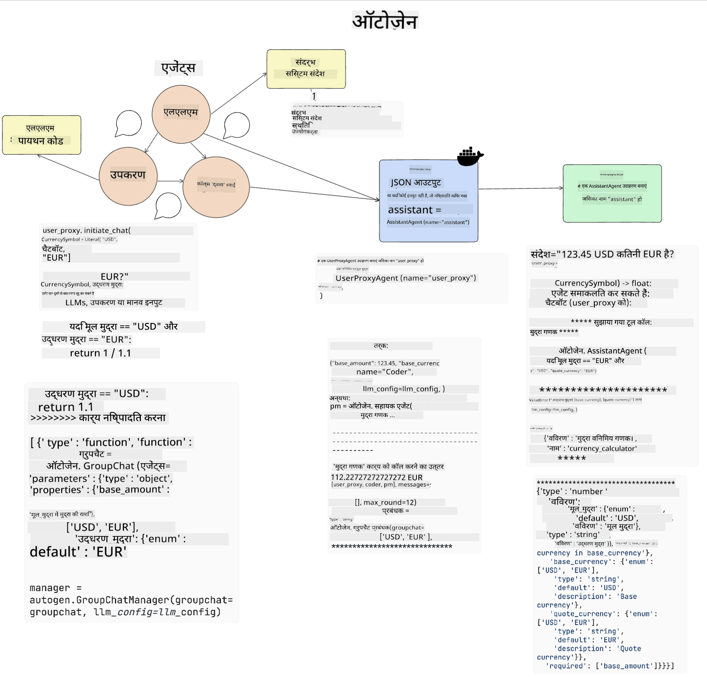
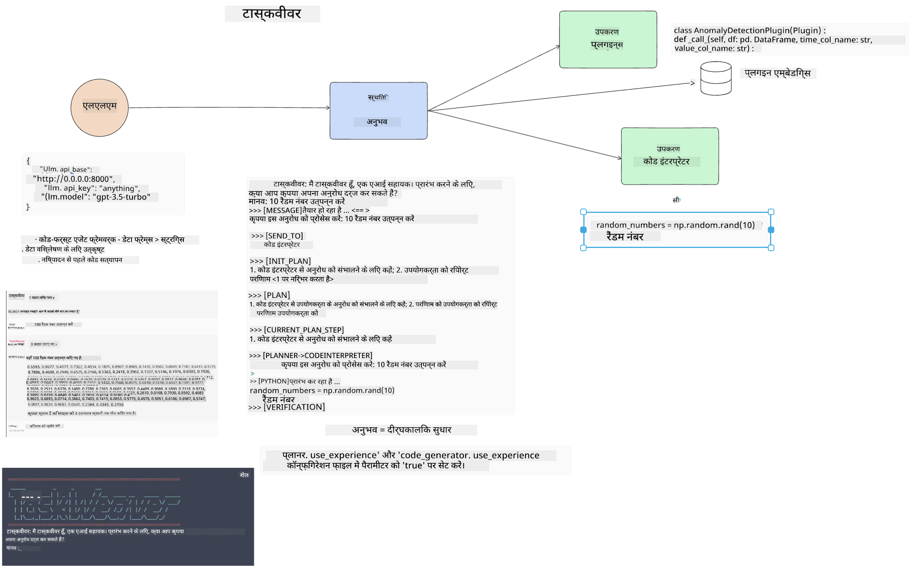
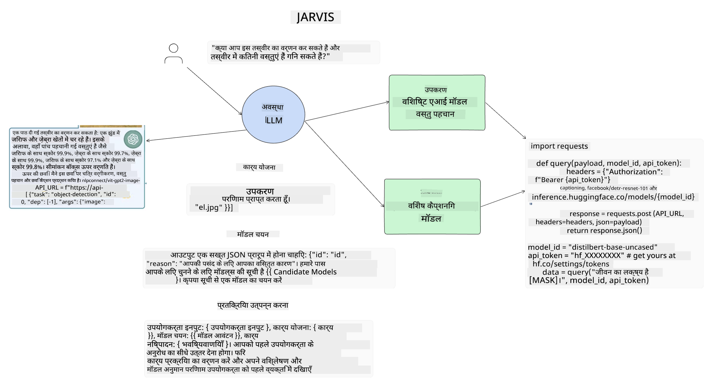

<!--
CO_OP_TRANSLATOR_METADATA:
{
  "original_hash": "11f03c81f190d9cbafd0f977dcbede6c",
  "translation_date": "2025-06-26T00:12:57+00:00",
  "source_file": "17-ai-agents/README.md",
  "language_code": "hi"
}
-->
[](https://aka.ms/gen-ai-lesson17-gh?WT.mc_id=academic-105485-koreyst)

## परिचय

एआई एजेंट जनरेटिव एआई में एक रोमांचक विकास का प्रतिनिधित्व करते हैं, जो बड़े भाषा मॉडल (एलएलएम) को सहायक से एजेंट में विकसित करने में सक्षम बनाते हैं जो क्रियाएं कर सकते हैं। एआई एजेंट फ्रेमवर्क डेवलपर्स को ऐसे एप्लिकेशन बनाने में सक्षम बनाते हैं जो एलएलएम को उपकरण और राज्य प्रबंधन तक पहुंच प्रदान करते हैं। ये फ्रेमवर्क दृश्यता को भी बढ़ाते हैं, जिससे उपयोगकर्ता और डेवलपर्स एलएलएम द्वारा योजनाबद्ध कार्यों की निगरानी कर सकते हैं, जिससे अनुभव प्रबंधन में सुधार होता है।

पाठ में निम्नलिखित क्षेत्रों को शामिल किया जाएगा:

- एआई एजेंट क्या है - वास्तव में एआई एजेंट क्या है?
- चार अलग-अलग एआई एजेंट फ्रेमवर्क का अन्वेषण - क्या उन्हें अद्वितीय बनाता है?
- इन एआई एजेंटों को विभिन्न उपयोग मामलों में लागू करना - हमें एआई एजेंटों का उपयोग कब करना चाहिए?

## सीखने के लक्ष्य

इस पाठ को लेने के बाद, आप सक्षम होंगे:

- समझा सकेंगे कि एआई एजेंट क्या हैं और उनका उपयोग कैसे किया जा सकता है।
- कुछ लोकप्रिय एआई एजेंट फ्रेमवर्क के बीच के अंतर को समझेंगे, और वे कैसे भिन्न हैं।
- समझेंगे कि एआई एजेंट कैसे कार्य करते हैं ताकि उनके साथ एप्लिकेशन बना सकें।

## एआई एजेंट क्या हैं?

एआई एजेंट जनरेटिव एआई की दुनिया में एक बहुत ही रोमांचक क्षेत्र हैं। इस उत्साह के साथ कभी-कभी शब्दों और उनके अनुप्रयोग की भ्रम भी आती है। चीजों को सरल और अधिकांश उपकरणों को शामिल करने के लिए जो एआई एजेंटों को संदर्भित करते हैं, हम इस परिभाषा का उपयोग करने जा रहे हैं:

एआई एजेंट बड़े भाषा मॉडल (एलएलएम) को एक **राज्य** और **उपकरण** तक पहुंच देकर कार्य करने की अनुमति देते हैं।



आइए इन शब्दों को परिभाषित करें:

**बड़े भाषा मॉडल** - ये वे मॉडल हैं जिनका इस पाठ्यक्रम में बार-बार उल्लेख किया गया है जैसे कि GPT-3.5, GPT-4, Llama-2, आदि।

**राज्य** - यह उस संदर्भ को संदर्भित करता है जिसमें एलएलएम काम कर रहा है। एलएलएम अपने पिछले कार्यों और वर्तमान संदर्भ के संदर्भ का उपयोग करता है, जिससे अपने निर्णय लेने की प्रक्रिया को अगले कार्यों के लिए मार्गदर्शन मिलता है। एआई एजेंट फ्रेमवर्क डेवलपर्स को इस संदर्भ को आसानी से बनाए रखने की अनुमति देते हैं।

**उपकरण** - उपयोगकर्ता द्वारा अनुरोधित कार्य को पूरा करने के लिए और जिसे एलएलएम ने योजनाबद्ध किया है, एलएलएम को उपकरणों तक पहुंच की आवश्यकता होती है। उपकरणों के कुछ उदाहरण एक डेटाबेस, एक एपीआई, एक बाहरी एप्लिकेशन या यहां तक कि एक अन्य एलएलएम हो सकते हैं!

ये परिभाषाएँ आपको आगे बढ़ने के लिए एक अच्छी नींव प्रदान करेंगी जब हम देखेंगे कि उन्हें कैसे लागू किया जाता है। आइए कुछ अलग एआई एजेंट फ्रेमवर्क का अन्वेषण करें:

## लैंगचेन एजेंट

[लैंगचेन एजेंट](https://python.langchain.com/docs/how_to/#agents?WT.mc_id=academic-105485-koreyst) ऊपर दी गई परिभाषाओं का एक कार्यान्वयन है।

**राज्य** को प्रबंधित करने के लिए, यह एक अंतर्निहित कार्य `AgentExecutor` का उपयोग करता है। यह परिभाषित `agent` और `tools` को स्वीकार करता है जो इसे उपलब्ध हैं।

`Agent Executor` चैट इतिहास को भी संग्रहीत करता है ताकि चैट के संदर्भ को प्रदान किया जा सके।



लैंगचेन एक [उपकरणों की सूची](https://integrations.langchain.com/tools?WT.mc_id=academic-105485-koreyst) प्रदान करता है जिसे आपके एप्लिकेशन में आयात किया जा सकता है जिसमें एलएलएम को पहुंच मिल सकती है। ये समुदाय और लैंगचेन टीम द्वारा बनाए गए हैं।

आप तब इन उपकरणों को परिभाषित कर सकते हैं और उन्हें `Agent Executor` को पास कर सकते हैं।

दृश्यता एआई एजेंटों के बारे में बात करते समय एक और महत्वपूर्ण पहलू है। यह एप्लिकेशन डेवलपर्स के लिए यह समझना महत्वपूर्ण है कि एलएलएम कौन सा उपकरण उपयोग कर रहा है और क्यों। इसके लिए, लैंगचेन की टीम ने लैंगस्मिथ विकसित किया है।

## ऑटोजेन

अगला एआई एजेंट फ्रेमवर्क जिसे हम चर्चा करेंगे वह है [ऑटोजेन](https://microsoft.github.io/autogen/?WT.mc_id=academic-105485-koreyst)। ऑटोजेन का मुख्य फोकस वार्तालाप है। एजेंट दोनों **संवादात्मक** और **अनुकूलन योग्य** हैं।

**संवादात्मक -** एलएलएम एक कार्य पूरा करने के लिए दूसरे एलएलएम के साथ बातचीत शुरू और जारी कर सकते हैं। यह `AssistantAgents` बनाकर और उन्हें एक विशेष सिस्टम संदेश देकर किया जाता है।

```python

autogen.AssistantAgent( name="Coder", llm_config=llm_config, ) pm = autogen.AssistantAgent( name="Product_manager", system_message="Creative in software product ideas.", llm_config=llm_config, )

```

**अनुकूलन योग्य** - एजेंटों को केवल एलएलएम के रूप में ही नहीं बल्कि उपयोगकर्ता या उपकरण के रूप में भी परिभाषित किया जा सकता है। एक डेवलपर के रूप में, आप एक `UserProxyAgent` को परिभाषित कर सकते हैं जो कार्य को पूरा करने के लिए उपयोगकर्ता के साथ प्रतिक्रिया के लिए बातचीत करने का जिम्मेदार होता है। यह प्रतिक्रिया या तो कार्य के निष्पादन को जारी रख सकती है या इसे रोक सकती है।

```python
user_proxy = UserProxyAgent(name="user_proxy")
```

### राज्य और उपकरण

राज्य को बदलने और प्रबंधित करने के लिए, एक सहायक एजेंट कार्य को पूरा करने के लिए पायथन कोड उत्पन्न करता है।

यहां प्रक्रिया का एक उदाहरण है:



#### सिस्टम संदेश के साथ परिभाषित एलएलएम

```python
system_message="For weather related tasks, only use the functions you have been provided with. Reply TERMINATE when the task is done."
```

यह सिस्टम संदेश इस विशेष एलएलएम को निर्देश देता है कि उसके कार्य के लिए कौन से कार्य प्रासंगिक हैं। याद रखें, ऑटोजेन के साथ आप विभिन्न सिस्टम संदेशों के साथ कई सहायक एजेंटों को परिभाषित कर सकते हैं।

#### उपयोगकर्ता द्वारा चैट की शुरुआत

```python
user_proxy.initiate_chat( chatbot, message="I am planning a trip to NYC next week, can you help me pick out what to wear? ", )

```

यह संदेश user_proxy (मानव) से एजेंट की प्रक्रिया शुरू करेगा कि वह कौन से संभावित कार्यों को निष्पादित करना चाहिए।

#### कार्य निष्पादित होता है

```bash
chatbot (to user_proxy):

***** Suggested tool Call: get_weather ***** Arguments: {"location":"New York City, NY","time_periond:"7","temperature_unit":"Celsius"} ******************************************************** --------------------------------------------------------------------------------

>>>>>>>> EXECUTING FUNCTION get_weather... user_proxy (to chatbot): ***** Response from calling function "get_weather" ***** 112.22727272727272 EUR ****************************************************************

```

एक बार प्रारंभिक चैट संसाधित हो जाने के बाद, एजेंट सुझावित उपकरण को कॉल करने के लिए भेजेगा। इस मामले में, यह `get_weather`. Depending on your configuration, this function can be automatically executed and read by the Agent or can be executed based on user input.

You can find a list of [AutoGen code samples](https://microsoft.github.io/autogen/docs/Examples/?WT.mc_id=academic-105485-koreyst) to further explore how to get started building.

## Taskweaver

The next agent framework we will explore is [Taskweaver](https://microsoft.github.io/TaskWeaver/?WT.mc_id=academic-105485-koreyst). It is known as a "code-first" agent because instead of working strictly with `strings` , it can work with DataFrames in Python. This becomes extremely useful for data analysis and generation tasks. This can be things like creating graphs and charts or generating random numbers.

### State and Tools

To manage the state of the conversation, TaskWeaver uses the concept of a `Planner`. The `Planner` is a LLM that takes the request from the users and maps out the tasks that need to be completed to fulfill this request.

To complete the tasks the `Planner` is exposed to the collection of tools called `Plugins` नामक एक कार्य है। ये पायथन क्लासेस या एक सामान्य कोड इंटरप्रेटर हो सकते हैं। ये प्लगइन्स एम्बेडिंग के रूप में संग्रहीत होते हैं ताकि एलएलएम सही प्लगइन की बेहतर खोज कर सके।



यहां एक उदाहरण है कि विसंगति का पता लगाने को संभालने के लिए एक प्लगइन कैसे काम करता है:

```python
class AnomalyDetectionPlugin(Plugin): def __call__(self, df: pd.DataFrame, time_col_name: str, value_col_name: str):
```

कोड निष्पादित करने से पहले सत्यापित किया जाता है। टास्कवीवर में संदर्भ प्रबंधन के लिए एक और सुविधा `experience`. Experience allows for the context of a conversation to be stored over to the long term in a YAML file. This can be configured so that the LLM improves over time on certain tasks given that it is exposed to prior conversations.

## JARVIS

The last agent framework we will explore is [JARVIS](https://github.com/microsoft/JARVIS?tab=readme-ov-file?WT.mc_id=academic-105485-koreyst). What makes JARVIS unique is that it uses an LLM to manage the `state` है जो बातचीत का अनुभव और `tools` अन्य एआई मॉडल हैं। प्रत्येक एआई मॉडल विशेष मॉडल होते हैं जो कुछ कार्यों जैसे वस्तु पहचान, प्रतिलेखन या छवि कैप्शनिंग को पूरा करते हैं।



एलएलएम, एक सामान्य उद्देश्य मॉडल होने के नाते, उपयोगकर्ता से अनुरोध प्राप्त करता है और विशिष्ट कार्य और किसी भी तर्क/डेटा की पहचान करता है जिसे कार्य को पूरा करने के लिए आवश्यक है।

```python
[{"task": "object-detection", "id": 0, "dep": [-1], "args": {"image": "e1.jpg" }}]
```

एलएलएम तब अनुरोध को इस तरह से प्रारूपित करता है कि विशेष एआई मॉडल इसे समझ सके, जैसे JSON। एक बार जब एआई मॉडल ने कार्य के आधार पर अपनी भविष्यवाणी लौटाई, तो एलएलएम प्रतिक्रिया प्राप्त करता है।

यदि कार्य को पूरा करने के लिए कई मॉडलों की आवश्यकता होती है, तो यह उन मॉडलों से प्रतिक्रिया की भी व्याख्या करेगा इससे पहले कि उन्हें उपयोगकर्ता को प्रतिक्रिया उत्पन्न करने के लिए एक साथ लाया जाए।

नीचे दिया गया उदाहरण दिखाता है कि जब एक उपयोगकर्ता एक चित्र में वस्तुओं का वर्णन और गणना करने का अनुरोध करता है तो यह कैसे काम करेगा:

## असाइनमेंट

एआई एजेंटों के अपने सीखने को जारी रखने के लिए आप ऑटोजेन के साथ बना सकते हैं:

- एक एप्लिकेशन जो एक शिक्षा स्टार्टअप के विभिन्न विभागों के साथ एक व्यावसायिक बैठक का अनुकरण करता है।
- सिस्टम संदेश बनाएं जो एलएलएम को विभिन्न व्यक्तित्वों और प्राथमिकताओं को समझने में मार्गदर्शन करें, और उपयोगकर्ता को एक नए उत्पाद विचार को पेश करने में सक्षम बनाएं।
- एलएलएम को तब प्रत्येक विभाग से फॉलो-अप प्रश्न उत्पन्न करने चाहिए ताकि पिच और उत्पाद विचार को परिष्कृत और सुधार किया जा सके।

## सीखना यहीं समाप्त नहीं होता, यात्रा जारी रखें

इस पाठ को पूरा करने के बाद, हमारे [जनरेटिव एआई लर्निंग संग्रह](https://aka.ms/genai-collection?WT.mc_id=academic-105485-koreyst) को देखें ताकि आप अपने जनरेटिव एआई ज्ञान को और बढ़ा सकें!

**अस्वीकरण**:  
यह दस्तावेज़ AI अनुवाद सेवा [Co-op Translator](https://github.com/Azure/co-op-translator) का उपयोग करके अनुवादित किया गया है। जबकि हम सटीकता के लिए प्रयासरत हैं, कृपया ध्यान दें कि स्वचालित अनुवाद में त्रुटियाँ या अशुद्धियाँ हो सकती हैं। मूल भाषा में मूल दस्तावेज़ को प्रामाणिक स्रोत माना जाना चाहिए। महत्वपूर्ण जानकारी के लिए, पेशेवर मानव अनुवाद की सिफारिश की जाती है। इस अनुवाद के उपयोग से उत्पन्न किसी भी गलतफहमी या गलत व्याख्या के लिए हम जिम्मेदार नहीं हैं।