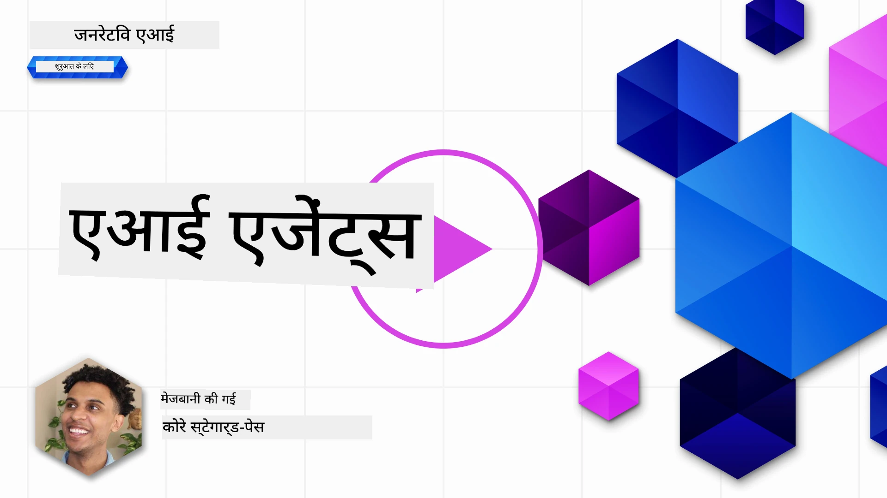
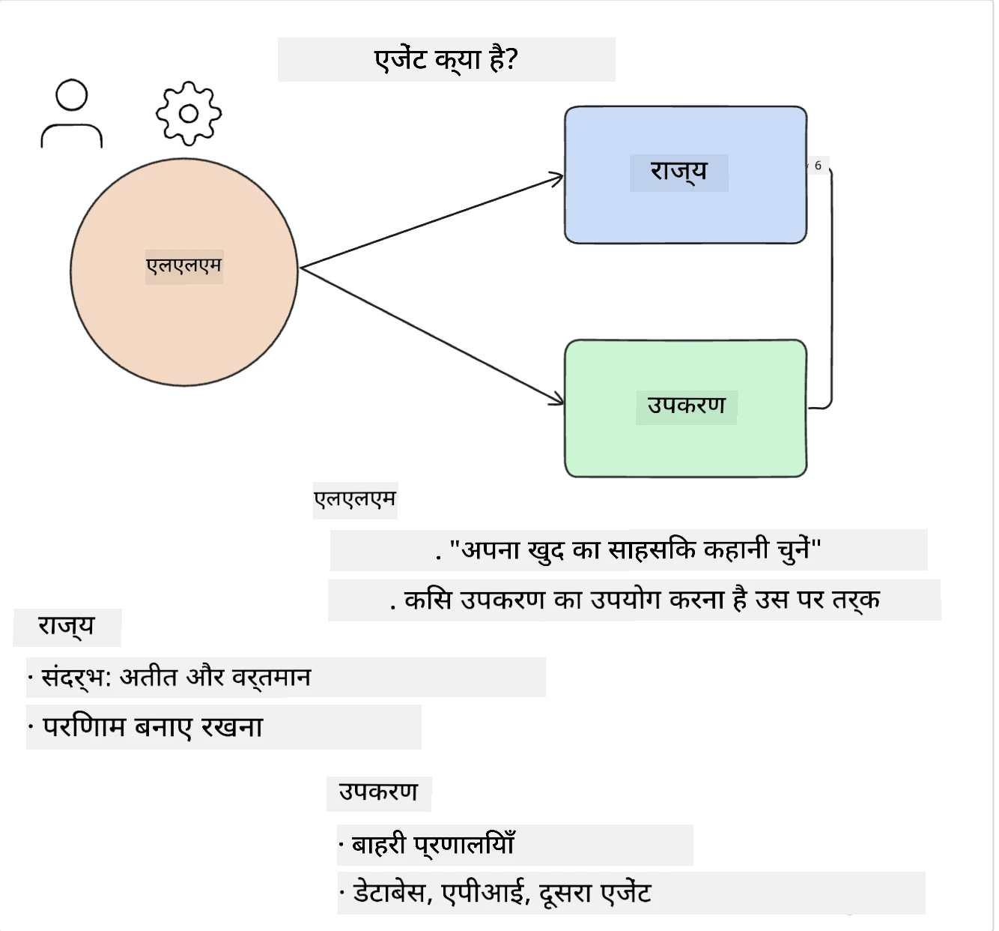
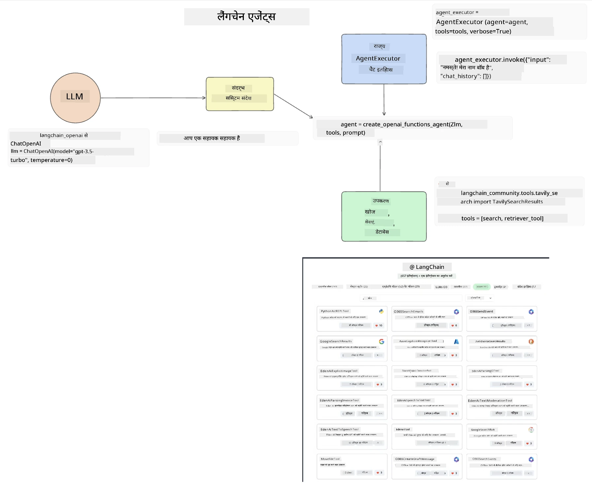
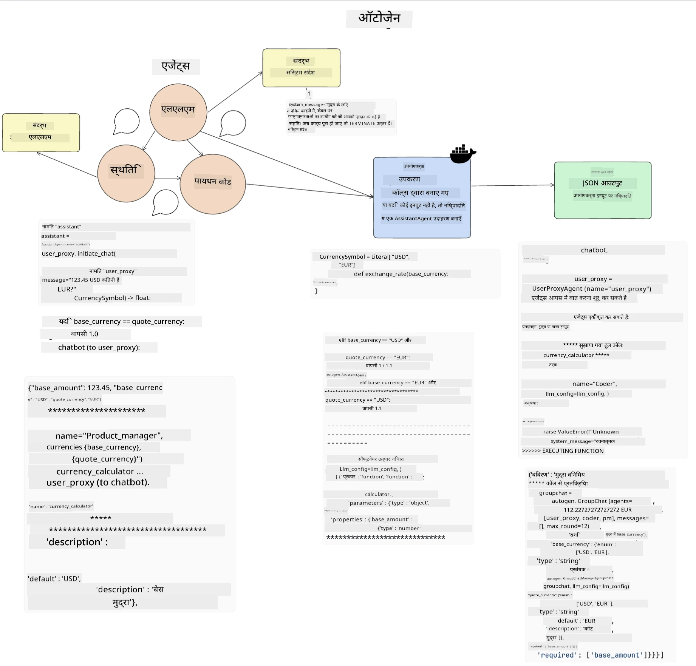
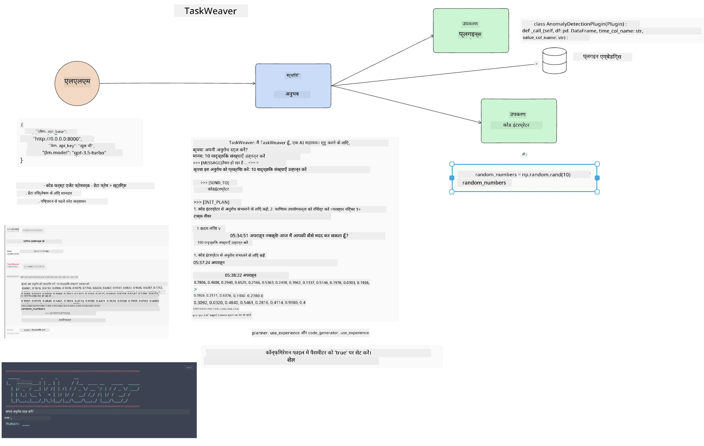
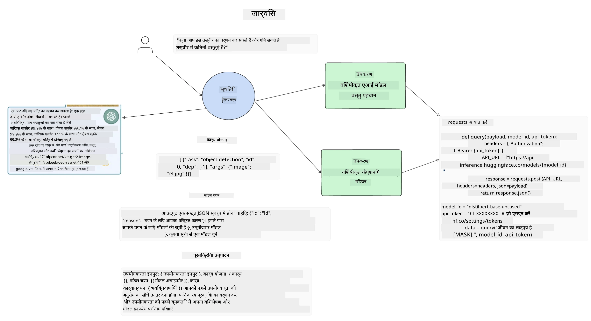

[](https://youtu.be/yAXVW-lUINc?si=bOtW9nL6jc3XJgOM)

## परिचय

एआई एजेंट जेनरेटिव एआई में एक रोमांचक विकास का प्रतिनिधित्व करते हैं, जो बड़े भाषा मॉडल (LLMs) को सहायक से ऐसे एजेंट में विकसित करने में सक्षम बनाते हैं जो कार्य कर सकें। एआई एजेंट फ्रेमवर्क डेवलपर्स को ऐसी एप्लिकेशन बनाने की सुविधा देते हैं जो LLMs को टूल्स और स्टेट प्रबंधन तक पहुँच प्रदान करती हैं। ये फ्रेमवर्क दृश्यता भी बढ़ाते हैं, जिससे उपयोगकर्ता और डेवलपर LLMs द्वारा नियोजित कार्यों की निगरानी कर सकते हैं, इस प्रकार अनुभव प्रबंधन में सुधार होता है।

यह पाठ निम्नलिखित क्षेत्रों को कवर करेगा:

- यह समझना कि एआई एजेंट क्या है - एक एआई एजेंट वास्तव में क्या है?
- चार अलग-अलग एआई एजेंट फ्रेमवर्क की खोज - क्या इन्हें अनोखा बनाता है?
- इन एआई एजेंट्स को विभिन्न उपयोग मामलों में लागू करना - हमें एआई एजेंट्स का उपयोग कब करना चाहिए?

## सीखने के लक्ष्य

इस पाठ को पूरा करने के बाद, आप सक्षम होंगे:

- बताना कि एआई एजेंट क्या हैं और उन्हें कैसे उपयोग किया जा सकता है।
- लोकप्रिय एआई एजेंट फ्रेमवर्क्स के बीच अंतर को समझना, और वे कैसे भिन्न हैं।
- समझना कि एआई एजेंट कैसे कार्य करते हैं ताकि उनके साथ एप्लिकेशन बनाए जा सकें।

## एआई एजेंट क्या हैं?

एआई एजेंट जेनरेटिव एआई की दुनिया में एक बहुत ही रोमांचक क्षेत्र हैं। इस उत्साह के साथ कभी-कभी शब्दों और उनके अनुप्रयोगों को लेकर भ्रम भी होता है। चीजें सरल और अधिक समावेशी बनाने के लिए, जिन टूल्स को एआई एजेंट कहा जाता है, हम निम्नलिखित परिभाषा का उपयोग करेंगे:

एआई एजेंट बड़े भाषा मॉडलों (LLMs) को कार्य करने के लिए एक **राज्य (state)** और **टूल्स (tools)** तक पहुंच प्रदान करते हैं।



आइए इन शब्दों को परिभाषित करें:

**बड़े भाषा मॉडल** - ये वे मॉडल हैं जिनका इस कोर्स में उल्लेख किया गया है जैसे GPT-3.5, GPT-4, Llama-2 आदि।

**राज्य (State)** - यह उस संदर्भ को दर्शाता है जिसमें LLM काम कर रहा है। LLM अपने पिछले कार्यों और वर्तमान संदर्भ का उपयोग करता है, जो आगे के कार्यों के लिए उसके निर्णय-निर्माण का मार्गदर्शन करता है। एआई एजेंट फ्रेमवर्क डेवलपर्स को इस संदर्भ को आसान तरीके से बनाए रखने की अनुमति देते हैं।

**टूल्स (Tools)** - उपयोगकर्ता द्वारा अनुरोधित कार्य पूरा करने और LLM द्वारा नियोजित कार्य को पूरा करने के लिए, LLM को टूल्स तक पहुंच की आवश्यकता होती है। टूल्स के उदाहरण हो सकते हैं डेटाबेस, API, बाहरी एप्लिकेशन या यहां तक कि दूसरा LLM!

ये परिभाषाएं आपको आगे बढ़ने के लिए अच्छी नींव प्रदान करेंगी क्योंकि हम देखेंगे कि इन्हें कैसे लागू किया जाता है। आइए कुछ विभिन्न एआई एजेंट फ्रेमवर्क्स का अन्वेषण करें:

## LangChain एजेंट्स

[LangChain एजेंट्स](https://python.langchain.com/docs/how_to/#agents?WT.mc_id=academic-105485-koreyst) वे परिभाषाएँ लागू करते हैं जो हमने ऊपर दी हैं।

**राज्य (state)** को प्रबंधित करने के लिए, यह `AgentExecutor` नामक एक अंतर्निर्मित फ़ंक्शन का उपयोग करता है। यह परिभाषित `agent` और उपलब्ध `tools` को स्वीकार करता है।

`Agent Executor` चैट इतिहास को भी संग्रहित करता है ताकि चैट का संदर्भ प्रदान किया जा सके।



LangChain एक [टूल्स कैटलॉग](https://integrations.langchain.com/tools?WT.mc_id=academic-105485-koreyst) प्रदान करता है जिसे आपकी एप्लिकेशन में आयात किया जा सकता है, जिसमें LLM को पहुँच मिलती है। ये टूल्स समुदाय और LangChain टीम द्वारा बनाए गए हैं।

आप इन्हें परिभाषित कर `Agent Executor` को सौंप सकते हैं।

दृश्यता भी एआई एजेंट्स के बारे में बात करते समय एक महत्वपूर्ण पहलू है। एप्लिकेशन डेवलपर्स के लिए यह समझना महत्वपूर्ण है कि LLM कौन सा टूल क्यों उपयोग कर रहा है। इस कारण से LangChain टीम ने LangSmith विकसित किया है।

## AutoGen

अगला एआई एजेंट फ्रेमवर्क जिसे हम चर्चा करेंगे वह है [AutoGen](https://microsoft.github.io/autogen/?WT.mc_id=academic-105485-koreyst)। AutoGen का मुख्य फोकस संवाद (conversations) है। एजेंट दोनों ही **संवादी (conversable)** और **अनुकूलन योग्य (customizable)** हैं।

**संवादी -** LLMs किसी कार्य को पूरा करने के लिए दूसरे LLM के साथ बातचीत शुरू और जारी रख सकते हैं। यह `AssistantAgents` बनाने और उन्हें एक विशिष्ट सिस्टम संदेश देने के द्वारा किया जाता है।

```python

autogen.AssistantAgent( name="Coder", llm_config=llm_config, ) pm = autogen.AssistantAgent( name="Product_manager", system_message="Creative in software product ideas.", llm_config=llm_config, )

```

**अनुकूलन योग्य** - एजेंट्स सिर्फ LLM के रूप में ही नहीं, बल्कि एक उपयोगकर्ता या टूल के रूप में भी परिभाषित किए जा सकते हैं। एक डेवलपर के रूप में, आप एक `UserProxyAgent` परिभाषित कर सकते हैं जो कार्य पूरा करने में उपयोगकर्ता से फीडबैक लेता है। यह फीडबैक कार्य के निष्पादन को जारी रख सकता है या उसे रोक सकता है।

```python
user_proxy = UserProxyAgent(name="user_proxy")
```

### राज्य और टूल्स

राज्य बदलने और प्रबंधित करने के लिए, एक सहायक एजेंट कार्य पूरा करने के लिए पायथन कोड जनरेट करता है।

यहाँ इस प्रक्रिया का एक उदाहरण है:



#### सिस्टम संदेश के साथ LLM परिभाषित किया गया

```python
system_message="For weather related tasks, only use the functions you have been provided with. Reply TERMINATE when the task is done."
```

यह सिस्टम संदेश इस विशिष्ट LLM को निर्देशित करता है कि किन फंक्शन्स का उसके कार्य के लिए उपयोग किया जाना है। याद रखें, AutoGen के साथ आप विभिन्न सिस्टम संदेशों के साथ कई AssistantAgents परिभाषित कर सकते हैं।

#### चैट उपयोगकर्ता द्वारा शुरू किया गया

```python
user_proxy.initiate_chat( chatbot, message="I am planning a trip to NYC next week, can you help me pick out what to wear? ", )

```

यह संदेश user_proxy (मानव) से आता है जो एजेंट को उस प्रक्रिया को शुरू करने देता है कि उसे कौन से फंक्शंस निष्पादित करने चाहिए।

#### फंक्शन निष्पादित किया गया

```bash
chatbot (to user_proxy):

***** Suggested tool Call: get_weather ***** Arguments: {"location":"New York City, NY","time_periond:"7","temperature_unit":"Celsius"} ******************************************************** --------------------------------------------------------------------------------

>>>>>>>> EXECUTING FUNCTION get_weather... user_proxy (to chatbot): ***** Response from calling function "get_weather" ***** 112.22727272727272 EUR ****************************************************************

```

प्रारंभिक चैट संसाधित होने के बाद, एजेंट सुझाव देने वाला टूल कॉल करता है। इस मामले में, यह `get_weather` नामक एक फंक्शन है। आपकी कॉन्फ़िगरेशन के अनुसार, यह फंक्शन स्वचालित रूप से निष्पादित हो सकता है या उपयोगकर्ता इनपुट के आधार पर।

आप [AutoGen कोड सैंपल्स](https://microsoft.github.io/autogen/docs/Examples/?WT.mc_id=academic-105485-koreyst) की सूची देख सकते हैं ताकि आप अधिक जान सकें कि कैसे निर्माण शुरू करें।

## Taskweaver

अगला एजेंट फ्रेमवर्क जिसे हम देखेंगे वह है [Taskweaver](https://microsoft.github.io/TaskWeaver/?WT.mc_id=academic-105485-koreyst)। इसे "कोड-प्रथम" एजेंट के रूप में जाना जाता है क्योंकि यह केवल `strings` के साथ काम नहीं करता बल्कि पायथन में DataFrames के साथ काम कर सकता है। यह डेटा विश्लेषण और जनरेशन कार्यों के लिए अत्यंत उपयोगी होता है। जैसे ग्राफ और चार्ट बनाना या रैंडम नंबर जनरेट करना।

### राज्य और टूल्स

संवाद की स्थिति प्रबंधित करने के लिए, TaskWeaver `Planner` की संकल्पना का उपयोग करता है। `Planner` एक LLM है जो उपयोगकर्ता के अनुरोध को लेकर उन कार्यों का नक्शा बनाता है जिन्हें पूरा करना है।

कार्य पूरा करने के लिए `Planner` को `Plugins` नामक टूल्स के संग्रह से अवगत कराया जाता है। ये पायथन क्लासेस या सामान्य कोड इंटरप्रेटर हो सकते हैं। ये प्लगइन्स एम्बेडिंग्स के रूप में संग्रहित किए जाते हैं ताकि LLM बेहतर ढंग से सही प्लगइन खोज सके।



यहाँ विसंगति पता लगाने के लिए एक प्लगइन का उदाहरण है:

```python
class AnomalyDetectionPlugin(Plugin): def __call__(self, df: pd.DataFrame, time_col_name: str, value_col_name: str):
```

कोड निष्पादित करने से पहले सत्यापित किया जाता है। Taskweaver में संदर्भ प्रबंधन की एक अन्य विशेषता है `experience`। अनुभव YAML फ़ाइल में बातचीत के संदर्भ को लंबे समय तक संग्रहीत करने की अनुमति देता है। इसे कॉन्फ़िगर किया जा सकता है ताकि LLM समय के साथ कुछ कार्यों में सुधार करे जब इसे पूर्व बातचीत का अनुभव हो।

## JARVIS

अंतिम एजेंट फ्रेमवर्क जिसे हम देखेंगे वह है [JARVIS](https://github.com/microsoft/JARVIS?tab=readme-ov-file&WT.mc_id=academic-105485-koreyst)। JARVIS की विशिष्टता यह है कि यह बातचीत के `state` को प्रबंधित करने के लिए एक LLM का उपयोग करता है और `tools` अन्य AI मॉडल होते हैं। प्रत्येक AI मॉडल विशिष्ट कार्य करने वाले विशेषज्ञ मॉडल होते हैं जैसे ऑब्जेक्ट डिटेक्शन, ट्रांसक्रिप्शन या इमेज कैप्शनिंग।



LLM, जो एक सामान्य उद्देश्य मॉडल है, उपयोगकर्ता से अनुरोध प्राप्त करता है और विशिष्ट कार्य और कार्य पूरा करने के लिए आवश्यक तर्क/डेटा की पहचान करता है।

```python
[{"task": "object-detection", "id": 0, "dep": [-1], "args": {"image": "e1.jpg" }}]
```

LLM फिर अनुरोध को JSON जैसे प्रारूप में परिवर्तित करता है जिसे विशिष्ट AI मॉडल समझ सके। एक बार AI मॉडल ने अपने पूर्वानुमान को लौटाने के बाद, LLM प्रतिक्रिया प्राप्त करता है।

यदि कार्य पूरा करने के लिए कई मॉडल आवश्यक हैं, तो LLM उन मॉडलों से मिली प्रतिक्रियाओं की व्याख्या भी करता है और फिर उन्हें मिलाकर उपयोगकर्ता को उत्तर प्रदान करता है।

नीचे का उदाहरण दिखाता है कि जब उपयोगकर्ता एक तस्वीर में वस्तुओं का विवरण और संख्या पूछता है तो यह कैसे काम करेगा:

## असाइनमेंट

एआई एजेंट्स के अपने सीखने को जारी रखने के लिए आप AutoGen के साथ निम्न बना सकते हैं:

- एक एप्लिकेशन जो शिक्षा स्टार्टअप के विभिन्न विभागों के साथ एक व्यापारिक बैठक का अनुकरण करता है।
- ऐसे सिस्टम संदेश बनाएं जो LLMs को विभिन्न व्यक्तित्वों और प्राथमिकताओं को समझने में मार्गदर्शन करते हैं, और उपयोगकर्ता को एक नया उत्पाद विचार पेश करने सक्षम बनाते हैं।
- फिर LLM प्रत्येक विभाग से फॉलो-अप प्रश्न उत्पन्न करे ताकि पिच और उत्पाद विचार को परिष्कृत और बेहतर बनाया जा सके।

## सीखना यहाँ नहीं रुकता, यात्रा जारी रखें

इस पाठ को पूरा करने के बाद, हमारी [Generative AI Learning संग्रह](https://aka.ms/genai-collection?WT.mc_id=academic-105485-koreyst) देखें ताकि आप अपनी जेनरेटिव AI ज्ञान को और बढ़ा सकें!

---

<!-- CO-OP TRANSLATOR DISCLAIMER START -->
**अस्वीकरण**:  
यह दस्तावेज़ AI अनुवाद सेवा [Co-op Translator](https://github.com/Azure/co-op-translator) का उपयोग करके अनूदित किया गया है। हम सटीकता के लिए प्रयासरत हैं, लेकिन कृपया ध्यान दें कि स्वचालित अनुवादों में गलतियाँ या अशुद्धियाँ हो सकती हैं। मूल दस्तावेज़ अपनी मूल भाषा में ही अधिकारिक स्रोत माना जाना चाहिए। महत्वपूर्ण जानकारी के लिए, पेशेवर मानव अनुवाद की सलाह दी जाती है। इस अनुवाद के उपयोग से उत्पन्न किसी भी गलतफहमी या गलत व्याख्या के लिए हम जिम्मेदार नहीं हैं।
<!-- CO-OP TRANSLATOR DISCLAIMER END -->