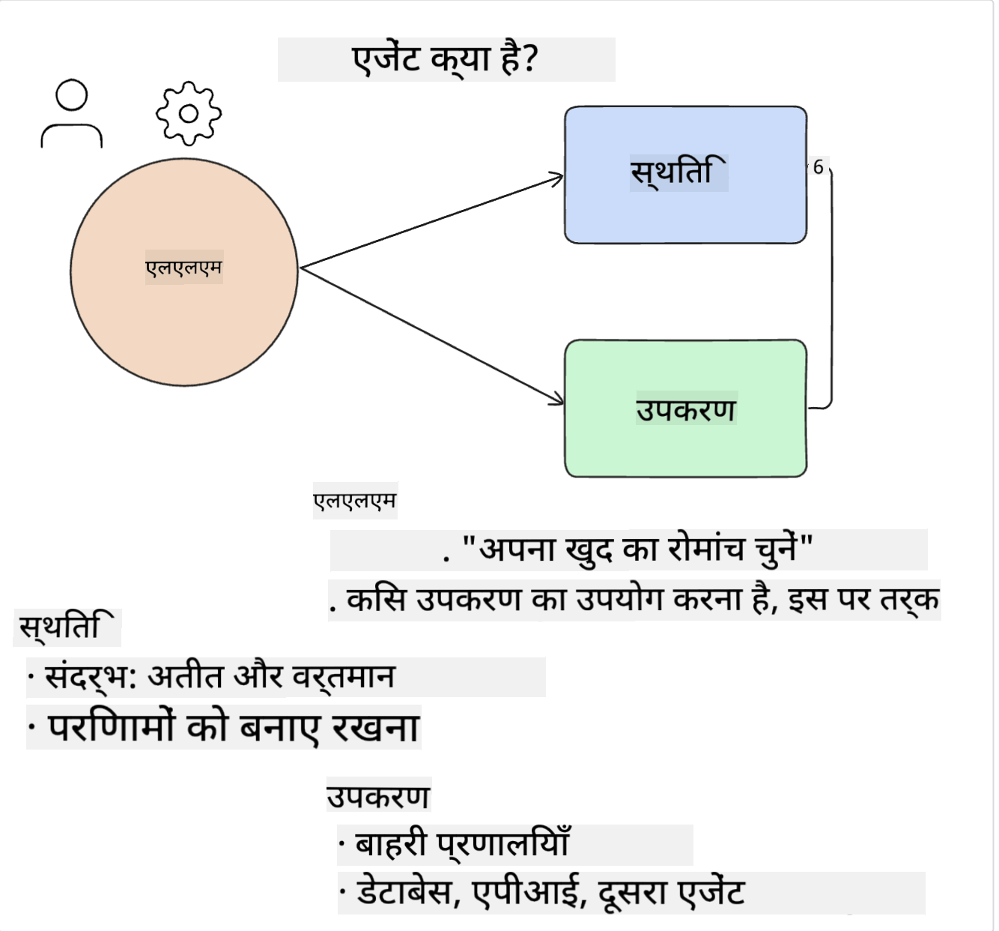
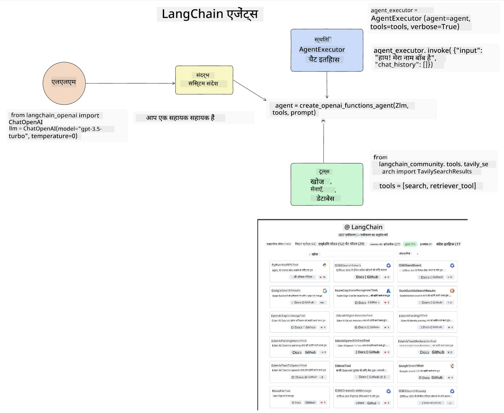
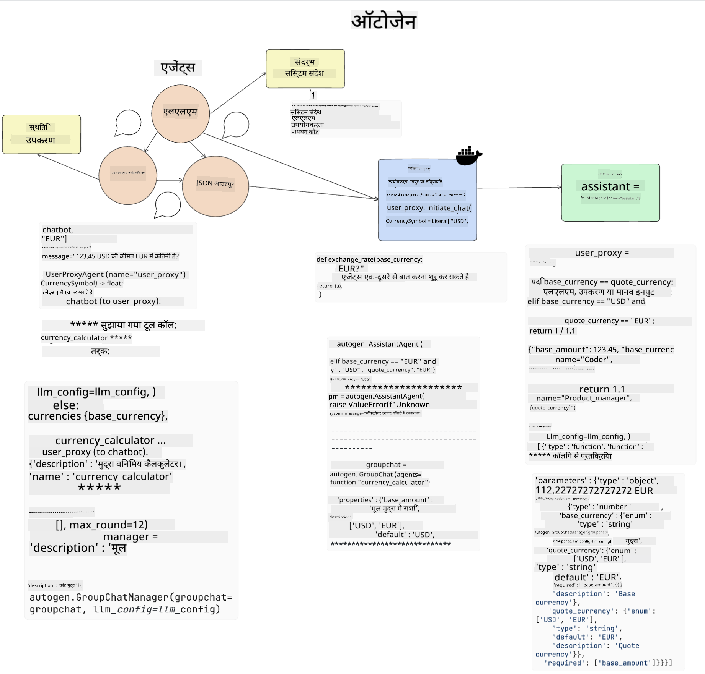

<!--
CO_OP_TRANSLATOR_METADATA:
{
  "original_hash": "11f03c81f190d9cbafd0f977dcbede6c",
  "translation_date": "2025-07-09T17:21:45+00:00",
  "source_file": "17-ai-agents/README.md",
  "language_code": "hi"
}
-->
[](https://aka.ms/gen-ai-lesson17-gh?WT.mc_id=academic-105485-koreyst)

## परिचय

AI एजेंट्स जनरेटिव AI में एक रोमांचक विकास का प्रतिनिधित्व करते हैं, जो बड़े भाषा मॉडल्स (LLMs) को सहायक से ऐसे एजेंट्स में बदलने में सक्षम बनाते हैं जो क्रियाएं कर सकते हैं। AI एजेंट फ्रेमवर्क डेवलपर्स को ऐसे एप्लिकेशन बनाने की अनुमति देते हैं जो LLMs को टूल्स और स्टेट मैनेजमेंट तक पहुंच प्रदान करते हैं। ये फ्रेमवर्क दृश्यता को भी बढ़ाते हैं, जिससे उपयोगकर्ता और डेवलपर्स LLMs द्वारा योजनाबद्ध क्रियाओं की निगरानी कर सकते हैं, जिससे अनुभव प्रबंधन बेहतर होता है।

यह पाठ निम्नलिखित क्षेत्रों को कवर करेगा:

- AI एजेंट क्या है - AI एजेंट वास्तव में क्या होता है?
- चार अलग-अलग AI एजेंट फ्रेमवर्क्स का अन्वेषण - इन्हें क्या खास बनाता है?
- इन AI एजेंट्स को विभिन्न उपयोग मामलों में लागू करना - हमें AI एजेंट्स कब उपयोग करने चाहिए?

## सीखने के लक्ष्य

इस पाठ को पूरा करने के बाद, आप सक्षम होंगे:

- समझा सकेंगे कि AI एजेंट्स क्या हैं और उनका उपयोग कैसे किया जा सकता है।
- कुछ लोकप्रिय AI एजेंट फ्रेमवर्क्स के बीच के अंतर को समझेंगे और वे कैसे भिन्न हैं।
- यह समझेंगे कि AI एजेंट्स कैसे काम करते हैं ताकि आप उनके साथ एप्लिकेशन बना सकें।

## AI एजेंट्स क्या हैं?

AI एजेंट्स जनरेटिव AI की दुनिया में एक बहुत ही रोमांचक क्षेत्र हैं। इस उत्साह के साथ कभी-कभी शब्दों और उनके उपयोग को लेकर भ्रम भी होता है। चीजों को सरल और उन अधिकांश टूल्स को शामिल करने के लिए जो AI एजेंट्स को संदर्भित करते हैं, हम इस परिभाषा का उपयोग करेंगे:

AI एजेंट्स बड़े भाषा मॉडल्स (LLMs) को **स्टेट** और **टूल्स** तक पहुंच देकर कार्य करने में सक्षम बनाते हैं।



आइए इन शब्दों को परिभाषित करें:

**बड़े भाषा मॉडल्स** - ये वे मॉडल हैं जिनका इस कोर्स में उल्लेख किया गया है जैसे GPT-3.5, GPT-4, Llama-2 आदि।

**स्टेट** - यह उस संदर्भ को दर्शाता है जिसमें LLM काम कर रहा होता है। LLM अपने पिछले कार्यों और वर्तमान संदर्भ का उपयोग करता है, जो उसके अगले कार्यों के निर्णय को मार्गदर्शित करता है। AI एजेंट फ्रेमवर्क्स डेवलपर्स को इस संदर्भ को बनाए रखना आसान बनाते हैं।

**टूल्स** - उपयोगकर्ता द्वारा अनुरोधित और LLM द्वारा योजनाबद्ध कार्य को पूरा करने के लिए, LLM को टूल्स तक पहुंच की आवश्यकता होती है। टूल्स के उदाहरण हो सकते हैं डेटाबेस, API, बाहरी एप्लिकेशन या यहां तक कि एक अन्य LLM!

ये परिभाषाएं आपको आगे बढ़ने के लिए एक अच्छी नींव देंगी जब हम देखेंगे कि इन्हें कैसे लागू किया जाता है। आइए कुछ अलग-अलग AI एजेंट फ्रेमवर्क्स का अन्वेषण करें:

## LangChain एजेंट्स

[LangChain एजेंट्स](https://python.langchain.com/docs/how_to/#agents?WT.mc_id=academic-105485-koreyst) ऊपर दी गई परिभाषाओं का एक कार्यान्वयन है।

**स्टेट** को प्रबंधित करने के लिए, यह एक अंतर्निहित फ़ंक्शन `AgentExecutor` का उपयोग करता है। यह परिभाषित `agent` और उपलब्ध `tools` को स्वीकार करता है।

`AgentExecutor` चैट इतिहास को भी संग्रहीत करता है ताकि चैट का संदर्भ प्रदान किया जा सके।



LangChain एक [टूल्स का कैटलॉग](https://integrations.langchain.com/tools?WT.mc_id=academic-105485-koreyst) प्रदान करता है जिसे आप अपने एप्लिकेशन में इम्पोर्ट कर सकते हैं, जिन तक LLM को पहुंच मिलती है। ये टूल्स समुदाय और LangChain टीम द्वारा बनाए गए हैं।

आप इन टूल्स को परिभाषित कर सकते हैं और उन्हें `AgentExecutor` को पास कर सकते हैं।

AI एजेंट्स की बात करते समय दृश्यता एक और महत्वपूर्ण पहलू है। यह एप्लिकेशन डेवलपर्स के लिए महत्वपूर्ण है कि वे समझें कि LLM कौन सा टूल क्यों उपयोग कर रहा है। इसके लिए LangChain टीम ने LangSmith विकसित किया है।

## AutoGen

अगला AI एजेंट फ्रेमवर्क जिसका हम चर्चा करेंगे वह है [AutoGen](https://microsoft.github.io/autogen/?WT.mc_id=academic-105485-koreyst)। AutoGen का मुख्य फोकस संवादों पर है। एजेंट्स दोनों **संवादात्मक** और **अनुकूलनीय** होते हैं।

**संवादात्मक -** LLMs एक कार्य पूरा करने के लिए दूसरे LLM के साथ बातचीत शुरू और जारी रख सकते हैं। यह `AssistantAgents` बनाकर और उन्हें एक विशिष्ट सिस्टम संदेश देकर किया जाता है।

```python

autogen.AssistantAgent( name="Coder", llm_config=llm_config, ) pm = autogen.AssistantAgent( name="Product_manager", system_message="Creative in software product ideas.", llm_config=llm_config, )

```

**अनुकूलनीय** - एजेंट्स केवल LLMs के रूप में ही नहीं, बल्कि उपयोगकर्ता या टूल के रूप में भी परिभाषित किए जा सकते हैं। एक डेवलपर के रूप में, आप `UserProxyAgent` परिभाषित कर सकते हैं जो कार्य पूरा करने के लिए उपयोगकर्ता से प्रतिक्रिया लेने के लिए जिम्मेदार होता है। यह प्रतिक्रिया कार्य को जारी रखने या रोकने के लिए हो सकती है।

```python
user_proxy = UserProxyAgent(name="user_proxy")
```

### स्टेट और टूल्स

स्टेट को बदलने और प्रबंधित करने के लिए, एक सहायक एजेंट कार्य पूरा करने के लिए Python कोड उत्पन्न करता है।

यहाँ प्रक्रिया का एक उदाहरण है:



#### सिस्टम संदेश के साथ परिभाषित LLM

```python
system_message="For weather related tasks, only use the functions you have been provided with. Reply TERMINATE when the task is done."
```

यह सिस्टम संदेश इस विशिष्ट LLM को निर्देशित करता है कि उसके कार्य के लिए कौन से फ़ंक्शन प्रासंगिक हैं। याद रखें, AutoGen के साथ आप विभिन्न सिस्टम संदेशों के साथ कई AssistantAgents परिभाषित कर सकते हैं।

#### उपयोगकर्ता द्वारा चैट शुरू की जाती है

```python
user_proxy.initiate_chat( chatbot, message="I am planning a trip to NYC next week, can you help me pick out what to wear? ", )

```

यह संदेश user_proxy (मानव) से आता है जो एजेंट को संभावित फ़ंक्शंस का पता लगाने की प्रक्रिया शुरू करता है जिन्हें उसे निष्पादित करना चाहिए।

#### फ़ंक्शन निष्पादित किया जाता है

```bash
chatbot (to user_proxy):

***** Suggested tool Call: get_weather ***** Arguments: {"location":"New York City, NY","time_periond:"7","temperature_unit":"Celsius"} ******************************************************** --------------------------------------------------------------------------------

>>>>>>>> EXECUTING FUNCTION get_weather... user_proxy (to chatbot): ***** Response from calling function "get_weather" ***** 112.22727272727272 EUR ****************************************************************

```

प्रारंभिक चैट संसाधित होने के बाद, एजेंट सुझावित टूल को कॉल करता है। इस मामले में, यह `get_weather` नामक एक फ़ंक्शन है। आपकी कॉन्फ़िगरेशन के अनुसार, यह फ़ंक्शन स्वचालित रूप से निष्पादित हो सकता है और एजेंट द्वारा पढ़ा जा सकता है या उपयोगकर्ता इनपुट के आधार पर निष्पादित हो सकता है।

आप [AutoGen कोड नमूनों](https://microsoft.github.io/autogen/docs/Examples/?WT.mc_id=academic-105485-koreyst) की सूची पा सकते हैं ताकि आप और अधिक जान सकें कि कैसे शुरुआत करें।

## Taskweaver

अगला एजेंट फ्रेमवर्क जिसे हम देखेंगे वह है [Taskweaver](https://microsoft.github.io/TaskWeaver/?WT.mc_id=academic-105485-koreyst)। इसे "कोड-फर्स्ट" एजेंट कहा जाता है क्योंकि यह केवल `strings` के साथ काम करने के बजाय Python में DataFrames के साथ काम कर सकता है। यह डेटा विश्लेषण और जनरेशन कार्यों के लिए अत्यंत उपयोगी होता है। इसमें ग्राफ़ और चार्ट बनाना या यादृच्छिक संख्याएं उत्पन्न करना शामिल हो सकता है।

### स्टेट और टूल्स

संवाद की स्थिति को प्रबंधित करने के लिए, TaskWeaver `Planner` की अवधारणा का उपयोग करता है। `Planner` एक LLM है जो उपयोगकर्ताओं से अनुरोध लेता है और उन कार्यों का नक्शा बनाता है जिन्हें इस अनुरोध को पूरा करने के लिए पूरा करना आवश्यक है।

कार्य पूरा करने के लिए `Planner` को `Plugins` नामक टूल्स के संग्रह तक पहुंच दी जाती है। ये Python क्लासेस या सामान्य कोड इंटरप्रेटर हो सकते हैं। ये प्लगइन्स एम्बेडिंग्स के रूप में संग्रहीत होते हैं ताकि LLM सही प्लगइन को बेहतर ढंग से खोज सके।


यहाँ एक प्लगइन का उदाहरण है जो विसंगति पहचान को संभालता है:

```python
class AnomalyDetectionPlugin(Plugin): def __call__(self, df: pd.DataFrame, time_col_name: str, value_col_name: str):
```

कोड निष्पादित करने से पहले सत्यापित किया जाता है। Taskweaver में संदर्भ प्रबंधन की एक और विशेषता है `experience`। अनुभव एक YAML फ़ाइल में लंबे समय तक संवाद के संदर्भ को संग्रहीत करने की अनुमति देता है। इसे इस तरह से कॉन्फ़िगर किया जा सकता है कि LLM समय के साथ कुछ कार्यों में सुधार करे, बशर्ते कि इसे पिछले संवादों के संपर्क में रखा जाए।

## JARVIS

अंतिम एजेंट फ्रेमवर्क जिसे हम देखेंगे वह है [JARVIS](https://github.com/microsoft/JARVIS?tab=readme-ov-file?WT.mc_id=academic-105485-koreyst)। JARVIS की खास बात यह है कि यह संवाद की `state` को प्रबंधित करने के लिए एक LLM का उपयोग करता है और `tools` अन्य AI मॉडल्स होते हैं। प्रत्येक AI मॉडल विशिष्ट कार्य करता है जैसे ऑब्जेक्ट डिटेक्शन, ट्रांसक्रिप्शन या इमेज कैप्शनिंग।


LLM, जो एक सामान्य प्रयोजन मॉडल है, उपयोगकर्ता से अनुरोध प्राप्त करता है और विशिष्ट कार्य और आवश्यक तर्क/डेटा की पहचान करता है।

```python
[{"task": "object-detection", "id": 0, "dep": [-1], "args": {"image": "e1.jpg" }}]
```

फिर LLM अनुरोध को इस तरह से फॉर्मेट करता है जिसे विशिष्ट AI मॉडल समझ सके, जैसे JSON। एक बार AI मॉडल ने अपने पूर्वानुमान के आधार पर प्रतिक्रिया दी, LLM उस प्रतिक्रिया को प्राप्त करता है।

यदि कार्य पूरा करने के लिए कई मॉडल्स की आवश्यकता होती है, तो यह उन मॉडलों से प्राप्त प्रतिक्रियाओं की व्याख्या भी करता है और फिर उन्हें मिलाकर उपयोगकर्ता को प्रतिक्रिया प्रदान करता है।

नीचे दिया गया उदाहरण दिखाता है कि जब उपयोगकर्ता एक तस्वीर में वस्तुओं का विवरण और संख्या मांगता है तो यह कैसे काम करता है:

## असाइनमेंट

AI एजेंट्स के अपने ज्ञान को आगे बढ़ाने के लिए आप AutoGen के साथ निम्न बना सकते हैं:

- एक ऐसा एप्लिकेशन जो एक शिक्षा स्टार्टअप के विभिन्न विभागों के साथ एक व्यवसाय बैठक का अनुकरण करता है।
- सिस्टम संदेश बनाएं जो LLMs को विभिन्न व्यक्तित्वों और प्राथमिकताओं को समझने में मार्गदर्शन करें, और उपयोगकर्ता को एक नया उत्पाद विचार प्रस्तुत करने में सक्षम बनाएं।
- फिर LLM प्रत्येक विभाग से फॉलो-अप प्रश्न उत्पन्न करे ताकि पिच और उत्पाद विचार को परिष्कृत और बेहतर बनाया जा सके।

## सीखना यहीं खत्म नहीं होता, यात्रा जारी रखें

इस पाठ को पूरा करने के बाद, हमारे [Generative AI Learning संग्रह](https://aka.ms/genai-collection?WT.mc_id=academic-105485-koreyst) को देखें ताकि आप अपने जनरेटिव AI ज्ञान को और बढ़ा सकें!

**अस्वीकरण**:  
यह दस्तावेज़ AI अनुवाद सेवा [Co-op Translator](https://github.com/Azure/co-op-translator) का उपयोग करके अनुवादित किया गया है। जबकि हम सटीकता के लिए प्रयासरत हैं, कृपया ध्यान दें कि स्वचालित अनुवादों में त्रुटियाँ या अशुद्धियाँ हो सकती हैं। मूल दस्तावेज़ अपनी मूल भाषा में ही अधिकारिक स्रोत माना जाना चाहिए। महत्वपूर्ण जानकारी के लिए, पेशेवर मानव अनुवाद की सलाह दी जाती है। इस अनुवाद के उपयोग से उत्पन्न किसी भी गलतफहमी या गलत व्याख्या के लिए हम जिम्मेदार नहीं हैं।