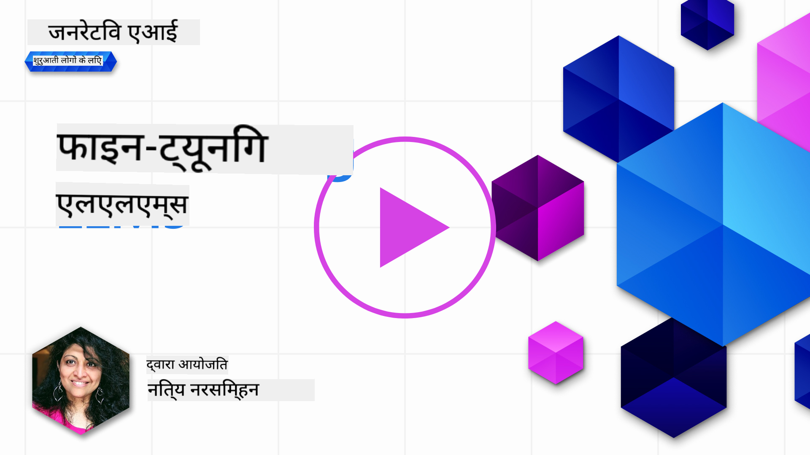
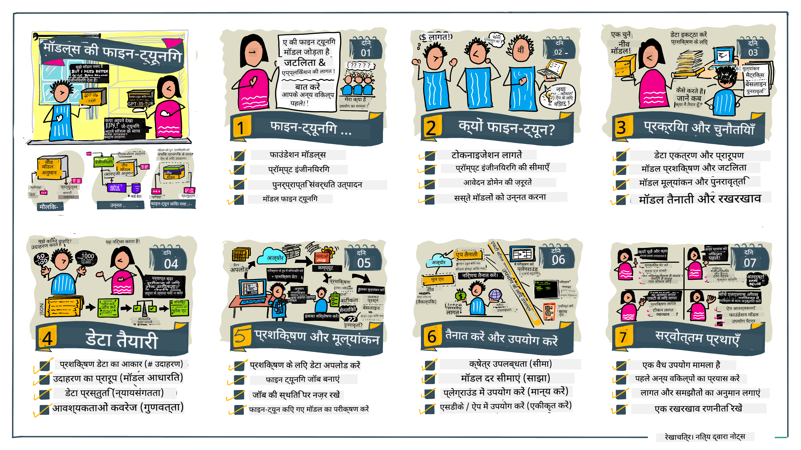

<!--
CO_OP_TRANSLATOR_METADATA:
{
  "original_hash": "68664f7e754a892ae1d8d5e2b7bd2081",
  "translation_date": "2025-07-09T17:38:59+00:00",
  "source_file": "18-fine-tuning/README.md",
  "language_code": "hi"
}
-->

# अपने LLM को फाइन-ट्यून करना

जनरेटिव AI एप्लिकेशन बनाने के लिए बड़े भाषा मॉडल का उपयोग करने में नई चुनौतियाँ आती हैं। एक मुख्य समस्या यह सुनिश्चित करना है कि मॉडल द्वारा उपयोगकर्ता के अनुरोध के लिए उत्पन्न सामग्री की प्रतिक्रिया की गुणवत्ता (सटीकता और प्रासंगिकता) अच्छी हो। पिछले पाठों में, हमने प्रॉम्प्ट इंजीनियरिंग और रिट्रीवल-ऑगमेंटेड जनरेशन जैसी तकनीकों पर चर्चा की थी, जो मौजूदा मॉडल के प्रॉम्प्ट इनपुट को संशोधित करके इस समस्या को हल करने की कोशिश करती हैं।

आज के पाठ में, हम तीसरी तकनीक, **फाइन-ट्यूनिंग**, पर चर्चा करेंगे, जो अतिरिक्त डेटा के साथ _मॉडल को फिर से प्रशिक्षित_ करके इस चुनौती को हल करने की कोशिश करती है। आइए विस्तार में जानते हैं।

## सीखने के उद्देश्य

यह पाठ प्री-ट्रेंड भाषा मॉडलों के लिए फाइन-ट्यूनिंग की अवधारणा से परिचित कराता है, इस दृष्टिकोण के लाभ और चुनौतियों का पता लगाता है, और यह बताता है कि कब और कैसे फाइन-ट्यूनिंग का उपयोग करके अपने जनरेटिव AI मॉडलों के प्रदर्शन में सुधार किया जा सकता है।

इस पाठ के अंत तक, आप निम्नलिखित प्रश्नों के उत्तर दे पाएंगे:

- भाषा मॉडलों के लिए फाइन-ट्यूनिंग क्या है?
- फाइन-ट्यूनिंग कब और क्यों उपयोगी होती है?
- मैं प्री-ट्रेंड मॉडल को कैसे फाइन-ट्यून कर सकता हूँ?
- फाइन-ट्यूनिंग की सीमाएँ क्या हैं?

तैयार हैं? चलिए शुरू करते हैं।

## चित्रित मार्गदर्शिका

क्या आप शुरू करने से पहले इस पाठ में कवर किए जाने वाले विषयों का एक बड़ा चित्र देखना चाहते हैं? इस चित्रित मार्गदर्शिका को देखें, जो फाइन-ट्यूनिंग के मूल सिद्धांतों और प्रेरणा से लेकर प्रक्रिया और सर्वोत्तम प्रथाओं तक के सीखने के सफर का वर्णन करती है। यह एक रोचक विषय है, इसलिए अपनी स्व-निर्देशित सीखने की यात्रा के लिए अतिरिक्त लिंक पाने के लिए [Resources](./RESOURCES.md?WT.mc_id=academic-105485-koreyst) पेज जरूर देखें!

## भाषा मॉडलों के लिए फाइन-ट्यूनिंग क्या है?

परिभाषा के अनुसार, बड़े भाषा मॉडल इंटरनेट सहित विभिन्न स्रोतों से प्राप्त बड़ी मात्रा में टेक्स्ट पर _प्री-ट्रेंड_ होते हैं। जैसा कि हमने पिछले पाठों में सीखा है, हमें मॉडल की प्रतिक्रियाओं की गुणवत्ता सुधारने के लिए _प्रॉम्प्ट इंजीनियरिंग_ और _रिट्रीवल-ऑगमेंटेड जनरेशन_ जैसी तकनीकों की आवश्यकता होती है।

एक लोकप्रिय प्रॉम्प्ट इंजीनियरिंग तकनीक में मॉडल को यह बताना शामिल है कि प्रतिक्रिया में क्या अपेक्षित है, या तो _निर्देश_ (स्पष्ट मार्गदर्शन) देकर या _कुछ उदाहरण_ देकर (अस्पष्ट मार्गदर्शन)। इसे _फ्यू-शॉट लर्निंग_ कहा जाता है, लेकिन इसके दो सीमाएं हैं:

- मॉडल के टोकन सीमा के कारण आप जितने उदाहरण दे सकते हैं, उनकी संख्या सीमित हो जाती है, जिससे प्रभावशीलता कम हो सकती है।
- मॉडल टोकन लागत के कारण हर प्रॉम्प्ट में उदाहरण जोड़ना महंगा हो सकता है, जिससे लचीलापन कम हो जाता है।

फाइन-ट्यूनिंग मशीन लर्निंग सिस्टम में एक सामान्य अभ्यास है, जिसमें हम एक प्री-ट्रेंड मॉडल लेकर उसे नए डेटा के साथ फिर से प्रशिक्षित करते हैं ताकि किसी विशिष्ट कार्य पर उसका प्रदर्शन बेहतर हो सके। भाषा मॉडलों के संदर्भ में, हम प्री-ट्रेंड मॉडल को _किसी विशेष कार्य या एप्लिकेशन डोमेन के लिए चुने हुए उदाहरणों के सेट के साथ_ फाइन-ट्यून कर सकते हैं, जिससे एक **कस्टम मॉडल** बनता है जो उस विशिष्ट कार्य या डोमेन के लिए अधिक सटीक और प्रासंगिक हो सकता है। फाइन-ट्यूनिंग का एक अतिरिक्त लाभ यह है कि यह फ्यू-शॉट लर्निंग के लिए आवश्यक उदाहरणों की संख्या को भी कम कर सकता है - जिससे टोकन उपयोग और संबंधित लागतें घटती हैं।

## हमें मॉडल को कब और क्यों फाइन-ट्यून करना चाहिए?

_इस_ संदर्भ में, जब हम फाइन-ट्यूनिंग की बात करते हैं, तो हमारा मतलब है **सुपरवाइज्ड** फाइन-ट्यूनिंग, जिसमें पुनः प्रशिक्षण के लिए **नया डेटा** जोड़ा जाता है जो मूल प्रशिक्षण डेटा सेट का हिस्सा नहीं था। यह अनसुपरवाइज्ड फाइन-ट्यूनिंग से अलग है, जिसमें मॉडल को मूल डेटा पर, लेकिन अलग हाइपरपैरामीटर के साथ पुनः प्रशिक्षित किया जाता है।

सबसे महत्वपूर्ण बात यह है कि फाइन-ट्यूनिंग एक उन्नत तकनीक है, जिसके लिए अपेक्षित परिणाम पाने हेतु एक निश्चित स्तर की विशेषज्ञता आवश्यक होती है। यदि इसे गलत तरीके से किया गया, तो यह अपेक्षित सुधार नहीं दे सकता, बल्कि आपके लक्षित डोमेन के लिए मॉडल के प्रदर्शन को भी खराब कर सकता है।

इसलिए, "कैसे" फाइन-ट्यून करना है सीखने से पहले, आपको यह जानना जरूरी है कि "क्यों" आपको यह रास्ता अपनाना चाहिए, और "कब" फाइन-ट्यूनिंग की प्रक्रिया शुरू करनी चाहिए। अपने आप से ये प्रश्न पूछें:

- **उपयोग मामला**: आपका फाइन-ट्यूनिंग के लिए _उपयोग मामला_ क्या है? आप वर्तमान प्री-ट्रेंड मॉडल के किस पहलू में सुधार करना चाहते हैं?
- **विकल्प**: क्या आपने _अन्य तकनीकों_ को आजमाया है ताकि वांछित परिणाम मिल सकें? उनका उपयोग तुलना के लिए आधार बनाने में करें।
  - प्रॉम्प्ट इंजीनियरिंग: प्रासंगिक प्रॉम्प्ट प्रतिक्रियाओं के उदाहरणों के साथ फ्यू-शॉट प्रॉम्प्टिंग जैसी तकनीकों को आजमाएं। प्रतिक्रियाओं की गुणवत्ता का मूल्यांकन करें।
  - रिट्रीवल ऑगमेंटेड जनरेशन: अपने डेटा की खोज से प्राप्त क्वेरी परिणामों के साथ प्रॉम्प्ट को बढ़ाएं। प्रतिक्रियाओं की गुणवत्ता का मूल्यांकन करें।
- **लागत**: क्या आपने फाइन-ट्यूनिंग की लागतों की पहचान की है?
  - ट्यूनबिलिटी - क्या प्री-ट्रेंड मॉडल फाइन-ट्यूनिंग के लिए उपलब्ध है?
  - प्रयास - प्रशिक्षण डेटा तैयार करने, मॉडल का मूल्यांकन और सुधार करने के लिए।
  - कंप्यूट - फाइन-ट्यूनिंग जॉब चलाने और फाइन-ट्यून किए गए मॉडल को तैनात करने के लिए।
  - डेटा - फाइन-ट्यूनिंग के प्रभाव के लिए पर्याप्त गुणवत्ता वाले उदाहरणों तक पहुंच।
- **लाभ**: क्या आपने फाइन-ट्यूनिंग के लाभों की पुष्टि की है?
  - गुणवत्ता - क्या फाइन-ट्यून किया गया मॉडल बेसलाइन से बेहतर प्रदर्शन करता है?
  - लागत - क्या यह प्रॉम्प्ट को सरल बनाकर टोकन उपयोग कम करता है?
  - विस्तारशीलता - क्या आप बेस मॉडल को नए डोमेन के लिए पुनः उपयोग कर सकते हैं?

इन प्रश्नों के उत्तर देकर, आप तय कर पाएंगे कि फाइन-ट्यूनिंग आपके उपयोग मामले के लिए सही तरीका है या नहीं। आदर्श रूप से, यह तरीका तभी मान्य है जब लाभ लागत से अधिक हों। एक बार जब आप आगे बढ़ने का निर्णय ले लें, तो यह सोचने का समय है कि आप प्री-ट्रेंड मॉडल को _कैसे_ फाइन-ट्यून कर सकते हैं।

निर्णय लेने की प्रक्रिया पर और जानकारी चाहिए? देखें [To fine-tune or not to fine-tune](https://www.youtube.com/watch?v=0Jo-z-MFxJs)

## हम प्री-ट्रेंड मॉडल को कैसे फाइन-ट्यून कर सकते हैं?

प्री-ट्रेंड मॉडल को फाइन-ट्यून करने के लिए आपके पास होना चाहिए:

- फाइन-ट्यून करने के लिए एक प्री-ट्रेंड मॉडल
- फाइन-ट्यूनिंग के लिए उपयोग करने वाला डेटा सेट
- फाइन-ट्यूनिंग जॉब चलाने के लिए प्रशिक्षण वातावरण
- फाइन-ट्यून किए गए मॉडल को तैनात करने के लिए होस्टिंग वातावरण

## फाइन-ट्यूनिंग क्रियान्वयन में

निम्नलिखित संसाधन आपको एक चयनित मॉडल और चुने हुए डेटा सेट के साथ एक वास्तविक उदाहरण के माध्यम से चरण-दर-चरण ट्यूटोरियल प्रदान करते हैं। इन ट्यूटोरियल्स को करने के लिए, आपको संबंधित प्रदाता पर एक खाता चाहिए, साथ ही संबंधित मॉडल और डेटा सेट तक पहुंच भी।

| प्रदाता       | ट्यूटोरियल                                                                                                                                                                    | विवरण                                                                                                                                                                                                                                                                                                                                                                                                                             |
| ------------ | ----------------------------------------------------------------------------------------------------------------------------------------------------------------------------- | --------------------------------------------------------------------------------------------------------------------------------------------------------------------------------------------------------------------------------------------------------------------------------------------------------------------------------------------------------------------------------------------------------------------------------- |
| OpenAI       | [How to fine-tune chat models](https://github.com/openai/openai-cookbook/blob/main/examples/How_to_finetune_chat_models.ipynb?WT.mc_id=academic-105485-koreyst)                | एक विशिष्ट डोमेन ("रेसिपी असिस्टेंट") के लिए `gpt-35-turbo` को फाइन-ट्यून करना सीखें, जिसमें प्रशिक्षण डेटा तैयार करना, फाइन-ट्यूनिंग जॉब चलाना, और फाइन-ट्यून किए गए मॉडल का उपयोग करके इनफेरेंस करना शामिल है।                                                                                                                                                                                                                     |
| Azure OpenAI | [GPT 3.5 Turbo fine-tuning tutorial](https://learn.microsoft.com/azure/ai-services/openai/tutorials/fine-tune?tabs=python-new%2Ccommand-line?WT.mc_id=academic-105485-koreyst) | Azure पर `gpt-35-turbo-0613` मॉडल को फाइन-ट्यून करना सीखें, जिसमें प्रशिक्षण डेटा बनाना और अपलोड करना, फाइन-ट्यूनिंग जॉब चलाना, और नए मॉडल को तैनात करना शामिल है।                                                                                                                                                                                                                                                               |
| Hugging Face | [Fine-tuning LLMs with Hugging Face](https://www.philschmid.de/fine-tune-llms-in-2024-with-trl?WT.mc_id=academic-105485-koreyst)                                               | यह ब्लॉग पोस्ट आपको _ओपन LLM_ (जैसे `CodeLlama 7B`) को [transformers](https://huggingface.co/docs/transformers/index?WT.mc_id=academic-105485-koreyst) लाइब्रेरी और [Transformer Reinforcement Learning (TRL)](https://huggingface.co/docs/trl/index?WT.mc_id=academic-105485-koreyst) के साथ फाइन-ट्यून करना सिखाता है, साथ ही Hugging Face पर उपलब्ध खुले [डेटासेट्स](https://huggingface.co/docs/datasets/index?WT.mc_id=academic-105485-koreyst) का उपयोग करता है। |
|              |                                                                                                                                                                               |                                                                                                                                                                                                                                                                                                                                                                                                                                   |
| 🤗 AutoTrain | [Fine-tuning LLMs with AutoTrain](https://github.com/huggingface/autotrain-advanced/?WT.mc_id=academic-105485-koreyst)                                                         | AutoTrain (या AutoTrain Advanced) Hugging Face द्वारा विकसित एक पायथन लाइब्रेरी है जो कई विभिन्न कार्यों के लिए फाइन-ट्यूनिंग की अनुमति देती है, जिसमें LLM फाइन-ट्यूनिंग भी शामिल है। AutoTrain एक नो-कोड समाधान है और फाइन-ट्यूनिंग आपके अपने क्लाउड, Hugging Face Spaces या लोकल स्तर पर की जा सकती है। यह वेब-आधारित GUI, CLI और yaml कॉन्फ़िग फाइलों के माध्यम से प्रशिक्षण का समर्थन करता है।                                                                                   |
|              |                                                                                                                                                                               |                                                                                                                                                                                                                                                                                                                                                                                                                                   |

## असाइनमेंट

ऊपर दिए गए ट्यूटोरियल्स में से किसी एक को चुनें और उसे पूरा करें। _हम इन ट्यूटोरियल्स का एक संस्करण Jupyter Notebooks में संदर्भ के लिए बना सकते हैं। कृपया नवीनतम संस्करणों के लिए सीधे मूल स्रोतों का उपयोग करें_।

## शानदार काम! अपनी सीख जारी रखें।

इस पाठ को पूरा करने के बाद, हमारे [Generative AI Learning collection](https://aka.ms/genai-collection?WT.mc_id=academic-105485-koreyst) को देखें और अपनी जनरेटिव AI की जानकारी को और बढ़ाएं!

बधाई हो!! आपने इस कोर्स की v2 श्रृंखला का अंतिम पाठ पूरा कर लिया है! सीखना और निर्माण करना बंद न करें। \*\*इस विषय के लिए अतिरिक्त सुझावों की सूची के लिए [RESOURCES](RESOURCES.md?WT.mc_id=academic-105485-koreyst) पेज देखें।

हमारी v1 श्रृंखला के पाठों को भी अधिक असाइनमेंट और अवधारणाओं के साथ अपडेट किया गया है। इसलिए एक मिनट निकालकर अपनी जानकारी को ताज़ा करें - और कृपया [अपने प्रश्न और प्रतिक्रिया साझा करें](https://github.com/microsoft/generative-ai-for-beginners/issues?WT.mc_id=academic-105485-koreyst) ताकि हम समुदाय के लिए इन पाठों को बेहतर बना सकें।

**अस्वीकरण**:  
यह दस्तावेज़ AI अनुवाद सेवा [Co-op Translator](https://github.com/Azure/co-op-translator) का उपयोग करके अनुवादित किया गया है। जबकि हम सटीकता के लिए प्रयासरत हैं, कृपया ध्यान दें कि स्वचालित अनुवादों में त्रुटियाँ या अशुद्धियाँ हो सकती हैं। मूल दस्तावेज़ अपनी मूल भाषा में ही अधिकारिक स्रोत माना जाना चाहिए। महत्वपूर्ण जानकारी के लिए, पेशेवर मानव अनुवाद की सलाह दी जाती है। इस अनुवाद के उपयोग से उत्पन्न किसी भी गलतफहमी या गलत व्याख्या के लिए हम जिम्मेदार नहीं हैं।