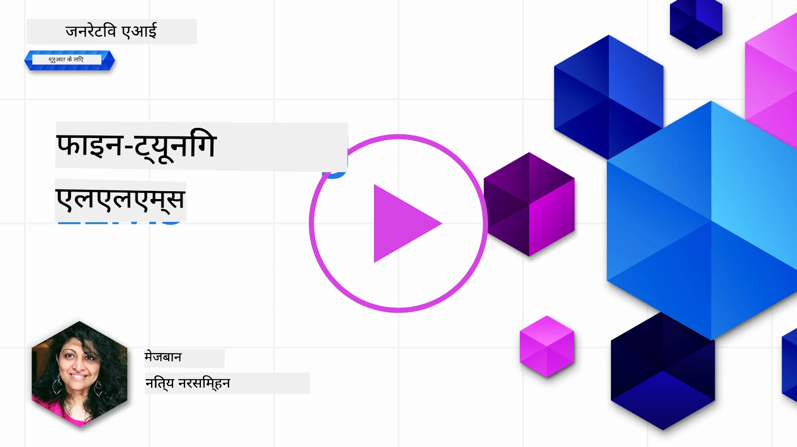
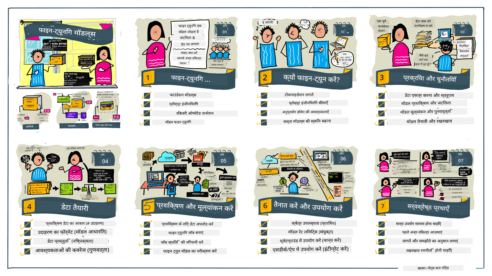

# अपने LLM को फाइन-ट्यून करें

जनरेटिव एआई एप्लिकेशन बनाने के लिए बड़े भाषा मॉडल का उपयोग करने के साथ नई चुनौतियाँ आती हैं। एक प्रमुख मुद्दा यह सुनिश्चित करना है कि मॉडल द्वारा उपयोगकर्ता के दिए गए अनुरोध के लिए उत्पन्न सामग्री की प्रतिक्रिया गुणवत्ता (सटीकता और प्रासंगिकता) बनी रहे। पिछले पाठों में, हमने प्रॉम्प्ट इंजीनियरिंग और रिट्रीवल-ऑगमेंटेड जनरेशन जैसी तकनीकों पर चर्चा की थी जो मौजूदा मॉडल के _प्रॉम्प्ट इनपुट_ को संशोधित करके इस समस्या को सुलझाने की कोशिश करती हैं।

आज के पाठ में, हम एक तीसरी तकनीक, **फाइन-ट्यूनिंग**, पर चर्चा करेंगे, जो इस चुनौती को _मॉडल को अतिरिक्त डेटा के साथ पुनः प्रशिक्षित_ करके हल करने का प्रयास करती है। चलिए विस्तार में जानते हैं।

## सीखने के उद्देश्य

यह पाठ प्री-ट्रेंड भाषा मॉडलों के लिए फाइन-ट्यूनिंग की अवधारणा पेश करता है, इस दृष्टिकोण के फायदे और चुनौतियों को विस्तार से समझाता है, और आपके जनरेटिव एआई मॉडलों के प्रदर्शन को बेहतर बनाने के लिए फाइन-ट्यूनिंग कब और कैसे करें इस पर मार्गदर्शन प्रदान करता है।

इस पाठ के अंत तक, आपको निम्नलिखित प्रश्नों के उत्तर देने में सक्षम होना चाहिए:

- भाषा मॉडलों के लिए फाइन-ट्यूनिंग क्या है?
- फाइन-ट्यूनिंग कब और क्यों उपयोगी होती है?
- मैं प्री-ट्रेंड मॉडल को कैसे फाइन-ट्यून कर सकता हूँ?
- फाइन-ट्यूनिंग की सीमाएँ क्या हैं?

तैयार हैं? चलिए शुरू करते हैं।

## चित्रित मार्गदर्शिका

क्या आप जानते हैं कि हम किन विषयों को कवर करेंगे, इससे पहले कि हम शुरू करें? इस चित्रित मार्गदर्शिका को देखें जो इस पाठ के लिए सीखने की यात्रा का वर्णन करती है — मूल अवधारणाओं और फाइन-ट्यूनिंग के प्रेरणा से लेकर प्रक्रिया और सर्वोत्तम अभ्यासों को समझने तक। यह एक रोमांचक विषय है, इसलिए अपनी स्वयं की मार्गदर्शित सीखने की यात्रा के लिए अतिरिक्त लिंक के लिए [Resources](./RESOURCES.md?WT.mc_id=academic-105485-koreyst) पृष्ठ को देखना न भूलें!

## भाषा मॉडलों के लिए फाइन-ट्यूनिंग क्या है?

परिभाषा अनुसार, बड़े भाषा मॉडल इंटरनेट सहित विभिन्न स्रोतों से बड़े पैमाने पर टेक्स्ट पर _प्रशिक्षित_ होते हैं। जैसा कि हमने पिछले पाठों में सीखा, हमें उपयोगकर्ता के सवालों ("प्रॉम्प्ट") के लिए मॉडल की प्रतिक्रियाओं की गुणवत्ता बढ़ाने के लिए _प्रॉम्प्ट इंजीनियरिंग_ और _रिट्रीवल-ऑगमेंटेड जनरेशन_ जैसी तकनीकों की आवश्यकता होती है।

एक लोकप्रिय प्रॉम्प्ट-इंजीनियरिंग तकनीक मॉडल को यह मार्गदर्शन देने के लिए होती है कि प्रतिक्रिया में क्या अपेक्षित है — या तो _निर्देश देकर_ (स्पष्ट निर्देश) या _कुछ उदाहरण देकर_ (निहित मार्गदर्शन)। इसे _फ्यू-शॉट लर्निंग_ कहा जाता है, लेकिन इसमें दो सीमाएँ हैं:

- मॉडल टोकन लिमिट आपको दिए गए उदाहरणों की संख्या को सीमित कर सकती है, और इससे प्रभावशीलता कम हो जाती है।
- मॉडल टोकन लागत हर प्रॉम्प्ट में उदाहरण जोड़ना महंगा बना सकती है, जिससे लचीलापन सीमित हो जाता है।

फाइन-ट्यूनिंग मशीन लर्निंग प्रणालियों में एक सामान्य अभ्यास है जहाँ हम प्री-ट्रेंड मॉडल लेकर उसे नए डेटा के साथ पुनः प्रशिक्षित करते हैं ताकि किसी विशिष्ट कार्य पर उसके प्रदर्शन में सुधार हो सके। भाषा मॉडलों के संदर्भ में, हम प्री-ट्रेंड मॉडल को _किसी विशिष्ट कार्य या एप्लिकेशन डोमेन के लिए तैयार किए गए उदाहरणों के सेट के साथ_ फाइन-ट्यून कर सकते हैं ताकि एक **कस्टम मॉडल** बनाया जा सके जो उस विशिष्ट कार्य या डोमेन के लिए अधिक सटीक और प्रासंगिक हो। फाइन-ट्यूनिंग का एक अतिरिक्त लाभ यह है कि यह फ्यू-शॉट लर्निंग में आवश्यक उदाहरणों की संख्या को भी कम कर सकता है — टोकन उपयोग और संबंधित लागतों को घटाते हुए।

## हमें मॉडल कब और क्यों फाइन-ट्यून करना चाहिए?

_इस_ संदर्भ में, जब हम फाइन-ट्यूनिंग की बात करते हैं, तो हमारा मतलब है **सुपरवाइज्ड** फाइन-ट्यूनिंग, जहाँ पुनः प्रशिक्षण **मूल प्रशिक्षण डेटा सेट का हिस्सा नहीं रहे नए डेटा** को शामिल करके किया जाता है। यह उस अनसुपरवाइज्ड फाइन-ट्यूनिंग से अलग है जिसमें मॉडल को मूल डेटा पर लेकिन विभिन्न हाइपरपैरामीटर के साथ पुनः प्रशिक्षित किया जाता है।

ध्यान में रखने वाली मुख्य बात यह है कि फाइन-ट्यूनिंग एक उन्नत तकनीक है जिसे इच्छित परिणाम पाने के लिए कुछ स्तर की विशेषज्ञता चाहिए। यदि गलत तरीके से किया गया, तो यह अपेक्षित सुधार नहीं दे सकता, और लक्षित डोमेन में मॉडल के प्रदर्शन को खराब भी कर सकता है।

इसलिए, "कैसे" भाषा मॉडल को फाइन-ट्यून करना है सीखने से पहले, यह जानना आवश्यक है कि "क्यों" आपको यह तरीका अपनाना चाहिए, और "कब" फाइन-ट्यूनिंग प्रक्रिया शुरू करनी चाहिए। अपने आप से ये प्रश्न पूछें:

- **उपयोग मामला**: फाइन-ट्यूनिंग के लिए आपका _उपयोग मामला_ क्या है? आप वर्तमान प्री-ट्रेंड मॉडल के किस पहलू को सुधारना चाहते हैं?
- **विकल्प**: क्या आपने _अन्य तकनीकें_ आजमाई हैं ताकि वांछित परिणाम मिल सकें? उनका उपयोग तुलना के लिए बेसलाइन बनाने के लिए करें।
  - प्रॉम्प्ट इंजीनियरिंग: प्रासंगिक प्रॉम्प्ट प्रतिक्रियाओं के उदाहरणों के साथ फ्यू-शॉट प्रॉम्प्टिंग जैसी तकनीकों को आजमाएं। प्रतिक्रियाओं की गुणवत्ता का मूल्यांकन करें।
  - रिट्रीवल ऑगमेंटेड जनरेशन: अपने डेटा को खोजकर प्राप्त क्वेरी परिणामों के साथ प्रॉम्प्ट बढ़ाएं। प्रतिक्रियाओं की गुणवत्ता का मूल्यांकन करें।
- **लागतें**: क्या आपने फाइन-ट्यूनिंग की लागतें पहचानी हैं?
  - ट्यूनिबिलिटी - क्या प्री-ट्रेंड मॉडल फाइन-ट्यूनिंग के लिए उपलब्ध है?
  - प्रयास - प्रशिक्षण डेटा तैयार करने, मॉडल का मूल्यांकन और संशोधन करने का प्रयास।
  - कंप्यूट - फाइन-ट्यूनिंग जॉब चलाने और फाइन-ट्यून किए गए मॉडल को तैनात करने के लिए।
  - डेटा - फाइन-ट्यूनिंग प्रभाव के लिए पर्याप्त गुणवत्ता वाले उदाहरणों तक पहुँच।
- **लाभ**: क्या आपने फाइन-ट्यूनिंग के लाभों की पुष्टि की है?
  - गुणवत्ता - क्या फाइन-ट्यून मॉडल ने बेसलाइन को पीछे छोड़ा?
  - लागत - क्या यह प्रॉम्प्ट को सरल बनाकर टोकन उपयोग को कम करता है?
  - विस्तार क्षमता - क्या आप बेस मॉडल को नए डोमेन के लिए पुनः उपयोग कर सकते हैं?

इन प्रश्नों का उत्तर देकर, आपको निर्णय लेने में सक्षम होना चाहिए कि फाइन-ट्यूनिंग आपके उपयोग मामले के लिए सही तरीका है या नहीं। आदर्श रूप में, यह तरीका तभी मान्य होता है जब लाभ लागत से अधिक हों। एक बार जब आप आगे बढ़ने का निर्णय ले लें, तो अब सोचने का समय है कि आप प्री-ट्रेंड मॉडल को _कैसे_ फाइन-ट्यून कर सकते हैं।

निर्णय प्रक्रिया पर अधिक जानकारी चाहिए? देखें [To fine-tune or not to fine-tune](https://www.youtube.com/watch?v=0Jo-z-MFxJs)

## हम प्री-ट्रेंड मॉडल को कैसे फाइन-ट्यून कर सकते हैं?

प्री-ट्रेंड मॉडल को फाइन-ट्यून करने के लिए आपके पास होना चाहिए:

- फाइन-ट्यून करने के लिए एक प्री-ट्रेंड मॉडल
- फाइन-ट्यूनिंग के लिए इस्तेमाल करने के लिए एक डेटासेट
- फाइन-ट्यूनिंग जॉब चलाने के लिए एक प्रशिक्षण वातावरण
- फाइन-ट्यून किए गए मॉडल को तैनात करने के लिए होस्टिंग वातावरण

## फाइन-ट्यूनिंग क्रियान्वयन

निम्नलिखित संसाधन स्टेप-बाय-स्टेप ट्यूटोरियल प्रदान करते हैं जो चयनित मॉडल और तैयार किए गए डेटासेट का उपयोग करते हुए वास्तविक उदाहरण के माध्यम से आपका मार्गदर्शन करेंगे। इन ट्यूटोरियल को करने के लिए, आपको संबंधित प्रदाता पर एक खाता होना चाहिए, साथ ही संबंधित मॉडल और डेटासेट तक पहुँच होनी चाहिए।

| प्रदाता     | ट्यूटोरियल                                                                                                                                                                       | विवरण                                                                                                                                                                                                                                                                                                                                                                                                                          |
| ------------ | ------------------------------------------------------------------------------------------------------------------------------------------------------------------------------ | -------------------------------------------------------------------------------------------------------------------------------------------------------------------------------------------------------------------------------------------------------------------------------------------------------------------------------------------------------------------------------------------------------------------------------- |
| OpenAI       | [How to fine-tune chat models](https://github.com/openai/openai-cookbook/blob/main/examples/How_to_finetune_chat_models.ipynb?WT.mc_id=academic-105485-koreyst)                | `gpt-35-turbo` को एक विशिष्ट डोमेन ("रेसिपी असिस्टेंट") के लिए फाइन-ट्यून करना सीखें, प्रशिक्षण डेटा तैयार करें, फाइन-ट्यूनिंग जॉब चलाएं, और फाइन-ट्यून किए गए मॉडल का इनफेरेंस के लिए उपयोग करें।                                                                                                                                                                                                                                  |
| Azure OpenAI | [GPT 3.5 Turbo fine-tuning tutorial](https://learn.microsoft.com/azure/ai-services/openai/tutorials/fine-tune?tabs=python-new%2Ccommand-line&WT.mc_id=academic-105485-koreyst) | **Azure** पर `gpt-35-turbo-0613` मॉडल को फाइन-ट्यून करने के लिए कदम उठाने सीखें — प्रशिक्षण डेटा बनाएं और अपलोड करें, फाइन-ट्यूनिंग जॉब चलाएं, नया मॉडल तैनात करें और उपयोग करें।                                                                                                                                                                                                                                                        |
| Hugging Face | [Fine-tuning LLMs with Hugging Face](https://www.philschmid.de/fine-tune-llms-in-2024-with-trl?WT.mc_id=academic-105485-koreyst)                                               | यह ब्लॉग पोस्ट आपको एक _ओपन LLM_ (जैसे: `CodeLlama 7B`) को [transformers](https://huggingface.co/docs/transformers/index?WT.mc_id=academic-105485-koreyst) लाइब्रेरी & [Transformer Reinforcement Learning (TRL)](https://huggingface.co/docs/trl/index?WT.mc_id=academic-105485-koreyst) के साथ Hugging Face पर उपलब्ध खुली [डेटासेट्स](https://huggingface.co/docs/datasets/index?WT.mc_id=academic-105485-koreyst) के माध्यम से फाइन-ट्यूनिंग करना दिखाती है। |
|              |                                                                                                                                                                                |                                                                                                                                                                                                                                                                                                                                                                                                                          |
| 🤗 AutoTrain | [Fine-tuning LLMs with AutoTrain](https://github.com/huggingface/autotrain-advanced/?WT.mc_id=academic-105485-koreyst)                                                         | AutoTrain (या AutoTrain Advanced) Hugging Face द्वारा विकसित एक पायथन लाइब्रेरी है जो विभिन्न कार्यों के लिए फाइन-ट्यूनिंग की अनुमति देती है जिसमें LLM फाइन-ट्यूनिंग भी शामिल है। AutoTrain एक बिना कोड समाधान है और फाइन-ट्यूनिंग आपकी अपनी क्लाउड, Hugging Face Spaces, या स्थानीय रूप से किया जा सकता है। इसमे वेब-आधारित GUI, CLI, और yaml कॉन्फ़िग फाइलों के माध्यम से प्रशिक्षण का समर्थन है।                                                                             |
|              |                                                                                                                                                                                |                                                                                                                                                                                                                                                                                                                                                                                                                          |
| 🦥 Unsloth | [Fine-tuning LLMs with Unsloth](https://github.com/unslothai/unsloth)                                                         | Unsloth एक ओपन-सोर्स फ्रेमवर्क है जो LLM फाइन-ट्यूनिंग और रिइन्फोर्समेंट लर्निंग (RL) का समर्थन करता है। Unsloth स्थानीय प्रशिक्षण, मूल्यांकन, और तैनाती को तैयार [नोटबुक्स](https://github.com/unslothai/notebooks) के साथ सुव्यवस्थित करता है। यह टेक्स्ट-टू-स्पीच (TTS), BERT और मल्टीमोडल मॉडलों का भी समर्थन करता है। शुरू करने के लिए, उनके चरण-दर-चरण [Fine-tuning LLMs Guide](https://docs.unsloth.ai/get-started/fine-tuning-llms-guide) को पढ़ें।            |
|              |                                                                                                                                                                                |                                                                                                                                                                                                                                                                                                                                                                                                                          |
## असाइनमेंट

उपरोक्त ट्यूटोरियल में से किसी एक को चुनें और उसे पूरे चरणों में करें। _हम इन ट्यूटोरियल का एक संस्करण इस रिपोजिटरी में संदर्भ के लिए जुपिटर नोटबुक्स में भी पुन: प्रस्तुत कर सकते हैं। कृपया नवीनतम संस्करणों के लिए मूल स्रोतों का सीधे उपयोग करें_।

## शानदार काम! अपनी सीख जारी रखें।

इस पाठ को पूरा करने के बाद, हमारी [Generative AI Learning collection](https://aka.ms/genai-collection?WT.mc_id=academic-105485-koreyst) देखें ताकि आप जनरेटिव एआई ज्ञान में और अधिक प्रगति कर सकें!

बधाई हो!! आपने इस कोर्स की v2 श्रृंखला का अंतिम पाठ पूरा कर लिया है! सीखना और निर्माण करना कभी बंद न करें। \*\*इसी विषय के लिए अतिरिक्त सुझावों की सूची के लिए [RESOURCES](RESOURCES.md?WT.mc_id=academic-105485-koreyst) पृष्ठ देखें।

हमारे v1 श्रृंखला के पाठों को भी अधिक असाइनमेंट और अवधारणाओं के साथ अपडेट किया गया है। तो अपने ज्ञान को ताज़ा करने के लिए एक मिनट निकालें - और कृपया [अपने प्रश्न और प्रतिक्रिया साझा करें](https://github.com/microsoft/generative-ai-for-beginners/issues?WT.mc_id=academic-105485-koreyst) ताकि हम समुदाय के लिए इन पाठों को बेहतर बना सकें।

---

<!-- CO-OP TRANSLATOR DISCLAIMER START -->
**अस्वीकरण**:  
यह दस्तावेज़ AI अनुवाद सेवा [Co-op Translator](https://github.com/Azure/co-op-translator) का उपयोग करके अनुवादित किया गया है। जबकि हम सटीकता के लिए प्रयास करते हैं, कृपया ध्यान दें कि स्वचालित अनुवाद में त्रुटियाँ या गलतियां हो सकती हैं। मूल दस्तावेज़ अपनी स्वदेशी भाषा में ही प्रामाणिक स्रोत माना जाना चाहिए। महत्वपूर्ण जानकारी के लिए पेशेवर मानव अनुवाद की सलाह दी जाती है। इस अनुवाद के उपयोग से उत्पन्न किसी भी गलतफहमी या गलत व्याख्या के लिए हम जिम्मेदार नहीं हैं।
<!-- CO-OP TRANSLATOR DISCLAIMER END -->