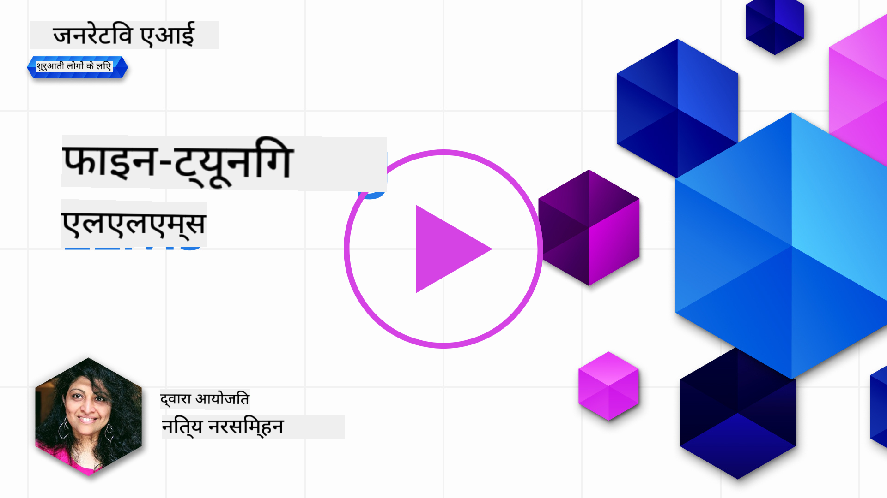
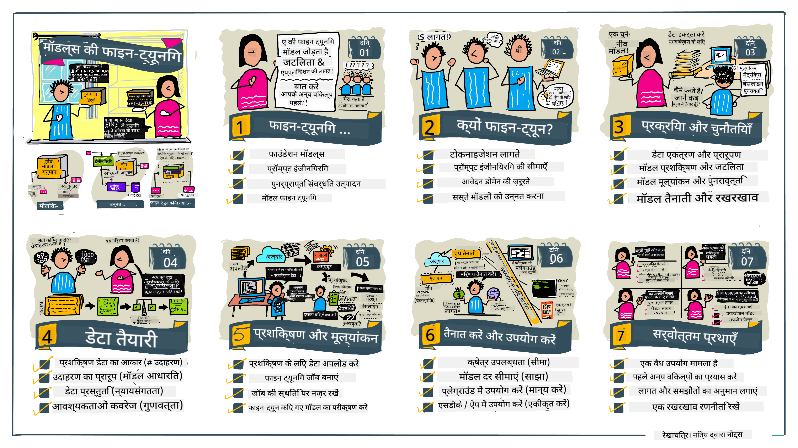

<!--
CO_OP_TRANSLATOR_METADATA:
{
  "original_hash": "68664f7e754a892ae1d8d5e2b7bd2081",
  "translation_date": "2025-06-26T00:35:58+00:00",
  "source_file": "18-fine-tuning/README.md",
  "language_code": "hi"
}
-->

# अपने LLM को फाइन-ट्यून करना

जनरेटिव AI अनुप्रयोगों के निर्माण के लिए बड़े भाषा मॉडल का उपयोग करने में नई चुनौतियाँ होती हैं। एक प्रमुख मुद्दा यह सुनिश्चित करना है कि मॉडल द्वारा उपयोगकर्ता के अनुरोध के लिए उत्पन्न सामग्री की गुणवत्ता (सटीकता और प्रासंगिकता) बनी रहे। पिछले पाठों में, हमने प्रॉम्प्ट इंजीनियरिंग और रिट्रीवल-अगमेंटेड जनरेशन जैसी तकनीकों पर चर्चा की थी जो मौजूदा मॉडल के प्रॉम्प्ट इनपुट को _संशोधित_ करके समस्या को हल करने का प्रयास करती हैं।

आज के पाठ में, हम एक तीसरी तकनीक, **फाइन-ट्यूनिंग**, पर चर्चा करेंगे, जो अतिरिक्त डेटा के साथ _मॉडल को पुनः प्रशिक्षित_ करके इस चुनौती का समाधान करने का प्रयास करती है। आइए विस्तार से जानें।

## सीखने के उद्देश्य

यह पाठ पूर्व-प्रशिक्षित भाषा मॉडल के लिए फाइन-ट्यूनिंग की अवधारणा का परिचय देता है, इस दृष्टिकोण के लाभों और चुनौतियों की खोज करता है, और आपके जनरेटिव AI मॉडल के प्रदर्शन को सुधारने के लिए फाइन ट्यूनिंग का उपयोग कब और कैसे करना चाहिए, इस पर मार्गदर्शन प्रदान करता है।

इस पाठ के अंत तक, आपको निम्नलिखित प्रश्नों का उत्तर देने में सक्षम होना चाहिए:

- भाषा मॉडल के लिए फाइन ट्यूनिंग क्या है?
- फाइन ट्यूनिंग कब और क्यों उपयोगी है?
- मैं एक पूर्व-प्रशिक्षित मॉडल को कैसे फाइन-ट्यून कर सकता हूं?
- फाइन-ट्यूनिंग की सीमाएँ क्या हैं?

तैयार हैं? चलिए शुरू करते हैं।

## चित्रण गाइड

हमारे विषय में गहराई से जाने से पहले आपको संपूर्ण दृष्टिकोण चाहिए? इस चित्रण गाइड को देखें जो इस पाठ के लिए सीखने की यात्रा का वर्णन करता है - फाइन-ट्यूनिंग के मुख्य अवधारणाओं और प्रेरणा से लेकर फाइन-ट्यूनिंग कार्य को निष्पादित करने की प्रक्रिया और सर्वोत्तम प्रथाओं को समझने तक। यह एक खोज के लिए आकर्षक विषय है, इसलिए अपनी स्वयं-निर्देशित सीखने की यात्रा को समर्थन देने के लिए अतिरिक्त लिंक के लिए [संसाधन](./RESOURCES.md?WT.mc_id=academic-105485-koreyst) पृष्ठ देखना न भूलें!

## भाषा मॉडल के लिए फाइन-ट्यूनिंग क्या है?

परिभाषा के अनुसार, बड़े भाषा मॉडल इंटरनेट सहित विविध स्रोतों से प्राप्त बड़े पैमाने पर टेक्स्ट पर _पूर्व-प्रशिक्षित_ होते हैं। जैसा कि हमने पिछले पाठों में सीखा है, हमें उपयोगकर्ता के प्रश्नों ("प्रॉम्प्ट्स") के मॉडल के उत्तरों की गुणवत्ता में सुधार करने के लिए _प्रॉम्प्ट इंजीनियरिंग_ और _रिट्रीवल-अगमेंटेड जनरेशन_ जैसी तकनीकों की आवश्यकता होती है।

एक लोकप्रिय प्रॉम्प्ट-इंजीनियरिंग तकनीक में मॉडल को यह बताना शामिल है कि प्रतिक्रिया में क्या अपेक्षित है, या तो _निर्देश_ (स्पष्ट मार्गदर्शन) प्रदान करके या _कुछ उदाहरण_ देकर (अप्रत्यक्ष मार्गदर्शन)। इसे _फ्यू-शॉट लर्निंग_ कहा जाता है, लेकिन इसके दो सीमाएँ हैं:

- मॉडल टोकन सीमाएँ उन उदाहरणों की संख्या को प्रतिबंधित कर सकती हैं जो आप दे सकते हैं, और प्रभावशीलता को सीमित कर सकती हैं।
- मॉडल टोकन लागतें हर प्रॉम्प्ट में उदाहरण जोड़ने को महंगा बना सकती हैं, और लचीलापन सीमित कर सकती हैं।

फाइन-ट्यूनिंग मशीन लर्निंग सिस्टम में एक सामान्य अभ्यास है जहां हम एक पूर्व-प्रशिक्षित मॉडल लेते हैं और इसे नए डेटा के साथ पुनः प्रशिक्षित करते हैं ताकि इसे एक विशिष्ट कार्य पर बेहतर प्रदर्शन करने के लिए तैयार किया जा सके। भाषा मॉडल के संदर्भ में, हम पूर्व-प्रशिक्षित मॉडल को _एक विशिष्ट कार्य या अनुप्रयोग डोमेन के लिए चुने गए उदाहरणों के सेट के साथ_ फाइन-ट्यून कर सकते हैं ताकि एक **कस्टम मॉडल** बनाया जा सके जो उस विशिष्ट कार्य या डोमेन के लिए अधिक सटीक और प्रासंगिक हो सकता है। फाइन-ट्यूनिंग का एक साइड-बेनिफिट यह है कि यह फ्यू-शॉट लर्निंग के लिए आवश्यक उदाहरणों की संख्या को भी कम कर सकता है - टोकन उपयोग और संबंधित लागतों को कम कर सकता है।

## हमें मॉडल्स को कब और क्यों फाइन-ट्यून करना चाहिए?

_इस_ संदर्भ में, जब हम फाइन-ट्यूनिंग की बात करते हैं, तो हम **सुपरवाइज्ड** फाइन-ट्यूनिंग की बात कर रहे हैं जहां पुनः प्रशिक्षण **नए डेटा जोड़कर** किया जाता है जो मूल प्रशिक्षण डेटासेट का हिस्सा नहीं था। यह एक अनसुपरवाइज्ड फाइन-ट्यूनिंग दृष्टिकोण से अलग है जहां मॉडल को मूल डेटा पर पुनः प्रशिक्षित किया जाता है, लेकिन विभिन्न हाइपरपैरामीटर के साथ।

मुख्य बात यह याद रखने की है कि फाइन-ट्यूनिंग एक उन्नत तकनीक है जो वांछित परिणाम प्राप्त करने के लिए एक निश्चित स्तर की विशेषज्ञता की आवश्यकता होती है। यदि गलत तरीके से किया जाता है, तो यह अपेक्षित सुधार प्रदान नहीं कर सकता है, और आपके लक्षित डोमेन के लिए मॉडल के प्रदर्शन को भी खराब कर सकता है।

तो, भाषा मॉडल को "कैसे" फाइन-ट्यून करना सीखने से पहले, आपको यह जानना होगा कि "क्यों" आपको इस मार्ग पर जाना चाहिए, और "कब" फाइन-ट्यूनिंग की प्रक्रिया शुरू करनी चाहिए। इन प्रश्नों से शुरुआत करें:

- **उपयोग मामला**: आपका फाइन-ट्यूनिंग के लिए _उपयोग मामला_ क्या है? वर्तमान पूर्व-प्रशिक्षित मॉडल के किस पहलू को आप सुधारना चाहते हैं?
- **विकल्प**: क्या आपने वांछित परिणाम प्राप्त करने के लिए _अन्य तकनीकों_ का प्रयास किया है? उन्हें तुलना के लिए एक आधार रेखा बनाने के लिए उपयोग करें।
  - प्रॉम्प्ट इंजीनियरिंग: प्रासंगिक प्रॉम्प्ट प्रतिक्रियाओं के उदाहरणों के साथ कुछ-शॉट प्रॉम्प्टिंग जैसी तकनीकों का प्रयास करें। प्रतिक्रियाओं की गुणवत्ता का मूल्यांकन करें।
  - रिट्रीवल अगमेंटेड जनरेशन: अपने डेटा को खोजकर प्राप्त क्वेरी परिणामों के साथ प्रॉम्प्ट्स को बढ़ाने का प्रयास करें। प्रतिक्रियाओं की गुणवत्ता का मूल्यांकन करें।
- **लागतें**: क्या आपने फाइन-ट्यूनिंग की लागतों की पहचान की है?
  - ट्यूनबिलिटी - क्या पूर्व-प्रशिक्षित मॉडल फाइन-ट्यूनिंग के लिए उपलब्ध है?
  - प्रयास - प्रशिक्षण डेटा तैयार करने, मॉडल का मूल्यांकन और परिष्कृत करने के लिए।
  - कंप्यूट - फाइन-ट्यूनिंग जॉब्स चलाने और फाइन-ट्यून मॉडल को तैनात करने के लिए
  - डेटा - फाइन-ट्यूनिंग प्रभाव के लिए पर्याप्त गुणवत्ता वाले उदाहरणों तक पहुंच
- **लाभ**: क्या आपने फाइन-ट्यूनिंग के लाभों की पुष्टि की है?
  - गुणवत्ता - क्या फाइन-ट्यून मॉडल ने आधार रेखा को पीछे छोड़ दिया?
  - लागत - क्या यह प्रॉम्प्ट्स को सरल बनाकर टोकन उपयोग को कम करता है?
  - एक्स्टेंसिबिलिटी - क्या आप नए डोमेन के लिए बेस मॉडल का पुनः उपयोग कर सकते हैं?

इन प्रश्नों का उत्तर देकर, आप यह तय कर सकते हैं कि फाइन-ट्यूनिंग आपके उपयोग मामले के लिए सही दृष्टिकोण है या नहीं। आदर्श रूप से, यह दृष्टिकोण केवल तभी मान्य होता है जब लाभ लागत से अधिक हों। एक बार जब आप आगे बढ़ने का निर्णय लेते हैं, तो यह सोचने का समय है कि आप पूर्व-प्रशिक्षित मॉडल को _कैसे_ फाइन-ट्यून कर सकते हैं।

निर्णय लेने की प्रक्रिया पर अधिक जानकारी चाहते हैं? [फाइन-ट्यून करना या न करना](https://www.youtube.com/watch?v=0Jo-z-MFxJs) देखें

## हम एक पूर्व-प्रशिक्षित मॉडल को कैसे फाइन-ट्यून कर सकते हैं?

एक पूर्व-प्रशिक्षित मॉडल को फाइन-ट्यून करने के लिए, आपको आवश्यकता होती है:

- फाइन-ट्यून करने के लिए एक पूर्व-प्रशिक्षित मॉडल
- फाइन-ट्यूनिंग के लिए उपयोग करने के लिए एक डेटासेट
- फाइन-ट्यूनिंग जॉब चलाने के लिए एक प्रशिक्षण वातावरण
- फाइन-ट्यून मॉडल को तैनात करने के लिए एक होस्टिंग वातावरण

## फाइन-ट्यूनिंग इन एक्शन

निम्नलिखित संसाधन एक चुने हुए मॉडल के साथ एक चयनित डेटासेट का उपयोग करके एक वास्तविक उदाहरण के माध्यम से आपको चलाने के लिए चरण-दर-चरण ट्यूटोरियल प्रदान करते हैं। इन ट्यूटोरियल्स के माध्यम से काम करने के लिए, आपको संबंधित मॉडल और डेटासेट तक पहुंच के साथ विशिष्ट प्रदाता पर एक खाता चाहिए।

| प्रदाता     | ट्यूटोरियल                                                                                                                                                                       | विवरण                                                                                                                                                                                                                                                                                                                                                                                                                        |
| ------------ | ------------------------------------------------------------------------------------------------------------------------------------------------------------------------------ | ---------------------------------------------------------------------------------------------------------------------------------------------------------------------------------------------------------------------------------------------------------------------------------------------------------------------------------------------------------------------------------------------------------------------------------- |
| OpenAI       | [चैट मॉडल्स को कैसे फाइन-ट्यून करें](https://github.com/openai/openai-cookbook/blob/main/examples/How_to_finetune_chat_models.ipynb?WT.mc_id=academic-105485-koreyst)                | प्रशिक्षण डेटा तैयार करके, फाइन-ट्यूनिंग जॉब चलाकर, और अनुमान के लिए फाइन-ट्यून मॉडल का उपयोग करके एक विशिष्ट डोमेन ("रेसिपी असिस्टेंट") के लिए एक `gpt-35-turbo` को फाइन-ट्यून करना सीखें।                                                                                                                                                                                                                                              |
| Azure OpenAI | [GPT 3.5 Turbo फाइन-ट्यूनिंग ट्यूटोरियल](https://learn.microsoft.com/azure/ai-services/openai/tutorials/fine-tune?tabs=python-new%2Ccommand-line?WT.mc_id=academic-105485-koreyst) | प्रशिक्षण डेटा बनाने और अपलोड करने के लिए कदम उठाकर, फाइन-ट्यूनिंग जॉब चलाकर एक `gpt-35-turbo-0613` मॉडल **Azure पर** फाइन-ट्यून करना सीखें। नया मॉडल तैनात करें और उपयोग करें।                                                                                                                                                                                                                                                                 |
| Hugging Face | [Hugging Face के साथ LLMs को फाइन-ट्यून करना](https://www.philschmid.de/fine-tune-llms-in-2024-with-trl?WT.mc_id=academic-105485-koreyst)                                               | यह ब्लॉग पोस्ट आपको [transformers](https://huggingface.co/docs/transformers/index?WT.mc_id=academic-105485-koreyst) लाइब्रेरी और [Transformer Reinforcement Learning (TRL)](https://huggingface.co/docs/trl/index?WT.mc_id=academic-105485-koreyst) के साथ खुले [डेटासेट्स](https://huggingface.co/docs/datasets/index?WT.mc_id=academic-105485-koreyst) का उपयोग करके _खुले LLM_ (उदाहरण: `CodeLlama 7B`) को फाइन-ट्यून करने के लिए आपके साथ चलता है। |
|              |                                                                                                                                                                                |                                                                                                                                                                                                                                                                                                                                                                                                                                    |
| 🤗 AutoTrain | [AutoTrain के साथ LLMs को फाइन-ट्यून करना](https://github.com/huggingface/autotrain-advanced/?WT.mc_id=academic-105485-koreyst)                                                         | AutoTrain (या AutoTrain Advanced) Hugging Face द्वारा विकसित एक पायथन लाइब्रेरी है जो कई अलग-अलग कार्यों के लिए फाइनट्यूनिंग की अनुमति देती है जिसमें LLM फाइनट्यूनिंग शामिल है। AutoTrain एक नो-कोड समाधान है और फाइनट्यूनिंग को आपके अपने क्लाउड, Hugging Face Spaces पर या स्थानीय रूप से किया जा सकता है। यह वेब-आधारित GUI, CLI और yaml कॉन्फिग फाइलों के माध्यम से प्रशिक्षण का समर्थन करता है।                                                                               |
|              |                                                                                                                                                                                |                                                                                                                                                                                                                                                                                                                                                                                                                                    |

## असाइनमेंट

ऊपर दिए गए ट्यूटोरियल्स में से एक का चयन करें और उनके माध्यम से चलें। _हम संदर्भ के लिए इस रेपो में Jupyter Notebooks में इन ट्यूटोरियल्स का एक संस्करण दोहरा सकते हैं। कृपया नवीनतम संस्करण प्राप्त करने के लिए सीधे मूल स्रोतों का उपयोग करें_।

## बढ़िया काम! अपनी सीखने की यात्रा जारी रखें।

इस पाठ को पूरा करने के बाद, हमारे [जनरेटिव AI लर्निंग संग्रह](https://aka.ms/genai-collection?WT.mc_id=academic-105485-koreyst) को देखें ताकि आप अपनी जनरेटिव AI ज्ञान को और भी बढ़ा सकें!

बधाई हो!! आपने इस पाठ्यक्रम के v2 श्रृंखला का अंतिम पाठ पूरा कर लिया है! सीखना और निर्माण करना न रोकें। **[संसाधन](RESOURCES.md?WT.mc_id=academic-105485-koreyst) पृष्ठ को देखें इस विषय के लिए अतिरिक्त सुझावों की सूची के लिए।

हमारे v1 श्रृंखला के पाठों को भी अधिक असाइनमेंट और अवधारणाओं के साथ अपडेट किया गया है। इसलिए अपने ज्ञान को ताज़ा करने के लिए एक मिनट लें - और कृपया [अपने प्रश्न और प्रतिक्रिया साझा करें](https://github.com/microsoft/generative-ai-for-beginners/issues?WT.mc_id=academic-105485-koreyst) ताकि हम समुदाय के लिए इन पाठों को सुधार सकें।

**अस्वीकरण**:  
यह दस्तावेज़ AI अनुवाद सेवा [Co-op Translator](https://github.com/Azure/co-op-translator) का उपयोग करके अनुवादित किया गया है। जबकि हम सटीकता के लिए प्रयास करते हैं, कृपया ध्यान दें कि स्वचालित अनुवादों में त्रुटियाँ या अशुद्धियाँ हो सकती हैं। इसकी मूल भाषा में मूल दस्तावेज़ को प्राधिकृत स्रोत माना जाना चाहिए। महत्वपूर्ण जानकारी के लिए, पेशेवर मानव अनुवाद की सिफारिश की जाती है। इस अनुवाद के उपयोग से उत्पन्न किसी भी गलतफहमी या गलत व्याख्या के लिए हम उत्तरदायी नहीं हैं।