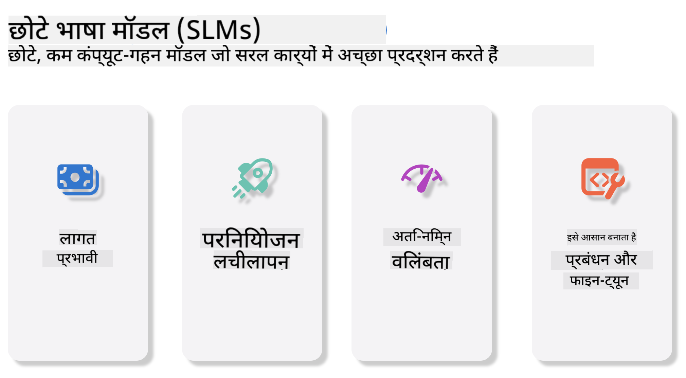
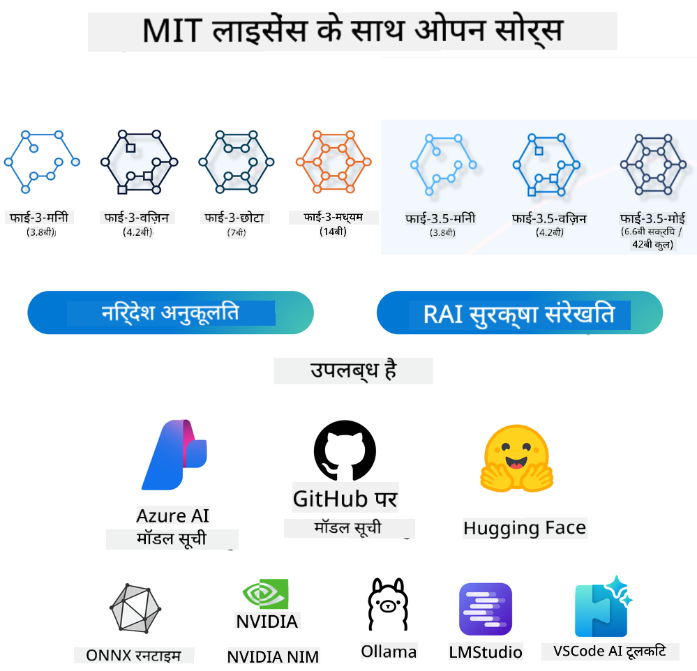
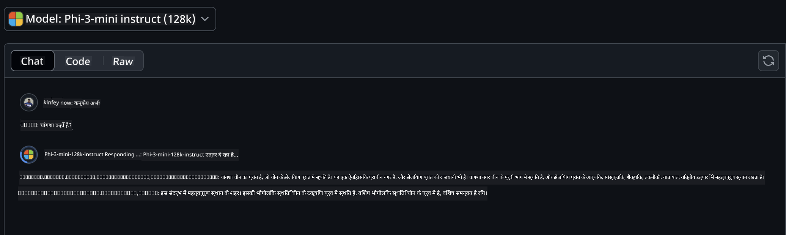
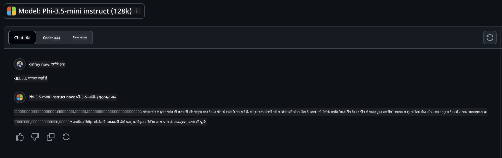

<!--
CO_OP_TRANSLATOR_METADATA:
{
  "original_hash": "124ad36cfe96f74038811b6e2bb93e9d",
  "translation_date": "2025-05-20T09:26:23+00:00",
  "source_file": "19-slm/README.md",
  "language_code": "hi"
}
-->
# छोटे भाषा मॉडल के लिए जनरेटिव AI की शुरुआत जनरेटिव AI कृत्रिम बुद्धिमत्ता का एक आकर्षक क्षेत्र है जो नई सामग्री उत्पन्न करने में सक्षम सिस्टम बनाने पर केंद्रित है। यह सामग्री टेक्स्ट और छवियों से लेकर संगीत और यहां तक कि संपूर्ण आभासी वातावरण तक हो सकती है। जनरेटिव AI के सबसे रोमांचक अनुप्रयोगों में से एक भाषा मॉडल के क्षेत्र में है। ## छोटे भाषा मॉडल क्या हैं? एक छोटा भाषा मॉडल (SLM) एक बड़े भाषा मॉडल (LLM) का एक स्केल-डाउन वेरिएंट दर्शाता है, जो LLMs के कई आर्किटेक्चरल सिद्धांतों और तकनीकों का उपयोग करता है, जबकि एक उल्लेखनीय रूप से कम कंप्यूटेशनल फुटप्रिंट प्रदर्शित करता है। SLMs मानव-जैसे टेक्स्ट उत्पन्न करने के लिए डिज़ाइन किए गए भाषा मॉडल का एक उपसमुच्चय हैं। उनके बड़े समकक्षों की तुलना में, जैसे GPT-4, SLMs अधिक कॉम्पैक्ट और कुशल हैं, जो उन्हें उन अनुप्रयोगों के लिए आदर्श बनाते हैं जहां कंप्यूटेशनल संसाधन सीमित हैं। उनके छोटे आकार के बावजूद, वे अभी भी विभिन्न कार्यों को कर सकते हैं। आमतौर पर, SLMs LLMs को संपीड़ित या डिस्टिल करके बनाए जाते हैं, जिसका उद्देश्य मूल मॉडल की कार्यक्षमता और भाषाई क्षमताओं के एक महत्वपूर्ण हिस्से को बनाए रखना होता है। मॉडल के आकार में इस कमी से समग्र जटिलता कम हो जाती है, जिससे SLMs मेमोरी उपयोग और कंप्यूटेशनल आवश्यकताओं दोनों के संदर्भ में अधिक कुशल हो जाते हैं। इन ऑप्टिमाइजेशन के बावजूद, SLMs अभी भी प्राकृतिक भाषा प्रसंस्करण (NLP) कार्यों की एक विस्तृत श्रृंखला कर सकते हैं: - टेक्स्ट जनरेशन: सुसंगत और संदर्भगत रूप से प्रासंगिक वाक्य या पैराग्राफ बनाना। - टेक्स्ट कंप्लीशन: दिए गए प्रॉम्प्ट के आधार पर वाक्य की भविष्यवाणी और पूरा करना। - अनुवाद: एक भाषा से दूसरी भाषा में टेक्स्ट का परिवर्तन। - सारांशण: लंबे टेक्स्ट के टुकड़ों को छोटे, अधिक पचने योग्य सारांशों में संघनित करना। हालांकि कुछ ट्रेड-ऑफ्स के साथ प्रदर्शन या समझ की गहराई में उनके बड़े समकक्षों की तुलना में। ## छोटे भाषा मॉडल कैसे काम करते हैं? SLMs को विशाल मात्रा में टेक्स्ट डेटा पर प्रशिक्षित किया जाता है। प्रशिक्षण के दौरान, वे भाषा के पैटर्न और संरचनाओं को सीखते हैं, जिससे वे ऐसा टेक्स्ट उत्पन्न कर सकते हैं जो व्याकरणिक रूप से सही और संदर्भगत रूप से उपयुक्त होता है। प्रशिक्षण प्रक्रिया में शामिल हैं: - डेटा संग्रह: विभिन्न स्रोतों से बड़े टेक्स्ट डेटासेट एकत्र करना। - पूर्व-प्रसंस्करण: डेटा को प्रशिक्षण के लिए उपयुक्त बनाने के लिए सफाई और संगठन। - प्रशिक्षण: मशीन लर्निंग एल्गोरिदम का उपयोग करके मॉडल को टेक्स्ट को समझने और उत्पन्न करने के तरीके सिखाना। - फाइन-ट्यूनिंग: मॉडल को विशिष्ट कार्यों पर इसके प्रदर्शन में सुधार करने के लिए समायोजित करना। SLMs का विकास उन मॉडलों की बढ़ती आवश्यकता के साथ मेल खाता है जिन्हें संसाधन-सीमित वातावरण में तैनात किया जा सकता है, जैसे मोबाइल उपकरण या एज कंप्यूटिंग प्लेटफॉर्म, जहां पूर्ण-स्केल LLMs उनके भारी संसाधन मांगों के कारण अव्यावहारिक हो सकते हैं। दक्षता पर ध्यान केंद्रित करके, SLMs प्रदर्शन को पहुंच के साथ संतुलित करते हैं, विभिन्न डोमेन में व्यापक अनुप्रयोग को सक्षम बनाते हैं।  ## सीखने के उद्देश्य इस पाठ में, हम SLM के ज्ञान को पेश करने और इसे माइक्रोसॉफ्ट फाई-3 के साथ संयोजित करने की उम्मीद करते हैं ताकि टेक्स्ट सामग्री, दृष्टि और MoE में विभिन्न परिदृश्यों को सीख सकें। पाठ के अंत तक, आपको निम्नलिखित प्रश्नों का उत्तर देने में सक्षम होना चाहिए: - SLM क्या है - SLM और LLM के बीच क्या अंतर है - माइक्रोसॉफ्ट फाई-3/3.5 परिवार क्या है - माइक्रोसॉफ्ट फाई-3/3.5 परिवार का अनुमान कैसे लगाएं तैयार हैं? चलिए शुरू करते हैं। ## बड़े भाषा मॉडल (LLMs) और छोटे भाषा मॉडल (SLMs) के बीच अंतर LLMs और SLMs दोनों प्रायिकता मशीन लर्निंग के मौलिक सिद्धांतों पर आधारित हैं, उनके आर्किटेक्चरल डिज़ाइन, प्रशिक्षण विधियों, डेटा उत्पादन प्रक्रियाओं और मॉडल मूल्यांकन तकनीकों में समान दृष्टिकोण का पालन करते हैं। हालांकि, इन दो प्रकार के मॉडलों को अलग करने वाले कई प्रमुख कारक हैं। ## छोटे भाषा मॉडल के अनुप्रयोग SLMs के अनुप्रयोगों की एक विस्तृत श्रृंखला है, जिसमें शामिल हैं: - चैटबॉट्स: ग्राहक सहायता प्रदान करना और उपयोगकर्ताओं के साथ संवादात्मक तरीके से बातचीत करना। - सामग्री निर्माण: लेखकों की विचार उत्पन्न करके या यहां तक कि पूरे लेख ड्राफ्ट करके सहायता करना। - शिक्षा: छात्रों को लेखन असाइनमेंट में या नई भाषाएं सीखने में मदद करना। - पहुंच: विकलांग व्यक्तियों के लिए उपकरण बनाना, जैसे टेक्स्ट-टू-स्पीच सिस्टम। **आकार** LLMs और SLMs के बीच एक प्राथमिक अंतर मॉडलों के पैमाने में निहित है। LLMs, जैसे ChatGPT (GPT-4), अनुमानित 1.76 ट्रिलियन पैरामीटरों को शामिल कर सकते हैं, जबकि ओपन-सोर्स SLMs जैसे Mistral 7B को काफी कम पैरामीटरों के साथ डिज़ाइन किया गया है—लगभग 7 बिलियन। यह असमानता मुख्य रूप से मॉडल आर्किटेक्चर और प्रशिक्षण प्रक्रियाओं में मतभेदों के कारण है। उदाहरण के लिए, ChatGPT एक एनकोडर-डिकोडर फ्रेमवर्क के भीतर एक स्व-अटेंशन तंत्र का उपयोग करता है, जबकि Mistral 7B स्लाइडिंग विंडो अटेंशन का उपयोग करता है, जो केवल डिकोडर मॉडल के भीतर अधिक कुशल प्रशिक्षण को सक्षम बनाता है। इस आर्किटेक्चरल परिवर्तन का इन मॉडलों की जटिलता और प्रदर्शन पर गहरा प्रभाव पड़ता है। **समझ** SLMs आम तौर पर विशिष्ट डोमेन के भीतर प्रदर्शन के लिए ऑप्टिमाइज़ किए जाते हैं, जिससे वे अत्यधिक विशेषज्ञ बन जाते हैं लेकिन कई ज्ञान क्षेत्रों में व्यापक संदर्भ समझ प्रदान करने की उनकी क्षमता में संभावित रूप से सीमित होते हैं। इसके विपरीत, LLMs व्यापक स्तर पर मानव जैसी बुद्धिमत्ता का अनुकरण करने का लक्ष्य रखते हैं। विशाल, विविध डेटासेट पर प्रशिक्षित, LLMs को विभिन्न डोमेन में अच्छी तरह से प्रदर्शन करने के लिए डिज़ाइन किया गया है, जो अधिक बहुमुखी प्रतिभा और अनुकूलन क्षमता प्रदान करते हैं। परिणामस्वरूप, LLMs प्राकृतिक भाषा प्रसंस्करण और प्रोग्रामिंग जैसे डाउनस्ट्रीम कार्यों की एक विस्तृत श्रृंखला के लिए अधिक उपयुक्त हैं। **कंप्यूटिंग** LLMs का प्रशिक्षण और परिनियोजन संसाधन-गहन प्रक्रियाएं हैं, जो अक्सर बड़े पैमाने पर GPU क्लस्टर्स सहित महत्वपूर्ण कंप्यूटेशनल इन्फ्रास्ट्रक्चर की आवश्यकता होती हैं। उदाहरण के लिए, ChatGPT जैसे मॉडल को स्क्रैच से प्रशिक्षित करने के लिए हजारों GPUs की आवश्यकता हो सकती है। इसके विपरीत, SLMs, अपने छोटे पैरामीटर गणना के साथ, कंप्यूटेशनल संसाधनों के संदर्भ में अधिक सुलभ हैं। Mistral 7B जैसे मॉडलों को मध्यम GPU क्षमताओं से लैस स्थानीय मशीनों पर प्रशिक्षित और चलाया जा सकता है, हालांकि प्रशिक्षण के लिए अभी भी कई GPUs के माध्यम से कई घंटों की आवश्यकता होती है। **पूर्वाग्रह** पूर्वाग्रह LLMs में एक ज्ञात समस्या है, मुख्य रूप से प्रशिक्षण डेटा की प्रकृति के कारण। ये मॉडल अक्सर इंटरनेट से खुले तौर पर उपलब्ध कच्चे डेटा पर भरोसा करते हैं, जो कुछ समूहों का प्रतिनिधित्व करने या गलत तरीके से पेश करने, गलत लेबलिंग पेश करने, या बोली, भौगोलिक भिन्नताओं, और व्याकरणिक नियमों से प्रभावित भाषाई पूर्वाग्रहों को प्रतिबिंबित कर सकता है। इसके अलावा, LLM आर्किटेक्चर की जटिलता अनजाने में पूर्वाग्रह को बढ़ा सकती है, जो सावधानीपूर्वक फाइन-ट्यूनिंग के बिना अप्रत्यक्ष रूप से अनदेखी रह सकती है। दूसरी ओर, SLMs, अधिक सीमित, डोमेन-विशिष्ट डेटासेट पर प्रशिक्षित होने के कारण, इस प्रकार के पूर्वाग्रहों के प्रति स्वाभाविक रूप से कम संवेदनशील होते हैं, हालांकि वे उनसे अछूते नहीं हैं। **अनुमान** SLMs का छोटा आकार उन्हें अनुमान गति के संदर्भ में एक महत्वपूर्ण लाभ प्रदान करता है, जिससे वे स्थानीय हार्डवेयर पर आउटपुट को कुशलतापूर्वक उत्पन्न कर सकते हैं बिना व्यापक समानांतर प्रसंस्करण की आवश्यकता के। इसके विपरीत, LLMs, उनके आकार और जटिलता के कारण, अक्सर स्वीकार्य अनुमान समय प्राप्त करने के लिए पर्याप्त समानांतर कंप्यूटेशनल संसाधनों की आवश्यकता होती है। कई समवर्ती उपयोगकर्ताओं की उपस्थिति विशेष रूप से जब बड़े पैमाने पर तैनात किया जाता है तो LLMs की प्रतिक्रिया समय को और धीमा कर देती है। संक्षेप में, जबकि LLMs और SLMs मशीन लर्निंग में एक मौलिक आधार साझा करते हैं, वे मॉडल आकार, संसाधन आवश्यकताओं, संदर्भीय समझ, पूर्वाग्रह की संवेदनशीलता, और अनुमान गति के संदर्भ में महत्वपूर्ण रूप से भिन्न होते हैं। ये अंतर उनके विभिन्न उपयोग मामलों के लिए उपयुक्तता को दर्शाते हैं, LLMs अधिक बहुमुखी लेकिन संसाधन-भारी होते हैं, और SLMs कम कंप्यूटेशनल मांगों के साथ अधिक डोमेन-विशिष्ट दक्षता प्रदान करते हैं। ***नोट: इस अध्याय में, हम Microsoft Phi-3 / 3.5 का उदाहरण लेकर SLM का परिचय देंगे।*** ## Phi-3 / Phi-3.5 परिवार का परिचय Phi-3 / 3.5 परिवार मुख्य रूप से टेक्स्ट, दृष्टि, और एजेंट (MoE) अनुप्रयोग परिदृश्यों को लक्षित करता है: ### Phi-3 / 3.5 निर्देश मुख्य रूप से टेक्स्ट जनरेशन, चैट कंप्लीशन, और सामग्री जानकारी निष्कर्षण, आदि के लिए। **Phi-3-मिनी** 3.8B भाषा मॉडल Microsoft Azure AI Studio, Hugging Face, और Ollama पर उपलब्ध है। Phi-3 मॉडल प्रमुख बेंचमार्क पर समान और बड़े आकार के भाषा मॉडलों को महत्वपूर्ण रूप से मात देते हैं (नीचे बेंचमार्क नंबर देखें, उच्च संख्या बेहतर होती है)। Phi-3-मिनी अपने आकार से दोगुने बड़े मॉडलों को मात देता है, जबकि Phi-3-छोटा और Phi-3-मध्यम बड़े मॉडलों को मात देते हैं, जिसमें GPT-3.5 शामिल है। **Phi-3-छोटा और मध्यम** केवल 7B पैरामीटरों के साथ, Phi-3-छोटा GPT-3.5T को विभिन्न भाषा, तर्क, कोडिंग, और गणित बेंचमार्क पर मात देता है। 14B पैरामीटरों के साथ Phi-3-मध्यम इस प्रवृत्ति को जारी रखता है और Gemini 1.0 Pro को मात देता है। **Phi-3.5-मिनी** हम इसे Phi-3-मिनी के एक अपग्रेड के रूप में सोच सकते हैं। जबकि पैरामीटर अपरिवर्तित रहते हैं, यह कई भाषाओं का समर्थन करने की क्षमता में सुधार करता है (20+ भाषाओं का समर्थन: अरबी, चीनी, चेक, डेनिश, डच, अंग्रेजी, फिनिश, फ्रेंच, जर्मन, हिब्रू, हंगेरियन, इतालवी, जापानी, कोरियाई, नॉर्वेजियन, पोलिश, पुर्तगाली, रूसी, स्पेनिश, स्वीडिश, थाई, तुर्की, यूक्रेनी) ​​और लंबे संदर्भ के लिए मजबूत समर्थन जोड़ता है। 3.8B पैरामीटरों के साथ Phi-3.5-मिनी समान आकार के भाषा मॉडलों को मात देता है और अपने आकार से दोगुने बड़े मॉडलों के साथ तुलनीय होता है। ### Phi-3 / 3.5 दृष्टि हम Phi-3/3.5 के निर्देश मॉडल को Phi की समझने की क्षमता के रूप में सोच सकते हैं, और दृष्टि वह है जो Phi को दुनिया को समझने के लिए आंखें देती है। **Phi-3-दृष्टि** केवल 4.2B पैरामीटरों के साथ, Phi-3-दृष्टि इस प्रवृत्ति को जारी रखता है और सामान्य दृश्य तर्क कार्यों, OCR, और तालिका और आरेख समझ कार्यों पर Claude-3 Haiku और Gemini 1.0 Pro V जैसे बड़े मॉडलों को मात देता है। **Phi-3.5-दृष्टि** Phi-3.5-दृष्टि भी Phi-3-दृष्टि का एक अपग्रेड है, जो कई छवियों के लिए समर्थन जोड़ता है। आप इसे दृष्टि में सुधार के रूप में सोच सकते हैं, न केवल तस्वीरें देख सकते हैं, बल्कि वीडियो भी। Phi-3.5-दृष्टि OCR, तालिका और चार्ट समझ कार्यों पर और सामान्य दृश्य ज्ञान तर्क कार्यों पर Claude-3.5 Sonnet और Gemini 1.5 Flash जैसे बड़े मॉडलों को मात देता है और तुलनीय होता है। मल्टी-फ्रेम इनपुट का समर्थन करें, अर्थात्, कई इनपुट छवियों पर तर्क करें। ### Phi-3.5-MoE ***विशेषज्ञों का मिश्रण (MoE)*** मॉडल को बहुत कम कंप्यूट के साथ प्रीट्रेन करने में सक्षम बनाता है, जिसका अर्थ है कि आप एक घने मॉडल के समान कंप्यूट बजट के साथ मॉडल या डेटासेट आकार को नाटकीय रूप से बढ़ा सकते हैं। विशेष रूप से, एक MoE मॉडल को प्रीट्रेनिंग के दौरान अपने घने समकक्ष के समान गुणवत्ता को बहुत तेजी से प्राप्त करना चाहिए। Phi-3.5-MoE 16x3.8B विशेषज्ञ मॉड्यूल्स को शामिल करता है। केवल 6.6B सक्रिय पैरामीटरों के साथ Phi-3.5-MoE बड़े मॉडलों के समान स्तर का तर्क, भाषा समझ, और गणित प्राप्त करता है। हम विभिन्न परिदृश्यों के आधार पर Phi-3/3.5 परिवार मॉडल का उपयोग कर सकते हैं। LLM के विपरीत, आप Phi-3/3.5-मिनी या Phi-3/3.5-दृष्टि को एज उपकरणों पर तैनात कर सकते हैं। ## Phi-3/3.5 परिवार मॉडल का उपयोग कैसे करें हम विभिन्न परिदृश्यों में Phi-3/3.5 का उपयोग करने की उम्मीद करते हैं। अगला, हम विभिन्न परिदृश्यों के आधार पर Phi-3/3.5 का उपयोग करेंगे।  ### अनुमान अंतर क्लाउड का API **GitHub मॉडल** GitHub
मॉडल सबसे सीधा तरीका है। आप GitHub मॉडल्स के माध्यम से Phi-3/3.5-Instruct मॉडल तक जल्दी पहुंच सकते हैं। Azure AI Inference SDK / OpenAI SDK के साथ मिलकर, आप कोड के माध्यम से API का उपयोग कर सकते हैं ताकि Phi-3/3.5-Instruct कॉल को पूरा किया जा सके। आप Playground के माध्यम से विभिन्न प्रभावों का परीक्षण भी कर सकते हैं। - डेमो: चीनी परिदृश्यों में Phi-3-मिनी और Phi-3.5-मिनी के प्रभावों की तुलना   **Azure AI Studio** या यदि हम विज़न और MoE मॉडल्स का उपयोग करना चाहते हैं, तो आप Azure AI Studio का उपयोग करके कॉल को पूरा कर सकते हैं। यदि आप रुचि रखते हैं, तो आप Phi-3 कुकबुक पढ़ सकते हैं ताकि यह सीखा जा सके कि Azure AI Studio के माध्यम से Phi-3/3.5 Instruct, Vision, MoE को कैसे कॉल करें [इस लिंक पर क्लिक करें](https://github.com/microsoft/Phi-3CookBook/blob/main/md/02.QuickStart/AzureAIStudio_QuickStart.md?WT.mc_id=academic-105485-koreyst) **NVIDIA NIM** Azure और GitHub द्वारा प्रदान की गई क्लाउड-आधारित मॉडल कैटलॉग समाधानों के अलावा, आप [Nivida NIM](https://developer.nvidia.com/nim?WT.mc_id=academic-105485-koreyst) का उपयोग करके संबंधित कॉल भी पूरा कर सकते हैं। आप NIVIDA NIM पर जाकर Phi-3/3.5 परिवार के API कॉल्स को पूरा कर सकते हैं। NVIDIA NIM (NVIDIA Inference Microservices) एक सेट है जो विभिन्न वातावरणों, जैसे कि क्लाउड, डेटा सेंटर और वर्कस्टेशनों में AI मॉडल्स को प्रभावी ढंग से तैनात करने में डेवलपर्स की मदद करने के लिए डिज़ाइन किया गया है। यहां NVIDIA NIM की कुछ प्रमुख विशेषताएं हैं: - **तैनाती में सरलता:** NIM एकल कमांड के साथ AI मॉडल्स की तैनाती की अनुमति देता है, जिससे इसे मौजूदा वर्कफ़्लो में आसानी से एकीकृत किया जा सकता है। - **अनुकूलित प्रदर्शन:** यह NVIDIA के पूर्व-अनुकूलित इन्फेरेंस इंजनों, जैसे TensorRT और TensorRT-LLM का उपयोग करता है, ताकि कम विलंबता और उच्च थ्रूपुट सुनिश्चित हो सके। - **स्केलेबिलिटी:** NIM Kubernetes पर ऑटोस्केलिंग का समर्थन करता है, जिससे यह विभिन्न वर्कलोड्स को प्रभावी ढंग से संभाल सकता है। - **सुरक्षा और नियंत्रण:** संगठन अपने डेटा और अनुप्रयोगों पर नियंत्रण बनाए रख सकते हैं NIM माइक्रोसर्विसेज को अपनी प्रबंधित अवसंरचना पर स्व-होस्ट करके। - **मानक API:** NIM उद्योग-मानक API प्रदान करता है, जिससे चैटबॉट्स, AI सहायकों और अन्य जैसे AI अनुप्रयोगों का निर्माण और एकीकरण करना आसान हो जाता है। NIM NVIDIA AI Enterprise का हिस्सा है, जिसका उद्देश्य AI मॉडल्स की तैनाती और परिचालन को सरल बनाना है, ताकि वे NVIDIA GPUs पर कुशलता से चल सकें। - डेमो: Nividia NIM का उपयोग करके Phi-3.5-Vision-API को कॉल करना [[इस लिंक पर क्लिक करें](../../../19-slm/python/Phi-3-Vision-Nividia-NIM.ipynb)] ### स्थानीय पर्यावरण में Phi-3/3.5 का इन्फेरेंस Phi-3 या किसी भी भाषा मॉडल जैसे GPT-3 के संदर्भ में इन्फेरेंस का अर्थ है उस इनपुट के आधार पर प्रतिक्रियाओं या पूर्वानुमानों का उत्पादन करना जो इसे प्राप्त होता है। जब आप Phi-3 को एक प्रॉम्प्ट या प्रश्न प्रदान करते हैं, तो यह अपने प्रशिक्षित न्यूरल नेटवर्क का उपयोग करके डेटा में पैटर्न और संबंधों का विश्लेषण करके सबसे संभावित और प्रासंगिक प्रतिक्रिया का अनुमान लगाता है। **Hugging Face Transformer** Hugging Face Transformers एक शक्तिशाली पुस्तकालय है जो प्राकृतिक भाषा प्रसंस्करण (NLP) और अन्य मशीन लर्निंग कार्यों के लिए डिज़ाइन किया गया है। इसके बारे में कुछ प्रमुख बिंदु इस प्रकार हैं: 1. **प्रशिक्षित मॉडल्स**: यह हजारों पूर्व-प्रशिक्षित मॉडल्स प्रदान करता है जो विभिन्न कार्यों जैसे कि पाठ वर्गीकरण, नामित इकाई पहचान, प्रश्न उत्तर, सारांश, अनुवाद, और पाठ उत्पादन के लिए उपयोग किए जा सकते हैं। 2. **फ्रेमवर्क अंतरसंचालनीयता**: यह पुस्तकालय कई गहन शिक्षण फ्रेमवर्क का समर्थन करता है, जिसमें PyTorch, TensorFlow और JAX शामिल हैं। यह आपको एक फ्रेमवर्क में एक मॉडल को प्रशिक्षित करने और इसे दूसरे में उपयोग करने की अनुमति देता है। 3. **मल्टीमॉडल क्षमताएं**: NLP के अलावा, Hugging Face Transformers कंप्यूटर विज़न (उदाहरण के लिए, छवि वर्गीकरण, वस्तु पहचान) और ऑडियो प्रसंस्करण (उदाहरण के लिए, भाषण मान्यता, ऑडियो वर्गीकरण) में कार्यों का भी समर्थन करता है। 4. **उपयोग में आसानी**: पुस्तकालय मॉडल्स को आसानी से डाउनलोड और फाइन-ट्यून करने के लिए API और उपकरण प्रदान करता है, जिससे यह शुरुआती और विशेषज्ञ दोनों के लिए सुलभ हो जाता है। 5. **समुदाय और संसाधन**: Hugging Face का एक जीवंत समुदाय है और उपयोगकर्ताओं को शुरू करने और पुस्तकालय का अधिकतम लाभ उठाने में मदद करने के लिए व्यापक प्रलेखन, ट्यूटोरियल और गाइड हैं। [आधिकारिक प्रलेखन](https://huggingface.co/docs/transformers/index?WT.mc_id=academic-105485-koreyst) या उनका [GitHub रिपॉजिटरी](https://github.com/huggingface/transformers?WT.mc_id=academic-105485-koreyst)। यह सबसे आमतौर पर उपयोग की जाने वाली विधि है, लेकिन इसके लिए GPU त्वरण की भी आवश्यकता होती है। आखिरकार, विज़न और MoE जैसे दृश्य बहुत सारे गणनाओं की मांग करते हैं, जो CPU में बहुत सीमित होंगे यदि वे क्वांटाइज़ नहीं किए गए हैं। - डेमो: Phi-3.5-Instuct को कॉल करने के लिए ट्रांसफार्मर का उपयोग करना [इस लिंक पर क्लिक करें](../../../19-slm/python/phi35-instruct-demo.ipynb) - डेमो: Phi-3.5-Vision को कॉल करने के लिए ट्रांसफार्मर का उपयोग करना[इस लिंक पर क्लिक करें](../../../19-slm/python/phi35-vision-demo.ipynb) - डेमो: Phi-3.5-MoE को कॉल करने के लिए ट्रांसफार्मर का उपयोग करना[इस लिंक पर क्लिक करें](../../../19-slm/python/phi35_moe_demo.ipynb) **Ollama** [Ollama](https://ollama.com/?WT.mc_id=academic-105485-koreyst) एक प्लेटफ़ॉर्म है जिसे आपके मशीन पर स्थानीय रूप से बड़े भाषा मॉडल्स (LLMs) को चलाना आसान बनाने के लिए डिज़ाइन किया गया है। यह विभिन्न मॉडलों का समर्थन करता है जैसे कि Llama 3.1, Phi 3, Mistral, और Gemma 2, अन्य के बीच। प्लेटफ़ॉर्म प्रक्रिया को सरल बनाता है मॉडल वज़न, कॉन्फ़िगरेशन, और डेटा को एक एकल पैकेज में बंडल करके, जिससे यह उपयोगकर्ताओं के लिए अपने खुद के मॉडल्स को अनुकूलित और बनाने के लिए अधिक सुलभ हो जाता है। Ollama macOS, Linux, और Windows के लिए उपलब्ध है। यह एक शानदार उपकरण है यदि आप LLMs के साथ प्रयोग करना चाहते हैं या क्लाउड सेवाओं पर निर्भर किए बिना उन्हें तैनात करना चाहते हैं। Ollama सबसे सीधा तरीका है, आपको बस निम्नलिखित कथन को निष्पादित करना है। ```bash

ollama run phi3.5

``` **ONNX Runtime for GenAI** [ONNX Runtime](https://github.com/microsoft/onnxruntime-genai?WT.mc_id=academic-105485-koreyst) एक क्रॉस-प्लेटफ़ॉर्म इन्फेरेंस और प्रशिक्षण मशीन-लर्निंग एक्सेलेरेटर है। जनरेटिव AI (GENAI) के लिए ONNX Runtime एक शक्तिशाली उपकरण है जो आपको विभिन्न प्लेटफ़ॉर्म्स पर जनरेटिव AI मॉडल्स को प्रभावी ढंग से चलाने में मदद करता है। ## ONNX Runtime क्या है? ONNX Runtime एक ओपन-सोर्स प्रोजेक्ट है जो मशीन लर्निंग मॉडल्स के उच्च-प्रदर्शन इन्फेरेंस को सक्षम बनाता है। यह ओपन न्यूरल नेटवर्क एक्सचेंज (ONNX) प्रारूप में मॉडल्स का समर्थन करता है, जो मशीन लर्निंग मॉडल्स का प्रतिनिधित्व करने के लिए एक मानक है।ONNX Runtime इन्फेरेंस तेज ग्राहक अनुभव और कम लागत को सक्षम कर सकता है, गहन शिक्षण फ्रेमवर्क जैसे कि PyTorch और TensorFlow/Keras के मॉडल्स के साथ-साथ शास्त्रीय मशीन लर्निंग पुस्तकालयों जैसे कि scikit-learn, LightGBM, XGBoost आदि का समर्थन करता है। ONNX Runtime विभिन्न हार्डवेयर, ड्राइवरों और ऑपरेटिंग सिस्टम के साथ संगत है, और हार्डवेयर एक्सेलेरेटर्स का लाभ उठाकर इष्टतम प्रदर्शन प्रदान करता है जहां लागू हो ग्राफ अनुकूलन और ट्रांसफॉर्म्स के साथ ## जनरेटिव AI क्या है? जनरेटिव AI उन AI सिस्टम्स को संदर्भित करता है जो नए सामग्री जैसे कि पाठ, छवियां, या संगीत उत्पन्न कर सकते हैं, जिस डेटा पर उन्हें प्रशिक्षित किया गया है उसके आधार पर। उदाहरणों में भाषा मॉडल्स जैसे GPT-3 और छवि उत्पन्न करने वाले मॉडल्स जैसे Stable Diffusion शामिल हैं। ONNX Runtime for GenAI लाइब्रेरी ONNX मॉडल्स के लिए जनरेटिव AI लूप प्रदान करती है, जिसमें ONNX Runtime के साथ इन्फेरेंस, लॉजिट्स प्रोसेसिंग, खोज और सैंपलिंग, और KV कैश प्रबंधन शामिल हैं। ## GENAI के लिए ONNX Runtime ONNX Runtime for GENAI ONNX Runtime की क्षमताओं को जनरेटिव AI मॉडल्स का समर्थन करने के लिए विस्तारित करता है। यहां कुछ प्रमुख विशेषताएं हैं: - **विस्तृत प्लेटफ़ॉर्म समर्थन:** यह विभिन्न प्लेटफ़ॉर्म्स पर काम करता है, जिसमें Windows, Linux, macOS, Android, और iOS शामिल हैं। - **मॉडल समर्थन:** यह कई लोकप्रिय जनरेटिव AI मॉडल्स का समर्थन करता है, जैसे LLaMA, GPT-Neo, BLOOM, और अधिक। - **प्रदर्शन अनुकूलन:** यह विभिन्न हार्डवेयर एक्सेलेरेटर्स जैसे NVIDIA GPUs, AMD GPUs, और अधिक2 के लिए अनुकूलन शामिल करता है। - **उपयोग में सरलता:** यह अनुप्रयोगों में आसान एकीकरण के लिए API प्रदान करता है, जिससे आप न्यूनतम कोड के साथ पाठ, छवियां, और अन्य सामग्री उत्पन्न कर सकते हैं - उपयोगकर्ता उच्च स्तर की generate() विधि को कॉल कर सकते हैं, या मॉडल के प्रत्येक पुनरावृत्ति को एक लूप में चला सकते हैं, एक समय में एक टोकन उत्पन्न कर सकते हैं, और वैकल्पिक रूप से लूप के अंदर उत्पन्नीकरण मापदंडों को अपडेट कर सकते हैं। - ONNX Runtime के पास लालची/बीम खोज और TopP, TopK सैंपलिंग का समर्थन भी है ताकि टोकन अनुक्रम उत्पन्न किया जा सके और अंतर्निहित लॉजिट्स प्रोसेसिंग जैसे पुनरावृत्ति दंड। आप आसानी से कस्टम स्कोरिंग भी जोड़ सकते हैं। ## शुरुआत करना GENAI के लिए ONNX Runtime के साथ शुरुआत करने के लिए, आप इन चरणों का पालन कर सकते हैं: ### ONNX Runtime स्थापित करें: ```Python
pip install onnxruntime
``` ### जनरेटिव AI एक्सटेंशन्स स्थापित करें: ```Python
pip install onnxruntime-genai
``` ### एक मॉडल चलाएं: यहां Python में एक सरल उदाहरण है: ```Python
import onnxruntime_genai as og

model = og.Model('path_to_your_model.onnx')

tokenizer = og.Tokenizer(model)

input_text = "Hello, how are you?"

input_tokens = tokenizer.encode(input_text)

output_tokens = model.generate(input_tokens)

output_text = tokenizer.decode(output_tokens)

print(output_text) 
``` ### डेमो: Phi-3.5-Vision को कॉल करने के लिए ONNX Runtime GenAI का उपयोग करना ```python

import onnxruntime_genai as og

model_path = './Your Phi-3.5-vision-instruct ONNX Path'

img_path = './Your Image Path'

model = og.Model(model_path)

processor = model.create_multimodal_processor()

tokenizer_stream = processor.create_stream()

text = "Your Prompt"

prompt = "<|user|>\n"

prompt += "<|image_1|>\n"

prompt += f"{text}<|end|>\n"

prompt += "<|assistant|>\n"

image = og.Images.open(img_path)

inputs = processor(prompt, images=image)

params = og.GeneratorParams(model)

params.set_inputs(inputs)

params.set_search_options(max_length=3072)

generator = og.Generator(model, params)

while not generator.is_done():

    generator.compute_logits()
    
    generator.generate_next_token()

    new_token = generator.get_next_tokens()[0]
    
    code += tokenizer_stream.decode(new_token)
    
    print(tokenizer_stream.decode(new_token), end='', flush=True)

``` **अन्य** ONNX Runtime और Ollama संदर्भ विधियों के अलावा, हम विभिन्न निर्माताओं द्वारा प्रदान की गई मॉडल संदर्भ विधियों के आधार पर मात्रात्मक मॉडल्स के संदर्भ को भी पूरा कर सकते हैं। जैसे Apple MLX फ्रेमवर्क Apple Metal के साथ, Qualcomm QNN NPU के साथ, Intel OpenVINO CPU/GPU के साथ, आदि। आप [Phi-3 Cookbook](https://github.com/microsoft/phi-3cookbook?WT.mc_id=academic-105485-koreyst) से अधिक सामग्री भी प्राप्त कर सकते हैं ## अधिक हमने Phi-3/3.5 परिवार की मूल बातें सीखी हैं, लेकिन SLM के बारे में अधिक जानने के लिए हमें अधिक ज्ञान की आवश्यकता है। आप Phi-3 कुकबुक में उत्तर पा सकते हैं। यदि आप अधिक जानना चाहते हैं, तो कृपया [Phi-3 कुकबुक](https://github.com/microsoft/phi-3cookbook?WT.mc_id=academic-105485-koreyst) पर जाएं।

**अस्वीकरण**:  
यह दस्तावेज़ AI अनुवाद सेवा [Co-op Translator](https://github.com/Azure/co-op-translator) का उपयोग करके अनुवादित किया गया है। जबकि हम सटीकता के लिए प्रयासरत हैं, कृपया ध्यान दें कि स्वचालित अनुवाद में त्रुटियाँ या अशुद्धियाँ हो सकती हैं। मूल भाषा में मूल दस्तावेज़ को प्रामाणिक स्रोत माना जाना चाहिए। महत्वपूर्ण जानकारी के लिए, पेशेवर मानव अनुवाद की सिफारिश की जाती है। इस अनुवाद के उपयोग से उत्पन्न किसी भी गलतफहमी या गलत व्याख्या के लिए हम उत्तरदायी नहीं हैं।