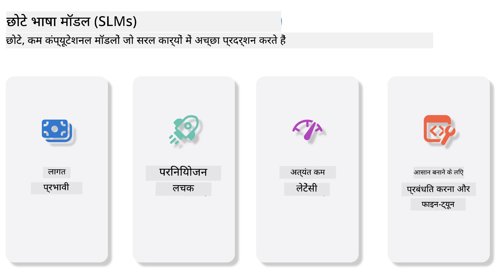
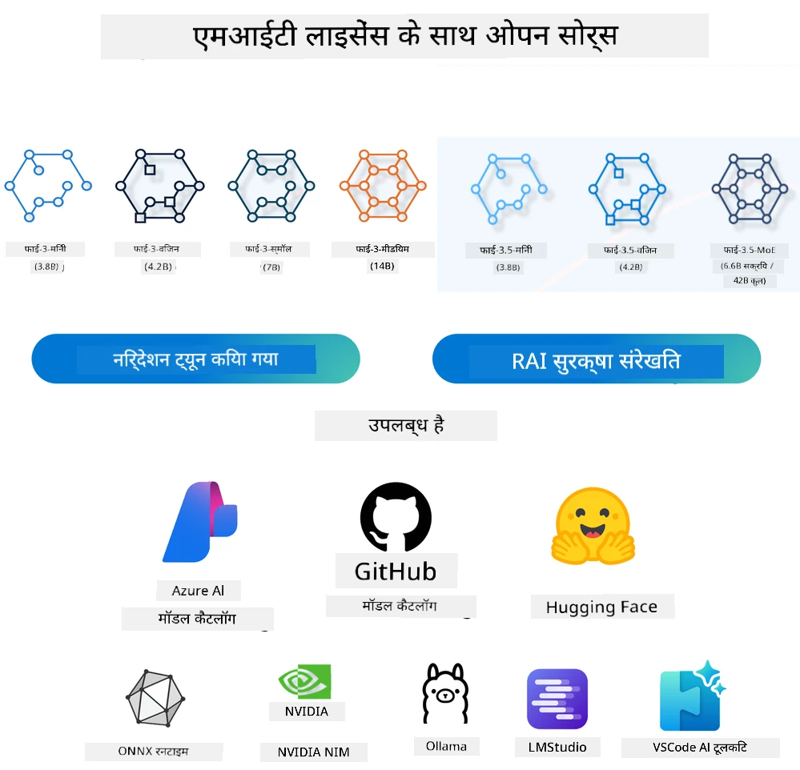
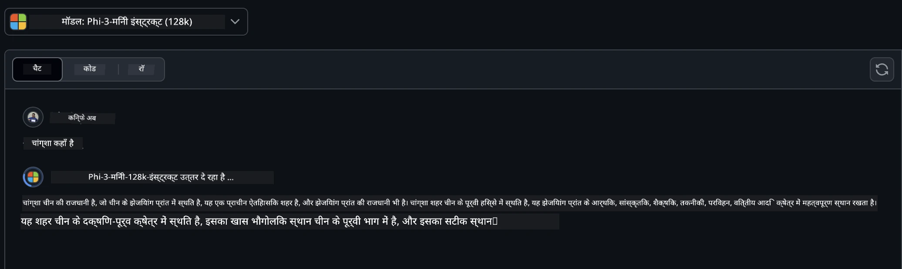
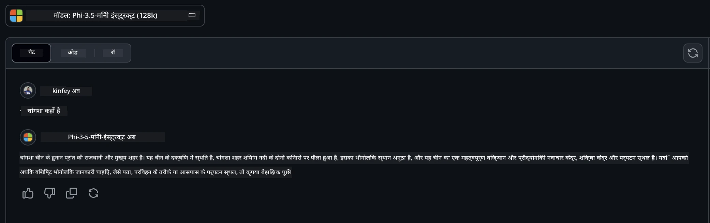

# छोटे भाषा मॉडल के लिए परिचय जनरेटिव AI के लिए शुरुआती लोगों के लिए
जनरेटिव AI कृत्रिम बुद्धिमत्ता का एक आकर्षक क्षेत्र है जो नए सामग्री उत्पन्न करने में सक्षम प्रणालियाँ बनाने पर केंद्रित है। यह सामग्री टेक्स्ट और छवियों से लेकर संगीत और यहां तक कि संपूर्ण वर्चुअल परिवेश तक हो सकती है। जनरेटिव AI के सबसे रोमांचक अनुप्रयोगों में से एक भाषा मॉडलों के क्षेत्र में है।

## छोटे भाषा मॉडल क्या हैं?

एक छोटा भाषा मॉडल (SLM) बड़े भाषा मॉडल (LLM) का एक कम स्केल वाला संस्करण होता है, जो LLM के कई वास्तुशिल्प सिद्धांतों और तकनीकों का उपयोग करता है, जबकि इसका कम्प्यूटेशनल पदचिह्न काफी कम होता है।

SLMs ऐसे भाषा मॉडल के उपसमूह हैं जिन्हें मानव-समान टेक्स्ट उत्पन्न करने के लिए डिज़ाइन किया गया है। अपने बड़े समकक्षों जैसे GPT-4 के विपरीत, SLMs अधिक कॉम्पैक्ट और कुशल होते हैं, जो उन्हें उन अनुप्रयोगों के लिए आदर्श बनाते हैं जहां कम्प्यूटेशनल संसाधन सीमित होते हैं। अपनी छोटी आकार के बावजूद, वे अभी भी विभिन्न कार्य कर सकते हैं। आमतौर पर, SLMs को LLMs को संपीड़ित या डिस्टिल करके बनाया जाता है, जिसका उद्देश्य मूल मॉडल की कार्यक्षमता और भाषाई क्षमताओं का एक महत्वपूर्ण हिस्सा बनाए रखना होता है। मॉडल के आकार में यह कमी समग्र जटिलता को घटाती है, जिससे SLMs मेमोरी उपयोग और कम्प्यूटेशनल आवश्यकताओं दोनों के संदर्भ में अधिक कुशल होते हैं। इन अनुकूलनों के बावजूद, SLMs अभी भी प्राकृतिक भाषा प्रसंस्करण (NLP) के कई कार्य कर सकते हैं:

- टेक्स्ट जनरेशन: संगत और संदर्भ अनुसार प्रासंगिक वाक्य या पैराग्राफ बनाना।
- टेक्स्ट पूर्णता: दिए गए प्रॉम्प्ट के आधार पर वाक्यों का पूर्वानुमान और पूर्ण करना।
- अनुवाद: एक भाषा से दूसरी भाषा में टेक्स्ट का रूपांतरण।
- सारांश: लंबे टेक्स्ट को छोटे, अधिक पचने योग्य सारांशों में संक्षेपित करना।

हालांकि कुछ प्रदर्शन या समझ की गहराई में अपने बड़े समकक्षों की तुलना में कुछ समझौते हो सकते हैं।

## छोटे भाषा मॉडल कैसे काम करते हैं?
SLMs विशाल मात्रा में टेक्स्ट डेटा पर प्रशिक्षित किए जाते हैं। प्रशिक्षण के दौरान, वे भाषा के पैटर्न और संरचनाओं को सीखते हैं, जिससे वे ऐसा टेक्स्ट उत्पन्न कर सकते हैं जो व्याकरणिक रूप से सही और संदर्भानुसार उपयुक्त हो। प्रशिक्षण प्रक्रिया में शामिल हैं:

- डेटा संग्रह: विभिन्न स्रोतों से बड़े डेटासेट इकट्ठा करना।
- पूर्व-प्रसंस्करण: प्रशिक्षण के लिए डेटा को साफ़ और व्यवस्थित करना।
- प्रशिक्षण: मशीन लर्निंग एल्गोरिदम का उपयोग करते हुए मॉडल को टेक्स्ट समझने और उत्पन्न करने की शिक्षा देना।
- फाइन-ट्यूनिंग: विशिष्ट कार्यों पर प्रदर्शन सुधारने के लिए मॉडल को समायोजित करना।

SLM का विकास उन मॉडलों के बढ़ती जरूरतों के साथ मेल खाता है जिन्हें संसाधन-संकुचित वातावरण जैसे मोबाइल उपकरणों या एज कंप्यूटिंग प्लेटफ़ॉर्म पर तैनात किया जा सकता है, जहां पूर्ण पैमाने पर LLMs भारी संसाधन मांग के कारण व्यावहारिक नहीं हो सकते। दक्षता पर ध्यान केंद्रित करके, SLM प्रदर्शन और पहुँच के बीच संतुलन बनाते हैं, जो विभिन्न डोमेन में व्यापक अनुप्रयोग सक्षम करता है।



## सीखने के उद्देश्य

इस पाठ में, हम आशा करते हैं कि SLM का ज्ञान प्रदान करेंगे और इसे Microsoft Phi-3 के साथ जोड़कर टेक्स्ट कंटेंट, दृष्टि और MoE में विभिन्न परिदृश्य सीखेंगे।

पाठ के अंत में, आपको निम्नलिखित प्रश्नों के उत्तर देने में सक्षम होना चाहिए:

- SLM क्या है?
- SLM और LLM में क्या अंतर है?
- Microsoft Phi-3 / 3.5 परिवार क्या है?
- Microsoft Phi-3 / 3.5 परिवार के साथ इंफरेंस कैसे चलाते हैं?

तैयार हैं? चलिए शुरू करते हैं।

## बड़े भाषा मॉडल (LLM) और छोटे भाषा मॉडल (SLM) के बीच अंतर

दोनों LLM और SLM प्रायिक मशीन लर्निंग के मौलिक सिद्धांतों पर आधारित हैं, जो वास्तुशिल्प डिजाइन, प्रशिक्षण पद्धतियों, डेटा उत्पन्न प्रक्रियाओं, और मॉडल मूल्यांकन तकनीकों में समान दृष्टिकोण का पालन करते हैं। हालांकि, कई प्रमुख कारक इन दो प्रकार के मॉडलों को अलग करते हैं।

## छोटे भाषा मॉडलों के अनुप्रयोग

SLMs के कई अनुप्रयोग हैं, जिनमें शामिल हैं:

- चैटबॉट्स: ग्राहक सहायता प्रदान करना और संवादात्मक तरीके से उपयोगकर्ताओं से जुड़ना।
- सामग्री निर्माण: लेखकों को विचार उत्पन्न करने या पूरे आलेख प्रारूपित करने में सहायता करना।
- शिक्षा: छात्रों को लेखन असाइनमेंट में मदद करना या नई भाषाएँ सीखने में सहायता करना।
- सुलभता: विकलांग व्यक्तियों के लिए उपकरण बनाना, जैसे टेक्स्ट-टू-स्पीच सिस्टम।

**आकार**

LLM और SLM के बीच एक प्रमुख भेद मॉडल के आकार में होता है। LLMs, जैसे ChatGPT (GPT-4), अनुमानित 1.76 ट्रिलियन पैरामीटर हो सकते हैं, जबकि खुले स्रोत के SLMs जैसे Mistral 7B में काफी कम पैरामीटर होते हैं — लगभग 7 बिलियन। यह भिन्नता मुख्य रूप से मॉडल वास्तुकला और प्रशिक्षण प्रक्रियाओं के अंतर के कारण होती है। उदाहरण के लिए, ChatGPT एक एन्कोडर-डिकोडर फ्रेमवर्क में सेल्फ-अटेंशन मेकानिज्म का उपयोग करता है, जबकि Mistral 7B स्लाइडिंग विंडो अटेंशन का उपयोग करता है, जो सिर्फ डिकोडर मॉडल के अंदर अधिक कुशल प्रशिक्षण सक्षम करता है। इस वास्तुशिल्प भिन्नता का इन मॉडलों की जटिलता और प्रदर्शन पर गहरा प्रभाव पड़ता है।

**समझ**

SLMs आमतौर पर विशिष्ट डोमेन में प्रदर्शन के लिए अनुकूलित होते हैं, जिससे वे अत्यधिक विशेषज्ञता वाले होते हैं लेकिन कई ज्ञान क्षेत्रों में व्यापक संदर्भात्मक समझ प्रदान करने में सीमित हो सकते हैं। इसके विपरीत, LLMs मानव समान बुद्धिमत्ता का एक अधिक व्यापक स्तर पर अनुकरण करने का प्रयास करते हैं। विशाल, विविध डेटासेट पर प्रशिक्षित, LLMs विभिन्न डोमेनों में अच्छी कार्यक्षमता के लिए डिज़ाइन किए गए हैं, जो उन्हें अधिक बहुमुखी और अनुकूलनीय बनाते हैं। परिणामस्वरूप, LLMs अधिक व्यापक डाउनस्ट्रीम कार्यों, जैसे कि प्राकृतिक भाषा प्रसंस्करण और प्रोग्रामिंग के लिए अधिक उपयुक्त होते हैं।

**कंप्यूटिंग**

LLM का प्रशिक्षण और परिनियोजन संसाधन-गहन होता है, जिसमें अक्सर बड़े पैमाने पर GPU क्लस्टर की आवश्यकता होती है। उदाहरण के लिए, ChatGPT जैसे मॉडल को आरंभ से प्रशिक्षित करने के लिए हजारों GPU और लंबा समय आवश्यक हो सकता है। इसके विपरीत, SLM, अपने कम पैरामीटर गणना के कारण, कंप्यूटेशनल संसाधनों के संदर्भ में अधिक पहुँच योग्य होते हैं। Mistral 7B जैसे मॉडल को मध्यम GPU क्षमताओं वाले स्थानीय मशीनों पर प्रशिक्षित और चलाया जा सकता है, यद्यपि प्रशिक्षण में अभी भी कई घंटों के लिए कई GPUs का उपयोग होता है।

**पक्षपात**

पक्षपात LLMs में ज्ञात समस्या है, मुख्य रूप से प्रशिक्षण डेटा की प्रकृति के कारण। ये मॉडल अक्सर इंटरनेट से कच्चे, खुले स्रोत डेटा पर निर्भर होते हैं, जो कुछ समूहों का अपर्याप्त या गलत प्रतिनिधित्व कर सकता है, गलत लेबलिंग कर सकता है, या बोली, भौगोलिक भिन्नताओं और व्याकरण नियमों से प्रेरित भाषाई पक्षपात प्रतिबिंबित कर सकता है। इसके अतिरिक्त, LLM वास्तुशिल्प की जटिलता पक्षपात को अनजाने में बढ़ा सकती है, जो सावधानीपूर्वक फाइन-ट्यूनिंग के बिना अस्पष्ट रह सकता है। दूसरी ओर, SLMs, जो अधिक सीमित और डोमेन-विशिष्ट डेटासेट पर प्रशिक्षित होते हैं, स्वाभाविक रूप से ऐसे पक्षपात के कम शिकार होते हैं, हालांकि वे पूरी तरह से मुक्त नहीं होते।

**इन्फेरेंस**

SLMs के कम आकार से उन्हें इन्फेरेंस गति में महत्वपूर्ण लाभ मिलता है, जिससे वे स्थानीय हार्डवेयर पर बिना व्यापक समांतर प्रसंस्करण की आवश्यकता के कुशलतापूर्वक आउटपुट उत्पन्न कर सकते हैं। इसके विपरीत, LLMs अपने आकार और जटिलता के कारण स्वीकार्य इन्फेरेंस समय प्राप्त करने के लिए महत्वपूर्व समांतर कम्प्यूटेशनल संसाधनों की मांग करते हैं। एकाधिक समवर्ती उपयोगकर्ताओं की उपस्थिति LLMs के प्रतिक्रिया समय को और धीमा कर देती है, विशेषकर बड़े पैमाने पर परिनियोजन के समय।

सारांश में, जबकि दोनों LLM और SLM मशीन लर्निंग में मौलिक आधार साझा करते हैं, वे मॉडल आकार, संसाधन आवश्यकताओं, संदर्भात्मक समझ, पक्षपात की प्रवृत्ति और अनुमान गति के संदर्भ में काफी भिन्न होते हैं। ये अंतर उनके विभिन्न उपयोग के मामलों के लिए उपयुक्तता को दर्शाते हैं, जिसमें LLM अधिक बहुमुखी लेकिन संसाधन-गहन होते हैं, और SLM डोमेन-विशिष्ट दक्षता के लिए कम कम्प्यूटेशनल मांगों के साथ पेश करते हैं।

***ध्यान दें: इस पाठ में, हम SLM को Microsoft Phi-3 / 3.5 का उपयोग करके उदाहरण के रूप में प्रस्तुत करेंगे।***

## Phi-3 / Phi-3.5 परिवार का परिचय

Phi-3 / 3.5 परिवार मुख्य रूप से टेक्स्ट, दृष्टि और एजेंट (MoE) अनुप्रयोग परिदृश्यों को लक्षित करता है:

### Phi-3 / 3.5 निर्देशित

मुख्य रूप से टेक्स्ट जनरेशन, चैट पूर्णता और सामग्री सूचना निष्कर्षण के लिए।

**Phi-3-मिनी**

3.8B भाषा मॉडल Microsoft Azure AI Studio, Hugging Face, और Ollama पर उपलब्ध है। Phi-3 मॉडल समान और बड़े आकार के भाषा मॉडलों की तुलना में मुख्य बेंचमार्क पर महत्वपूर्ण रूप से बेहतर प्रदर्शन करते हैं (नीचे दिए गए बेंचमार्क संख्याएँ देखें, अधिक संख्या बेहतर है)। Phi-3-मिनी दो गुना बड़े मॉडलों से बेहतर प्रदर्शन करता है, जबकि Phi-3-small और Phi-3-medium GPT-3.5 सहित बड़े मॉडलों को टक्कर देते हैं।

**Phi-3-small और medium**

केवल 7B पैरामीटर के साथ, Phi-3-small विभिन्न भाषा, तर्क, कोडिंग और गणित बेंचमार्क पर GPT-3.5T को हराता है।

Phi-3-medium 14B पैरामीटर के साथ इस प्रवृत्ति को जारी रखता है और Gemini 1.0 Pro से बेहतर प्रदर्शन करता है।

**Phi-3.5-मिनी**

इसे Phi-3-मिनी का उन्नयन समझा जा सकता है। जबकि पैरामीटर अपरिवर्तित रहते हैं, यह कई भाषाओं (20+ भाषाओं का समर्थन: अरबी, चीनी, चेक, डैनिश, डच, अंग्रेजी, फिनिश, फ्रेंच, जर्मन, हिब्रू, हंगेरियन, इतालवी, जापानी, कोरियाई, नॉर्वेजियन, पोलिश, पुर्तगाली, रूसी, स्पैनिश, स्वीडिश, थाई, तुर्की, यूक्रेनी) का समर्थन सुधारता है और लंबे संदर्भ के लिए मजबूत समर्थन जोड़ता है।

3.8B पैरामीटर के साथ Phi-3.5-मिनी समान आकार के भाषा मॉडलों से बेहतर प्रदर्शन करता है और दो गुना बड़े मॉडलों के बराबर है।

### Phi-3 / 3.5 दृष्टि

हम Phi-3/3.5 के Instruct मॉडल को Phi की समझने की क्षमता के रूप में सोच सकते हैं, और Vision वह है जो Phi को दुनिया को समझने के लिए आँखें देता है।

**Phi-3- दृष्टि**

केवल 4.2B पैरामीटर के साथ Phi-3-vision इस प्रवृत्ति को जारी रखता है और Claude-3 Haiku और Gemini 1.0 Pro V जैसे बड़े मॉडलों को सामान्य दृश्य तर्क कार्यों, OCR, और तालिका और आरेख समझ कार्यों पर पछाड़ देता है।

**Phi-3.5-दृष्टि**

Phi-3.5-vision भी Phi-3-vision का उन्नयन है, जो कई छवियों का समर्थन जोड़ता है। आप इसे दृष्टि में सुधार के रूप में सोच सकते हैं, न केवल आप तस्वीरें देख सकते हैं, बल्कि वीडियो भी।

Phi-3.5-vision, Claude-3.5 Sonnet और Gemini 1.5 Flash जैसे बड़े मॉडलों को OCR, तालिका और चार्ट समझ कार्यों में पछाड़ देता है और सामान्य दृश्य ज्ञान तर्क कार्यों में उनके बराबर है। यह बहु-फ्रेम इनपुट का समर्थन करता है, यानी कई इनपुट छवियों पर तर्क करता है।

### Phi-3.5-MoE

***मिश्रित विशेषज्ञ (MoE)*** मॉडल को बहुत कम कंप्यूट के साथ पूर्व-प्रशिक्षित करने में सक्षम बनाता है, जिसका अर्थ है कि आप एक घने मॉडल के समान कंप्यूट बजट के साथ मॉडल या डेटासेट आकार को नाटकीय रूप से बढ़ा सकते हैं। विशेष रूप से, MoE मॉडल को अपने घने समकक्ष की तुलना में पूर्वप्रशिक्षण के दौरान समान गुणवत्ता को तेज़ी से प्राप्त करना चाहिए।

Phi-3.5-MoE में 16x3.8B विशेषज्ञ मॉड्यूल होते हैं। केवल 6.6B सक्रिय पैरामीटर के साथ Phi-3.5-MoE बड़े मॉडलों जितना ही तर्क, भाषा समझ और गणित का समान स्तर प्राप्त करता है।

हम विभिन्न परिदृश्यों के आधार पर Phi-3/3.5 परिवार मॉडल का उपयोग कर सकते हैं। LLM के विपरीत, आप Phi-3/3.5-मिनी या Phi-3/3.5-दृष्टि को एज डिवाइस पर तैनात कर सकते हैं।

## Phi-3/3.5 परिवार मॉडल का उपयोग कैसे करें

हम आशा करते हैं कि Phi-3/3.5 को विभिन्न परिदृश्यों में उपयोग किया जा सके। अगले भाग में, हम विभिन्न परिदृश्यों के आधार पर Phi-3/3.5 का उपयोग करेंगे।



### क्लाउड API के माध्यम से इन्फेरेंस

**GitHub मॉडल**

GitHub मॉडल सबसे सीधा तरीका है। आप GitHub मॉडल के माध्यम से तेज़ी से Phi-3/3.5-Instruct मॉडल तक पहुँच सकते हैं। Azure AI इंफेरेंस SDK / OpenAI SDK के साथ संयोजन में, आप कोड के माध्यम से API का उपयोग कर Phi-3/3.5-Instruct कॉल पूरा कर सकते हैं। आप Playground के माध्यम से विभिन्न प्रभावों का भी परीक्षण कर सकते हैं।

- डेमो: चीनी परिदृश्यों में Phi-3-मिनी और Phi-3.5-मिनी के प्रभावों की तुलना





**Azure AI Studio**

यदि आप दृष्टि और MoE मॉडल का उपयोग करना चाहते हैं, तो आप Azure AI Studio का उपयोग करके कॉल पूरा कर सकते हैं। यदि आप रुचि रखते हैं, तो आप Phi-3 कुकबुक पढ़ सकते हैं कि कैसे Azure AI Studio के माध्यम से Phi-3/3.5 Instruct, Vision, MoE को कॉल करें [इस लिंक पर क्लिक करें](https://github.com/microsoft/Phi-3CookBook/blob/main/md/02.QuickStart/AzureAIStudio_QuickStart.md?WT.mc_id=academic-105485-koreyst)

**NVIDIA NIM**

Azure और GitHub द्वारा प्रदान की गई क्लाउड-आधारित मॉडल कैटलॉग समाधानों के अलावा, आप संबंधित कॉल पूरा करने के लिए [NVIDIA NIM](https://developer.nvidia.com/nim?WT.mc_id=academic-105485-koreyst) का भी उपयोग कर सकते हैं। आप NVIDIA NIM पर जाकर Phi-3/3.5 परिवार के API कॉल पूरा कर सकते हैं। NVIDIA NIM (NVIDIA Inference Microservices) एक त्वरित इन्फेरेंस माइक्रोसर्विसेस का सेट है जो विभिन्न वातावरणों, जिनमें क्लाउड, डेटा सेंटर, और वर्कस्टेशन शामिल हैं, में AI मॉडल को कुशलतापूर्वक तैनात करने में डेवलपर्स की मदद करता है।

NVIDIA NIM की कुछ प्रमुख विशेषताएँ यहाँ हैं:
- **डिप्लॉयमेंट में आसानी:** NIM एक कमांड के साथ AI मॉडल को तैनात करने की अनुमति देता है, जिससे इसे मौजूदा वर्कफ़्लो में सहजता से इंटीग्रेट किया जा सकता है।
- **उन्नत प्रदर्शन:** यह NVIDIA के प्री-ऑप्टिमाइज़्ड इन्फरेंस इंजन जैसे TensorRT और TensorRT-LLM का उपयोग करता है, ताकि कम विलंबता और उच्च थ्रूपुट सुनिश्चित किया जा सके।
- **स्केलेबिलिटी:** NIM Kubernetes पर ऑटोस्केलिंग का समर्थन करता है, जिससे विभिन्न कार्यभारों को प्रभावी ढंग से संभाला जा सकता है।
- **सुरक्षा और नियंत्रण:** संगठन अपने डेटा और अनुप्रयोगों पर नियंत्रण बनाए रखने के लिए NIM माइक्रोसर्विसेज को अपनी खुद की प्रबंधित इन्फ्रास्ट्रक्चर पर सेल्फ-होस्ट कर सकते हैं।
- **मानक एपीआई:** NIM उद्योग-मानक APIs प्रदान करता है, जिससे चैटबॉट्स, AI असिस्टेंट्स, और अन्य AI अनुप्रयोगों का निर्माण और इंटीग्रेशन सरल होता है।

NIM NVIDIA AI Enterprise का हिस्सा है, जिसका उद्देश्य AI मॉडल्स के तैनाती और संचालन को सरल बनाना है, जिससे वे NVIDIA GPUs पर प्रभावी ढंग से चलें।

- डेमो: NVIDIA NIM का उपयोग करके Phi-3.5-Vision-API को कॉल करना [[Click this link](./python/Phi-3-Vision-Nividia-NIM.ipynb?WT.mc_id=academic-105485-koreyst)]


### Phi-3/3.5 को लोकली चलाना
Phi-3 या GPT-3 जैसे किसी भी भाषा मॉडल के लिए इनफरेंस का मतलब है इनपुट प्राप्त करने पर प्रतिक्रिया या भविष्यवाणी उत्पन्न करने की प्रक्रिया। जब आप Phi-3 को कोई प्रॉम्प्ट या प्रश्न देते हैं, तो यह अपने प्रशिक्षित न्यूरल नेटवर्क का उपयोग करके डाटा में पैटर्न और संबंधों का विश्लेषण कर सबसे संभावित और प्रासंगिक उत्तर निकालता है।

**Hugging Face ट्रांसफॉर्मर**  
Hugging Face Transformers एक शक्तिशाली लाइब्रेरी है जो प्राकृतिक भाषा प्रसंस्करण (NLP) और अन्य मशीन लर्निंग कार्यों के लिए डिज़ाइन की गई है। यहाँ इसके कुछ प्रमुख बिंदु हैं:

1. **पूर्व-प्रशिक्षित मॉडल्स:** यह हजारों पूर्व-प्रशिक्षित मॉडल प्रदान करता है जिन्हें टेक्स्ट क्लासिफिकेशन, नामित इकाई पहचान, प्रश्नोत्तर, सारांश, अनुवाद और टेक्स्ट जनरेशन जैसे कार्यों के लिए उपयोग किया जा सकता है।

2. **फ्रेमवर्क इंटरऑपरेबिलिटी:** यह लाइब्रेरी PyTorch, TensorFlow, और JAX सहित कई डीप लर्निंग फ्रेमवर्क का समर्थन करती है। इससे आप किसी एक फ्रेमवर्क में मॉडल प्रशिक्षित करके दूसरे में उपयोग कर सकते हैं।

3. **मल्टीमॉडल क्षमताएं:** NLP के अलावा, Hugging Face Transformers कंप्यूटर विज़न (जैसे इमेज क्लासिफिकेशन, ऑब्जेक्ट डिटेक्शन) और ऑडियो प्रोसेसिंग (जैसे स्पीच रिकॉग्निशन, ऑडियो क्लासिफिकेशन) कार्यों का भी समर्थन करता है।

4. **उपयोग में आसानी:** यह लाइब्रेरी APIs और उपकरण प्रदान करता है जिससे मॉडल डाउनलोड करना और फाइन-ट्यून करना आसान हो जाता है, जो शुरुआती और विशेषज्ञ दोनों के लिए उपयोगी है।

5. **समुदाय और संसाधन:** Hugging Face की एक जीवंत कम्युनिटी है और वृहद दस्तावेज़ीकरण, ट्यूटोरियल्स, और मार्गदर्शिकाएं उपलब्ध हैं जो उपयोगकर्ताओं को शुरुआत करने और लाइब्रेरी का अधिकतम उपयोग करने में मदद करती हैं। [अधिकारिक दस्तावेज़](https://huggingface.co/docs/transformers/index?WT.mc_id=academic-105485-koreyst) या उनका [GitHub रिपॉजिटरी](https://github.com/huggingface/transformers?WT.mc_id=academic-105485-koreyst) देखें।

यह सबसे आमतौर पर इस्तेमाल की जाने वाली विधि है, लेकिन इसके लिए GPU एक्सेलेरेशन की भी आवश्यकता होती है। आखिरकार, विज़न और MoE जैसे परिदृश्यों में बहुत सारे गणनात्मक कार्य होते हैं, जो बिना क्वांटाइजेशन के CPU पर बहुत धीमे चलेंगे।

- डेमो: Transformer का उपयोग करके Phi-3.5-Instruct को कॉल करना [Click this link](./python/phi35-instruct-demo.ipynb?WT.mc_id=academic-105485-koreyst)

- डेमो: Transformer का उपयोग करके Phi-3.5-Vision को कॉल करना [Click this link](./python/phi35-vision-demo.ipynb?WT.mc_id=academic-105485-koreyst)

- डेमो: Transformer का उपयोग करके Phi-3.5-MoE को कॉल करना [Click this link](./python/phi35_moe_demo.ipynb?WT.mc_id=academic-105485-koreyst)

**Ollama**  
[Ollama](https://ollama.com/?WT.mc_id=academic-105485-koreyst) एक प्लेटफ़ॉर्म है जो स्थानीय मशीन पर बड़े भाषा मॉडल्स (LLMs) को चलाना आसान बनाता है। यह Llama 3.1, Phi 3, Mistral, Gemma 2 सहित विभिन्न मॉडलों का समर्थन करता है। यह प्लेटफ़ॉर्म मॉडल वेट्स, कॉन्फ़िगरेशन, और डेटा को एक पैकेज में बांधकर प्रक्रिया को सरल बनाता है, जिससे उपयोगकर्ता अपने स्वयं के मॉडल को अनुकूलित और बना सकते हैं। Ollama macOS, Linux और Windows के लिए उपलब्ध है। यदि आप क्लाउड सेवाओं पर निर्भर हुए बिना LLM के साथ प्रयोग करना या तैनात करना चाहते हैं, तो यह एक बढ़िया उपकरण है। Ollama सबसे सीधे तरीके से काम करता है, आपको केवल निम्नलिखित कमांड निष्पादित करनी होगी।

```bash

ollama run phi3.5

```


**GenAI के लिए ONNX Runtime**

[ONNX Runtime](https://github.com/microsoft/onnxruntime-genai?WT.mc_id=academic-105485-koreyst) एक क्रॉस-प्लेटफ़ॉर्म इन्फरेंस और प्रशिक्षण मशीन लर्निंग एक्सेलेरेटर है। Generative AI (GENAI) के लिए ONNX Runtime एक शक्तिशाली उपकरण है जो विभिन्न प्लेटफ़ॉर्म पर जेनेरेटिव AI मॉडल को कुशलतापूर्वक चलाने में मदद करता है।

## ONNX Runtime क्या है?  
ONNX Runtime एक ओपन-सोर्स प्रोजेक्ट है जो मशीन लर्निंग मॉडल्स के उच्च प्रदर्शन वाला इन्फरेंस सक्षम करता है। यह Open Neural Network Exchange (ONNX) फॉर्मेट में मॉडल्स का समर्थन करता है, जो मशीन लर्निंग मॉडल्स को रिप्रेजेंट करने का एक मानक है। ONNX Runtime इन्फरेंस तेज़ ग्राहक अनुभव और कम लागत सुनिश्चित कर सकता है, और PyTorch तथा TensorFlow/Keras जैसे डीप लर्निंग फ्रेमवर्क के साथ-साथ scikit-learn, LightGBM, XGBoost जैसे क्लासिकल मशीन लर्निंग लाइब्रेरीज़ को भी सपोर्ट करता है। ONNX Runtime विभिन्न हार्डवेयर, ड्राइवर्स और ऑपरेटिंग सिस्टम के साथ संगत है, और हार्डवेयर एक्सेलेरेटर का लाभ उठाकर बेहतर प्रदर्शन प्रदान करता है, साथ ही ग्राफ ऑप्टिमाइजेशन और ट्रांसफॉर्म्स का भी उपयोग करता है।

## Generative AI क्या है?  
Generative AI उन AI सिस्टम्स को कहते हैं जो नए कंटेंट, जैसे टेक्स्ट, इमेज, या संगीत, उत्पन्न कर सकते हैं जो उन्होंने प्रशिक्षित डेटा पर आधारित होते हैं। उदाहरण के तौर पर GPT-3 जैसे भाषा मॉडल और Stable Diffusion जैसे इमेज जनरेशन मॉडल। ONNX Runtime for GenAI लाइब्रेरी ONNX मॉडल्स के लिए जनरेटिव AI लूप प्रदान करती है, जिसमें ONNX Runtime के साथ इन्फरेंस, लॉजिट्स प्रोसेसिंग, सर्च और सैंपलिंग, तथा KV कैश प्रबंधन शामिल हैं।

## ONNX Runtime for GENAI  
ONNX Runtime for GENAI ONNX Runtime की क्षमताओं का विस्तार करता है ताकि वह जनरेटिव AI मॉडल का समर्थन कर सके। मुख्य विशेषताएँ निम्नलिखित हैं:

- **विस्तृत प्लेटफ़ॉर्म समर्थन:** यह Windows, Linux, macOS, Android, और iOS सहित विभिन्न प्लेटफ़ॉर्म पर काम करता है।
- **मॉडल समर्थन:** यह LLaMA, GPT-Neo, BLOOM, और अन्य जैसे कई लोकप्रिय जनरेटिव AI मॉडल्स का समर्थन करता है।
- **प्रदर्शन अनुकूलन:** यह NVIDIA GPUs, AMD GPUs और अन्य हार्डवेयर एक्सेलेरेटर के लिए अनुकूलन शामिल करता है।
- **उपयोग में आसानी:** यह एप्लिकेशन में सरल इंटीग्रेशन के लिए APIs प्रदान करता है, जिससे आप न्यूनतम कोड के साथ टेक्स्ट, इमेज, और अन्य कंटेंट उत्पन्न कर सकते हैं।
- उपयोगकर्ता उच्च स्तर का generate() मेथड कॉल कर सकते हैं, या मॉडल के प्रत्येक इटरेशन को लूप में चला सकते हैं, एक बार में एक टोकन उत्पन्न कर सकते हैं, और आवश्यकतानुसार लूप के अंदर जनरेशन पैरामीटर अपडेट कर सकते हैं।
- ONNX Runtime में ग्रीडी/बीम सर्च और TopP, TopK सैंपलिंग का समर्थन है जो टोकन सिक्वेंस उत्पन्न करते हैं और लॉजिट प्रोसेसिंग जैसे रिपिटीशन पेनल्टी भी अंतर्निहित हैं। आप आसानी से कस्टम स्कोरिंग भी जोड़ सकते हैं।

## शुरूआत कैसे करें  
ONNX Runtime for GENAI के साथ शुरू करने के लिए, आप निम्न चरणों का पालन कर सकते हैं:

### ONNX Runtime इंस्टॉल करें:  
```Python
pip install onnxruntime
```
### जनरेटिव AI एक्सटेंशन्स इंस्टॉल करें:  
```Python
pip install onnxruntime-genai
```
  
### एक मॉडल चलाएं: यहाँ Python में एक सरल उदाहरण है:  
```Python
import onnxruntime_genai as og

model = og.Model('path_to_your_model.onnx')

tokenizer = og.Tokenizer(model)

input_text = "Hello, how are you?"

input_tokens = tokenizer.encode(input_text)

output_tokens = model.generate(input_tokens)

output_text = tokenizer.decode(output_tokens)

print(output_text) 
```
### डेमो: ONNX Runtime GenAI का उपयोग करके Phi-3.5-Vision को कॉल करना  

```python

import onnxruntime_genai as og

model_path = './Your Phi-3.5-vision-instruct ONNX Path'

img_path = './Your Image Path'

model = og.Model(model_path)

processor = model.create_multimodal_processor()

tokenizer_stream = processor.create_stream()

text = "Your Prompt"

prompt = "<|user|>\n"

prompt += "<|image_1|>\n"

prompt += f"{text}<|end|>\n"

prompt += "<|assistant|>\n"

image = og.Images.open(img_path)

inputs = processor(prompt, images=image)

params = og.GeneratorParams(model)

params.set_inputs(inputs)

params.set_search_options(max_length=3072)

generator = og.Generator(model, params)

while not generator.is_done():

    generator.compute_logits()
    
    generator.generate_next_token()

    new_token = generator.get_next_tokens()[0]
    
    output = tokenizer_stream.decode(new_token)
    
    print(tokenizer_stream.decode(new_token), end='', flush=True)

```


**अन्य**

ONNX Runtime और Ollama संदर्भ विधियों के अतिरिक्त, हम विभिन्न निर्माताओं द्वारा प्रदान की गई मॉडल संदर्भ विधियों के आधार पर वैकल्पिक क्वांटिटेटिव मॉडल संदर्भ भी पूरा कर सकते हैं। जैसे Apple Metal के साथ Apple MLX फ्रेमवर्क, Qualcomm QNN के साथ NPU, Intel OpenVINO के साथ CPU/GPU आदि। आप [Phi-3 Cookbook](https://github.com/microsoft/phi-3cookbook?WT.mc_id=academic-105485-koreyst) से और भी सामग्री प्राप्त कर सकते हैं।

## अधिक

हमने Phi-3/3.5 परिवार के मूल बातें सीख ली हैं, लेकिन SLM के बारे में अधिक जानने के लिए हमें और ज्ञान की आवश्यकता है। आप इसके उत्तर Phi-3 Cookbook में पा सकते हैं। यदि आप और अधिक सीखना चाहते हैं, तो कृपया [Phi-3 Cookbook](https://github.com/microsoft/phi-3cookbook?WT.mc_id=academic-105485-koreyst) पर जाएं।

---

<!-- CO-OP TRANSLATOR DISCLAIMER START -->
**अस्वीकरण**:
यह दस्तावेज़ AI अनुवाद सेवा [Co-op Translator](https://github.com/Azure/co-op-translator) का उपयोग करके अनूदित किया गया है। जबकि हम सटीकता के लिए प्रयासरत हैं, कृपया ध्यान रखें कि स्वचालित अनुवाद में त्रुटियाँ या असंगतियां हो सकती हैं। मूल भाषा में मूल दस्तावेज़ को आधिकारिक स्रोत मानना चाहिए। महत्वपूर्ण जानकारी के लिए, पेशेवर मानव अनुवाद की सिफारिश की जाती है। इस अनुवाद के उपयोग से उत्पन्न किसी भी गलतफहमी या गलत व्याख्या के लिए हम जिम्मेदार नहीं हैं।
<!-- CO-OP TRANSLATOR DISCLAIMER END -->