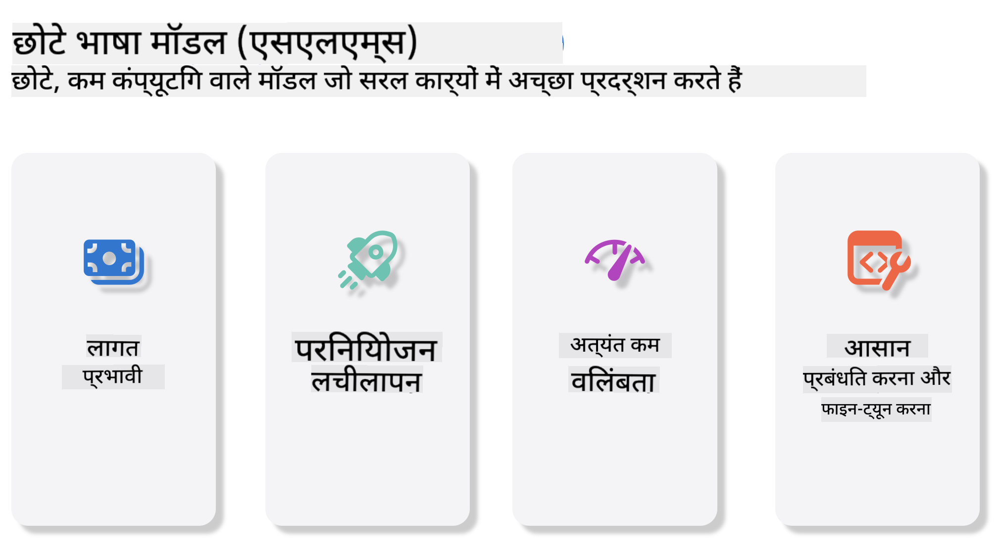
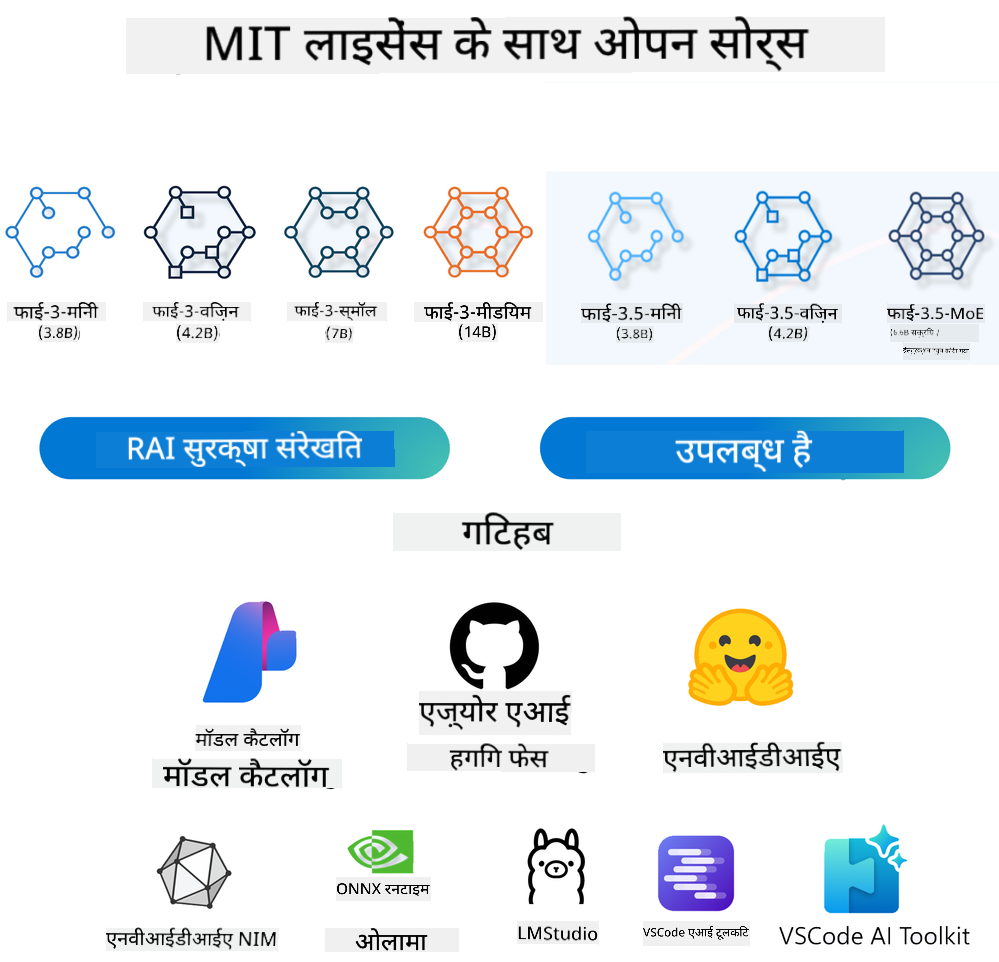
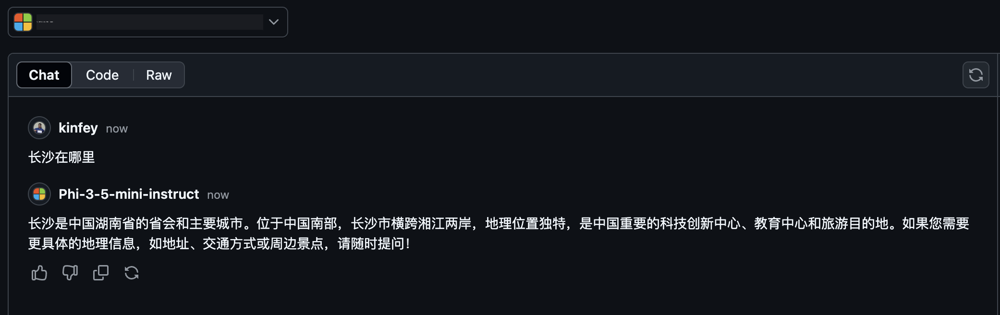

<!--
CO_OP_TRANSLATOR_METADATA:
{
  "original_hash": "124ad36cfe96f74038811b6e2bb93e9d",
  "translation_date": "2025-07-09T18:24:35+00:00",
  "source_file": "19-slm/README.md",
  "language_code": "hi"
}
-->
# शुरुआती लोगों के लिए जनरेटिव AI के लिए छोटे भाषा मॉडल का परिचय  
जनरेटिव AI कृत्रिम बुद्धिमत्ता का एक रोमांचक क्षेत्र है जो नए कंटेंट बनाने में सक्षम सिस्टम बनाने पर केंद्रित है। यह कंटेंट टेक्स्ट, इमेज, म्यूजिक और यहां तक कि पूरे वर्चुअल वातावरण तक हो सकता है। जनरेटिव AI का सबसे रोमांचक उपयोग भाषा मॉडलों के क्षेत्र में होता है।  

## छोटे भाषा मॉडल क्या हैं?  

एक छोटा भाषा मॉडल (SLM) बड़े भाषा मॉडल (LLM) का एक संकुचित संस्करण होता है, जो LLM के कई वास्तुशिल्प सिद्धांतों और तकनीकों का उपयोग करता है, लेकिन इसका कम्प्यूटेशनल उपयोग काफी कम होता है।  

SLM भाषा मॉडलों का एक उपसमूह है जो मानव-समान टेक्स्ट जनरेट करने के लिए डिज़ाइन किए गए हैं। GPT-4 जैसे बड़े मॉडलों के विपरीत, SLM अधिक कॉम्पैक्ट और कुशल होते हैं, जो उन्हें उन जगहों के लिए उपयुक्त बनाता है जहां कम्प्यूटेशनल संसाधन सीमित होते हैं। छोटे आकार के बावजूद, ये कई कार्य कर सकते हैं। आमतौर पर, SLM को LLM को संपीड़ित या डिस्टिल करके बनाया जाता है, ताकि मूल मॉडल की अधिकांश कार्यक्षमता और भाषाई क्षमताएं बनी रहें। मॉडल के आकार में यह कमी जटिलता को कम करती है, जिससे SLM मेमोरी और कम्प्यूटेशनल आवश्यकताओं दोनों में अधिक कुशल हो जाते हैं। इन अनुकूलनों के बावजूद, SLM निम्नलिखित प्राकृतिक भाषा प्रसंस्करण (NLP) कार्य कर सकते हैं:  

- टेक्स्ट जनरेशन: सुसंगत और संदर्भानुसार उपयुक्त वाक्य या पैराग्राफ बनाना।  
- टेक्स्ट पूर्णता: दिए गए प्रॉम्प्ट के आधार पर वाक्य की भविष्यवाणी और पूर्णता।  
- अनुवाद: एक भाषा से दूसरी भाषा में टेक्स्ट का रूपांतरण।  
- सारांशण: लंबे टेक्स्ट को छोटे, समझने में आसान सारांशों में संक्षेपित करना।  

हालांकि, प्रदर्शन या समझ की गहराई में कुछ समझौते हो सकते हैं, खासकर बड़े मॉडलों की तुलना में।  

## छोटे भाषा मॉडल कैसे काम करते हैं?  
SLM विशाल मात्रा में टेक्स्ट डेटा पर प्रशिक्षित होते हैं। प्रशिक्षण के दौरान, वे भाषा के पैटर्न और संरचनाओं को सीखते हैं, जिससे वे व्याकरणिक रूप से सही और संदर्भानुसार उपयुक्त टेक्स्ट जनरेट कर पाते हैं। प्रशिक्षण प्रक्रिया में शामिल हैं:  

- डेटा संग्रह: विभिन्न स्रोतों से बड़े टेक्स्ट डेटासेट इकट्ठा करना।  
- पूर्वप्रसंस्करण: डेटा को साफ़ और व्यवस्थित करना ताकि वह प्रशिक्षण के लिए उपयुक्त हो।  
- प्रशिक्षण: मशीन लर्निंग एल्गोरिदम का उपयोग करके मॉडल को टेक्स्ट समझने और जनरेट करने की शिक्षा देना।  
- फाइन-ट्यूनिंग: विशिष्ट कार्यों पर प्रदर्शन सुधारने के लिए मॉडल को समायोजित करना।  

SLM का विकास उन वातावरणों की बढ़ती जरूरत के अनुरूप है जहां संसाधन सीमित होते हैं, जैसे मोबाइल डिवाइस या एज कंप्यूटिंग प्लेटफॉर्म, जहां बड़े LLM का उपयोग भारी संसाधन मांग के कारण व्यावहारिक नहीं होता। दक्षता पर ध्यान केंद्रित करके, SLM प्रदर्शन और पहुंच के बीच संतुलन बनाते हैं, जिससे विभिन्न क्षेत्रों में व्यापक उपयोग संभव होता है।  

  

## सीखने के उद्देश्य  

इस पाठ में, हम SLM का परिचय देना चाहते हैं और इसे Microsoft Phi-3 के साथ जोड़कर टेक्स्ट कंटेंट, विजन और MoE के विभिन्न परिदृश्यों को सीखना चाहते हैं।  

इस पाठ के अंत तक, आप निम्नलिखित प्रश्नों के उत्तर दे सकेंगे:  

- SLM क्या है  
- SLM और LLM में क्या अंतर है  
- Microsoft Phi-3/3.5 परिवार क्या है  
- Microsoft Phi-3/3.5 परिवार का इन्फरेंस कैसे करें  

तैयार हैं? चलिए शुरू करते हैं।  

## बड़े भाषा मॉडल (LLMs) और छोटे भाषा मॉडल (SLMs) के बीच अंतर  

दोनों LLM और SLM संभाव्य मशीन लर्निंग के मूल सिद्धांतों पर आधारित हैं, और उनकी वास्तुशिल्प डिजाइन, प्रशिक्षण विधियों, डेटा जनरेशन प्रक्रियाओं, और मॉडल मूल्यांकन तकनीकों में समानताएं हैं। हालांकि, कुछ मुख्य कारक इन दोनों प्रकार के मॉडलों को अलग करते हैं।  

## छोटे भाषा मॉडलों के अनुप्रयोग  

SLM के कई उपयोग हैं, जिनमें शामिल हैं:  

- चैटबॉट: ग्राहक सहायता प्रदान करना और उपयोगकर्ताओं के साथ संवाद करना।  
- कंटेंट क्रिएशन: लेखकों की मदद करना, विचार उत्पन्न करना या पूरे लेख ड्राफ्ट करना।  
- शिक्षा: छात्रों की लेखन असाइनमेंट या नई भाषाएं सीखने में सहायता।  
- पहुंच योग्यता: विकलांग व्यक्तियों के लिए उपकरण बनाना, जैसे टेक्स्ट-टू-स्पीच सिस्टम।  

**आकार**  

LLM और SLM के बीच मुख्य अंतर मॉडल के आकार में होता है। उदाहरण के लिए, ChatGPT (GPT-4) में लगभग 1.76 ट्रिलियन पैरामीटर हो सकते हैं, जबकि ओपन-सोर्स SLM जैसे Mistral 7B में लगभग 7 बिलियन पैरामीटर होते हैं। यह अंतर मुख्य रूप से मॉडल की वास्तुकला और प्रशिक्षण प्रक्रियाओं के कारण होता है। उदाहरण के लिए, ChatGPT एक एन्कोडर-डिकोडर फ्रेमवर्क में सेल्फ-अटेंशन मेकैनिज्म का उपयोग करता है, जबकि Mistral 7B स्लाइडिंग विंडो अटेंशन का उपयोग करता है, जो डिकोडर-ओनली मॉडल में अधिक कुशल प्रशिक्षण सक्षम बनाता है। इस वास्तुशिल्प भिन्नता का मॉडल की जटिलता और प्रदर्शन पर गहरा प्रभाव पड़ता है।  

**समझ**  

SLM आमतौर पर विशिष्ट डोमेन में प्रदर्शन के लिए अनुकूलित होते हैं, जिससे वे अत्यधिक विशेषज्ञ होते हैं लेकिन व्यापक संदर्भ समझ प्रदान करने में सीमित हो सकते हैं। इसके विपरीत, LLM मानव-समान बुद्धिमत्ता का व्यापक स्तर पर अनुकरण करने का प्रयास करते हैं। विशाल और विविध डेटासेट पर प्रशिक्षित, LLM विभिन्न डोमेन में अच्छा प्रदर्शन करते हैं, जिससे वे अधिक बहुमुखी और अनुकूलनीय होते हैं। इसलिए, LLM प्राकृतिक भाषा प्रसंस्करण और प्रोग्रामिंग जैसे व्यापक कार्यों के लिए अधिक उपयुक्त होते हैं।  

**कम्प्यूटिंग**  

LLM का प्रशिक्षण और तैनाती संसाधन-गहन होती है, जिसमें बड़े पैमाने पर GPU क्लस्टर की आवश्यकता होती है। उदाहरण के लिए, ChatGPT जैसे मॉडल को शून्य से प्रशिक्षित करने के लिए हजारों GPU घंटों की जरूरत हो सकती है। इसके विपरीत, SLM अपने छोटे पैरामीटर आकार के कारण कम्प्यूटेशनल संसाधनों के लिहाज से अधिक सुलभ होते हैं। Mistral 7B जैसे मॉडल स्थानीय मशीनों पर मध्यम GPU क्षमताओं के साथ प्रशिक्षित और चलाए जा सकते हैं, हालांकि प्रशिक्षण में कई GPU पर कई घंटे लग सकते हैं।  

**पक्षपात**  

LLM में पक्षपात एक ज्ञात समस्या है, जो मुख्य रूप से प्रशिक्षण डेटा की प्रकृति के कारण होती है। ये मॉडल अक्सर इंटरनेट से खुले और कच्चे डेटा पर निर्भर करते हैं, जो कुछ समूहों का कम प्रतिनिधित्व कर सकते हैं, गलत लेबलिंग कर सकते हैं, या बोली, भौगोलिक विविधताओं और व्याकरणिक नियमों से प्रभावित भाषाई पक्षपात दिखा सकते हैं। इसके अलावा, LLM की जटिल वास्तुकला पक्षपात को अनजाने में बढ़ा सकती है, जो सावधानीपूर्वक फाइन-ट्यूनिंग के बिना नजरअंदाज रह सकता है। दूसरी ओर, SLM, जो अधिक सीमित और डोमेन-विशिष्ट डेटासेट पर प्रशिक्षित होते हैं, स्वाभाविक रूप से ऐसे पक्षपात के प्रति कम संवेदनशील होते हैं, हालांकि वे पूरी तरह से इससे मुक्त नहीं हैं।  

**इन्फरेंस**  

SLM के छोटे आकार के कारण इन्फरेंस गति में उन्हें बड़ा लाभ मिलता है, जिससे वे स्थानीय हार्डवेयर पर बिना व्यापक समानांतर प्रसंस्करण के कुशलतापूर्वक आउटपुट जनरेट कर सकते हैं। इसके विपरीत, LLM अपने आकार और जटिलता के कारण स्वीकार्य इन्फरेंस समय प्राप्त करने के लिए भारी समानांतर कम्प्यूटेशनल संसाधनों की मांग करते हैं। कई उपयोगकर्ताओं के एक साथ उपयोग से LLM की प्रतिक्रिया समय और धीमी हो जाती है, खासकर बड़े पैमाने पर तैनाती के दौरान।  

संक्षेप में, जबकि LLM और SLM दोनों मशीन लर्निंग के मूल आधार साझा करते हैं, वे मॉडल के आकार, संसाधन आवश्यकताओं, संदर्भ समझ, पक्षपात की संवेदनशीलता, और इन्फरेंस गति के मामले में काफी भिन्न होते हैं। ये अंतर उनके विभिन्न उपयोग मामलों के लिए उपयुक्तता को दर्शाते हैं, जहां LLM अधिक बहुमुखी लेकिन संसाधन-गहन होते हैं, वहीं SLM डोमेन-विशिष्ट दक्षता और कम कम्प्यूटेशनल मांग प्रदान करते हैं।  

***Note：इस अध्याय में, हम Microsoft Phi-3 / 3.5 का उदाहरण लेकर SLM का परिचय देंगे।***  

## Phi-3 / Phi-3.5 परिवार का परिचय  

Phi-3 / 3.5 परिवार मुख्य रूप से टेक्स्ट, विजन, और एजेंट (MoE) एप्लिकेशन परिदृश्यों को लक्षित करता है:  

### Phi-3 / 3.5 इंस्ट्रक्ट  

मुख्य रूप से टेक्स्ट जनरेशन, चैट पूर्णता, और कंटेंट सूचना निष्कर्षण के लिए।  

**Phi-3-mini**  

3.8B पैरामीटर वाला यह भाषा मॉडल Microsoft Azure AI Studio, Hugging Face, और Ollama पर उपलब्ध है। Phi-3 मॉडल समान या बड़े आकार के भाषा मॉडलों की तुलना में प्रमुख बेंचमार्क पर बेहतर प्रदर्शन करते हैं (नीचे बेंचमार्क नंबर देखें, उच्च संख्या बेहतर होती है)। Phi-3-mini अपने आकार से दोगुने मॉडल से बेहतर प्रदर्शन करता है, जबकि Phi-3-small और Phi-3-medium बड़े मॉडलों, जिनमें GPT-3.5 भी शामिल है, से बेहतर हैं।  

**Phi-3-small & medium**  

सिर्फ 7B पैरामीटर के साथ, Phi-3-small भाषा, तर्क, कोडिंग, और गणित के विभिन्न बेंचमार्क पर GPT-3.5T को मात देता है।  

Phi-3-medium, जिसमें 14B पैरामीटर हैं, इस प्रवृत्ति को जारी रखता है और Gemini 1.0 Pro से बेहतर प्रदर्शन करता है।  

**Phi-3.5-mini**  

इसे Phi-3-mini का अपग्रेड माना जा सकता है। पैरामीटर अपरिवर्तित रहते हुए, यह कई भाषाओं का समर्थन बढ़ाता है (20+ भाषाएं: अरबी, चीनी, चेक, डेनिश, डच, अंग्रेज़ी, फिनिश, फ्रेंच, जर्मन, हिब्रू, हंगेरियन, इटालियन, जापानी, कोरियाई, नॉर्वेजियन, पोलिश, पुर्तगाली, रूसी, स्पेनिश, स्वीडिश, थाई, तुर्की, यूक्रेनी) और लंबे संदर्भ के लिए मजबूत समर्थन जोड़ता है।  

3.8B पैरामीटर के साथ Phi-3.5-mini समान आकार के भाषा मॉडलों से बेहतर प्रदर्शन करता है और दोगुने आकार के मॉडलों के बराबर है।  

### Phi-3 / 3.5 विजन  

Phi-3/3.5 का इंस्ट्रक्ट मॉडल Phi की समझने की क्षमता है, और विजन Phi को दुनिया को देखने की क्षमता देता है।  

**Phi-3-Vision**  

सिर्फ 4.2B पैरामीटर के साथ, Phi-3-vision इस प्रवृत्ति को जारी रखता है और सामान्य दृश्य तर्क, OCR, और तालिका तथा आरेख समझ कार्यों में Claude-3 Haiku और Gemini 1.0 Pro V जैसे बड़े मॉडलों से बेहतर प्रदर्शन करता है।  

**Phi-3.5-Vision**  

Phi-3.5-Vision भी Phi-3-Vision का अपग्रेड है, जो कई छवियों का समर्थन जोड़ता है। इसे विजन में सुधार के रूप में देखा जा सकता है, जहां आप न केवल तस्वीरें देख सकते हैं, बल्कि वीडियो भी।  

Phi-3.5-vision OCR, तालिका और चार्ट समझ कार्यों में Claude-3.5 Sonnet और Gemini 1.5 Flash जैसे बड़े मॉडलों से बेहतर प्रदर्शन करता है और सामान्य दृश्य ज्ञान तर्क कार्यों में बराबरी करता है। यह मल्टी-फ्रेम इनपुट का समर्थन करता है, यानी कई इनपुट छवियों पर तर्क कर सकता है।  

### Phi-3.5-MoE  

***Mixture of Experts (MoE)*** मॉडल को कम कम्प्यूटेशन के साथ प्रीट्रेन करने में सक्षम बनाता है, जिसका मतलब है कि आप एक ही कम्प्यूटेशन बजट के साथ मॉडल या डेटासेट का आकार नाटकीय रूप से बढ़ा सकते हैं। विशेष रूप से, MoE मॉडल को अपने डेंस समकक्ष की तुलना में प्रीट्रेनिंग के दौरान समान गुणवत्ता तेज़ी से प्राप्त करनी चाहिए।  

Phi-3.5-MoE में 16x3.8B विशेषज्ञ मॉड्यूल शामिल हैं। केवल 6.6B सक्रिय पैरामीटर के साथ Phi-3.5-MoE बड़े मॉडलों के समान स्तर की तर्क, भाषा समझ, और गणितीय क्षमता प्राप्त करता है।  

हम Phi-3/3.5 परिवार के मॉडल को विभिन्न परिदृश्यों के आधार पर उपयोग कर सकते हैं। LLM के विपरीत, आप Phi-3/3.5-mini या Phi-3/3.5-Vision को एज डिवाइस पर तैनात कर सकते हैं।  

## Phi-3/3.5 परिवार के मॉडलों का उपयोग कैसे करें  

हम Phi-3/3.5 को विभिन्न परिदृश्यों में उपयोग करना चाहते हैं। आगे, हम विभिन्न परिदृश्यों के आधार पर Phi-3/3.5 का उपयोग करेंगे।  

  

### क्लाउड API के माध्यम से इन्फरेंस में अंतर  

**GitHub मॉडल्स**  

GitHub मॉडल्स सबसे सीधा तरीका है। आप GitHub मॉडल्स के माध्यम से Phi-3/3.5-Instruct मॉडल तक जल्दी पहुंच सकते हैं। Azure AI Inference SDK / OpenAI SDK के साथ मिलाकर, आप कोड के जरिए API को कॉल कर सकते हैं और Phi-3/3.5-Instruct का उपयोग कर सकते हैं। आप Playground के जरिए विभिन्न प्रभावों का परीक्षण भी कर सकते हैं।  

- डेमो: चीनी परिदृश्यों में Phi-3-mini और Phi-3.5-mini के प्रभावों की तुलना  

  

  

**Azure AI Studio**  

यदि आप विजन और MoE मॉडल का उपयोग करना चाहते हैं, तो आप Azure AI Studio का उपयोग कर सकते हैं। यदि आप इच्छुक हैं, तो आप Phi-3 कुकबुक पढ़ सकते हैं, जिसमें बताया गया है कि Azure AI Studio के माध्यम से Phi-3/3.5 Instruct, Vision, MoE को कैसे कॉल करें [यह लिंक क्लिक करें](https://github.com/microsoft/Phi-3CookBook/blob/main/md/02.QuickStart/AzureAIStudio_QuickStart.md?WT.mc_id=academic-105485-koreyst)  

**NVIDIA NIM**  

Azure और GitHub द्वारा प्रदान किए गए क्लाउड-आधारित मॉडल कैटलॉग समाधानों के अलावा, आप [NVIDIA NIM](https://developer.nvidia.com/nim?WT.mc_id=academic-105485-koreyst) का उपयोग करके भी संबंधित कॉल कर सकते हैं। आप NVIDIA NIM पर जाकर Phi-3/3.5 परिवार के API कॉल कर सकते हैं। NVIDIA NIM (NVIDIA Inference Microservices) एक त्वरित इन्फरेंस माइक्रोसर्विसेज का सेट है, जो डेवलपर्स को विभिन्न वातावरणों में, जैसे क्लाउड, डेटा सेंटर, और वर्कस्टेशन में AI मॉडल को कुशलतापूर्वक तैनात करने में मदद करता है।  

NVIDIA NIM की कुछ प्रमुख विशेषताएं:  

- **तैनाती में आसानी:** NIM एक कमांड से AI मॉडल की तैनाती की अनुमति देता है, जिससे मौजूदा वर्कफ़्लो में एकीकरण सरल हो जाता है।  
- **संसाधन अनुकूलन:** यह NVIDIA के पूर्व-ऑप्टिमाइज़्ड इन्फरेंस इंजन जैसे TensorRT और TensorRT-LLM का उपयोग करता है, जो कम विलंबता और उच्च थ्रूपुट सुनिश्चित करता है।  
- **स्केलेबिलिटी:** NIM Kubernetes पर ऑटोस्केलिंग का समर्थन करता है, जिससे यह विभिन्न कार्यभार को प्रभावी ढंग से संभाल सकता है।
- **सुरक्षा और नियंत्रण:** संगठन अपने डेटा और एप्लिकेशन पर नियंत्रण बनाए रख सकते हैं जब वे NIM माइक्रोसर्विसेज़ को अपनी स्वयं की प्रबंधित इंफ्रास्ट्रक्चर पर होस्ट करते हैं।  
- **मानक APIs:** NIM उद्योग-मानक APIs प्रदान करता है, जिससे चैटबॉट्स, AI असिस्टेंट्स और अन्य AI एप्लिकेशन बनाना और एकीकृत करना आसान हो जाता है।

NIM, NVIDIA AI Enterprise का हिस्सा है, जिसका उद्देश्य AI मॉडल्स की तैनाती और संचालन को सरल बनाना है, ताकि वे NVIDIA GPUs पर कुशलतापूर्वक चल सकें।

- डेमो: Nvidia NIM का उपयोग करके Phi-3.5-Vision-API कॉल करना [[इस लिंक पर क्लिक करें](python/Phi-3-Vision-Nividia-NIM.ipynb)]


### स्थानीय वातावरण में Phi-3/3.5 का इनफेरेंस  
Phi-3 या किसी भी भाषा मॉडल जैसे GPT-3 के संदर्भ में इनफेरेंस का मतलब है उस इनपुट के आधार पर प्रतिक्रियाएँ या भविष्यवाणियाँ उत्पन्न करना जो उसे प्राप्त होती हैं। जब आप Phi-3 को कोई प्रॉम्प्ट या प्रश्न देते हैं, तो यह अपने प्रशिक्षित न्यूरल नेटवर्क का उपयोग करके सबसे संभावित और प्रासंगिक उत्तर निकालता है, जो उसने प्रशिक्षण डेटा में पैटर्न और संबंधों का विश्लेषण करके सीखा होता है।

**Hugging Face Transformer**  
Hugging Face Transformers एक शक्तिशाली लाइब्रेरी है जो प्राकृतिक भाषा प्रसंस्करण (NLP) और अन्य मशीन लर्निंग कार्यों के लिए डिज़ाइन की गई है। इसके बारे में कुछ मुख्य बातें:

1. **पूर्व-प्रशिक्षित मॉडल्स:** यह हजारों पूर्व-प्रशिक्षित मॉडल्स प्रदान करता है जिन्हें टेक्स्ट वर्गीकरण, नामित इकाई मान्यता, प्रश्नोत्तर, सारांश, अनुवाद, और टेक्स्ट जनरेशन जैसे विभिन्न कार्यों के लिए इस्तेमाल किया जा सकता है।

2. **फ्रेमवर्क इंटरऑपरेबिलिटी:** यह लाइब्रेरी PyTorch, TensorFlow, और JAX जैसे कई डीप लर्निंग फ्रेमवर्क्स का समर्थन करती है। इससे आप एक फ्रेमवर्क में मॉडल ट्रेन कर सकते हैं और दूसरे में उपयोग कर सकते हैं।

3. **मल्टीमॉडल क्षमताएं:** NLP के अलावा, Hugging Face Transformers कंप्यूटर विज़न (जैसे इमेज क्लासिफिकेशन, ऑब्जेक्ट डिटेक्शन) और ऑडियो प्रोसेसिंग (जैसे स्पीच रिकग्निशन, ऑडियो क्लासिफिकेशन) कार्यों का भी समर्थन करता है।

4. **उपयोग में सरलता:** यह लाइब्रेरी मॉडल्स को आसानी से डाउनलोड और फाइन-ट्यून करने के लिए APIs और टूल्स प्रदान करती है, जिससे यह शुरुआती और विशेषज्ञ दोनों के लिए सुलभ है।

5. **समुदाय और संसाधन:** Hugging Face का एक सक्रिय समुदाय है और व्यापक दस्तावेज़, ट्यूटोरियल्स, और गाइड्स उपलब्ध हैं जो उपयोगकर्ताओं को शुरुआत करने और लाइब्रेरी का अधिकतम लाभ उठाने में मदद करते हैं।  
[आधिकारिक दस्तावेज़](https://huggingface.co/docs/transformers/index?WT.mc_id=academic-105485-koreyst) या उनका [GitHub रिपॉजिटरी](https://github.com/huggingface/transformers?WT.mc_id=academic-105485-koreyst) देखें।

यह सबसे सामान्य रूप से इस्तेमाल किया जाने वाला तरीका है, लेकिन इसके लिए GPU एक्सेलेरेशन की आवश्यकता होती है। आखिरकार, विज़न और MoE जैसे परिदृश्यों में बहुत सारे गणनाएँ होती हैं, जो CPU पर क्वांटाइजेशन के बिना बहुत सीमित होंगी।


- डेमो: Transformer का उपयोग करके Phi-3.5-Instruct कॉल करना [इस लिंक पर क्लिक करें](python/phi35-instruct-demo.ipynb)

- डेमो: Transformer का उपयोग करके Phi-3.5-Vision कॉल करना [इस लिंक पर क्लिक करें](python/phi35-vision-demo.ipynb)

- डेमो: Transformer का उपयोग करके Phi-3.5-MoE कॉल करना [इस लिंक पर क्लिक करें](python/phi35_moe_demo.ipynb)

**Ollama**  
[Ollama](https://ollama.com/?WT.mc_id=academic-105485-koreyst) एक ऐसा प्लेटफ़ॉर्म है जो आपके कंप्यूटर पर बड़े भाषा मॉडल्स (LLMs) को स्थानीय रूप से चलाना आसान बनाता है। यह Llama 3.1, Phi 3, Mistral, और Gemma 2 जैसे विभिन्न मॉडल्स का समर्थन करता है। यह प्लेटफ़ॉर्म मॉडल वेट्स, कॉन्फ़िगरेशन, और डेटा को एक पैकेज में बांधकर प्रक्रिया को सरल बनाता है, जिससे उपयोगकर्ता अपने मॉडल्स को कस्टमाइज़ और बना सकते हैं। Ollama macOS, Linux, और Windows के लिए उपलब्ध है। यदि आप क्लाउड सेवाओं पर निर्भर हुए बिना LLMs के साथ प्रयोग या तैनाती करना चाहते हैं, तो यह एक बेहतरीन टूल है। Ollama सबसे सीधा तरीका है, आपको बस निम्नलिखित स्टेटमेंट को चलाना होगा।  


```bash

ollama run phi3.5

```


**ONNX Runtime for GenAI**  

[ONNX Runtime](https://github.com/microsoft/onnxruntime-genai?WT.mc_id=academic-105485-koreyst) एक क्रॉस-प्लेटफ़ॉर्म इन्फेरेंस और ट्रेनिंग मशीन लर्निंग एक्सेलेरेटर है। ONNX Runtime for Generative AI (GENAI) एक शक्तिशाली टूल है जो आपको विभिन्न प्लेटफ़ॉर्म्स पर जनरेटिव AI मॉडल्स को कुशलतापूर्वक चलाने में मदद करता है।  

## ONNX Runtime क्या है?  
ONNX Runtime एक ओपन-सोर्स प्रोजेक्ट है जो मशीन लर्निंग मॉडल्स के उच्च प्रदर्शन वाले इन्फेरेंस को सक्षम बनाता है। यह Open Neural Network Exchange (ONNX) फॉर्मेट में मॉडल्स का समर्थन करता है, जो मशीन लर्निंग मॉडल्स को प्रदर्शित करने का एक मानक है। ONNX Runtime इन्फेरेंस तेज़ ग्राहक अनुभव और कम लागत प्रदान कर सकता है, और PyTorch, TensorFlow/Keras जैसे डीप लर्निंग फ्रेमवर्क्स के साथ-साथ scikit-learn, LightGBM, XGBoost जैसे पारंपरिक मशीन लर्निंग लाइब्रेरीज़ के मॉडल्स का समर्थन करता है। ONNX Runtime विभिन्न हार्डवेयर, ड्राइवर्स, और ऑपरेटिंग सिस्टम्स के साथ संगत है, और हार्डवेयर एक्सेलेरेटर का उपयोग करते हुए ग्राफ ऑप्टिमाइजेशन और ट्रांसफॉर्म्स के माध्यम से सर्वोत्तम प्रदर्शन प्रदान करता है।  

## जनरेटिव AI क्या है?  
जनरेटिव AI ऐसे AI सिस्टम्स को कहते हैं जो नए कंटेंट जैसे टेक्स्ट, इमेज, या संगीत उत्पन्न कर सकते हैं, जो उन्होंने प्रशिक्षण डेटा से सीखा होता है। उदाहरण के लिए GPT-3 जैसे भाषा मॉडल और Stable Diffusion जैसे इमेज जनरेशन मॉडल। ONNX Runtime for GenAI लाइब्रेरी ONNX मॉडल्स के लिए जनरेटिव AI लूप प्रदान करती है, जिसमें ONNX Runtime के साथ इन्फेरेंस, लॉजिट्स प्रोसेसिंग, सर्च और सैंपलिंग, और KV कैश प्रबंधन शामिल हैं।  

## ONNX Runtime for GENAI  
ONNX Runtime for GENAI ONNX Runtime की क्षमताओं को बढ़ाता है ताकि यह जनरेटिव AI मॉडल्स का समर्थन कर सके। कुछ मुख्य विशेषताएं:  

- **व्यापक प्लेटफ़ॉर्म समर्थन:** यह Windows, Linux, macOS, Android, और iOS सहित विभिन्न प्लेटफ़ॉर्म्स पर काम करता है।  
- **मॉडल समर्थन:** यह LLaMA, GPT-Neo, BLOOM, और अन्य लोकप्रिय जनरेटिव AI मॉडल्स का समर्थन करता है।  
- **प्रदर्शन अनुकूलन:** इसमें NVIDIA GPUs, AMD GPUs, और अन्य हार्डवेयर एक्सेलेरेटर के लिए अनुकूलन शामिल हैं।  
- **उपयोग में सरलता:** यह एप्लिकेशन में आसान एकीकरण के लिए APIs प्रदान करता है, जिससे आप न्यूनतम कोड के साथ टेक्स्ट, इमेज, और अन्य कंटेंट जनरेट कर सकते हैं।  
- उपयोगकर्ता उच्च स्तरीय generate() मेथड कॉल कर सकते हैं, या मॉडल के प्रत्येक पुनरावृत्ति को लूप में चला सकते हैं, एक बार में एक टोकन जनरेट करते हुए, और आवश्यकतानुसार लूप के अंदर जनरेशन पैरामीटर अपडेट कर सकते हैं।  
- ONNX Runtime में greedy/beam सर्च और TopP, TopK सैंपलिंग का समर्थन भी है ताकि टोकन अनुक्रम उत्पन्न किए जा सकें, साथ ही पुनरावृत्ति दंड जैसे बिल्ट-इन लॉजिट्स प्रोसेसिंग भी उपलब्ध है। आप आसानी से कस्टम स्कोरिंग भी जोड़ सकते हैं।  

## शुरुआत कैसे करें  
ONNX Runtime for GENAI के साथ शुरुआत करने के लिए, आप निम्नलिखित कदम उठा सकते हैं:  

### ONNX Runtime इंस्टॉल करें:  
```Python
pip install onnxruntime
```  
### जनरेटिव AI एक्सटेंशन्स इंस्टॉल करें:  
```Python
pip install onnxruntime-genai
```  

### एक मॉडल चलाएं: यहाँ Python में एक सरल उदाहरण है:  
```Python
import onnxruntime_genai as og

model = og.Model('path_to_your_model.onnx')

tokenizer = og.Tokenizer(model)

input_text = "Hello, how are you?"

input_tokens = tokenizer.encode(input_text)

output_tokens = model.generate(input_tokens)

output_text = tokenizer.decode(output_tokens)

print(output_text) 
```  
### डेमो: ONNX Runtime GenAI का उपयोग करके Phi-3.5-Vision कॉल करना  


```python

import onnxruntime_genai as og

model_path = './Your Phi-3.5-vision-instruct ONNX Path'

img_path = './Your Image Path'

model = og.Model(model_path)

processor = model.create_multimodal_processor()

tokenizer_stream = processor.create_stream()

text = "Your Prompt"

prompt = "<|user|>\n"

prompt += "<|image_1|>\n"

prompt += f"{text}<|end|>\n"

prompt += "<|assistant|>\n"

image = og.Images.open(img_path)

inputs = processor(prompt, images=image)

params = og.GeneratorParams(model)

params.set_inputs(inputs)

params.set_search_options(max_length=3072)

generator = og.Generator(model, params)

while not generator.is_done():

    generator.compute_logits()
    
    generator.generate_next_token()

    new_token = generator.get_next_tokens()[0]
    
    code += tokenizer_stream.decode(new_token)
    
    print(tokenizer_stream.decode(new_token), end='', flush=True)

```  


**अन्य**  

ONNX Runtime और Ollama संदर्भ विधियों के अलावा, हम विभिन्न निर्माताओं द्वारा प्रदान की गई मॉडल संदर्भ विधियों के आधार पर क्वांटिटेटिव मॉडल्स का संदर्भ भी पूरा कर सकते हैं। जैसे Apple MLX फ्रेमवर्क Apple Metal के साथ, Qualcomm QNN NPU के साथ, Intel OpenVINO CPU/GPU के साथ, आदि। आप [Phi-3 Cookbook](https://github.com/microsoft/phi-3cookbook?WT.mc_id=academic-105485-koreyst) से और भी सामग्री प्राप्त कर सकते हैं।  


## और अधिक  

हमने Phi-3/3.5 परिवार के मूल बातें सीख ली हैं, लेकिन SLM के बारे में अधिक जानने के लिए हमें और ज्ञान चाहिए। आप इसके उत्तर Phi-3 Cookbook में पा सकते हैं। यदि आप और अधिक सीखना चाहते हैं, तो कृपया [Phi-3 Cookbook](https://github.com/microsoft/phi-3cookbook?WT.mc_id=academic-105485-koreyst) पर जाएं।

**अस्वीकरण**:  
यह दस्तावेज़ AI अनुवाद सेवा [Co-op Translator](https://github.com/Azure/co-op-translator) का उपयोग करके अनुवादित किया गया है। जबकि हम सटीकता के लिए प्रयासरत हैं, कृपया ध्यान दें कि स्वचालित अनुवादों में त्रुटियाँ या अशुद्धियाँ हो सकती हैं। मूल दस्तावेज़ अपनी मूल भाषा में ही अधिकारिक स्रोत माना जाना चाहिए। महत्वपूर्ण जानकारी के लिए, पेशेवर मानव अनुवाद की सलाह दी जाती है। इस अनुवाद के उपयोग से उत्पन्न किसी भी गलतफहमी या गलत व्याख्या के लिए हम जिम्मेदार नहीं हैं।