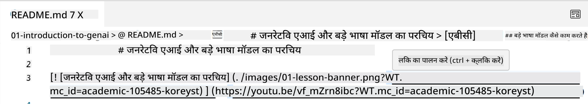
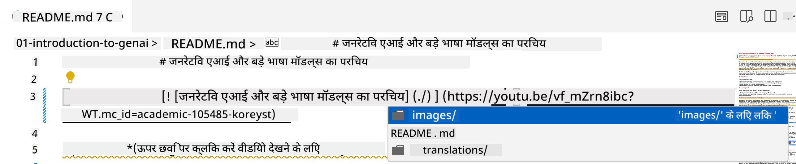
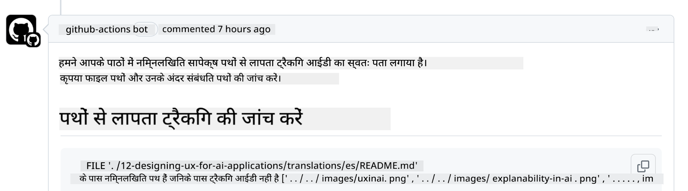
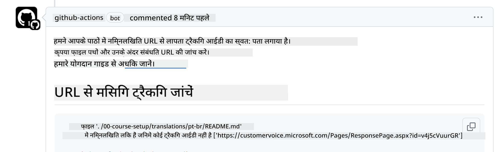
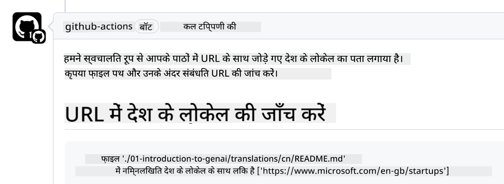

<!--
CO_OP_TRANSLATOR_METADATA:
{
  "original_hash": "57c41f2af71001a2cff9d8eb797cb843",
  "translation_date": "2025-05-19T08:43:13+00:00",
  "source_file": "CONTRIBUTING.md",
  "language_code": "hi"
}
-->
# योगदान

यह परियोजना योगदान और सुझावों का स्वागत करती है। अधिकांश योगदानों के लिए आपको एक Contributor License Agreement (CLA) से सहमत होना आवश्यक होता है, जिसमें यह घोषणा होती है कि आपके पास योगदान करने का अधिकार है, और वास्तव में आप हमें आपके योगदान का उपयोग करने का अधिकार देते हैं। विवरण के लिए, <https://cla.microsoft.com> पर जाएं।

> महत्वपूर्ण: इस रिपो में पाठ का अनुवाद करते समय कृपया सुनिश्चित करें कि आप मशीन अनुवाद का उपयोग नहीं कर रहे हैं। हम समुदाय के माध्यम से अनुवादों को सत्यापित करेंगे, इसलिए कृपया केवल उन भाषाओं में अनुवाद के लिए स्वयंसेवा करें जिनमें आप दक्ष हैं।

जब आप एक पुल अनुरोध जमा करते हैं, तो एक CLA-बॉट स्वचालित रूप से यह निर्धारित करेगा कि क्या आपको CLA प्रदान करने की आवश्यकता है और PR को उपयुक्त रूप से सजाएगा (जैसे, लेबल, टिप्पणी)। बस बॉट द्वारा दिए गए निर्देशों का पालन करें। आपको यह केवल एक बार सभी रिपॉजिटरी में करने की आवश्यकता होगी जो हमारे CLA का उपयोग कर रही हैं।

## आचार संहिता

इस परियोजना ने [Microsoft Open Source Code of Conduct](https://opensource.microsoft.com/codeofconduct/?WT.mc_id=academic-105485-koreyst) को अपनाया है। अधिक जानकारी के लिए [Code of Conduct FAQ](https://opensource.microsoft.com/codeofconduct/faq/?WT.mc_id=academic-105485-koreyst) पढ़ें या किसी भी अतिरिक्त प्रश्न या टिप्पणी के लिए [opencode@microsoft.com](mailto:opencode@microsoft.com) से संपर्क करें।

## प्रश्न या समस्या?

कृपया सामान्य समर्थन प्रश्नों के लिए GitHub मुद्दे न खोलें क्योंकि GitHub सूची का उपयोग फीचर अनुरोधों और बग रिपोर्टों के लिए किया जाना चाहिए। इस तरह हम कोड से वास्तविक मुद्दों या बग्स को अधिक आसानी से ट्रैक कर सकते हैं और सामान्य चर्चा को वास्तविक कोड से अलग रख सकते हैं।

## टाइपो, मुद्दे, बग्स और योगदान

जब भी आप Generative AI for Beginners रिपॉजिटरी में कोई परिवर्तन जमा कर रहे हों, कृपया इन अनुशंसाओं का पालन करें।

* अपने संशोधनों को करने से पहले हमेशा रिपॉजिटरी को अपने खाते में फोर्क करें
* एक पुल अनुरोध में कई परिवर्तनों को संयोजित न करें। उदाहरण के लिए, किसी भी बग फिक्स और डाक्यूमेंटेशन अपडेट को अलग-अलग PRs का उपयोग करके जमा करें
* यदि आपके पुल अनुरोध में मर्ज कॉन्फ्लिक्ट दिखते हैं, तो सुनिश्चित करें कि आपके स्थानीय मुख्य को मुख्य रिपॉजिटरी में जो कुछ है उसका मिरर अपडेट करें
* यदि आप अनुवाद जमा कर रहे हैं, तो कृपया सभी अनुवादित फ़ाइलों के लिए एक PR बनाएं क्योंकि हम सामग्री के लिए आंशिक अनुवाद स्वीकार नहीं करते हैं
* यदि आप टाइपो या डाक्यूमेंटेशन फिक्स जमा कर रहे हैं, तो आप एकल PR में संशोधन संयोजित कर सकते हैं जहां उपयुक्त हो

## लेखन के लिए सामान्य मार्गदर्शन

- सुनिश्चित करें कि आपके सभी URLs को वर्ग कोष्ठक में लपेटा गया है, उसके बाद कोई अतिरिक्त स्थान नहीं होना चाहिए ``।
- सुनिश्चित करें कि कोई भी सापेक्ष लिंक (यानी रिपॉजिटरी में अन्य फ़ाइलों और फ़ोल्डरों के लिंक) `./` से शुरू होता है जो वर्तमान कार्यशील निर्देशिका में स्थित फ़ाइल या फ़ोल्डर को संदर्भित करता है या `../` जो पैरेंट कार्यशील निर्देशिका में स्थित फ़ाइल या फ़ोल्डर को संदर्भित करता है।
- सुनिश्चित करें कि कोई भी सापेक्ष लिंक (यानी रिपॉजिटरी में अन्य फ़ाइलों और फ़ोल्डरों के लिंक) में ट्रैकिंग आईडी है (जैसे `?` या `&` फिर `wt.mc_id=` या `WT.mc_id=`) अंत में।
- सुनिश्चित करें कि निम्नलिखित डोमेन से कोई भी URL _github.com, microsoft.com, visualstudio.com, aka.ms, और azure.com_ में ट्रैकिंग आईडी है (जैसे `?` या `&` फिर `wt.mc_id=` या `WT.mc_id=`) अंत में।
- सुनिश्चित करें कि आपके लिंक में देश-विशिष्ट लोकेल नहीं है (जैसे `/en-us/` या `/en/`)।
- सुनिश्चित करें कि सभी छवियां `./images` फ़ोल्डर में संग्रहीत हैं।
- सुनिश्चित करें कि छवियों के नाम में अंग्रेजी अक्षर, संख्या और डैश का उपयोग करके वर्णनात्मक नाम हैं।

## GitHub वर्कफ़्लोज़

जब आप एक पुल अनुरोध जमा करते हैं, तो चार अलग-अलग वर्कफ़्लोज़ पिछले नियमों को मान्य करने के लिए ट्रिगर किए जाएंगे।
वर्कफ़्लो जांच पास करने के लिए यहां सूचीबद्ध निर्देशों का पालन करें।

- [टूटी हुई सापेक्ष पथ जांचें](../..)
- [पथों में ट्रैकिंग है, यह जांचें](../..)
- [URLs में ट्रैकिंग है, यह जांचें](../..)
- [URLs में लोकेल नहीं है, यह जांचें](../..)

### टूटी हुई सापेक्ष पथ जांचें

यह वर्कफ़्लो सुनिश्चित करता है कि आपकी फ़ाइलों में कोई भी सापेक्ष पथ काम कर रहा है।
यह रिपॉजिटरी GitHub पेजों पर तैनात है इसलिए आपको लिंक टाइप करते समय बहुत सावधान रहना होगा जो सब कुछ जोड़ता है ताकि किसी को गलत जगह पर न ले जाए।

सुनिश्चित करने के लिए कि आपके लिंक सही ढंग से काम कर रहे हैं, बस VS कोड का उपयोग करके जांचें।

उदाहरण के लिए, जब आप अपनी फ़ाइलों में किसी भी लिंक पर होवर करते हैं, तो आपको **ctrl + क्लिक** दबाकर लिंक का अनुसरण करने के लिए प्रेरित किया जाएगा।

यदि आप किसी लिंक पर क्लिक करते हैं और यह स्थानीय रूप से काम नहीं कर रहा है, तो निश्चित रूप से यह वर्कफ़्लो को ट्रिगर करेगा और GitHub पर काम नहीं करेगा।

इस समस्या को ठीक करने के लिए, VS कोड की मदद से लिंक टाइप करने का प्रयास करें।

जब आप `./` या `../` टाइप करते हैं, तो VS कोड आपको उपलब्ध विकल्पों से चुनने के लिए प्रेरित करेगा जो आपने टाइप किया है।

इच्छित फ़ाइल या फ़ोल्डर पर क्लिक करके पथ का अनुसरण करें और आप सुनिश्चित करेंगे कि आपका पथ टूटा नहीं है।

एक बार जब आप सही सापेक्ष पथ जोड़ लें, तो अपनी परिवर्तन सहेजें और पुश करें, वर्कफ़्लो आपके परिवर्तनों को सत्यापित करने के लिए फिर से ट्रिगर किया जाएगा।
यदि आप जांच पास करते हैं तो आप जाने के लिए तैयार हैं।

### पथों में ट्रैकिंग है, यह जांचें

यह वर्कफ़्लो सुनिश्चित करता है कि किसी भी सापेक्ष पथ में ट्रैकिंग हो।
यह रिपॉजिटरी GitHub पेजों पर तैनात है इसलिए हमें विभिन्न फ़ाइलों और फ़ोल्डरों के बीच आंदोलन को ट्रैक करने की आवश्यकता है।

सुनिश्चित करने के लिए कि आपके सापेक्ष पथों में ट्रैकिंग है, बस निम्नलिखित पाठ `?wt.mc_id=` को पथ के अंत में जांचें।
यदि यह आपके सापेक्ष पथों में जोड़ा गया है तो आप इस जांच को पास करेंगे।

यदि नहीं, तो आपको निम्नलिखित त्रुटि मिल सकती है।

इस समस्या को ठीक करने के लिए, उस फ़ाइल पथ को खोलने का प्रयास करें जिसे वर्कफ़्लो ने हाइलाइट किया है और सापेक्ष पथों के अंत में ट्रैकिंग आईडी जोड़ें।

एक बार जब आप ट्रैकिंग आईडी जोड़ लें, तो अपनी परिवर्तन सहेजें और पुश करें, वर्कफ़्लो आपके परिवर्तनों को सत्यापित करने के लिए फिर से ट्रिगर किया जाएगा।
यदि आप जांच पास करते हैं तो आप जाने के लिए तैयार हैं।

### URLs में ट्रैकिंग है, यह जांचें

यह वर्कफ़्लो सुनिश्चित करता है कि किसी भी वेब URL में ट्रैकिंग हो।
यह रिपॉजिटरी सभी के लिए उपलब्ध है इसलिए आपको यह सुनिश्चित करना होगा कि पहुंच को ट्रैक करें ताकि यह पता चले कि ट्रैफ़िक कहां से आ रहा है।

सुनिश्चित करने के लिए कि आपके URLs में ट्रैकिंग है, बस निम्नलिखित पाठ `?wt.mc_id=` को URL के अंत में जांचें।
यदि यह आपके URLs में जोड़ा गया है तो आप इस जांच को पास करेंगे।

यदि नहीं, तो आपको निम्नलिखित त्रुटि मिल सकती है।

इस समस्या को ठीक करने के लिए, उस फ़ाइल पथ को खोलने का प्रयास करें जिसे वर्कफ़्लो ने हाइलाइट किया है और URLs के अंत में ट्रैकिंग आईडी जोड़ें।

एक बार जब आप ट्रैकिंग आईडी जोड़ लें, तो अपनी परिवर्तन सहेजें और पुश करें, वर्कफ़्लो आपके परिवर्तनों को सत्यापित करने के लिए फिर से ट्रिगर किया जाएगा।
यदि आप जांच पास करते हैं तो आप जाने के लिए तैयार हैं।

### URLs में लोकेल नहीं है, यह जांचें

यह वर्कफ़्लो सुनिश्चित करता है कि किसी भी वेब URL में देश-विशिष्ट लोकेल नहीं है।
यह रिपॉजिटरी दुनिया भर के सभी लोगों के लिए उपलब्ध है इसलिए आपको URLs में अपने देश के लोकेल को शामिल नहीं करने का ध्यान रखना होगा।

सुनिश्चित करने के लिए कि आपके URLs में देश लोकेल नहीं है, बस निम्नलिखित पाठ `/en-us/` या `/en/` या URL में कहीं भी कोई अन्य भाषा लोकेल जांचें।
यदि यह आपके URLs में मौजूद नहीं है तो आप इस जांच को पास करेंगे।

यदि नहीं, तो आपको निम्नलिखित त्रुटि मिल सकती है।

इस समस्या को ठीक करने के लिए, उस फ़ाइल पथ को खोलने का प्रयास करें जिसे वर्कफ़्लो ने हाइलाइट किया है और URLs से देश लोकेल को हटा दें।

एक बार जब आप देश लोकेल को हटा दें, तो अपनी परिवर्तन सहेजें और पुश करें, वर्कफ़्लो आपके परिवर्तनों को सत्यापित करने के लिए फिर से ट्रिगर किया जाएगा।
यदि आप जांच पास करते हैं तो आप जाने के लिए तैयार हैं।

बधाई हो! हम आपके योगदान के बारे में जल्द से जल्द प्रतिक्रिया के साथ वापस आएंगे।

**अस्वीकरण**:  
यह दस्तावेज़ AI अनुवाद सेवा [Co-op Translator](https://github.com/Azure/co-op-translator) का उपयोग करके अनुवादित किया गया है। जबकि हम सटीकता के लिए प्रयास करते हैं, कृपया ध्यान दें कि स्वचालित अनुवाद में त्रुटियाँ या अशुद्धियाँ हो सकती हैं। अपनी मूल भाषा में मूल दस्तावेज़ को प्रामाणिक स्रोत माना जाना चाहिए। महत्वपूर्ण जानकारी के लिए, पेशेवर मानव अनुवाद की सिफारिश की जाती है। इस अनुवाद के उपयोग से उत्पन्न किसी भी गलतफहमी या गलत व्याख्या के लिए हम उत्तरदायी नहीं हैं।