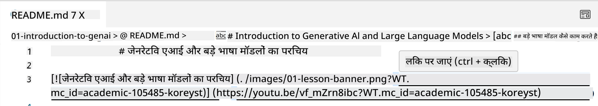
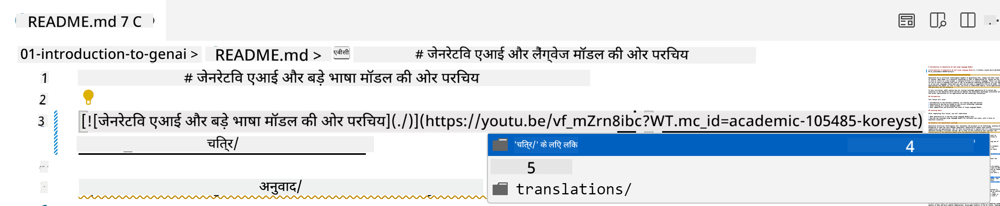
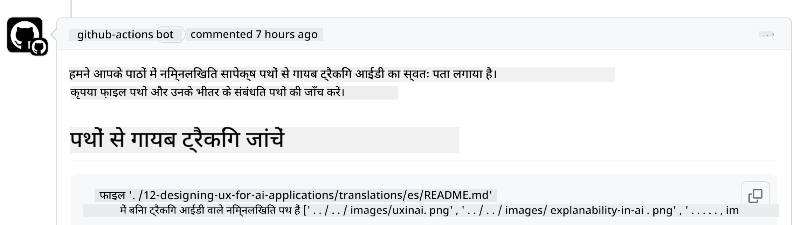
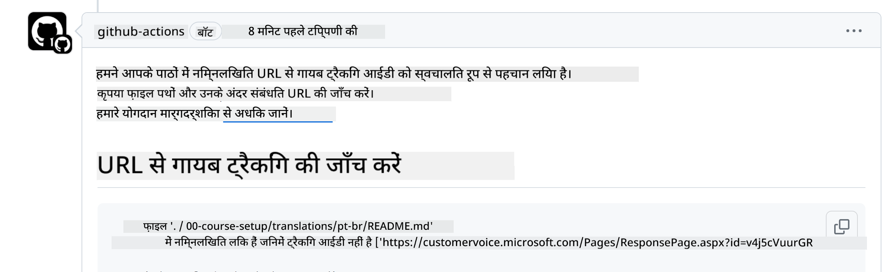
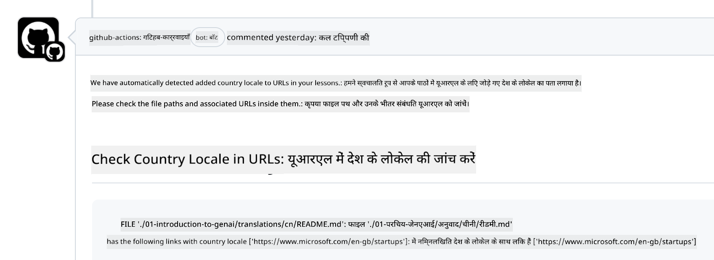

<!--
CO_OP_TRANSLATOR_METADATA:
{
  "original_hash": "57c41f2af71001a2cff9d8eb797cb843",
  "translation_date": "2025-06-25T07:05:06+00:00",
  "source_file": "CONTRIBUTING.md",
  "language_code": "hi"
}
-->
# योगदान

यह परियोजना योगदान और सुझावों का स्वागत करती है। अधिकांश योगदानों के लिए आपको एक योगदानकर्ता लाइसेंस समझौते (CLA) से सहमत होना आवश्यक है, जो यह घोषित करता है कि आपके पास हमें आपके योगदान का उपयोग करने का अधिकार है। विवरण के लिए, <https://cla.microsoft.com> पर जाएं।

> महत्वपूर्ण: जब आप इस रिपॉजिटरी में टेक्स्ट का अनुवाद कर रहे हैं, तो कृपया सुनिश्चित करें कि आप मशीन अनुवाद का उपयोग नहीं करते हैं। हम अनुवादों को समुदाय के माध्यम से सत्यापित करेंगे, इसलिए कृपया केवल उन्हीं भाषाओं में अनुवाद के लिए स्वयंसेवा करें जिनमें आप निपुण हैं।

जब आप एक पुल अनुरोध सबमिट करते हैं, तो एक CLA-बॉट स्वचालित रूप से यह निर्धारित करेगा कि क्या आपको एक CLA प्रदान करने की आवश्यकता है और PR को उपयुक्त रूप से सजाएगा (जैसे, लेबल, टिप्पणी)। बस बॉट द्वारा दिए गए निर्देशों का पालन करें। आपको यह हमारे CLA का उपयोग करने वाले सभी रिपॉजिटरी में केवल एक बार करना होगा।

## आचार संहिता

इस परियोजना ने [Microsoft ओपन सोर्स आचार संहिता](https://opensource.microsoft.com/codeofconduct/?WT.mc_id=academic-105485-koreyst) को अपनाया है। अधिक जानकारी के लिए [आचार संहिता FAQ](https://opensource.microsoft.com/codeofconduct/faq/?WT.mc_id=academic-105485-koreyst) पढ़ें या [opencode@microsoft.com](mailto:opencode@microsoft.com) से किसी भी अतिरिक्त प्रश्न या टिप्पणियों के साथ संपर्क करें।

## प्रश्न या समस्या?

कृपया सामान्य समर्थन प्रश्नों के लिए GitHub मुद्दे न खोलें क्योंकि GitHub सूची का उपयोग फीचर अनुरोधों और बग रिपोर्टों के लिए किया जाना चाहिए। इस तरह हम कोड से वास्तविक मुद्दों या बग्स को अधिक आसानी से ट्रैक कर सकते हैं और सामान्य चर्चा को वास्तविक कोड से अलग रख सकते हैं।

## टाइपोस, मुद्दे, बग्स और योगदान

जब भी आप "जेनरेटिव एआई फॉर बिगिनर्स" रिपॉजिटरी में कोई बदलाव सबमिट कर रहे हों, कृपया इन सिफारिशों का पालन करें।

* अपने संशोधनों को करने से पहले हमेशा रिपॉजिटरी को अपने खाते में फोर्क करें
* एक पुल अनुरोध में कई बदलावों को संयोजित न करें। उदाहरण के लिए, किसी भी बग फिक्स और दस्तावेज़ अपडेट को अलग-अलग PRs का उपयोग करके सबमिट करें
* यदि आपका पुल अनुरोध मर्ज संघर्ष दिखाता है, तो सुनिश्चित करें कि आपके स्थानीय मुख्य को मुख्य रिपॉजिटरी में क्या है, का मिरर अपडेट किया गया है, इससे पहले कि आप अपने संशोधन करें
* यदि आप एक अनुवाद सबमिट कर रहे हैं, तो कृपया सभी अनुवादित फ़ाइलों के लिए एक PR बनाएं क्योंकि हम सामग्री के लिए आंशिक अनुवाद स्वीकार नहीं करते हैं
* यदि आप कोई टाइपो या दस्तावेज़ फिक्स सबमिट कर रहे हैं, तो आप उपयुक्त होने पर एकल PR में संशोधनों को संयोजित कर सकते हैं

## लेखन के लिए सामान्य मार्गदर्शन

- सुनिश्चित करें कि आपके सभी URLs को स्क्वायर ब्रैकेट में लपेटा गया है, उसके बाद कोई अतिरिक्त स्थान उनके चारों ओर या उनके अंदर नहीं है ``।
- सुनिश्चित करें कि कोई भी सापेक्ष लिंक (जैसे कि रिपॉजिटरी में अन्य फ़ाइलों और फ़ोल्डरों के लिंक) `./` से शुरू होता है जो वर्तमान कार्य निर्देशिका में स्थित फ़ाइल या फ़ोल्डर को संदर्भित करता है या `../` जो एक फ़ाइल या फ़ोल्डर को संदर्भित करता है जो एक पैरेंट कार्य निर्देशिका में स्थित है।
- सुनिश्चित करें कि कोई भी सापेक्ष लिंक (जैसे कि रिपॉजिटरी में अन्य फ़ाइलों और फ़ोल्डरों के लिंक) में एक ट्रैकिंग आईडी (जैसे `?` या `&` फिर `wt.mc_id=` या `WT.mc_id=`) उसके अंत में हो।
- सुनिश्चित करें कि निम्नलिखित डोमेन _github.com, microsoft.com, visualstudio.com, aka.ms, और azure.com_ से कोई भी URL में एक ट्रैकिंग आईडी (जैसे `?` या `&` फिर `wt.mc_id=` या `WT.mc_id=`) उसके अंत में हो।
- सुनिश्चित करें कि आपके लिंक में देश विशेष लोकेल नहीं है (जैसे `/en-us/` या `/en/`)।
- सुनिश्चित करें कि सभी छवियां `./images` फ़ोल्डर में संग्रहीत हैं।
- सुनिश्चित करें कि छवियों के नाम वर्णनात्मक हैं जो अंग्रेजी वर्ण, संख्याएँ, और डैश का उपयोग करते हुए आपके छवि के नाम में हैं।

## GitHub वर्कफ्लोज़

जब आप एक पुल अनुरोध सबमिट करते हैं, तो चार अलग-अलग वर्कफ्लो पूर्व नियमों को मान्य करने के लिए सक्रिय होंगे। वर्कफ्लो चेक पास करने के लिए यहां सूचीबद्ध निर्देशों का पालन करें।

- [टूटी हुई सापेक्ष पथ की जाँच करें](../..)
- [पथों में ट्रैकिंग है की जाँच करें](../..)
- [URLs में ट्रैकिंग है की जाँच करें](../..)
- [URLs में लोकेल नहीं है की जाँच करें](../..)

### टूटी हुई सापेक्ष पथ की जाँच करें

यह वर्कफ्लो सुनिश्चित करता है कि आपकी फाइलों में कोई भी सापेक्ष पथ काम कर रहा है। यह रिपॉजिटरी GitHub पेजों पर तैनात है, इसलिए आपको लिंक टाइप करते समय बहुत सावधान रहना चाहिए जो सब कुछ जोड़ते हैं ताकि किसी को गलत स्थान पर निर्देशित न किया जा सके।

सुनिश्चित करने के लिए कि आपके लिंक ठीक से काम कर रहे हैं, बस VS कोड का उपयोग करके जांचें।

उदाहरण के लिए, जब आप अपनी फाइलों में किसी भी लिंक पर होवर करते हैं, तो आपको **ctrl + क्लिक** दबाकर लिंक का पालन करने के लिए प्रेरित किया जाएगा।

यदि आप किसी लिंक पर क्लिक करते हैं और यह स्थानीय रूप से काम नहीं कर रहा है, तो निश्चित रूप से यह वर्कफ्लो को ट्रिगर करेगा और GitHub पर काम नहीं करेगा।

इस समस्या को ठीक करने के लिए, VS कोड की मदद से लिंक टाइप करने का प्रयास करें।

जब आप `./` या `../` टाइप करते हैं, तो VS कोड आपको उपलब्ध विकल्पों में से चुनने के लिए प्रेरित करेगा जो आपने टाइप किया है।

वांछित फ़ाइल या फ़ोल्डर पर क्लिक करके पथ का पालन करें और आप सुनिश्चित करेंगे कि आपका पथ टूटा नहीं है।

एक बार जब आप सही सापेक्ष पथ जोड़ लें, तो अपने परिवर्तनों को सहेजें और पुश करें, वर्कफ्लो आपके परिवर्तनों को सत्यापित करने के लिए फिर से ट्रिगर होगा। यदि आप चेक पास करते हैं तो आप जाने के लिए तैयार हैं।

### पथों में ट्रैकिंग है की जाँच करें

यह वर्कफ्लो सुनिश्चित करता है कि किसी भी सापेक्ष पथ में ट्रैकिंग है। यह रिपॉजिटरी GitHub पेजों पर तैनात है, इसलिए हमें विभिन्न फाइलों और फ़ोल्डरों के बीच आंदोलन को ट्रैक करने की आवश्यकता है।

सुनिश्चित करने के लिए कि आपके सापेक्ष पथों में ट्रैकिंग है, बस पथ के अंत में निम्नलिखित पाठ `?wt.mc_id=` की जाँच करें। यदि यह आपके सापेक्ष पथों में जोड़ा गया है तो आप इस चेक को पास कर लेंगे।

यदि नहीं, तो आपको निम्नलिखित त्रुटि मिल सकती है।

इस समस्या को ठीक करने के लिए, उस फ़ाइल पथ को खोलने का प्रयास करें जिसे वर्कफ्लो ने हाइलाइट किया और सापेक्ष पथों के अंत में ट्रैकिंग आईडी जोड़ें।

एक बार जब आप ट्रैकिंग आईडी जोड़ लें, तो अपने परिवर्तनों को सहेजें और पुश करें, वर्कफ्लो आपके परिवर्तनों को सत्यापित करने के लिए फिर से ट्रिगर होगा। यदि आप चेक पास करते हैं तो आप जाने के लिए तैयार हैं।

### URLs में ट्रैकिंग है की जाँच करें

यह वर्कफ्लो सुनिश्चित करता है कि किसी भी वेब URL में ट्रैकिंग है। यह रिपॉजिटरी सभी के लिए उपलब्ध है, इसलिए आपको यह सुनिश्चित करना होगा कि ट्रैफिक कहाँ से आ रहा है, इसका पता लगाने के लिए एक्सेस को ट्रैक करें।

सुनिश्चित करने के लिए कि आपके URLs में ट्रैकिंग है, बस URL के अंत में निम्नलिखित पाठ `?wt.mc_id=` की जाँच करें। यदि यह आपके URLs में जोड़ा गया है तो आप इस चेक को पास कर लेंगे।

यदि नहीं, तो आपको निम्नलिखित त्रुटि मिल सकती है।

इस समस्या को ठीक करने के लिए, उस फ़ाइल पथ को खोलने का प्रयास करें जिसे वर्कफ्लो ने हाइलाइट किया और URLs के अंत में ट्रैकिंग आईडी जोड़ें।

एक बार जब आप ट्रैकिंग आईडी जोड़ लें, तो अपने परिवर्तनों को सहेजें और पुश करें, वर्कफ्लो आपके परिवर्तनों को सत्यापित करने के लिए फिर से ट्रिगर होगा। यदि आप चेक पास करते हैं तो आप जाने के लिए तैयार हैं।

### URLs में लोकेल नहीं है की जाँच करें

यह वर्कफ्लो सुनिश्चित करता है कि किसी भी वेब URL में देश विशेष लोकेल नहीं है। यह रिपॉजिटरी दुनिया भर में सभी के लिए उपलब्ध है, इसलिए आपको यह सुनिश्चित करना होगा कि URLs में अपने देश का लोकेल शामिल न करें।

सुनिश्चित करने के लिए कि आपके URLs में देश का लोकेल नहीं है, बस URL में कहीं भी निम्नलिखित पाठ `/en-us/` या `/en/` या किसी अन्य भाषा लोकेल की जाँच करें। यदि यह आपके URLs में नहीं है तो आप इस चेक को पास कर लेंगे।

यदि नहीं, तो आपको निम्नलिखित त्रुटि मिल सकती है।

इस समस्या को ठीक करने के लिए, उस फ़ाइल पथ को खोलने का प्रयास करें जिसे वर्कफ्लो ने हाइलाइट किया और URLs से देश लोकेल को हटा दें।

एक बार जब आप देश लोकेल को हटा दें, तो अपने परिवर्तनों को सहेजें और पुश करें, वर्कफ्लो आपके परिवर्तनों को सत्यापित करने के लिए फिर से ट्रिगर होगा। यदि आप चेक पास करते हैं तो आप जाने के लिए तैयार हैं।

बधाई हो! हम आपकी योगदान के बारे में जल्द से जल्द प्रतिक्रिया के साथ वापस आएंगे।

**अस्वीकरण**:  
यह दस्तावेज़ AI अनुवाद सेवा [Co-op Translator](https://github.com/Azure/co-op-translator) का उपयोग करके अनुवादित किया गया है। जबकि हम सटीकता के लिए प्रयास करते हैं, कृपया ध्यान दें कि स्वचालित अनुवाद में त्रुटियाँ या अशुद्धियाँ हो सकती हैं। मूल भाषा में मूल दस्तावेज़ को प्रामाणिक स्रोत माना जाना चाहिए। महत्वपूर्ण जानकारी के लिए, पेशेवर मानव अनुवाद की सिफारिश की जाती है। इस अनुवाद के उपयोग से उत्पन्न किसी भी गलतफहमी या गलत व्याख्या के लिए हम उत्तरदायी नहीं हैं।