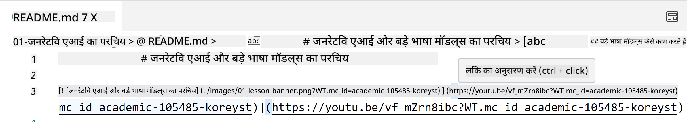
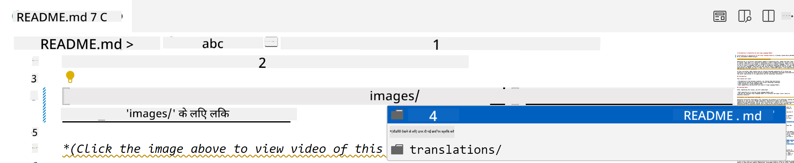
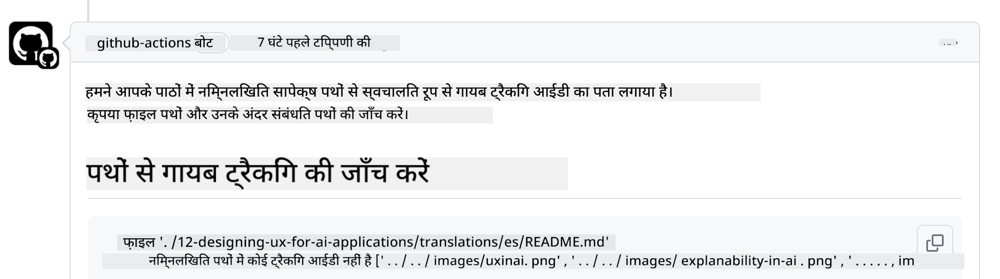
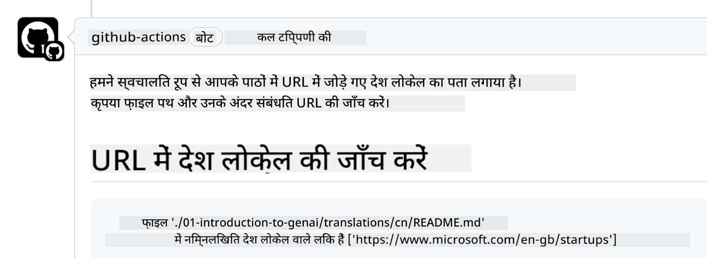

<!--
CO_OP_TRANSLATOR_METADATA:
{
  "original_hash": "57c41f2af71001a2cff9d8eb797cb843",
  "translation_date": "2025-07-09T05:51:23+00:00",
  "source_file": "CONTRIBUTING.md",
  "language_code": "hi"
}
-->
# योगदान

यह प्रोजेक्ट योगदान और सुझावों का स्वागत करता है। अधिकांश योगदानों के लिए आपको एक Contributor License Agreement (CLA) से सहमत होना होगा, जिसमें आप यह घोषणा करते हैं कि आपके पास अपने योगदान के उपयोग के अधिकार हैं और आप हमें उन अधिकारों को प्रदान करते हैं। विवरण के लिए, कृपया <https://cla.microsoft.com> देखें।

> महत्वपूर्ण: इस रिपॉजिटरी में टेक्स्ट का अनुवाद करते समय कृपया मशीन अनुवाद का उपयोग न करें। हम अनुवादों की जांच समुदाय के माध्यम से करेंगे, इसलिए केवल उन भाषाओं में अनुवाद के लिए स्वयंसेवा करें जिनमें आप प्रवीण हैं।

जब आप एक पुल रिक्वेस्ट सबमिट करते हैं, तो CLA-बॉट स्वचालित रूप से यह निर्धारित करेगा कि आपको CLA प्रदान करने की आवश्यकता है या नहीं और PR को उपयुक्त रूप से चिह्नित करेगा (जैसे, लेबल, टिप्पणी)। बस बॉट द्वारा दिए गए निर्देशों का पालन करें। आपको यह केवल एक बार सभी रिपॉजिटरीज़ में करना होगा जो हमारे CLA का उपयोग करती हैं।

## आचार संहिता

इस प्रोजेक्ट ने [Microsoft Open Source Code of Conduct](https://opensource.microsoft.com/codeofconduct/?WT.mc_id=academic-105485-koreyst) को अपनाया है।  
अधिक जानकारी के लिए [Code of Conduct FAQ](https://opensource.microsoft.com/codeofconduct/faq/?WT.mc_id=academic-105485-koreyst) पढ़ें या किसी भी अतिरिक्त प्रश्न या टिप्पणी के लिए [opencode@microsoft.com](mailto:opencode@microsoft.com) से संपर्क करें।

## प्रश्न या समस्या?

कृपया सामान्य सहायता प्रश्नों के लिए GitHub इश्यू न खोलें क्योंकि GitHub सूची का उपयोग फीचर अनुरोधों और बग रिपोर्टों के लिए किया जाना चाहिए। इस तरह हम कोड से वास्तविक मुद्दों या बग्स को आसानी से ट्रैक कर सकते हैं और सामान्य चर्चा को वास्तविक कोड से अलग रख सकते हैं।

## टाइपो, समस्याएं, बग और योगदान

जब भी आप Generative AI for Beginners रिपॉजिटरी में कोई परिवर्तन सबमिट करें, कृपया निम्नलिखित सुझावों का पालन करें।

* अपने संशोधन करने से पहले हमेशा रिपॉजिटरी को अपने अकाउंट में फोर्क करें  
* एक पुल रिक्वेस्ट में कई बदलाव न मिलाएं। उदाहरण के लिए, किसी भी बग फिक्स और दस्तावेज़ अपडेट को अलग-अलग PR के रूप में सबमिट करें  
* यदि आपके पुल रिक्वेस्ट में मर्ज कॉन्फ्लिक्ट दिखता है, तो सुनिश्चित करें कि आपने अपने लोकल main को मुख्य रिपॉजिटरी के main का प्रतिबिंब बना लिया है, उसके बाद ही संशोधन करें  
* यदि आप अनुवाद सबमिट कर रहे हैं, तो कृपया सभी अनुवादित फाइलों के लिए एक ही PR बनाएं क्योंकि हम आंशिक अनुवाद स्वीकार नहीं करते  
* यदि आप टाइपो या दस्तावेज़ सुधार सबमिट कर रहे हैं, तो उपयुक्त होने पर आप एक ही PR में संशोधन मिला सकते हैं  

## लेखन के लिए सामान्य मार्गदर्शन

- सुनिश्चित करें कि आपकी सभी URLs वर्ग कोष्ठकों में लिपटी हों और उसके बाद बिना अतिरिक्त स्पेस के गोल कोष्ठक में हों ``।  
- सुनिश्चित करें कि कोई भी सापेक्ष लिंक (जैसे रिपॉजिटरी में अन्य फाइलों और फोल्डरों के लिंक) `./` से शुरू होता है जो वर्तमान कार्य निर्देशिका में फाइल या फोल्डर को संदर्भित करता है या `../` से शुरू होता है जो पैरेंट कार्य निर्देशिका में फाइल या फोल्डर को संदर्भित करता है।  
- सुनिश्चित करें कि कोई भी सापेक्ष लिंक के अंत में ट्रैकिंग ID हो (जैसे `?` या `&` के बाद `wt.mc_id=` या `WT.mc_id=`)।  
- सुनिश्चित करें कि निम्न डोमेन से कोई भी URL _github.com, microsoft.com, visualstudio.com, aka.ms, और azure.com_ के अंत में ट्रैकिंग ID हो।  
- सुनिश्चित करें कि आपकी लिंक में देश-विशिष्ट लोकल (जैसे `/en-us/` या `/en/`) न हो।  
- सुनिश्चित करें कि सभी इमेजेज़ `./images` फोल्डर में संग्रहित हों।  
- सुनिश्चित करें कि इमेजेज़ के नाम अंग्रेज़ी अक्षरों, संख्याओं और डैश का उपयोग करते हुए वर्णनात्मक हों।  

## GitHub वर्कफ़्लोज़

जब आप एक पुल रिक्वेस्ट सबमिट करते हैं, तो चार अलग-अलग वर्कफ़्लोज़ सक्रिय होंगे जो पिछले नियमों की पुष्टि करेंगे।  
सिर्फ़ यहां सूचीबद्ध निर्देशों का पालन करें ताकि वर्कफ़्लो चेक पास हो जाएं।

- [टूटे हुए सापेक्ष पथ जांचें](../..)  
- [पथों में ट्रैकिंग हो यह जांचें](../..)  
- [URLs में ट्रैकिंग हो यह जांचें](../..)  
- [URLs में लोकल न हो यह जांचें](../..)  

### टूटे हुए सापेक्ष पथ जांचें

यह वर्कफ़्लो सुनिश्चित करता है कि आपकी फाइलों में कोई भी सापेक्ष पथ सही काम कर रहा हो।  
यह रिपॉजिटरी GitHub पेजेज़ पर तैनात है, इसलिए आपको लिंक टाइप करते समय बहुत सावधान रहना होगा ताकि कोई भी गलत जगह न पहुंच जाए।

सुनिश्चित करने के लिए कि आपके लिंक सही काम कर रहे हैं, बस VS कोड का उपयोग करें।

उदाहरण के लिए, जब आप अपनी फाइलों में किसी लिंक पर होवर करेंगे, तो आपको **ctrl + click** दबाकर लिंक को फॉलो करने का विकल्प मिलेगा।

यदि आप किसी लिंक पर क्लिक करते हैं और वह लोकल रूप से काम नहीं करता, तो निश्चित रूप से यह वर्कफ़्लो को ट्रिगर करेगा और GitHub पर भी काम नहीं करेगा।

इस समस्या को ठीक करने के लिए, VS कोड की मदद से लिंक टाइप करने की कोशिश करें।

जब आप `./` या `../` टाइप करते हैं, तो VS कोड आपको उपलब्ध विकल्पों में से चुनने का सुझाव देगा।

अपनी पसंदीदा फाइल या फोल्डर पर क्लिक करके पथ का पालन करें और आप सुनिश्चित हो जाएंगे कि आपका पथ टूटा हुआ नहीं है।

सही सापेक्ष पथ जोड़ने के बाद, अपने बदलाव सहेजें और पुश करें, वर्कफ़्लो फिर से सक्रिय होगा और आपके बदलावों की पुष्टि करेगा।  
यदि आप चेक पास कर लेते हैं, तो आप आगे बढ़ सकते हैं।

### पथों में ट्रैकिंग हो यह जांचें

यह वर्कफ़्लो सुनिश्चित करता है कि किसी भी सापेक्ष पथ में ट्रैकिंग हो।  
यह रिपॉजिटरी GitHub पेजेज़ पर तैनात है, इसलिए हमें विभिन्न फाइलों और फोल्डरों के बीच मूवमेंट को ट्रैक करना होता है।

सुनिश्चित करने के लिए कि आपके सापेक्ष पथों में ट्रैकिंग हो, बस पथ के अंत में `?wt.mc_id=` टेक्स्ट की जांच करें।  
यदि यह आपके सापेक्ष पथों के अंत में जुड़ा हुआ है, तो आप यह चेक पास कर जाएंगे।

यदि नहीं, तो आपको निम्न त्रुटि मिल सकती है।

इस समस्या को ठीक करने के लिए, उस फाइल पथ को खोलें जिसे वर्कफ़्लो ने हाइलाइट किया है और सापेक्ष पथों के अंत में ट्रैकिंग ID जोड़ें।

ट्रैकिंग ID जोड़ने के बाद, सहेजें और पुश करें, वर्कफ़्लो फिर से सक्रिय होगा और आपके बदलावों की पुष्टि करेगा।  
यदि आप चेक पास कर लेते हैं, तो आप आगे बढ़ सकते हैं।

### URLs में ट्रैकिंग हो यह जांचें

यह वर्कफ़्लो सुनिश्चित करता है कि किसी भी वेब URL में ट्रैकिंग हो।  
यह रिपॉजिटरी सभी के लिए उपलब्ध है, इसलिए आपको ट्रैफिक के स्रोत को जानने के लिए एक्सेस को ट्रैक करना होगा।

सुनिश्चित करने के लिए कि आपके URLs में ट्रैकिंग हो, बस URL के अंत में `?wt.mc_id=` टेक्स्ट की जांच करें।  
यदि यह आपके URLs के अंत में जुड़ा हुआ है, तो आप यह चेक पास कर जाएंगे।

यदि नहीं, तो आपको निम्न त्रुटि मिल सकती है।

इस समस्या को ठीक करने के लिए, उस फाइल पथ को खोलें जिसे वर्कफ़्लो ने हाइलाइट किया है और URLs के अंत में ट्रैकिंग ID जोड़ें।

ट्रैकिंग ID जोड़ने के बाद, सहेजें और पुश करें, वर्कफ़्लो फिर से सक्रिय होगा और आपके बदलावों की पुष्टि करेगा।  
यदि आप चेक पास कर लेते हैं, तो आप आगे बढ़ सकते हैं।

### URLs में लोकल न हो यह जांचें

यह वर्कफ़्लो सुनिश्चित करता है कि किसी भी वेब URL में देश-विशिष्ट लोकल न हो।  
यह रिपॉजिटरी दुनिया भर के सभी के लिए उपलब्ध है, इसलिए आपको URLs में अपने देश का लोकल शामिल नहीं करना चाहिए।

सुनिश्चित करने के लिए कि आपके URLs में देश लोकल न हो, बस URL में कहीं भी `/en-us/` या `/en/` या कोई अन्य भाषा लोकल की जांच करें।  
यदि यह आपके URLs में मौजूद नहीं है, तो आप यह चेक पास कर जाएंगे।

यदि नहीं, तो आपको निम्न त्रुटि मिल सकती है।

इस समस्या को ठीक करने के लिए, उस फाइल पथ को खोलें जिसे वर्कफ़्लो ने हाइलाइट किया है और URLs से देश लोकल हटा दें।

देश लोकल हटाने के बाद, सहेजें और पुश करें, वर्कफ़्लो फिर से सक्रिय होगा और आपके बदलावों की पुष्टि करेगा।  
यदि आप चेक पास कर लेते हैं, तो आप आगे बढ़ सकते हैं।

बधाई हो! हम आपकी योगदान के बारे में जल्द ही प्रतिक्रिया के साथ आपसे संपर्क करेंगे।

**अस्वीकरण**:  
यह दस्तावेज़ AI अनुवाद सेवा [Co-op Translator](https://github.com/Azure/co-op-translator) का उपयोग करके अनुवादित किया गया है। जबकि हम सटीकता के लिए प्रयासरत हैं, कृपया ध्यान दें कि स्वचालित अनुवादों में त्रुटियाँ या अशुद्धियाँ हो सकती हैं। मूल दस्तावेज़ अपनी मूल भाषा में ही अधिकारिक स्रोत माना जाना चाहिए। महत्वपूर्ण जानकारी के लिए, पेशेवर मानव अनुवाद की सलाह दी जाती है। इस अनुवाद के उपयोग से उत्पन्न किसी भी गलतफहमी या गलत व्याख्या के लिए हम जिम्मेदार नहीं हैं।