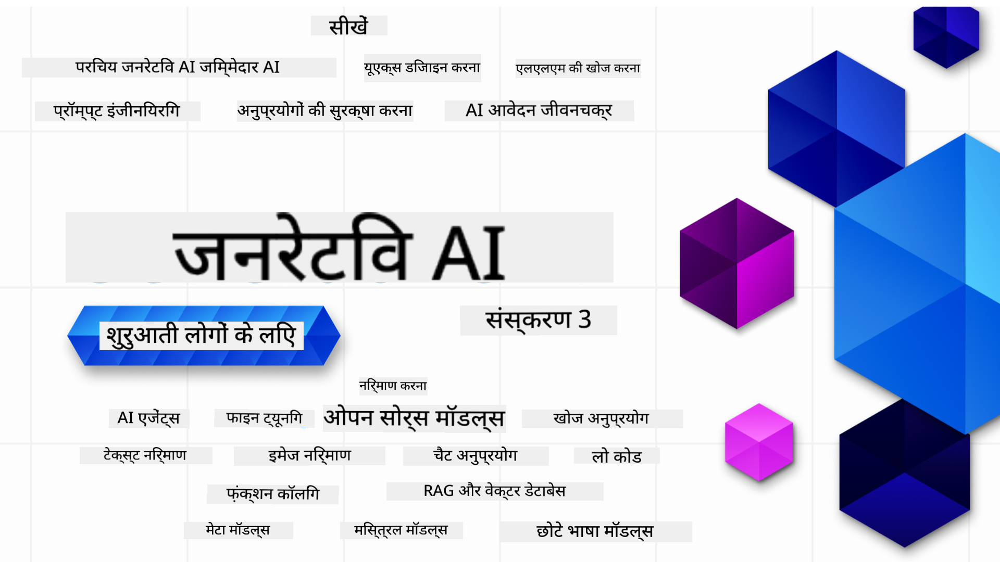

<!--
CO_OP_TRANSLATOR_METADATA:
{
  "original_hash": "c2ee25895ebbfa1a52868bb6eab686fc",
  "translation_date": "2025-05-19T10:58:22+00:00",
  "source_file": "README.md",
  "language_code": "hi"
}
-->

### जनरेटिव AI एप्लिकेशन बनाना शुरू करने के लिए आपको जानने की जरूरत है सब कुछ, 21 पाठ

### 🌐 बहु-भाषा समर्थन

#### GitHub Action के माध्यम से समर्थित (स्वचालित और हमेशा अपडेटेड)
[फ्रेंच](../fr/README.md) | [स्पेनिश](../es/README.md) | [जर्मन](../de/README.md) | [रूसी](../ru/README.md) | [अरबी](../ar/README.md) | [फारसी (फारसी)](../fa/README.md) | [उर्दू](../ur/README.md) | [चीनी (सरलीकृत)](../zh/README.md) | [चीनी (पारंपरिक, मकाऊ)](../mo/README.md) | [चीनी (पारंपरिक, हांगकांग)](../hk/README.md) | [चीनी (पारंपरिक, ताइवान)](../tw/README.md) | [जापानी](../ja/README.md) | [कोरियाई](../ko/README.md) | [हिंदी](./README.md) | [बंगाली](../bn/README.md) | [मराठी](../mr/README.md) | [नेपाली](../ne/README.md) | [पंजाबी (गुरमुखी)](../pa/README.md) | [पुर्तगाली (पुर्तगाल)](../pt/README.md) | [पुर्तगाली (ब्राज़ील)](../br/README.md) | [इतालवी](../it/README.md) | [पोलिश](../pl/README.md) | [तुर्की](../tr/README.md) | [यूनानी](../el/README.md) | [थाई](../th/README.md) | [स्वीडिश](../sv/README.md) | [डेनिश](../da/README.md) | [नॉर्वेजियन](../no/README.md) | [फिनिश](../fi/README.md) | [डच](../nl/README.md) | [हिब्रू](../he/README.md) | [वियतनामी](../vi/README.md) | [इंडोनेशियाई](../id/README.md) | [मलय](../ms/README.md) | [टैगालॉग (फिलिपिनो)](../tl/README.md) | [स्वाहिली](../sw/README.md) | [हंगेरियन](../hu/README.md) | [चेक](../cs/README.md) | [स्लोवाक](../sk/README.md) | [रोमानियाई](../ro/README.md) | [बल्गेरियाई](../bg/README.md) | [सर्बियाई (सिरिलिक)](../sr/README.md) | [क्रोएशियाई](../hr/README.md) | [स्लोवेनियाई](../sl/README.md)
# जनरेटिव एआई के लिए शुरुआती (संस्करण 3) - एक कोर्स

Microsoft Cloud Advocates द्वारा हमारे 21-पाठ के व्यापक कोर्स के साथ जनरेटिव एआई एप्लिकेशन बनाने की मूल बातें सीखें।

## 🌱 शुरुआत करें

इस कोर्स में 21 पाठ हैं। प्रत्येक पाठ अपने विषय को कवर करता है, इसलिए आप जहां चाहें शुरू करें!

पाठ को "सीखें" लेबल दिया गया है जो एक जनरेटिव एआई अवधारणा की व्याख्या करता है या "निर्माण" पाठ जो एक अवधारणा और कोड उदाहरण की व्याख्या करता है, जब संभव हो तो **Python** और **TypeScript** में।

.NET डेवलपर्स के लिए [जनरेटिव एआई के लिए शुरुआती (.NET संस्करण)](https://github.com/microsoft/Generative-AI-for-beginners-dotnet?WT.mc_id=academic-105485-koreyst) देखें!

प्रत्येक पाठ में अतिरिक्त सीखने के उपकरण के साथ एक "सीखते रहें" अनुभाग भी शामिल है।

## आपको क्या चाहिए
### इस कोर्स के कोड को चलाने के लिए, आप इनमें से किसी का उपयोग कर सकते हैं: 
- [Azure OpenAI Service](https://aka.ms/genai-beginners/azure-open-ai?WT.mc_id=academic-105485-koreyst) - **पाठ:** "aoai-assignment"
- [GitHub Marketplace Model Catalog](https://aka.ms/genai-beginners/gh-models?WT.mc_id=academic-105485-koreyst) - **पाठ:** "githubmodels"
- [OpenAI API](https://aka.ms/genai-beginners/open-ai?WT.mc_id=academic-105485-koreyst) - **पाठ:** "oai-assignment"

- Python या TypeScript का बुनियादी ज्ञान सहायक है - \*पूरी तरह से शुरुआती लोगों के लिए इन [Python](https://aka.ms/genai-beginners/python?WT.mc_id=academic-105485-koreyst) और [TypeScript](https://aka.ms/genai-beginners/typescript?WT.mc_id=academic-105485-koreyst) पाठ्यक्रमों की जांच करें
- इस पूरे रिपॉजिटरी को अपने GitHub खाते में [फोर्क करने के लिए](https://aka.ms/genai-beginners/github?WT.mc_id=academic-105485-koreyst) एक GitHub खाता

हमने आपका विकास वातावरण सेट करने में मदद करने के लिए **[कोर्स सेटअप](./00-course-setup/README.md?WT.mc_id=academic-105485-koreyst)** पाठ बनाया है।

इस रिपॉजिटरी को बाद में आसानी से खोजने के लिए [स्टार (🌟) करना न भूलें](https://docs.github.com/en/get-started/exploring-projects-on-github/saving-repositories-with-stars?WT.mc_id=academic-105485-koreyst)।

## 🧠 तैनाती के लिए तैयार?

यदि आप अधिक उन्नत कोड नमूनों की तलाश कर रहे हैं, तो **Python** और **TypeScript** में हमारे [जनरेटिव एआई कोड नमूनों का संग्रह](https://aka.ms/genai-beg-code?WT.mc_id=academic-105485-koreyst) देखें।

## 🗣️ अन्य शिक्षार्थियों से मिलें, समर्थन प्राप्त करें

इस कोर्स को लेने वाले अन्य शिक्षार्थियों से मिलने और नेटवर्किंग करने के लिए हमारे [आधिकारिक Azure AI Foundry Discord सर्वर](https://aka.ms/genai-discord?WT.mc_id=academic-105485-koreyst) में शामिल हों और समर्थन प्राप्त करें।

हमारे [Azure AI Foundry Developer Forum](https://aka.ms/azureaifoundry/forum) पर Github पर प्रश्न पूछें या उत्पाद प्रतिक्रिया साझा करें।

## 🚀 स्टार्टअप बना रहे हैं?

**मुफ्त OpenAI क्रेडिट** प्राप्त करने और **Azure OpenAI Services के माध्यम से OpenAI मॉडल तक पहुंचने के लिए Azure क्रेडिट में $150k तक** प्राप्त करने के लिए [Microsoft for Startups Founders Hub](https://aka.ms/genai-foundershub?WT.mc_id=academic-105485-koreyst) के लिए साइन अप करें।

## 🙏 मदद करना चाहते हैं?

क्या आपके पास सुझाव हैं या वर्तनी या कोड त्रुटियां मिली हैं? [एक मुद्दा उठाएं](https://github.com/microsoft/generative-ai-for-beginners/issues?WT.mc_id=academic-105485-koreyst) या [एक पुल अनुरोध बनाएं](https://github.com/microsoft/generative-ai-for-beginners/pulls?WT.mc_id=academic-105485-koreyst)

## 📂 प्रत्येक पाठ में शामिल हैं:

- विषय का एक छोटा वीडियो परिचय
- README में स्थित एक लिखित पाठ
- Azure OpenAI और OpenAI API का समर्थन करने वाले Python और TypeScript कोड नमूने
- आपकी सीखने को जारी रखने के लिए अतिरिक्त संसाधनों के लिंक

## 🗃️ पाठ

| #   | **पाठ लिंक**                                                                                                                              | **विवरण**                                                                                 | **वीडियो**                                                                   | **अतिरिक्त सीखना**                                                             |
| --- | -------------------------------------------------------------------------------------------------------------------------------------------- | ----------------------------------------------------------------------------------------------- | --------------------------------------------------------------------------- | ------------------------------------------------------------------------------ |
| 00  | [कोर्स सेटअप](./00-course-setup/README.md?WT.mc_id=academic-105485-koreyst)                                                                 | **सीखें:** अपना विकास वातावरण कैसे सेट करें                                            | वीडियो जल्द ही आएगा                                                                 | [अधिक जानें](https://aka.ms/genai-collection?WT.mc_id=academic-105485-koreyst) |
| 01  | [जनरेटिव एआई और LLMs का परिचय](./01-introduction-to-genai/README.md?WT.mc_id=academic-105485-koreyst)                              | **सीखें:** जनरेटिव एआई क्या है और बड़े भाषा मॉडल (LLMs) कैसे काम करते हैं।       | [वीडियो](https://aka.ms/gen-ai-lesson-1-gh?WT.mc_id=academic-105485-koreyst) | [अधिक जानें](https://aka.ms/genai-collection?WT.mc_id=academic-105485-koreyst) |
| 02  | [विभिन्न LLMs का अन्वेषण और तुलना](./02-exploring-and-comparing-different-llms/README.md?WT.mc_id=academic-105485-koreyst)             | **सीखें:** अपने उपयोग के मामले के लिए सही मॉडल कैसे चुनें                                      | [वीडियो](https://aka.ms/gen-ai-lesson2-gh?WT.mc_id=academic-105485-koreyst)  | [अधिक जानें](https://aka.ms/genai-collection?WT.mc_id=academic-105485-koreyst) |
| 03  | [जनरेटिव एआई का जिम्मेदारी से उपयोग करना](./03-using-generative-ai-responsibly/README.md?WT.mc_id=academic-105485-koreyst)                           | **सीखें:** जिम्मेदारी से जनरेटिव एआई एप्लिकेशन कैसे बनाएं                                  | [वीडियो](https://aka.ms/gen-ai-lesson3-gh?WT.mc_id=academic-105485-koreyst)  | [अधिक जानें](https://aka.ms/genai-collection?WT.mc_id=academic-105485-koreyst) |
| 04  | [प्रॉम्प्ट इंजीनियरिंग की मूल बातें समझना](./04-prompt-engineering-fundamentals/README.md?WT.mc_id=academic-105485-koreyst)             | **सीखें:** प्रॉम्प्ट इंजीनियरिंग के सर्वोत्तम अभ्यासों पर हाथों से काम करना                                           | [वीडियो](https://aka.ms/gen-ai-lesson4-gh?WT.mc_id=academic-105485-koreyst)  | [अधिक जानें](https://aka.ms/genai-collection?WT.mc_id=academic-105485-koreyst) |
| 05  | [उन्नत प्रॉम्प्ट बनाना](./05-advanced-prompts/README.md?WT.mc_id=academic-105485-koreyst)                                                | **जानें:** प्रॉम्प्ट इंजीनियरिंग तकनीकों को कैसे लागू करें जो आपके प्रॉम्प्ट के परिणाम को बेहतर बनाते हैं। | [वीडियो](https://aka.ms/gen-ai-lesson5-gh?WT.mc_id=academic-105485-koreyst)  | [अधिक जानें](https://aka.ms/genai-collection?WT.mc_id=academic-105485-koreyst) |
| 06  | [टेक्स्ट जनरेशन एप्लिकेशन बनाना](./06-text-generation-apps/README.md?WT.mc_id=academic-105485-koreyst)                                | **बनाएं:** Azure OpenAI / OpenAI API का उपयोग करके एक टेक्स्ट जनरेशन ऐप                                | [वीडियो](https://aka.ms/gen-ai-lesson6-gh?WT.mc_id=academic-105485-koreyst)  | [अधिक जानें](https://aka.ms/genai-collection?WT.mc_id=academic-105485-koreyst) |
| 07  | [चैट एप्लिकेशन बनाना](./07-building-chat-applications/README.md?WT.mc_id=academic-105485-koreyst)                                     | **बनाएं:** चैट एप्लिकेशन को कुशलतापूर्वक बनाने और एकीकृत करने की तकनीकें।               | [वीडियो](https://aka.ms/gen-ai-lessons7-gh?WT.mc_id=academic-105485-koreyst) | [अधिक जानें](https://aka.ms/genai-collection?WT.mc_id=academic-105485-koreyst) |
| 08  | [सर्च ऐप्स वेक्टर डेटाबेस बनाना](./08-building-search-applications/README.md?WT.mc_id=academic-105485-koreyst)                        | **बनाएं:** एक सर्च एप्लिकेशन जो डेटा खोजने के लिए एम्बेडिंग का उपयोग करता है।                        | [वीडियो](https://aka.ms/gen-ai-lesson8-gh?WT.mc_id=academic-105485-koreyst)  | [अधिक जानें](https://aka.ms/genai-collection?WT.mc_id=academic-105485-koreyst) |
| 09  | [इमेज जनरेशन एप्लिकेशन बनाना](./09-building-image-applications/README.md?WT.mc_id=academic-105485-koreyst)                        | **बनाएं:** एक इमेज जनरेशन एप्लिकेशन                                                       | [वीडियो](https://aka.ms/gen-ai-lesson9-gh?WT.mc_id=academic-105485-koreyst)  | [अधिक जानें](https://aka.ms/genai-collection?WT.mc_id=academic-105485-koreyst) |
| 10  | [लो कोड AI एप्लिकेशन बनाना](./10-building-low-code-ai-applications/README.md?WT.mc_id=academic-105485-koreyst)                       | **बनाएं:** लो कोड टूल्स का उपयोग करके एक जनरेटिव AI एप्लिकेशन                                     | [वीडियो](https://aka.ms/gen-ai-lesson10-gh?WT.mc_id=academic-105485-koreyst) | [अधिक जानें](https://aka.ms/genai-collection?WT.mc_id=academic-105485-koreyst) |
| 11  | [फंक्शन कॉलिंग के साथ बाहरी एप्लिकेशन को एकीकृत करना](./11-integrating-with-function-calling/README.md?WT.mc_id=academic-105485-koreyst) | **बनाएं:** फंक्शन कॉलिंग क्या है और एप्लिकेशन के लिए इसके उपयोग के मामले                          | [वीडियो](https://aka.ms/gen-ai-lesson11-gh?WT.mc_id=academic-105485-koreyst) | [अधिक जानें](https://aka.ms/genai-collection?WT.mc_id=academic-105485-koreyst) |
| 12  | [AI एप्लिकेशन के लिए UX डिज़ाइन करना](./12-designing-ux-for-ai-applications/README.md?WT.mc_id=academic-105485-koreyst)                         | **जानें:** जनरेटिव AI एप्लिकेशन विकसित करते समय UX डिज़ाइन सिद्धांतों को कैसे लागू करें         | [वीडियो](https://aka.ms/gen-ai-lesson12-gh?WT.mc_id=academic-105485-koreyst) | [अधिक जानें](https://aka.ms/genai-collection?WT.mc_id=academic-105485-koreyst) |
| 13  | [अपने जनरेटिव AI एप्लिकेशन को सुरक्षित करना](./13-securing-ai-applications/README.md?WT.mc_id=academic-105485-koreyst)                         | **जानें:** AI सिस्टम के लिए खतरों और जोखिमों को और इन सिस्टम को सुरक्षित करने के तरीके।             | [वीडियो](https://aka.ms/gen-ai-lesson13-gh?WT.mc_id=academic-105485-koreyst) | [अधिक जानें](https://aka.ms/genai-collection?WT.mc_id=academic-105485-koreyst) |
| 14  | [जनरेटिव AI एप्लिकेशन जीवनचक्र](./14-the-generative-ai-application-lifecycle/README.md?WT.mc_id=academic-105485-koreyst)           | **जानें:** LLM जीवनचक्र और LLMOps को प्रबंधित करने के लिए उपकरण और मेट्रिक्स                         | [वीडियो](https://aka.ms/gen-ai-lesson14-gh?WT.mc_id=academic-105485-koreyst) | [अधिक जानें](https://aka.ms/genai-collection?WT.mc_id=academic-105485-koreyst) |
| 15  | [रिकवरी ऑग्मेंटेड जनरेशन (RAG) और वेक्टर डेटाबेस](./15-rag-and-vector-databases/README.md?WT.mc_id=academic-105485-koreyst)        | **बनाएं:** एक एप्लिकेशन जो RAG फ्रेमवर्क का उपयोग करके वेक्टर डेटाबेस से एम्बेडिंग प्राप्त करता है  | [वीडियो](https://aka.ms/gen-ai-lesson15-gh?WT.mc_id=academic-105485-koreyst) | [अधिक जानें](https://aka.ms/genai-collection?WT.mc_id=academic-105485-koreyst) |
| 16  | [ओपन सोर्स मॉडल्स और हगिंग फेस](./16-open-source-models/README.md?WT.mc_id=academic-105485-koreyst)                                    | **बनाएं:** हगिंग फेस पर उपलब्ध ओपन सोर्स मॉडल्स का उपयोग करके एक एप्लिकेशन                    | [वीडियो](https://aka.ms/gen-ai-lesson16-gh?WT.mc_id=academic-105485-koreyst) | [अधिक जानें](https://aka.ms/genai-collection?WT.mc_id=academic-105485-koreyst) |
| 17  | [एआई एजेंट्स](./17-ai-agents/README.md?WT.mc_id=academic-105485-koreyst)                                                                       | **बनाएं:** एक एप्लिकेशन जो एआई एजेंट फ्रेमवर्क का उपयोग करता है                                           | [वीडियो](https://aka.ms/gen-ai-lesson17-gh?WT.mc_id=academic-105485-koreyst) | [अधिक जानें](https://aka.ms/genai-collection?WT.mc_id=academic-105485-koreyst) |
| 18  | [LLMs का फाइन-ट्यूनिंग](./18-fine-tuning/README.md?WT.mc_id=academic-105485-koreyst)                                                              | **जानें:** LLMs का फाइन-ट्यूनिंग क्या है, क्यों है और कैसे करें                                            | [वीडियो](https://aka.ms/gen-ai-lesson18-gh?WT.mc_id=academic-105485-koreyst) | [अधिक जानें](https://aka.ms/genai-collection?WT.mc_id=academic-105485-koreyst) |
| 19  | [SLMs के साथ निर्माण](./19-slm/README.md?WT.mc_id=academic-105485-koreyst)                                                              | **जानें:** छोटे भाषा मॉडल्स के साथ निर्माण के लाभ                                            | वीडियो जल्द ही आ रहा है | [अधिक जानें](https://aka.ms/genai-collection?WT.mc_id=academic-105485-koreyst) |
| 20  | [मिस्ट्रल मॉडल्स के साथ निर्माण](./20-mistral/README.md?WT.mc_id=academic-105485-koreyst)                                                              | **जानें:** मिस्ट्रल परिवार मॉडल्स की विशेषताएँ और भिन्नताएँ                                           | वीडियो जल्द ही आ रहा है | [अधिक जानें](https://aka.ms/genai-collection?WT.mc_id=academic-105485-koreyst) |
| 21  | [मेटा मॉडल्स के साथ निर्माण](./21-meta/README.md?WT.mc_id=academic-105485-koreyst)                                                              | **जानें:** मेटा परिवार मॉडल्स की विशेषताएँ और भिन्नताएँ                                           | वीडियो जल्द ही आ रहा है | [अधिक जानें](https://aka.ms/genai-collection?WT.mc_id=academic-105485-koreyst) |

### 🌟 विशेष धन्यवाद

[**जॉन अज़ीज़**](https://www.linkedin.com/in/john0isaac/) को सभी GitHub क्रियाएँ और वर्कफ़्लो बनाने के लिए विशेष धन्यवाद।

[**बर्नहार्ड मर्कल**](https://www.linkedin.com/in/bernhard-merkle-738b73/) को प्रत्येक पाठ में महत्वपूर्ण योगदान देने के लिए जिससे शिक्षार्थी और कोड अनुभव को बेहतर बनाया जा सके।

## 🎒 अन्य पाठ्यक्रम

हमारी टीम अन्य पाठ्यक्रम भी बनाती है! देखें:

- [**नया** शुरुआती के लिए एआई एजेंट्स](https://github.com/microsoft/ai-agents-for-beginners?WT.mc_id=academic-105485-koreyst)
- [**नया** .NET का उपयोग करके शुरुआती के लिए जनरेटिव एआई](https://github.com/microsoft/Generative-AI-for-beginners-dotnet?WT.mc_id=academic-105485-koreyst)
- [**नया** जावास्क्रिप्ट का उपयोग करके शुरुआती के लिए जनरेटिव एआई](https://aka.ms/genai-js-course?WT.mc_id=academic-105485-koreyst)
- [शुरुआती के लिए मशीन लर्निंग](https://aka.ms/ml-beginners?WT.mc_id=academic-105485-koreyst)
- [शुरुआती के लिए डेटा साइंस](https://aka.ms/datascience-beginners?WT.mc_id=academic-105485-koreyst)
- [शुरुआती के लिए एआई](https://aka.ms/ai-beginners?WT.mc_id=academic-105485-koreyst)
- [शुरुआती के लिए साइबर सुरक्षा](https://github.com/microsoft/Security-101??WT.mc_id=academic-96948-sayoung)
- [शुरुआती के लिए वेब डेवलपमेंट](https://aka.ms/webdev-beginners?WT.mc_id=academic-105485-koreyst)
- [शुरुआती के लिए IoT](https://aka.ms/iot-beginners?WT.mc_id=academic-105485-koreyst)
- [शुरुआती के लिए XR विकास](https://github.com/microsoft/xr-development-for-beginners?WT.mc_id=academic-105485-koreyst)
- [AI युगल प्रोग्रामिंग के लिए GitHub Copilot में महारत हासिल करना](https://aka.ms/GitHubCopilotAI?WT.mc_id=academic-105485-koreyst)
- [C#/.NET डेवलपर्स के लिए GitHub Copilot में महारत हासिल करना](https://github.com/microsoft/mastering-github-copilot-for-dotnet-csharp-developers?WT.mc_id=academic-105485-koreyst)
- [अपना स्वयं का Copilot एडवेंचर चुनें](https://github.com/microsoft/CopilotAdventures?WT.mc_id=academic-105485-koreyst)

**अस्वीकरण**:  
यह दस्तावेज़ AI अनुवाद सेवा [Co-op Translator](https://github.com/Azure/co-op-translator) का उपयोग करके अनुवादित किया गया है। जबकि हम सटीकता के लिए प्रयास करते हैं, कृपया ध्यान दें कि स्वचालित अनुवादों में त्रुटियाँ या अशुद्धियाँ हो सकती हैं। मूल दस्तावेज़ को इसकी मूल भाषा में प्राधिकृत स्रोत माना जाना चाहिए। महत्वपूर्ण जानकारी के लिए, पेशेवर मानव अनुवाद की सिफारिश की जाती है। इस अनुवाद के उपयोग से उत्पन्न किसी भी गलतफहमी या गलत व्याख्या के लिए हम उत्तरदायी नहीं हैं।