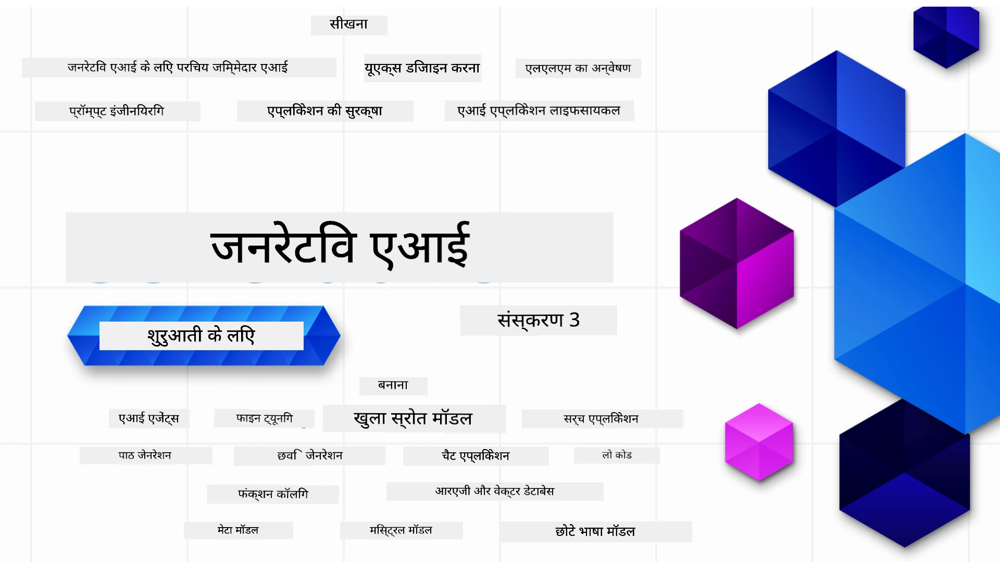

### 21 पाठ जो आपको जनरेटिव एआई एप्लिकेशन बनाने की शुरुआत करने के लिए आवश्यक सब कुछ सिखाते हैं

[](https://github.com/microsoft/Generative-AI-For-Beginners/blob/master/LICENSE?WT.mc_id=academic-105485-koreyst)
[](https://GitHub.com/microsoft/Generative-AI-For-Beginners/graphs/contributors/?WT.mc_id=academic-105485-koreyst)
[](https://GitHub.com/microsoft/Generative-AI-For-Beginners/issues/?WT.mc_id=academic-105485-koreyst)
[](https://GitHub.com/microsoft/Generative-AI-For-Beginners/pulls/?WT.mc_id=academic-105485-koreyst)
[](http://makeapullrequest.com?WT.mc_id=academic-105485-koreyst)

[](https://GitHub.com/microsoft/Generative-AI-For-Beginners/watchers/?WT.mc_id=academic-105485-koreyst)
[](https://GitHub.com/microsoft/Generative-AI-For-Beginners/network/?WT.mc_id=academic-105485-koreyst)
[](https://GitHub.com/microsoft/Generative-AI-For-Beginners/stargazers/?WT.mc_id=academic-105485-koreyst)

[](https://discord.gg/nTYy5BXMWG)

### 🌐 बहुभाषी समर्थन

#### GitHub Action के माध्यम से समर्थित (स्वचालित और हमेशा अपडेटेड)

<!-- CO-OP TRANSLATOR LANGUAGES TABLE START -->
[Arabic](../ar/README.md) | [Bengali](../bn/README.md) | [Bulgarian](../bg/README.md) | [Burmese (Myanmar)](../my/README.md) | [Chinese (Simplified)](../zh-CN/README.md) | [Chinese (Traditional, Hong Kong)](../zh-HK/README.md) | [Chinese (Traditional, Macau)](../zh-MO/README.md) | [Chinese (Traditional, Taiwan)](../zh-TW/README.md) | [Croatian](../hr/README.md) | [Czech](../cs/README.md) | [Danish](../da/README.md) | [Dutch](../nl/README.md) | [Estonian](../et/README.md) | [Finnish](../fi/README.md) | [French](../fr/README.md) | [German](../de/README.md) | [Greek](../el/README.md) | [Hebrew](../he/README.md) | [Hindi](./README.md) | [Hungarian](../hu/README.md) | [Indonesian](../id/README.md) | [Italian](../it/README.md) | [Japanese](../ja/README.md) | [Kannada](../kn/README.md) | [Korean](../ko/README.md) | [Lithuanian](../lt/README.md) | [Malay](../ms/README.md) | [Malayalam](../ml/README.md) | [Marathi](../mr/README.md) | [Nepali](../ne/README.md) | [Nigerian Pidgin](../pcm/README.md) | [Norwegian](../no/README.md) | [Persian (Farsi)](../fa/README.md) | [Polish](../pl/README.md) | [Portuguese (Brazil)](../pt-BR/README.md) | [Portuguese (Portugal)](../pt-PT/README.md) | [Punjabi (Gurmukhi)](../pa/README.md) | [Romanian](../ro/README.md) | [Russian](../ru/README.md) | [Serbian (Cyrillic)](../sr/README.md) | [Slovak](../sk/README.md) | [Slovenian](../sl/README.md) | [Spanish](../es/README.md) | [Swahili](../sw/README.md) | [Swedish](../sv/README.md) | [Tagalog (Filipino)](../tl/README.md) | [Tamil](../ta/README.md) | [Telugu](../te/README.md) | [Thai](../th/README.md) | [Turkish](../tr/README.md) | [Ukrainian](../uk/README.md) | [Urdu](../ur/README.md) | [Vietnamese](../vi/README.md)

> **स्थानीय रूप से क्लोन करना पसंद करते हैं?**

> इस रिपॉजिटरी में 50+ भाषा अनुवाद शामिल हैं जो डाउनलोड आकार को काफी बढ़ा देते हैं। अनुवाद के बिना क्लोन करने के लिए, sparse checkout का उपयोग करें:
> ```bash
> git clone --filter=blob:none --sparse https://github.com/microsoft/generative-ai-for-beginners.git
> cd generative-ai-for-beginners
> git sparse-checkout set --no-cone '/*' '!translations' '!translated_images'
> ```
> यह आपको कोर्स पूरा करने के लिए आवश्यक सब कुछ बहुत तेज डाउनलोड के साथ देता है।
<!-- CO-OP TRANSLATOR LANGUAGES TABLE END -->

# शुरुआती लोगों के लिए जनरेटिव एआई (संस्करण 3) - एक पाठ्यक्रम

Microsoft Cloud Advocates द्वारा हमारा 21-पाठ व्यापक कोर्स के साथ जनरेटिव AI एप्लिकेशन बनाने की मूल बातें सीखें।

## 🌱 शुरुआत करें

इस पाठ्यक्रम में 21 पाठ हैं। प्रत्येक पाठ अपना विषय कवर करता है इसलिए आप जहाँ चाहें वहाँ से शुरू कर सकते हैं!

पाठों को या तो "सीखें" लेसन के रूप में लेबल किया गया है जो जनरेटिव एआई की अवधारणा समझाते हैं या "बिल्ड" लेसन जो एक अवधारणा और दोनों **Python** और **TypeScript** में कोड उदाहरण समझाते हैं जहां संभव हो।

.NET डेवलपर्स के लिए, देखें [शुरुआती लोगों के लिए जनरेटिव एआई (.NET संस्करण)](https://github.com/microsoft/Generative-AI-for-beginners-dotnet?WT.mc_id=academic-105485-koreyst)!

प्रत्येक पाठ में साथ ही "जानकारी जारी रखें" अनुभाग भी शामिल है जिसमें अतिरिक्त सीखने के उपकरण हैं।

## आपको क्या चाहिए
### इस पाठ्यक्रम का कोड चलाने के लिए, आप निम्न में से किसी का उपयोग कर सकते हैं: 
 - [Azure OpenAI सेवा](https://aka.ms/genai-beginners/azure-open-ai?WT.mc_id=academic-105485-koreyst) - **पाठ:** "aoai-assignment"
 - [GitHub मार्केटप्लेस मॉडल कैटलॉग](https://aka.ms/genai-beginners/gh-models?WT.mc_id=academic-105485-koreyst) - **पाठ:** "githubmodels"
 - [OpenAI API](https://aka.ms/genai-beginners/open-ai?WT.mc_id=academic-105485-koreyst) - **पाठ:** "oai-assignment" 
   
- Python या TypeScript का बुनियादी ज्ञान सहायक है - \*पूर्ण शुरुआती के लिए ये [Python](https://aka.ms/genai-beginners/python?WT.mc_id=academic-105485-koreyst) और [TypeScript](https://aka.ms/genai-beginners/typescript?WT.mc_id=academic-105485-koreyst) पाठ्यक्रम देखें
- अपने GitHub खाते पर इस पूरी रिपॉजिटरी को फोर्क करने के लिए एक GitHub खाता

हमने आपके विकास वातावरण को सेटअप करने में सहायता के लिए एक **[पाठ्यक्रम सेटअप](./00-course-setup/README.md?WT.mc_id=academic-105485-koreyst)** पाठ बनाया है।

इसे बाद में आसानी से खोजने के लिए [इस रिपॉजिटरी को स्टार (🌟)](https://docs.github.com/en/get-started/exploring-projects-on-github/saving-repositories-with-stars?WT.mc_id=academic-105485-koreyst) करना न भूलें।

## 🧠 तैनात करने के लिए तैयार?

यदि आप अधिक उन्नत कोड नमूनों की तलाश में हैं, तो हमारे [जनरेटिव एआई कोड नमूनों का संग्रह](https://aka.ms/genai-beg-code?WT.mc_id=academic-105485-koreyst) देखें जो दोनों **Python** और **TypeScript** में उपलब्ध हैं।

## 🗣️ अन्य शिक्षार्थियों से मिलें, सहायता प्राप्त करें

इस पाठ्यक्रम को ले रहे अन्य शिक्षार्थियों से मिलने और नेटवर्किंग करने के लिए हमारे [आधिकारिक Azure AI Foundry Discord सर्वर](https://aka.ms/genai-discord?WT.mc_id=academic-105485-koreyst) में शामिल हों और सहायता प्राप्त करें।

प्रश्न पूछें या हमारे [Azure AI Foundry Developer Forum](https://aka.ms/azureaifoundry/forum) पर GitHub में उत्पाद प्रतिक्रिया साझा करें।

## 🚀 एक स्टार्टअप बना रहे हैं?

आज ही Azure क्रेडिट के साथ निर्माण शुरू करने के लिए [Microsoft for Startups](https://www.microsoft.com/startups) पर जाएं।

## 🙏 मदद करना चाहते हैं?

क्या आपके पास सुझाव हैं या आपने वर्तनी या कोड त्रुटियाँ पाईं? [एक समस्या उठाएं](https://github.com/microsoft/generative-ai-for-beginners/issues?WT.mc_id=academic-105485-koreyst) या [एक पुल रिक्वेस्ट बनाएं](https://github.com/microsoft/generative-ai-for-beginners/pulls?WT.mc_id=academic-105485-koreyst)

## 📂 प्रत्येक पाठ में शामिल है:

- विषय का एक छोटा वीडियो परिचय
- README में स्थित एक लिखित पाठ
- Python और TypeScript कोड नमूने जो Azure OpenAI और OpenAI API का समर्थन करते हैं
- सीखने को जारी रखने के लिए अतिरिक्त संसाधनों के लिंक

## 🗃️ पाठ

| #   | **पाठ लिंक**                                                                                                                              | **विवरण**                                                                                  | **वीडियो**                                                                  | **अतिरिक्त सीखना**                                                           |
| --- | -------------------------------------------------------------------------------------------------------------------------------------------- | --------------------------------------------------------------------------------------------- | -------------------------------------------------------------------------- | --------------------------------------------------------------------------- |
| 00  | [पाठ्यक्रम सेटअप](./00-course-setup/README.md?WT.mc_id=academic-105485-koreyst)                                                               | **सीखें:** अपना विकास वातावरण कैसे सेटअप करें                                               | वीडियो जल्द आ रहा है                                                        | [अधिक जानें](https://aka.ms/genai-collection?WT.mc_id=academic-105485-koreyst) |
| 01  | [जनरेटिव AI और LLMs का परिचय](./01-introduction-to-genai/README.md?WT.mc_id=academic-105485-koreyst)                                           | **सीखें:** जनरेटिव AI क्या है और बड़े भाषा मॉडल्स (LLMs) कैसे काम करते हैं समझना             | [वीडियो](https://aka.ms/gen-ai-lesson-1-gh?WT.mc_id=academic-105485-koreyst) | [अधिक जानें](https://aka.ms/genai-collection?WT.mc_id=academic-105485-koreyst) |
| 02  | [विभिन्न LLMs का अन्वेषण और तुलना](./02-exploring-and-comparing-different-llms/README.md?WT.mc_id=academic-105485-koreyst)                     | **सीखें:** अपने उपयोग केस के लिए सही मॉडल कैसे चुनें                                       | [वीडियो](https://aka.ms/gen-ai-lesson2-gh?WT.mc_id=academic-105485-koreyst)  | [अधिक जानें](https://aka.ms/genai-collection?WT.mc_id=academic-105485-koreyst) |
| 03  | [जनरेटिव AI का जिम्मेदारी से उपयोग करना](./03-using-generative-ai-responsibly/README.md?WT.mc_id=academic-105485-koreyst)                     | **सीखें:** जिम्मेदारी से जनरेटिव AI एप्लिकेशन कैसे बनाएं                                   | [वीडियो](https://aka.ms/gen-ai-lesson3-gh?WT.mc_id=academic-105485-koreyst)  | [अधिक जानें](https://aka.ms/genai-collection?WT.mc_id=academic-105485-koreyst) |
| 04  | [प्रांप्ट इंजीनियरिंग के मूलभूत सिद्धांत समझना](./04-prompt-engineering-fundamentals/README.md?WT.mc_id=academic-105485-koreyst)             | **सीखें:** प्रांप्ट इंजीनीरिंग के सर्वश्रेष्ठ अभ्यासों पर व्यावहारिक अनुभव                                           | [वीडियो](https://aka.ms/gen-ai-lesson4-gh?WT.mc_id=academic-105485-koreyst)  | [और जानें](https://aka.ms/genai-collection?WT.mc_id=academic-105485-koreyst) |
| 05  | [उन्नत प्रांप्ट बनाना](./05-advanced-prompts/README.md?WT.mc_id=academic-105485-koreyst)                                                | **सीखें:** प्रांप्ट इंजीनियरिंग तकनीकों को कैसे लागू करें जो आपके प्रांप्ट के परिणाम को बेहतर बनाएं। | [वीडियो](https://aka.ms/gen-ai-lesson5-gh?WT.mc_id=academic-105485-koreyst)  | [और जानें](https://aka.ms/genai-collection?WT.mc_id=academic-105485-koreyst) |
| 06  | [टेक्स्ट जनरेशन एप्लिकेशन बनाना](./06-text-generation-apps/README.md?WT.mc_id=academic-105485-koreyst)                                | **बनाएं:** Azure OpenAI / OpenAI API का उपयोग करके एक टेक्स्ट जनरेशन ऐप                                | [वीडियो](https://aka.ms/gen-ai-lesson6-gh?WT.mc_id=academic-105485-koreyst)  | [और जानें](https://aka.ms/genai-collection?WT.mc_id=academic-105485-koreyst) |
| 07  | [चैट एप्लिकेशन बनाना](./07-building-chat-applications/README.md?WT.mc_id=academic-105485-koreyst)                                     | **बनाएं:** चैट एप्लिकेशन को कुशलतापूर्वक बनाने और एकीकृत करने की तकनीकें               | [वीडियो](https://aka.ms/gen-ai-lessons7-gh?WT.mc_id=academic-105485-koreyst) | [और जानें](https://aka.ms/genai-collection?WT.mc_id=academic-105485-koreyst) |
| 08  | [सर्च ऐप्स वेक्टर डेटाबेस बनाना](./08-building-search-applications/README.md?WT.mc_id=academic-105485-koreyst)                        | **बनाएं:** एक सर्च एप्लिकेशन जो डेटा खोजने के लिए एम्बेडिंग का उपयोग करता है।                        | [वीडियो](https://aka.ms/gen-ai-lesson8-gh?WT.mc_id=academic-105485-koreyst)  | [और जानें](https://aka.ms/genai-collection?WT.mc_id=academic-105485-koreyst) |
| 09  | [छवि जनरेशन एप्लिकेशन बनाना](./09-building-image-applications/README.md?WT.mc_id=academic-105485-koreyst)                        | **बनाएं:** एक छवि जनरेशन एप्लिकेशन                                                      | [वीडियो](https://aka.ms/gen-ai-lesson9-gh?WT.mc_id=academic-105485-koreyst)  | [और जानें](https://aka.ms/genai-collection?WT.mc_id=academic-105485-koreyst) |
| 10  | [लो कोड AI एप्लिकेशन बनाना](./10-building-low-code-ai-applications/README.md?WT.mc_id=academic-105485-koreyst)                       | **बनाएं:** लो कोड टूल्स का उपयोग करके एक जनरेटिव AI एप्लिकेशन                                     | [वीडियो](https://aka.ms/gen-ai-lesson10-gh?WT.mc_id=academic-105485-koreyst) | [और जानें](https://aka.ms/genai-collection?WT.mc_id=academic-105485-koreyst) |
| 11  | [फंक्शन कॉलिंग के साथ बाहरी एप्लिकेशन एकीकृत करना](./11-integrating-with-function-calling/README.md?WT.mc_id=academic-105485-koreyst) | **बनाएं:** फंक्शन कॉलिंग क्या है और एप्लिकेशन के लिए इसके उपयोग के मामले                          | [वीडियो](https://aka.ms/gen-ai-lesson11-gh?WT.mc_id=academic-105485-koreyst) | [और जानें](https://aka.ms/genai-collection?WT.mc_id=academic-105485-koreyst) |
| 12  | [AI एप्लिकेशन के लिए UX डिज़ाइन करना](./12-designing-ux-for-ai-applications/README.md?WT.mc_id=academic-105485-koreyst)                         | **सीखें:** जनरेटिव AI एप्लिकेशन विकसित करते समय UX डिज़ाइन सिद्धांतों को कैसे लागू करें         | [वीडियो](https://aka.ms/gen-ai-lesson12-gh?WT.mc_id=academic-105485-koreyst) | [और जानें](https://aka.ms/genai-collection?WT.mc_id=academic-105485-koreyst) |
| 13  | [अपने जनरेटिव AI एप्लिकेशन सुरक्षित करना](./13-securing-ai-applications/README.md?WT.mc_id=academic-105485-koreyst)                         | **सीखें:** AI सिस्टम के खतरे और जोखिम और इन सिस्टम को सुरक्षित करने के तरीके             | [वीडियो](https://aka.ms/gen-ai-lesson13-gh?WT.mc_id=academic-105485-koreyst) | [और जानें](https://aka.ms/genai-collection?WT.mc_id=academic-105485-koreyst) |
| 14  | [जनरेटिव AI एप्लिकेशन का जीवनचक्र](./14-the-generative-ai-application-lifecycle/README.md?WT.mc_id=academic-105485-koreyst)           | **सीखें:** LLM जीवनचक्र और LLMOps प्रबंधित करने के उपकरण और मेट्रिक्स                         | [वीडियो](https://aka.ms/gen-ai-lesson14-gh?WT.mc_id=academic-105485-koreyst) | [और जानें](https://aka.ms/genai-collection?WT.mc_id=academic-105485-koreyst) |
| 15  | [रिट्रीवल ऑगमेंटेड जनरेशन (RAG) और वेक्टर डेटाबेस](./15-rag-and-vector-databases/README.md?WT.mc_id=academic-105485-koreyst)        | **बनाएं:** RAG फ्रेमवर्क का उपयोग करके वेक्टर डेटाबेस से एम्बेडिंग पुनः प्राप्त करने वाला एप्लिकेशन  | [वीडियो](https://aka.ms/gen-ai-lesson15-gh?WT.mc_id=academic-105485-koreyst) | [और जानें](https://aka.ms/genai-collection?WT.mc_id=academic-105485-koreyst) |
| 16  | [ओपन सोर्स मॉडल और हगिंग फेस](./16-open-source-models/README.md?WT.mc_id=academic-105485-koreyst)                                    | **बनाएं:** हगिंग फेस पर उपलब्ध ओपन सोर्स मॉडल का उपयोग करने वाला एप्लिकेशन                    | [वीडियो](https://aka.ms/gen-ai-lesson16-gh?WT.mc_id=academic-105485-koreyst) | [और जानें](https://aka.ms/genai-collection?WT.mc_id=academic-105485-koreyst) |
| 17  | [AI एजेंट](./17-ai-agents/README.md?WT.mc_id=academic-105485-koreyst)                                                                       | **बनाएं:** एक AI एजेंट फ्रेमवर्क का उपयोग करने वाला एप्लिकेशन                                           | [वीडियो](https://aka.ms/gen-ai-lesson17-gh?WT.mc_id=academic-105485-koreyst) | [और जानें](https://aka.ms/genai-collection?WT.mc_id=academic-105485-koreyst) |
| 18  | [LLM को फाइन-ट्यून करना](./18-fine-tuning/README.md?WT.mc_id=academic-105485-koreyst)                                                              | **सीखें:** LLM को फाइन-ट्यून करने का क्या, क्यों और कैसे                                            | [वीडियो](https://aka.ms/gen-ai-lesson18-gh?WT.mc_id=academic-105485-koreyst) | [और जानें](https://aka.ms/genai-collection?WT.mc_id=academic-105485-koreyst) |
| 19  | [SLM के साथ निर्माण](./19-slm/README.md?WT.mc_id=academic-105485-koreyst)                                                              | **सीखें:** छोटे भाषा मॉडल के साथ निर्माण के लाभ                                            | वीडियो जल्द आ रहा है | [और जानें](https://aka.ms/genai-collection?WT.mc_id=academic-105485-koreyst) |
| 20  | [मिस्ट्रल मॉडल के साथ निर्माण](./20-mistral/README.md?WT.mc_id=academic-105485-koreyst)                                                              | **सीखें:** मिस्ट्रल फैमिली मॉडल के फीचर और अंतर                                           | वीडियो जल्द आ रहा है | [और जानें](https://aka.ms/genai-collection?WT.mc_id=academic-105485-koreyst) |
| 21  | [मेटा मॉडल के साथ निर्माण](./21-meta/README.md?WT.mc_id=academic-105485-koreyst)                                                              | **सीखें:** मेटा फैमिली मॉडल के फीचर और अंतर                                           | वीडियो जल्द आ रहा है | [और जानें](https://aka.ms/genai-collection?WT.mc_id=academic-105485-koreyst) |

### 🌟 विशेष धन्यवाद

सभी GitHub Actions और वर्कफ़्लोज़ बनाने के लिए [**John Aziz**](https://www.linkedin.com/in/john0isaac/) को विशेष धन्यवाद।

प्रत्येक पाठ में शिक्षार्थी और कोड अनुभव को बेहतर बनाने के लिए महत्वपूर्ण योगदान देने के लिए [**Bernhard Merkle**](https://www.linkedin.com/in/bernhard-merkle-738b73/) को धन्यवाद।

## 🎒 अन्य कोर्स

हमारी टीम अन्य कोर्स भी बनाती है! देखें:

<!-- CO-OP TRANSLATOR OTHER COURSES START -->
### LangChain
[](https://aka.ms/langchain4j-for-beginners)
[](https://aka.ms/langchainjs-for-beginners?WT.mc_id=m365-94501-dwahlin)
[](https://github.com/microsoft/langchain-for-beginners?WT.mc_id=m365-94501-dwahlin)
---

### Azure / Edge / MCP / Agents
[](https://github.com/microsoft/AZD-for-beginners?WT.mc_id=academic-105485-koreyst)
[](https://github.com/microsoft/edgeai-for-beginners?WT.mc_id=academic-105485-koreyst)
[](https://github.com/microsoft/mcp-for-beginners?WT.mc_id=academic-105485-koreyst)
[](https://github.com/microsoft/ai-agents-for-beginners?WT.mc_id=academic-105485-koreyst)

---
 
### जनरेटिव AI श्रृंखला
[](https://github.com/microsoft/generative-ai-for-beginners?WT.mc_id=academic-105485-koreyst)
[-9333EA?style=for-the-badge&labelColor=E5E7EB&color=9333EA)](https://github.com/microsoft/Generative-AI-for-beginners-dotnet?WT.mc_id=academic-105485-koreyst)
[-C084FC?style=for-the-badge&labelColor=E5E7EB&color=C084FC)](https://github.com/microsoft/generative-ai-for-beginners-java?WT.mc_id=academic-105485-koreyst)
[-E879F9?style=for-the-badge&labelColor=E5E7EB&color=E879F9)](https://github.com/microsoft/generative-ai-with-javascript?WT.mc_id=academic-105485-koreyst)

---
 
### प्रमुख सीखना
[](https://aka.ms/ml-beginners?WT.mc_id=academic-105485-koreyst)
[](https://aka.ms/datascience-beginners?WT.mc_id=academic-105485-koreyst)
[](https://aka.ms/ai-beginners?WT.mc_id=academic-105485-koreyst)
[](https://github.com/microsoft/Security-101?WT.mc_id=academic-96948-sayoung)
[](https://aka.ms/webdev-beginners?WT.mc_id=academic-105485-koreyst)
[](https://aka.ms/iot-beginners?WT.mc_id=academic-105485-koreyst)
[](https://github.com/microsoft/xr-development-for-beginners?WT.mc_id=academic-105485-koreyst)

---
 
### कोपिलॉट सीरीज
[](https://aka.ms/GitHubCopilotAI?WT.mc_id=academic-105485-koreyst)
[](https://github.com/microsoft/mastering-github-copilot-for-dotnet-csharp-developers?WT.mc_id=academic-105485-koreyst)
[](https://github.com/microsoft/CopilotAdventures?WT.mc_id=academic-105485-koreyst)
<!-- CO-OP TRANSLATOR OTHER COURSES END -->

## सहायता प्राप्त करें

यदि आप अटके हुए हैं या एआई ऐप बनाने के बारे में कोई प्रश्न है। सहकर्मी शिक्षार्थियों और अनुभवी डेवलपर्स के साथ MCP के बारे में चर्चा में शामिल हों। यह एक सहयोगी समुदाय है जहाँ प्रश्न स्वागत योग्य हैं और ज्ञान स्वतंत्र रूप से साझा किया जाता है।

[](https://discord.gg/nTYy5BXMWG)

यदि आपके पास उत्पाद प्रतिक्रिया है या निर्माण के दौरान त्रुटियाँ हैं तो यहाँ जाएँ:

[](https://aka.ms/foundry/forum)

---

<!-- CO-OP TRANSLATOR DISCLAIMER START -->
**अस्वीकरण**:
इस दस्तावेज़ का अनुवाद AI अनुवाद सेवा [Co-op Translator](https://github.com/Azure/co-op-translator) का उपयोग करके किया गया है। जबकि हम सटीकता के लिए प्रयासरत हैं, कृपया ध्यान दें कि स्वचालित अनुवाद में त्रुटियां या गलतियां हो सकती हैं। मूल दस्तावेज़ अपनी मूल भाषा में ही मान्य स्रोत माना जाना चाहिए। महत्वपूर्ण जानकारी के लिए पेशेवर मानव अनुवाद की सिफारिश की जाती है। इस अनुवाद के उपयोग से होने वाली किसी भी गलतफहमी या व्याख्या में हम ज़िम्मेदारी नहीं लेते।
<!-- CO-OP TRANSLATOR DISCLAIMER END -->