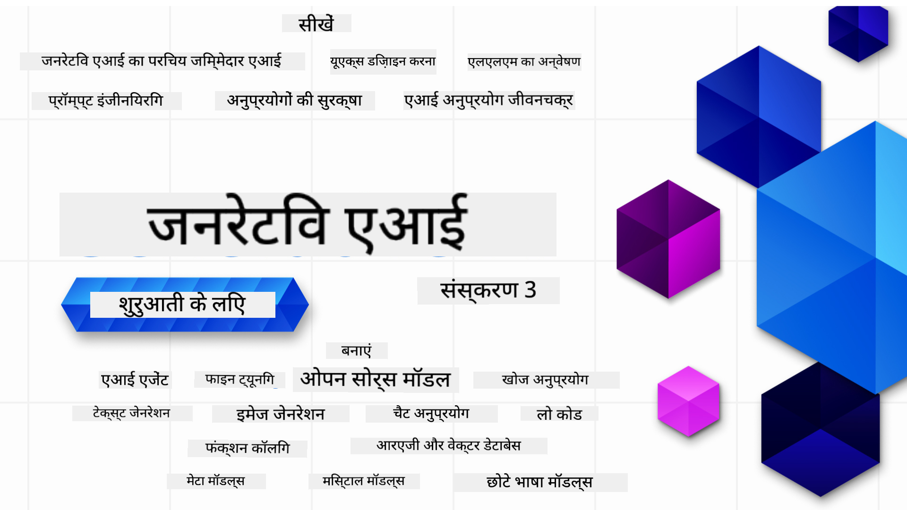

<!--
CO_OP_TRANSLATOR_METADATA:
{
  "original_hash": "ca2afa136ed9aca0634f39f51239746e",
  "translation_date": "2025-08-27T08:22:11+00:00",
  "source_file": "README.md",
  "language_code": "hi"
}
-->

### 21 पाठ जो आपको जेनरेटिव एआई एप्लिकेशन बनाना शुरू करने के लिए आवश्यक सब कुछ सिखाते हैं

  
  
  
  
  

  
  
  

### 🌐 बहुभाषी समर्थन

#### GitHub एक्शन के माध्यम से समर्थित (स्वचालित और हमेशा अद्यतन)

[फ्रेंच](../fr/README.md) | [स्पेनिश](../es/README.md) | [जर्मन](../de/README.md) | [रूसी](../ru/README.md) | [अरबी](../ar/README.md) | [फारसी](../fa/README.md) | [उर्दू](../ur/README.md) | [चीनी (सरलीकृत)](../zh/README.md) | [चीनी (पारंपरिक, मकाऊ)](../mo/README.md) | [चीनी (पारंपरिक, हांगकांग)](../hk/README.md) | [चीनी (पारंपरिक, ताइवान)](../tw/README.md) | [जापानी](../ja/README.md) | [कोरियाई](../ko/README.md) | [हिंदी](./README.md) | [बंगाली](../bn/README.md) | [मराठी](../mr/README.md) | [नेपाली](../ne/README.md) | [पंजाबी (गुरमुखी)](../pa/README.md) | [पुर्तगाली (पुर्तगाल)](../pt/README.md) | [पुर्तगाली (ब्राज़ील)](../br/README.md) | [इतालवी](../it/README.md) | [लिथुआनियाई](../lt/README.md) | [पोलिश](../pl/README.md) | [तुर्की](../tr/README.md) | [ग्रीक](../el/README.md) | [थाई](../th/README.md) | [स्वीडिश](../sv/README.md) | [डेनिश](../da/README.md) | [नॉर्वेजियन](../no/README.md) | [फिनिश](../fi/README.md) | [डच](../nl/README.md) | [हिब्रू](../he/README.md) | [वियतनामी](../vi/README.md) | [इंडोनेशियाई](../id/README.md) | [मलय](../ms/README.md) | [टैगालोग (फिलिपिनो)](../tl/README.md) | [स्वाहिली](../sw/README.md) | [हंगेरियन](../hu/README.md) | [चेक](../cs/README.md) | [स्लोवाक](../sk/README.md) | [रोमानियाई](../ro/README.md) | [बुल्गारियाई](../bg/README.md) | [सर्बियाई (सिरिलिक)](../sr/README.md) | [क्रोएशियाई](../hr/README.md) | [स्लोवेनियाई](../sl/README.md) | [यूक्रेनी](../uk/README.md) | [बर्मी (म्यांमार)](../my/README.md)

# जेनरेटिव एआई फॉर बिगिनर्स (संस्करण 3) - एक कोर्स

माइक्रोसॉफ्ट क्लाउड एडवोकेट्स द्वारा तैयार किए गए 21 पाठों के इस व्यापक कोर्स के साथ जेनरेटिव एआई एप्लिकेशन बनाने की मूल बातें सीखें।

## 🌱 शुरुआत कैसे करें

इस कोर्स में 21 पाठ हैं। प्रत्येक पाठ अपने विषय को कवर करता है, इसलिए आप कहीं से भी शुरू कर सकते हैं!

पाठों को "सीखें" पाठों के रूप में लेबल किया गया है, जो जेनरेटिव एआई की अवधारणा को समझाते हैं, या "बनाएं" पाठों के रूप में, जो अवधारणा और कोड उदाहरणों को **Python** और **TypeScript** में समझाते हैं, जब संभव हो।

.NET डेवलपर्स के लिए, [जेनरेटिव एआई फॉर बिगिनर्स (.NET संस्करण)](https://github.com/microsoft/Generative-AI-for-beginners-dotnet?WT.mc_id=academic-105485-koreyst) देखें!

प्रत्येक पाठ में "अधिक सीखें" अनुभाग भी शामिल है, जिसमें अतिरिक्त सीखने के उपकरण दिए गए हैं।

## आपको क्या चाहिए
### इस कोर्स के कोड को चलाने के लिए, आप इनमें से किसी का उपयोग कर सकते हैं:
 - [Azure OpenAI Service](https://aka.ms/genai-beginners/azure-open-ai?WT.mc_id=academic-105485-koreyst) - **पाठ:** "aoai-assignment"  
 - [GitHub Marketplace Model Catalog](https://aka.ms/genai-beginners/gh-models?WT.mc_id=academic-105485-koreyst) - **पाठ:** "githubmodels"  
 - [OpenAI API](https://aka.ms/genai-beginners/open-ai?WT.mc_id=academic-105485-koreyst) - **पाठ:** "oai-assignment"  

- Python या TypeScript का बुनियादी ज्ञान सहायक होगा - \*पूर्ण शुरुआती के लिए, ये [Python](https://aka.ms/genai-beginners/python?WT.mc_id=academic-105485-koreyst) और [TypeScript](https://aka.ms/genai-beginners/typescript?WT.mc_id=academic-105485-koreyst) कोर्स देखें  
- एक GitHub खाता, ताकि आप [इस पूरे रिपॉजिटरी को फोर्क कर सकें](https://aka.ms/genai-beginners/github?WT.mc_id=academic-105485-koreyst)  

हमने आपके विकास पर्यावरण को सेटअप करने में मदद करने के लिए एक **[कोर्स सेटअप](./00-course-setup/README.md?WT.mc_id=academic-105485-koreyst)** पाठ बनाया है।

इस रिपॉजिटरी को [स्टार (🌟)](https://docs.github.com/en/get-started/exploring-projects-on-github/saving-repositories-with-stars?WT.mc_id=academic-105485-koreyst) करना न भूलें, ताकि इसे बाद में आसानी से ढूंढ सकें।

## 🧠 तैयार हैं डिप्लॉय करने के लिए?

यदि आप अधिक उन्नत कोड नमूनों की तलाश कर रहे हैं, तो हमारे [जेनरेटिव एआई कोड नमूनों के संग्रह](https://aka.ms/genai-beg-code?WT.mc_id=academic-105485-koreyst) को देखें, जो **Python** और **TypeScript** दोनों में उपलब्ध हैं।

## 🗣️ अन्य शिक्षार्थियों से मिलें, सहायता प्राप्त करें

हमारे [आधिकारिक Azure AI Foundry Discord सर्वर](https://aka.ms/genai-discord?WT.mc_id=academic-105485-koreyst) से जुड़ें, अन्य शिक्षार्थियों से मिलने और नेटवर्क बनाने के लिए, और इस कोर्स के लिए सहायता प्राप्त करें।

हमारे [Azure AI Foundry डेवलपर फोरम](https://aka.ms/azureaifoundry/forum) पर GitHub में प्रश्न पूछें या उत्पाद प्रतिक्रिया साझा करें।

## 🚀 एक स्टार्टअप बना रहे हैं?

[Microsoft for Startups](https://www.microsoft.com/startups) पर जाएं और जानें कि Azure क्रेडिट के साथ शुरुआत कैसे करें।

## 🙏 मदद करना चाहते हैं?

क्या आपके पास सुझाव हैं या आपने वर्तनी या कोड में त्रुटियां पाई हैं? [एक मुद्दा उठाएं](https://github.com/microsoft/generative-ai-for-beginners/issues?WT.mc_id=academic-105485-koreyst) या [एक पुल रिक्वेस्ट बनाएं](https://github.com/microsoft/generative-ai-for-beginners/pulls?WT.mc_id=academic-105485-koreyst)।

## 📂 प्रत्येक पाठ में शामिल हैं:

- विषय का एक छोटा वीडियो परिचय  
- README में स्थित एक लिखित पाठ  
- Azure OpenAI और OpenAI API का समर्थन करने वाले Python और TypeScript कोड नमूने  
- आपकी सीखने की यात्रा जारी रखने के लिए अतिरिक्त संसाधनों के लिंक  

## 🗃️ पाठ

| #   | **पाठ लिंक**                                                                                                                              | **विवरण**                                                                                 | **वीडियो**                                                                   | **अतिरिक्त सीखने के संसाधन**                                                   |
| --- | -------------------------------------------------------------------------------------------------------------------------------------------- | ----------------------------------------------------------------------------------------------- | --------------------------------------------------------------------------- | ------------------------------------------------------------------------------ |
| 00  | [कोर्स सेटअप](./00-course-setup/README.md?WT.mc_id=academic-105485-koreyst)                                                                 | **सीखें:** अपने विकास पर्यावरण को कैसे सेटअप करें                                            | वीडियो जल्द ही आएगा                                                                 | [अधिक जानें](https://aka.ms/genai-collection?WT.mc_id=academic-105485-koreyst) |
| 01  | [जेनरेटिव एआई और LLMs का परिचय](./01-introduction-to-genai/README.md?WT.mc_id=academic-105485-koreyst)                              | **सीखें:** जेनरेटिव एआई क्या है और बड़े भाषा मॉडल (LLMs) कैसे काम करते हैं।       | [वीडियो](https://aka.ms/gen-ai-lesson-1-gh?WT.mc_id=academic-105485-koreyst) | [अधिक जानें](https://aka.ms/genai-collection?WT.mc_id=academic-105485-koreyst) |
| 02  | [विभिन्न LLMs का अन्वेषण और तुलना](./02-exploring-and-comparing-different-llms/README.md?WT.mc_id=academic-105485-koreyst)             | **सीखें:** अपने उपयोग के मामले के लिए सही मॉडल कैसे चुनें                                      | [वीडियो](https://aka.ms/gen-ai-lesson2-gh?WT.mc_id=academic-105485-koreyst)  | [अधिक जानें](https://aka.ms/genai-collection?WT.mc_id=academic-105485-koreyst) |
| 03  | [जेनरेटिव एआई का जिम्मेदारी से उपयोग करना](./03-using-generative-ai-responsibly/README.md?WT.mc_id=academic-105485-koreyst)                           | **सीखें:** जिम्मेदारी से जेनरेटिव एआई एप्लिकेशन कैसे बनाएं                                  | [वीडियो](https://aka.ms/gen-ai-lesson3-gh?WT.mc_id=academic-105485-koreyst)  | [अधिक जानें](https://aka.ms/genai-collection?WT.mc_id=academic-105485-koreyst) |
| 04  | [प्रॉम्प्ट इंजीनियरिंग की मूल बातें समझना](./04-prompt-engineering-fundamentals/README.md?WT.mc_id=academic-105485-koreyst)             | **सीखें:** प्रॉम्प्ट इंजीनियरिंग के सर्वोत्तम अभ्यास                                           | [वीडियो](https://aka.ms/gen-ai-lesson4-gh?WT.mc_id=academic-105485-koreyst)  | [अधिक जानें](https://aka.ms/genai-collection?WT.mc_id=academic-105485-koreyst) |
| 05  | [उन्नत प्रॉम्प्ट बनाना](./05-advanced-prompts/README.md?WT.mc_id=academic-105485-koreyst)                                                | **सीखें:** प्रॉम्प्ट इंजीनियरिंग तकनीकों को कैसे लागू करें जो आपके प्रॉम्प्ट के परिणाम को बेहतर बनाती हैं। | [वीडियो](https://aka.ms/gen-ai-lesson5-gh?WT.mc_id=academic-105485-koreyst)  | [अधिक जानें](https://aka.ms/genai-collection?WT.mc_id=academic-105485-koreyst) |
| 06  | [टेक्स्ट जनरेशन एप्लिकेशन बनाना](./06-text-generation-apps/README.md?WT.mc_id=academic-105485-koreyst)                                | **बनाएं:** Azure OpenAI / OpenAI API का उपयोग करके एक टेक्स्ट जनरेशन एप्लिकेशन                                | [वीडियो](https://aka.ms/gen-ai-lesson6-gh?WT.mc_id=academic-105485-koreyst)  | [अधिक जानें](https://aka.ms/genai-collection?WT.mc_id=academic-105485-koreyst) |
| 07  | [चैट एप्लिकेशन बनाना](./07-building-chat-applications/README.md?WT.mc_id=academic-105485-koreyst)                                     | **बनाएं:** चैट एप्लिकेशन को कुशलतापूर्वक बनाने और एकीकृत करने की तकनीकें।               | [वीडियो](https://aka.ms/gen-ai-lessons7-gh?WT.mc_id=academic-105485-koreyst) | [अधिक जानें](https://aka.ms/genai-collection?WT.mc_id=academic-105485-koreyst) |
| 08  | [सर्च एप्लिकेशन बनाना - वेक्टर डेटाबेस](./08-building-search-applications/README.md?WT.mc_id=academic-105485-koreyst)                        | **बनाएं:** एक सर्च एप्लिकेशन जो डेटा खोजने के लिए एम्बेडिंग का उपयोग करता है।                        | [वीडियो](https://aka.ms/gen-ai-lesson8-gh?WT.mc_id=academic-105485-koreyst)  | [अधिक जानें](https://aka.ms/genai-collection?WT.mc_id=academic-105485-koreyst) |
| 09  | [इमेज जनरेशन एप्लिकेशन बनाना](./09-building-image-applications/README.md?WT.mc_id=academic-105485-koreyst)                        | **बनाएं:** एक इमेज जनरेशन एप्लिकेशन                                                       | [वीडियो](https://aka.ms/gen-ai-lesson9-gh?WT.mc_id=academic-105485-koreyst)  | [अधिक जानें](https://aka.ms/genai-collection?WT.mc_id=academic-105485-koreyst) |
| 10  | [लो कोड AI एप्लिकेशन बनाना](./10-building-low-code-ai-applications/README.md?WT.mc_id=academic-105485-koreyst)                       | **बनाएं:** लो कोड टूल्स का उपयोग करके एक जनरेटिव AI एप्लिकेशन                                     | [वीडियो](https://aka.ms/gen-ai-lesson10-gh?WT.mc_id=academic-105485-koreyst) | [अधिक जानें](https://aka.ms/genai-collection?WT.mc_id=academic-105485-koreyst) |
| 11  | [फंक्शन कॉलिंग के साथ बाहरी एप्लिकेशन को एकीकृत करना](./11-integrating-with-function-calling/README.md?WT.mc_id=academic-105485-koreyst) | **बनाएं:** फंक्शन कॉलिंग क्या है और एप्लिकेशन के लिए इसके उपयोग के मामले                          | [वीडियो](https://aka.ms/gen-ai-lesson11-gh?WT.mc_id=academic-105485-koreyst) | [अधिक जानें](https://aka.ms/genai-collection?WT.mc_id=academic-105485-koreyst) |
| 12  | [AI एप्लिकेशन के लिए UX डिज़ाइन करना](./12-designing-ux-for-ai-applications/README.md?WT.mc_id=academic-105485-koreyst)                         | **जानें:** जनरेटिव AI एप्लिकेशन विकसित करते समय UX डिज़ाइन सिद्धांतों को कैसे लागू करें         | [वीडियो](https://aka.ms/gen-ai-lesson12-gh?WT.mc_id=academic-105485-koreyst) | [अधिक जानें](https://aka.ms/genai-collection?WT.mc_id=academic-105485-koreyst) |
| 13  | [अपने जनरेटिव AI एप्लिकेशन को सुरक्षित करना](./13-securing-ai-applications/README.md?WT.mc_id=academic-105485-koreyst)                         | **जानें:** AI सिस्टम के लिए खतरे और जोखिम और इन सिस्टम को सुरक्षित करने के तरीके।             | [वीडियो](https://aka.ms/gen-ai-lesson13-gh?WT.mc_id=academic-105485-koreyst) | [अधिक जानें](https://aka.ms/genai-collection?WT.mc_id=academic-105485-koreyst) |
| 14  | [जनरेटिव AI एप्लिकेशन लाइफसाइकल](./14-the-generative-ai-application-lifecycle/README.md?WT.mc_id=academic-105485-koreyst)           | **जानें:** LLM लाइफसाइकल और LLMOps को प्रबंधित करने के लिए उपकरण और मीट्रिक्स                         | [वीडियो](https://aka.ms/gen-ai-lesson14-gh?WT.mc_id=academic-105485-koreyst) | [अधिक जानें](https://aka.ms/genai-collection?WT.mc_id=academic-105485-koreyst) |
| 15  | [रिट्रीवल ऑगमेंटेड जनरेशन (RAG) और वेक्टर डेटाबेस](./15-rag-and-vector-databases/README.md?WT.mc_id=academic-105485-koreyst)        | **बनाएं:** एक एप्लिकेशन जो RAG फ्रेमवर्क का उपयोग करके वेक्टर डेटाबेस से एम्बेडिंग को रिट्रीव करता है  | [वीडियो](https://aka.ms/gen-ai-lesson15-gh?WT.mc_id=academic-105485-koreyst) | [अधिक जानें](https://aka.ms/genai-collection?WT.mc_id=academic-105485-koreyst) |
| 16  | [ओपन सोर्स मॉडल और हगिंग फेस](./16-open-source-models/README.md?WT.mc_id=academic-105485-koreyst)                                    | **बनाएं:** हगिंग फेस पर उपलब्ध ओपन सोर्स मॉडल का उपयोग करके एक एप्लिकेशन                    | [वीडियो](https://aka.ms/gen-ai-lesson16-gh?WT.mc_id=academic-105485-koreyst) | [अधिक जानें](https://aka.ms/genai-collection?WT.mc_id=academic-105485-koreyst) |
| 17  | [AI एजेंट्स](./17-ai-agents/README.md?WT.mc_id=academic-105485-koreyst)                                                                       | **बनाएं:** एक एप्लिकेशन जो AI एजेंट फ्रेमवर्क का उपयोग करता है                                           | [वीडियो](https://aka.ms/gen-ai-lesson17-gh?WT.mc_id=academic-105485-koreyst) | [अधिक जानें](https://aka.ms/genai-collection?WT.mc_id=academic-105485-koreyst) |
| 18  | [LLMs को फाइन-ट्यून करना](./18-fine-tuning/README.md?WT.mc_id=academic-105485-koreyst)                                                              | **जानें:** LLMs को फाइन-ट्यून करने का क्या, क्यों और कैसे                                            | [वीडियो](https://aka.ms/gen-ai-lesson18-gh?WT.mc_id=academic-105485-koreyst) | [अधिक जानें](https://aka.ms/genai-collection?WT.mc_id=academic-105485-koreyst) |
| 19  | [SLMs के साथ बनाना](./19-slm/README.md?WT.mc_id=academic-105485-koreyst)                                                              | **जानें:** छोटे भाषा मॉडल के साथ निर्माण के लाभ                                            | वीडियो जल्द ही उपलब्ध होगा | [अधिक जानें](https://aka.ms/genai-collection?WT.mc_id=academic-105485-koreyst) |
| 20  | [मिस्ट्रल मॉडल के साथ बनाना](./20-mistral/README.md?WT.mc_id=academic-105485-koreyst)                                                              | **जानें:** मिस्ट्रल फैमिली मॉडल की विशेषताएं और अंतर                                           | वीडियो जल्द ही उपलब्ध होगा | [अधिक जानें](https://aka.ms/genai-collection?WT.mc_id=academic-105485-koreyst) |
| 21  | [मेटा मॉडल के साथ बनाना](./21-meta/README.md?WT.mc_id=academic-105485-koreyst)                                                              | **जानें:** मेटा फैमिली मॉडल की विशेषताएं और अंतर                                           | वीडियो जल्द ही उपलब्ध होगा | [अधिक जानें](https://aka.ms/genai-collection?WT.mc_id=academic-105485-koreyst) |

### 🌟 विशेष धन्यवाद

विशेष धन्यवाद [**John Aziz**](https://www.linkedin.com/in/john0isaac/) को, जिन्होंने सभी GitHub Actions और वर्कफ़्लो बनाए।

[**Bernhard Merkle**](https://www.linkedin.com/in/bernhard-merkle-738b73/) को, जिन्होंने प्रत्येक पाठ में महत्वपूर्ण योगदान दिया ताकि सीखने और कोड अनुभव को बेहतर बनाया जा सके। 

## 🎒 अन्य पाठ्यक्रम

हमारी टीम अन्य पाठ्यक्रम भी तैयार करती है! देखें:

- [**नया** मॉडल कॉन्टेक्स्ट प्रोटोकॉल शुरुआती के लिए](https://github.com/microsoft/mcp-for-beginners)
- [AI एजेंट्स शुरुआती के लिए](https://github.com/microsoft/ai-agents-for-beginners)
- [जनरेटिव AI शुरुआती के लिए .NET का उपयोग करके](https://github.com/microsoft/Generative-AI-for-beginners-dotnet)
- [जनरेटिव AI शुरुआती के लिए JavaScript का उपयोग करके](https://aka.ms/genai-js-course)
- [जनरेटिव AI शुरुआती के लिए Java का उपयोग करके](https://aka.ms/genaijava)
- [ML शुरुआती के लिए](https://aka.ms/ml-beginners)
- [डेटा साइंस शुरुआती के लिए](https://aka.ms/datascience-beginners)
- [AI शुरुआती के लिए](https://aka.ms/ai-beginners)
- [साइबर सुरक्षा शुरुआती के लिए](https://github.com/microsoft/Security-101)
- [वेब डेवलपमेंट शुरुआती के लिए](https://aka.ms/webdev-beginners)
- [IoT शुरुआती के लिए](https://aka.ms/iot-beginners)
- [XR डेवलपमेंट शुरुआती के लिए](https://github.com/microsoft/xr-development-for-beginners)
- [GitHub Copilot के साथ AI पेयर्ड प्रोग्रामिंग में महारत हासिल करना](https://aka.ms/GitHubCopilotAI)
- [GitHub Copilot के साथ C#/.NET डेवलपर्स के लिए महारत हासिल करना](https://github.com/microsoft/mastering-github-copilot-for-dotnet-csharp-developers)
- [अपना खुद का Copilot एडवेंचर चुनें](https://github.com/microsoft/CopilotAdventures)

---

**अस्वीकरण**:  
यह दस्तावेज़ AI अनुवाद सेवा [Co-op Translator](https://github.com/Azure/co-op-translator) का उपयोग करके अनुवादित किया गया है। जबकि हम सटीकता के लिए प्रयासरत हैं, कृपया ध्यान दें कि स्वचालित अनुवाद में त्रुटियां या अशुद्धियां हो सकती हैं। मूल भाषा में उपलब्ध मूल दस्तावेज़ को आधिकारिक स्रोत माना जाना चाहिए। महत्वपूर्ण जानकारी के लिए, पेशेवर मानव अनुवाद की सिफारिश की जाती है। इस अनुवाद के उपयोग से उत्पन्न किसी भी गलतफहमी या गलत व्याख्या के लिए हम उत्तरदायी नहीं हैं।  