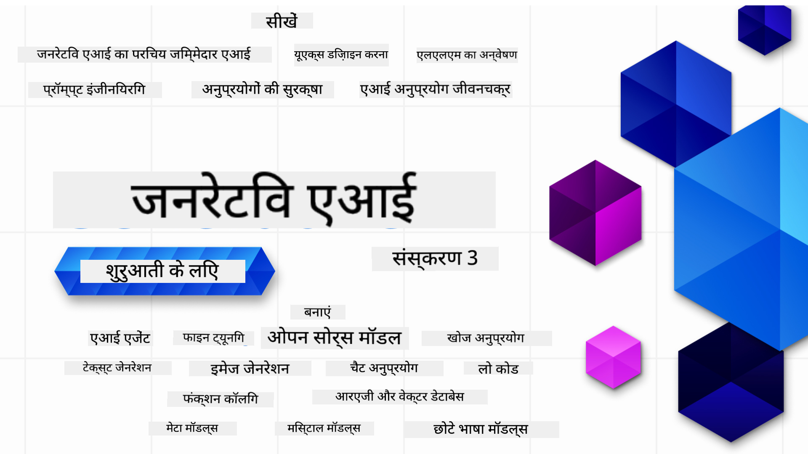

<!--
CO_OP_TRANSLATOR_METADATA:
{
  "original_hash": "6e3f4c8a4f323b8eab1cf11ded304b0f",
  "translation_date": "2025-06-25T07:45:23+00:00",
  "source_file": "README.md",
  "language_code": "hi"
}
-->

### 21 पाठ जो आपको जनरेटिव एआई एप्लिकेशन बनाने की शुरुआत के लिए आवश्यक सभी जानकारी सिखाते हैं

### 🌐 बहु-भाषा समर्थन

#### GitHub Action के माध्यम से समर्थित (स्वचालित और हमेशा अद्यतित)

# शुरुआती लोगों के लिए जनरेटिव AI (संस्करण 3) - एक कोर्स

Microsoft Cloud Advocates द्वारा प्रस्तुत हमारे 21-पाठ के व्यापक पाठ्यक्रम के साथ जनरेटिव AI एप्लिकेशन बनाने की मूल बातें सीखें।

## 🌱 शुरुआत करें

इस कोर्स में 21 पाठ हैं। प्रत्येक पाठ अपने विषय को कवर करता है, इसलिए आप जहां चाहें शुरू कर सकते हैं!

पाठों को "सीखें" के रूप में लेबल किया गया है जो जनरेटिव AI अवधारणा की व्याख्या करते हैं या "बनाएं" पाठ जो एक अवधारणा और कोड उदाहरणों को **Python** और **TypeScript** में समझाते हैं जब संभव हो।

.NET डेवलपर्स के लिए [शुरुआती लोगों के लिए जनरेटिव AI (.NET संस्करण)](https://github.com/microsoft/Generative-AI-for-beginners-dotnet?WT.mc_id=academic-105485-koreyst) देखें!

प्रत्येक पाठ में अतिरिक्त सीखने के उपकरण के साथ "सीखते रहें" अनुभाग भी शामिल है।

## आपको क्या चाहिए
### इस पाठ्यक्रम के कोड को चलाने के लिए, आप इनमें से किसी का उपयोग कर सकते हैं: 
 - [Azure OpenAI सेवा](https://aka.ms/genai-beginners/azure-open-ai?WT.mc_id=academic-105485-koreyst) - **पाठ:** "aoai-assignment"
 - [GitHub मार्केटप्लेस मॉडल कैटलॉग](https://aka.ms/genai-beginners/gh-models?WT.mc_id=academic-105485-koreyst) - **पाठ:** "githubmodels"
 - [OpenAI API](https://aka.ms/genai-beginners/open-ai?WT.mc_id=academic-105485-koreyst) - **पाठ:** "oai-assignment" 
   
- Python या TypeScript की मूल जानकारी सहायक होती है - \*पूर्ण शुरुआती लोगों के लिए ये [Python](https://aka.ms/genai-beginners/python?WT.mc_id=academic-105485-koreyst) और [TypeScript](https://aka.ms/genai-beginners/typescript?WT.mc_id=academic-105485-koreyst) पाठ्यक्रम देखें
- आपके अपने GitHub खाते में इस पूरे रिपॉजिटरी को [fork करने के लिए](https://aka.ms/genai-beginners/github?WT.mc_id=academic-105485-koreyst) एक GitHub खाता

हमने आपके विकास वातावरण को सेटअप करने में मदद के लिए एक **[पाठ्यक्रम सेटअप](./00-course-setup/README.md?WT.mc_id=academic-105485-koreyst)** पाठ तैयार किया है।

बाद में इसे आसानी से खोजने के लिए इस रिपॉजिटरी को [स्टार (🌟) करना](https://docs.github.com/en/get-started/exploring-projects-on-github/saving-repositories-with-stars?WT.mc_id=academic-105485-koreyst) न भूलें।

## 🧠 तैयार हैं तैनाती के लिए?

यदि आप अधिक उन्नत कोड नमूनों की तलाश कर रहे हैं, तो हमारे [जनरेटिव AI कोड नमूनों का संग्रह](https://aka.ms/genai-beg-code?WT.mc_id=academic-105485-koreyst) दोनों **Python** और **TypeScript** में देखें।

## 🗣️ अन्य शिक्षार्थियों से मिलें, समर्थन प्राप्त करें

इस पाठ्यक्रम को ले रहे अन्य शिक्षार्थियों से मिलने और नेटवर्किंग करने और समर्थन प्राप्त करने के लिए हमारे [आधिकारिक Azure AI Foundry Discord सर्वर](https://aka.ms/genai-discord?WT.mc_id=academic-105485-koreyst) में शामिल हों।

हमारे [Azure AI Foundry डेवलपर फोरम](https://aka.ms/azureaifoundry/forum) पर Github में प्रश्न पूछें या उत्पाद प्रतिक्रिया साझा करें।

## 🚀 स्टार्टअप बना रहे हैं?

**मुफ्त OpenAI क्रेडिट** और Azure OpenAI सेवाओं के माध्यम से OpenAI मॉडल तक पहुंचने के लिए Azure क्रेडिट में **$150k तक** प्राप्त करने के लिए [Microsoft for Startups Founders Hub](https://aka.ms/genai-foundershub?WT.mc_id=academic-105485-koreyst) के लिए साइन अप करें।

## 🙏 मदद करना चाहते हैं?

क्या आपके पास सुझाव हैं या वर्तनी या कोड त्रुटियां मिली हैं? [एक मुद्दा उठाएं](https://github.com/microsoft/generative-ai-for-beginners/issues?WT.mc_id=academic-105485-koreyst) या [एक पुल अनुरोध बनाएं](https://github.com/microsoft/generative-ai-for-beginners/pulls?WT.mc_id=academic-105485-koreyst)

## 📂 प्रत्येक पाठ में शामिल हैं:

- विषय का एक संक्षिप्त वीडियो परिचय
- README में स्थित एक लिखित पाठ
- Azure OpenAI और OpenAI API का समर्थन करने वाले Python और TypeScript कोड नमूने
- आपकी सीखने को जारी रखने के लिए अतिरिक्त संसाधनों के लिंक

## 🗃️ पाठ

| #   | **पाठ लिंक**                                                                                                                              | **विवरण**                                                                                 | **वीडियो**                                                                   | **अतिरिक्त सीखने**                                                             |
| --- | -------------------------------------------------------------------------------------------------------------------------------------------- | ----------------------------------------------------------------------------------------------- | --------------------------------------------------------------------------- | ------------------------------------------------------------------------------ |
| 00  | [पाठ्यक्रम सेटअप](./00-course-setup/README.md?WT.mc_id=academic-105485-koreyst)                                                                 | **सीखें:** अपने विकास वातावरण को कैसे सेटअप करें                                            | वीडियो जल्द ही आ रहा है                                                                 | [अधिक जानें](https://aka.ms/genai-collection?WT.mc_id=academic-105485-koreyst) |
| 01  | [जनरेटिव AI और LLMs का परिचय](./01-introduction-to-genai/README.md?WT.mc_id=academic-105485-koreyst)                              | **सीखें:** जनरेटिव AI क्या है और बड़े भाषा मॉडल (LLMs) कैसे काम करते हैं, इसे समझना       | [वीडियो](https://aka.ms/gen-ai-lesson-1-gh?WT.mc_id=academic-105485-koreyst) | [अधिक जानें](https://aka.ms/genai-collection?WT.mc_id=academic-105485-koreyst) |
| 02  | [विभिन्न LLMs की खोज और तुलना](./02-exploring-and-comparing-different-llms/README.md?WT.mc_id=academic-105485-koreyst)             | **सीखें:** अपने उपयोग मामले के लिए सही मॉडल का चयन कैसे करें                                      | [वीडियो](https://aka.ms/gen-ai-lesson2-gh?WT.mc_id=academic-105485-koreyst)  | [अधिक जानें](https://aka.ms/genai-collection?WT.mc_id=academic-105485-koreyst) |
| 03  | [जनरेटिव AI का जिम्मेदारी से उपयोग करना](./03-using-generative-ai-responsibly/README.md?WT.mc_id=academic-105485-koreyst)                           | **सीखें:** जिम्मेदारी से जनरेटिव AI एप्लिकेशन कैसे बनाएं                                  | [वीडियो](https://aka.ms/gen-ai-lesson3-gh?WT.mc_id=academic-105485-koreyst)  | [अधिक जानें](https://aka.ms/genai-collection?WT.mc_id=academic-105485-koreyst) |
| 04  | [प्रॉम्प्ट इंजीनियरिंग की मूल बातें समझना](./04-prompt-engineering-fundamentals/README.md?WT.mc_id=academic-105485-koreyst)             | **सीखें:** प्रॉम्प्ट इंजीनियरिंग सर्वोत्तम प्रथाओं का व्यावहारिक अनुभव                                           | [वीडियो](https://aka.ms/gen-ai-lesson4-gh?WT.mc_id=academic-105485-koreyst)  | [अधिक जानें](https://aka.ms/genai-collection?WT.mc_id=academic-105485-koreyst) |
| 05  | [उन्नत प्रॉम्प्ट्स बनाना](./05-advanced-prompts/README.md?WT.mc_id=academic-105485-koreyst)                                                | **सीखें:** उन प्रॉम्प्ट इंजीनियरिंग तकनीकों को कैसे लागू करें जो आपके प्रॉम्प्ट्स के परिणाम को सुधारते हैं। | [वीडियो](https://aka.ms/gen-ai-lesson5-gh?WT.mc_id=academic-105485-koreyst)  | [अधिक जानें](https://aka.ms/genai-collection?WT.mc_id=academic-105485-koreyst) |
| 06  | [टेक्स्ट जनरेशन एप्लिकेशन बनाना](./06-text-generation-apps/README.md?WT.mc_id=academic-105485-koreyst)                                | **बनाएं:** Azure OpenAI / OpenAI API का उपयोग करके एक टेक्स्ट जनरेशन ऐप                                | [वीडियो](https://aka.ms/gen-ai-lesson6-gh?WT.mc_id=academic-105485-koreyst)  | [अधिक जानें](https://aka.ms/genai-collection?WT.mc_id=academic-105485-koreyst) |
| 07  | [चैट एप्लिकेशन बनाना](./07-building-chat-applications/README.md?WT.mc_id=academic-105485-koreyst)                                     | **बनाएं:** चैट एप्लिकेशन को कुशलतापूर्वक बनाने और एकीकृत करने की तकनीकें।               | [वीडियो](https://aka.ms/gen-ai-lessons7-gh?WT.mc_id=academic-105485-koreyst) | [अधिक जानें](https://aka.ms/genai-collection?WT.mc_id=academic-105485-koreyst) |
| 08  | [सर्च ऐप्स वेक्टर डेटाबेस बनाना](./08-building-search-applications/README.md?WT.mc_id=academic-105485-koreyst)                        | **बनाएं:** एक सर्च एप्लिकेशन जो डेटा खोजने के लिए एम्बेडिंग्स का उपयोग करता है।                        | [वीडियो](https://aka.ms/gen-ai-lesson8-gh?WT.mc_id=academic-105485-koreyst)  | [अधिक जानें](https://aka.ms/genai-collection?WT.mc_id=academic-105485-koreyst) |
| 09  | [इमेज जनरेशन एप्लिकेशन बनाना](./09-building-image-applications/README.md?WT.mc_id=academic-105485-koreyst)                        | **बनाएं:** एक इमेज जनरेशन एप्लिकेशन                                                       | [वीडियो](https://aka.ms/gen-ai-lesson9-gh?WT.mc_id=academic-105485-koreyst)  | [अधिक जानें](https://aka.ms/genai-collection?WT.mc_id=academic-105485-koreyst) |
| 10  | [लो कोड AI एप्लिकेशन बनाना](./10-building-low-code-ai-applications/README.md?WT.mc_id=academic-105485-koreyst)                       | **बनाएं:** लो कोड टूल्स का उपयोग करके एक जनरेटिव AI एप्लिकेशन                                     | [वीडियो](https://aka.ms/gen-ai-lesson10-gh?WT.mc_id=academic-105485-koreyst) | [अधिक जानें](https://aka.ms/genai-collection?WT.mc_id=academic-105485-koreyst) |
| 11  | [फंक्शन कॉलिंग के साथ बाहरी एप्लिकेशन को एकीकृत करना](./11-integrating-with-function-calling/README.md?WT.mc_id=academic-105485-koreyst) | **बनाएं:** फंक्शन कॉलिंग क्या है और एप्लिकेशन के लिए इसके उपयोग के मामले                          | [वीडियो](https://aka.ms/gen-ai-lesson11-gh?WT.mc_id=academic-105485-koreyst) | [अधिक जानें](https://aka.ms/genai-collection?WT.mc_id=academic-105485-koreyst) |
| 12  | [AI एप्लिकेशन के लिए UX डिजाइन करना](./12-designing-ux-for-ai-applications/README.md?WT.mc_id=academic-105485-koreyst)                         | **सीखें:** जनरेटिव AI एप्लिकेशन विकसित करते समय UX डिजाइन सिद्धांतों को कैसे लागू करें         | [वीडियो](https://aka.ms/gen-ai-lesson12-gh?WT.mc_id=academic-105485-koreyst) | [अधिक जानें](https://aka.ms/genai-collection?WT.mc_id=academic-105485-koreyst) |
| 13  | [अपने जनरेटिव AI एप्लिकेशन को सुरक्षित करना](./13-securing-ai-applications/README.md?WT.mc_id=academic-105485-koreyst)                         | **सीखें:** AI सिस्टम के खतरों और जोखिमों के बारे में और इन सिस्टमों को सुरक्षित करने के तरीके।             | [वीडियो](https://aka.ms/gen-ai-lesson13-gh?WT.mc_id=academic-105485-koreyst) | [अधिक जानें](https://aka.ms/genai-collection?WT.mc_id=academic-105485-koreyst) |
| 14  | [जनरेटिव AI एप्लिकेशन जीवनचक्र](./14-the-generative-ai-application-lifecycle/README.md?WT.mc_id=academic-105485-koreyst)           | **सीखें:** LLM जीवनचक्र और LLMOps को प्रबंधित करने के लिए उपकरण और मेट्रिक्स                         | [वीडियो](https://aka.ms/gen-ai-lesson14-gh?WT.mc_id=academic-105485-koreyst) | [अधिक जानें](https://aka.ms/genai-collection?WT.mc_id=academic-105485-koreyst) |
| 15  | [रिकवरी ऑग्मेंटेड जेनरेशन (RAG) और वेक्टर डेटाबेस](./15-rag-and-vector-databases/README.md?WT.mc_id=academic-105485-koreyst)        | **निर्माण:** वेक्टर डेटाबेस से एम्बेडिंग्स प्राप्त करने के लिए एक RAG फ्रेमवर्क का उपयोग करके एक एप्लिकेशन बनाएं  | [वीडियो](https://aka.ms/gen-ai-lesson15-gh?WT.mc_id=academic-105485-koreyst) | [अधिक जानें](https://aka.ms/genai-collection?WT.mc_id=academic-105485-koreyst) |
| 16  | [ओपन सोर्स मॉडल्स और हगिंग फेस](./16-open-source-models/README.md?WT.mc_id=academic-105485-koreyst)                                    | **निर्माण:** हगिंग फेस पर उपलब्ध ओपन सोर्स मॉडल्स का उपयोग करके एक एप्लिकेशन बनाएं                    | [वीडियो](https://aka.ms/gen-ai-lesson16-gh?WT.mc_id=academic-105485-koreyst) | [अधिक जानें](https://aka.ms/genai-collection?WT.mc_id=academic-105485-koreyst) |
| 17  | [एआई एजेंट्स](./17-ai-agents/README.md?WT.mc_id=academic-105485-koreyst)                                                                       | **निर्माण:** एक एआई एजेंट फ्रेमवर्क का उपयोग करके एक एप्लिकेशन बनाएं                                           | [वीडियो](https://aka.ms/gen-ai-lesson17-gh?WT.mc_id=academic-105485-koreyst) | [अधिक जानें](https://aka.ms/genai-collection?WT.mc_id=academic-105485-koreyst) |
| 18  | [एलएलएम का फाइन-ट्यूनिंग](./18-fine-tuning/README.md?WT.mc_id=academic-105485-koreyst)                                                              | **जानें:** एलएलएम के फाइन-ट्यूनिंग का क्या, क्यों और कैसे                                            | [वीडियो](https://aka.ms/gen-ai-lesson18-gh?WT.mc_id=academic-105485-koreyst) | [अधिक जानें](https://aka.ms/genai-collection?WT.mc_id=academic-105485-koreyst) |
| 19  | [एसएलएम के साथ निर्माण](./19-slm/README.md?WT.mc_id=academic-105485-koreyst)                                                              | **जानें:** छोटे भाषा मॉडल्स के साथ निर्माण के लाभ                                            | वीडियो जल्द आ रहा है | [अधिक जानें](https://aka.ms/genai-collection?WT.mc_id=academic-105485-koreyst) |
| 20  | [मिस्ट्रल मॉडल्स के साथ निर्माण](./20-mistral/README.md?WT.mc_id=academic-105485-koreyst)                                                              | **जानें:** मिस्ट्रल परिवार मॉडल्स की विशेषताएँ और अंतर                                           | वीडियो जल्द आ रहा है | [अधिक जानें](https://aka.ms/genai-collection?WT.mc_id=academic-105485-koreyst) |
| 21  | [मेटा मॉडल्स के साथ निर्माण](./21-meta/README.md?WT.mc_id=academic-105485-koreyst)                                                              | **जानें:** मेटा परिवार मॉडल्स की विशेषताएँ और अंतर                                           | वीडियो जल्द आ रहा है | [अधिक जानें](https://aka.ms/genai-collection?WT.mc_id=academic-105485-koreyst) |

### 🌟 विशेष धन्यवाद

विशेष धन्यवाद [**जॉन अज़ीज़**](https://www.linkedin.com/in/john0isaac/) को, जिन्होंने सभी GitHub Actions और वर्कफ़्लोज़ बनाए

[**बर्नहार्ड मर्कले**](https://www.linkedin.com/in/bernhard-merkle-738b73/) को, जिन्होंने प्रत्येक पाठ में महत्वपूर्ण योगदान दिया ताकि शिक्षार्थी और कोड अनुभव को बेहतर बनाया जा सके।

## 🎒 अन्य पाठ्यक्रम

हमारी टीम अन्य पाठ्यक्रम भी बनाती है! देखें:

- [**नया** शुरुआती के लिए मॉडल संदर्भ प्रोटोकॉल](https://github.com/microsoft/mcp-for-beginners?WT.mc_id=academic-105485-koreyst)
- [शुरुआती के लिए एआई एजेंट्स](https://github.com/microsoft/ai-agents-for-beginners?WT.mc_id=academic-105485-koreyst)
- [.NET का उपयोग करके शुरुआती के लिए जनरेटिव एआई](https://github.com/microsoft/Generative-AI-for-beginners-dotnet?WT.mc_id=academic-105485-koreyst)
- [जावास्क्रिप्ट का उपयोग करके शुरुआती के लिए जनरेटिव एआई](https://aka.ms/genai-js-course?WT.mc_id=academic-105485-koreyst)
- [शुरुआती के लिए मशीन लर्निंग](https://aka.ms/ml-beginners?WT.mc_id=academic-105485-koreyst)
- [शुरुआती के लिए डेटा विज्ञान](https://aka.ms/datascience-beginners?WT.mc_id=academic-105485-koreyst)
- [शुरुआती के लिए एआई](https://aka.ms/ai-beginners?WT.mc_id=academic-105485-koreyst)
- [शुरुआती के लिए साइबर सुरक्षा](https://github.com/microsoft/Security-101??WT.mc_id=academic-96948-sayoung)
- [शुरुआती के लिए वेब विकास](https://aka.ms/webdev-beginners?WT.mc_id=academic-105485-koreyst)
- [शुरुआती के लिए IoT](https://aka.ms/iot-beginners?WT.mc_id=academic-105485-koreyst)
- [शुरुआती लोगों के लिए XR विकास](https://github.com/microsoft/xr-development-for-beginners?WT.mc_id=academic-105485-koreyst)
- [AI जोड़ी प्रोग्रामिंग के लिए GitHub Copilot में महारत हासिल करें](https://aka.ms/GitHubCopilotAI?WT.mc_id=academic-105485-koreyst)
- [C#/.NET डेवलपर्स के लिए GitHub Copilot में महारत हासिल करें](https://github.com/microsoft/mastering-github-copilot-for-dotnet-csharp-developers?WT.mc_id=academic-105485-koreyst)
- [अपना खुद का Copilot एडवेंचर चुनें](https://github.com/microsoft/CopilotAdventures?WT.mc_id=academic-105485-koreyst)

**अस्वीकरण**:  
यह दस्तावेज़ AI अनुवाद सेवा [Co-op Translator](https://github.com/Azure/co-op-translator) का उपयोग करके अनुवादित किया गया है। जबकि हम सटीकता के लिए प्रयास करते हैं, कृपया ध्यान दें कि स्वचालित अनुवाद में त्रुटियाँ या अशुद्धियाँ हो सकती हैं। इसकी मूल भाषा में मूल दस्तावेज़ को अधिकारिक स्रोत माना जाना चाहिए। महत्वपूर्ण जानकारी के लिए, पेशेवर मानव अनुवाद की सिफारिश की जाती है। इस अनुवाद के उपयोग से उत्पन्न किसी भी गलतफहमी या गलत व्याख्या के लिए हम उत्तरदायी नहीं हैं।