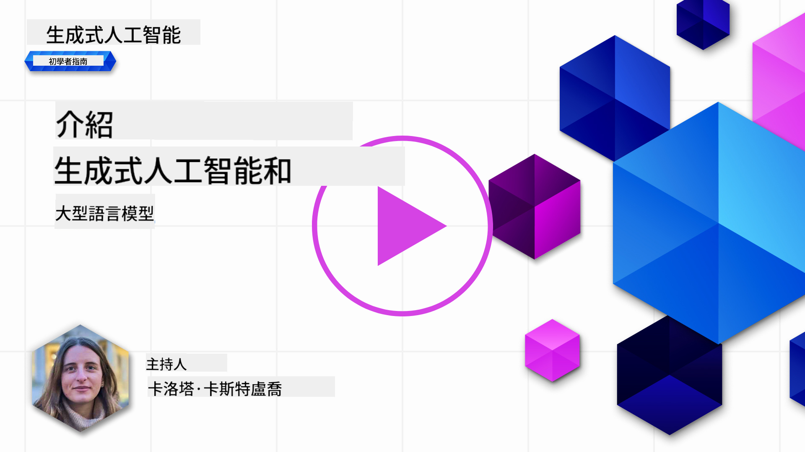
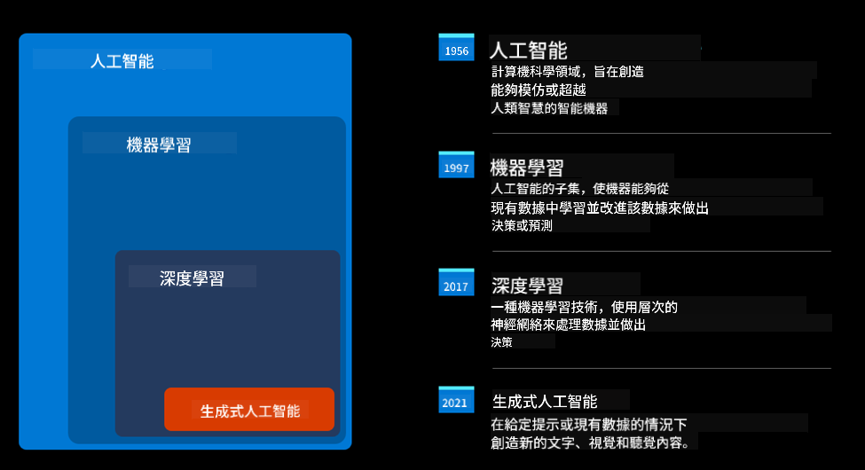
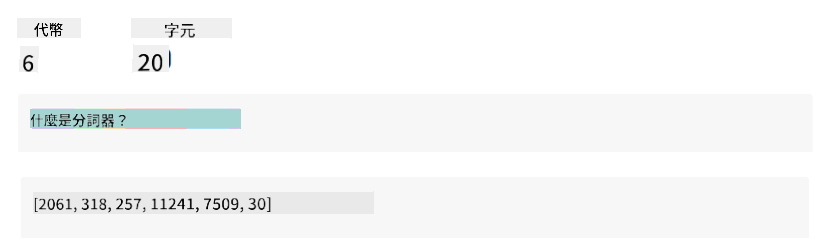
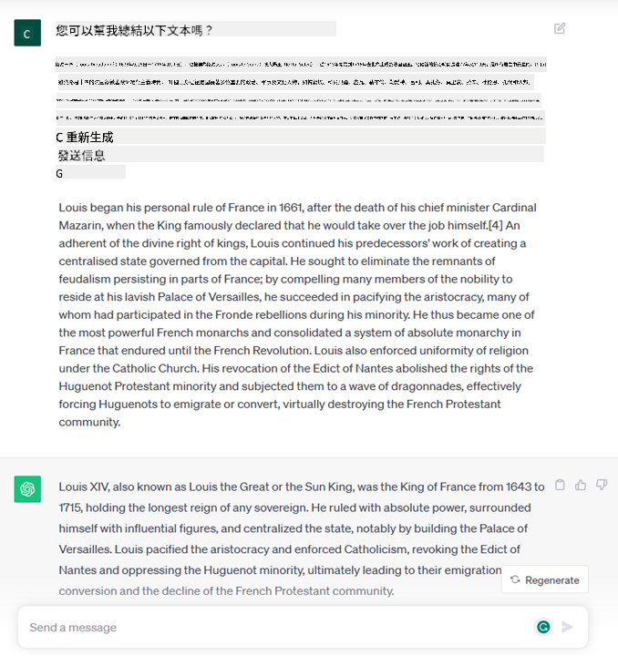
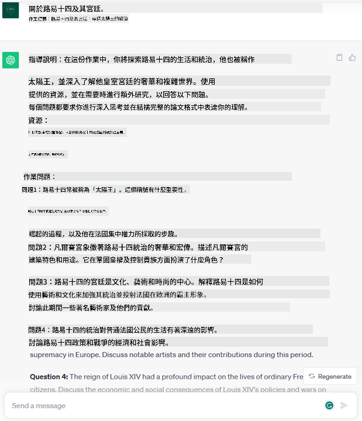
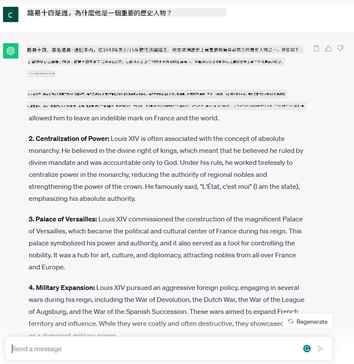
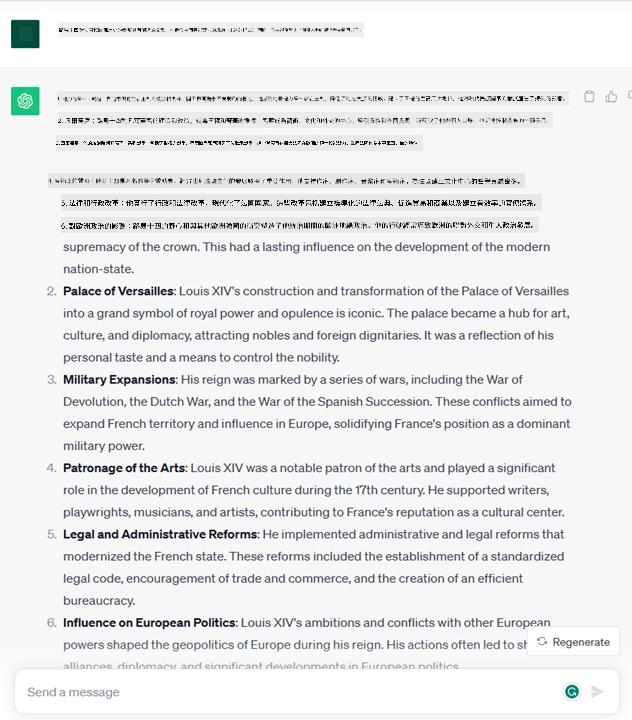
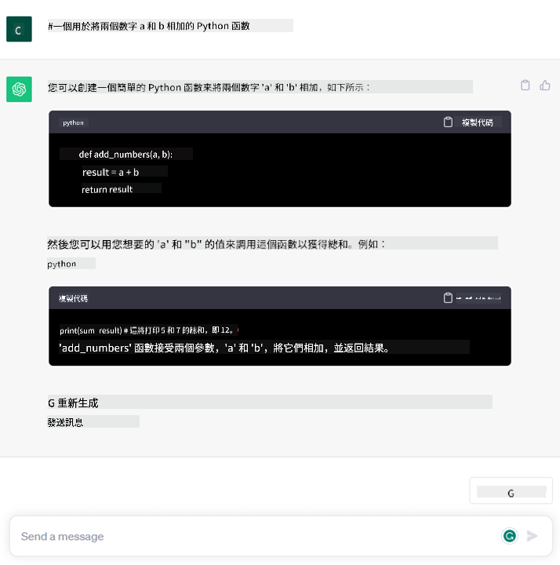

<!--
CO_OP_TRANSLATOR_METADATA:
{
  "original_hash": "f53ba0fa49164f9323043f1c6b11f2b1",
  "translation_date": "2025-06-25T09:41:02+00:00",
  "source_file": "01-introduction-to-genai/README.md",
  "language_code": "hk"
}
-->
# 生成式人工智能與大型語言模型簡介

_（點擊上方圖片觀看本課程影片）_

生成式人工智能是一種能夠生成文本、圖像和其他類型內容的人工智能技術。這項技術的奇妙之處在於它讓人工智能普及化，任何人只需使用一個文本提示，即可用自然語言寫出一句話。您不需要學習像 Java 或 SQL 這樣的語言來完成有意義的事情，只需使用您的語言，說明您的需求，人工智能模型就會給出建議。這項技術的應用和影響非常大，您可以在幾秒鐘內撰寫或理解報告、編寫應用程式等。

在這個課程中，我們將探討我們的初創公司如何利用生成式人工智能在教育領域中開啟新的場景，以及如何應對其應用帶來的社會影響和技術限制的挑戰。

## 簡介

本課程將涵蓋：

- 業務場景簡介：我們的初創公司理念和使命。
- 生成式人工智能以及我們如何達到當前技術格局。
- 大型語言模型的內部運作。
- 大型語言模型的主要能力和實際應用案例。

## 學習目標

完成本課程後，您將了解：

- 什麼是生成式人工智能以及大型語言模型如何運作。
- 如何利用大型語言模型進行不同的應用，重點關注教育場景。

## 場景：我們的教育初創公司

生成式人工智能代表著人工智能技術的巔峰，推動著曾被認為不可能的界限。生成式人工智能模型具有多種能力和應用，但在本課程中，我們將探討它如何通過虛構的初創公司革新教育。我們將這家初創公司稱為 _我們的初創公司_。我們的初創公司在教育領域運作，並擁有一個雄心勃勃的使命聲明：

> _改善全球學習的可及性，確保公平的教育機會，並根據每位學習者的需求提供個性化學習體驗。_

我們的初創公司團隊知道，如果不利用當代最強大的工具之一——大型語言模型（LLM），我們將無法實現這一目標。

生成式人工智能預計將革新我們今天的學習和教學方式，學生可以隨時獲得虛擬老師的幫助，提供大量信息和範例，而老師則可以利用創新的工具來評估學生並給予反饋。

首先，讓我們定義一些我們將在整個課程中使用的基本概念和術語。

## 我們是如何獲得生成式人工智能的？

儘管最近生成式人工智能模型的宣佈引起了極大的關注，這項技術已經醞釀了數十年，最早的研究可以追溯到60年代。我們現在處於一個人工智能具有人類認知能力的階段，例如 [OpenAI ChatGPT](https://openai.com/chatgpt) 或 [Bing Chat](https://www.microsoft.com/edge/features/bing-chat?WT.mc_id=academic-105485-koreyst)，這些技術也使用了 GPT 模型進行網絡搜索的 Bing 對話。

回溯到最初，人工智能的原型是打字機聊天機器人，依賴於從一組專家中提取的知識庫並在計算機中表示。知識庫中的答案由輸入文本中出現的關鍵詞觸發。然而，很快就發現這種使用打字機聊天機器人的方法無法很好地擴展。

### 統計方法：機器學習

轉折點出現在90年代，應用統計方法進行文本分析。這導致了新算法的開發——稱為機器學習——能夠從數據中學習模式，而不需要明確編程。這種方法允許機器模擬人類語言理解：統計模型在文本-標籤配對上進行訓練，使模型能夠使用預定義的標籤分類未知的輸入文本，代表消息的意圖。

### 神經網絡與現代虛擬助手

近年來，能夠處理更大量數據和更複雜計算的硬件技術的進步，促進了人工智能的研究，導致了被稱為神經網絡或深度學習算法的先進機器學習算法的發展。

神經網絡（特別是循環神經網絡 – RNNs）顯著增強了自然語言處理，能夠更有意義地表示文本的含義，重視句子中詞語的上下文。

這就是在新世紀的第一個十年誕生的虛擬助手的技術，它們非常擅長解釋人類語言，識別需求，並執行滿足需求的動作——例如使用預定義的腳本回答或消費第三方服務。

### 現在，生成式人工智能

這就是我們今天如何來到生成式人工智能的，它可以被視為深度學習的一個子集。

在人工智能領域經過數十年的研究後，一種新的模型架構——稱為 _Transformer_——克服了 RNNs 的限制，能夠接受更長的文本序列作為輸入。Transformers 基於注意力機制，使模型能夠給予接收到的輸入不同的權重，‘更關注’最相關的信息集中處，而不考慮其在文本序列中的順序。

大多數最近的生成式人工智能模型——也被稱為大型語言模型（LLMs），因為它們處理文本輸入和輸出——確實基於這種架構。這些模型的有趣之處在於——它們在大量未標記的數據上進行訓練，來源多樣，如書籍、文章和網站——它們可以適應多種任務，並生成具有創意的語法正確的文本。因此，它們不僅極大地增強了機器‘理解’輸入文本的能力，還使其能夠以人類語言生成原創的回應。

## 大型語言模型如何運作？

在下一章中，我們將探討不同類型的生成式人工智能模型，但現在讓我們看看大型語言模型如何運作，重點關注 OpenAI GPT（生成預訓練 Transformer）模型。

- **分詞器，文本轉數字**：大型語言模型接收文本作為輸入，並生成文本作為輸出。然而，作為統計模型，它們在處理數字而不是文本序列時效果更好。因此，每個輸入在被核心模型使用之前都會由分詞器處理。Token 是一段文本——由可變數量的字符組成，因此分詞器的主要任務是將輸入拆分為一個 Token 陣列。然後，每個 Token 都會映射到一個 Token 索引，即原始文本塊的整數編碼。

- **預測輸出 Token**：給定 n 個 Token 作為輸入（最大 n 隨模型而異），模型能夠預測一個 Token 作為輸出。這個 Token 然後被納入下一次迭代的輸入中，以擴展窗口模式進行，提供更好的用戶體驗，得到一個（或多個）句子作為答案。這解釋了為什麼，如果您曾使用 ChatGPT，您可能注意到有時它看起來像是在句子中途停下來。

- **選擇過程，概率分佈**：輸出 Token 是根據其在當前文本序列之後出現的概率由模型選擇的。這是因為模型根據其訓練預測所有可能‘下一個 Token’的概率分佈。然而，從結果分佈中並不總是選擇概率最高的 Token。在這個選擇中添加了一定程度的隨機性，以便模型以非確定性方式行事——我們不會對相同的輸入獲得完全相同的輸出。這種隨機性程度是為了模擬創造性思維過程，並且可以通過一個稱為溫度的模型參數來調整。

## 我們的初創公司如何利用大型語言模型？

現在我們對大型語言模型的內部運作有了更好的理解，讓我們看看一些它們能夠執行得相當好的常見任務的實際例子，並關注我們的業務場景。我們說過，大型語言模型的主要能力是_從零開始生成文本，從用自然語言寫的文本輸入開始_。

但這種文本輸入和輸出是什麼樣的？
大型語言模型的輸入稱為提示，而輸出稱為完成，這個術語指的是模型生成下一個 Token 以完成當前輸入的機制。我們將深入探討什麼是提示以及如何設計它以最大限度地利用我們的模型。但現在，我們只需說提示可以包括：

- 指定我們期望模型生成的輸出類型的**指令**。這些指令有時可能包含一些示例或一些附加數據。

  1. 文章、書籍、產品評論等的摘要，以及從非結構化數據中提取見解。
    
    
  
  2. 創意構思和設計文章、論文、作業或更多。
      
     

- 以與代理對話的形式提出的**問題**。
  
  

- 一段**待完成的文本**，這隱含地要求寫作協助。
  
  

- 一段**代碼**以及要求解釋和記錄的請求，或者要求生成執行特定任務的代碼片段的評論。
  
  

以上示例相對簡單，並不旨在全面展示大型語言模型的能力。它們旨在展示生成式人工智能的潛力，特別是在但不限於教育背景下。

此外，生成式人工智能模型的輸出並不完美，有時模型的創造力可能會反過來對其產生不利影響，導致輸出是一組詞語的組合，人類用戶可以將其解釋為對現實的曲解，或者它可能是冒犯性的。生成式人工智能並不智能——至少在更全面的智能定義中，包括批判性和創造性推理或情感智能；它不是確定性的，也不值得信賴，因為錯誤的參考、內容和陳述可能與正確的信息結合在一起，以說服性和自信的方式呈現。在接下來的課程中，我們將處理所有這些限制，並看看我們可以做些什麼來減輕它們。

## 作業

您的作業是閱讀更多有關[生成式人工智能](https://en.wikipedia.org/wiki/Generative_artificial_intelligence?WT.mc_id=academic-105485-koreyst)的資料，並嘗試識別一個您希望今天添加生成式人工智能但尚未使用的領域。這與以"舊方式"做事有何不同的影響，您能夠做一些以前無法做到的事情，還是速度更快？撰寫一篇300字的總結，描述您夢想的人工智能初創公司會是什麼樣子，並包含"問題"、"我會如何使用人工智能"、"影響"和（可選）商業計劃等標題。

如果您完成了這項任務，您甚至可能準備好申請微軟的孵化器，[Microsoft for Startups Founders Hub](https://www.microsoft.com/startups?WT.mc_id=academic-105485-koreyst)，我們提供 Azure、OpenAI、指導等方面的支持，來看看吧！

## 知識檢查

關於大型語言模型，什麼是正確的？

1. 每次都會得到完全相同的回應。
1. 它完美地執行任務，擅長加法、生成可運行的代碼等。
1. 儘管使用相同的提示，回應可能會有所不同。它也非常擅長給您某些內容的初稿，無論是文本還是代碼。但您需要改進結果。

答：3，LLM 是非確定性的，回應會有所不同，然而，您可以通過溫度設置來控制其變異。您也不應期望它完美地執行任務，它在這裡為您做繁重的工作，這通常意味著您會得到一個不錯的初次嘗試，需要逐步改進。

## 做得好！繼續旅程

完成本課程後，請查看我們的[生成式人工智能學習集合](https://aka.ms/genai-collection?WT.mc_id=academic-105485-koreyst)以繼續提升您的生成式人工智能知識！

前往第2課，我們將研究如何[探索和比較不同的 LLM 類型](../02-exploring-and-comparing-different-llms/README.md?WT.mc_id=academic-105485-koreyst)！

**免責聲明**：  
本文件已使用 AI 翻譯服務 [Co-op Translator](https://github.com/Azure/co-op-translator) 進行翻譯。我們努力確保準確性，但請注意，自動翻譯可能包含錯誤或不準確之處。應將原文檔的母語版本視為權威來源。對於關鍵信息，建議使用專業的人力翻譯。我們對因使用此翻譯而引起的任何誤解或誤釋不承擔責任。