<!--
CO_OP_TRANSLATOR_METADATA:
{
  "original_hash": "e2f686f2eb794941761252ac5e8e090b",
  "translation_date": "2025-05-19T13:48:38+00:00",
  "source_file": "02-exploring-and-comparing-different-llms/README.md",
  "language_code": "hk"
}
-->
# 探索和比較不同的 LLMs

[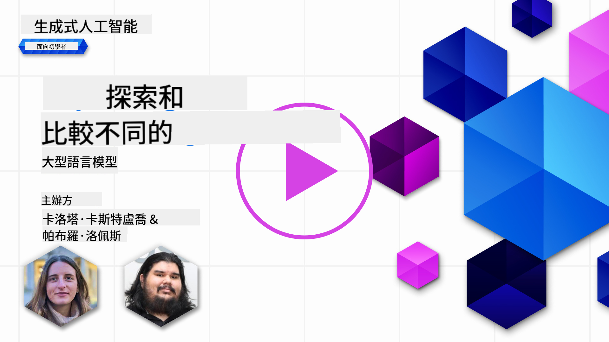](https://aka.ms/gen-ai-lesson2-gh?WT.mc_id=academic-105485-koreyst)

> _點擊上面的圖片觀看這節課的視頻_

在上一節課中，我們已經看到生成式 AI 如何改變科技領域，了解大型語言模型（LLMs）的運作方式，以及像我們的初創公司這樣的企業如何應用它們來拓展業務！在這一章中，我們將比較和對比不同類型的大型語言模型（LLMs），以了解它們的優缺點。

我們初創公司的下一步是探索當前的 LLMs 版圖，並了解哪些適合我們的使用案例。

## 介紹

這節課將涵蓋：

- 當前版圖中的不同類型的 LLMs。
- 在 Azure 中測試、迭代和比較不同模型以滿足您的使用案例。
- 如何部署 LLM。

## 學習目標

完成這節課後，您將能夠：

- 為您的使用案例選擇合適的模型。
- 了解如何測試、迭代和提高模型的性能。
- 知道企業如何部署模型。

## 了解不同類型的 LLMs

LLMs 可以根據其架構、訓練數據和使用案例進行多種分類。了解這些差異將幫助我們的初創公司選擇適合情境的模型，並了解如何測試、迭代和提高性能。

有許多不同類型的 LLM 模型，您選擇的模型取決於您希望使用它們的目的、您的數據、您願意支付的費用等。

根據您是否希望使用模型進行文本、音頻、視頻、圖像生成等，您可能會選擇不同類型的模型。

- **音頻和語音識別**。Whisper 類型的模型是一個很好的選擇，因為它們是通用的，旨在進行語音識別。它訓練於多樣的音頻，可以進行多語言語音識別。了解更多關於 [Whisper 類型模型](https://platform.openai.com/docs/models/whisper?WT.mc_id=academic-105485-koreyst)。

- **圖像生成**。對於圖像生成，DALL-E 和 Midjourney 是兩個非常知名的選擇。DALL-E 由 Azure OpenAI 提供。[閱讀更多關於 DALL-E](https://platform.openai.com/docs/models/dall-e?WT.mc_id=academic-105485-koreyst) 以及本課程的第 9 章。

- **文本生成**。大多數模型都訓練於文本生成，您有很多選擇，從 GPT-3.5 到 GPT-4。它們的成本不同，其中 GPT-4 是最昂貴的。值得看看 [Azure OpenAI playground](https://oai.azure.com/portal/playground?WT.mc_id=academic-105485-koreyst) 來評估哪些模型在能力和成本方面最適合您的需求。

- **多模態**。如果您希望在輸入和輸出中處理多種類型的數據，您可能需要查看像 [gpt-4 turbo with vision or gpt-4o](https://learn.microsoft.com/azure/ai-services/openai/concepts/models#gpt-4-and-gpt-4-turbo-models?WT.mc_id=academic-105485-koreyst) 這樣的模型——最新的 OpenAI 模型——它們能夠將自然語言處理與視覺理解結合，實現通過多模態界面的交互。

選擇模型意味著您獲得了一些基本功能，但這可能還不夠。通常，您有公司特定的數據，您需要以某種方式告訴 LLM。有幾種不同的方法可以處理這個問題，更多內容在接下來的部分中。

### 基礎模型與 LLMs

基礎模型這個詞是由 [斯坦福研究人員提出的](https://arxiv.org/abs/2108.07258?WT.mc_id=academic-105485-koreyst)，並定義為一種滿足某些標準的 AI 模型，例如：

- **它們是使用無監督學習或自監督學習訓練的**，這意味著它們在未標記的多模態數據上訓練，不需要人工註釋或標記數據。
- **它們是非常大的模型**，基於非常深的神經網絡，訓練於數十億個參數。
- **它們通常旨在作為其他模型的“基礎”**，這意味著它們可以用作其他模型的起點，可以通過微調來實現。

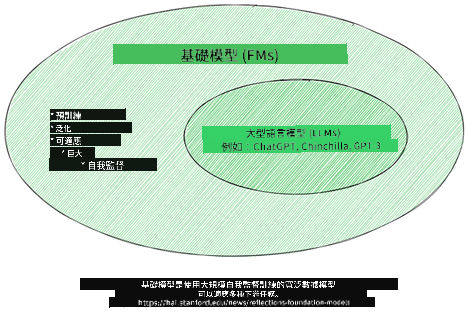

圖片來源：[Essential Guide to Foundation Models and Large Language Models | by Babar M Bhatti | Medium](https://thebabar.medium.com/essential-guide-to-foundation-models-and-large-language-models-27dab58f7404)

為了進一步澄清這一區別，讓我們以 ChatGPT 為例。要構建 ChatGPT 的第一個版本，使用了一個名為 GPT-3.5 的模型作為基礎模型。這意味著 OpenAI 使用了一些特定於聊天的數據來創建一個專門針對對話場景（如聊天機器人）的 GPT-3.5 調整版本。

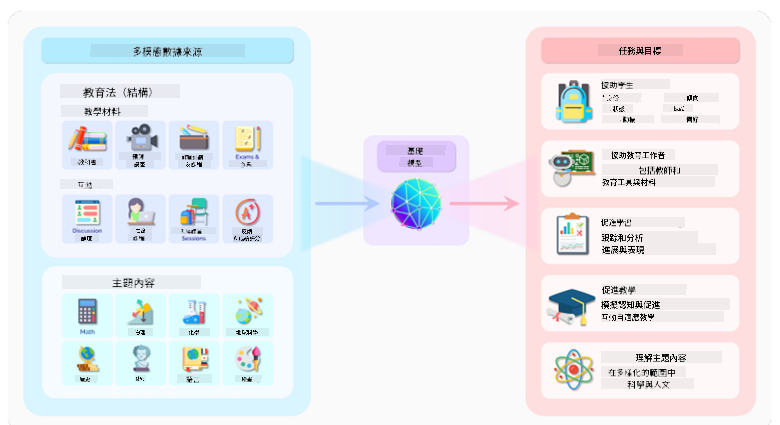

圖片來源：[2108.07258.pdf (arxiv.org)](https://arxiv.org/pdf/2108.07258.pdf?WT.mc_id=academic-105485-koreyst)

### 開源與專有模型

另一種分類 LLMs 的方式是它們是開源的還是專有的。

開源模型是公開提供給公眾的模型，任何人都可以使用。它們通常由創建它們的公司或研究社區提供。這些模型可以被檢查、修改和定制以滿足 LLMs 的各種使用案例。然而，它們並不總是為生產用途優化的，性能可能不如專有模型。此外，開源模型的資金可能有限，可能不會長期維護或更新最新的研究。流行的開源模型例子包括 [Alpaca](https://crfm.stanford.edu/2023/03/13/alpaca.html?WT.mc_id=academic-105485-koreyst)、[Bloom](https://huggingface.co/bigscience/bloom) 和 [LLaMA](https://llama.meta.com)。

專有模型是由公司擁有的模型，不向公眾提供。這些模型通常為生產用途優化。然而，它們不允許被檢查、修改或定制以滿足不同的使用案例。此外，它們不一定是免費提供的，可能需要訂閱或付費使用。此外，用戶無法控制用於訓練模型的數據，這意味著他們應該信任模型擁有者來確保數據隱私和負責任的 AI 使用。流行的專有模型例子包括 [OpenAI models](https://platform.openai.com/docs/models/overview?WT.mc_id=academic-105485-koreyst)、[Google Bard](https://sapling.ai/llm/bard?WT.mc_id=academic-105485-koreyst) 或 [Claude 2](https://www.anthropic.com/index/claude-2?WT.mc_id=academic-105485-koreyst)。

### 嵌入與圖像生成與文本和代碼生成

LLMs 也可以根據它們生成的輸出進行分類。

嵌入是一組模型，可以將文本轉換為數字形式，稱為嵌入，這是輸入文本的數字表示。嵌入使機器更容易理解單詞或句子之間的關係，可以被其他模型（如分類模型或在數據上性能更好的聚類模型）作為輸入使用。嵌入模型通常用於遷移學習，其中模型是為一個有大量數據的代理任務構建的，然後模型權重（嵌入）被重新用於其他下游任務。這一類的例子是 [OpenAI embeddings](https://platform.openai.com/docs/models/embeddings?WT.mc_id=academic-105485-koreyst)。

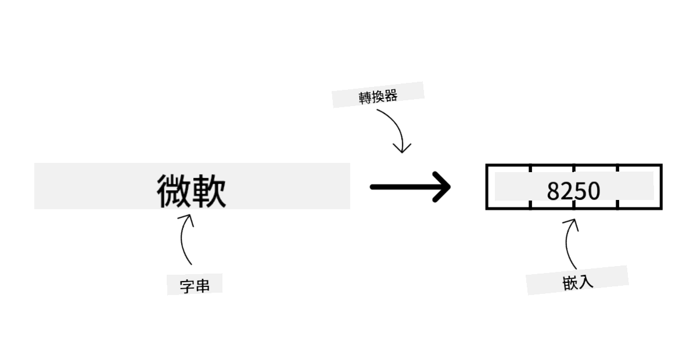

圖像生成模型是生成圖像的模型。這些模型通常用於圖像編輯、圖像合成和圖像翻譯。圖像生成模型通常訓練於大型圖像數據集上，如 [LAION-5B](https://laion.ai/blog/laion-5b/?WT.mc_id=academic-105485-koreyst)，可以用於生成新圖像或使用修復、超分辨率和上色技術編輯現有圖像。例子包括 [DALL-E-3](https://openai.com/dall-e-3?WT.mc_id=academic-105485-koreyst) 和 [Stable Diffusion models](https://github.com/Stability-AI/StableDiffusion?WT.mc_id=academic-105485-koreyst)。

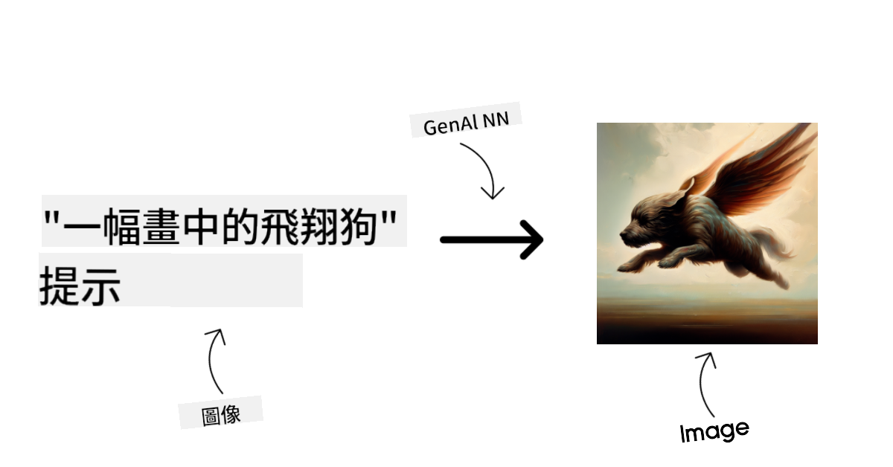

文本和代碼生成模型是生成文本或代碼的模型。這些模型通常用於文本摘要、翻譯和問答。文本生成模型通常訓練於大型文本數據集上，如 [BookCorpus](https://www.cv-foundation.org/openaccess/content_iccv_2015/html/Zhu_Aligning_Books_and_ICCV_2015_paper.html?WT.mc_id=academic-105485-koreyst)，可以用於生成新文本或回答問題。代碼生成模型，如 [CodeParrot](https://huggingface.co/codeparrot?WT.mc_id=academic-105485-koreyst)，通常訓練於大型代碼數據集上，如 GitHub，可以用於生成新代碼或修復現有代碼中的錯誤。

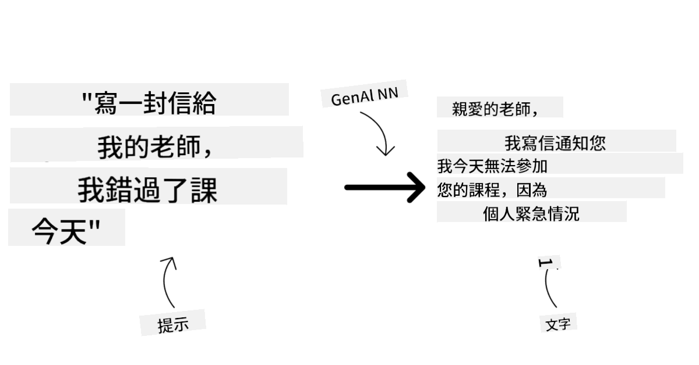

### 編碼器-解碼器與僅解碼器

為了討論 LLMs 的不同架構類型，讓我們用一個比喻。

想像你的經理給你一個為學生編寫測驗的任務。你有兩位同事；一位負責創建內容，另一位負責審核它們。

內容創作者就像一個僅解碼器模型，他們可以查看主題和你已經寫的內容，然後基於此寫一門課程。他們非常擅長寫作引人入勝且信息豐富的內容，但不太擅長理解主題和學習目標。僅解碼器模型的例子有 GPT 系列模型，如 GPT-3。

審核者就像一個僅編碼器模型，他們查看編寫的課程和答案，注意它們之間的關係並理解上下文，但不擅長生成內容。僅編碼器模型的例子是 BERT。

想像我們還可以有一個既能創建又能審核測驗的人，這就是編碼器-解碼器模型。例子有 BART 和 T5。

### 服務與模型

現在，讓我們討論服務與模型之間的區別。服務是由雲服務提供商提供的產品，通常是模型、數據和其他組件的組合。模型是服務的核心組件，通常是基礎模型，如 LLM。

服務通常為生產用途優化，通過圖形用戶界面更容易使用。然而，服務不一定免費提供，可能需要訂閱或付費使用，以利用服務擁有者的設備和資源，優化開支並輕鬆擴展。服務的例子是 [Azure OpenAI Service](https://learn.microsoft.com/azure/ai-services/openai/overview?WT.mc_id=academic-105485-koreyst)，提供按使用量計費的計劃，意味著用戶根據使用服務的多少按比例收費。此外，Azure OpenAI Service 在模型能力之上提供企業級安全和負責任的 AI 框架。

模型只是神經網絡，帶有參數、權重等。允許公司在本地運行，但需要購買設備、構建結構來擴展以及購買許可證或使用開源模型。像 LLaMA 這樣的模型可以使用，但需要計算能力來運行模型。

## 如何在 Azure 上測試和迭代不同模型以了解性能

一旦我們的團隊探索了當前的 LLMs 版圖並確定了一些適合其場景的好候選模型，下一步就是在其數據和工作負載上測試它們。這是一個通過實驗和測量進行的迭代過程。
我們在前幾段中提到的大多數模型（OpenAI 模型、開源模型如 Llama2 和 Hugging Face transformers）都可以在 [Azure AI Studio](https://ai.azure.com/?WT.mc_id=academic-105485-koreyst) 的 [Model Catalog](https://learn.microsoft.com/azure/ai-studio/how-to/model-catalog-overview?WT.mc_id=academic-105485-koreyst) 中找到。

[Azure AI Studio](https://learn.microsoft.com/azure/ai-studio/what-is-ai-studio?WT.mc_id=academic-105485-koreyst) 是一個為開發人員設計的雲平台，用於構建生成式 AI 應用程序並管理整個開發生命周期——從實驗到評估——通過將所有 Azure AI 服務組合到一個單一的中心，提供方便的 GUI。Azure AI Studio 中的 Model Catalog 使用戶能夠：

- 在目錄中找到感興趣的基礎模型——無論是專有的還是開源的，按任務、許可證或名稱篩選。為了提高可搜索性，模型被組織到集合中，如 Azure OpenAI 集合、Hugging Face 集合等。

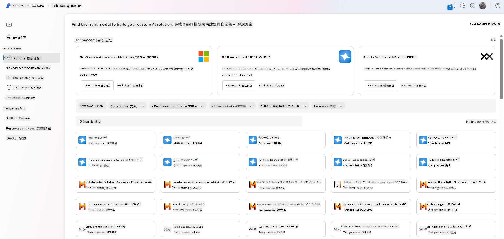

- 查看模型卡，包括使用意圖和訓練數據的詳細描述、代碼示例和內部評估庫的評估結果。

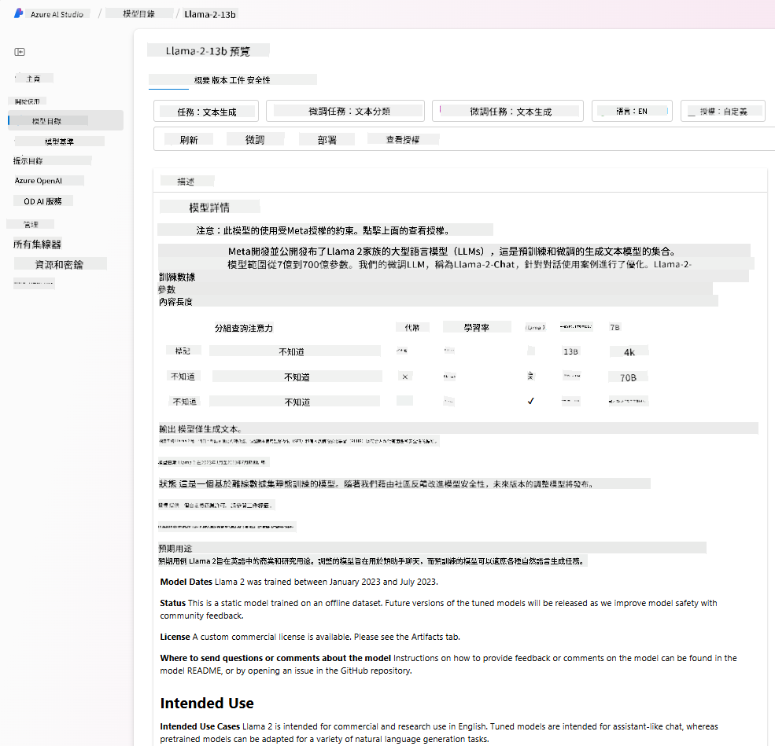
- 比較行業中可用的模型和數據集的基準，以評估哪個最符合業務場景，通過 [Model Benchmarks](https://learn.microsoft.com/azure/ai-studio/how-to/model-benchmarks?WT.mc_id=academic-105485-koreyst) 面板。

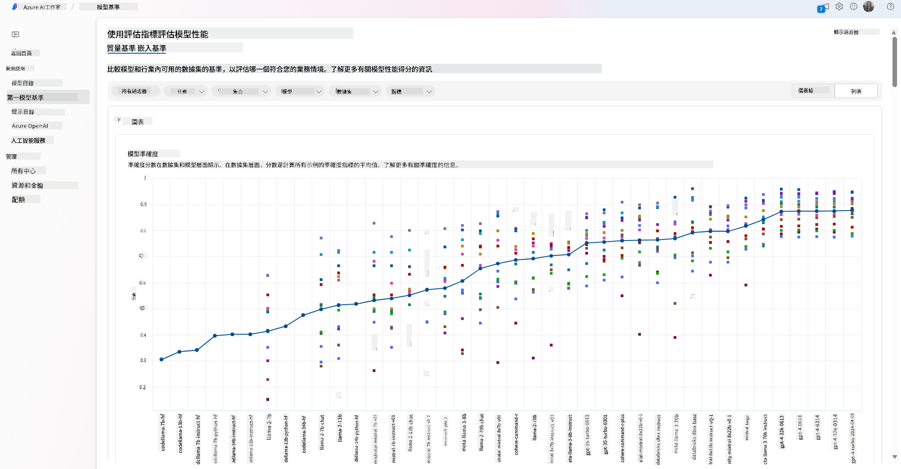

- 在自定義訓練數據上微調模型，以提高模型在特定工作負載中的性能，利用 Azure AI Studio 的實驗和跟踪功能。

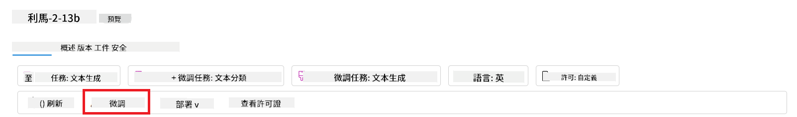

- 部署原始預訓練模型或微調版本到遠程實時推理 - 管理計算 - 或無伺服器 API 端點 - [按需付費](https://learn.microsoft.com/azure/ai-studio/how-to/model-catalog-overview#model-deployment-managed-compute-and-serverless-api-pay-as-you-go?WT.mc_id=academic-105485-koreyst) - 以便應用程序使用。

> [!NOTE]
> 目錄中的所有模型目前並不都可用於微調和/或按需付費部署。查看模型卡以了解模型的功能和限制。

## 改善 LLM 結果

我們的初創團隊探索了不同種類的 LLM 和一個雲平台（Azure Machine Learning），使我們能夠比較不同模型，在測試數據上進行評估，改善性能並將它們部署到推理端點。

但什麼時候應該考慮微調模型而不是使用預訓練的模型？是否有其他方法可以提高模型在特定工作負載上的性能？

企業可以使用多種方法從 LLM 中獲得所需結果。在生產中部署 LLM 時，可以選擇不同類型的模型，這些模型具有不同程度的訓練，並具有不同的複雜性、成本和質量。以下是一些不同的方法：

- **帶上下文的提示工程**。這個想法是提供足夠的上下文，確保在提示時獲得所需的回應。

- **檢索增強生成，RAG**。您的數據可能存在於數據庫或網絡端點中，例如，為確保這些數據或其子集在提示時被包含，可以提取相關數據並將其作為用戶提示的一部分。

- **微調模型**。在這裡，您進一步在自己的數據上訓練模型，使模型更精確並響應您的需求，但可能成本較高。

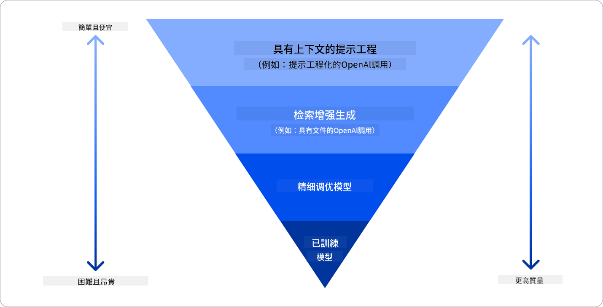

圖片來源：[四種企業部署 LLM 的方式 | Fiddler AI Blog](https://www.fiddler.ai/blog/four-ways-that-enterprises-deploy-llms?WT.mc_id=academic-105485-koreyst)

### 帶上下文的提示工程

預訓練的 LLM 在一般化自然語言任務上表現非常好，即使只用簡短的提示，比如完成句子或回答問題——所謂的“零樣本”學習。

然而，使用者越能框定自己的查詢，提供詳細的請求和示例——上下文——答案就越精確，越符合使用者的期望。在這種情況下，如果提示只包含一個示例，我們稱之為“一樣本”學習；如果包含多個示例，則稱為“少樣本學習”。帶上下文的提示工程是最具成本效益的啟動方法。

### 檢索增強生成 (RAG)

LLM 的限制在於它們只能使用訓練過程中使用過的數據來生成答案。這意味著它們對訓練過程後發生的事實一無所知，並且無法訪問非公共信息（如公司數據）。
這可以通過 RAG 克服，這是一種通過外部數據以文檔塊的形式增強提示的技術，考慮到提示長度限制。這得到了向量數據庫工具（如 [Azure Vector Search](https://learn.microsoft.com/azure/search/vector-search-overview?WT.mc_id=academic-105485-koreyst)）的支持，這些工具從各種預定義數據源中檢索有用的塊並將它們添加到提示上下文中。

當企業沒有足夠的數據、足夠的時間或資源來微調 LLM，但仍希望提高特定工作負載的性能並減少捏造的風險，即對現實的神秘化或有害內容時，這種技術非常有幫助。

### 微調模型

微調是一個利用遷移學習來“適應”模型以完成下游任務或解決特定問題的過程。與少樣本學習和 RAG 不同，它會生成一個新模型，具有更新的權重和偏差。它需要一組由單一輸入（提示）及其相關輸出（完成）組成的訓練示例。
這將是首選方法，如果：

- **使用微調模型**。企業希望使用微調的能力較低的模型（如嵌入模型）而不是高性能模型，從而提供更具成本效益和快速的解決方案。

- **考慮延遲**。延遲對於特定用例很重要，因此不可能使用非常長的提示或模型應學習的示例數量不符合提示長度限制。

- **保持更新**。企業擁有大量高質量數據和真實標籤，以及保持這些數據隨時間更新所需的資源。

### 訓練模型

從頭開始訓練 LLM無疑是最困難和最複雜的方法，需要大量數據、熟練的資源和適當的計算能力。只有在企業擁有特定領域的用例和大量領域集中的數據時，才應考慮此選項。

## 知識檢查

什麼可能是改善 LLM 完成結果的好方法？

1. 帶上下文的提示工程
1. RAG
1. 微調模型

A:3，如果您有時間和資源以及高質量數據，微調是保持更新的更好選擇。然而，如果您正在尋求改善並且缺乏時間，首先考慮 RAG 是值得的。

## 🚀 挑戰

閱讀更多關於如何 [使用 RAG](https://learn.microsoft.com/azure/search/retrieval-augmented-generation-overview?WT.mc_id=academic-105485-koreyst) 為您的企業服務。

## 出色的工作，繼續學習

完成本課程後，查看我們的 [生成式 AI 學習集合](https://aka.ms/genai-collection?WT.mc_id=academic-105485-koreyst) 繼續提升您的生成式 AI 知識！

前往第三課，我們將探討如何 [負責任地使用生成式 AI](../03-using-generative-ai-responsibly/README.md?WT.mc_id=academic-105485-koreyst)！

**免責聲明**：

本文件是使用AI翻譯服務[Co-op Translator](https://github.com/Azure/co-op-translator)翻譯的。儘管我們努力確保準確性，但請注意，自動翻譯可能會包含錯誤或不準確之處。應以原始語言的文件為權威來源。對於關鍵信息，建議使用專業人工翻譯。我們對因使用本翻譯而引起的任何誤解或誤釋不承擔責任。