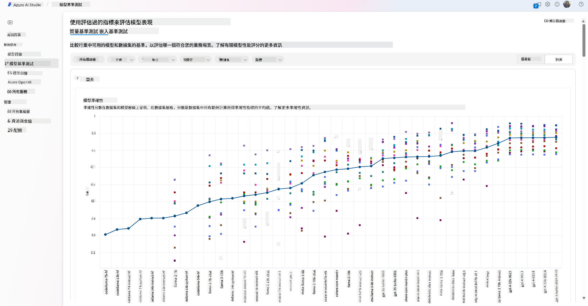
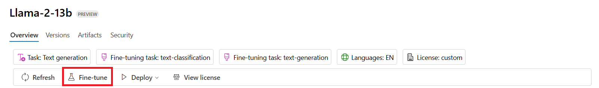
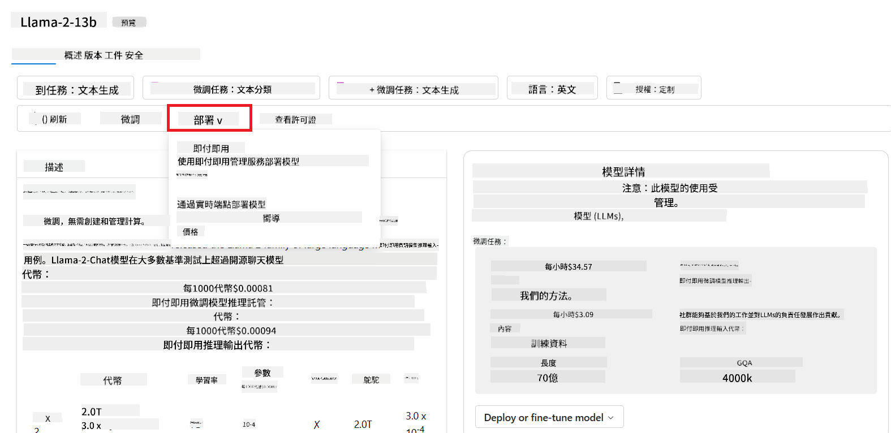
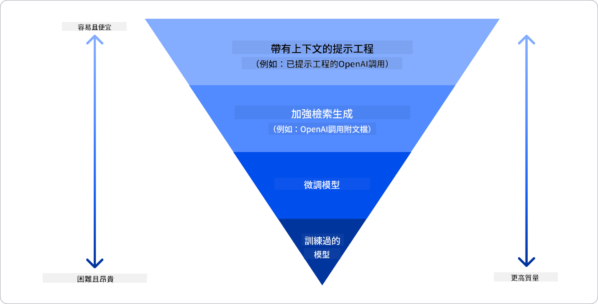

<!--
CO_OP_TRANSLATOR_METADATA:
{
  "original_hash": "e2f686f2eb794941761252ac5e8e090b",
  "translation_date": "2025-06-25T10:21:36+00:00",
  "source_file": "02-exploring-and-comparing-different-llms/README.md",
  "language_code": "hk"
}
-->
# 探索和比較不同的 LLMs

> _點擊上方圖片觀看此課程的影片_

在之前的課程中，我們已經了解了生成式 AI 如何改變科技的格局，大型語言模型（LLMs）如何運作，以及企業——例如我們的初創公司——如何將它們應用於自己的使用案例並實現增長！在本章中，我們將比較和對比不同類型的大型語言模型（LLMs），以了解它們的優缺點。

我們初創公司旅程的下一步是探索當前 LLMs 的格局，並了解哪些適合我們的使用案例。

## 簡介

本課程將涵蓋：

- 當前格局中的不同類型 LLMs。
- 在 Azure 中測試、迭代和比較不同模型以適應您的使用案例。
- 如何部署 LLM。

## 學習目標

完成本課程後，您將能夠：

- 為您的使用案例選擇合適的模型。
- 了解如何測試、迭代並提高模型的性能。
- 知道企業如何部署模型。

## 了解不同類型的 LLMs

LLMs 可以根據其架構、訓練數據和使用案例進行多種分類。了解這些差異將幫助我們的初創公司選擇合適的模型並了解如何測試、迭代和提高性能。

有許多不同類型的 LLM 模型，您選擇的模型取決於您希望使用它們的目的、您的數據、您願意支付的費用等等。

根據您希望使用模型生成文本、音頻、視頻、圖像等，您可能會選擇不同類型的模型。

- **音頻和語音識別**。對於此目的，Whisper 類型模型是一個很好的選擇，因為它們是通用型並且旨在進行語音識別。它在多樣化的音頻上進行訓練，能夠執行多語言語音識別。

- **圖像生成**。對於圖像生成，DALL-E 和 Midjourney 是兩個非常知名的選擇。DALL-E 由 Azure OpenAI 提供。

- **文本生成**。大多數模型都在文本生成上進行訓練，您有多種選擇，從 GPT-3.5 到 GPT-4。它們的成本各不相同，其中 GPT-4 最昂貴。值得在 Azure OpenAI playground 中進行研究，以評估哪種模型最符合您的需求。

- **多模態**。如果您希望在輸入和輸出中處理多種類型的數據，您可能需要考慮 gpt-4 turbo with vision 或 gpt-4o 等模型 - OpenAI 最新發布的模型 - 能夠將自然語言處理與視覺理解相結合，實現通過多模態界面進行互動。

選擇模型意味著您獲得了一些基本能力，但這可能還不夠。通常您有公司特定的數據，您需要以某種方式告訴 LLM。對於如何處理這一問題有一些不同的選擇，詳細內容請參見接下來的章節。

### 基礎模型與 LLMs

基礎模型的術語是由 Stanford 研究人員創造的，並定義為符合某些標準的 AI 模型，例如：

- **它們使用無監督學習或自監督學習進行訓練**，這意味著它們在未標記的多模態數據上進行訓練，並且不需要人工註釋或標記數據來進行訓練。
- **它們是非常大的模型**，基於在數十億參數上訓練的非常深的神經網絡。
- **它們通常旨在作為其他模型的“基礎”**，意味著它們可以用作其他模型的起點，可以通過微調來完成。

為了進一步澄清這一區別，我們以 ChatGPT 為例。要構建 ChatGPT 的第一個版本，使用了 GPT-3.5 作為基礎模型。這意味著 OpenAI 使用了一些聊天特定數據來創建 GPT-3.5 的調整版本，專門在對話場景中表現良好，例如聊天機器人。

### 開源模型與專有模型

另一種對 LLMs 進行分類的方法是看它們是開源的還是專有的。

開源模型是公開提供給大眾使用的模型，任何人都可以使用。它們通常由創建它們的公司或研究社區提供。這些模型可以被檢查、修改和定制以適應 LLMs 的各種使用案例。然而，它們不總是為生產使用而優化，性能可能不如專有模型。此外，開源模型的資金可能有限，可能不會長期維護或更新最新的研究。流行的開源模型包括 Alpaca、Bloom 和 LLaMA。

專有模型是由公司擁有的模型，未向公眾提供。這些模型通常為生產使用而優化。然而，它們不允許被檢查、修改或定制以適應不同的使用案例。此外，它們不總是免費提供，可能需要訂閱或付款才能使用。此外，用戶無法控制用於訓練模型的數據，這意味著他們應該信任模型擁有者確保數據隱私和負責任使用 AI 的承諾。流行的專有模型包括 OpenAI 模型、Google Bard 或 Claude 2。

### 嵌入式生成與圖像生成與文本和代碼生成

LLMs 還可以根據它們生成的輸出進行分類。

嵌入式生成是一組模型，可以將文本轉換為數字形式，稱為嵌入式，這是輸入文本的數字表示。嵌入式生成使機器更容易理解單詞或句子之間的關係，並且可以作為其他模型的輸入，例如分類模型或在數據上表現更好的聚類模型。嵌入式模型通常用於遷移學習，模型為替代任務構建，這些任務有大量數據，然後模型權重（嵌入式）被重新用於其他下游任務。這一類別的例子是 OpenAI 嵌入式。

圖像生成模型是生成圖像的模型。這些模型通常用於圖像編輯、圖像合成和圖像翻譯。圖像生成模型通常在大型圖像數據集上進行訓練，例如 LAION-5B，並且可以用於生成新圖像或使用填充、超分辨率和著色技術編輯現有圖像。例子包括 DALL-E-3 和 Stable Diffusion 模型。

文本和代碼生成模型是生成文本或代碼的模型。這些模型通常用於文本摘要、翻譯和問題回答。文本生成模型通常在大型文本數據集上進行訓練，例如 BookCorpus，並且可以用於生成新文本或回答問題。代碼生成模型，例如 CodeParrot，通常在大型代碼數據集上進行訓練，例如 GitHub，並且可以用於生成新代碼或修復現有代碼中的錯誤。

### 編碼器-解碼器與僅解碼器

要談論 LLMs 的不同架構類型，我們來用一個比喻。

想像您的經理給了您一項任務，為學生編寫一份測驗。您有兩位同事，一位負責創建內容，另一位負責審核。

內容創建者就像僅解碼器模型，他們可以查看主題並看到您已經寫的內容，然後基於此撰寫課程。他們非常擅長撰寫吸引人且信息豐富的內容，但不太擅長理解主題和學習目標。僅解碼器模型的例子是 GPT 系列模型，例如 GPT-3。

審核者就像僅編碼器模型，他們查看寫好的課程和答案，注意它們之間的關係並理解上下文，但不擅長生成內容。僅編碼器模型的例子是 BERT。

想像我們也可以有一個人既能創建又能審核測驗，這就是編碼器-解碼器模型。例子包括 BART 和 T5。

### 服務與模型

現在，我們來談談服務與模型之間的區別。服務是由雲服務提供商提供的產品，通常是模型、數據和其他組件的組合。模型是服務的核心組件，通常是基礎模型，例如 LLM。

服務通常為生產使用而優化，並且通常比模型更容易使用，通過圖形用戶界面。然而，服務不總是免費提供，可能需要訂閱或付款才能使用，以換取利用服務擁有者的設備和資源，優化支出並輕鬆擴展。服務的例子是 Azure OpenAI Service，提供按使用量付費計劃，這意味著用戶根據使用服務的程度收費。此外，Azure OpenAI Service 提供企業級安全性和基於模型能力的負責任 AI 框架。

模型只是神經網絡，具有參數、權重等。允許公司本地運行，但需要購買設備、建立結構來擴展並購買許可或使用開源模型。像 LLaMA 這樣的模型可供使用，需計算能力來運行模型。

## 如何在 Azure 上測試和迭代不同模型以了解性能

一旦我們的團隊探索了當前的 LLMs 格局並識別了一些適合他們場景的好候選者，下一步就是在他們的數據和工作負載上測試它們。這是一個迭代過程，通過實驗和測量完成。
我們在前面段落中提到的大多數模型（OpenAI 模型、開源模型如 Llama2 和 Hugging Face transformers）都可以在 Azure AI Studio 的 Model Catalog 中找到。

Azure AI Studio 是一個為開發者設計的雲平台，用於構建生成式 AI 應用並管理整個開發生命周期 - 從實驗到評估 - 通過將所有 Azure AI 服務組合到一個單一中心並提供便捷的 GUI。Azure AI Studio 中的 Model Catalog 使用戶能夠：

- 在目錄中找到感興趣的基礎模型 - 無論是專有的還是開源的，根據任務、許可或名稱進行過濾。為了提高搜索性，模型被組織到集合中，如 Azure OpenAI 集合、Hugging Face 集合等。

- 查看模型卡，包括使用意圖和訓練數據的詳細描述、代碼示例以及內部評估庫的評估結果。
- 比較行業中可用的模型和數據集的基準，以評估哪一個符合業務場景，通過 [模型基準](https://learn.microsoft.com/azure/ai-studio/how-to/model-benchmarks?WT.mc_id=academic-105485-koreyst) 面板。

- 在自定義訓練數據上微調模型，以提高模型在特定工作負載中的性能，利用 Azure AI Studio 的實驗和跟踪功能。

- 部署原始預訓練模型或微調版本到遠程實時推理 - 管理計算 - 或無伺服器 API 端點 - [按需付費](https://learn.microsoft.com/azure/ai-studio/how-to/model-catalog-overview#model-deployment-managed-compute-and-serverless-api-pay-as-you-go?WT.mc_id=academic-105485-koreyst) - 以便應用程序使用。

> [!NOTE]
> 目錄中的所有模型目前都不支持微調和/或按需付費部署。請查看模型卡以了解模型的功能和限制。

## 改善 LLM 結果

我們與創業團隊探索了不同種類的 LLM 和雲平台（Azure 機器學習），使我們能夠比較不同的模型，在測試數據上進行評估，提高性能並在推理端點上部署。

但是，何時應考慮微調模型而不是使用預訓練模型？是否有其他方法可以提高模型在特定工作負載上的性能？

企業可以使用多種方法從 LLM 獲得所需結果。在生產中部署 LLM 時，可以選擇不同類型的模型，具有不同程度的訓練，並具有不同的複雜性、成本和質量。以下是一些不同的方法：

- **使用上下文的提示工程**。這個概念是提供足夠的上下文來確保獲得所需的回應。

- **檢索增強生成，RAG**。您的數據可能存在於數據庫或網絡端點中，為確保這些數據或其子集在提示時被包含，您可以檢索相關數據並將其作為用戶提示的一部分。

- **微調模型**。在這裡，您進一步在自己的數據上訓練模型，使其更精確和響應您的需求，但可能成本較高。

圖片來源：[企業部署 LLM 的四種方式 | Fiddler AI 博客](https://www.fiddler.ai/blog/four-ways-that-enterprises-deploy-llms?WT.mc_id=academic-105485-koreyst)

### 使用上下文的提示工程

預訓練 LLM 在一般化自然語言任務上表現非常好，即使只用簡短的提示調用它們，比如完成一個句子或提出一個問題——所謂的“零次學習”。

然而，用戶越能框定其查詢，提供詳細的請求和示例——上下文——答案就越準確，越接近用戶的期望。在這種情況下，如果提示僅包含一個示例，我們稱之為“一次學習”；如果包含多個示例，則稱為“少次學習”。使用上下文的提示工程是最具成本效益的啟動方法。

### 檢索增強生成 (RAG)

LLM 的局限在於它們只能使用訓練過程中使用的數據來生成答案。這意味著它們對訓練過程後發生的事實一無所知，且無法訪問非公開信息（如公司數據）。
這可以通過 RAG 克服，這是一種通過外部數據增強提示的技術，以文檔片段的形式考慮提示長度限制。這由向量數據庫工具（如 [Azure 向量搜索](https://learn.microsoft.com/azure/search/vector-search-overview?WT.mc_id=academic-105485-koreyst)）支持，這些工具從多樣的預定義數據源中檢索有用的片段並將其添加到提示上下文中。

當企業沒有足夠的數據、足夠的時間或資源來微調 LLM，但仍希望提高特定工作負載的性能並減少虛構風險（即現實的神秘化或有害內容）時，這種技術非常有用。

### 微調模型

微調是一個利用遷移學習來“適應”模型以執行下游任務或解決特定問題的過程。不同於少次學習和 RAG，它會生成一個新的模型，具有更新的權重和偏差。它需要一組由單個輸入（提示）及其相關輸出（完成）組成的訓練示例。
如果：

- **使用微調模型**。企業希望使用微調的能力較弱的模型（如嵌入模型）而不是高性能模型，這樣可以得到更具成本效益和快速的解決方案。

- **考慮延遲**。延遲對特定用例很重要，因此無法使用非常長的提示或應學習的示例數量不符合提示長度限制。

- **保持最新**。企業擁有大量高質量數據和真實標籤，以及保持這些數據隨時間更新所需的資源。

### 訓練模型

從零開始訓練 LLM無疑是最困難且最複雜的方法，需要大量數據、熟練資源和適當的計算能力。只有在企業擁有特定領域的用例和大量領域集中的數據的情況下才應考慮此選項。

## 知識檢查

改善 LLM 完成結果的好方法可能是什麼？

1. 使用上下文的提示工程
1. RAG
1. 微調模型

A:3，如果您有時間和資源以及高質量數據，微調是保持最新的更好選擇。然而，如果您希望改善事情而缺乏時間，值得首先考慮 RAG。

## 🚀 挑戰

閱讀更多關於如何為您的企業[使用 RAG](https://learn.microsoft.com/azure/search/retrieval-augmented-generation-overview?WT.mc_id=academic-105485-koreyst)。

## 出色的工作，繼續學習

完成此課程後，請查看我們的 [生成式 AI 學習集合](https://aka.ms/genai-collection?WT.mc_id=academic-105485-koreyst)，繼續提升您的生成式 AI 知識！

前往第 3 課，我們將探討如何[負責任地使用生成式 AI](../03-using-generative-ai-responsibly/README.md?WT.mc_id=academic-105485-koreyst)！

**免責聲明**：  
本文件使用AI翻譯服務[Co-op Translator](https://github.com/Azure/co-op-translator)進行翻譯。我們努力確保準確性，但請注意，自動翻譯可能包含錯誤或不準確之處。應將原始文件的母語版本視為權威來源。對於關鍵信息，建議尋求專業人工翻譯。我們對使用此翻譯引起的任何誤解或誤讀不承擔責任。