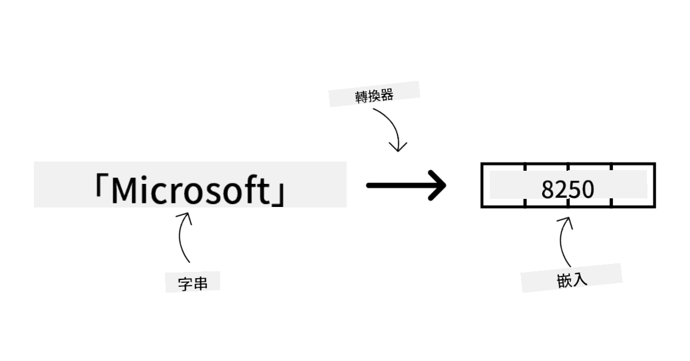
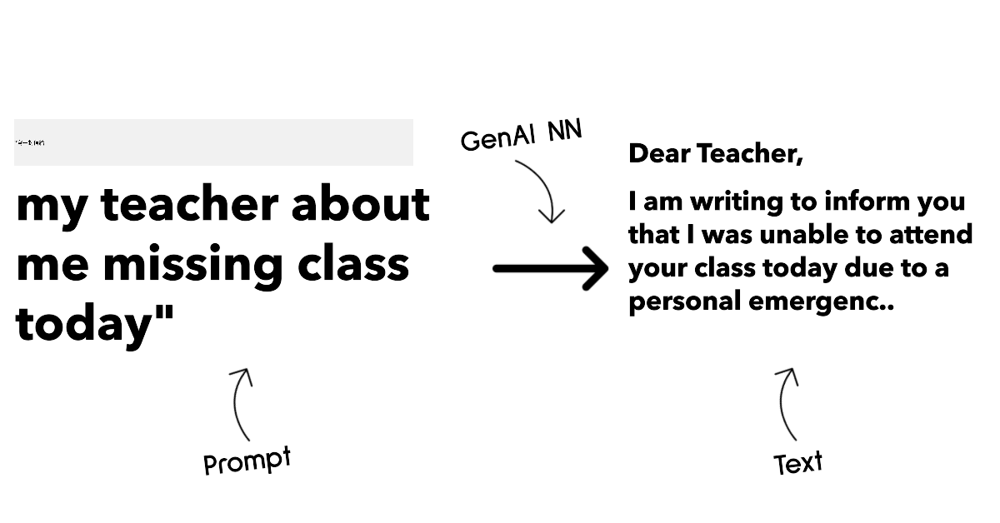
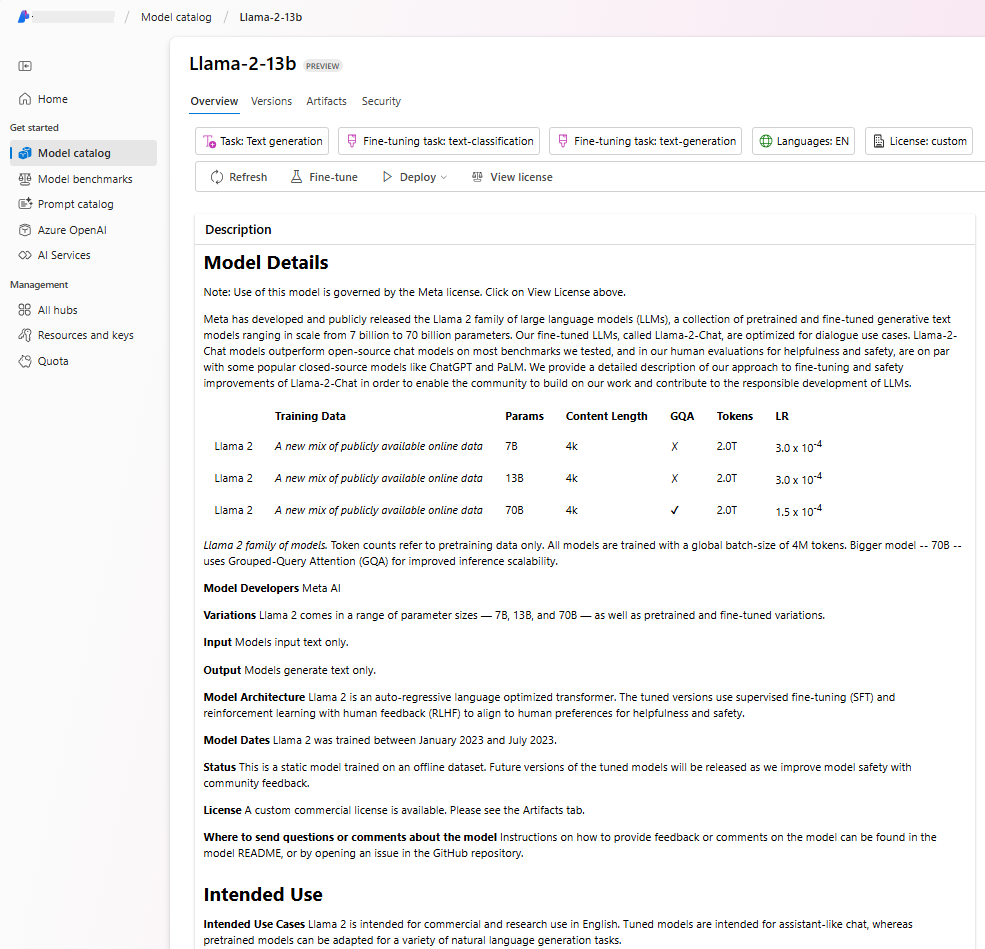
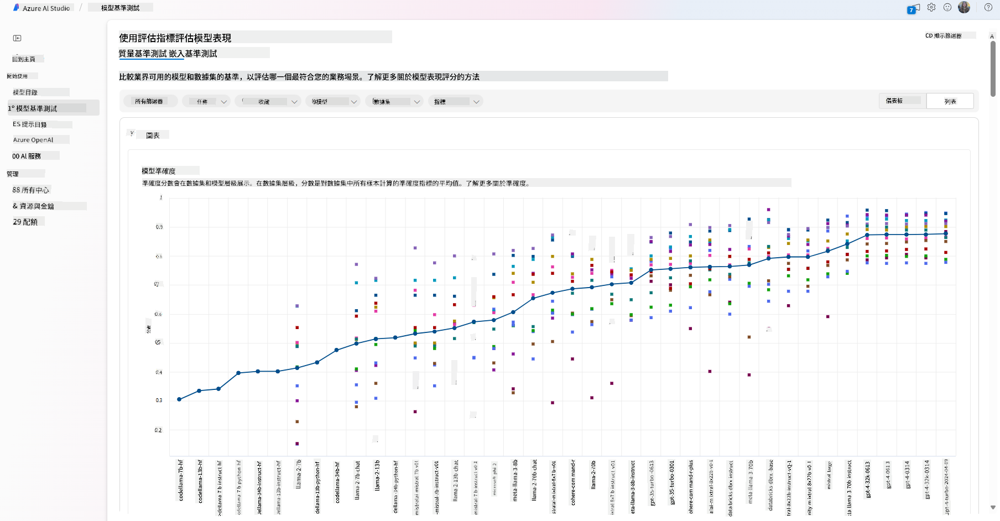
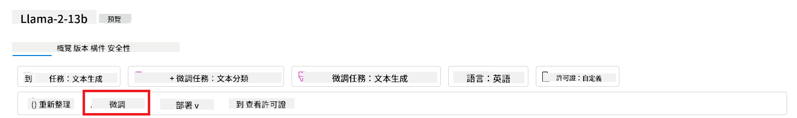
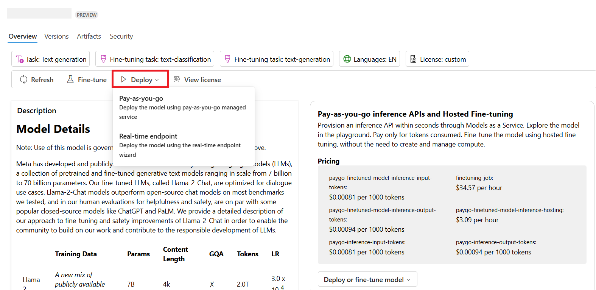

<!--
CO_OP_TRANSLATOR_METADATA:
{
  "original_hash": "e2f686f2eb794941761252ac5e8e090b",
  "translation_date": "2025-07-09T08:14:07+00:00",
  "source_file": "02-exploring-and-comparing-different-llms/README.md",
  "language_code": "hk"
}
-->
# 探索及比較不同的 LLMs

> _點擊上方圖片觀看本課程影片_

在上一課中，我們已了解生成式 AI 如何改變科技格局，認識大型語言模型（LLMs）的運作原理，以及像我們的初創企業如何將它們應用於業務場景並實現成長！本章節將比較不同類型的大型語言模型（LLMs），了解它們的優缺點。

我們初創企業的下一步是探索現有的 LLMs 生態，並判斷哪些模型適合我們的應用場景。

## 簡介

本課程將涵蓋：

- 現時市場上不同類型的 LLMs。
- 在 Azure 上測試、迭代及比較不同模型以配合你的應用場景。
- 如何部署 LLM。

## 學習目標

完成本課程後，你將能夠：

- 選擇適合你應用場景的模型。
- 了解如何測試、迭代及提升模型效能。
- 知道企業如何部署模型。

## 了解不同類型的 LLMs

LLMs 可根據其架構、訓練數據及應用場景有多種分類。了解這些差異有助我們的初創企業挑選合適的模型，並掌握如何測試、迭代及提升效能。

市面上有很多不同類型的 LLM 模型，你的選擇取決於你打算如何使用它們、你的數據、預算等因素。

根據你想用模型處理文字、音頻、視頻、圖像生成等不同用途，你可能會選擇不同類型的模型。

- **音頻及語音識別**。Whisper 類型的模型是很好的選擇，因為它們是通用型且專注於語音識別。它們在多樣化的音頻數據上訓練，能進行多語言語音識別。詳情請參考[Whisper 類型模型](https://platform.openai.com/docs/models/whisper?WT.mc_id=academic-105485-koreyst)。

- **圖像生成**。在圖像生成方面，DALL-E 和 Midjourney 是兩個非常知名的選擇。DALL-E 由 Azure OpenAI 提供。[在此了解更多關於 DALL-E](https://platform.openai.com/docs/models/dall-e?WT.mc_id=academic-105485-koreyst)，以及本課程第九章內容。

- **文字生成**。大多數模型都是針對文字生成訓練，你可以從 GPT-3.5 到 GPT-4 中選擇多種模型。它們的價格各異，GPT-4 是最昂貴的。建議使用[Azure OpenAI playground](https://oai.azure.com/portal/playground?WT.mc_id=academic-105485-koreyst)評估哪款模型在能力和成本上最符合你的需求。

- **多模態**。如果你想處理多種輸入和輸出數據類型，可以考慮像是[gpt-4 turbo with vision 或 gpt-4o](https://learn.microsoft.com/azure/ai-services/openai/concepts/models#gpt-4-and-gpt-4-turbo-models?WT.mc_id=academic-105485-koreyst)這類最新的 OpenAI 模型，它們能結合自然語言處理與視覺理解，支持多模態介面互動。

選擇模型意味著你獲得了基本能力，但這往往不足夠。通常你會有公司特定的數據需要告訴 LLM。針對這點，有幾種不同的做法，稍後章節會詳細說明。

### Foundation Models 與 LLMs 的區別

「Foundation Model」一詞由[史丹佛研究人員提出](https://arxiv.org/abs/2108.07258?WT.mc_id=academic-105485-koreyst)，定義為符合以下條件的 AI 模型：

- **使用無監督學習或自監督學習訓練**，即在未標註的多模態數據上訓練，無需人工標註或標記數據。
- **模型規模龐大**，基於深度神經網絡，訓練參數達數十億。
- **通常作為其他模型的「基礎」**，可作為其他模型的起點，透過微調來建立專門模型。

圖片來源：[Essential Guide to Foundation Models and Large Language Models | by Babar M Bhatti | Medium](https://thebabar.medium.com/essential-guide-to-foundation-models-and-large-language-models-27dab58f7404)

為了更清楚說明這個區別，我們以 ChatGPT 為例。ChatGPT 的第一個版本是以 GPT-3.5 作為基礎模型，OpenAI 利用一些聊天專用數據，打造出專門針對對話場景優化的 GPT-3.5 微調版本，例如聊天機器人。

圖片來源：[2108.07258.pdf (arxiv.org)](https://arxiv.org/pdf/2108.07258.pdf?WT.mc_id=academic-105485-koreyst)

### 開源模型與專有模型

另一種分類方式是根據模型是否開源或專有。

開源模型是公開提供給大眾使用的，任何人都可以使用。通常由創建該模型的公司或研究社群釋出。這些模型允許檢視、修改及自訂以符合不同的 LLMs 用例。不過，它們不一定針對生產環境優化，效能可能不及專有模型。此外，開源模型的資金有限，可能無法長期維護或更新最新研究成果。熱門開源模型例子包括[Alpaca](https://crfm.stanford.edu/2023/03/13/alpaca.html?WT.mc_id=academic-105485-koreyst)、[Bloom](https://huggingface.co/bigscience/bloom)及[LLaMA](https://llama.meta.com)。

專有模型則由公司擁有，不公開給大眾使用。這些模型通常針對生產環境優化，但不允許檢視、修改或自訂。且通常非免費，可能需要訂閱或付費使用。用戶無法控制用於訓練模型的數據，因此需信任模型擁有者在數據隱私及 AI 負責任使用上的承諾。熱門專有模型例子包括[OpenAI 模型](https://platform.openai.com/docs/models/overview?WT.mc_id=academic-105485-koreyst)、[Google Bard](https://sapling.ai/llm/bard?WT.mc_id=academic-105485-koreyst)及[Claude 2](https://www.anthropic.com/index/claude-2?WT.mc_id=academic-105485-koreyst)。

### Embedding、圖像生成與文字及程式碼生成

LLMs 也可根據輸出類型分類。

Embedding 模型能將文字轉換成數值形式，稱為 embedding，是輸入文字的數值表示。Embedding 讓機器更容易理解詞語或句子間的關係，並可作為其他模型的輸入，如分類模型或聚類模型，這些模型在數值資料上表現更佳。Embedding 模型常用於遷移學習，先在大量數據的代理任務上訓練，再將模型權重（embedding）用於其他下游任務。此類模型例子為[OpenAI embeddings](https://platform.openai.com/docs/models/embeddings?WT.mc_id=academic-105485-koreyst)。

圖像生成模型用於生成圖像，常用於圖像編輯、合成及轉換。這些模型通常在大型圖像數據集（如[LAION-5B](https://laion.ai/blog/laion-5b/?WT.mc_id=academic-105485-koreyst)）上訓練，可用於生成新圖像，或利用修補、超解析度及上色技術編輯現有圖像。例子包括[DALL-E-3](https://openai.com/dall-e-3?WT.mc_id=academic-105485-koreyst)及[Stable Diffusion 模型](https://github.com/Stability-AI/StableDiffusion?WT.mc_id=academic-105485-koreyst)。

文字及程式碼生成模型用於生成文字或程式碼，常用於文字摘要、翻譯及問答。文字生成模型通常在大型文字數據集（如[BookCorpus](https://www.cv-foundation.org/openaccess/content_iccv_2015/html/Zhu_Aligning_Books_and_ICCV_2015_paper.html?WT.mc_id=academic-105485-koreyst)）上訓練，可用於生成新文字或回答問題。程式碼生成模型，如[CodeParrot](https://huggingface.co/codeparrot?WT.mc_id=academic-105485-koreyst)，通常在大型程式碼數據集（如 GitHub）上訓練，可用於生成新程式碼或修復現有程式碼的錯誤。

### Encoder-Decoder 與 Decoder-only 架構

談到 LLMs 的不同架構，我們用一個比喻來說明。

想像你的主管交給你一個任務，要你為學生設計一個小測驗。你有兩位同事，一位負責創作內容，另一位負責審核。

內容創作者就像是 Decoder-only 模型，他們可以根據主題和已寫的內容，創作課程。他們擅長寫出吸引人且具資訊性的內容，但不太擅長理解主題和學習目標。Decoder 模型的例子有 GPT 系列，如 GPT-3。

審核者就像是 Encoder-only 模型，他們會查看課程和答案，理解兩者間的關係和上下文，但不擅長生成內容。Encoder-only 模型的例子是 BERT。

如果我們有一個人同時能創作和審核小測驗，那就是 Encoder-Decoder 模型。例子有 BART 和 T5。

### 服務與模型的區別

現在談談服務和模型的差異。服務是由雲端服務提供商提供的產品，通常是模型、數據及其他組件的組合。模型是服務的核心組件，通常是基礎模型，如 LLM。

服務通常針對生產環境優化，且比模型更易使用，通常有圖形用戶介面。但服務不一定免費，可能需要訂閱或付費，換取使用服務提供者的設備和資源，優化成本並輕鬆擴展。服務例子是[Azure OpenAI Service](https://learn.microsoft.com/azure/ai-services/openai/overview?WT.mc_id=academic-105485-koreyst)，提供按用量付費方案，使用者依使用量付費，並提供企業級安全及負責任的 AI 框架。

模型則是神經網絡本身，包含參數、權重等。企業可本地運行，但需購買設備、建立擴展架構，並購買授權或使用開源模型。像 LLaMA 這類模型可用，但需要計算資源來運行。

## 如何在 Azure 上測試及迭代不同模型以了解效能

當團隊探索完現有 LLMs 生態並挑選出適合場景的候選模型後，下一步是用自己的數據和工作負載測試它們。這是一個透過實驗和測量進行的迭代過程。
大部分我們在前面段落提及的模型（OpenAI 模型、開源模型如 Llama2，以及 Hugging Face transformers）都可以在 [Azure AI Studio](https://ai.azure.com/?WT.mc_id=academic-105485-koreyst) 的 [Model Catalog](https://learn.microsoft.com/azure/ai-studio/how-to/model-catalog-overview?WT.mc_id=academic-105485-koreyst) 中找到。

[Azure AI Studio](https://learn.microsoft.com/azure/ai-studio/what-is-ai-studio?WT.mc_id=academic-105485-koreyst) 是一個為開發者設計的雲端平台，讓他們能夠建立生成式 AI 應用程式並管理整個開發生命週期——從實驗到評估——將所有 Azure AI 服務整合到一個方便操作的圖形介面中。Azure AI Studio 中的 Model Catalog 讓使用者可以：

- 在目錄中找到感興趣的基礎模型——無論是專有還是開源，並可依任務、授權或名稱篩選。為了提升搜尋效率，模型被組織成多個集合，例如 Azure OpenAI 集合、Hugging Face 集合等。

- 查看模型卡，包括詳細的預期用途說明、訓練資料、程式碼範例以及內部評估庫中的評估結果。

- 透過 [Model Benchmarks](https://learn.microsoft.com/azure/ai-studio/how-to/model-benchmarks?WT.mc_id=academic-105485-koreyst) 面板，比較業界中不同模型和資料集的基準測試，評估哪個最符合業務場景。

- 利用 Azure AI Studio 的實驗與追蹤功能，針對自訂訓練資料微調模型，以提升模型在特定工作負載上的表現。

- 部署原始的預訓練模型或微調後的版本到遠端即時推論環境——無論是管理型運算資源還是無伺服器 API 端點——並採用 [按使用量付費](https://learn.microsoft.com/azure/ai-studio/how-to/model-catalog-overview#model-deployment-managed-compute-and-serverless-api-pay-as-you-go?WT.mc_id=academic-105485-koreyst) 模式，讓應用程式能夠使用模型。

> [!NOTE]
> 目錄中的所有模型目前並非全部都支援微調和／或按使用量付費部署。請查看模型卡以了解該模型的功能與限制。

## 改善大型語言模型（LLM）結果

我們與新創團隊一起探索了不同類型的 LLM 以及一個雲端平台（Azure Machine Learning），讓我們能比較不同模型、在測試資料上評估它們、提升效能，並部署到推論端點。

但什麼時候應該考慮微調模型，而不是直接使用預訓練模型？還有其他方法可以提升模型在特定工作負載上的表現嗎？

企業可以採用多種方法，從 LLM 中獲得所需的結果。部署 LLM 時，可以選擇不同訓練程度的模型，這些模型在複雜度、成本和品質上各有差異。以下是幾種不同的做法：

- **帶有上下文的提示工程**。核心想法是，在提示時提供足夠的上下文，確保得到所需的回應。

- **檢索增強生成（RAG）**。例如，您的資料可能存在資料庫或網路端點中，為了確保在提示時包含這些資料或其子集，可以先擷取相關資料，並將其納入使用者的提示中。

- **微調模型**。在這種情況下，您會用自己的資料進一步訓練模型，使模型更精確且更符合您的需求，但成本可能較高。

圖片來源：[Four Ways that Enterprises Deploy LLMs | Fiddler AI Blog](https://www.fiddler.ai/blog/four-ways-that-enterprises-deploy-llms?WT.mc_id=academic-105485-koreyst)

### 帶有上下文的提示工程

預訓練的 LLM 在一般自然語言任務上表現良好，即使只用簡短的提示，例如一句話的補全或一個問題——所謂的「零次學習（zero-shot）」。

然而，使用者越能清楚框定查詢，提供詳細的請求和範例——也就是上下文——回答就會越準確，越符合使用者期望。如果提示中只包含一個範例，我們稱之為「一次學習（one-shot）」，如果包含多個範例，則稱為「少量學習（few-shot）」。帶有上下文的提示工程是最具成本效益的入門方法。

### 檢索增強生成（RAG）

LLM 有個限制，就是只能使用訓練時所用的資料來生成答案。這代表它們不會知道訓練後發生的事實，也無法存取非公開資訊（例如公司資料）。

這個問題可以透過 RAG 技術解決，該技術會將外部資料以文件片段的形式加入提示中，並考慮提示長度限制。這通常由向量資料庫工具（如 [Azure Vector Search](https://learn.microsoft.com/azure/search/vector-search-overview?WT.mc_id=academic-105485-koreyst)）支援，這些工具會從多種預先定義的資料來源中擷取有用片段，並將它們加入提示上下文。

當企業沒有足夠資料、時間或資源來微調 LLM，但仍想提升特定工作負載的表現並降低虛構內容（即扭曲現實或有害內容）的風險時，這項技術非常有用。

### 微調模型

微調是利用遷移學習，將模型「調整」以適應下游任務或解決特定問題的過程。與少量學習和 RAG 不同，微調會產生一個新的模型，更新權重和偏差。它需要一組訓練範例，每個範例包含一個輸入（提示）及其對應的輸出（完成）。

如果符合以下情況，微調會是首選：

- **使用微調模型**。企業希望使用微調過的較低能力模型（如嵌入模型），而非高性能模型，以達到更具成本效益且快速的解決方案。

- **考慮延遲**。某些使用案例對延遲要求高，無法使用過長的提示，或模型需學習的範例數量超過提示長度限制。

- **保持資料更新**。企業擁有大量高品質資料和真實標籤，且有資源持續維護資料的時效性。

### 從頭訓練模型

從零開始訓練 LLM 無疑是最困難且最複雜的方法，需要龐大的資料量、專業人才和充足的運算資源。這種選項只適合企業擁有特定領域的使用案例和大量領域專屬資料時考慮。

## 知識檢測

什麼方法適合用來改善 LLM 的完成結果？

1. 帶有上下文的提示工程  
2. RAG  
3. 微調模型

答：3，如果你有時間、資源和高品質資料，微調是保持最新狀態的較佳選擇。但如果你想快速改善且時間有限，建議先考慮 RAG。

## 🚀 挑戰

深入了解如何為你的業務[使用 RAG](https://learn.microsoft.com/azure/search/retrieval-augmented-generation-overview?WT.mc_id=academic-105485-koreyst)。

## 做得好，繼續學習

完成本課程後，請查看我們的[生成式 AI 學習合集](https://aka.ms/genai-collection?WT.mc_id=academic-105485-koreyst)，持續提升你的生成式 AI 知識！

接著前往第三課，我們將探討如何[負責任地使用生成式 AI](../03-using-generative-ai-responsibly/README.md?WT.mc_id=academic-105485-koreyst)！

**免責聲明**：  
本文件由 AI 翻譯服務 [Co-op Translator](https://github.com/Azure/co-op-translator) 進行翻譯。雖然我們致力於確保準確性，但請注意自動翻譯可能包含錯誤或不準確之處。原始文件的母語版本應被視為權威來源。對於重要資訊，建議採用專業人工翻譯。我們不對因使用本翻譯而引起的任何誤解或誤釋承擔責任。