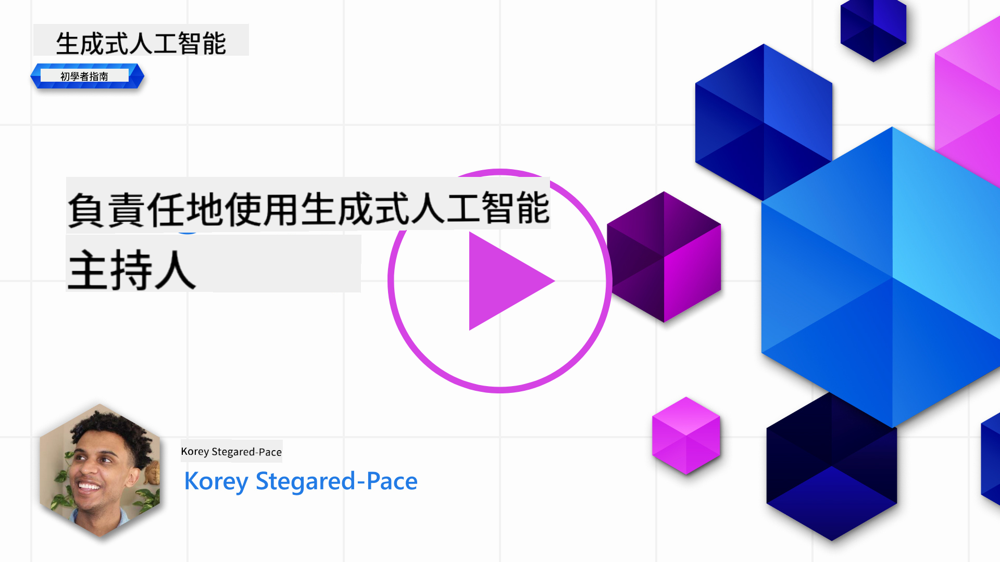
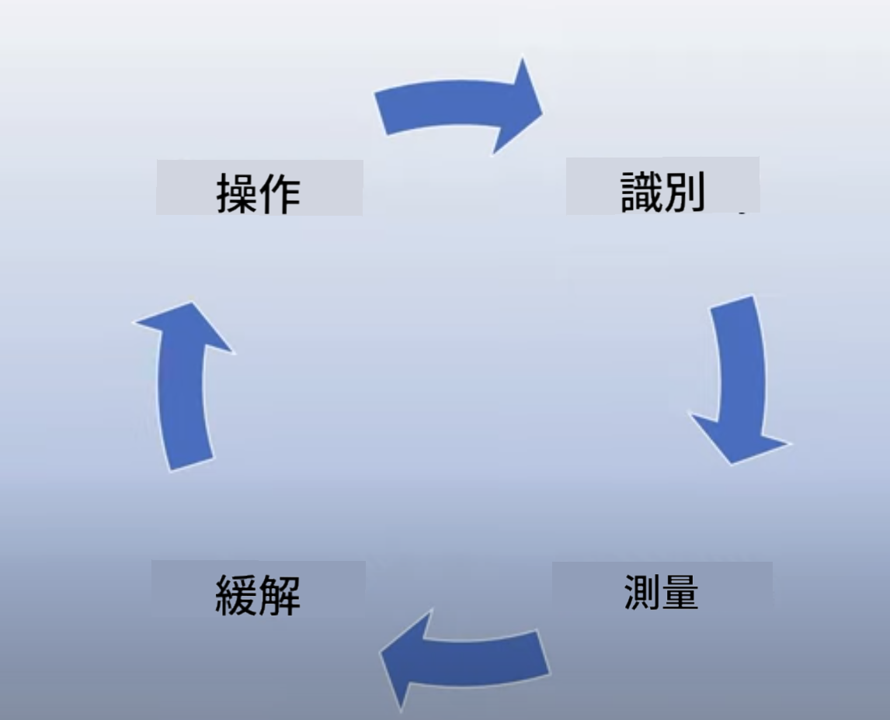
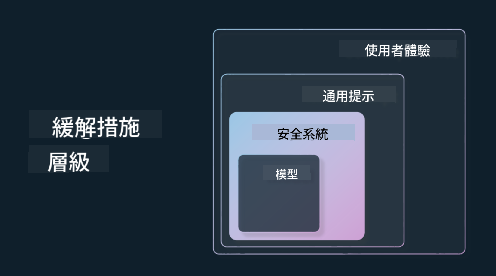

<!--
CO_OP_TRANSLATOR_METADATA:
{
  "original_hash": "4d57fad773cbeb69c5dd62e65c34200d",
  "translation_date": "2025-10-17T23:32:54+00:00",
  "source_file": "03-using-generative-ai-responsibly/README.md",
  "language_code": "hk"
}
-->
# 負責任地使用生成式人工智能

> _點擊上方圖片觀看本課程的視頻_

生成式人工智能的魅力令人著迷，但我們需要考慮如何負責任地使用它。我們需要考慮如何確保其輸出是公平的、不具傷害性的等等。本章旨在為您提供相關背景知識，探討需要考慮的因素，以及如何採取積極措施改善人工智能的使用方式。

## 簡介

本課程將涵蓋：

- 為什麼在構建生成式人工智能應用時應優先考慮負責任的人工智能。
- 負責任人工智能的核心原則及其與生成式人工智能的關係。
- 如何通過策略和工具實踐這些負責任人工智能的原則。

## 學習目標

完成本課程後，您將了解：

- 在構建生成式人工智能應用時，負責任人工智能的重要性。
- 在構建生成式人工智能應用時，何時應考慮並應用負責任人工智能的核心原則。
- 可用於實踐負責任人工智能概念的工具和策略。

## 負責任人工智能原則

生成式人工智能的熱潮前所未有地高漲。這種熱潮吸引了大量新開發者、關注和資金進入這一領域。對於希望利用生成式人工智能構建產品和公司的任何人來說，這是一件非常積極的事情，但同時也需要我們以負責任的方式前進。

在整個課程中，我們專注於構建我們的初創公司和人工智能教育產品。我們將使用負責任人工智能的原則：公平性、包容性、可靠性/安全性、安全性與隱私、透明性和問責性。通過這些原則，我們將探討它們如何與我們在產品中使用生成式人工智能相關。

## 為什麼應優先考慮負責任人工智能

在構建產品時，採取以人為中心的方法，並以用戶的最佳利益為出發點，通常能夠帶來最佳結果。

生成式人工智能的獨特之處在於它能夠為用戶創造有用的答案、信息、指導和內容。這可以在不需要太多手動步驟的情況下完成，從而產生非常令人印象深刻的結果。然而，若缺乏適當的規劃和策略，也可能不幸地導致對用戶、產品以及整個社會的某些有害結果。

讓我們來看看其中一些（但並非全部）潛在的有害結果：

### 幻覺

幻覺是指當大型語言模型（LLM）生成的內容完全不合邏輯或根據其他信息來源明顯錯誤時。

舉例來說，我們為初創公司構建了一個功能，允許學生向模型提問歷史問題。一名學生問道：`誰是泰坦尼克號唯一的倖存者？`

模型生成了如下回應：

> _(來源: [Flying bisons](https://flyingbisons.com?WT.mc_id=academic-105485-koreyst))_

這是一個非常自信且詳細的回答。不幸的是，它是錯誤的。即使進行最少量的研究，也可以發現泰坦尼克號災難中不止一名倖存者。對於剛開始研究這個主題的學生來說，這個答案可能足夠有說服力而不被質疑，並被視為事實。這可能導致人工智能系統不可靠，並對我們初創公司的聲譽造成負面影響。

隨著每次大型語言模型的迭代，我們看到在減少幻覺方面的性能有所改善。即使有這種改善，作為應用構建者和使用者，我們仍需意識到這些限制。

### 有害內容

在前面的部分中，我們討論了當大型語言模型生成錯誤或不合邏輯的回應時的情況。另一個需要注意的風險是模型生成有害內容。

有害內容可以定義為：

- 提供指導或鼓勵自我傷害或對某些群體造成傷害。
- 仇恨或貶低的內容。
- 指導策劃任何形式的攻擊或暴力行為。
- 提供如何尋找非法內容或實施非法行為的指導。
- 顯示性露骨內容。

對於我們的初創公司，我們希望確保擁有適當的工具和策略，以防止學生看到此類內容。

### 缺乏公平性

公平性被定義為“確保人工智能系統不帶有偏見和歧視，並公平對待每個人”。在生成式人工智能的世界中，我們希望確保模型的輸出不會加劇對邊緣化群體的排斥性世界觀。

這類輸出不僅會破壞為用戶創建積極產品體驗的努力，還會對社會造成進一步的傷害。作為應用構建者，我們在使用生成式人工智能構建解決方案時，應始終考慮到廣泛且多樣化的用戶群體。

## 如何負責任地使用生成式人工智能

現在我們已經確定了負責任生成式人工智能的重要性，讓我們來看看可以採取的四個步驟，以負責任地構建人工智能解決方案：

### 衡量潛在危害

在軟件測試中，我們會測試用戶在應用上的預期操作。同樣，測試用戶最有可能使用的一組多樣化的提示也是衡量潛在危害的好方法。

由於我們的初創公司正在構建一個教育產品，準備一份與教育相關的提示清單會很有幫助。這可以涵蓋某些學科、歷史事實以及有關學生生活的提示。

### 減輕潛在危害

現在是時候找到方法來防止或限制模型及其回應可能造成的潛在危害。我們可以從四個不同的層面來看：

- **模型**。為特定用例選擇合適的模型。像 GPT-4 這樣更大更複雜的模型在應用於較小且更具特定用途的情況時可能會帶來更多有害內容的風險。使用您的訓練數據進行微調也可以減少有害內容的風險。

- **安全系統**。安全系統是一組工具和配置，用於服務模型的平台上，以幫助減輕危害。例如，Azure OpenAI 服務上的內容過濾系統。系統還應檢測越獄攻擊和不必要的活動，例如來自機器人的請求。

- **元提示**。元提示和基礎是我們可以根據某些行為和信息指導或限制模型的方法。這可以通過系統輸入來定義模型的某些限制。此外，提供更符合系統範圍或領域的輸出。

它還可以使用像檢索增強生成（RAG）這樣的技術，讓模型僅從一組可信來源中提取信息。本課程稍後有一節專門講解[構建搜索應用](../08-building-search-applications/README.md?WT.mc_id=academic-105485-koreyst)

- **用戶體驗**。最後一層是用戶通過我們應用的界面直接與模型交互。在這種情況下，我們可以設計 UI/UX 來限制用戶向模型發送的輸入類型，以及顯示給用戶的文本或圖像。在部署人工智能應用時，我們還必須透明地告知我們的生成式人工智能應用的能力和限制。

我們有一整節課程專門講解[設計人工智能應用的用戶體驗](../12-designing-ux-for-ai-applications/README.md?WT.mc_id=academic-105485-koreyst)

- **評估模型**。與大型語言模型合作可能具有挑戰性，因為我們無法完全控制模型的訓練數據。儘管如此，我們仍應始終評估模型的性能和輸出。衡量模型輸出的準確性、相似性、基礎性和相關性仍然很重要。這有助於向利益相關者和用戶提供透明度和信任。

### 運營負責任的生成式人工智能解決方案

圍繞您的人工智能應用構建運營實踐是最後階段。這包括與我們初創公司的其他部門（如法律和安全部門）合作，以確保我們符合所有監管政策。在推出之前，我們還需要制定交付、處理事件和回滾計劃，以防止對用戶造成任何傷害。

## 工具

雖然開發負責任人工智能解決方案的工作看起來很多，但這是一項非常值得付出的工作。隨著生成式人工智能領域的發展，幫助開發者高效地將責任融入工作流程的工具將會更加成熟。例如，[Azure AI Content Safety](https://learn.microsoft.com/azure/ai-services/content-safety/overview?WT.mc_id=academic-105485-koreyst)可以通過 API 請求幫助檢測有害內容和圖像。

## 知識檢查

為確保負責任的人工智能使用，您需要關注哪些方面？

1. 答案是否正確。
1. 防止有害使用，確保人工智能不被用於犯罪目的。
1. 確保人工智能不帶有偏見和歧視。

A: 2 和 3 是正確的。負責任人工智能幫助您考慮如何減輕有害影響和偏見等問題。

## 🚀 挑戰

閱讀 [Azure AI Content Safety](https://learn.microsoft.com/azure/ai-services/content-safety/overview?WT.mc_id=academic-105485-koreyst)，看看您可以採用哪些功能。

## 出色的工作，繼續學習

完成本課程後，請查看我們的[生成式人工智能學習合集](https://aka.ms/genai-collection?WT.mc_id=academic-105485-koreyst)，繼續提升您的生成式人工智能知識！

前往第 4 課，我們將探討[提示工程基礎](../04-prompt-engineering-fundamentals/README.md?WT.mc_id=academic-105485-koreyst)！

---

**免責聲明**：  
此文件已使用人工智能翻譯服務 [Co-op Translator](https://github.com/Azure/co-op-translator) 進行翻譯。儘管我們致力於提供準確的翻譯，但請注意，自動翻譯可能包含錯誤或不準確之處。原始文件的母語版本應被視為權威來源。對於重要信息，建議使用專業人工翻譯。我們對因使用此翻譯而引起的任何誤解或誤釋不承擔責任。