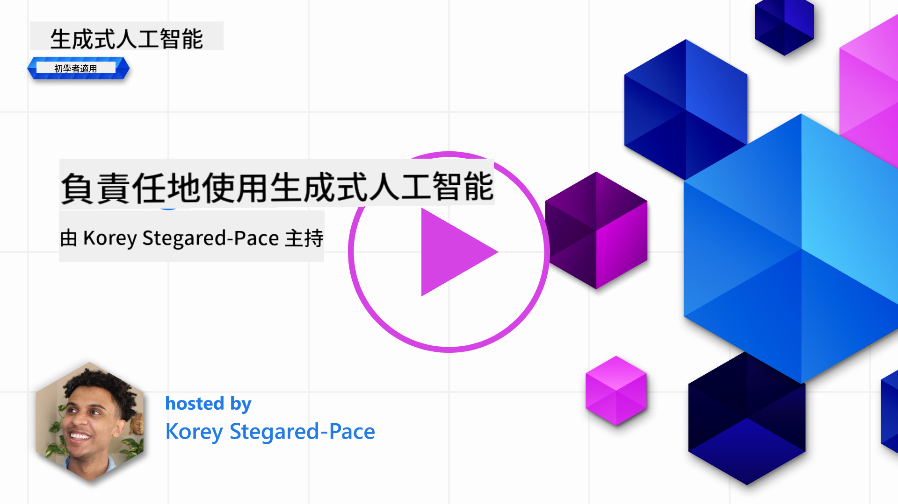

<!--
CO_OP_TRANSLATOR_METADATA:
{
  "original_hash": "7f8f4c11f8c1cb6e1794442dead414ea",
  "translation_date": "2025-07-09T08:49:38+00:00",
  "source_file": "03-using-generative-ai-responsibly/README.md",
  "language_code": "hk"
}
-->
# 負責任地使用生成式 AI

> _點擊上方圖片觀看本課程影片_

生成式 AI 很容易讓人著迷，但你需要思考如何負責任地使用它。你必須考慮如何確保輸出結果公平、不具傷害性等等。本章旨在提供相關背景、應注意的事項，以及如何採取積極措施改善你的 AI 使用方式。

## 介紹

本課程將涵蓋：

- 為何在開發生成式 AI 應用時，應優先考慮負責任的 AI。
- 負責任 AI 的核心原則及其與生成式 AI 的關聯。
- 如何透過策略和工具將這些負責任 AI 原則付諸實踐。

## 學習目標

完成本課程後，你將了解：

- 在開發生成式 AI 應用時，負責任 AI 的重要性。
- 何時思考並應用負責任 AI 的核心原則。
- 可用來實踐負責任 AI 概念的工具和策略。

## 負責任 AI 原則

生成式 AI 的熱潮前所未有，吸引了大量新開發者、關注和資金。這對於想利用生成式 AI 建立產品和公司的任何人來說都是非常正面的，但同時我們也必須負責任地前進。

在本課程中，我們專注於打造我們的創業公司和 AI 教育產品。我們將運用負責任 AI 的原則：公平性、包容性、可靠性／安全性、安全與隱私、透明度及問責制。透過這些原則，我們將探討它們如何與我們產品中生成式 AI 的使用相關。

## 為什麼要優先考慮負責任 AI

在打造產品時，採取以人為本的方式，將用戶的最佳利益放在心上，才能達到最佳成果。

生成式 AI 的獨特之處在於它能為用戶創造有用的答案、資訊、指引和內容，且過程中不需太多手動步驟，能產生令人印象深刻的結果。但若缺乏適當的規劃和策略，也可能對用戶、產品甚至整個社會造成傷害。

以下列出一些（但非全部）可能的傷害結果：

### 幻覺（Hallucinations）

幻覺是指大型語言模型（LLM）產生完全無意義或明顯與其他資訊來源不符的內容。

舉例來說，我們為創業公司開發一個功能，讓學生向模型提問歷史問題。學生問：「誰是鐵達尼號的唯一生還者？」

模型可能會產生如下回答：

> _(來源：[Flying bisons](https://flyingbisons.com?WT.mc_id=academic-105485-koreyst))_

這是一個非常自信且詳盡的回答，但不幸的是錯誤的。稍加查證就會發現鐵達尼號災難有多位生還者。對於剛開始研究這個主題的學生來說，這樣的回答可能足以讓他們不加質疑地當作事實。這種情況會導致 AI 系統不可靠，並對我們創業公司的聲譽造成負面影響。

每次大型語言模型的迭代，我們都看到在減少幻覺方面的性能提升。即便如此，作為應用開發者和使用者，我們仍需保持對這些限制的警覺。

### 有害內容

前面提到 LLM 產生錯誤或無意義回應的情況，另一個風險是模型回應有害內容。

有害內容可定義為：

- 提供自我傷害或傷害特定群體的指示或鼓勵。
- 仇恨或貶低性的內容。
- 指導策劃任何形式的攻擊或暴力行為。
- 提供尋找非法內容或進行非法行為的指示。
- 顯示色情內容。

對於我們的創業公司，我們希望確保有適當的工具和策略，防止學生看到這類內容。

### 缺乏公平性

公平性指「確保 AI 系統不帶偏見和歧視，並公平且平等地對待每個人」。在生成式 AI 領域，我們希望確保模型的輸出不會強化對邊緣化群體的排斥性世界觀。

這類輸出不僅破壞用戶的正面產品體驗，也會對社會造成進一步傷害。作為應用開發者，我們應始終考慮廣泛且多元的用戶群體，打造生成式 AI 解決方案。

## 如何負責任地使用生成式 AI

既然已了解負責任生成式 AI 的重要性，接下來看看我們可以採取的 4 個步驟，來負責任地打造 AI 解決方案：

### 測量潛在傷害

在軟體測試中，我們會測試用戶對應用的預期操作。同理，測試用戶最可能使用的多樣化提示，是衡量潛在傷害的好方法。

由於我們的創業公司正在打造教育產品，準備一份與教育相關的提示清單會很有幫助。這些提示可涵蓋特定科目、歷史事實及學生生活相關問題。

### 減輕潛在傷害

現在是時候尋找方法，防止或限制模型及其回應可能造成的傷害。我們可以從四個層面來看：

- **模型**。為合適的使用案例選擇合適的模型。像 GPT-4 這類較大且複雜的模型，在應用於較小且特定的使用場景時，可能帶來較高的有害內容風險。利用訓練資料進行微調也能降低有害內容的風險。

- **安全系統**。安全系統是平台上用於服務模型的一套工具和配置，幫助減輕傷害。例如 Azure OpenAI 服務的內容過濾系統。系統還應能偵測越獄攻擊和不當行為，如機器人請求。

- **元提示（Metaprompt）**。元提示和基礎設定是我們用來引導或限制模型行為和資訊的方法。這可能包括使用系統輸入定義模型的某些限制，或提供更符合系統範圍或領域的輸出。

也可以使用像是檢索增強生成（Retrieval Augmented Generation, RAG）等技術，讓模型只從一組可信來源中提取資訊。本課程後面有一課專門講解[建立搜尋應用](../08-building-search-applications/README.md?WT.mc_id=academic-105485-koreyst)。

- **用戶體驗**。最後一層是用戶透過我們應用介面直接與模型互動。我們可以設計 UI/UX，限制用戶可傳送給模型的輸入類型，以及展示給用戶的文字或圖片。部署 AI 應用時，也必須透明說明我們的生成式 AI 應用能做什麼、不能做什麼。

我們有整堂課專門講解[為 AI 應用設計 UX](../12-designing-ux-for-ai-applications/README.md?WT.mc_id=academic-105485-koreyst)。

- **評估模型**。使用大型語言模型具有挑戰性，因為我們無法完全掌控模型訓練資料。無論如何，我們應持續評估模型的表現和輸出。評估模型的準確度、相似度、基礎性和相關性仍然很重要，有助於向利害關係人和用戶提供透明度和信任。

### 運營負責任的生成式 AI 解決方案

建立 AI 應用的運營實務是最後階段。這包括與創業公司內其他部門如法務和安全合作，確保遵守所有法規政策。上線前，我們還要制定交付計劃、事件處理和回滾方案，以防止用戶受到傷害擴大。

## 工具

雖然開發負責任 AI 解決方案的工作看似繁重，但絕對值得投入。隨著生成式 AI 領域成長，越來越多工具將幫助開發者有效地將責任納入工作流程。例如，[Azure AI Content Safety](https://learn.microsoft.com/azure/ai-services/content-safety/overview?WT.mc_id=academic-105485-koreyst) 可透過 API 請求偵測有害內容和圖片。

## 知識檢核

為確保負責任使用 AI，你需要關注哪些事項？

1. 答案是否正確。
1. 防止有害使用，確保 AI 不被用於犯罪目的。
1. 確保 AI 不帶偏見和歧視。

答：2 和 3 正確。負責任 AI 幫助你思考如何減輕有害影響、偏見等問題。

## 🚀 挑戰

閱讀[Azure AI Content Safety](https://learn.microsoft.com/azure/ai-services/content-safety/overview?WT.mc_id=academic-105485-koreyst)，看看你能採用哪些方法。

## 做得好，繼續學習

完成本課程後，請參考我們的[生成式 AI 學習合集](https://aka.ms/genai-collection?WT.mc_id=academic-105485-koreyst)，持續提升你的生成式 AI 知識！

接著前往第 4 課，我們將探討[提示工程基礎](../04-prompt-engineering-fundamentals/README.md?WT.mc_id=academic-105485-koreyst)！

**免責聲明**：  
本文件乃使用 AI 翻譯服務 [Co-op Translator](https://github.com/Azure/co-op-translator) 進行翻譯。雖然我們致力於確保準確性，但請注意，自動翻譯可能包含錯誤或不準確之處。原始文件的母語版本應被視為權威來源。對於重要資訊，建議採用專業人工翻譯。我們不對因使用本翻譯而引致的任何誤解或誤釋承擔責任。