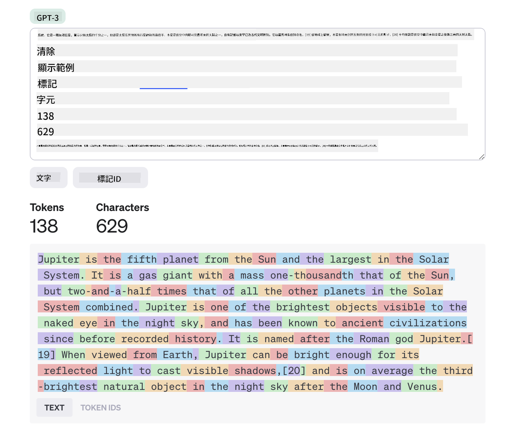
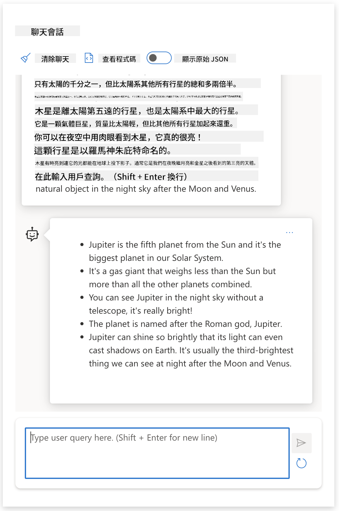
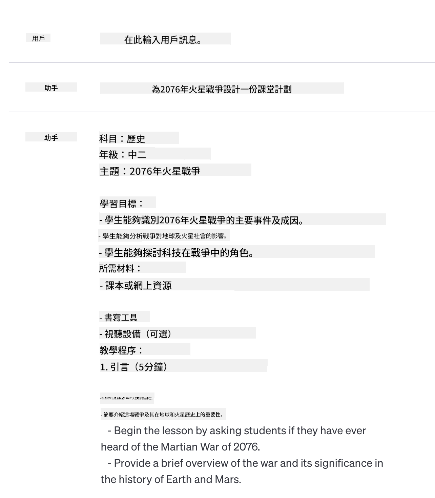
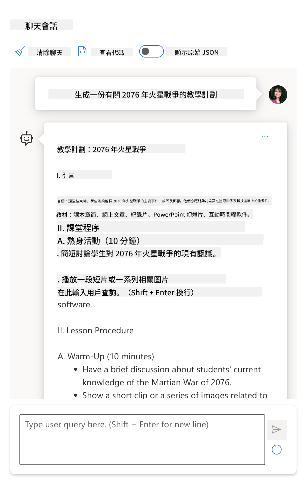

<!--
CO_OP_TRANSLATOR_METADATA:
{
  "original_hash": "0135e6c271f3ece8699050d4debbce88",
  "translation_date": "2025-10-17T23:37:22+00:00",
  "source_file": "04-prompt-engineering-fundamentals/README.md",
  "language_code": "hk"
}
-->
# 提示工程基礎

[](https://youtu.be/GElCu2kUlRs?si=qrXsBvXnCW12epb8)

## 簡介
本模組涵蓋了在生成式 AI 模型中創建有效提示的基本概念和技術。如何向 LLM 撰寫提示非常重要。一個精心設計的提示可以獲得更高質量的回應。但究竟什麼是 _提示_ 和 _提示工程_？以及如何改進我發送給 LLM 的提示 _輸入_？這些是我們將在本章及下一章中嘗試回答的問題。

_生成式 AI_ 能夠根據用戶的請求創建新的內容（例如，文本、圖片、音頻、代碼等）。它通過使用像 OpenAI 的 GPT（"生成預訓練變壓器"）系列這樣的 _大型語言模型_，以自然語言和代碼進行訓練來實現。

現在用戶可以使用熟悉的方式與這些模型互動，例如聊天，而不需要任何技術專業知識或訓練。這些模型是 _基於提示_ 的——用戶發送文本輸入（提示），並獲得 AI 的回應（完成）。他們可以在多輪對話中與 AI 進行迭代聊天，逐步完善提示，直到回應符合他們的期望。

"提示" 現在成為生成式 AI 應用的主要 _編程介面_，用來告訴模型該做什麼並影響返回回應的質量。"提示工程" 是一個快速增長的研究領域，專注於提示的 _設計和優化_，以大規模地提供一致且高質量的回應。

## 學習目標

在本課程中，我們將學習什麼是提示工程、它的重要性，以及如何為特定模型和應用目標設計更有效的提示。我們將了解提示工程的核心概念和最佳實踐，並學習一個互動式 Jupyter Notebook "沙盒" 環境，看看這些概念如何應用於實際例子。

在本課程結束時，我們將能夠：

1. 解釋什麼是提示工程及其重要性。
2. 描述提示的組成部分及其用途。
3. 學習提示工程的最佳實踐和技術。
4. 使用 OpenAI 端點將所學技術應用於實際例子。

## 關鍵術語

提示工程：設計和改進輸入以引導 AI 模型生成期望輸出的實踐。
分詞：將文本轉換為模型可以理解和處理的小單元（稱為 token）的過程。
指令調整 LLM：通過特定指令進行微調以提高回應準確性和相關性的 _大型語言模型_（LLM）。

## 學習沙盒

提示工程目前更像是一門藝術而非科學。提高直覺的最佳方法是 _多加練習_，並採用結合應用領域專業知識、推薦技術和模型特定優化的試錯法。

本課程附帶的 Jupyter Notebook 提供了一個 _沙盒_ 環境，您可以在學習過程中或課程結束後的代碼挑戰中嘗試所學內容。要執行練習，您需要：

1. **Azure OpenAI API 密鑰**——已部署 LLM 的服務端點。
2. **Python 運行環境**——用於執行 Notebook。
3. **本地環境變數**——_完成 [設置](./../00-course-setup/02-setup-local.md?WT.mc_id=academic-105485-koreyst) 步驟以準備好_。

Notebook 附帶了 _入門_ 練習——但我們鼓勵您添加自己的 _Markdown_（描述）和 _代碼_（提示請求）部分，以嘗試更多例子或想法，並建立提示設計的直覺。

## 圖解指南

想在深入學習之前了解本課程涵蓋的主要內容嗎？查看這份圖解指南，它可以幫助您了解涵蓋的主要主題以及每個主題的關鍵要點。課程路線圖將引導您從理解核心概念和挑戰到使用相關的提示工程技術和最佳實踐來解決這些問題。請注意，指南中的 "高級技術" 部分指的是本課程下一章節中涵蓋的內容。


## 我們的初創公司

現在，讓我們談談 _這個主題_ 如何與我們的初創公司使命 [將 AI 創新帶入教育](https://educationblog.microsoft.com/2023/06/collaborating-to-bring-ai-innovation-to-education?WT.mc_id=academic-105485-koreyst) 相關。我們希望構建基於 AI 的 _個性化學習_ 應用程序——因此讓我們思考一下我們應用程序的不同用戶如何 "設計" 提示：

- **管理者** 可能會要求 AI _分析課程數據以識別覆蓋範圍的不足之處_。AI 可以總結結果或使用代碼進行可視化。
- **教育工作者** 可能會要求 AI _為目標受眾和主題生成課程計劃_。AI 可以以指定格式構建個性化計劃。
- **學生** 可能會要求 AI _輔導他們學習困難的科目_。AI 現在可以根據學生的水平提供量身定制的課程、提示和例子。

這僅僅是冰山一角。查看 [教育提示](https://github.com/microsoft/prompts-for-edu/tree/main?WT.mc_id=academic-105485-koreyst)——由教育專家策劃的開源提示庫——以更廣泛地了解可能性！_嘗試在沙盒中運行其中一些提示，或使用 OpenAI Playground 看看會發生什麼！_

## 什麼是提示工程？

我們在本課程開始時將 **提示工程** 定義為 _設計和優化_ 文本輸入（提示）的過程，以便為特定的應用目標和模型提供一致且高質量的回應（完成）。我們可以將其視為一個兩步過程：

- 為特定模型和目標 _設計_ 初始提示
- 通過迭代 _改進_ 提示以提高回應質量

這必然是一個需要用戶直覺和努力的試錯過程，才能獲得最佳結果。那麼為什麼它很重要？要回答這個問題，我們首先需要了解三個概念：

- _分詞_ = 模型如何 "看待" 提示
- _基礎 LLM_ = 基礎模型如何 "處理" 提示
- _指令調整 LLM_ = 模型如何 "理解" 任務

### 分詞

LLM 將提示視為 _token 的序列_，不同的模型（或模型版本）可以以不同的方式對同一提示進行分詞。由於 LLM 是基於 token 而非原始文本進行訓練的，因此提示的分詞方式會直接影響生成回應的質量。

要了解分詞的工作原理，可以嘗試使用 [OpenAI Tokenizer](https://platform.openai.com/tokenizer?WT.mc_id=academic-105485-koreyst) 等工具。將您的提示複製到工具中，看看它如何轉換為 token，注意空白字符和標點符號的處理方式。請注意，此示例顯示的是舊版 LLM（GPT-3）——因此使用更新的模型可能會產生不同的結果。



### 概念：基礎模型

一旦提示被分詞，["基礎 LLM"](https://blog.gopenai.com/an-introduction-to-base-and-instruction-tuned-large-language-models-8de102c785a6?WT.mc_id=academic-105485-koreyst)（或基礎模型）的主要功能是預測該序列中的下一個 token。由於 LLM 是基於大量文本數據集進行訓練的，它們對 token 之間的統計關係有很好的理解，並能夠有信心地進行預測。請注意，它們並不理解提示或 token 中單詞的 _含義_；它們只是看到一個模式，然後通過下一次預測來 "完成" 該模式。它們可以繼續預測序列，直到用戶干預或某些預設條件終止。

想看看基於提示的完成如何工作嗎？將上述提示輸入到 Azure OpenAI Studio 的 [_Chat Playground_](https://oai.azure.com/playground?WT.mc_id=academic-105485-koreyst) 中，使用默認設置。系統被配置為將提示視為信息請求——因此您應該看到滿足此上下文的完成。

但如果用戶希望看到符合某些標準或任務目標的特定內容呢？這就是 _指令調整_ LLM 發揮作用的地方。


### 概念：指令調整 LLM

[指令調整 LLM](https://blog.gopenai.com/an-introduction-to-base-and-instruction-tuned-large-language-models-8de102c785a6?WT.mc_id=academic-105485-koreyst) 從基礎模型開始，並通過示例或輸入/輸出對（例如，多輪 "消息"）進行微調，這些示例或輸入/輸出對可以包含明確的指令——AI 的回應會嘗試遵循該指令。

這使用了像人類反饋強化學習（RLHF）這樣的技術，可以訓練模型 _遵循指令_ 並 _從反饋中學習_，從而生成更適合實際應用且更符合用戶目標的回應。

讓我們來試試看——重新訪問上述提示，但現在更改 _系統消息_，提供以下指令作為上下文：

> _總結提供的內容，針對二年級學生。將結果保持在一段文字內，並包含 3-5 個要點。_

看看結果如何反映所需的目標和格式？教育工作者現在可以直接將此回應用於該課程的幻燈片中。



## 為什麼我們需要提示工程？

現在我們知道 LLM 如何處理提示，讓我們來談談 _為什麼_ 我們需要提示工程。答案在於當前的 LLM 存在一些挑戰，使得在不投入提示構建和優化努力的情況下更難實現 _可靠且一致的完成_。例如：

1. **模型回應具有隨機性。** _相同的提示_ 很可能會在不同的模型或模型版本中產生不同的回應。甚至在 _相同的模型_ 中在不同時間也可能產生不同的結果。_提示工程技術可以幫助我們通過提供更好的防護措施來減少這些變化_。

1. **模型可能會捏造回應。** 模型是基於 _大但有限_ 的數據集進行預訓練的，這意味著它們缺乏對訓練範圍之外概念的知識。因此，它們可能會生成不準確、虛構或直接與已知事實相矛盾的完成。_提示工程技術幫助用戶識別並減少此類捏造，例如要求 AI 提供引用或推理_。

1. **模型能力會有所不同。** 新的模型或模型版本將具有更豐富的能力，但也帶來成本和複雜性上的獨特問題。_提示工程可以幫助我們開發最佳實踐和工作流程，抽象化差異並以可擴展、無縫的方式適應模型特定需求_。

讓我們在 OpenAI 或 Azure OpenAI Playground 中看看這些情況：

- 使用相同的提示在不同的 LLM 部署（例如 OpenAI、Azure OpenAI、Hugging Face）中運行——您是否看到變化？
- 使用相同的提示在 _相同_ 的 LLM 部署（例如 Azure OpenAI Playground）中反復運行——這些變化有什麼不同？

### 捏造例子

在本課程中，我們使用術語 **"捏造"** 來指代 LLM 有時因其訓練限制或其他約束生成事實上不正確信息的現象。您可能在流行文章或研究論文中聽過這被稱為 _"幻覺"_。然而，我們強烈建議使用 _"捏造"_ 作為術語，以免因將人類特徵賦予機器驅動的結果而不小心擬人化該行為。這也從術語角度加強了 [負責任 AI 指南](https://www.microsoft.com/ai/responsible-ai?WT.mc_id=academic-105485-koreyst)，去除可能在某些情境中被認為具有冒犯性或不包容的術語。

想了解捏造是如何工作的嗎？想一個指令 AI 為一個不存在的主題生成內容的提示（以確保它不在訓練數據集中）。例如——我嘗試了以下提示：

> **提示：** 為 2076 年的火星戰爭生成一個課程計劃。
網絡搜索顯示有關火星戰爭的虛構故事（例如電視劇或書籍）——但沒有提到2076年的事件。常識告訴我們，2076年是未來的年份，因此不可能與真實事件相關。

那麼，當我們使用不同的LLM提供商運行此提示時會發生什麼？

> **回應 1**：OpenAI Playground (GPT-35)



> **回應 2**：Azure OpenAI Playground (GPT-35)



> **回應 3**：Hugging Face Chat Playground (LLama-2)


如預期，每個模型（或模型版本）因隨機行為和模型能力的差異而產生略有不同的回應。例如，一個模型針對八年級的受眾，而另一個則假設是高中生。但三個模型都生成了可能讓不知情的用戶相信事件是真實的回應。

像 _metaprompting_ 和 _temperature configuration_ 這樣的提示工程技術可能在一定程度上減少模型的虛構內容。新的提示工程 _架構_ 也無縫地將新工具和技術整合到提示流程中，以減輕或減少這些影響。

## 案例研究：GitHub Copilot

讓我們通過一個案例研究來了解提示工程在實際解決方案中的應用： [GitHub Copilot](https://github.com/features/copilot?WT.mc_id=academic-105485-koreyst)。

GitHub Copilot 是你的 "AI 配對程式員"——它將文字提示轉換為代碼補全，並集成到你的開發環境（例如 Visual Studio Code）中，提供無縫的用戶體驗。正如以下系列博客中所記錄的，最早的版本基於 OpenAI Codex 模型——工程師很快意識到需要微調模型並開發更好的提示工程技術，以提高代碼質量。在七月，他們 [推出了一個超越 Codex 的改進 AI 模型](https://github.blog/2023-07-28-smarter-more-efficient-coding-github-copilot-goes-beyond-codex-with-improved-ai-model/?WT.mc_id=academic-105485-koreyst)，提供更快的建議。

按順序閱讀以下文章，了解他們的學習過程。

- **2023年5月** | [GitHub Copilot 在理解你的代碼方面變得更好](https://github.blog/2023-05-17-how-github-copilot-is-getting-better-at-understanding-your-code/?WT.mc_id=academic-105485-koreyst)
- **2023年5月** | [GitHub內部：與 GitHub Copilot 背後的 LLMs 合作](https://github.blog/2023-05-17-inside-github-working-with-the-llms-behind-github-copilot/?WT.mc_id=academic-105485-koreyst)
- **2023年6月** | [如何為 GitHub Copilot 編寫更好的提示](https://github.blog/2023-06-20-how-to-write-better-prompts-for-github-copilot/?WT.mc_id=academic-105485-koreyst)
- **2023年7月** | [GitHub Copilot 超越 Codex，擁有改進的 AI 模型](https://github.blog/2023-07-28-smarter-more-efficient-coding-github-copilot-goes-beyond-codex-with-improved-ai-model/?WT.mc_id=academic-105485-koreyst)
- **2023年7月** | [開發者的提示工程和 LLMs 指南](https://github.blog/2023-07-17-prompt-engineering-guide-generative-ai-llms/?WT.mc_id=academic-105485-koreyst)
- **2023年9月** | [如何構建企業 LLM 應用：GitHub Copilot 的教訓](https://github.blog/2023-09-06-how-to-build-an-enterprise-llm-application-lessons-from-github-copilot/?WT.mc_id=academic-105485-koreyst)

你也可以瀏覽他們的 [工程博客](https://github.blog/category/engineering/?WT.mc_id=academic-105485-koreyst)，了解更多像 [這篇文章](https://github.blog/2023-09-27-how-i-used-github-copilot-chat-to-build-a-reactjs-gallery-prototype/?WT.mc_id=academic-105485-koreyst) 的內容，展示這些模型和技術如何應用於推動實際應用。

---

## 提示構建

我們已經了解了提示工程的重要性——現在讓我們來理解提示是如何 _構建_ 的，以便評估不同技術以設計更有效的提示。

### 基本提示

讓我們從基本提示開始：一個沒有其他上下文的文字輸入發送到模型。以下是一個例子——當我們將美國國歌的前幾個字發送到 OpenAI [Completion API](https://platform.openai.com/docs/api-reference/completions?WT.mc_id=academic-105485-koreyst) 時，它立即用接下來的幾行完成回應，展示了基本的預測行為。

| 提示（輸入）     | 完成（輸出）                                                                                                                        |
| :----------------- | :----------------------------------------------------------------------------------------------------------------------------------------- |
| Oh say can you see | 看起來你正在開始唱《星條旗永不落》的歌詞，這是美國的國歌。完整的歌詞是... |

### 複雜提示

現在讓我們在基本提示中添加上下文和指令。[Chat Completion API](https://learn.microsoft.com/azure/ai-services/openai/how-to/chatgpt?WT.mc_id=academic-105485-koreyst) 讓我們可以構建一個由 _消息_ 組成的複雜提示，包括：

- 反映 _用戶_ 輸入和 _助手_ 回應的輸入/輸出對。
- 設定助手行為或個性的系統消息。

請求現在的形式如下，其中 _分詞_ 有效地捕捉了上下文和對話中的相關信息。現在，改變系統上下文可能對完成質量的影響與提供的用戶輸入一樣重要。

```python
response = openai.chat.completions.create(
    model="gpt-3.5-turbo",
    messages=[
        {"role": "system", "content": "You are a helpful assistant."},
        {"role": "user", "content": "Who won the world series in 2020?"},
        {"role": "assistant", "content": "The Los Angeles Dodgers won the World Series in 2020."},
        {"role": "user", "content": "Where was it played?"}
    ]
)
```

### 指令提示

在上述例子中，用戶提示是一個簡單的文字查詢，可以解釋為信息請求。使用 _指令_ 提示，我們可以使用該文字更詳細地指定任務，為AI提供更好的指導。以下是一個例子：

| 提示（輸入）                                                                                                                                                                                                                         | 完成（輸出）                                                                                                        | 指令類型    |
| :------------------------------------------------------------------------------------------------------------------------------------------------------------------------------------------------------------------------------------- | :------------------------------------------------------------------------------------------------------------------------- | :------------------ |
| 描述美國內戰                                                                                                                                                                                                   | _返回了一個簡單的段落_                                                                                              | 簡單              |
| 描述美國內戰。提供關鍵日期和事件並描述其重要性                                                                                                                                     | _返回了一個段落，隨後是一個關鍵事件日期和描述的列表_                                             | 複雜             |
| 描述美國內戰，用一段話。提供3個關鍵日期及其重要性。提供另外3個關鍵歷史人物及其貢獻。以JSON文件格式返回輸出。 | _返回更詳細的文本框，格式化為JSON，你可以複製粘貼到文件並根據需要進行驗證_ | 複雜。格式化。 |

## 主要內容

在上述例子中，提示仍然相當開放，允許LLM決定其預訓練數據集中哪些部分是相關的。使用 _主要內容_ 設計模式，輸入文字分為兩部分：

- 一個指令（行動）
- 相關內容（影響行動）

以下是一個例子，其中指令是 "用兩句話總結這個內容"。

| 提示（輸入）                                                                                                                                                                                                                                                                                                                                                                                                                                                                                                                                                                                                                                                                                      | 完成（輸出）                                                                                                                                                                                                                                                                             |
| :-------------------------------------------------------------------------------------------------------------------------------------------------------------------------------------------------------------------------------------------------------------------------------------------------------------------------------------------------------------------------------------------------------------------------------------------------------------------------------------------------------------------------------------------------------------------------------------------------------------------------------------------------------------------------------------------------- | :---------------------------------------------------------------------------------------------------------------------------------------------------------------------------------------------------------------------------------------------------------------------------------------------- |
| 木星是太陽系中第五顆行星，也是最大的行星。它是一個氣體巨星，其質量是太陽的千分之一，但比太陽系中所有其他行星的總和還要大兩倍半。木星是夜空中肉眼可見的最亮的天體之一，自古代文明時期就已被人類所知。它以羅馬神朱庇特命名。[19] 從地球上看，木星的反射光亮度足以投射出可見的陰影，[20] 平均來說，它是夜空中僅次於月亮和金星的第三亮自然天體。 <br/> **用兩句話簡短總結** | 木星是太陽系中第五顆行星，也是最大的行星，夜空中最亮的天體之一。它以羅馬神朱庇特命名，是一個氣體巨星，其質量比太陽系中所有其他行星的總和還要大兩倍半。 |

主要內容部分可以用於多種方式以促進更有效的指令：

- **示例** - 不直接告訴模型需要做什麼，而是提供一些示例，讓它推斷出所需的模式。
- **提示** - 在指令後提供一個 "提示"，引導模型生成更相關的回應。
- **模板** - 這些是可重複使用的提示 "配方"，包含佔位符（變量），可以根據特定用例用數據進行定制。

讓我們來看看這些技術的實際應用。

### 使用示例

這是一種方法，使用主要內容向模型提供一些所需輸出的示例，讓它推斷出所需的輸出模式。根據提供的示例數量，我們可以有零次提示、一次提示、少量提示等。

提示現在由三個部分組成：

- 任務描述
- 所需輸出的幾個示例
- 新示例的開始（成為隱含的任務描述）

| 學習類型 | 提示（輸入）                                                                                                                                        | 完成（輸出）         |
| :------------ | :---------------------------------------------------------------------------------------------------------------------------------------------------- | :-------------------------- |
| 零次提示     | "太陽正在閃耀"。翻譯成西班牙語                                                                                                            | "El Sol está brillando".    |
| 一次提示      | "太陽正在閃耀" => ""El Sol está brillando". <br> "今天又冷又有風" =>                                                                 | "Es un día frío y ventoso". |
| 少量提示      | 球員跑壘 => 棒球 <br/> 球員打出一個Ace => 網球 <br/> 球員打出一個六分 => 板球 <br/> 球員完成了一個灌籃 => | 籃球                  |
|               |                                                                                                                                                       |                             |

注意在零次提示中，我們需要提供明確的指令（"翻譯成西班牙語"），但在一次提示中它已被推斷出來。少量提示的例子顯示，添加更多示例可以讓模型在沒有額外指令的情況下做出更準確的推斷。

### 提示線索

另一種使用主要內容的技術是提供 _線索_ 而不是示例。在這種情況下，我們通過 _開始_ 提供一個反映所需回應格式的片段，給模型一個正確方向的暗示。模型然後 "接收線索"，以類似的方式繼續。

| 線索數量 | 提示（輸入）                                                                                                                                                                                                                                                                                                                                                                                                                                               | 完成（輸出）                                                                                                                                                                                                                                                                                       |
| :------------- | :----------------------------------------------------------------------------------------------------------------------------------------------------------------------------------------------------------------------------------------------------------------------------------------------------------------------------------------------------------------------------------------------------------------------------------------------------------- | :-------------------------------------------------------------------------------------------------------------------------------------------------------------------------------------------------------------------------------------------------------------------------------------------------------- |
| 0              | 木星是太陽系中第五顆行星，也是最大的行星。它是一個氣體巨星，其質量是太陽的千分之一，但比太陽系中所有其他行星的總和還要大兩倍半。木星是夜空中肉眼可見的最亮的天體之一，自古代文明時期就已被人類所知。<br/>**總結此內容**                                       | 木星是太陽系中最大的行星，也是第五顆行星。它是一個氣體巨星，其質量是太陽的千分之一，但比其他行星的總和還要大兩倍半。古代文明早已知道木星，它在夜空中非常明亮。 |
| 1              | 木星是距離太陽第五顆行星，也是太陽系中最大的行星。它是一顆氣體巨星，質量僅為太陽的千分之一，但卻是太陽系中其他所有行星質量總和的兩倍半。木星是夜空中肉眼可見最亮的天體之一，自古以來就被人類文明所知。<br/>**摘要**<br/>我們學到的是木星 | 是距離太陽第五顆行星，也是太陽系中最大的行星。它是一顆氣體巨星，質量僅為太陽的千分之一，但卻是其他所有行星質量總和的兩倍半。它肉眼可輕易看到，自古以來就被人類所知。 |
| 2              | 木星是距離太陽第五顆行星，也是太陽系中最大的行星。它是一顆氣體巨星，質量僅為太陽的千分之一，但卻是太陽系中其他所有行星質量總和的兩倍半。木星是夜空中肉眼可見最亮的天體之一，自古以來就被人類文明所知。<br/>**摘要**<br/>我們學到的三個主要事實： | 1. 木星是距離太陽第五顆行星，也是太陽系中最大的行星。<br/> 2. 它是一顆氣體巨星，質量僅為太陽的千分之一...<br/> 3. 木星自古以來就能被肉眼看到... |

### 提示模板

提示模板是一種_預定義的提示配方_，可以根據需要存儲並重複使用，以便在大規模上提供更一致的用戶體驗。最簡單的形式，它僅僅是一組提示示例，例如[OpenAI的這個示例](https://platform.openai.com/examples?WT.mc_id=academic-105485-koreyst)，提供了交互式提示組件（用戶和系統消息）以及基於API的請求格式——支持重複使用。

更複雜的形式，例如[LangChain的這個示例](https://python.langchain.com/docs/concepts/prompt_templates/?WT.mc_id=academic-105485-koreyst)，它包含_佔位符_，可以用來自多種來源（用戶輸入、系統上下文、外部數據源等）的數據替換，以動態生成提示。這使我們能夠創建可重複使用的提示庫，用於以程式化方式在大規模上提供一致的用戶體驗。

最後，模板的真正價值在於能夠為垂直應用領域創建和發布_提示庫_——提示模板現在已被_優化_以反映應用特定的上下文或示例，使得回應對目標用戶群體更具相關性和準確性。[Prompts For Edu](https://github.com/microsoft/prompts-for-edu?WT.mc_id=academic-105485-koreyst)倉庫是一個很好的示例，為教育領域策劃了一個提示庫，重點放在課程規劃、課程設計、學生輔導等關鍵目標上。

## 支援內容

如果我們將提示構建視為包含指令（任務）和目標（主要內容），那麼_次要內容_就像是我們提供的額外上下文，用來**以某種方式影響輸出**。它可以是調整參數、格式指令、主題分類等，幫助模型_定制_其回應以符合所需的用戶目標或期望。

例如：給定一個課程目錄，其中包含所有課程的詳細元數據（名稱、描述、級別、元數據標籤、講師等）：

- 我們可以定義一個指令來“總結2023年秋季課程目錄”
- 我們可以使用主要內容提供一些所需輸出的示例
- 我們可以使用次要內容來識別最感興趣的5個“標籤”。

現在，模型可以按照示例顯示的格式提供摘要——但如果結果有多個標籤，它可以優先考慮次要內容中識別的5個標籤。

---

<!--
課程模板：
本單元應涵蓋核心概念#1。
通過示例和參考來加強概念。

概念#3：
提示工程技術。
提示工程有哪些基本技術？
用一些練習來說明。
-->

## 提示設計最佳實踐

現在我們知道提示可以如何_構建_，我們可以開始思考如何_設計_它們以反映最佳實踐。我們可以分為兩部分來考慮——擁有正確的_心態_和應用正確的_技術_。

### 提示工程心態

提示工程是一個反覆試驗的過程，因此請記住三個廣泛的指導因素：

1. **領域理解很重要。** 回應的準確性和相關性取決於應用或用戶所處的_領域_。運用您的直覺和領域專業知識來進一步**定制技術**。例如，在系統提示中定義_領域特定的個性_，或在用戶提示中使用_領域特定的模板_。提供反映領域特定上下文的次要內容，或使用_領域特定的提示和示例_來引導模型朝熟悉的使用模式發展。

2. **模型理解很重要。** 我們知道模型本質上是隨機的。但模型的實現也可能因其使用的訓練數據集（預訓練知識）、提供的功能（例如，通過API或SDK）以及其優化的內容類型（例如，代碼、圖像或文本）而有所不同。了解您使用的模型的優勢和局限性，並利用這些知識來_優先處理任務_或構建_定制模板_，以優化模型的能力。

3. **反覆試驗和驗證很重要。** 模型正在迅速發展，提示工程技術也在不斷進步。作為領域專家，您可能擁有其他上下文或標準，這些標準可能不適用於更廣泛的社群。使用提示工程工具和技術來“快速啟動”提示構建，然後使用您的直覺和領域專業知識進行反覆試驗和驗證結果。記錄您的見解並創建一個**知識庫**（例如，提示庫），供其他人用作未來更快迭代的新基準。

## 最佳實踐

現在讓我們來看看[OpenAI](https://help.openai.com/en/articles/6654000-best-practices-for-prompt-engineering-with-openai-api?WT.mc_id=academic-105485-koreyst)和[Azure OpenAI](https://learn.microsoft.com/azure/ai-services/openai/concepts/prompt-engineering#best-practices?WT.mc_id=academic-105485-koreyst)的從業者推薦的一些常見最佳實踐。

| 內容                              | 原因                                                                                                                                                                                                                                               |
| :-------------------------------- | :------------------------------------------------------------------------------------------------------------------------------------------------------------------------------------------------------------------------------------------------ |
| 評估最新模型。                   | 新一代模型可能具有改進的功能和質量——但也可能會產生更高的成本。評估其影響，然後做出遷移決策。                                                                                                                |
| 分離指令和上下文。               | 檢查您的模型/提供者是否定義了_分隔符_，以更清楚地區分指令、主要和次要內容。這可以幫助模型更準確地分配權重給標記。                                                                                          |
| 具體且清晰。                     | 提供更多有關所需上下文、結果、長度、格式、風格等的詳細信息。這將提高回應的質量和一致性。將配方捕捉到可重複使用的模板中。                                                                                     |
| 描述性，使用示例。               | 模型可能對“展示和講解”方法回應更好。從`零樣本`方法開始，您只需給出指令（但沒有示例），然後嘗試`少樣本`作為改進，提供一些所需輸出的示例。使用類比。                                                        |
| 使用提示啟動完成。               | 通過提供一些引導詞或短語，幫助模型朝著所需的結果方向發展，並以此作為回應的起點。                                                                                                                             |
| 重複強調。                       | 有時您可能需要對模型重複指令。在主要內容之前和之後給出指令，使用指令和提示等。反覆試驗和驗證以查看效果。                                                                                                   |
| 順序很重要。                     | 您向模型呈現信息的順序可能會影響輸出，即使是在學習示例中，由於最近性偏差。嘗試不同的選項以查看最佳效果。                                                                                                   |
| 給模型一個“退出”選項。          | 如果模型因某些原因無法完成任務，請給它一個_備選_的完成回應。這可以減少模型生成錯誤或虛假回應的可能性。                                                                                                     |
|                                   |                                                                                                                                                                                                                                                   |

與任何最佳實踐一樣，請記住，根據模型、任務和領域的不同，_您的效果可能會有所不同_。將這些作為起點，並反覆試驗以找到最適合您的方法。隨著新模型和工具的推出，持續重新評估您的提示工程過程，重點放在過程的可擴展性和回應質量上。

<!--
課程模板：
如果適用，本單元應提供代碼挑戰。

挑戰：
鏈接到一個Jupyter Notebook，其中只有代碼註釋在指令中（代碼部分是空的）。

解決方案：
鏈接到該Notebook的副本，其中填入並運行了提示，顯示一個示例結果。
-->

## 作業

恭喜！您完成了課程！現在是時候用真實示例來測試這些概念和技術了！

在作業中，我們將使用一個Jupyter Notebook，您可以在其中完成互動式練習。您還可以擴展Notebook，添加自己的Markdown和代碼單元格，以探索自己的想法和技術。

### 開始之前，請fork倉庫，然後

- （推薦）啟動GitHub Codespaces
- （可選）將倉庫克隆到本地設備並使用Docker Desktop
- （可選）使用您首選的Notebook運行環境打開Notebook。

### 接下來，配置您的環境變數

- 將倉庫根目錄中的`.env.copy`文件複製到`.env`，並填寫`AZURE_OPENAI_API_KEY`、`AZURE_OPENAI_ENDPOINT`和`AZURE_OPENAI_DEPLOYMENT`值。回到[學習沙盒部分](../../../04-prompt-engineering-fundamentals/04-prompt-engineering-fundamentals)了解如何操作。

### 然後，打開Jupyter Notebook

- 選擇運行內核。如果使用選項1或2，只需選擇開發容器提供的默認Python 3.10.x內核。

您已準備好運行練習。請注意，這裡沒有_正確或錯誤_的答案——只是通過反覆試驗探索選項，並建立對於特定模型和應用領域有效的直覺。

_因此，本課程中沒有代碼解決方案部分。相反，Notebook將包含標題為“我的解決方案：”的Markdown單元格，顯示一個示例輸出供參考。_

 <!--
課程模板：
用摘要和自學資源來結束本節。
-->

## 知識檢查

以下哪一個提示符合一些合理的最佳實踐？

1. 給我看一輛紅色的車
2. 給我看一輛紅色的車，品牌是Volvo，型號是XC90，停在懸崖邊，夕陽西下
3. 給我看一輛紅色的車，品牌是Volvo，型號是XC90

答案：2，這是最好的提示，因為它提供了“什麼”的細節，並進一步描述了具體情境（不僅僅是任何車，而是特定品牌和型號），還描述了整體場景。3是次佳選擇，因為它也包含了很多描述。

## 🚀 挑戰

試試看能否利用“提示”技術完成以下提示：“完成句子‘給我看一輛紅色的車，品牌是Volvo，型號是’。”它會回應什麼？您會如何改進？

## 出色的工作！繼續學習

想了解更多不同的提示工程概念？請訪問[持續學習頁面](https://aka.ms/genai-collection?WT.mc_id=academic-105485-koreyst)，找到更多關於此主題的優秀資源。

前往第5課，我們將探討[高級提示技術](../05-advanced-prompts/README.md?WT.mc_id=academic-105485-koreyst)！

---

**免責聲明**：  
此文件已使用人工智能翻譯服務 [Co-op Translator](https://github.com/Azure/co-op-translator) 進行翻譯。我們致力於提供準確的翻譯，但請注意，自動翻譯可能包含錯誤或不準確之處。原始文件的母語版本應被視為權威來源。對於重要信息，建議使用專業人工翻譯。我們對因使用此翻譯而引起的任何誤解或誤釋不承擔責任。