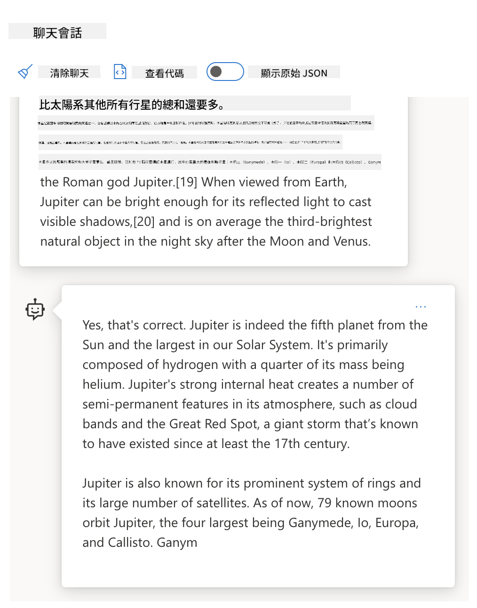

<!--
CO_OP_TRANSLATOR_METADATA:
{
  "original_hash": "a45c318dc6ebc2604f35b8b829f93af2",
  "translation_date": "2025-07-09T09:35:04+00:00",
  "source_file": "04-prompt-engineering-fundamentals/README.md",
  "language_code": "hk"
}
-->
# Prompt Engineering Fundamentals

[](https://aka.ms/gen-ai-lesson4-gh?WT.mc_id=academic-105485-koreyst)

## 介紹
本單元涵蓋在生成式 AI 模型中創建有效提示的基本概念和技巧。你如何撰寫給大型語言模型（LLM）的提示同樣重要。精心設計的提示能夠獲得更高質量的回應。但到底什麼是「提示」和「提示工程」？我又該如何改進發送給 LLM 的提示輸入？這些問題將在本章及下一章中嘗試解答。

生成式 AI 能夠根據用戶請求創造新內容（例如文字、圖片、音頻、程式碼等）。它是透過像 OpenAI 的 GPT（「生成式預訓練轉換器」）系列這樣的大型語言模型來實現，這些模型經過自然語言和程式碼的訓練。

用戶現在可以用熟悉的對話方式與這些模型互動，無需任何技術專業知識或培訓。這些模型是基於「提示」的——用戶發送文字輸入（提示），然後獲得 AI 回應（完成）。用戶可以透過多輪對話不斷「與 AI 聊天」，逐步調整提示，直到回應符合預期。

「提示」現已成為生成式 AI 應用的主要「程式設計介面」，告訴模型該做什麼，並影響回應的質量。「提示工程」是一個快速發展的研究領域，專注於設計和優化提示，以大規模提供穩定且高質量的回應。

## 學習目標

在本課程中，我們將了解什麼是提示工程、為什麼它重要，以及如何為特定模型和應用目標設計更有效的提示。我們會理解提示工程的核心概念和最佳實踐，並學習一個互動式 Jupyter 筆記本「沙盒」環境，讓我們能將這些概念應用於實際範例。

完成本課程後，我們將能夠：

1. 解釋什麼是提示工程及其重要性。
2. 描述提示的組成部分及其用途。
3. 學習提示工程的最佳實踐和技巧。
4. 使用 OpenAI 端點將所學技巧應用於實際範例。

## 關鍵詞

提示工程：設計和優化輸入以引導 AI 模型產生期望輸出的實踐。  
分詞（Tokenization）：將文字轉換成模型能理解和處理的較小單位（稱為「tokens」）的過程。  
指令調校大型語言模型（Instruction-Tuned LLMs）：經過特定指令微調的大型語言模型，以提升回應的準確性和相關性。

## 學習沙盒

提示工程目前更像是一門藝術而非科學。提升直覺的最佳方法是多加練習，採用結合應用領域專業知識、推薦技巧和模型特定優化的試錯方法。

本課程附帶的 Jupyter 筆記本提供一個「沙盒」環境，讓你可以隨時嘗試所學內容，或作為課程結尾的程式挑戰。執行練習需要：

1. **Azure OpenAI API 金鑰**——已部署 LLM 的服務端點。  
2. **Python 執行環境**——用於執行筆記本。  
3. **本地環境變數**——請先完成[SETUP](./../00-course-setup/SETUP.md?WT.mc_id=academic-105485-koreyst)步驟以準備好環境。

筆記本內建有入門練習，但鼓勵你自行新增 _Markdown_（說明）和 _Code_（提示請求）區塊，嘗試更多範例或想法，培養提示設計的直覺。

## 圖解指南

想在深入學習前先了解本課程涵蓋的整體架構嗎？看看這份圖解指南，讓你對主要主題和每個主題的重點有個概念。課程路線圖將帶你從理解核心概念和挑戰，到用相關提示工程技巧和最佳實踐來解決問題。請注意，指南中的「進階技巧」部分是指本課程下一章的內容。


## 我們的創業公司

現在，讓我們談談這個主題如何與我們的創業使命相關——[將 AI 創新帶入教育](https://educationblog.microsoft.com/2023/06/collaborating-to-bring-ai-innovation-to-education?WT.mc_id=academic-105485-koreyst)。我們希望打造以 AI 為動力的「個人化學習」應用，讓我們來思考不同用戶如何「設計」提示：

- **管理員**可能會請 AI _分析課程資料以找出內容缺口_。AI 可以總結結果或用程式碼將其視覺化。  
- **教育工作者**可能會請 AI _為特定受眾和主題生成教案_。AI 可以以指定格式建立個人化計劃。  
- **學生**可能會請 AI _輔導他們學習困難科目_。AI 現在能根據學生程度提供課程、提示和範例。

這只是冰山一角。看看[教育用提示庫](https://github.com/microsoft/prompts-for-edu/tree/main?WT.mc_id=academic-105485-koreyst)——由教育專家策劃的開源提示庫，讓你更全面了解可能性！_試著在沙盒或 OpenAI Playground 執行這些提示，看看會有什麼結果！_

<!--
LESSON TEMPLATE:
This unit should cover core concept #1.
Reinforce the concept with examples and references.

CONCEPT #1:
Prompt Engineering.
Define it and explain why it is needed.
-->

## 什麼是提示工程？

我們從定義 **提示工程** 開始，指的是為特定應用目標和模型設計及優化文字輸入（提示），以提供穩定且高質量回應（完成）的過程。我們可以將其視為兩個步驟：

- 為特定模型和目標 _設計_ 初始提示  
- 反覆 _優化_ 提示以提升回應質量

這必然是一個試錯過程，需要用戶的直覺和努力才能達到最佳效果。那為什麼它重要？要回答這個問題，我們先要理解三個概念：

- _分詞_ = 模型如何「看見」提示  
- _基礎大型語言模型_ = 基礎模型如何「處理」提示  
- _指令調校大型語言模型_ = 模型如何「理解任務」

### 分詞（Tokenization）

LLM 將提示視為一連串的 _tokens_，不同模型（或同一模型的不同版本）可能會以不同方式分詞同一提示。由於 LLM 是基於 tokens（而非原始文字）訓練，提示的分詞方式直接影響生成回應的質量。

想了解分詞如何運作，可以試試像下方的 [OpenAI Tokenizer](https://platform.openai.com/tokenizer?WT.mc_id=academic-105485-koreyst) 工具。將你的提示貼上，看看它如何被轉換成 tokens，注意空白字元和標點符號的處理方式。此範例使用較舊的 LLM（GPT-3），用較新模型測試可能會有不同結果。


### 概念：基礎模型

提示分詞後，基礎大型語言模型（["Base LLM"](https://blog.gopenai.com/an-introduction-to-base-and-instruction-tuned-large-language-models-8de102c785a6?WT.mc_id=academic-105485-koreyst)）的主要功能是預測序列中的下一個 token。由於 LLM 在龐大文本資料集上訓練，能掌握 token 之間的統計關係，並以一定信心做出預測。請注意，模型並不理解提示中詞語的「意義」，它只是看到一個模式，並用下一個預測來「完成」序列。模型會持續預測直到用戶中止或達到預設條件。

想看看基於提示的完成如何運作？將上述提示輸入 Azure OpenAI Studio 的 [_Chat Playground_](https://oai.azure.com/playground?WT.mc_id=academic-105485-koreyst)，使用預設設定。系統會將提示視為資訊請求，因此你應該會看到符合此上下文的回應。

但如果用戶想看到符合特定條件或任務目標的內容呢？這時就需要用到 _指令調校_ 的 LLM。



### 概念：指令調校大型語言模型

[指令調校 LLM](https://blog.gopenai.com/an-introduction-to-base-and-instruction-tuned-large-language-models-8de102c785a6?WT.mc_id=academic-105485-koreyst) 是在基礎模型上，透過範例或輸入/輸出對（例如多輪「訊息」）進行微調，這些範例包含明確指令，AI 的回應會嘗試遵循這些指令。

這使用了如人類反饋強化學習（RLHF）等技術，訓練模型 _遵循指令_ 並 _從反饋中學習_，使其產生更適合實際應用且更符合用戶目標的回應。

我們來試試——回到上面的提示，將 _系統訊息_ 改成以下指令作為上下文：

> _將提供的內容為二年級學生做摘要。結果保持一段文字，並列出 3-5 個重點。_

看看結果如何調整以符合期望的目標和格式？教育工作者現在可以直接將此回應用於該堂課的投影片中。


## 為什麼我們需要提示工程？

既然我們知道提示如何被 LLM 處理，接下來談談 _為什麼_ 需要提示工程。原因在於目前的 LLM 存在多項挑戰，使得 _可靠且一致的回應_ 難以在沒有投入提示設計和優化的情況下達成。例如：

1. **模型回應具有隨機性。** _相同的提示_ 在不同模型或模型版本間可能產生不同回應，甚至同一模型在不同時間也可能有不同結果。_提示工程技巧能幫助我們透過更好的限制條件來減少這些變異_。

1. **模型可能捏造回應。** 模型是基於 _龐大但有限_ 的資料集預訓練，對訓練範圍外的概念缺乏知識。因此可能產生不準確、虛構或與已知事實相矛盾的回應。_提示工程技巧幫助用戶識別並減輕這類捏造，例如要求 AI 提供引用或推理_。

1. **模型能力會有所不同。** 新一代模型功能更強大，但也帶來成本和複雜度上的獨特特性和取捨。_提示工程能幫助我們制定最佳實踐和工作流程，抽象化差異並適應模型特定需求，實現可擴展且無縫的應用_。

讓我們在 OpenAI 或 Azure OpenAI Playground 中實際體驗：

- 用相同提示測試不同 LLM 部署（例如 OpenAI、Azure OpenAI、Hugging Face）——你有看到差異嗎？  
- 用相同提示多次測試 _同一_ LLM 部署（例如 Azure OpenAI playground）——這些變異有何不同？

### 捏造範例

在本課程中，我們用「**捏造**」一詞來指 LLM 有時因訓練限制或其他因素，生成事實錯誤資訊的現象。你可能在文章或研究報告中聽過「幻覺（hallucinations）」這個詞，但我們強烈建議使用「捏造」，避免將機器行為擬人化，賦予人類特質。這也符合[負責任 AI 指南](https://www.microsoft.com/ai/responsible-ai?WT.mc_id=academic-105485-koreyst)的用詞規範，避免使用在某些情境下可能被視為冒犯或不包容的詞彙。

想了解捏造是怎麼發生的？想像一個提示指示 AI 生成不存在主題的內容（確保該主題不在訓練資料中）。例如——我嘗試了這個提示：
# 火星戰爭2076年課程計劃

## 課程目標
- 了解2076年火星戰爭的背景及起因
- 分析主要參戰方及其戰略
- 探討戰爭對地球及火星社會的影響
- 培養學生批判性思考及歷史分析能力

## 課程大綱

### 第一節：火星戰爭的背景
- 火星殖民的歷史簡介
- 地球與火星之間的政治經濟關係
- 戰爭爆發的主要原因

### 第二節：主要參戰方與戰略
- 地球聯盟軍隊介紹
- 火星獨立運動組織
- 重要戰役與戰術分析

### 第三節：戰爭的影響
- 對火星殖民地的社會經濟影響
- 地球的政治變動
- 戰後重建與和平協議

### 第四節：批判性討論與反思
- 戰爭的道德與倫理問題
- 未來火星與地球的關係展望
- 學生分組討論與報告

## 教學方法
- 講授與多媒體展示
- 小組討論與角色扮演
- 案例研究與資料分析

## 評估方式
- 課堂參與與討論表現
- 小組報告
- 期末寫作作業：分析火星戰爭的歷史意義

## 參考資料
- 火星戰爭2076年官方紀錄
- 相關歷史文獻與研究報告
- 多媒體資料與紀錄片

---

> [!NOTE]  
> 本課程計劃旨在激發學生對未來歷史事件的興趣，並培養跨學科的分析能力。
網絡搜尋顯示有關火星戰爭的虛構故事（例如電視劇或書籍）存在，但沒有發生在2076年的。常識也告訴我們，2076年是 _未來_ 的時間，因此不可能與真實事件有關。

那麼，當我們用不同的LLM供應商執行這個提示時會發生什麼？

> **Response 1**: OpenAI Playground (GPT-35)


> **Response 2**: Azure OpenAI Playground (GPT-35)


> **Response 3**: : Hugging Face Chat Playground (LLama-2)


如預期，每個模型（或模型版本）因為隨機性行為和模型能力的差異，產生了略有不同的回應。例如，一個模型針對八年級學生，而另一個則假設是高中生。但這三個模型都生成了可能讓不知情用戶相信該事件是真實的回應。

像 _metaprompting_ 和 _temperature configuration_ 這類提示工程技術，或許能在一定程度上減少模型的虛構內容。新的提示工程 _架構_ 也將新工具和技術無縫整合到提示流程中，以緩解或減少這些影響。

## 案例研究：GitHub Copilot

讓我們以一個案例研究來結束這部分，了解提示工程如何應用於現實世界的解決方案，看看 [GitHub Copilot](https://github.com/features/copilot?WT.mc_id=academic-105485-koreyst)。

GitHub Copilot 是你的「AI 編程搭檔」——它將文字提示轉換成程式碼補全，並整合到你的開發環境（例如 Visual Studio Code）中，提供無縫的使用體驗。正如以下一系列部落格所記錄，最早版本基於 OpenAI Codex 模型，工程師很快意識到需要微調模型並開發更好的提示工程技術，以提升程式碼品質。今年七月，他們[推出了超越 Codex 的改良 AI 模型](https://github.blog/2023-07-28-smarter-more-efficient-coding-github-copilot-goes-beyond-codex-with-improved-ai-model/?WT.mc_id=academic-105485-koreyst)，提供更快速的建議。

請按順序閱讀這些文章，跟隨他們的學習歷程。

- **2023年5月** | [GitHub Copilot 在理解你的程式碼方面變得更好](https://github.blog/2023-05-17-how-github-copilot-is-getting-better-at-understanding-your-code/?WT.mc_id=academic-105485-koreyst)
- **2023年5月** | [GitHub 內部：與 GitHub Copilot 背後的 LLMs 合作](https://github.blog/2023-05-17-inside-github-working-with-the-llms-behind-github-copilot/?WT.mc_id=academic-105485-koreyst)
- **2023年6月** | [如何為 GitHub Copilot 撰寫更好的提示](https://github.blog/2023-06-20-how-to-write-better-prompts-for-github-copilot/?WT.mc_id=academic-105485-koreyst)
- **2023年7月** | [GitHub Copilot 以改良 AI 模型超越 Codex](https://github.blog/2023-07-28-smarter-more-efficient-coding-github-copilot-goes-beyond-codex-with-improved-ai-model/?WT.mc_id=academic-105485-koreyst)
- **2023年7月** | [開發者的提示工程與 LLM 指南](https://github.blog/2023-07-17-prompt-engineering-guide-generative-ai-llms/?WT.mc_id=academic-105485-koreyst)
- **2023年9月** | [如何打造企業級 LLM 應用：GitHub Copilot 的經驗教訓](https://github.blog/2023-09-06-how-to-build-an-enterprise-llm-application-lessons-from-github-copilot/?WT.mc_id=academic-105485-koreyst)

你也可以瀏覽他們的[工程部落格](https://github.blog/category/engineering/?WT.mc_id=academic-105485-koreyst)，閱讀更多像[這篇](https://github.blog/2023-09-27-how-i-used-github-copilot-chat-to-build-a-reactjs-gallery-prototype/?WT.mc_id=academic-105485-koreyst)的文章，展示這些模型和技術如何 _應用_ 於推動現實世界的應用。

---

<!--
LESSON TEMPLATE:
This unit should cover core concept #2.
Reinforce the concept with examples and references.

CONCEPT #2:
Prompt Design.
Illustrated with examples.
-->

## 提示構建

我們已經了解為什麼提示工程很重要——現在讓我們理解提示是如何 _構建_ 的，這樣我們才能評估不同技術，設計出更有效的提示。

### 基本提示

先從基本提示開始：一個純文字輸入送到模型，沒有其他上下文。以下是一個例子——當我們將美國國歌的前幾個字送到 OpenAI [Completion API](https://platform.openai.com/docs/api-reference/completions?WT.mc_id=academic-105485-koreyst)，它會立即 _補全_ 後續幾行，展示基本的預測行為。

| 提示（輸入）       | 補全（輸出）                                                                                                                        |
| :----------------- | :---------------------------------------------------------------------------------------------------------------------------------- |
| Oh say can you see | 聽起來你正在開始唱「星條旗永不落」的歌詞，美國的國歌。完整歌詞是... |

### 複雜提示

現在讓我們在基本提示中加入上下文和指令。[Chat Completion API](https://learn.microsoft.com/azure/ai-services/openai/how-to/chatgpt?WT.mc_id=academic-105485-koreyst) 允許我們將複雜提示構建為一組 _訊息_，包括：

- 反映 _使用者_ 輸入和 _助理_ 回應的輸入/輸出對。
- 設定助理行為或個性的系統訊息。

請求現在呈現如下形式，其中 _分詞_ 有效捕捉上下文和對話中的相關資訊。改變系統上下文對補全品質的影響，與使用者輸入一樣重要。

```python
response = openai.chat.completions.create(
    model="gpt-3.5-turbo",
    messages=[
        {"role": "system", "content": "You are a helpful assistant."},
        {"role": "user", "content": "Who won the world series in 2020?"},
        {"role": "assistant", "content": "The Los Angeles Dodgers won the World Series in 2020."},
        {"role": "user", "content": "Where was it played?"}
    ]
)
```

### 指令提示

在上述例子中，使用者提示是簡單的文字查詢，可解讀為資訊請求。使用 _指令_ 提示，我們可以用文字更詳細地指定任務，給 AI 更好的指引。以下是一個例子：

| 提示（輸入）                                                                                                                                                                                                                         | 補全（輸出）                                                                                                        | 指令類型            |
| :------------------------------------------------------------------------------------------------------------------------------------------------------------------------------------------------------------------------------------- | :----------------------------------------------------------------------------------------------------------------- | :------------------ |
| Write a description of the Civil War                                                                                                                                                                                                   | _回傳一段簡單的段落_                                                                                                | 簡單                |
| Write a description of the Civil War. Provide key dates and events and describe their significance                                                                                                                                     | _回傳一段段落，接著列出關鍵事件日期及說明_                                                                         | 複雜                |
| Write a description of the Civil War in 1 paragraph. Provide 3 bullet points with key dates and their significance. Provide 3 more bullet points with key historical figures and their contributions. Return the output as a JSON file | _回傳更詳盡的內容，格式為可複製貼上並驗證的 JSON 檔案_                                                           | 複雜。格式化。      |

## 主要內容

在上述例子中，提示仍相當開放，讓 LLM 決定其預訓練資料中哪些部分相關。使用 _主要內容_ 設計模式，輸入文字分為兩部分：

- 指令（動作）
- 相關內容（影響動作）

以下是一個例子，指令是「用兩句話總結這段內容」。

| 提示（輸入）                                                                                                                                                                                                                                                                                                                                                                                                                                                                                                                                                                                                                                                                                      | 補全（輸出）                                                                                                                                                                                                                                                                             |
| :-------------------------------------------------------------------------------------------------------------------------------------------------------------------------------------------------------------------------------------------------------------------------------------------------------------------------------------------------------------------------------------------------------------------------------------------------------------------------------------------------------------------------------------------------------------------------------------------------------------------------------------------------------------------------------------------------- | :---------------------------------------------------------------------------------------------------------------------------------------------------------------------------------------------------------------------------------------------------------------------------------------------- |
| Jupiter is the fifth planet from the Sun and the largest in the Solar System. It is a gas giant with a mass one-thousandth that of the Sun, but two-and-a-half times that of all the other planets in the Solar System combined. Jupiter is one of the brightest objects visible to the naked eye in the night sky, and has been known to ancient civilizations since before recorded history. It is named after the Roman god Jupiter.[19] When viewed from Earth, Jupiter can be bright enough for its reflected light to cast visible shadows,[20] and is on average the third-brightest natural object in the night sky after the Moon and Venus. <br/> **Summarize this in 2 short sentences** | 木星是太陽系中第五顆行星，也是最大的行星，並且是夜空中最明亮的天體之一。它以羅馬神祇朱庇特命名，是一顆氣態巨星，其質量是太陽的千分之一，但卻是太陽系其他所有行星質量總和的兩倍半。 |

主要內容段落可以用多種方式來推動更有效的指令：

- **範例** — 不直接告訴模型要做什麼，而是給它範例，讓它推斷模式。
- **提示** — 在指令後面加上「提示」，引導模型產生更相關的回應。
- **範本** — 這是可重複使用的提示「配方」，帶有可用資料自訂的佔位符（變數），適用於特定用例。

讓我們來看看這些方法的實際應用。

### 使用範例

這種方法是用主要內容「餵給模型」一些期望輸出的範例，讓它推斷出想要的輸出模式。根據範例數量，我們有零次提示、一次提示、少次提示等。

提示現在包含三個部分：

- 任務描述
- 幾個期望輸出的範例
- 新範例的開始（成為隱含的任務描述）

| 學習類型     | 提示（輸入）                                                                                                                                        | 補全（輸出）         |
| :------------ | :---------------------------------------------------------------------------------------------------------------------------------------------------- | :-------------------- |
| 零次提示     | "The Sun is Shining". Translate to Spanish                                                                                                            | "El Sol está brillando".    |
| 一次提示     | "The Sun is Shining" => ""El Sol está brillando". <br> "It's a Cold and Windy Day" =>                                                                 | "Es un día frío y ventoso". |
| 少次提示     | The player ran the bases => Baseball <br/> The player hit an ace => Tennis <br/> The player hit a six => Cricket <br/> The player made a slam-dunk => | Basketball                  |
|               |                                                                                                                                                       |                           |

注意零次提示中我們必須明確指示「翻譯成西班牙語」，但在一次提示中這個指令是隱含推斷出來的。少次提示則展示了加入更多範例如何讓模型在沒有額外指令下做出更準確的推斷。

### 提示線索

另一種使用主要內容的技巧是提供 _線索_ 而非範例。在這種情況下，我們用一段反映期望回應格式的片段 _啟動_ 模型，模型便會「接收線索」並沿著該方向繼續。

| 線索數量     | 提示（輸入）                                                                                                                                                                                                                                                                                                                                                                                                                                               | 補全（輸出）                                                                                                                                                                                                                                                                                       |
| :------------- | :----------------------------------------------------------------------------------------------------------------------------------------------------------------------------------------------------------------------------------------------------------------------------------------------------------------------------------------------------------------------------------------------------------------------------------------------------------- | :-------------------------------------------------------------------------------------------------------------------------------------------------------------------------------------------------------------------------------------------------------------------------------------------------------- |
| 0              | Jupiter is the fifth planet from the Sun and the largest in the Solar System. It is a gas giant with a mass one-thousandth that of the Sun, but two-and-a-half times that of all the other planets in the Solar System combined. Jupiter is one of the brightest objects visible to the naked eye in the night sky, and has been known to ancient civilizations since before recorded history.

**Summarize This**                                       | 木星是太陽系中最大的一顆行星，距離太陽第五顆。它是一顆氣體巨星，質量約為太陽的千分之一，但比其他所有行星加起來還要重。古代文明早已認識木星，且它在夜空中非常容易被看見。 |
| 1              | 木星是距離太陽第五顆行星，也是太陽系中最大的行星。它是一顆氣體巨星，質量約為太陽的千分之一，但比太陽系中其他所有行星的總和還要重兩倍半。木星是夜空中肉眼可見的最亮天體之一，古代文明早在有文字記錄之前就已經知道它。<br/>**Summarize This** <br/> 我們學到的是木星 | 是距離太陽第五顆行星，也是太陽系中最大的行星。它是一顆氣體巨星，質量約為太陽的千分之一，但比其他所有行星加起來還要重兩倍半。它肉眼可見，且自古以來就為人所知。                        |
| 2              | 木星是距離太陽第五顆行星，也是太陽系中最大的行星。它是一顆氣體巨星，質量約為太陽的千分之一，但比太陽系中其他所有行星的總和還要重兩倍半。木星是夜空中肉眼可見的最亮天體之一，古代文明早在有文字記錄之前就已經知道它。<br/>**Summarize This** <br/> 我們學到的三大重點：         | 1. 木星是距離太陽第五顆行星，也是太陽系中最大的行星。<br/> 2. 它是一顆氣體巨星，質量約為太陽的千分之一……<br/> 3. 木星自古以來就能用肉眼看見……                                                                       |
|                |                                                                                                                                                                                                                                                                                                                                                                                                                                                              |                                                                                                                                                                                                                                                                                                           |

### Prompt Templates

提示模板是一種 _預先定義好的提示配方_，可以儲存並根據需要重複使用，以在大規模上提供更一致的用戶體驗。最簡單的形式，就是像[OpenAI這個範例](https://platform.openai.com/examples?WT.mc_id=academic-105485-koreyst)那樣，收集一組提示範例，包含互動式的提示組件（用戶和系統訊息）以及 API 請求格式，方便重用。

在更複雜的形式中，如[LangChain的範例](https://python.langchain.com/docs/concepts/prompt_templates/?WT.mc_id=academic-105485-koreyst)，它包含了 _佔位符_，可以用來替換來自不同來源的資料（用戶輸入、系統上下文、外部資料等），以動態生成提示。這讓我們能建立一個可重用的提示庫，能夠 **程式化地** 在大規模上驅動一致的用戶體驗。

最後，模板的真正價值在於能夠為垂直應用領域創建並發布 _提示庫_，這些提示模板會根據應用特定的上下文或範例進行 _優化_，使回應對目標用戶更相關且準確。[Prompts For Edu](https://github.com/microsoft/prompts-for-edu?WT.mc_id=academic-105485-koreyst) 倉庫就是一個很好的例子，專注於教育領域，強調課程規劃、課程設計、學生輔導等核心目標，精心策劃了一系列提示。

## Supporting Content

如果我們把提示構建看作是有一個指令（任務）和一個目標（主要內容），那麼 _次要內容_ 就像是我們提供的額外上下文，用來 **以某種方式影響輸出**。它可以是調整參數、格式指示、主題分類等，有助於模型 _調整_ 回應以符合期望的用戶目標或需求。

舉例來說：給定一個包含豐富元資料（名稱、描述、等級、標籤、講師等）的課程目錄：

- 我們可以定義一個指令「總結 2023 年秋季的課程目錄」
- 用主要內容提供幾個期望輸出的範例
- 用次要內容標示出最重要的五個「標籤」

這樣模型就能以範例中展示的格式提供摘要，但如果結果包含多個標籤，模型會優先考慮次要內容中標示的五個標籤。

---

<!--
LESSON TEMPLATE:
本單元應涵蓋核心概念 #1。
用範例和參考資料加強該概念。

概念 #3：
提示工程技術。
有哪些基本的提示工程技巧？
用一些練習來說明。
-->

## Prompting Best Practices

既然我們知道提示可以如何 _構建_，接下來可以開始思考如何 _設計_ 它們以反映最佳實踐。我們可以從兩個方面來看——擁有正確的 _心態_ 和運用合適的 _技巧_。

### Prompt Engineering Mindset

提示工程是一個反覆試驗的過程，請記住以下三個大方向：

1. **領域理解很重要。** 回應的準確性和相關性取決於應用或用戶所處的 _領域_。運用你的直覺和領域專業知識來 **進一步客製化技巧**。例如，在系統提示中定義 _領域特定的人格_，或在用戶提示中使用 _領域特定的模板_。提供反映領域上下文的次要內容，或用 _領域特定的提示和範例_ 引導模型朝熟悉的用法。

2. **模型理解很重要。** 我們知道模型本質上是隨機的，但不同模型的實作也會因訓練資料（預訓練知識）、提供的功能（如 API 或 SDK）以及優化的內容類型（程式碼、圖片、文字等）而異。了解你使用的模型的優勢和限制，並利用這些知識來 _優先排序任務_ 或建立 _針對模型能力優化的客製模板_。

3. **迭代與驗證很重要。** 模型和提示工程技術都在快速演進。作為領域專家，你可能有其他特定應用的背景或標準，這些不一定適用於更廣泛的社群。利用提示工程工具和技巧「快速啟動」提示構建，然後用你的直覺和領域專業反覆驗證結果。記錄你的見解並建立一個 **知識庫**（例如提示庫），讓其他人能以此為新基準，加速未來的迭代。

## Best Practices

現在來看看 [OpenAI](https://help.openai.com/en/articles/6654000-best-practices-for-prompt-engineering-with-openai-api?WT.mc_id=academic-105485-koreyst) 和 [Azure OpenAI](https://learn.microsoft.com/azure/ai-services/openai/concepts/prompt-engineering#best-practices?WT.mc_id=academic-105485-koreyst) 實務者推薦的常見最佳做法。

| 做什麼                              | 為什麼                                                                                                                                                                                                                                               |
| :-------------------------------- | :------------------------------------------------------------------------------------------------------------------------------------------------------------------------------------------------------------------------------------------------ |
| 評估最新模型                       | 新一代模型通常功能和品質更好，但成本可能更高。評估其影響後再決定是否遷移。                                                                                                                                                |
| 分開指令與上下文                   | 確認你的模型或服務提供者是否定義了 _分隔符_，用來更清楚區分指令、主要和次要內容。這有助於模型更準確地分配權重給各個詞元。                                                                                                                         |
| 具體且清楚                       | 提供更多關於期望上下文、結果、長度、格式、風格等細節，能提升回應的品質和一致性。將這些做法記錄在可重用的模板中。                                                          |
| 詳細描述並用範例                  | 模型通常對「示範教學」的方式反應更好。先用「零次學習」方式給出指令（無範例），再用「少次學習」提供幾個期望輸出的範例來精煉。也可以用類比說明。 |
| 用提示詞引導完成                  | 給模型一些開頭的詞語或片語，幫助它從這些線索開始生成回應，朝向期望結果。                                                                                                               |
| 重複強調                         | 有時需要對模型重複指令。可以在主要內容前後都給指令，或同時用指令和提示詞。反覆嘗試並驗證什麼最有效。                                                         |
| 順序很重要                       | 呈現給模型的資訊順序可能影響輸出，尤其是學習範例中，因為模型有近期偏好。嘗試不同順序找出最佳效果。                                                               |
| 給模型「退路」                   | 給模型一個 _備用_ 回應選項，當它無法完成任務時可以使用，減少生成錯誤或虛構回應的機率。                                                         |
|                                   |                                                                                                                                                                                                                                                   |

如同任何最佳實踐，請記得 _實際效果會因模型、任務和領域而異_。把這些當作起點，持續迭代找出最適合你的方法。隨著新模型和工具的推出，不斷重新評估你的提示工程流程，重點放在流程可擴展性和回應品質。

<!--
LESSON TEMPLATE:
本單元若適用，應提供程式碼挑戰

挑戰：
連結到一個 Jupyter Notebook，指令中只有程式碼註解（程式碼區塊為空）。

解答：
連結到填寫並執行過的 Notebook，展示一個範例輸出。
-->

## Assignment

恭喜你完成本課程！現在是時候用實際範例來測試這些概念和技巧了！

這次作業會用一個 Jupyter Notebook，裡面有互動式練習。你也可以自行在 Notebook 裡新增 Markdown 和程式碼區塊，探索更多想法和技巧。

### 開始前，先 fork 這個 repo，然後

- （推薦）啟動 GitHub Codespaces
- （或）將 repo 複製到本地端，並用 Docker Desktop 運行
- （或）用你偏好的 Notebook 執行環境打開 Notebook

### 接著，設定環境變數

- 將 repo 根目錄的 `.env.copy` 複製為 `.env`，並填入 `AZURE_OPENAI_API_KEY`、`AZURE_OPENAI_ENDPOINT` 和 `AZURE_OPENAI_DEPLOYMENT`。完成後回到[學習沙盒章節](../../../04-prompt-engineering-fundamentals/04-prompt-engineering-fundamentals)了解如何操作。

### 然後，打開 Jupyter Notebook

- 選擇執行核心。如果使用前兩種方式，直接選擇開發容器提供的預設 Python 3.10.x 核心即可。

你已準備好開始練習。請注意，這裡沒有「對錯」答案，重點是透過反覆嘗試探索，建立對特定模型和應用領域的直覺。

_因此本課程沒有程式碼解答區塊。Notebook 裡會有標題為「My Solution:」的 Markdown 區塊，展示一個範例輸出供參考。_

 <!--
LESSON TEMPLATE:
用總結和自學資源包裹本節內容。
-->

## Knowledge check

以下哪一個提示符合合理的最佳實踐？

1. 給我一張紅色汽車的圖片
2. 給我一張停在懸崖邊、夕陽下的紅色 Volvo XC90 汽車圖片
3. 給我一張紅色 Volvo XC90 汽車的圖片

答：2 是最佳提示，因為它提供了「什麼」的細節，並具體描述（不只是任何車，而是特定品牌和車型），還描述了整體場景。3 次之，因為也包含了很多描述。

## 🚀 Challenge

試試看用「提示詞」技巧，完成句子「給我一張紅色 Volvo 汽車的圖片，然後……」。它會怎麼回應？你會如何改進？

## Great Work! Continue Your Learning

想了解更多提示工程的概念？請前往[進階學習頁面](https://aka.ms/genai-collection?WT.mc_id=academic-105485-koreyst)尋找更多優質資源。

接著前往第 5 課，我們將探討[進階提示技巧](../05-advanced-prompts/README.md?WT.mc_id=academic-105485-koreyst)！

**免責聲明**：  
本文件由 AI 翻譯服務 [Co-op Translator](https://github.com/Azure/co-op-translator) 進行翻譯。雖然我們致力於確保準確性，但請注意，自動翻譯可能包含錯誤或不準確之處。原始文件的母語版本應被視為權威來源。對於重要資訊，建議採用專業人工翻譯。我們不對因使用本翻譯而引起的任何誤解或誤釋承擔責任。