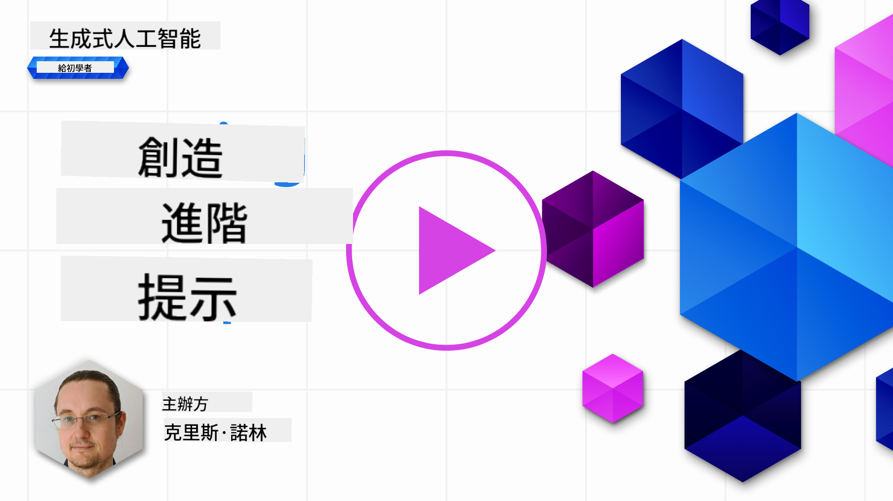

<!--
CO_OP_TRANSLATOR_METADATA:
{
  "original_hash": "b2651fb16bcfbc62b8e518751ed90fdb",
  "translation_date": "2025-10-17T23:30:04+00:00",
  "source_file": "05-advanced-prompts/README.md",
  "language_code": "hk"
}
-->
# 創建進階提示

[](https://youtu.be/BAjzkaCdRok?si=NmUIyRf7-cDgbjtt)

讓我們回顧一下上一章的學習內容：

> 提示 _工程_ 是通過提供更有用的指示或背景信息來**引導模型生成更相關的回應**的過程。

撰寫提示有兩個步驟：構建提示，提供相關背景信息；以及_優化_，即逐步改進提示。

到目前為止，我們已經對如何撰寫提示有了一些基本的了解，但我們需要更深入地探討。在本章中，您將從嘗試各種提示開始，逐步了解為什麼某些提示比其他提示更好。您將學習如何遵循一些基本技術來構建適用於任何 LLM 的提示。

## 簡介

在本章中，我們將涵蓋以下主題：

- 通過在提示中應用不同的技術來擴展您對提示工程的知識。
- 配置您的提示以改變輸出。

## 學習目標

完成本課程後，您將能夠：

- 應用提示工程技術以改善提示的結果。
- 執行多樣化或確定性的提示。

## 提示工程

提示工程是創建能夠產生期望結果的提示的過程。提示工程不僅僅是撰寫文字提示，它更像是一套技術，您可以應用這些技術來獲得期望的結果。

### 提示示例

讓我們來看一個基本的提示示例：

> 生成 10 個關於地理的問題。

在這個提示中，您實際上應用了多種不同的提示技術。

讓我們來分析一下。

- **背景信息**，您指定了應該是關於“地理”的。
- **限制輸出**，您希望生成不超過 10 個問題。

### 簡單提示的局限性

您可能會或可能不會得到期望的結果。雖然問題會被生成，但地理是一個很大的主題，您可能無法得到您真正想要的內容，原因如下：

- **主題太廣泛**，您不知道它會涉及國家、首都、河流等哪方面。
- **格式**，如果您希望問題以某種特定格式呈現，該怎麼辦？

正如您所見，創建提示時需要考慮很多因素。

到目前為止，我們已經看過一個簡單的提示示例，但生成式 AI 能夠做得更多，可以幫助各種角色和行業的人們。接下來讓我們探索一些基本技術。

### 提示技術

首先，我們需要了解提示是一種 LLM 的_突現性_特徵，這意味著它不是模型內建的功能，而是我們在使用模型時發現的特性。

我們可以使用一些基本技術來提示 LLM。讓我們來探索這些技術。

- **零樣本提示**，這是最基本的提示形式。它是一個單一的提示，僅基於 LLM 的訓練數據請求回應。
- **少樣本提示**，這種提示通過提供一個或多個示例來引導 LLM，幫助其生成回應。
- **思維鏈**，這種提示告訴 LLM 如何將問題分解為步驟。
- **生成知識**，為了改進提示的回應，您可以在提示中額外提供生成的事實或知識。
- **由簡至繁**，類似於思維鏈，這種技術是將問題分解為一系列步驟，然後按順序執行這些步驟。
- **自我改進**，這種技術是對 LLM 的輸出進行批判，然後要求其改進。
- **產婆式提示**，這種技術旨在確保 LLM 的回答是正確的，並要求其解釋答案的各個部分。這是一種自我改進的形式。

### 零樣本提示

這種提示方式非常簡單，它由一個單一的提示組成。這種技術可能是您在開始學習 LLM 時使用的方式。以下是一個示例：

- 提示："什麼是代數？"
- 回應："代數是數學的一個分支，研究數學符號及其操作規則。"

### 少樣本提示

這種提示方式通過提供一些示例來幫助模型理解請求。它由一個單一的提示和額外的任務特定數據組成。以下是一個示例：

- 提示："用莎士比亞的風格寫一首詩。以下是一些莎士比亞十四行詩的示例：
  十四行詩 18：'我是否應該將你比作夏日？你更美麗更溫和...'
  十四行詩 116：'我不承認真心相愛的婚姻有障礙。愛不是愛，若因改變而改變...'
  十四行詩 132：'我愛你的眼睛，它們憐憫我，知道你的心因輕蔑而折磨我，...'
  現在，請寫一首關於月亮美麗的十四行詩。"
- 回應："在天空中，月亮柔和地閃耀，散發著銀色的光芒，溫柔地照耀著，..."

示例為 LLM 提供了所需輸出的背景信息、格式或風格。它們幫助模型理解特定任務並生成更準確和相關的回應。

### 思維鏈

思維鏈是一種非常有趣的技術，它是關於讓 LLM 通過一系列步驟來完成任務。其理念是以某種方式指導 LLM 理解如何完成某件事。以下是有和沒有思維鏈的示例：

    - 提示："Alice 有 5 個蘋果，扔掉了 3 個蘋果，給了 Bob 2 個蘋果，Bob 又還了一個，Alice 還有多少個蘋果？"
    - 回應：5

LLM 回應 5，這是不正確的。正確答案是 1 個蘋果，根據計算 (5 -3 -2 + 1 = 1)。

那麼我們如何教 LLM 正確完成這個計算呢？

讓我們嘗試使用思維鏈。應用思維鏈意味著：

1. 給 LLM 一個類似的示例。
1. 展示計算過程，以及如何正確計算。
1. 提供原始提示。

以下是示例：

- 提示："Lisa 有 7 個蘋果，扔掉了 1 個蘋果，給了 Bart 4 個蘋果，Bart 又還了一個：
  7 -1 = 6
  6 -4 = 2
  2 +1 = 3  
  Alice 有 5 個蘋果，扔掉了 3 個蘋果，給了 Bob 2 個蘋果，Bob 又還了一個，Alice 還有多少個蘋果？"
  回應：1

注意，我們撰寫了更長的提示，包含另一個示例、一個計算過程，然後是原始提示，最終得到了正確答案 1。

正如您所見，思維鏈是一種非常強大的技術。

### 生成知識

很多時候，當您想要構建提示時，您希望使用自己公司的數據。您希望提示的一部分來自公司，另一部分是您感興趣的實際提示。

例如，如果您在保險行業，您的提示可能如下所示：

```text
{{company}}: {{company_name}}
{{products}}:
{{products_list}}
Please suggest an insurance given the following budget and requirements:
Budget: {{budget}}
Requirements: {{requirements}}
```

上面，您可以看到提示是使用模板構建的。在模板中，有一些變數，用 `{{variable}}` 表示，這些變數將被公司 API 的實際值替換。

以下是替換了公司內容後的提示示例：

```text
Insurance company: ACME Insurance
Insurance products (cost per month):
- Car, cheap, 500 USD
- Car, expensive, 1100 USD
- Home, cheap, 600 USD
- Home, expensive, 1200 USD
- Life, cheap, 100 USD

Please suggest an insurance given the following budget and requirements:
Budget: $1000
Requirements: Car, Home, and Life insurance
```

將此提示運行於 LLM 中將生成如下回應：

```output
Given the budget and requirements, we suggest the following insurance package from ACME Insurance:
- Car, cheap, 500 USD
- Home, cheap, 600 USD
- Life, cheap, 100 USD
Total cost: $1,200 USD
```

如您所見，它還建議了人壽保險，這是不應該的。這個結果表明我們需要通過更清晰的提示來優化提示。經過一些_試錯_後，我們得到了以下提示：

```text
Insurance company: ACME Insurance
Insurance products (cost per month):
- type: Car, cheap, cost: 500 USD
- type: Car, expensive, cost: 1100 USD
- type: Home, cheap, cost: 600 USD
- type: Home, expensive, cost: 1200 USD
- type: Life, cheap, cost: 100 USD

Please suggest an insurance given the following budget and requirements:
Budget: $1000 restrict choice to types: Car, Home
```

注意，添加了 _類型_ 和 _成本_，並使用了關鍵字 _限制_，幫助 LLM 理解我們的需求。

現在我們得到了以下回應：

```output
Given the budget and requirements, we suggest the Car, Cheap insurance product which costs 500 USD per month.
```

這個示例的重點是展示即使我們使用了像_生成知識_這樣的基本技術，在大多數情況下仍然需要優化提示以獲得期望的結果。

### 由簡至繁

由簡至繁提示的理念是將一個更大的問題分解為子問題。這樣，您可以幫助指導 LLM 如何“征服”更大的問題。一個很好的示例是數據科學，您可以要求 LLM 將問題分解如下：

> 提示：如何用 5 步完成數據科學？

您的 AI 助手可能會回答：

1. 收集數據
1. 清理數據
1. 分析數據
1. 繪製數據
1. 展示數據

### 自我改進，批判結果

對於生成式 AI 和 LLM，您不能完全信任其輸出。您需要進行驗證。畢竟，LLM 只是呈現最可能的下一步，而不是正確的答案。因此，一個好主意是要求 LLM 自我批判，這就引出了自我改進技術。

其工作方式如下：

1. 初始提示要求 LLM 解決問題
1. LLM 回應
1. 您批判回應並要求 AI 改進
1. LLM 再次回應，這次考慮了批判並提出改進的建議

您可以根據需要多次重複此過程。

以下是使用此技術的示例：

> 提示："創建一個具有產品和客戶路由的 Python Web API"

AI 回應：

```python
import flask
app = Flask(__name__)

@app.route('/products')
def products():
    return 'Products'

@app.route('/customers')
def customers():
    return 'Customers'
```

> 提示：建議上述代碼的 3 個改進

AI 回應：

```text
Sure, here are three suggestions to improve the code:

Import the correct module: The first line should import Flask instead of flask. The correct import statement should be from flask import Flask.

Add a main function: Add a if __name__ == '__main__': block to the end of the file to run the application when the file is executed.

Use f-strings: Use f-strings to format the return statements in the route functions. For example, return 'Products' can be changed to return f'This is the {request.path} page'.
```

```python
from flask import Flask, request

app = Flask(__name__)

@app.route('/products')
def products():
    return f'This is the {request.path} page'

@app.route('/customers')
def customers():
    return f'This is the {request.path} page'

if __name__ == '__main__':
    app.run()
```

如您所見，以上 AI 回應通過批判第一個答案改進了最初建議的代碼。

### 產婆式提示

產婆式提示是一種類似於自我改進的技術，但它更多是關於要求 LLM 解釋自己的答案。目標是減少 LLM 輸出中的不一致性，以確保其得出正確答案。其工作流程如下：

1. 要求 LLM 回答問題
1. 對答案的每個部分要求 LLM 更深入地解釋。
1. 如果有不一致的地方，則丟棄不一致的部分。

重複第 2 和第 3 步，直到您對答案滿意。

以下是提示示例：

> 提示：如何創建一個危機計劃以應對大流行病，分 5 步驟？
> LLM 回應：

```text
1. Identify the risks
1. Identify the stakeholders
1. Identify the resources
1. Identify the actions
1. Identify the communication channels
```

它識別了 5 個步驟，但我們能否確定這是正確的？讓我們要求 LLM 更詳細地解釋每一步：

> 提示：更詳細地解釋第一步，大流行病的詳細風險是什麼？

```text
The risks are the following:

- Loss of life
- Loss of business
- Loss of reputation
- Loss of customers
- Loss of employees
```

此時，我們希望確保 LLM 是正確的，因此我們要求其更詳細地解釋第一個風險，並希望其與上述答案一致：

> 提示：在大流行病中，最大的風險是什麼，為什麼？

```text
The biggest risk is loss of life because it's the most important thing to protect.
```

> 大流行病中的兩個最大風險是什麼？

```text
The two biggest risks are loss of life and loss of business.
```

此時，LLM 是一致的，並提到“生命”和“業務”是兩個最大的風險。我們現在可以繼續下一步並感到相當有信心。然而，我們不應盲目信任 LLM，應始終驗證其輸出。

## 改變您的輸出

LLM 本質上是非確定性的，這意味著每次運行相同的提示時，您都會得到不同的結果。試試以下提示：

> "生成一個 Python Web API 的代碼"

```python
# Import necessary modules
import flask
from flask import request, jsonify

# Create a Flask app
app = flask.Flask(__name__)

# Create a route for the API
@app.route('/api', methods=['GET'])
def api():
    # Get the data from the request
    data = request.args

    # Process the data
    result = process_data(data)

    # Return the result as JSON
    return jsonify(result)

# Function to process the data
def process_data(data):
    # Do something with the data
    result = data + 1

    # Return the result
    return result

# Run the app
if __name__ == '__main__':
    app.run()

```

再次運行相同的提示會生成稍微不同的回應：

```python
#import necessary packages
import flask
from flask import request, jsonify

#create the Flask application
app = flask.Flask(__name__)
app.config["DEBUG"] = True

#create a list of books
books = [
    {'id': 0,
     'title': 'A Fire Upon the Deep',
     'author': 'Vernor Vinge',
     'first_sentence': 'The coldsleep itself was dreamless.',
     'year_published': '1992'},
    {'id': 1,
     'title': 'The Ones Who Walk Away From Omelas',
     'author': 'Ursula K. Le Guin',
     'first_sentence': 'With a clamor of bells that set the swallows soaring, the Festival of Summer came to the city Omelas, bright-towered by the sea.',
     'published': '1973'},
    {'id': 2,
     'title': 'Dhalgren',
     'author': 'Samuel R. Delany',
     'first_sentence': 'to wound the autumnal city.',
     'published': '1975'}
]

#create an endpoint for the API
@app.route('/', methods=['GET'])
def home():
    return '''<h1>Books API</h1>
<p>A prototype API for retrieving books.</p>'''

#create an endpoint to return all books
@app.route('/api/v1/resources/books/all', methods=['GET'])
def api_all():
    return jsonify(books)

#create an endpoint to return a single book
@app.route('/api/v1/resources/books', methods=['GET'])
def api_id():
    #check if an ID was provided as part of the URL
    #if ID is provided, assign it to a variable
    #if no ID is provided, display an error
    if 'id' in request.args:
        id = int(request.args['id'])
    else:
        return "Error: No id field provided. Please specify an id."

    #create an empty list for our results
    results = []

    #loop through the data and match results that fit the requested ID
    #IDs are unique, but other fields might return many results
    for book in books:
        if book['id'] == id:
            results.append(book)

    #use the jsonify function from Flask to convert our list of
    #Python dictionaries to the JSON format
    return jsonify(results)

app.run()
```

> 那麼輸出的多樣性是一個問題嗎？

這取決於您想要做什麼。如果您希望得到特定的回應，那麼這是一個問題。如果您對多樣化的輸出感到滿意，例如“生成任何 3 個關於地理的問題”，那麼這不是問題。

### 使用溫度來改變輸出

好的，我們已經決定希望限制輸出以更具可預測性，也就是更確定性。我們該如何做到這一點？

溫度是一個介於 0 和 1 之間的值，其中 0 是最確定性的，1 是最多樣化的。默認值是 0.7。讓我們看看當溫度設置為 0.1 時，兩次運行相同提示會發生什麼：

> "生成一個 Python Web API 的代碼"

```python
#import necessary libraries
import flask
from flask import request, jsonify

#create an instance of the Flask class
app = flask.Flask(__name__)

#create an endpoint for the API
@app.route('/api/v1/endpoint', methods=['GET'])
def api_endpoint():
    #get the request data
    data = request.get_json()

    #process the data
    result = process_data(data)

    #return the result
    return jsonify(result)

#function to process the data
def process_data(data):
    #process the data
    result = {'result': 'success'}

    #return the result
    return result

#run the Flask app
if __name__ == '__main__':
    app.run()

```

再次運行提示會得到以下結果：

```python
#import necessary libraries
import flask
from flask import request, jsonify

#create a Flask app
app = flask.Flask(__name__)

#create a route for the API
@app.route('/api', methods=['GET'])
def api_call():
    #get the data from the request
    data = request.get_json()

    #process the data
    result = process_data(data)

    #return the result
    return jsonify(result)

#define the process_data function
def process_data(data):
    #do something with the data
    result = data + 1

    #return the result
    return result

#run the app
if __name__ == '__main__':
    app.run()

```

這兩個輸出之間只有微小的差異。這次我們做相反的事情，將溫度設置為 0.9：

```python
# Import necessary libraries
import flask
from flask import request, jsonify

# Create a Flask app
app = flask.Flask(__name__)

# Create a route for the API
@app.route('/api', methods=['GET'])
def api_call():
    # Get the data from the request
    data = request.args

    # Process the data
    result = process_data(data)

    # Return the result
    return jsonify(result)

# Function to process the data
def process_data(data):
    # Do something with the data
    result = data + 1

    # Return the result
    return result

# Run the app
if __name__ == '__main__':
    app.run()

```

第二次嘗試，溫度值設置為 0.9：

```python
import flask
from flask import request, jsonify

# create the Flask app
app = flask.Flask(__name__)
app.config['DEBUG'] = True

# create some test data
books = [
    {'id': 0, 'title': 'A Fire Upon The Deep', 'author': 'Vernor Vinge', 'first_sentence': 'The coldsleep itself was dreamless.', 'year_published': '1992'},
    {'id': 1, 'title': 'The Ones Who Walk Away From Omelas', 'author': 'Ursula K. Le Guin', 'first_sentence': 'With a clamor of bells that set the swallows soaring, the Festival of Summer came to the city Omelas, bright-towered by the sea.', 'published': '1973'},
    {'id': 2, 'title': 'Dhalgren', 'author': 'Samuel R. Delany', 'first_sentence': 'to wound the autumnal city.', 'published': '1975'}
]

# create an endpoint
@app.route('/', methods=['GET'])
def home():
    return '''<h1>Welcome to our book API!</h1>'''

@app.route('/api/v1/resources/books

```

正如你所見，結果可以說是千差萬別。

> 請注意，還有更多參數可以調整以改變輸出，例如 top-k、top-p、重複懲罰、長度懲罰和多樣性懲罰，但這些不在本課程範圍內。

## 良好實踐

有許多方法可以幫助你獲得想要的結果。隨著你越來越多地使用提示，你會找到自己的風格。

除了我們已經介紹的技巧外，還有一些良好的實踐可以在提示 LLM 時考慮。

以下是一些良好的實踐建議：

- **指定上下文**。上下文很重要，越能具體化，例如領域、主題等，效果越好。
- 限制輸出。如果你需要特定數量的項目或特定的長度，請明確說明。
- **指定內容和方式**。記得同時說明你需要什麼以及如何需要，例如「建立一個包含產品和客戶路由的 Python Web API，並將其分成三個文件」。
- **使用模板**。通常，你可能需要用公司數據來豐富你的提示。使用模板來完成這一點。模板可以包含變數，然後用實際數據替換。
- **拼寫正確**。LLM 可能會提供正確的回應，但如果拼寫正確，你會得到更好的回應。

## 作業

以下是使用 Flask 建立簡單 API 的 Python 代碼：

```python
from flask import Flask, request

app = Flask(__name__)

@app.route('/')
def hello():
    name = request.args.get('name', 'World')
    return f'Hello, {name}!'

if __name__ == '__main__':
    app.run()
```

使用像 GitHub Copilot 或 ChatGPT 這樣的 AI 助手，並應用「自我改進」技術來改進代碼。

## 解決方案

請嘗試通過向代碼添加合適的提示來完成作業。

> [!TIP]
> 設計提示來要求改進，限制改進的數量是一個好主意。你也可以要求以某種方式改進，例如架構、性能、安全性等。

[解決方案](../../../05-advanced-prompts/python/aoai-solution.py)

## 知識檢查

為什麼我會使用 chain-of-thought 提示？請展示 1 個正確回應和 2 個錯誤回應。

1. 教 LLM 如何解決問題。
1. B，教 LLM 找出代碼中的錯誤。
1. C，指導 LLM 提出不同的解決方案。

A: 1，因為 chain-of-thought 是通過提供一系列步驟以及類似問題及其解決方法來向 LLM 展示如何解決問題。

## 🚀 挑戰

你剛剛在作業中使用了自我改進技術。選擇你建立的任何程序，考慮你希望對其進行哪些改進。現在使用自我改進技術來應用所提出的更改。你認為結果如何，更好還是更差？

## 出色的工作！繼續學習

完成本課程後，請查看我們的 [生成式 AI 學習合集](https://aka.ms/genai-collection?WT.mc_id=academic-105485-koreyst)，繼續提升你的生成式 AI 知識！

前往第 6 課，我們將應用提示工程知識來 [建立文本生成應用](../06-text-generation-apps/README.md?WT.mc_id=academic-105485-koreyst)。

---

**免責聲明**：  
此文件已使用人工智能翻譯服務 [Co-op Translator](https://github.com/Azure/co-op-translator) 進行翻譯。儘管我們致力於提供準確的翻譯，但請注意，自動翻譯可能包含錯誤或不準確之處。原始文件的母語版本應被視為權威來源。對於重要信息，建議使用專業人工翻譯。我們對因使用此翻譯而引起的任何誤解或誤釋不承擔責任。