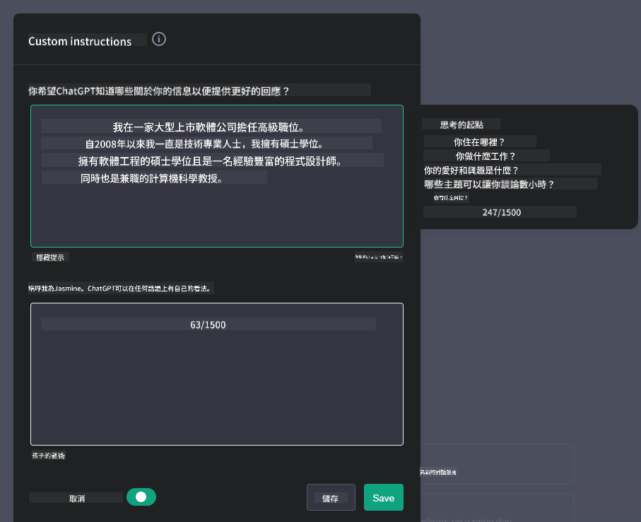
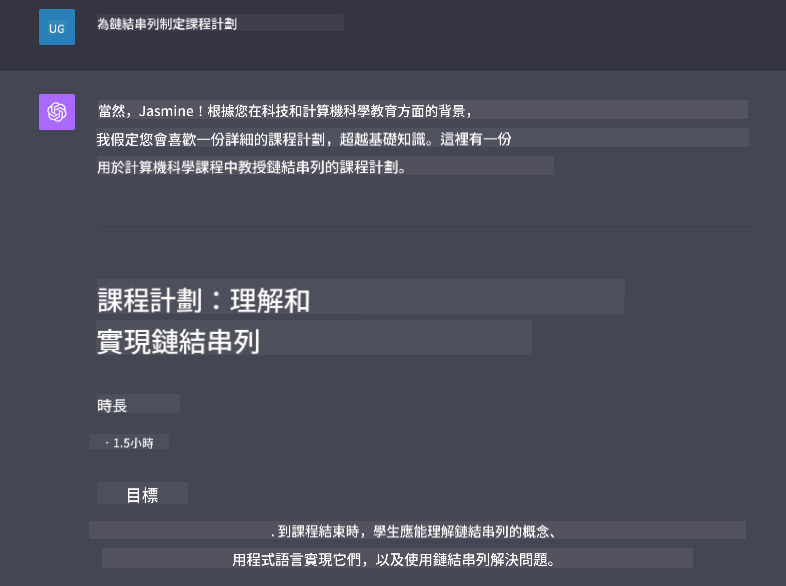

<!--
CO_OP_TRANSLATOR_METADATA:
{
  "original_hash": "ea4bbe640847aafbbba14dae4625e9af",
  "translation_date": "2025-06-25T15:12:30+00:00",
  "source_file": "07-building-chat-applications/README.md",
  "language_code": "hk"
}
-->
# 構建生成式 AI 驅動的聊天應用程式

[](https://aka.ms/gen-ai-lessons7-gh?WT.mc_id=academic-105485-koreyst)

> _(點擊上面的圖片觀看本課程的視頻)_

現在我們已經了解如何構建文本生成應用程式，讓我們來看看聊天應用程式。

聊天應用程式已經融入我們的日常生活，不僅僅是提供隨意交談的方式。它們是客戶服務、技術支持，甚至是複雜諮詢系統的重要組成部分。您可能不久前就從聊天應用程式中獲得了一些幫助。隨著我們將更先進的技術如生成式 AI 集成到這些平台中，複雜性增加，挑戰也隨之增加。

一些我們需要回答的問題包括：

- **構建應用程式**。如何有效地構建並無縫集成這些 AI 驅動的應用程式以滿足特定用例？
- **監控**。一旦部署，如何監控並確保應用程式在功能和遵守[負責任的 AI 的六個原則](https://www.microsoft.com/ai/responsible-ai?WT.mc_id=academic-105485-koreyst)方面運行在最高質量水平？

隨著我們進入一個由自動化和無縫人機互動定義的時代，理解生成式 AI 如何改變聊天應用程式的範疇、深度和適應性變得至關重要。本課程將探討支持這些複雜系統的架構方面，深入研究為特定領域任務微調的方法，並評估確保負責任 AI 部署相關的指標和考慮。

## 介紹

本課程涵蓋：

- 高效構建和集成聊天應用程式的技術。
- 如何應用定制化和微調到應用程式。
- 有效監控聊天應用程式的策略和考慮。

## 學習目標

在本課程結束時，您將能夠：

- 描述將聊天應用程式集成到現有系統中的考慮。
- 為特定用例定制聊天應用程式。
- 識別關鍵指標和考慮，以有效監控和維持 AI 驅動聊天應用程式的質量。
- 確保聊天應用程式負責任地利用 AI。

## 將生成式 AI 集成到聊天應用程式中

通過生成式 AI 提升聊天應用程式不僅僅是讓它們變得更智能；而是優化其架構、性能和用戶界面以提供優質的用戶體驗。這涉及調查架構基礎、API 集成和用戶界面考慮。本節旨在為您提供一個全面的路線圖，以導航這些複雜的領域，無論您是將它們插入現有系統還是將它們構建為獨立平台。

在本節結束時，您將具備有效構建和集成聊天應用程式的專業知識。

### 聊天機器人還是聊天應用程式？

在我們深入構建聊天應用程式之前，讓我們比較一下「聊天機器人」與「AI 驅動的聊天應用程式」，它們在角色和功能上有著不同。聊天機器人的主要目的是自動化特定的對話任務，例如回答常見問題或追踪包裹。它通常由基於規則的邏輯或複雜的 AI 算法控制。相比之下，AI 驅動的聊天應用程式是一個更廣泛的環境，旨在促進人類用戶之間的各種形式的數字通信，如文本、語音和視頻聊天。其定義特徵是集成了一個生成式 AI 模型，可以模擬細緻入微的人類對話，根據多種輸入和上下文線索生成回應。生成式 AI 驅動的聊天應用程式可以參與開放域討論，適應不斷發展的對話上下文，甚至生成創造性或複雜的對話。

下表概述了關鍵差異和相似性，幫助我們理解它們在數字通信中的獨特角色。

| 聊天機器人                            | 生成式 AI 驅動的聊天應用程式          |
| ------------------------------------- | ------------------------------------- |
| 任務專注和基於規則                    | 上下文感知                           |
| 通常集成到較大的系統中                | 可以承載一個或多個聊天機器人         |
| 限於編程功能                          | 集成生成式 AI 模型                   |
| 專業化和結構化的互動                  | 能夠進行開放域討論                   |

### 利用 SDK 和 API 的預構建功能

在構建聊天應用程式時，一個好的第一步是評估已有的東西。使用 SDK 和 API 構建聊天應用程式是一種有利的策略，原因有很多。通過集成文檔良好的 SDK 和 API，您正在策略性地定位您的應用程式以獲得長期成功，解決可擴展性和維護問題。

- **加快開發過程並減少開銷**：依靠預構建功能而不是自己構建昂貴的功能，讓您可以專注於應用程式的其他方面，例如業務邏輯。
- **更好的性能**：從零開始構建功能，最終會問自己「它如何擴展？這個應用程式能否應對突然增加的用戶？」維護良好的 SDK 和 API 通常具有針對這些問題的內置解決方案。
- **更容易維護**：更新和改進更容易管理，因為大多數 API 和 SDK 只需在發布新版本時更新庫。
- **訪問前沿技術**：利用經過微調和在廣泛數據集上訓練的模型為您的應用程式提供自然語言功能。

訪問 SDK 或 API 的功能通常涉及獲得使用提供的服務的許可，通常是通過使用唯一的密鑰或身份驗證令牌。我們將使用 OpenAI Python 庫來探索這看起來是什麼樣子。您也可以在以下[OpenAI 的筆記本](../../../07-building-chat-applications/python/oai-assignment.ipynb)或[Azure OpenAI Services 的筆記本](../../../07-building-chat-applications/python/aoai-assignment.ipynb)中嘗試一下。

```python
import os
from openai import OpenAI

API_KEY = os.getenv("OPENAI_API_KEY","")

client = OpenAI(
    api_key=API_KEY
    )

chat_completion = client.chat.completions.create(model="gpt-3.5-turbo", messages=[{"role": "user", "content": "Suggest two titles for an instructional lesson on chat applications for generative AI."}])
```

上面的示例使用 GPT-3.5 Turbo 模型來完成提示，但注意在此之前已設置 API 密鑰。如果未設置密鑰，您將收到錯誤。

## 用戶體驗 (UX)

一般的 UX 原則適用於聊天應用程式，但由於涉及機器學習組件，這裡有一些額外的考慮。

- **解決模糊性的機制**：生成式 AI 模型偶爾會生成模糊的答案。允許用戶要求澄清的功能可能會在他們遇到此問題時有所幫助。
- **上下文保留**：高級生成式 AI 模型具有在對話中記住上下文的能力，這可能是用戶體驗的重要資產。讓用戶能夠控制和管理上下文可以改善用戶體驗，但會引入保留敏感用戶信息的風險。對於存儲此信息的時間長短的考慮，例如引入保留政策，可以在上下文需求和隱私之間取得平衡。
- **個性化**：具有學習和適應能力，AI 模型為用戶提供個性化的體驗。通過用戶檔案等功能量身定制用戶體驗不僅讓用戶感到被理解，還幫助他們找到特定答案，創造更高效和令人滿意的互動。

個性化的一個例子是 OpenAI 的 ChatGPT 中的「自定義指令」設置。它允許您提供有關自己的信息，這可能是提示的重要上下文。這裡是一個自定義指令的例子。



這個「檔案」提示 ChatGPT 創建一個關於鏈表的課程計劃。注意 ChatGPT 考慮到用戶可能希望根據她的經驗獲得更深入的課程計劃。



### 微軟的大型語言模型系統消息框架

[微軟提供了指導](https://learn.microsoft.com/azure/ai-services/openai/concepts/system-message#define-the-models-output-format?WT.mc_id=academic-105485-koreyst)，用於在生成 LLM 的回應時撰寫有效的系統消息，分為四個領域：

1. 定義模型的目標用戶及其能力和限制。
2. 定義模型的輸出格式。
3. 提供展示模型預期行為的具體示例。
4. 提供額外的行為防護措施。

### 無障礙設計

無論用戶有視覺、聽覺、運動或認知障礙，設計良好的聊天應用程式應該能夠被所有人使用。以下列表分解了旨在增強各種用戶障礙無障礙設計的具體功能。

- **視覺障礙功能**：高對比度主題和可調整大小的文本，屏幕閱讀器兼容性。
- **聽覺障礙功能**：文本轉語音和語音轉文本功能，音頻通知的視覺提示。
- **運動障礙功能**：鍵盤導航支持，語音命令。
- **認知障礙功能**：簡化語言選項。

## 為特定領域語言模型進行定制和微調

想像一個聊天應用程式能夠理解您公司的行話並預測其用戶群常有的特定查詢。有幾種值得一提的方法：

- **利用 DSL 模型**。DSL 代表特定領域語言。您可以利用所謂的 DSL 模型，訓練特定領域以理解其概念和場景。
- **應用微調**。微調是使用特定數據進一步訓練模型的過程。

## 定制：使用 DSL

利用特定領域語言模型（DSL 模型）可以通過提供專業化、上下文相關的互動來提高用戶參與度。這是一個訓練或微調以理解和生成與特定領域、行業或主題相關的文本的模型。使用 DSL 模型的選項可以從從零開始訓練，到通過 SDK 和 API 使用現有模型。另一個選項是微調，即將現有的預訓練模型適應特定領域。

## 定制：應用微調

當預訓練模型在專業領域或特定任務中表現不佳時，通常會考慮微調。

例如，醫療查詢是複雜的，需要大量的上下文。當醫療專業人士診斷患者時，它基於多種因素，如生活方式或已有疾病，甚至可能依賴最近的醫學期刊來驗證診斷。在這種微妙的情況下，通用 AI 聊天應用程式不能成為可靠的來源。

### 情景：醫療應用程式

考慮一個設計用於幫助醫療從業者的聊天應用程式，提供快速參考治療指南、藥物相互作用或最近的研究結果。

通用模型可能足以回答基本的醫療問題或提供一般建議，但可能會在以下方面遇到困難：

- **高度專業化或複雜的案例**。例如，神經科醫生可能會詢問應用程式，「目前管理兒科患者的耐藥性癲癇的最佳做法是什麼？」
- **缺乏最近的進展**。通用模型可能難以提供一個包含神經學和藥理學最新進展的答案。

在這些情況下，使用專業的醫療數據集微調模型可以顯著提高其準確可靠地處理這些複雜醫療查詢的能力。這需要訪問大量且相關的數據集，代表需要解決的特定領域挑戰和問題。

## 高質量 AI 驅動聊天體驗的考慮

本節概述了「高質量」聊天應用程式的標準，包括可操作指標的捕獲和遵守負責任地利用 AI 技術的框架。

### 關鍵指標

為了保持應用程式的高質量性能，跟踪關鍵指標和考慮事項至關重要。這些測量不僅確保應用程式的功能，還評估 AI 模型和用戶體驗的質量。以下是一個涵蓋基本、AI 和用戶體驗指標的列表。

| 指標                             | 定義                                                                                                               | 聊天開發者的考慮事項                                                         |
| ----------------------------- | ---------------------------------------------------------------------------------------------------------------------- | ------------------------------------------------------------------------- |
| **正常運行時間**                    | 測量應用程式運行和用戶可訪問的時間。                                              | 如何最大限度地減少停機時間？                                           |
| **響應時間**             | 應用程式回應用戶查詢所需的時間。                                                          | 如何優化查詢處理以提高響應時間？           |
| **精確度**                 | 真正正確預測與正確預測總數的比率                                     | 如何驗證模型的精確度？                        |
| **召回率（敏感性）**      | 真正正確預測與實際正確數量的比率                                               | 如何測量和提高召回率？                                  |
| **F1 分數**                  | 精確度和召回率的調和平均值，平衡兩者的權衡。                                   | 你的目標 F1 分數是多少？如何平衡精確度和召回率？  |
| **困惑度**                | 測量模型預測的概率分佈與實際數據分佈的匹配程度。 | 如何最大限度地減少困惑度？                                         |
| **用戶滿意度指標** | 測量用戶對應用程式的看法。通常通過調查收集。                                     | 多長時間收集一次用戶反饋？如何根據反饋進行調整？ |
| **錯誤率**                | 模型在理解或輸出中出錯的比率。                                                 | 你有什麼策略來減少錯誤率？               |
| **重訓週期**         | 模型更新以整合新數據和洞察的頻率。                                    | 多久重訓模型一次？什麼會觸發重訓週期？   |
| **異常檢測**         | 用於識別不符合預期行為的異常模式的工具和技術。                        | 如何應對異常？                                        |

### 在聊天應用程式中實施負責任的 AI 實踐

微軟的負責任 AI 方法已識別出六個原則，應指導 AI 的開發和使用。以下是原則、微軟的定義，以及聊天開發者應考慮的事項及其重要性。

| 原則             | 微軟的定義                                | 聊天開發者的考慮事項                                      | 為什麼重要                                                                     |
| ---------------------- | ----------------------------------------------------- | ---------------------------------------------------------------------- | -------------------------------------------------------------------------------------- |
| 公平性               | AI 系統應該公平對待所有人。            | 確保聊天應用程式不基於用戶數據進行歧視。  | 建立用戶信任和包容性；避免法律後果。                |
| 可靠性和安全性 | AI 系統應該可靠和安全地運行。        | 實施測試和故障保護措施以最小化錯誤和風險。         | 確保用戶滿意度並防止潛在危害。                                 |
| 隱私和安全   | AI 系統應該安全並尊重隱私。      | 實施強加密和數據保護措施。              | 保護敏感用戶數據並遵守隱私法。                         |
| 包容性          | AI 系統應該賦能每個人並吸引人們。 | 設計易於使用且易於訪問的 UI/UX。 | 確保更廣泛的人群能有效使用應用程式。                   |
|

**免責聲明**：  
本文件是使用AI翻譯服務[Co-op Translator](https://github.com/Azure/co-op-translator)進行翻譯的。儘管我們力求準確，但請注意，自動翻譯可能會包含錯誤或不準確之處。應將原始語言的文件視為權威來源。對於關鍵信息，建議使用專業人工翻譯。我們不對使用此翻譯所引起的任何誤解或誤釋承擔責任。