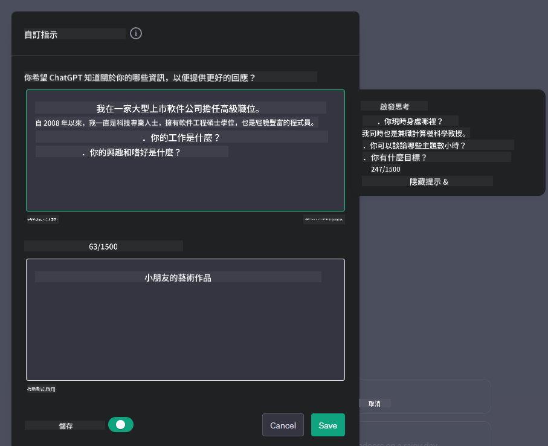
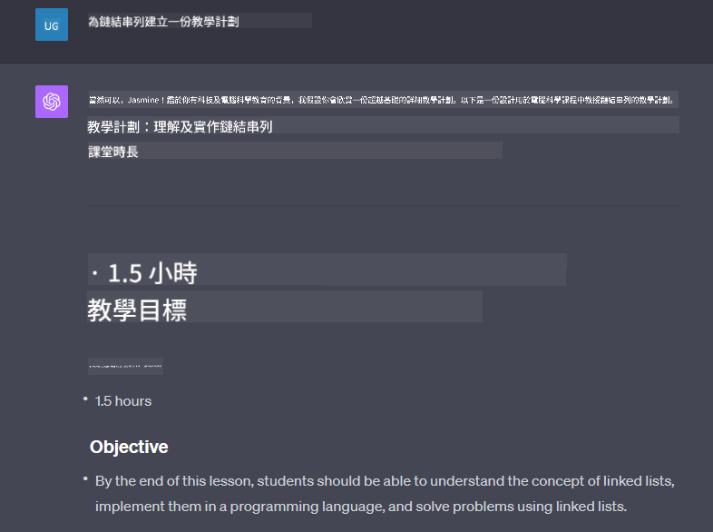

<!--
CO_OP_TRANSLATOR_METADATA:
{
  "original_hash": "a5308963a56cfbad2d73b0fa99fe84b3",
  "translation_date": "2025-10-17T23:36:19+00:00",
  "source_file": "07-building-chat-applications/README.md",
  "language_code": "hk"
}
-->
# 建立生成式 AI 驅動的聊天應用程式

[](https://youtu.be/R9V0ZY1BEQo?si=IHuU-fS9YWT8s4sA)

> _(點擊上方圖片觀看本課程的影片)_

在我們了解如何建立文字生成應用程式之後，現在來探討聊天應用程式。

聊天應用程式已成為我們日常生活的一部分，不僅僅是用於休閒交流。它們在客戶服務、技術支援，甚至是高級諮詢系統中都扮演著重要角色。您可能不久前就曾經使用過聊天應用程式來尋求幫助。隨著我們將生成式 AI 等更先進的技術整合到這些平台中，其複雜性和挑戰也隨之增加。

我們需要回答的一些問題包括：

- **建立應用程式**。如何有效地建立並無縫整合這些 AI 驅動的應用程式以滿足特定需求？
- **監控**。應用程式部署後，我們如何監控並確保其在功能和遵守[負責任 AI 的六大原則](https://www.microsoft.com/ai/responsible-ai?WT.mc_id=academic-105485-koreyst)方面保持最高質量？

隨著我們進入由自動化和無縫人機互動定義的時代，了解生成式 AI如何改變聊天應用程式的範疇、深度和適應性變得至關重要。本課程將探討支持這些複雜系統的架構方面，深入研究針對特定領域任務進行微調的方法，並評估確保負責任 AI 部署的相關指標和考量。

## 課程介紹

本課程涵蓋：

- 高效建立和整合聊天應用程式的技術。
- 如何對應用程式進行定制化和微調。
- 有效監控聊天應用程式的策略和考量。

## 學習目標

完成本課程後，您將能夠：

- 描述將聊天應用程式整合到現有系統中的考量。
- 根據特定使用案例定制聊天應用程式。
- 確定關鍵指標和考量，以有效監控和維持 AI 驅動聊天應用程式的質量。
- 確保聊天應用程式負責任地利用 AI。

## 將生成式 AI 整合到聊天應用程式中

通過生成式 AI 提升聊天應用程式的價值不僅僅是讓它們更智能，而是要優化其架構、性能和用戶界面，以提供高質量的用戶體驗。這涉及到研究架構基礎、API整合以及用戶界面的考量。本節旨在為您提供一個全面的路線圖，幫助您在這些複雜的領域中導航，無論是將它們整合到現有系統中，還是作為獨立平台構建。

完成本節後，您將具備高效構建和整合聊天應用程式所需的專業知識。

### 聊天機器人還是聊天應用程式？

在深入探討如何建立聊天應用程式之前，讓我們先比較「聊天機器人」和「AI 驅動的聊天應用程式」，它們在角色和功能上有著明顯的區別。聊天機器人的主要目的是自動化特定的對話任務，例如回答常見問題或追蹤包裹。它通常由基於規則的邏輯或複雜的 AI 演算法來驅動。相比之下，AI 驅動的聊天應用程式是一個更廣泛的環境，旨在促進人類用戶之間的各種形式的數字通信，例如文字、語音和視頻聊天。其主要特點是整合了生成式 AI 模型，能夠模擬細緻入微的類人對話，根據多種輸入和上下文提示生成回應。生成式 AI 驅動的聊天應用程式可以進行開放領域的討論，適應不斷變化的對話上下文，甚至生成創意或複雜的對話。

以下表格概述了它們在數字通信中獨特角色的主要差異和相似之處。

| 聊天機器人                           | 生成式 AI 驅動的聊天應用程式           |
| ------------------------------------- | -------------------------------------- |
| 以任務為中心，基於規則                | 上下文感知                              |
| 通常整合到更大的系統中                | 可包含一個或多個聊天機器人              |
| 僅限於程式化功能                      | 整合生成式 AI 模型                      |
| 專門化且結構化的互動                  | 能進行開放領域的討論                    |

### 利用 SDK 和 API 的預建功能

在建立聊天應用程式時，第一步是評估現有的資源。使用 SDK 和 API 來建立聊天應用程式是一種非常有利的策略，原因如下。通過整合文檔完善的 SDK 和 API，您可以為應用程式的長期成功奠定基礎，解決可擴展性和維護方面的問題。

- **加快開發過程並減少開銷**：依賴預建功能，而不是耗費大量資源自行開發，讓您可以專注於應用程式的其他重要方面，例如業務邏輯。
- **更好的性能**：當從零開始建立功能時，您最終會問自己「如何擴展？這個應用程式是否能夠應對突然增加的用戶量？」維護良好的 SDK 和 API 通常已內建解決這些問題的方案。
- **更容易維護**：更新和改進更容易管理，因為大多數 API 和 SDK 只需在發布新版本時更新庫即可。
- **獲得尖端技術**：利用已經過大量數據集微調和訓練的模型，為您的應用程式提供自然語言能力。

訪問 SDK 或 API 的功能通常需要獲得使用提供服務的許可，這通常通過使用唯一的密鑰或身份驗證令牌來實現。我們將使用 OpenAI Python Library 來探索這一過程。您也可以在以下的 [OpenAI 筆記本](./python/oai-assignment.ipynb?WT.mc_id=academic-105485-koreyst) 或 [Azure OpenAI Services 筆記本](./python/aoai-assignment.ipynb?WT.mc_id=academic-105485-koreys) 中自行嘗試。

```python
import os
from openai import OpenAI

API_KEY = os.getenv("OPENAI_API_KEY","")

client = OpenAI(
    api_key=API_KEY
    )

chat_completion = client.chat.completions.create(model="gpt-3.5-turbo", messages=[{"role": "user", "content": "Suggest two titles for an instructional lesson on chat applications for generative AI."}])
```

上述範例使用 GPT-3.5 Turbo 模型來完成提示，但請注意在執行之前需要設置 API 密鑰。如果未設置密鑰，您將收到錯誤。

## 用戶體驗 (UX)

一般的 UX 原則適用於聊天應用程式，但由於涉及機器學習元件，以下是一些特別重要的額外考量。

- **解決模糊性的機制**：生成式 AI 模型有時會生成模糊的答案。提供一個功能讓用戶可以要求澄清，當他們遇到這個問題時會非常有幫助。
- **上下文保留**：高級生成式 AI 模型能夠記住對話中的上下文，這可能是用戶體驗的重要資產。讓用戶能夠控制和管理上下文可以改善用戶體驗，但也帶來保留敏感用戶信息的風險。考慮如何存儲這些信息，例如引入保留政策，可以在上下文需求和隱私之間取得平衡。
- **個性化**：憑藉學習和適應的能力，AI 模型可以為用戶提供個性化的體驗。通過用戶檔案等功能定制用戶體驗，不僅讓用戶感到被理解，還有助於他們尋找特定答案，創造更高效和令人滿意的互動。

OpenAI 的 ChatGPT 中的「自定義指令」設置就是個性化的一個例子。它允許您提供關於自己的信息，這些信息可能是提示的重要上下文。以下是一個自定義指令的示例。



此「檔案」提示 ChatGPT 創建一個關於鏈表的課程計劃。注意，ChatGPT 根據用戶的經驗，提供了一個更深入的課程計劃。



### 微軟的大型語言模型系統消息框架

[微軟提供了指導](https://learn.microsoft.com/azure/ai-services/openai/concepts/system-message#define-the-models-output-format?WT.mc_id=academic-105485-koreyst)，幫助撰寫有效的系統消息以生成 LLM 的回應，分為以下四個方面：

1. 定義模型的目標用戶，以及其能力和限制。
2. 定義模型的輸出格式。
3. 提供展示模型預期行為的具體示例。
4. 提供額外的行為防範措施。

### 無障礙設計

無論用戶是視覺、聽覺、運動或認知障礙者，一個設計良好的聊天應用程式應該對所有人都可用。以下列表分解了針對各種用戶障礙的特定功能，以增強無障礙性。

- **針對視覺障礙的功能**：高對比度主題和可調整大小的文字，屏幕閱讀器兼容性。
- **針對聽覺障礙的功能**：文字轉語音和語音轉文字功能，音頻通知的視覺提示。
- **針對運動障礙的功能**：鍵盤導航支持，語音命令。
- **針對認知障礙的功能**：簡化語言選項。

## 為特定領域語言模型進行定制和微調

想像一個聊天應用程式，它能理解您公司的術語並預測用戶群體常見的特定問題。有幾種值得一提的方法：

- **利用 DSL 模型**。DSL 代表特定領域語言。您可以利用所謂的 DSL 模型，該模型經過特定領域的訓練，能理解其概念和場景。
- **進行微調**。微調是指使用特定數據進一步訓練您的模型的過程。

## 定制化：使用 DSL

利用特定領域語言模型（DSL 模型）可以通過提供專業、與上下文相關的互動來提高用戶參與度。這是一種專門針對特定領域、行業或主題進行訓練或微調的模型。使用 DSL 模型的選項可以從從零開始訓練，到通過 SDK 和 API 使用現有模型。另一個選項是微調，這涉及到採用現有的預訓練模型並使其適應特定領域。

## 定制化：進行微調

當預訓練模型在特定領域或特定任務中表現不足時，通常會考慮進行微調。

例如，醫學問題非常複雜，需要大量的上下文信息。當醫學專業人士診斷患者時，會基於多種因素，例如生活方式或既往病史，甚至可能依賴最新的醫學期刊來驗證診斷。在這些細緻入微的情境中，通用型 AI 聊天應用程式可能無法成為可靠的資源。

### 情境：醫療應用程式

考慮一個設計用於幫助醫療從業者的聊天應用程式，提供快速參考治療指南、藥物相互作用或最新研究結果。

通用型模型可能足以回答基本的醫學問題或提供一般建議，但可能在以下方面存在困難：

- **高度專業或複雜的案例**。例如，神經科醫生可能會詢問應用程式：「目前管理兒科患者藥物耐受性癲癇的最佳做法是什麼？」
- **缺乏最新進展**。通用型模型可能難以提供包含神經學和藥理學最新進展的答案。

在這些情境中，使用專門的醫學數據集進行模型微調可以顯著提高其更準確和可靠地處理這些複雜醫學問題的能力。這需要訪問大量相關數據集，代表需要解決的特定領域挑戰和問題。

## 高質量 AI 驅動聊天體驗的考量

本節概述了「高質量」聊天應用程式的標準，包括可操作指標的捕獲以及遵守負責任地利用 AI 技術的框架。

### 關鍵指標

為了保持應用程式的高質量性能，跟蹤關鍵指標和考量至關重要。這些測量不僅確保應用程式的功能性，還評估 AI 模型和用戶體驗的質量。以下是涵蓋基本、AI 和用戶體驗指標的列表。

| 指標                          | 定義                                                                                 | 聊天應用程式開發者的考量                                                 |
| ----------------------------- | ------------------------------------------------------------------------------------ | ----------------------------------------------------------------------- |
| **運行時間**                  | 測量應用程式可操作和用戶可訪問的時間。                                               | 您將如何最大限度地減少停機時間？                                         |
| **回應時間**                  | 應用程式回應用戶查詢所需的時間。                                                     | 您如何優化查詢處理以改善回應時間？                                       |
| **精確度**                    | 正確的正面預測與正面預測總數的比率。                                                 | 您將如何驗證模型的精確度？                                               |
| **召回率（敏感性）**          | 正確的正面預測與實際正面數量的比率。                                                 | 您將如何測量和提高召回率？                                               |
| **F1 分數**                   | 精確度和召回率的調和平均值，平衡兩者之間的權衡。                                     | 您的目標 F1 分數是多少？您將如何平衡精確度和召回率？                     |
| **困惑度**                    | 測量模型預測的概率分佈與實際數據分佈的匹配程度。                                     | 您將如何最大限度地減少困惑度？                                           |
| **用戶滿意度指標**            | 測量用戶對應用程式的感知，通常通過調查收集。                                         | 您將如何頻繁收集用戶反饋？您將如何根據反饋進行調整？                     |
| **錯誤率**                    | 模型在理解或輸出中犯錯的比率。                                                       | 您有哪些策略來降低錯誤率？                                               |
| **重新訓練週期**              | 更新模型以整合新數據和洞察的頻率。                                                   | 您將如何頻繁地重新訓練模型？什麼情況會觸發重新訓練週期？                 |
| **異常檢測**         | 用於識別不符合預期行為的異常模式的工具和技術。                        | 你將如何應對異常情況？                                        |

### 在聊天應用中實施負責任的人工智能實踐

Microsoft的負責任人工智能方法確立了六項原則，這些原則應指導人工智能的開發和使用。以下是這些原則的定義，以及聊天應用開發者需要考慮的事項及其重要性。

| 原則                   | Microsoft的定義                                      | 聊天應用開發者的考量                                              | 為什麼重要                                                                          |
| ---------------------- | ----------------------------------------------------- | ------------------------------------------------------------------ | ----------------------------------------------------------------------------------- |
| 公平性                | 人工智能系統應公平對待所有人。                        | 確保聊天應用不基於用戶數據進行歧視。                              | 建立用戶信任和包容性；避免法律後果。                                                |
| 可靠性與安全性        | 人工智能系統應可靠且安全地運行。                      | 實施測試和故障保護以減少錯誤和風險。                              | 確保用戶滿意度並防止潛在危害。                                                      |
| 隱私與安全            | 人工智能系統應安全並尊重隱私。                        | 實施強加密和數據保護措施。                                        | 保護敏感用戶數據並遵守隱私法規。                                                    |
| 包容性                | 人工智能系統應賦能所有人並吸引各類人群。              | 設計適合多元化用戶的可訪問且易於使用的UI/UX。                      | 確保更多人能有效使用該應用。                                                        |
| 透明性                | 人工智能系統應該是可理解的。                          | 提供清晰的文檔和人工智能回應的理由。                              | 如果用戶能理解決策的生成方式，他們更可能信任系統。                                   |
| 責任性                | 人工智能系統應由人負責。                              | 建立清晰的審核和改進人工智能決策的流程。                          | 促進持續改進並在出現錯誤時採取糾正措施。                                            |

## 作業

請參閱[作業](../../../07-building-chat-applications/python)。它將帶你完成一系列練習，從運行你的第一個聊天提示到分類和摘要文本等。注意，這些作業提供了不同的編程語言版本！

## 幹得好！繼續學習之旅

完成本課程後，請查看我們的[生成式人工智能學習合集](https://aka.ms/genai-collection?WT.mc_id=academic-105485-koreyst)，繼續提升你的生成式人工智能知識！

前往第8課，了解如何開始[構建搜索應用](../08-building-search-applications/README.md?WT.mc_id=academic-105485-koreyst)！

---

**免責聲明**：  
此文件已使用 AI 翻譯服務 [Co-op Translator](https://github.com/Azure/co-op-translator) 進行翻譯。儘管我們致力於提供準確的翻譯，但請注意，自動翻譯可能包含錯誤或不準確之處。原始文件的母語版本應被視為權威來源。對於重要信息，建議使用專業人工翻譯。我們對因使用此翻譯而引起的任何誤解或誤釋不承擔責任。