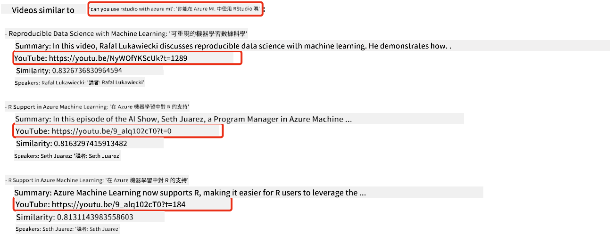
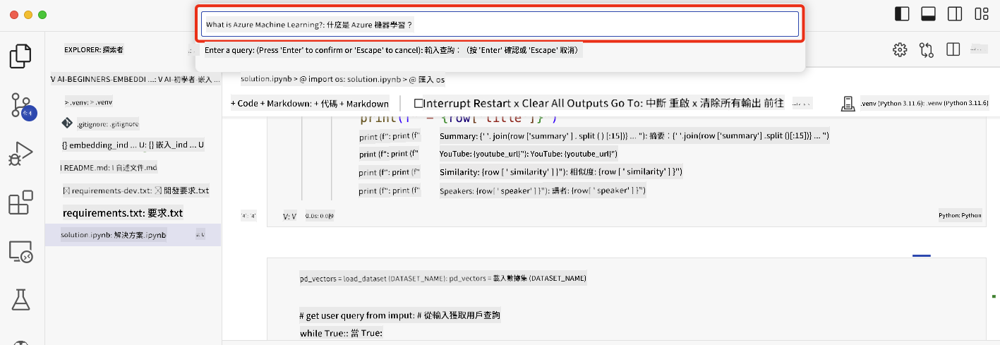

<!--
CO_OP_TRANSLATOR_METADATA:
{
  "original_hash": "d46aad0917a1a342d613e2c13d457da5",
  "translation_date": "2025-05-19T18:22:04+00:00",
  "source_file": "08-building-search-applications/README.md",
  "language_code": "hk"
}
-->
# 建立搜尋應用程式

[](https://aka.ms/gen-ai-lesson8-gh?WT.mc_id=academic-105485-koreyst)

> > _點擊上方圖片觀看本課程的影片_

大型語言模型不僅限於聊天機器人和文本生成。其實也可以使用嵌入來建立搜尋應用程式。嵌入是數據的數值表示，也稱為向量，可以用於數據的語義搜尋。

在這節課中，你將為我們的教育創業公司建立一個搜尋應用程式。我們的創業公司是一個非營利組織，為發展中國家的學生提供免費教育。我們的創業公司有大量的 YouTube 影片，學生可以用來學習 AI。我們的創業公司希望建立一個搜尋應用程式，讓學生可以透過輸入問題來搜尋 YouTube 影片。

例如，學生可能會輸入「什麼是 Jupyter Notebooks？」或「什麼是 Azure ML」，搜尋應用程式將返回與問題相關的 YouTube 影片列表，更好的是，搜尋應用程式將返回影片中問題答案所在位置的連結。

## 介紹

在這節課中，我們將涵蓋：

- 語義搜尋與關鍵字搜尋的區別。
- 什麼是文本嵌入。
- 創建文本嵌入索引。
- 搜尋文本嵌入索引。

## 學習目標

完成本課後，你將能夠：

- 分辨語義搜尋與關鍵字搜尋的不同。
- 解釋什麼是文本嵌入。
- 使用嵌入創建應用程式來搜尋數據。

## 為什麼要建立搜尋應用程式？

創建搜尋應用程式將幫助你了解如何使用嵌入來搜尋數據。你還將學會如何建立一個可供學生快速找到資訊的搜尋應用程式。

本課程包含了 Microsoft [AI Show](https://www.youtube.com/playlist?list=PLlrxD0HtieHi0mwteKBOfEeOYf0LJU4O1) YouTube 頻道的影片文字稿的嵌入索引。AI Show 是一個教你關於 AI 和機器學習的 YouTube 頻道。嵌入索引包含截至 2023 年 10 月的每個 YouTube 文字稿的嵌入。你將使用嵌入索引為我們的創業公司建立一個搜尋應用程式。搜尋應用程式會返回影片中問題答案所在位置的連結。這是一個讓學生快速找到所需資訊的好方法。

以下是一個語義查詢的例子，問題是「你可以用 rstudio 和 azure ml 嗎？」。查看 YouTube 的 URL，你會看到該 URL 包含一個時間戳，會帶你到影片中問題答案所在的位置。



## 什麼是語義搜尋？

你可能會想，什麼是語義搜尋？語義搜尋是一種使用查詢中詞語的語義或含義來返回相關結果的搜尋技術。

這裡有一個語義搜尋的例子。假設你想買車，你可能會搜尋「我的夢想車」，語義搜尋理解你不是在 `dreaming` 一輛車，而是你在找你想買的 `ideal` 車。語義搜尋理解你的意圖並返回相關結果。相反的 `keyword search` 會字面搜尋關於車的夢，通常返回不相關的結果。

## 什麼是文本嵌入？

[文本嵌入](https://en.wikipedia.org/wiki/Word_embedding?WT.mc_id=academic-105485-koreyst) 是一種用於[自然語言處理](https://en.wikipedia.org/wiki/Natural_language_processing?WT.mc_id=academic-105485-koreyst)的文本表示技術。文本嵌入是文本的語義數值表示。嵌入用於以易於機器理解的方式表示數據。有很多模型可以用來構建文本嵌入，在這節課中，我們將專注於使用 OpenAI 嵌入模型生成嵌入。

這裡有一個例子，假設以下文本是 AI Show YouTube 頻道某一集的文字稿：

```text
Today we are going to learn about Azure Machine Learning.
```

我們會將文本傳遞給 OpenAI 嵌入 API，它會返回由 1536 個數字組成的嵌入，也就是一個向量。向量中的每個數字代表文本的不同方面。為了簡便，這裡是向量的前 10 個數字。

```python
[-0.006655829958617687, 0.0026128944009542465, 0.008792596869170666, -0.02446001023054123, -0.008540431968867779, 0.022071078419685364, -0.010703742504119873, 0.003311325330287218, -0.011632772162556648, -0.02187200076878071, ...]
```

## 嵌入索引是如何創建的？

本課的嵌入索引是用一系列 Python 腳本創建的。你會在本課的「scripts」文件夾中的 [README](./scripts/README.md?WT.mc_id=academic-105485-koreyst) 找到這些腳本和指示。你不需要運行這些腳本來完成本課，因為嵌入索引已經為你提供。

這些腳本執行以下操作：

1. 下載 [AI Show](https://www.youtube.com/playlist?list=PLlrxD0HtieHi0mwteKBOfEeOYf0LJU4O1) 播放列表中每個 YouTube 影片的文字稿。
2. 使用 [OpenAI Functions](https://learn.microsoft.com/azure/ai-services/openai/how-to/function-calling?WT.mc_id=academic-105485-koreyst)，嘗試從 YouTube 文字稿的前三分鐘中提取講者名稱。每個影片的講者名稱都存儲在名為 `embedding_index_3m.json` 的嵌入索引中。
3. 然後將文字稿文本分成**三分鐘的文本段**。該段包含約 20 個詞，與下一段重疊，以確保段的嵌入不會被截斷，並提供更好的搜尋上下文。
4. 然後將每個文本段傳遞給 OpenAI Chat API，將文本總結成 60 個詞。總結也存儲在嵌入索引 `embedding_index_3m.json` 中。
5. 最後，將段文本傳遞給 OpenAI 嵌入 API。嵌入 API 返回一個由 1536 個數字組成的向量，代表該段的語義意義。該段連同 OpenAI 嵌入向量一起存儲在嵌入索引 `embedding_index_3m.json` 中。

### 向量數據庫

為了簡化課程，嵌入索引存儲在名為 `embedding_index_3m.json` 的 JSON 文件中，並加載到 Pandas DataFrame 中。然而，在生產中，嵌入索引會存儲在一個向量數據庫中，例如 [Azure Cognitive Search](https://learn.microsoft.com/training/modules/improve-search-results-vector-search?WT.mc_id=academic-105485-koreyst)、[Redis](https://cookbook.openai.com/examples/vector_databases/redis/readme?WT.mc_id=academic-105485-koreyst)、[Pinecone](https://cookbook.openai.com/examples/vector_databases/pinecone/readme?WT.mc_id=academic-105485-koreyst)、[Weaviate](https://cookbook.openai.com/examples/vector_databases/weaviate/readme?WT.mc_id=academic-105485-koreyst) 等等。

## 理解餘弦相似度

我們已經學習了文本嵌入，下一步是學習如何使用文本嵌入來搜尋數據，特別是使用餘弦相似度來找到與給定查詢最相似的嵌入。

### 什麼是餘弦相似度？

餘弦相似度是兩個向量之間相似度的度量，你也會聽到這被稱為 `nearest neighbor search`。要執行餘弦相似度搜尋，你需要使用 OpenAI 嵌入 API 為查詢文本進行_向量化_。然後計算查詢向量與嵌入索引中每個向量之間的_餘弦相似度_。記住，嵌入索引對每個 YouTube 文字稿文本段都有一個向量。最後，按餘弦相似度排序結果，餘弦相似度最高的文本段與查詢最相似。

從數學角度來看，餘弦相似度測量兩個向量在多維空間中投影的角度的餘弦值。這個測量是有益的，因為如果兩個文檔因大小而在歐幾里得距離上相距甚遠，它們仍然可能在它們之間有一個較小的角度，因此具有更高的餘弦相似度。關於餘弦相似度方程的更多資訊，請參閱 [Cosine similarity](https://en.wikipedia.org/wiki/Cosine_similarity?WT.mc_id=academic-105485-koreyst)。

## 建立你的第一個搜尋應用程式

接下來，我們將學習如何使用嵌入建立搜尋應用程式。搜尋應用程式將允許學生通過輸入問題來搜尋影片。搜尋應用程式將返回與問題相關的影片列表。搜尋應用程式還將返回影片中問題答案所在位置的連結。

此解決方案已在 Windows 11、macOS 和 Ubuntu 22.04 上使用 Python 3.10 或更高版本進行構建和測試。你可以從 [python.org](https://www.python.org/downloads/?WT.mc_id=academic-105485-koreyst) 下載 Python。

## 作業 - 建立搜尋應用程式，讓學生能夠使用

我們在本課開始時介紹了我們的創業公司。現在是時候讓學生建立一個搜尋應用程式來進行他們的評估。

在這個作業中，你將創建用於建立搜尋應用程式的 Azure OpenAI 服務。你將創建以下 Azure OpenAI 服務。你需要一個 Azure 訂閱才能完成此作業。

### 開始使用 Azure Cloud Shell

1. 登錄 [Azure 入口網站](https://portal.azure.com/?WT.mc_id=academic-105485-koreyst)。
2. 選擇 Azure 入口網站右上角的 Cloud Shell 圖標。
3. 選擇 **Bash** 作為環境類型。

#### 創建資源組

> 對於這些指示，我們使用位於美國東部的名為 "semantic-video-search" 的資源組。
> 你可以更改資源組的名稱，但在更改資源的位置時，
> 請檢查 [模型可用性表](https://aka.ms/oai/models?WT.mc_id=academic-105485-koreyst)。

```shell
az group create --name semantic-video-search --location eastus
```

#### 創建 Azure OpenAI 服務資源

從 Azure Cloud Shell 運行以下命令以創建 Azure OpenAI 服務資源。

```shell
az cognitiveservices account create --name semantic-video-openai --resource-group semantic-video-search \
    --location eastus --kind OpenAI --sku s0
```

#### 獲取此應用程式使用的端點和密鑰

從 Azure Cloud Shell 運行以下命令以獲取 Azure OpenAI 服務資源的端點和密鑰。

```shell
az cognitiveservices account show --name semantic-video-openai \
   --resource-group  semantic-video-search | jq -r .properties.endpoint
az cognitiveservices account keys list --name semantic-video-openai \
   --resource-group semantic-video-search | jq -r .key1
```

#### 部署 OpenAI 嵌入模型

從 Azure Cloud Shell 運行以下命令以部署 OpenAI 嵌入模型。

```shell
az cognitiveservices account deployment create \
    --name semantic-video-openai \
    --resource-group  semantic-video-search \
    --deployment-name text-embedding-ada-002 \
    --model-name text-embedding-ada-002 \
    --model-version "2"  \
    --model-format OpenAI \
    --sku-capacity 100 --sku-name "Standard"
```

## 解決方案

在 GitHub Codespaces 中打開 [解決方案筆記本](../../../08-building-search-applications/python/aoai-solution.ipynb) 並按照 Jupyter Notebook 中的指示進行操作。

當你運行筆記本時，你將被提示輸入查詢。輸入框看起來像這樣：



## 做得好！繼續你的學習

完成本課後，查看我們的 [生成式 AI 學習集合](https://aka.ms/genai-collection?WT.mc_id=academic-105485-koreyst) 以繼續提升你的生成式 AI 知識！

前往第 9 課，我們將看看如何[建立圖像生成應用程式](../09-building-image-applications/README.md?WT.mc_id=academic-105485-koreyst)！

**免責聲明**：  
此文件是使用 AI 翻譯服務 [Co-op Translator](https://github.com/Azure/co-op-translator) 翻譯的。我們努力確保準確性，但請注意，自動翻譯可能會包含錯誤或不準確之處。應將原文檔的母語版本視為權威來源。對於關鍵信息，建議尋求專業人工翻譯。我們對使用此翻譯所產生的任何誤解或誤釋不承擔責任。