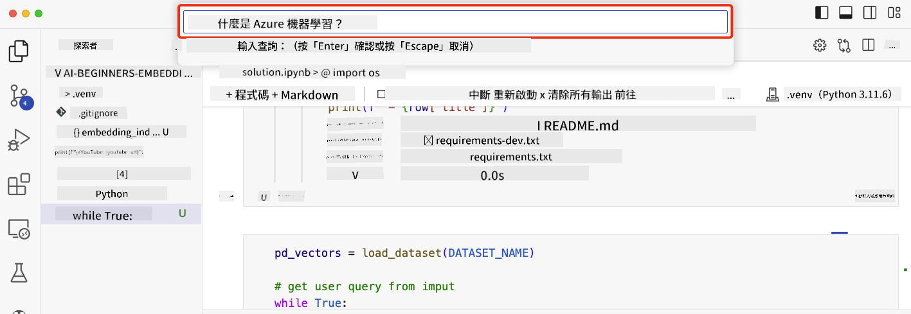

<!--
CO_OP_TRANSLATOR_METADATA:
{
  "original_hash": "d46aad0917a1a342d613e2c13d457da5",
  "translation_date": "2025-07-09T12:49:12+00:00",
  "source_file": "08-building-search-applications/README.md",
  "language_code": "hk"
}
-->
# 建立搜尋應用程式

[](https://aka.ms/gen-ai-lesson8-gh?WT.mc_id=academic-105485-koreyst)

> > _點擊上方圖片觀看本課程影片_

大型語言模型（LLM）不只是用於聊天機器人和文字生成，也可以利用 Embeddings 建立搜尋應用程式。Embeddings 是資料的數值表示，也稱為向量，可用於語意搜尋。

在本課程中，你將為我們的教育新創公司建立一個搜尋應用程式。我們的新創公司是一個非牟利組織，為發展中國家的學生提供免費教育。我們擁有大量的 YouTube 影片，供學生學習 AI。我們希望建立一個搜尋應用程式，讓學生能透過輸入問題來搜尋 YouTube 影片。

例如，學生可能會輸入「什麼是 Jupyter Notebooks？」或「什麼是 Azure ML」，搜尋應用程式會回傳與問題相關的 YouTube 影片清單，更棒的是，搜尋結果會直接連結到影片中回答該問題的時間點。

## 介紹

本課程將涵蓋：

- 語意搜尋與關鍵字搜尋的差異。
- 什麼是文字 Embeddings。
- 建立文字 Embeddings 索引。
- 搜尋文字 Embeddings 索引。

## 學習目標

完成本課程後，你將能夠：

- 分辨語意搜尋與關鍵字搜尋的不同。
- 解釋什麼是文字 Embeddings。
- 使用 Embeddings 建立搜尋資料的應用程式。

## 為什麼要建立搜尋應用程式？

建立搜尋應用程式能幫助你了解如何使用 Embeddings 來搜尋資料，也能學會如何打造一個讓學生快速找到資訊的搜尋工具。

本課程包含 Microsoft [AI Show](https://www.youtube.com/playlist?list=PLlrxD0HtieHi0mwteKBOfEeOYf0LJU4O1) YouTube 頻道的影片逐字稿 Embedding 索引。AI Show 是一個教你 AI 與機器學習的 YouTube 頻道。Embedding 索引包含截至 2023 年 10 月的所有影片逐字稿 Embeddings。你將使用這個索引來建立搜尋應用程式，搜尋結果會連結到影片中回答問題的時間點，讓學生能快速找到所需資訊。

以下是針對問題「can you use rstudio with azure ml?」的語意查詢範例。查看 YouTube 連結，你會發現網址包含時間戳，直接帶你到影片中回答該問題的片段。


## 什麼是語意搜尋？

你可能會好奇，什麼是語意搜尋？語意搜尋是一種利用查詢中詞語的語意或意義來回傳相關結果的搜尋技術。

舉例來說，假設你想買車，輸入「我的夢想車」，語意搜尋會理解你不是在「夢想」一輛車，而是想找你的「理想」車款。語意搜尋能理解你的意圖並回傳相關結果。相對地，關鍵字搜尋會字面搜尋「夢想」和「車」，常常回傳不相關的結果。

## 什麼是文字 Embeddings？

[文字 Embeddings](https://en.wikipedia.org/wiki/Word_embedding?WT.mc_id=academic-105485-koreyst) 是一種用於[自然語言處理](https://en.wikipedia.org/wiki/Natural_language_processing?WT.mc_id=academic-105485-koreyst)的文字表示技術。文字 Embeddings 是文字的語意數值表示。Embeddings 用來將資料以機器容易理解的方式表示。有許多模型可以建立文字 Embeddings，本課程將專注於使用 OpenAI Embedding 模型來產生 Embeddings。

舉例來說，假設以下文字來自 AI Show YouTube 頻道某集的逐字稿：

```text
Today we are going to learn about Azure Machine Learning.
```

我們會將文字傳給 OpenAI Embedding API，API 會回傳一個包含 1536 個數字的向量。向量中的每個數字代表文字的不同面向。以下為向量的前 10 個數字，為簡潔起見。

```python
[-0.006655829958617687, 0.0026128944009542465, 0.008792596869170666, -0.02446001023054123, -0.008540431968867779, 0.022071078419685364, -0.010703742504119873, 0.003311325330287218, -0.011632772162556648, -0.02187200076878071, ...]
```

## Embedding 索引是如何建立的？

本課程的 Embedding 索引是透過一系列 Python 腳本建立。你可以在本課程的 `scripts` 資料夾中的 [README](./scripts/README.md?WT.mc_id=academic-105485-koreyst) 找到這些腳本和說明。你不需要執行這些腳本即可完成本課程，因為我們已提供 Embedding 索引。

這些腳本執行以下操作：

1. 下載 [AI Show](https://www.youtube.com/playlist?list=PLlrxD0HtieHi0mwteKBOfEeOYf0LJU4O1) 播放清單中每支 YouTube 影片的逐字稿。
2. 使用 [OpenAI Functions](https://learn.microsoft.com/azure/ai-services/openai/how-to/function-calling?WT.mc_id=academic-105485-koreyst) 嘗試從逐字稿的前三分鐘擷取講者名稱。每支影片的講者名稱會儲存在名為 `embedding_index_3m.json` 的 Embedding 索引中。
3. 將逐字稿文字切分成**三分鐘的文字段落**。每段會與下一段重疊約 20 個字，以確保 Embedding 不會被截斷，並提供更好的搜尋上下文。
4. 將每段文字傳給 OpenAI Chat API，將文字摘要成 60 字，摘要也會儲存在 `embedding_index_3m.json` 中。
5. 最後，將文字段落傳給 OpenAI Embedding API，API 回傳一個 1536 維的向量，代表該段文字的語意。段落與向量會一起儲存在 `embedding_index_3m.json`。

### 向量資料庫

為簡化課程，Embedding 索引儲存在名為 `embedding_index_3m.json` 的 JSON 檔案中，並載入到 Pandas DataFrame。但在實務中，Embedding 索引會儲存在向量資料庫，例如 [Azure Cognitive Search](https://learn.microsoft.com/training/modules/improve-search-results-vector-search?WT.mc_id=academic-105485-koreyst)、[Redis](https://cookbook.openai.com/examples/vector_databases/redis/readme?WT.mc_id=academic-105485-koreyst)、[Pinecone](https://cookbook.openai.com/examples/vector_databases/pinecone/readme?WT.mc_id=academic-105485-koreyst)、[Weaviate](https://cookbook.openai.com/examples/vector_databases/weaviate/readme?WT.mc_id=academic-105485-koreyst) 等。

## 了解餘弦相似度

我們已了解文字 Embeddings，接下來學習如何利用文字 Embeddings 搜尋資料，特別是如何用餘弦相似度找到與查詢最相似的 Embeddings。

### 什麼是餘弦相似度？

餘弦相似度是衡量兩個向量相似度的方法，也稱為「最近鄰搜尋」。要進行餘弦相似度搜尋，需先用 OpenAI Embedding API 將查詢文字「向量化」。接著計算查詢向量與 Embedding 索引中每個向量的餘弦相似度。記得，Embedding 索引中每個向量代表一段 YouTube 逐字稿文字。最後依餘弦相似度排序，數值最高的文字段落即與查詢最相似。

從數學角度看，餘弦相似度是多維空間中兩向量夾角的餘弦值。這個度量很有用，因為即使兩份文件在歐氏距離上相距較遠（可能因大小不同），它們的夾角仍可能較小，因而餘弦相似度較高。更多餘弦相似度的數學公式，請參考 [Cosine similarity](https://en.wikipedia.org/wiki/Cosine_similarity?WT.mc_id=academic-105485-koreyst)。

## 建立你的第一個搜尋應用程式

接下來，我們將學習如何使用 Embeddings 建立搜尋應用程式。該應用程式允許學生透過輸入問題搜尋影片，並回傳與問題相關的影片清單，還會連結到影片中回答問題的時間點。

此解決方案已在 Windows 11、macOS 和 Ubuntu 22.04 上使用 Python 3.10 或更新版本測試。你可以從 [python.org](https://www.python.org/downloads/?WT.mc_id=academic-105485-koreyst) 下載 Python。

## 作業 - 建立搜尋應用程式，幫助學生

我們在課程開頭介紹了新創公司，現在是時候讓學生自己建立搜尋應用程式，作為評量的一部分。

在此作業中，你將建立用於搜尋應用程式的 Azure OpenAI 服務。你需要一個 Azure 訂閱來完成此作業。

### 啟動 Azure Cloud Shell

1. 登入 [Azure 入口網站](https://portal.azure.com/?WT.mc_id=academic-105485-koreyst)。
2. 點選 Azure 入口網站右上角的 Cloud Shell 圖示。
3. 選擇 **Bash** 作為環境類型。

#### 建立資源群組

> 以下指令使用位於 East US 的資源群組「semantic-video-search」。
> 你可以更改資源群組名稱，但若更改資源位置，
> 請參考[模型可用性表](https://aka.ms/oai/models?WT.mc_id=academic-105485-koreyst)。

```shell
az group create --name semantic-video-search --location eastus
```

#### 建立 Azure OpenAI 服務資源

在 Azure Cloud Shell 執行以下指令，建立 Azure OpenAI 服務資源。

```shell
az cognitiveservices account create --name semantic-video-openai --resource-group semantic-video-search \
    --location eastus --kind OpenAI --sku s0
```

#### 取得端點與金鑰以供應用程式使用

在 Azure Cloud Shell 執行以下指令，取得 Azure OpenAI 服務資源的端點與金鑰。

```shell
az cognitiveservices account show --name semantic-video-openai \
   --resource-group  semantic-video-search | jq -r .properties.endpoint
az cognitiveservices account keys list --name semantic-video-openai \
   --resource-group semantic-video-search | jq -r .key1
```

#### 部署 OpenAI Embedding 模型

在 Azure Cloud Shell 執行以下指令，部署 OpenAI Embedding 模型。

```shell
az cognitiveservices account deployment create \
    --name semantic-video-openai \
    --resource-group  semantic-video-search \
    --deployment-name text-embedding-ada-002 \
    --model-name text-embedding-ada-002 \
    --model-version "2"  \
    --model-format OpenAI \
    --sku-capacity 100 --sku-name "Standard"
```

## 解決方案

打開 GitHub Codespaces 中的 [解決方案筆記本](../../../08-building-search-applications/python/aoai-solution.ipynb)，並依照 Jupyter Notebook 中的指示操作。

執行筆記本時，系統會提示你輸入查詢。輸入框如下圖所示：



## 做得好！繼續學習

完成本課程後，歡迎參考我們的[生成式 AI 學習合集](https://aka.ms/genai-collection?WT.mc_id=academic-105485-koreyst)，持續提升你的生成式 AI 知識！

接著前往第 9 課，我們將探討如何[建立影像生成應用程式](../09-building-image-applications/README.md?WT.mc_id=academic-105485-koreyst)！

**免責聲明**：  
本文件由 AI 翻譯服務 [Co-op Translator](https://github.com/Azure/co-op-translator) 進行翻譯。雖然我們致力於確保準確性，但請注意自動翻譯可能包含錯誤或不準確之處。原始文件的母語版本應被視為權威來源。對於重要資訊，建議採用專業人工翻譯。我們不對因使用本翻譯而引起的任何誤解或誤釋承擔責任。