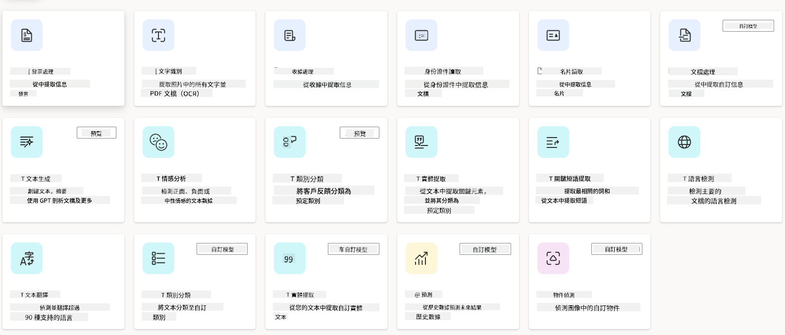
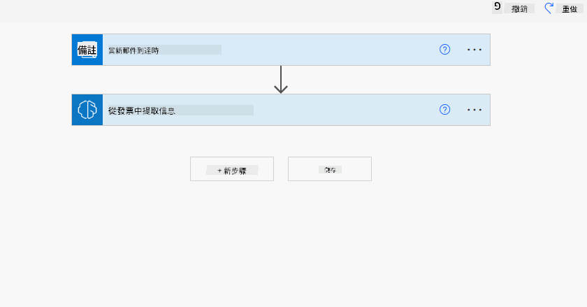
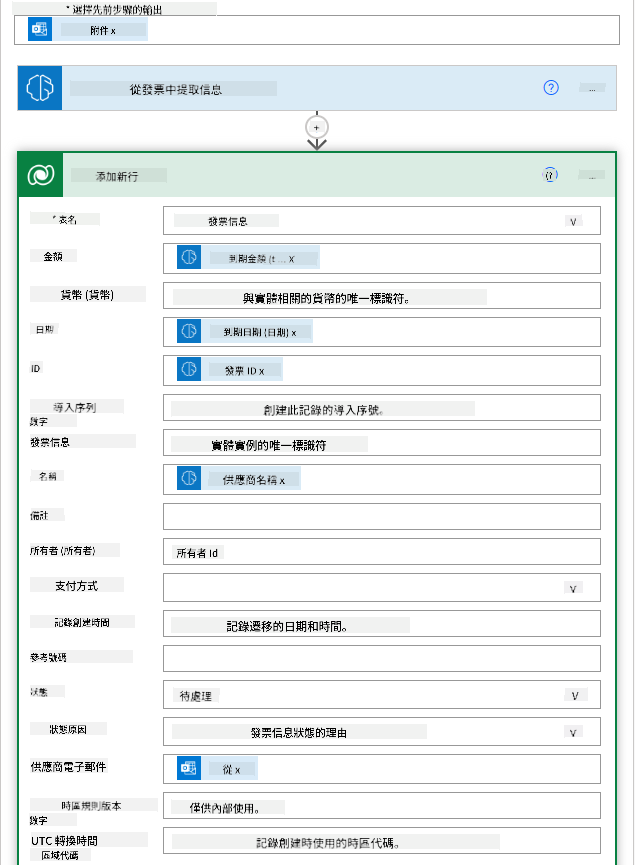
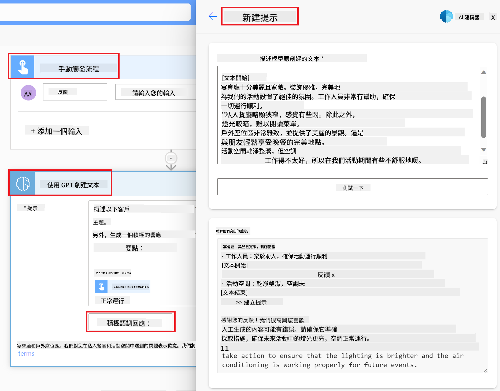

<!--
CO_OP_TRANSLATOR_METADATA:
{
  "original_hash": "f5ff3b6204a695a117d6f452403c95f7",
  "translation_date": "2025-05-19T19:48:29+00:00",
  "source_file": "10-building-low-code-ai-applications/README.md",
  "language_code": "hk"
}
-->
# 建立低代碼 AI 應用程序

## 介紹

現在我們已經學會了如何建立圖像生成應用程序，讓我們來談談低代碼。生成式 AI 可以應用於許多不同的領域，包括低代碼，但什麼是低代碼，我們又如何將 AI 添加到其中呢？

通過使用低代碼開發平台，傳統開發者和非開發者建立應用程序和解決方案變得更加容易。低代碼開發平台允許你用很少甚至不需要編碼就能建立應用程序和解決方案。這是通過提供一個可視化的開發環境來實現的，該環境允許你拖放組件來構建應用程序和解決方案。這使得你可以更快地構建應用程序和解決方案，並且使用更少的資源。在本課中，我們將深入探討如何使用低代碼以及如何使用 Power Platform 通過 AI 增強低代碼開發。

Power Platform 為組織提供了一個機會，通過直觀的低代碼或無代碼環境賦能他們的團隊構建自己的解決方案。這個環境有助於簡化構建解決方案的過程。使用 Power Platform，解決方案可以在幾天或幾周內完成，而不是幾個月或幾年。Power Platform 包含五個關鍵產品：Power Apps、Power Automate、Power BI、Power Pages 和 Copilot Studio。

本課涵蓋：

- Power Platform 中的生成式 AI 介紹
- Copilot 介紹及其使用方法
- 使用生成式 AI 在 Power Platform 中構建應用程序和流程
- 使用 AI Builder 了解 Power Platform 中的 AI 模型

## 學習目標

在本課結束時，你將能夠：

- 理解 Copilot 在 Power Platform 中的工作原理。

- 為我們的教育初創公司構建一個學生作業跟蹤應用程序。

- 構建一個使用 AI 從發票中提取信息的發票處理流程。

- 在使用 GPT AI 模型創建文本時應用最佳實踐。

在本課中你將使用的工具和技術包括：

- **Power Apps**，用於學生作業跟蹤應用程序，提供了一個低代碼開發環境，用於構建應用程序來跟蹤、管理和與數據互動。

- **Dataverse**，用於存儲學生作業跟蹤應用程序的數據，Dataverse 將提供一個低代碼數據平台來存儲應用程序的數據。

- **Power Automate**，用於發票處理流程，你將有一個低代碼開發環境來構建工作流程以自動化發票處理過程。

- **AI Builder**，用於發票處理 AI 模型，你將使用預構建的 AI 模型來處理我們初創公司的發票。

## Power Platform 中的生成式 AI

增強低代碼開發和應用程序與生成式 AI 是 Power Platform 的一個關鍵關注領域。目標是讓每個人都能構建 AI 驅動的應用程序、網站、儀表板，並使用 AI 自動化流程，_不需要任何數據科學專業知識_。這一目標是通過將生成式 AI 以 Copilot 和 AI Builder 的形式集成到 Power Platform 的低代碼開發體驗中來實現的。

### 這是如何運作的？

Copilot 是一個 AI 助理，允許你通過使用自然語言的一系列對話步驟來描述你的需求，從而構建 Power Platform 解決方案。你可以例如指示你的 AI 助理說明你的應用程序將使用哪些字段，它將創建應用程序和基礎數據模型，或者你可以指定如何在 Power Automate 中設置流程。

你可以在應用程序屏幕中使用 Copilot 驅動的功能，讓用戶通過對話交互來發掘見解。

AI Builder 是 Power Platform 中的一種低代碼 AI 能力，允許你使用 AI 模型來幫助你自動化流程和預測結果。通過 AI Builder，你可以將 AI 帶到你的應用程序和流程中，這些應用程序和流程連接到你的 Dataverse 數據或各種雲數據源，如 SharePoint、OneDrive 或 Azure。

Copilot 在所有 Power Platform 產品中可用：Power Apps、Power Automate、Power BI、Power Pages 和 Power Virtual Agents。AI Builder 在 Power Apps 和 Power Automate 中可用。在本課中，我們將重點關注如何在 Power Apps 和 Power Automate 中使用 Copilot 和 AI Builder 為我們的教育初創公司構建解決方案。

### Power Apps 中的 Copilot

作為 Power Platform 的一部分，Power Apps 提供了一個低代碼開發環境，用於構建應用程序以跟蹤、管理和與數據互動。它是一套應用程序開發服務，具有可擴展的數據平台，並能夠連接到雲服務和本地數據。Power Apps 允許你構建在瀏覽器、平板電腦和手機上運行的應用程序，並可以與同事共享。Power Apps 通過簡單的界面使用戶輕鬆進入應用程序開發，以便每個業務用戶或專業開發人員都能構建自定義應用程序。通過 Copilot，生成式 AI 也增強了應用程序開發體驗。

Power Apps 中的 Copilot AI 助理功能允許你描述你需要的應用程序類型以及你希望應用程序跟蹤、收集或顯示的信息。Copilot 然後根據你的描述生成一個響應式 Canvas 應用程序。你可以根據需要自定義應用程序。AI Copilot 還會生成並建議一個具有你需要的字段的 Dataverse 表來存儲你想跟蹤的數據和一些示例數據。我們將在本課後面討論什麼是 Dataverse 以及如何在 Power Apps 中使用它。然後你可以使用 AI Copilot 助理功能通過對話步驟來自定義表。此功能可從 Power Apps 主屏幕直接使用。

### Power Automate 中的 Copilot

作為 Power Platform 的一部分，Power Automate 讓用戶可以在應用程序和服務之間創建自動化工作流程。它有助於自動化重複的業務流程，如通信、數據收集和決策批准。其簡單的界面允許各種技術能力的用戶（從初學者到經驗豐富的開發人員）自動化工作任務。通過 Copilot，生成式 AI 也增強了工作流程開發體驗。

Power Automate 中的 Copilot AI 助理功能允許你描述你需要的流程類型以及你希望流程執行的操作。Copilot 然後根據你的描述生成一個流程。你可以根據需要自定義流程。AI Copilot 還會生成並建議你需要執行的操作來自動化你想要的任務。我們將在本課後面討論什麼是流程以及如何在 Power Automate 中使用它們。然後你可以使用 AI Copilot 助理功能通過對話步驟來自定義操作。此功能可從 Power Automate 主屏幕直接使用。

## 任務：使用 Copilot 管理我們初創公司的學生作業和發票

我們的初創公司為學生提供在線課程。該初創公司迅速增長，現在難以跟上其課程的需求。該初創公司聘請你作為 Power Platform 開發人員來幫助他們建立一個低代碼解決方案，以幫助他們管理學生作業和發票。他們的解決方案應該能夠幫助他們通過應用程序跟蹤和管理學生作業，並通過工作流程自動化發票處理過程。你被要求使用生成式 AI 開發解決方案。

當你開始使用 Copilot 時，你可以使用 [Power Platform Copilot Prompt Library](https://github.com/pnp/powerplatform-prompts?WT.mc_id=academic-109639-somelezediko) 來開始使用提示。該庫包含一個提示列表，你可以用來使用 Copilot 構建應用程序和流程。你也可以使用庫中的提示來了解如何向 Copilot 描述你的需求。

### 為我們的初創公司構建一個學生作業跟蹤應用程序

我們初創公司的教育工作者一直在努力跟蹤學生作業。他們一直在使用電子表格來跟蹤作業，但隨著學生人數的增加，這變得難以管理。他們要求你構建一個應用程序來幫助他們跟蹤和管理學生作業。該應用程序應允許他們添加新作業、查看作業、更新作業和刪除作業。該應用程序還應允許教育工作者和學生查看已評分和未評分的作業。

你將使用 Power Apps 中的 Copilot 構建應用程序，按照以下步驟進行：

1. 導航到 [Power Apps](https://make.powerapps.com?WT.mc_id=academic-105485-koreyst) 主屏幕。

1. 使用主屏幕上的文本區域描述你想要構建的應用程序。例如，**_我想構建一個應用程序來跟蹤和管理學生作業_**。點擊 **發送** 按鈕將提示發送給 AI Copilot。

1. AI Copilot 將建議一個具有你需要的字段的 Dataverse 表來存儲你想跟蹤的數據和一些示例數據。然後你可以使用 AI Copilot 助理功能通過對話步驟自定義表。

   > **重要**：Dataverse 是 Power Platform 的基礎數據平台。它是一個低代碼數據平台，用於存儲應用程序的數據。它是一個完全託管的服務，安全地將數據存儲在 Microsoft Cloud 中，並在你的 Power Platform 環境中進行配置。它具有內置的數據治理功能，如數據分類、數據沿襲、細粒度訪問控制等。你可以在[這裡](https://docs.microsoft.com/powerapps/maker/data-platform/data-platform-intro?WT.mc_id=academic-109639-somelezediko)了解更多有關 Dataverse 的信息。

1. 教育工作者希望向提交作業的學生發送電子郵件，以便他們了解作業的進展。你可以使用 Copilot 向表中添加一個新字段來存儲學生的電子郵件。例如，你可以使用以下提示向表中添加新字段：**_我想添加一列來存儲學生電子郵件_**。點擊 **發送** 按鈕將提示發送給 AI Copilot。

1. AI Copilot 將生成一個新字段，然後你可以根據需要自定義該字段。

1. 完成表後，點擊 **創建應用程序** 按鈕以創建應用程序。

1. AI Copilot 將根據你的描述生成一個響應式 Canvas 應用程序。然後你可以根據需要自定義應用程序。

1. 為了讓教育工作者向學生發送電子郵件，你可以使用 Copilot 向應用程序添加一個新屏幕。例如，你可以使用以下提示向應用程序添加新屏幕：**_我想添加一個屏幕來向學生發送電子郵件_**。點擊 **發送** 按鈕將提示發送給 AI Copilot。

1. AI Copilot 將生成一個新屏幕，然後你可以根據需要自定義該屏幕。

1. 完成應用程序後，點擊 **保存** 按鈕保存應用程序。

1. 要與教育工作者共享應用程序，點擊 **共享** 按鈕，然後再次點擊 **共享** 按鈕。然後你可以通過輸入他們的電子郵件地址與教育工作者共享應用程序。

> **你的作業**：你剛剛構建的應用程序是一個良好的開始，但可以改進。有了電子郵件功能，教育工作者只能手動向學生發送電子郵件，需要輸入他們的電子郵件。你能否使用 Copilot 構建一個自動化，使教育工作者在學生提交作業時自動向學生發送電子郵件？你的提示是通過正確的提示，你可以在 Power Automate 中使用 Copilot 構建這個。

### 為我們的初創公司構建發票信息表

我們初創公司的財務團隊一直在努力跟蹤發票。他們一直在使用電子表格來跟蹤發票，但隨著發票數量的增加，這變得難以管理。他們要求你構建一個表來幫助他們存儲、跟蹤和管理收到的發票的信息。該表應用於構建一個自動化，將提取所有發票信息並存儲在表中。該表還應允許財務團隊查看已支付和未支付的發票。

Power Platform 有一個名為 Dataverse 的基礎數據平台，允許你存儲應用程序和解決方案的數據。Dataverse 提供了一個低代碼數據平台，用於存儲應用程序的數據。它是一個完全託管的服務，安全地將數據存儲在 Microsoft Cloud 中，並在你的 Power Platform 環境中進行配置。它具有內置的數據治理功能，如數據分類、數據沿襲、細粒度訪問控制等。你可以在[這裡了解更多](https://docs.microsoft.com/powerapps/maker/data-platform/data-platform-intro?WT.mc_id=academic-109639-somelezediko)有關 Dataverse 的信息。

為什麼我們的初創公司應該使用 Dataverse？Dataverse 中的標準和自定義表為你的數據提供了一個安全的基於雲的存儲選擇。表允許你存儲不同類型的數據，類似於你可能在單個 Excel 工作簿中使用多個工作表的方式。你可以使用表來存儲特定於你的組織或業務需求的數據。我們的初創公司使用 Dataverse 的一些好處包括但不限於：

- **易於管理**：元數據和數據都存儲在雲中，因此你不必擔心它們的存儲或管理細節。你可以專注於構建你的應用程序和解決方案。

- **安全**：Dataverse 為你的數據提供了一個安全的基於雲的存儲選擇。你可以控制誰可以訪問表中的數據以及他們如何使用基於角色的安全性來訪問數據。

- **豐富的元數據**：數據類型和關係直接在 Power Apps 中使用

- **邏輯和驗證**：你可以使用業務規則、計算字段和驗證規則來強制執行業務邏輯並保持數據準確性。

現在你知道了什麼是 Dataverse 以及為什麼應該使用它，讓我們來看看如何使用 Copilot 在 Dataverse 中創建一個表來滿足我們財務團隊的需求。

> **注意**：你將在下一節中使用此表來構建一個自動化，將提取所有發票信息並存儲在表中。要使用 Copilot 在 Dataverse 中創建一個表，請按照以下步驟進行： 1. 導航到 [Power Apps](https://make.powerapps.com?WT.mc_id=academic-105485-koreyst) 主屏幕。 2. 在左側導航欄中，選擇 **表**，然後點擊 **描述新表**。 1. 在 **描述新表** 屏幕上，使用文本區域描述你想要創建的表。例如，**_我想創建一個表來存儲發票信息_**。點擊 **發送** 按鈕將提示發送給 AI Copilot。 1. AI Copilot 將建議一個具有你需要的字段的 Dataverse 表來存儲你想跟蹤的數據和一些示例數據。然後你可以使用 AI Copilot 助理功能通過對話步驟自定義表。 1. 財務團隊希望向供應商發送電子郵件，以便更新他們的發票當前狀態。你可以使用 Copilot 向表中添加一個新字段來存儲供應商的電子郵件。例如，你可以使用以下提示向表中添加新字段：**_我想添加一列來存儲供應商電子郵件_**。點擊 **發送** 按鈕將提示發送給 AI Copilot。 1. AI Copilot 將生成一個新字段，然後你可以根據需要自定義該字段。 1. 完成表後，點擊 **創建** 按鈕以創建表。

## Power Platform 中的 AI Builder 與 AI 模
一個文本。 - **情感分析**：這個模型可以檢測文本中的正面、負面、中性或混合情感。 - **商業名片讀取器**：這個模型可以從商業名片中提取信息。 - **文本識別**：這個模型可以從圖像中提取文本。 - **物體檢測**：這個模型可以檢測並提取圖像中的物體。 - **文件處理**：這個模型可以從表單中提取信息。 - **發票處理**：這個模型可以從發票中提取信息。 使用自定義AI模型，你可以將自己的模型帶入AI Builder，使其像任何AI Builder自定義模型一樣運行，允許你使用自己的數據訓練模型。你可以使用這些模型在Power Apps和Power Automate中自動化流程和預測結果。使用自定義模型時有一些限制。閱讀更多這些[限制](https://learn.microsoft.com/ai-builder/byo-model#limitations?WT.mc_id=academic-105485-koreyst)。 

## 任務#2 - 為我們的初創公司建立發票處理流程

財務團隊在處理發票方面遇到了困難。他們一直使用電子表格來跟踪發票，但隨著發票數量的增加，這變得難以管理。他們要求你建立一個工作流程，幫助他們使用AI處理發票。這個工作流程應該能夠從發票中提取信息並將信息存儲在Dataverse表中。工作流程還應該能夠向財務團隊發送包含提取信息的電子郵件。 現在你知道了AI Builder是什麼以及為什麼應該使用它，讓我們看看如何使用我們之前介紹過的AI Builder中的發票處理AI模型來構建一個幫助財務團隊處理發票的工作流程。 要構建一個使用AI Builder中的發票處理AI模型幫助財務團隊處理發票的工作流程，請按照以下步驟進行：

1. 進入[Power Automate](https://make.powerautomate.com?WT.mc_id=academic-105485-koreyst)主頁。
2. 使用主頁上的文本區域描述你想要構建的工作流程。例如，**_當發票到達我的郵箱時處理發票_**。點擊**發送**按鈕將提示發送給AI Copilot。 
3. AI Copilot將建議你需要執行的動作來自動化你想要的任務。你可以點擊**下一步**按鈕查看後續步驟。
4. 在下一步，Power Automate將提示你設置流程所需的連接。完成後，點擊**創建流程**按鈕創建流程。
5. AI Copilot將生成一個流程，然後你可以自定義流程以滿足你的需求。
6. 更新流程的觸發器並將**文件夾**設置為存儲發票的文件夾。例如，你可以將文件夾設置為**收件箱**。點擊**顯示高級選項**並將**僅限附件**設置為**是**。這將確保流程僅在文件夾中收到帶附件的電子郵件時運行。
7. 從流程中刪除以下動作：**HTML轉文本**、**撰寫**、**撰寫2**、**撰寫3**和**撰寫4**，因為你不會使用它們。
8. 從流程中刪除**條件**動作，因為你不會使用它。它應該看起來像以下截圖： 
9. 點擊**添加動作**按鈕並搜索**Dataverse**。選擇**添加新行**動作。
10. 在**從發票中提取信息**動作中，更新**發票文件**以指向來自電子郵件的**附件內容**。這將確保流程從發票附件中提取信息。
11. 選擇你之前創建的**表**。例如，你可以選擇**發票信息**表。選擇來自前一個動作的動態內容填充以下字段： - ID - 金額 - 日期 - 名稱 - 狀態 - 將**狀態**設置為**待定**。 - 供應商電子郵件 - 使用**當新電子郵件到達時**觸發器中的**發件人**動態內容。 
12. 完成流程後，點擊**保存**按鈕保存流程。然後你可以通過向你在觸發器中指定的文件夾發送帶發票的電子郵件來測試流程。

> **你的作業**：你剛剛構建的流程是一個好的開始，現在你需要思考如何構建一個自動化流程，使我們的財務團隊能夠向供應商發送電子郵件，以更新他們的發票當前狀態。你的提示：當發票狀態改變時，流程必須運行。

## 在Power Automate中使用文本生成AI模型

AI Builder中的Create Text with GPT AI模型使你能夠根據提示生成文本，並由Microsoft Azure OpenAI服務提供支持。通過這種能力，你可以將GPT（生成式預訓練轉換器）技術融入你的應用和流程中，以構建各種自動化流程和洞察應用。

GPT模型經過大量數據的廣泛訓練，能夠在提供提示時生成接近人類語言的文本。當與工作流程自動化集成時，像GPT這樣的AI模型可以用於簡化和自動化各種任務。

例如，你可以構建流程自動生成各種用例的文本，如：電子郵件草稿、產品描述等。你還可以使用該模型為各種應用生成文本，如聊天機器人和客戶服務應用，這些應用使客戶服務代理能夠有效地響應客戶詢問。

要了解如何在Power Automate中使用此AI模型，請參加[使用AI Builder和GPT添加智能](https://learn.microsoft.com/training/modules/ai-builder-text-generation/?WT.mc_id=academic-109639-somelezediko)模塊。

## 做得好！繼續你的學習

完成本課後，查看我們的[生成式AI學習集合](https://aka.ms/genai-collection?WT.mc_id=academic-105485-koreyst)以繼續提升你的生成式AI知識！

前往第11課，我們將研究如何[將生成式AI與函數調用集成](../11-integrating-with-function-calling/README.md?WT.mc_id=academic-105485-koreyst)！

**免責聲明**：
本文檔已使用AI翻譯服務[Co-op Translator](https://github.com/Azure/co-op-translator)進行翻譯。儘管我們努力確保準確性，但請注意自動翻譯可能包含錯誤或不準確之處。原始文件的本地語言版本應被視為權威來源。對於關鍵信息，建議使用專業人工翻譯。我們對使用此翻譯所產生的任何誤解或曲解不承擔責任。