<!--
CO_OP_TRANSLATOR_METADATA:
{
  "original_hash": "f5ff3b6204a695a117d6f452403c95f7",
  "translation_date": "2025-07-09T13:45:50+00:00",
  "source_file": "10-building-low-code-ai-applications/README.md",
  "language_code": "hk"
}
-->
# 建立低代碼 AI 應用程式

> _(點擊上方圖片觀看本課程影片)_

## 介紹

既然我們已經學會如何建立圖像生成應用程式，現在來談談低代碼。生成式 AI 可以應用於多個領域，包括低代碼，但什麼是低代碼？我們又如何將 AI 加入其中？

透過低代碼開發平台，傳統開發者和非開發者都能更輕鬆地建立應用程式和解決方案。低代碼開發平台讓你幾乎不需撰寫程式碼就能建立應用程式和解決方案。這是透過提供視覺化開發環境，讓你拖放元件來建立應用程式和解決方案來實現的。這樣能讓你更快且用更少資源完成開發。在本課程中，我們將深入探討如何使用低代碼，以及如何利用 Power Platform 透過 AI 強化低代碼開發。

Power Platform 為組織提供機會，讓團隊能透過直覺的低代碼或無代碼環境自行建立解決方案。這個環境簡化了解決方案的建立流程。使用 Power Platform，解決方案可以在幾天或幾週內完成，而非數月或數年。Power Platform 包含五個主要產品：Power Apps、Power Automate、Power BI、Power Pages 和 Copilot Studio。

本課程涵蓋：

- Power Platform 中生成式 AI 的介紹
- Copilot 介紹及使用方法
- 使用生成式 AI 在 Power Platform 建立應用程式和流程
- 了解 Power Platform 中的 AI 模型與 AI Builder

## 學習目標

完成本課程後，你將能夠：

- 了解 Copilot 在 Power Platform 中的運作方式。

- 為我們的教育新創公司建立學生作業追蹤應用程式。

- 建立使用 AI 從發票中擷取資訊的發票處理流程。

- 在使用 Create Text with GPT AI 模型時，應用最佳實務。

本課程中你將使用的工具和技術包括：

- **Power Apps**：用於學生作業追蹤應用程式，提供低代碼開發環境，方便建立用於追蹤、管理和互動資料的應用程式。

- **Dataverse**：用於儲存學生作業追蹤應用程式的資料，提供低代碼資料平台來存放應用程式資料。

- **Power Automate**：用於發票處理流程，提供低代碼開發環境來建立自動化工作流程。

- **AI Builder**：用於發票處理的 AI 模型，使用預建的 AI 模型來處理我們新創公司的發票。

## Power Platform 中的生成式 AI

利用生成式 AI 強化低代碼開發與應用是 Power Platform 的重點方向。目標是讓每個人都能建立具 AI 功能的應用程式、網站、儀表板，並用 AI 自動化流程，_不需具備任何資料科學專業知識_。這個目標是透過將生成式 AI 整合到 Power Platform 的低代碼開發體驗中，以 Copilot 和 AI Builder 的形式實現。

### 這是如何運作的？

Copilot 是一個 AI 助手，讓你透過一連串自然語言的對話步驟描述需求，來建立 Power Platform 解決方案。舉例來說，你可以指示 AI 助手說明應用程式需要使用哪些欄位，它就會建立應用程式和底層資料模型，或者你可以指定如何在 Power Automate 中設定流程。

你也可以在應用程式畫面中使用 Copilot 驅動的功能，讓使用者透過對話互動來發掘洞見。

AI Builder 是 Power Platform 中的低代碼 AI 功能，讓你使用 AI 模型來協助自動化流程和預測結果。透過 AI Builder，你可以將 AI 帶入連接 Dataverse 或其他雲端資料來源（如 SharePoint、OneDrive 或 Azure）的應用程式和流程中。

Copilot 可用於所有 Power Platform 產品：Power Apps、Power Automate、Power BI、Power Pages 和 Power Virtual Agents。AI Builder 則可用於 Power Apps 和 Power Automate。本課程將聚焦於如何在 Power Apps 和 Power Automate 中使用 Copilot 和 AI Builder，為我們的教育新創公司建立解決方案。

### Power Apps 中的 Copilot

作為 Power Platform 的一部分，Power Apps 提供低代碼開發環境，用於建立追蹤、管理和互動資料的應用程式。它是一套應用程式開發服務，擁有可擴充的資料平台，並能連接雲端服務及本地端資料。Power Apps 允許你建立可在瀏覽器、平板和手機上運行的應用程式，並能與同事分享。Power Apps 以簡單介面降低使用門檻，讓每位商業用戶或專業開發者都能建立自訂應用程式。透過 Copilot，生成式 AI 也提升了應用程式開發體驗。

Power Apps 中的 Copilot AI 助手功能讓你描述需要什麼樣的應用程式，以及想追蹤、收集或顯示哪些資訊。Copilot 會根據你的描述產生一個響應式 Canvas 應用程式。你可以再依需求自訂應用程式。AI Copilot 也會產生並建議一個 Dataverse 資料表，包含你需要儲存追蹤資料的欄位和一些範例資料。本課程稍後會介紹 Dataverse 是什麼，以及如何在 Power Apps 中使用它。你也可以透過 AI Copilot 助手功能，以對話方式自訂資料表。此功能可直接從 Power Apps 首頁使用。

### Power Automate 中的 Copilot

作為 Power Platform 的一部分，Power Automate 讓使用者建立應用程式和服務間的自動化工作流程。它協助自動化重複的商業流程，如溝通、資料收集和決策核准。簡單的介面讓各種技術程度的使用者（從初學者到資深開發者）都能自動化工作任務。生成式 AI 透過 Copilot 也提升了工作流程開發體驗。

Power Automate 中的 Copilot AI 助手功能讓你描述需要什麼樣的流程，以及希望流程執行哪些動作。Copilot 會根據你的描述產生流程。你可以再依需求自訂流程。AI Copilot 也會產生並建議你完成自動化任務所需的動作。本課程稍後會介紹流程是什麼，以及如何在 Power Automate 中使用它們。你也可以透過 AI Copilot 助手功能，以對話方式自訂動作。此功能可直接從 Power Automate 首頁使用。

## 作業：使用 Copilot 管理我們新創公司的學生作業和發票

我們的新創公司提供線上課程給學生。公司快速成長，現在難以應付課程需求。公司聘請你擔任 Power Platform 開發者，協助建立低代碼解決方案，幫助管理學生作業和發票。解決方案應能透過應用程式追蹤和管理學生作業，並透過工作流程自動化發票處理。你被要求使用生成式 AI 來開發此解決方案。

開始使用 Copilot 時，你可以利用 [Power Platform Copilot Prompt Library](https://github.com/pnp/powerplatform-prompts?WT.mc_id=academic-109639-somelezediko) 取得提示範例。此庫包含可用於建立應用程式和流程的提示清單，也能幫助你了解如何向 Copilot 描述需求。

### 為我們的新創公司建立學生作業追蹤應用程式

我們公司的教育工作者一直難以追蹤學生作業。他們過去用試算表追蹤作業，但隨著學生數量增加，管理變得困難。他們請你建立一個應用程式，幫助追蹤和管理學生作業。應用程式應允許新增作業、查看作業、更新作業和刪除作業。應用程式也應讓教育工作者和學生查看已評分和未評分的作業。

你將使用 Power Apps 中的 Copilot 按以下步驟建立應用程式：

1. 前往 [Power Apps](https://make.powerapps.com?WT.mc_id=academic-105485-koreyst) 首頁。

1. 在首頁的文字區域描述你想建立的應用程式。例如，**_我想建立一個用來追蹤和管理學生作業的應用程式_**。點擊 **Send** 按鈕將提示發送給 AI Copilot。

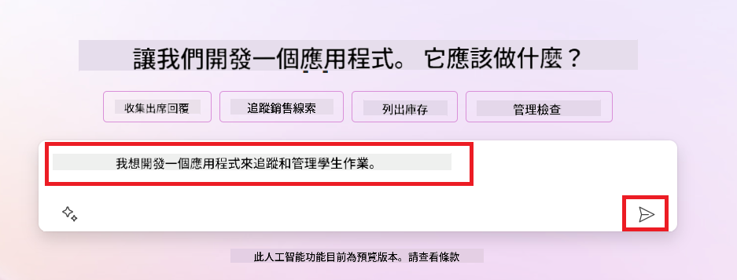

1. AI Copilot 會建議一個 Dataverse 資料表，包含你需要儲存追蹤資料的欄位和一些範例資料。你可以透過 AI Copilot 助手功能，以對話方式自訂資料表以符合需求。

   > **重要**：Dataverse 是 Power Platform 的底層資料平台。它是一個低代碼資料平台，用於儲存應用程式資料。Dataverse 是一項完全託管的服務，安全地將資料存放在 Microsoft 雲端，並在你的 Power Platform 環境中配置。它內建資料治理功能，如資料分類、資料血緣、細粒度存取控制等。你可以在[這裡](https://docs.microsoft.com/powerapps/maker/data-platform/data-platform-intro?WT.mc_id=academic-109639-somelezediko)了解更多關於 Dataverse 的資訊。

   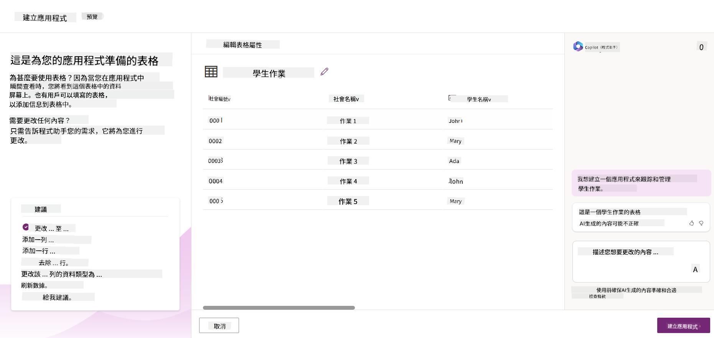

1. 教育工作者想寄送電子郵件給已提交作業的學生，讓他們了解作業進度。你可以用 Copilot 新增一個欄位來儲存學生電子郵件。例如，你可以使用以下提示新增欄位：**_我想新增一個欄位來儲存學生電子郵件_**。點擊 **Send** 按鈕將提示發送給 AI Copilot。

1. AI Copilot 會產生新欄位，你可以再依需求自訂欄位。

1. 完成資料表後，點擊 **Create app** 按鈕建立應用程式。

1. AI Copilot 會根據你的描述產生響應式 Canvas 應用程式。你可以再依需求自訂應用程式。

1. 為了讓教育工作者能寄送電子郵件給學生，你可以用 Copilot 新增一個畫面。例如，你可以使用以下提示新增畫面：**_我想新增一個畫面用來寄送電子郵件給學生_**。點擊 **Send** 按鈕將提示發送給 AI Copilot。

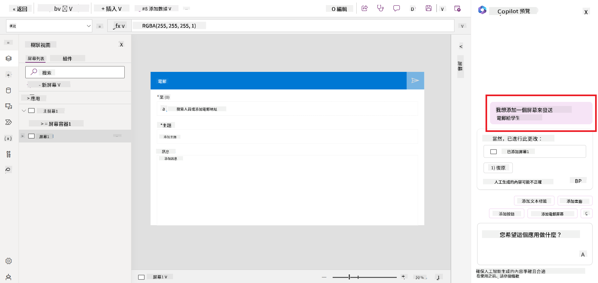

1. AI Copilot 會產生新畫面，你可以再依需求自訂畫面。

1. 完成應用程式後，點擊 **Save** 按鈕儲存應用程式。

1. 若要與教育工作者分享應用程式，點擊 **Share** 按鈕，再次點擊 **Share**，輸入他們的電子郵件地址即可分享。

> **你的作業**：你剛建立的應用程式是個良好起點，但仍有改進空間。使用電子郵件功能時，教育工作者只能手動輸入學生電子郵件來寄信。你能否利用 Copilot 建立一個自動化流程，讓教育工作者在學生提交作業時自動寄送電子郵件？提示是：用正確的提示，你可以在 Power Automate 中使用 Copilot 來建立此自動化。

### 為我們的新創公司建立發票資訊資料表

我們新創公司的財務團隊一直難以追蹤發票。他們過去用試算表追蹤發票，但隨著發票數量增加，管理變得困難。他們請你建立一個資料表，幫助儲存、追蹤和管理收到的發票資訊。此資料表將用於建立自動化流程，擷取所有發票資訊並存入資料表。資料表也應讓財務團隊查看已付款和未付款的發票。

Power Platform 有一個底層資料平台叫做 Dataverse，讓你能儲存應用程式和解決方案的資料。Dataverse 提供低代碼資料平台來存放應用程式資料。它是一項完全託管的服務，安全地將資料存放在 Microsoft 雲端，並在你的 Power Platform 環境中配置。它內建資料治理功能，如資料分類、資料血緣、細粒度存取控制等。你可以在[這裡](https://docs.microsoft.com/powerapps/maker/data-platform/data-platform-intro?WT.mc_id=academic-109639-somelezediko)了解更多關於 Dataverse 的資訊。

為什麼我們的新創公司要使用 Dataverse？Dataverse 中的標準和自訂資料表提供安全且基於雲端的資料儲存選項。資料表讓你能儲存不同類型的資料，類似於在 Excel 活頁簿中使用多個工作表。你可以用資料表來儲存特定於組織或業務需求的資料。我們的新創公司使用 Dataverse 可獲得的好處包括但不限於：
- **易於管理**：元資料和數據都儲存在雲端，無需擔心它們的儲存或管理細節。你可以專注於構建你的應用程式和解決方案。

- **安全**：Dataverse 提供安全且基於雲端的數據儲存選項。你可以透過基於角色的安全性控制誰可以存取表格中的數據以及他們如何存取。

- **豐富的元資料**：資料類型和關聯可直接在 Power Apps 中使用。

- **邏輯與驗證**：你可以使用商業規則、計算欄位和驗證規則來強制執行業務邏輯並維持數據準確性。

現在你已經了解 Dataverse 是什麼以及為什麼要使用它，讓我們看看如何使用 Copilot 在 Dataverse 中建立一個表格，以滿足我們財務團隊的需求。

> **Note** ：你將在下一節使用此表格來建立一個自動化流程，提取所有發票資訊並將其儲存在表格中。

使用 Copilot 在 Dataverse 中建立表格，請依照以下步驟：

1. 前往 [Power Apps](https://make.powerapps.com?WT.mc_id=academic-105485-koreyst) 首頁。

2. 在左側導覽列中選擇 **Tables**，然後點擊 **Describe the new Table**。

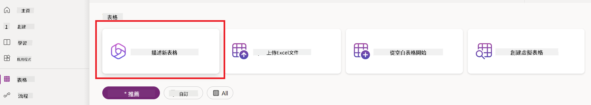

3. 在 **Describe the new Table** 頁面，使用文字區描述你想建立的表格。例如，**_我想建立一個用來儲存發票資訊的表格_**。點擊 **Send** 按鈕將提示發送給 AI Copilot。

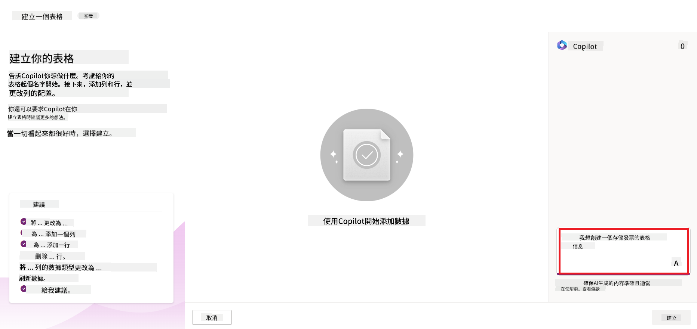

4. AI Copilot 會建議一個 Dataverse 表格，包含你需要追蹤的欄位和一些範例資料。你可以透過 AI Copilot 的對話式輔助功能，依步驟自訂表格以符合需求。

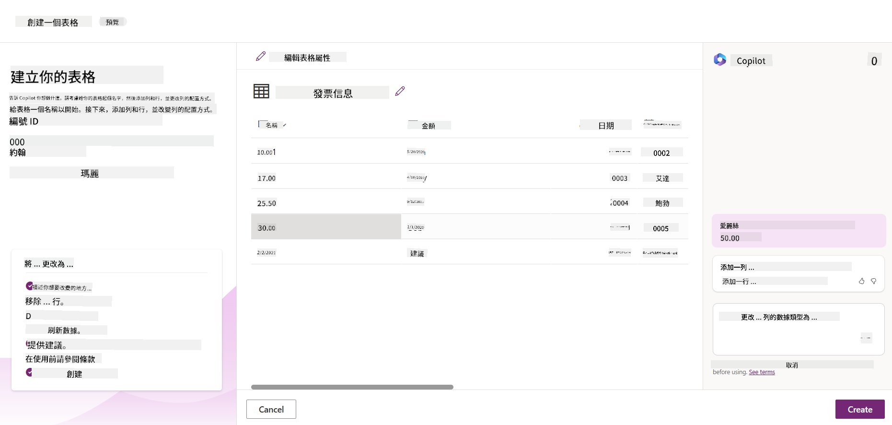

5. 財務團隊想要寄電子郵件給供應商，更新他們發票的當前狀態。你可以使用 Copilot 為表格新增一個欄位來儲存供應商電子郵件。例如，你可以使用以下提示新增欄位：**_我想新增一個欄位來儲存供應商電子郵件_**。點擊 **Send** 按鈕將提示發送給 AI Copilot。

6. AI Copilot 會產生一個新欄位，然後你可以自訂該欄位以符合需求。

7. 完成表格後，點擊 **Create** 按鈕建立表格。

## Power Platform 中的 AI 模型與 AI Builder

AI Builder 是 Power Platform 中的低程式碼 AI 功能，讓你能使用 AI 模型來協助自動化流程和預測結果。透過 AI Builder，你可以將 AI 整合到連接 Dataverse 或各種雲端資料來源（如 SharePoint、OneDrive 或 Azure）的應用程式和流程中。

## 預建 AI 模型與自訂 AI 模型

AI Builder 提供兩種 AI 模型：預建 AI 模型和自訂 AI 模型。預建 AI 模型是由微軟訓練並在 Power Platform 中可直接使用的模型，幫助你在不需自行收集資料、建立、訓練及發佈模型的情況下，為應用程式和流程加入智慧功能。你可以使用這些模型來自動化流程和預測結果。

Power Platform 中部分可用的預建 AI 模型包括：

- **關鍵詞擷取**：從文字中擷取關鍵詞。
- **語言偵測**：偵測文字的語言。
- **情感分析**：判斷文字的正面、負面、中立或混合情感。
- **名片辨識**：從名片中擷取資訊。
- **文字辨識**：從圖片中擷取文字。
- **物件偵測**：偵測並擷取圖片中的物件。
- **文件處理**：從表單中擷取資訊。
- **發票處理**：從發票中擷取資訊。

使用自訂 AI 模型，你可以將自己的模型帶入 AI Builder，使其像任何 AI Builder 自訂模型一樣運作，並使用自己的資料訓練模型。這些模型可用於 Power Apps 和 Power Automate 中自動化流程和預測結果。使用自訂模型時會有一些限制，詳情請參閱這些[限制](https://learn.microsoft.com/ai-builder/byo-model#limitations?WT.mc_id=academic-105485-koreyst)。

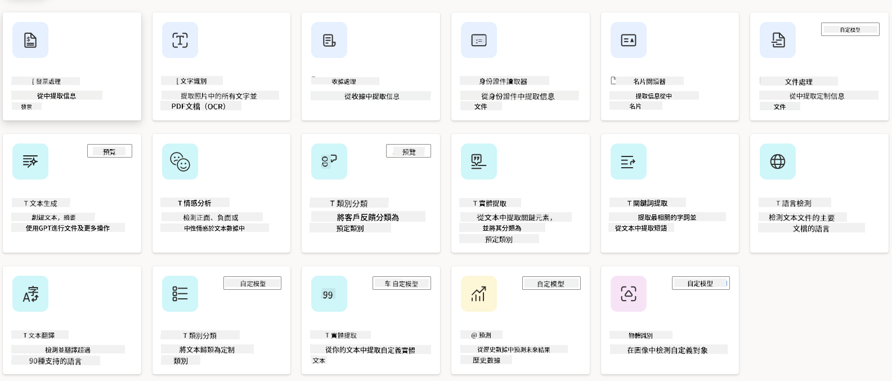

## 作業 #2 - 為我們的初創公司建立發票處理流程

財務團隊一直在努力處理發票。他們一直使用試算表來追蹤發票，但隨著發票數量增加，管理變得困難。他們請你建立一個工作流程，利用 AI 協助處理發票。該工作流程應能從發票中擷取資訊並將其儲存在 Dataverse 表格中，並且能將擷取的資訊以電子郵件寄給財務團隊。

現在你已了解 AI Builder 是什麼以及為什麼要使用它，讓我們看看如何使用先前介紹的 AI Builder 中的發票處理 AI 模型，建立一個幫助財務團隊處理發票的工作流程。

使用 AI Builder 中的發票處理 AI 模型建立幫助財務團隊處理發票的工作流程，請依照以下步驟：

1. 前往 [Power Automate](https://make.powerautomate.com?WT.mc_id=academic-105485-koreyst) 首頁。

2. 在首頁的文字區描述你想建立的工作流程。例如，**_當發票到達我的郵箱時處理該發票_**。點擊 **Send** 按鈕將提示發送給 AI Copilot。

   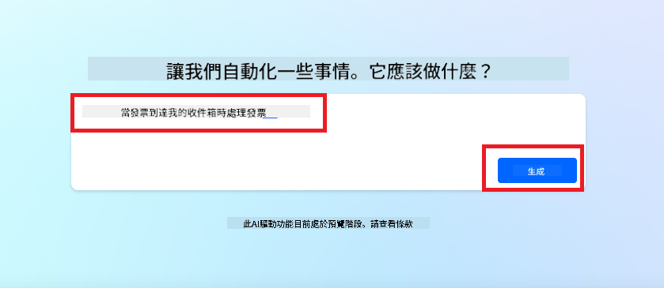

3. AI Copilot 會建議你完成任務所需的動作。你可以點擊 **Next** 按鈕繼續下一步。

4. 下一步，Power Automate 會提示你設定流程所需的連接。完成後，點擊 **Create flow** 按鈕建立流程。

5. AI Copilot 會產生一個流程，你可以自訂該流程以符合需求。

6. 更新流程的觸發條件，將 **Folder** 設定為存放發票的資料夾。例如，你可以設定為 **Inbox**。點擊 **Show advanced options**，將 **Only with Attachments** 設為 **Yes**。這樣可確保流程只在收到帶有附件的郵件時執行。

7. 從流程中移除以下動作：**HTML to text**、**Compose**、**Compose 2**、**Compose 3** 和 **Compose 4**，因為你不會使用它們。

8. 移除流程中的 **Condition** 動作，因為你不會使用它。流程應該看起來像下方截圖：

   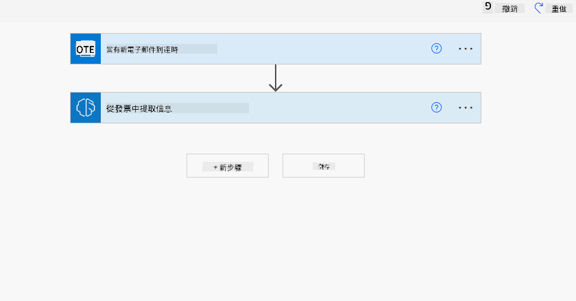

9. 點擊 **Add an action** 按鈕，搜尋 **Dataverse**，選擇 **Add a new row** 動作。

10. 在 **Extract Information from invoices** 動作中，將 **Invoice File** 設定為郵件中的 **Attachment Content**。這樣流程就會從發票附件中擷取資訊。

11. 選擇你先前建立的 **Table**，例如 **Invoice Information** 表格。從前一個動作中選擇動態內容，填入以下欄位：

    - ID
    - Amount
    - Date
    - Name
    - Status - 將 **Status** 設為 **Pending**。
    - Supplier Email - 使用 **When a new email arrives** 觸發器中的 **From** 動態內容。

    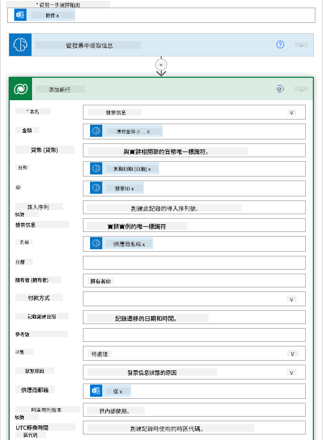

12. 完成流程後，點擊 **Save** 按鈕儲存流程。你可以透過寄送帶有發票的郵件到觸發器指定的資料夾來測試流程。

> **你的作業**：你剛建立的流程是一個良好的開始，接下來你需要思考如何建立一個自動化流程，讓財務團隊能夠寄電子郵件給供應商，更新他們發票的當前狀態。提示：流程必須在發票狀態變更時執行。

## 在 Power Automate 中使用文字生成 AI 模型

AI Builder 中的 Create Text with GPT AI 模型能根據提示生成文字，並由 Microsoft Azure OpenAI 服務提供技術支援。透過此功能，你可以將 GPT（生成式預訓練轉換器）技術整合到你的應用程式和流程中，打造各種自動化流程和智慧應用。

GPT 模型經過大量資料的訓練，能在接收到提示時產生接近人類語言的文字。結合工作流程自動化，像 GPT 這樣的 AI 模型可用來簡化和自動化多種任務。

例如，你可以建立流程自動生成各種用途的文字，如電子郵件草稿、產品描述等。你也可以使用此模型為聊天機器人和客服應用程式生成文字，協助客服人員有效且迅速地回應客戶查詢。

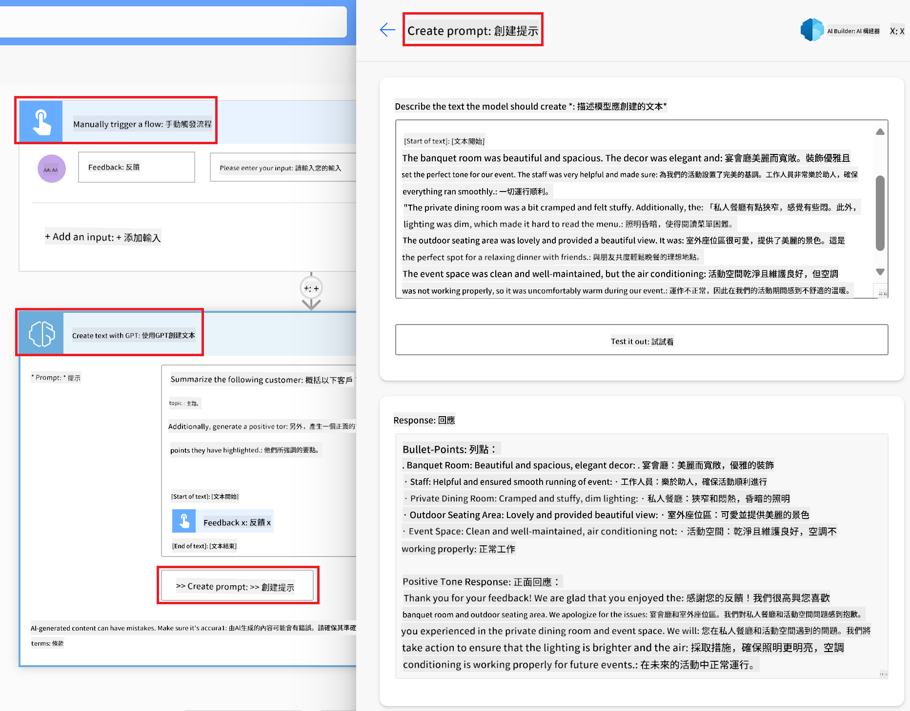

想了解如何在 Power Automate 中使用此 AI 模型，請參考 [Add intelligence with AI Builder and GPT](https://learn.microsoft.com/training/modules/ai-builder-text-generation/?WT.mc_id=academic-109639-somelezediko) 課程。

## 做得好！繼續學習

完成本課程後，請查看我們的 [Generative AI Learning collection](https://aka.ms/genai-collection?WT.mc_id=academic-105485-koreyst)，持續提升你的生成式 AI 知識！

接著前往第 11 課，我們將探討如何[整合生成式 AI 與 Function Calling](../11-integrating-with-function-calling/README.md?WT.mc_id=academic-105485-koreyst)！

**免責聲明**：  
本文件乃使用 AI 翻譯服務 [Co-op Translator](https://github.com/Azure/co-op-translator) 進行翻譯。雖然我們致力於確保準確性，但請注意，自動翻譯可能包含錯誤或不準確之處。原始文件的母語版本應被視為權威來源。對於重要資訊，建議採用專業人工翻譯。我們不對因使用本翻譯而引起的任何誤解或誤釋承擔責任。