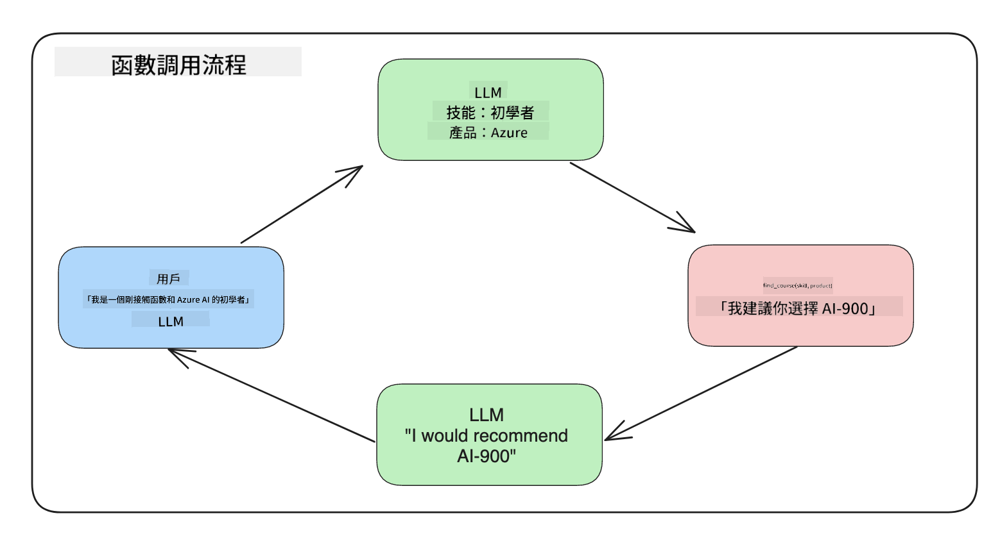
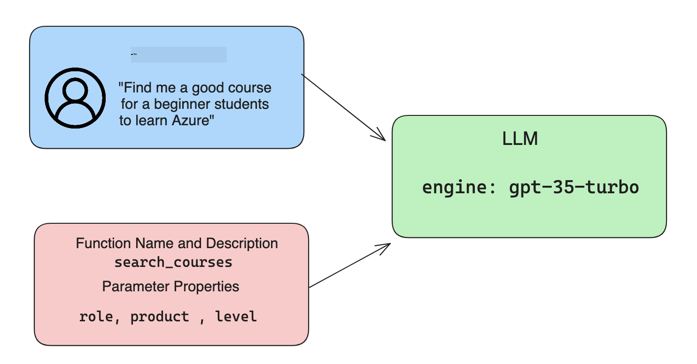

<!--
CO_OP_TRANSLATOR_METADATA:
{
  "original_hash": "77a48a201447be19aa7560706d6f93a0",
  "translation_date": "2025-07-09T14:25:55+00:00",
  "source_file": "11-integrating-with-function-calling/README.md",
  "language_code": "hk"
}
-->
# 與 function calling 整合

[](https://aka.ms/gen-ai-lesson11-gh?WT.mc_id=academic-105485-koreyst)

到目前為止，你已經在之前的課程中學到不少東西。不過，我們還可以進一步改進。有些問題我們可以著手解決，例如如何取得更一致的回應格式，讓後續處理回應時更方便。此外，我們也可能想加入來自其他來源的資料，進一步豐富我們的應用程式。

以上提到的問題，就是本章節想要解決的重點。

## 介紹

本課程將涵蓋：

- 解釋什麼是 function calling 及其應用場景。
- 使用 Azure OpenAI 建立 function call。
- 如何將 function call 整合到應用程式中。

## 學習目標

完成本課程後，你將能夠：

- 解釋使用 function calling 的目的。
- 使用 Azure OpenAI 服務設定 Function Call。
- 為你的應用場景設計有效的 function calls。

## 情境：用 functions 改善我們的聊天機器人

本課程中，我們想為教育新創公司打造一個功能，讓使用者能透過聊天機器人尋找技術課程。我們會根據使用者的技能水平、目前職務和感興趣的技術推薦合適的課程。

為了完成這個情境，我們會結合以下技術：

- 使用 `Azure OpenAI` 為使用者建立聊天體驗。
- 使用 `Microsoft Learn Catalog API` 幫助使用者根據需求尋找課程。
- 使用 `Function Calling` 將使用者的查詢傳送到函式，進行 API 請求。

首先，讓我們看看為什麼我們會想使用 function calling：

## 為什麼要使用 Function Calling

在 function calling 出現之前，LLM 的回應是非結構化且不一致的。開發者必須撰寫複雜的驗證程式碼，才能處理各種不同的回應變化。使用者也無法直接獲得像「斯德哥爾摩現在的天氣如何？」這類問題的答案，因為模型的知識僅限於訓練時的資料時間點。

Function Calling 是 Azure OpenAI 服務的一項功能，用來克服以下限制：

- **一致的回應格式**。如果我們能更好地控制回應格式，就能更輕鬆地將回應整合到其他系統中。
- **外部資料**。能夠在聊天情境中使用應用程式其他來源的資料。

## 透過情境說明問題

> 建議你使用[附帶的 notebook](../../../11-integrating-with-function-calling/python/aoai-assignment.ipynb)來執行以下情境。當然你也可以直接閱讀，我們會示範一個 function 可以幫助解決的問題。

讓我們看一個說明回應格式問題的範例：

假設我們想建立一個學生資料庫，以便推薦合適的課程。以下有兩個學生描述，資料內容非常相似。

1. 建立與 Azure OpenAI 資源的連線：

   ```python
   import os
   import json
   from openai import AzureOpenAI
   from dotenv import load_dotenv
   load_dotenv()

   client = AzureOpenAI(
   api_key=os.environ['AZURE_OPENAI_API_KEY'],  # this is also the default, it can be omitted
   api_version = "2023-07-01-preview"
   )

   deployment=os.environ['AZURE_OPENAI_DEPLOYMENT']
   ```

   以下是一些 Python 程式碼，用來設定與 Azure OpenAI 的連線，包括 `api_type`、`api_base`、`api_version` 和 `api_key`。

1. 使用變數 `student_1_description` 和 `student_2_description` 建立兩個學生描述。

   ```python
   student_1_description="Emily Johnson is a sophomore majoring in computer science at Duke University. She has a 3.7 GPA. Emily is an active member of the university's Chess Club and Debate Team. She hopes to pursue a career in software engineering after graduating."

   student_2_description = "Michael Lee is a sophomore majoring in computer science at Stanford University. He has a 3.8 GPA. Michael is known for his programming skills and is an active member of the university's Robotics Club. He hopes to pursue a career in artificial intelligence after finishing his studies."
   ```

   我們想將上述學生描述傳送給 LLM 解析。這些資料日後可以用在應用程式中，或傳送到 API，或存入資料庫。

1. 建立兩個相同的提示，指示 LLM 我們想要的資訊：

   ```python
   prompt1 = f'''
   Please extract the following information from the given text and return it as a JSON object:

   name
   major
   school
   grades
   club

   This is the body of text to extract the information from:
   {student_1_description}
   '''

   prompt2 = f'''
   Please extract the following information from the given text and return it as a JSON object:

   name
   major
   school
   grades
   club

   This is the body of text to extract the information from:
   {student_2_description}
   '''
   ```

   上述提示指示 LLM 擷取資訊並以 JSON 格式回傳。

1. 設定好提示和 Azure OpenAI 連線後，我們使用 `openai.ChatCompletion` 將提示傳給 LLM。我們將提示存入 `messages` 變數，並將角色設定為 `user`，模擬使用者向聊天機器人發送訊息。

   ```python
   # response from prompt one
   openai_response1 = client.chat.completions.create(
   model=deployment,
   messages = [{'role': 'user', 'content': prompt1}]
   )
   openai_response1.choices[0].message.content

   # response from prompt two
   openai_response2 = client.chat.completions.create(
   model=deployment,
   messages = [{'role': 'user', 'content': prompt2}]
   )
   openai_response2.choices[0].message.content
   ```

現在我們可以將兩個請求都送給 LLM，並透過 `openai_response1['choices'][0]['message']['content']` 來檢視回應。

1. 最後，我們可以呼叫 `json.loads` 將回應轉成 JSON 格式：

   ```python
   # Loading the response as a JSON object
   json_response1 = json.loads(openai_response1.choices[0].message.content)
   json_response1
   ```

   回應 1：

   ```json
   {
     "name": "Emily Johnson",
     "major": "computer science",
     "school": "Duke University",
     "grades": "3.7",
     "club": "Chess Club"
   }
   ```

   回應 2：

   ```json
   {
     "name": "Michael Lee",
     "major": "computer science",
     "school": "Stanford University",
     "grades": "3.8 GPA",
     "club": "Robotics Club"
   }
   ```

   雖然提示相同且描述相似，但我們看到 `Grades` 屬性的格式不一致，有時是 `3.7`，有時是 `3.7 GPA`。

   這是因為 LLM 接收的是非結構化的文字提示，回傳的也是非結構化資料。我們需要一個結構化格式，才能確定在儲存或使用資料時的預期。

那麼，我們要如何解決格式問題呢？透過 function calling，我們可以確保收到結構化的資料。使用 function calling 時，LLM 並不會真正呼叫或執行函式，而是依照我們建立的結構來回應。接著，我們根據這些結構化回應，決定在應用程式中要執行哪個函式。



接著，我們可以將函式回傳的結果再送回給 LLM，LLM 會用自然語言回應使用者的查詢。

## 使用 function calls 的應用場景

function calls 可以在許多不同場景中提升你的應用程式，例如：

- **呼叫外部工具**。聊天機器人擅長回答使用者問題。透過 function calling，聊天機器人可以根據使用者訊息執行特定任務。例如，學生可以請聊天機器人「寄封信給我的講師，說我需要更多這科目的協助」，這時會呼叫 `send_email(to: string, body: string)` 函式。

- **建立 API 或資料庫查詢**。使用者可以用自然語言查詢資訊，並轉換成格式化的查詢或 API 請求。例如，老師詢問「誰完成了最後一個作業？」就可以呼叫 `get_completed(student_name: string, assignment: int, current_status: string)` 函式。

- **建立結構化資料**。使用者可以將一段文字或 CSV 交給 LLM 擷取重要資訊。例如，學生可以將維基百科關於和平協議的文章轉成 AI 單字卡，這可以透過 `get_important_facts(agreement_name: string, date_signed: string, parties_involved: list)` 函式完成。

## 建立你的第一個 Function Call

建立 function call 的流程包含三個主要步驟：

1. 使用包含函式清單和使用者訊息的 Chat Completions API 呼叫。
2. 讀取模型回應以執行動作，例如執行函式或 API 呼叫。
3. 使用函式回應，再次呼叫 Chat Completions API，利用該資訊產生對使用者的回應。



### 步驟 1 - 建立訊息

第一步是建立使用者訊息。這可以動態從文字輸入取得，也可以直接指定值。如果你是第一次使用 Chat Completions API，需要定義訊息的 `role` 和 `content`。

`role` 可以是 `system`（建立規則）、`assistant`（模型）或 `user`（最終使用者）。在 function calling 中，我們會將其設定為 `user`，並給出範例問題。

```python
messages= [ {"role": "user", "content": "Find me a good course for a beginner student to learn Azure."} ]
```

透過指定不同角色，LLM 能清楚知道是系統還是使用者在說話，有助於建立對話歷史，讓 LLM 能基於此進行回應。

### 步驟 2 - 建立函式

接著，我們會定義一個函式及其參數。這裡只用一個函式 `search_courses`，但你也可以建立多個函式。

> **重要**：函式會包含在傳給 LLM 的系統訊息中，會佔用你可用的 token 數量。

以下我們將函式建立成陣列，每個項目是一個函式，包含 `name`、`description` 和 `parameters` 屬性：

```python
functions = [
   {
      "name":"search_courses",
      "description":"Retrieves courses from the search index based on the parameters provided",
      "parameters":{
         "type":"object",
         "properties":{
            "role":{
               "type":"string",
               "description":"The role of the learner (i.e. developer, data scientist, student, etc.)"
            },
            "product":{
               "type":"string",
               "description":"The product that the lesson is covering (i.e. Azure, Power BI, etc.)"
            },
            "level":{
               "type":"string",
               "description":"The level of experience the learner has prior to taking the course (i.e. beginner, intermediate, advanced)"
            }
         },
         "required":[
            "role"
         ]
      }
   }
]
```

以下是對每個函式屬性的詳細說明：

- `name` - 想要呼叫的函式名稱。
- `description` - 函式的功能描述，這裡要具體且清楚。
- `parameters` - 模型在回應中要產生的值和格式清單。`parameters` 陣列包含多個項目，每個項目有以下屬性：
  1. `type` - 屬性資料型態。
  2. `properties` - 模型會用於回應的具體值清單
     1. `name` - 屬性名稱，模型會在格式化回應中使用，例如 `product`。
     2. `type` - 屬性資料型態，例如 `string`。
     3. `description` - 屬性說明。

還有一個可選屬性 `required`，表示函式呼叫時必須提供的屬性。

### 步驟 3 - 執行函式呼叫

定義函式後，我們需要在呼叫 Chat Completion API 時包含它們。做法是將 `functions` 加入請求中，例如 `functions=functions`。

也可以設定 `function_call` 為 `auto`，讓 LLM 根據使用者訊息決定要呼叫哪個函式，而非由我們指定。

以下程式碼示範呼叫 `ChatCompletion.create`，注意我們設定了 `functions=functions` 和 `function_call="auto"`，讓 LLM 自行決定何時呼叫函式：

```python
response = client.chat.completions.create(model=deployment,
                                        messages=messages,
                                        functions=functions,
                                        function_call="auto")

print(response.choices[0].message)
```

回應看起來像這樣：

```json
{
  "role": "assistant",
  "function_call": {
    "name": "search_courses",
    "arguments": "{\n  \"role\": \"student\",\n  \"product\": \"Azure\",\n  \"level\": \"beginner\"\n}"
  }
}
```

我們可以看到函式 `search_courses` 被呼叫了，並帶入了哪些參數，這些都列在 JSON 回應的 `arguments` 屬性中。

LLM 能找到符合函式參數的資料，是因為它從傳給 `messages` 參數的值中擷取了資訊。以下是 `messages` 的內容提醒：

```python
messages= [ {"role": "user", "content": "Find me a good course for a beginner student to learn Azure."} ]
```

如你所見，`student`、`Azure` 和 `beginner` 從 `messages` 中被擷取出來，並作為函式輸入。這種用法不僅能從提示中擷取資訊，也能為 LLM 提供結構，並實現可重複使用的功能。

接下來，我們要看看如何在應用程式中使用這個功能。

## 將 Function Calls 整合到應用程式中

在測試過 LLM 的格式化回應後，我們可以將它整合到應用程式中。

### 管理流程

要整合到應用程式，我們採取以下步驟：

1. 先呼叫 OpenAI 服務，並將訊息存入變數 `response_message`。

   ```python
   response_message = response.choices[0].message
   ```

1. 接著定義一個函式，呼叫 Microsoft Learn API 取得課程清單：

   ```python
   import requests

   def search_courses(role, product, level):
     url = "https://learn.microsoft.com/api/catalog/"
     params = {
        "role": role,
        "product": product,
        "level": level
     }
     response = requests.get(url, params=params)
     modules = response.json()["modules"]
     results = []
     for module in modules[:5]:
        title = module["title"]
        url = module["url"]
        results.append({"title": title, "url": url})
     return str(results)
   ```

   注意我們現在建立了一個對應於 `functions` 變數中函式名稱的 Python 函式，並且實際呼叫外部 API 取得所需資料。這裡是呼叫 Microsoft Learn API 搜尋訓練模組。

好，我們建立了 `functions` 變數和對應的 Python 函式，接下來要怎麼告訴 LLM 兩者的對應關係，讓 Python 函式被呼叫呢？

1. 要判斷是否需要呼叫 Python 函式，我們要檢查 LLM 回應中是否包含 `function_call`，並呼叫指定的函式。以下是檢查方式：

   ```python
   # Check if the model wants to call a function
   if response_message.function_call.name:
    print("Recommended Function call:")
    print(response_message.function_call.name)
    print()

    # Call the function.
    function_name = response_message.function_call.name

    available_functions = {
            "search_courses": search_courses,
    }
    function_to_call = available_functions[function_name]

    function_args = json.loads(response_message.function_call.arguments)
    function_response = function_to_call(**function_args)

    print("Output of function call:")
    print(function_response)
    print(type(function_response))


    # Add the assistant response and function response to the messages
    messages.append( # adding assistant response to messages
        {
            "role": response_message.role,
            "function_call": {
                "name": function_name,
                "arguments": response_message.function_call.arguments,
            },
            "content": None
        }
    )
    messages.append( # adding function response to messages
        {
            "role": "function",
            "name": function_name,
            "content":function_response,
        }
    )
   ```

   這三行程式碼確保我們擷取函式名稱、參數並執行呼叫：

   ```python
   function_to_call = available_functions[function_name]

   function_args = json.loads(response_message.function_call.arguments)
   function_response = function_to_call(**function_args)
   ```

   以下是執行程式後的輸出：

   **輸出**

   ```Recommended Function call:
   {
     "name": "search_courses",
     "arguments": "{\n  \"role\": \"student\",\n  \"product\": \"Azure\",\n  \"level\": \"beginner\"\n}"
   }

   Output of function call:
   [{'title': 'Describe concepts of cryptography', 'url': 'https://learn.microsoft.com/training/modules/describe-concepts-of-cryptography/?
   WT.mc_id=api_CatalogApi'}, {'title': 'Introduction to audio classification with TensorFlow', 'url': 'https://learn.microsoft.com/en-
   us/training/modules/intro-audio-classification-tensorflow/?WT.mc_id=api_CatalogApi'}, {'title': 'Design a Performant Data Model in Azure SQL
   Database with Azure Data Studio', 'url': 'https://learn.microsoft.com/training/modules/design-a-data-model-with-ads/?
   WT.mc_id=api_CatalogApi'}, {'title': 'Getting started with the Microsoft Cloud Adoption Framework for Azure', 'url':
   'https://learn.microsoft.com/training/modules/cloud-adoption-framework-getting-started/?WT.mc_id=api_CatalogApi'}, {'title': 'Set up the
   Rust development environment', 'url': 'https://learn.microsoft.com/training/modules/rust-set-up-environment/?WT.mc_id=api_CatalogApi'}]
   <class 'str'>
   ```

1. 現在我們將更新後的訊息 `messages` 再送給 LLM，讓它回應自然語言，而非 API JSON 格式的回應。

   ```python
   print("Messages in next request:")
   print(messages)
   print()

   second_response = client.chat.completions.create(
      messages=messages,
      model=deployment,
      function_call="auto",
      functions=functions,
      temperature=0
         )  # get a new response from GPT where it can see the function response


   print(second_response.choices[0].message)
   ```

   **輸出**

   ```python
   {
     "role": "assistant",
     "content": "I found some good courses for beginner students to learn Azure:\n\n1. [Describe concepts of cryptography] (https://learn.microsoft.com/training/modules/describe-concepts-of-cryptography/?WT.mc_id=api_CatalogApi)\n2. [Introduction to audio classification with TensorFlow](https://learn.microsoft.com/training/modules/intro-audio-classification-tensorflow/?WT.mc_id=api_CatalogApi)\n3. [Design a Performant Data Model in Azure SQL Database with Azure Data Studio](https://learn.microsoft.com/training/modules/design-a-data-model-with-ads/?WT.mc_id=api_CatalogApi)\n4. [Getting started with the Microsoft Cloud Adoption Framework for Azure](https://learn.microsoft.com/training/modules/cloud-adoption-framework-getting-started/?WT.mc_id=api_CatalogApi)\n5. [Set up the Rust development environment](https://learn.microsoft.com/training/modules/rust-set-up-environment/?WT.mc_id=api_CatalogApi)\n\nYou can click on the links to access the courses."
   }

   ```

## 作業

為了繼續學習 Azure OpenAI Function Calling，你可以嘗試：

- 增加函式的參數，幫助學習者找到更多課程。
- 建立另一個函式，收集學習者更多資訊，例如母語。
- 建立錯誤處理機制，當函式呼叫和/或 API 呼叫沒有回傳合適課程時處理。
## 做得好！繼續前進

完成本課程後，請查看我們的 [Generative AI Learning collection](https://aka.ms/genai-collection?WT.mc_id=academic-105485-koreyst)，繼續提升你的生成式 AI 知識！

前往第 12 課，我們將探討如何為 AI 應用程式設計使用者體驗（UX）[design UX for AI applications](../12-designing-ux-for-ai-applications/README.md?WT.mc_id=academic-105485-koreyst)！

**免責聲明**：  
本文件由 AI 翻譯服務 [Co-op Translator](https://github.com/Azure/co-op-translator) 進行翻譯。雖然我們致力於確保準確性，但請注意，自動翻譯可能包含錯誤或不準確之處。原始文件的母語版本應被視為權威來源。對於重要資訊，建議採用專業人工翻譯。我們不對因使用本翻譯而引起的任何誤解或誤釋承擔責任。