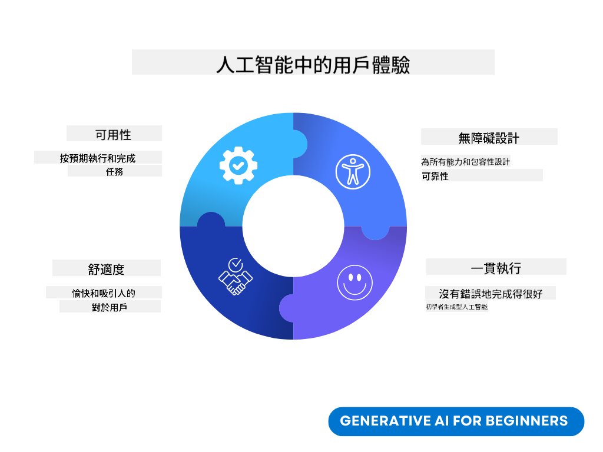
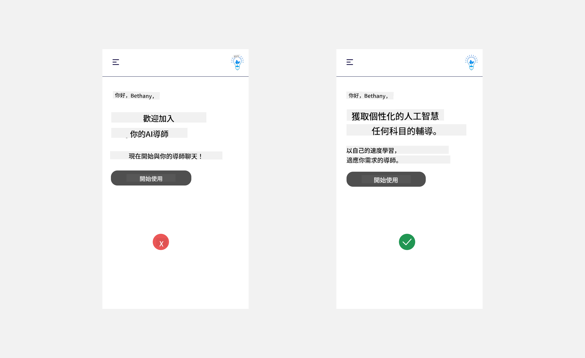
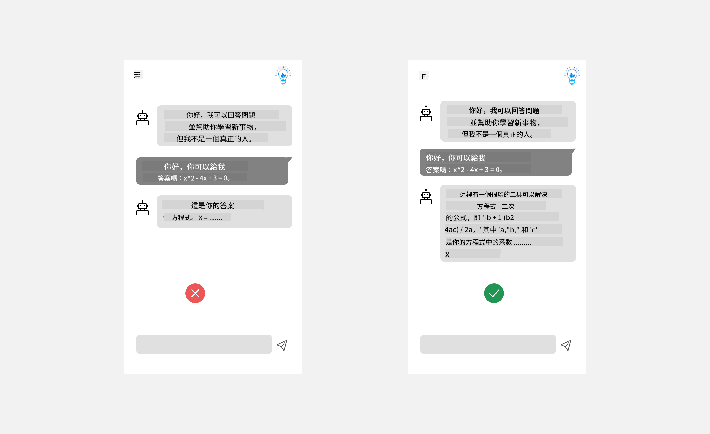
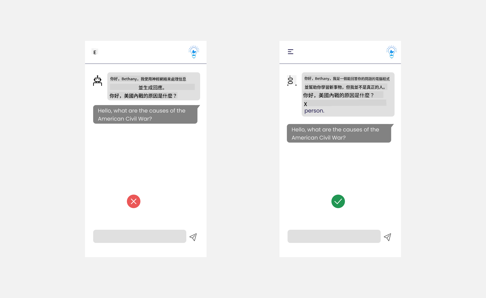
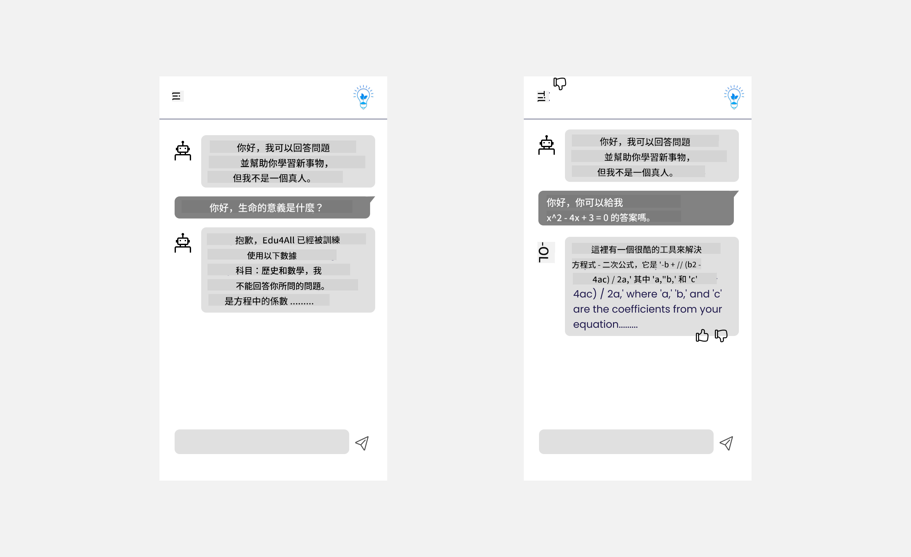

<!--
CO_OP_TRANSLATOR_METADATA:
{
  "original_hash": "ec385b41ee50579025d50cc03bfb3a25",
  "translation_date": "2025-06-25T20:13:06+00:00",
  "source_file": "12-designing-ux-for-ai-applications/README.md",
  "language_code": "hk"
}
-->
# 設計人工智能應用程式的使用者體驗

> _(點擊上方圖片觀看本課程的影片)_

使用者體驗是建立應用程式的一個非常重要的方面。使用者需要能夠以高效的方式使用你的應用程式來執行任務。高效是一回事，但你還需要設計應用程式以便所有人都能使用，使其_可及_。本章將重點關注這一領域，希望你最終設計出一個人們可以並願意使用的應用程式。

## 介紹

使用者體驗是指使用者如何與特定產品或服務互動和使用，無論是系統、工具還是設計。在開發人工智能應用程式時，開發者不僅關注確保使用者體驗有效，還關注道德。在本課程中，我們將涵蓋如何構建滿足使用者需求的人工智能應用程式。

本課程將涵蓋以下領域：

- 使用者體驗介紹和理解使用者需求
- 設計信任和透明度的人工智能應用程式
- 設計合作和反饋的人工智能應用程式

## 學習目標

學完這課後，你將能夠：

- 理解如何構建滿足使用者需求的人工智能應用程式。
- 設計促進信任和合作的人工智能應用程式。

### 前提條件

花些時間閱讀更多關於[使用者體驗和設計思維](https://learn.microsoft.com/training/modules/ux-design?WT.mc_id=academic-105485-koreyst)。

## 使用者體驗介紹和理解使用者需求

在我們虛構的教育初創公司中，我們有兩個主要使用者，教師和學生。每個使用者都有獨特的需求。以使用者為中心的設計優先考慮使用者，確保產品對其意圖的使用者是相關和有益的。

應用程式應該是**有用、可靠、可及和愉悅**的，以提供良好的使用者體驗。

### 可用性

有用意味著應用程式具有符合其預期目的的功能，例如自動化評分過程或生成複習用的閃卡。能自動化評分過程的應用程式應能夠根據預定義標準準確且高效地為學生的作品分配分數。同樣，能生成複習閃卡的應用程式應能夠根據其數據創建相關和多樣化的問題。

### 可靠性

可靠意味著應用程式能夠一致地執行其任務而不出錯。然而，人工智能和人類一樣並不完美，可能容易出錯。應用程式可能會遇到需要人工干預或更正的錯誤或意外情況。你如何處理錯誤？在本課程的最後一節中，我們將討論如何設計人工智能系統和應用程式以促進合作和反饋。

### 可及性

可及意味著擴展使用者體驗到各種能力的使用者，包括殘疾人士，確保沒有人被排除在外。通過遵循可及性指南和原則，人工智能解決方案變得更加包容、可用和有益於所有使用者。

### 愉悅

愉悅意味著應用程式使用起來令人愉快。吸引人的使用者體驗可以對使用者產生積極影響，鼓勵他們回到應用程式並增加業務收入。

並非每個挑戰都能用人工智能解決。人工智能進入以增強你的使用者體驗，無論是自動化手動任務，還是個性化使用者體驗。

## 設計信任和透明度的人工智能應用程式

在設計人工智能應用程式時，建立信任至關重要。信任確保使用者相信應用程式能夠完成工作，始終如一地交付結果，並且結果是使用者所需的。在這方面的一個風險是缺乏信任和過度信任。缺乏信任發生在使用者對人工智能系統幾乎沒有或完全沒有信任時，這導致使用者拒絕你的應用程式。過度信任發生在使用者高估人工智能系統的能力時，導致使用者過於信任人工智能系統。例如，在過度信任的情況下，教師可能不會仔細檢查一些試卷以確保評分系統正常運作。這可能導致學生獲得不公平或不準確的成績，或錯失反饋和改進的機會。

確保信任成為設計核心的兩種方法是可解釋性和控制。

### 可解釋性

當人工智能幫助做出決策，例如向未來世代傳授知識時，教師和家長了解人工智能決策的制定方式至關重要。這就是可解釋性——理解人工智能應用程式如何做出決策。設計可解釋性包括添加人工智能應用程式能做什麼的示例詳細信息。例如，系統可以使用："使用人工智能總結你的筆記以便更容易複習"，而不是"開始使用人工智能教師"。

另一個例子是人工智能如何使用使用者和個人數據。例如，擁有學生角色的使用者可能會因其角色而受到限制。人工智能可能無法揭示問題的答案，但可以幫助引導使用者思考如何解決問題。

可解釋性的最後一個關鍵部分是簡化解釋。學生和教師可能不是人工智能專家，因此應用程式能做什麼或不能做什麼的解釋應簡化且易於理解。

### 控制

生成式人工智能創造了人工智能與使用者之間的合作，例如使用者可以修改提示以獲得不同的結果。此外，一旦生成輸出，使用者應能夠修改結果，給予他們一種控制感。例如，使用Bing時，你可以根據格式、語調和長度定制你的提示。此外，你可以對輸出進行更改並修改輸出，如下所示：

Bing的另一個功能允許使用者控制應用程式，即選擇加入或退出人工智能使用的數據。對於學校應用程式，學生可能希望使用自己的筆記以及教師的資源作為複習材料。

> 在設計人工智能應用程式時，有意識地確保使用者不會過度信任並設定不切實際的期望至關重要。一種方法是創造提示和結果之間的摩擦。提醒使用者，這是人工智能而不是一個人類

## 設計合作和反饋的人工智能應用程式

如前所述，生成式人工智能創造了使用者與人工智能之間的合作。大多數互動是使用者輸入提示，人工智能生成輸出。如果輸出不正確怎麼辦？應用程式如何處理錯誤？人工智能是否指責使用者或花時間解釋錯誤？

人工智能應用程式應構建以接收和提供反饋。這不僅有助於人工智能系統改進，還建立了使用者的信任。設計中應包含反饋循環，例子可以是輸出上的簡單的讚或踩。

另一種處理方式是清楚地溝通系統的能力和限制。當使用者犯錯請求超出人工智能能力範圍的東西時，應有辦法處理這種情況，如下所示。

系統錯誤在應用程式中很常見，使用者可能需要超出人工智能範圍的信息幫助，或者應用程式可能對使用者能生成摘要的問題/科目數量有限制。例如，人工智能應用程式用有限科目（例如歷史和數學）數據訓練可能無法處理地理問題。為了減輕這種情況，人工智能系統可以給出如下回應："抱歉，我們的產品已用以下科目數據訓練.....，我無法回答你問的問題。"

人工智能應用程式並不完美，因此它們難免會犯錯。在設計應用程式時，你應確保創造空間讓使用者提供反饋和簡單易懂的錯誤處理。

## 作業

檢視你迄今構建的任何人工智能應用程式，考慮在你的應用程式中實施以下步驟：

- **愉悅：** 考慮如何讓你的應用程式更加愉悅。你是否在每個地方添加了解釋？你是否鼓勵使用者探索？你的錯誤信息如何措辭？

- **可用性：** 構建網頁應用程式。確保你的應用程式可由鼠標和鍵盤導航。

- **信任和透明度：** 不要完全信任人工智能及其輸出，考慮如何在過程中加入人類以驗證輸出。同時考慮並實施其他方法來達到信任和透明度。

- **控制：** 讓使用者控制他們提供給應用程式的數據。實施一種方式讓使用者能選擇加入和退出人工智能應用程式中的數據收集。

## 繼續學習！

完成本課程後，查看我們的[生成式人工智能學習集合](https://aka.ms/genai-collection?WT.mc_id=academic-105485-koreyst)，繼續提升你的生成式人工智能知識！

前往第13課，我們將探討如何[保護人工智能應用程式](../13-securing-ai-applications/README.md?WT.mc_id=academic-105485-koreyst)！

**免責聲明**：  
本文檔已使用AI翻譯服務[Co-op Translator](https://github.com/Azure/co-op-translator)進行翻譯。儘管我們努力確保準確性，但請注意，自動翻譯可能包含錯誤或不準確之處。應以原始語言的文件為權威來源。對於關鍵信息，建議使用專業人工翻譯。我們不對因使用此翻譯而產生的任何誤解或誤譯承擔責任。