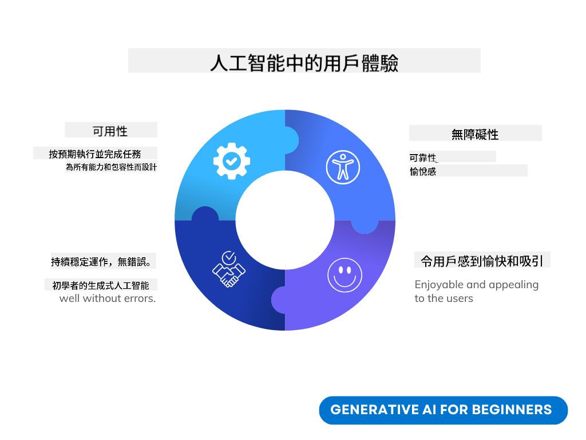
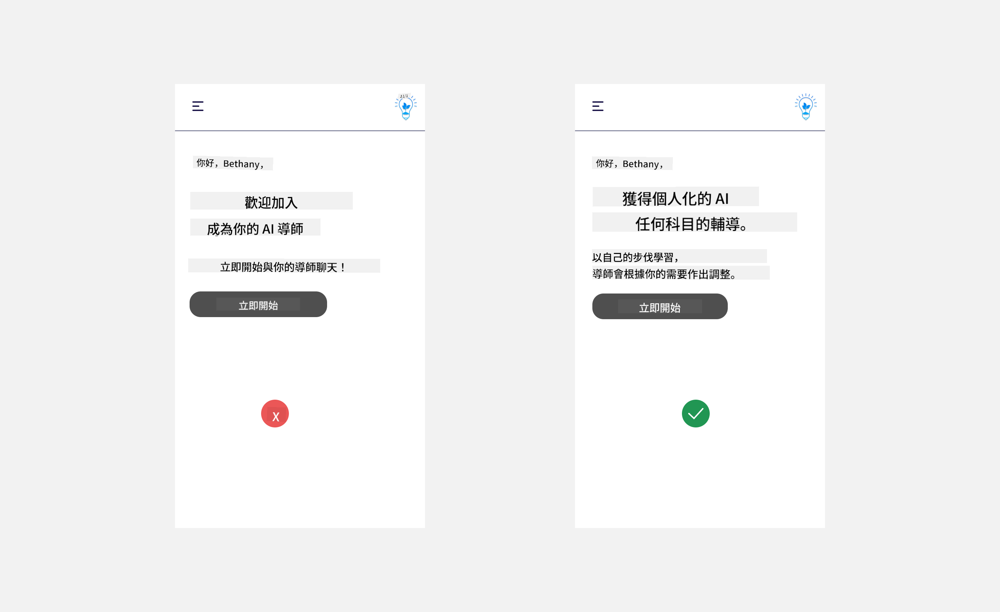
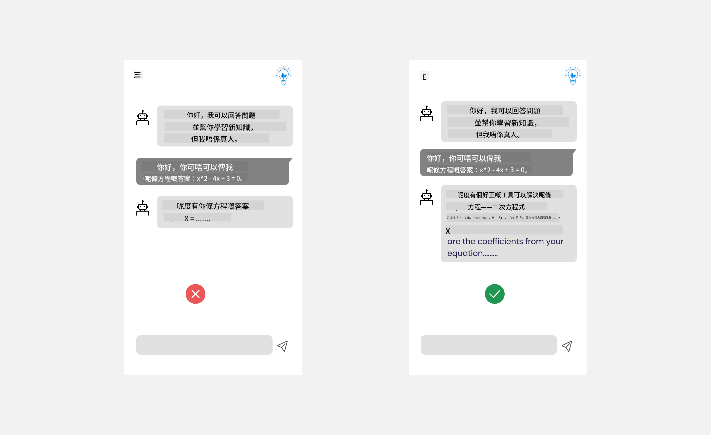
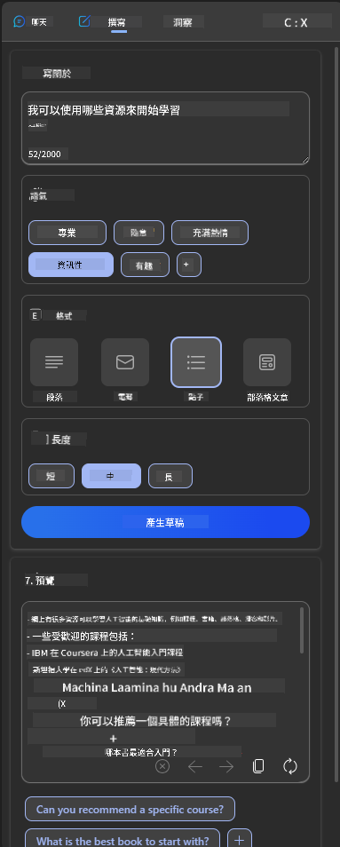

<!--
CO_OP_TRANSLATOR_METADATA:
{
  "original_hash": "747668e4c53d067369f06e9ec2e6313e",
  "translation_date": "2025-08-26T14:54:04+00:00",
  "source_file": "12-designing-ux-for-ai-applications/README.md",
  "language_code": "hk"
}
-->
# 為 AI 應用程式設計用戶體驗

> _(點擊上面圖片觀看本課堂的影片)_

用戶體驗係開發應用程式時非常重要嘅一環。用戶需要能夠有效率咁使用你嘅應用程式去完成任務。有效率固然重要，但你都要設計啲應用程式，令到所有人都可以用到，做到 _無障礙_。本章會集中講解呢方面，希望你最後可以設計到一個大家都用得開心又想用嘅應用程式。

## 簡介

用戶體驗係指用戶點樣同一個產品或服務互動同使用，無論係系統、工具定設計。開發 AI 應用程式時，開發者唔單止要確保用戶體驗有效，仲要顧及道德。本課會講解點樣建立能夠回應用戶需要嘅人工智能（AI）應用程式。

本課會涵蓋以下範疇：

- 用戶體驗簡介同了解用戶需要
- 為信任同透明度設計 AI 應用程式
- 為協作同回饋設計 AI 應用程式

## 學習目標

完成本課後，你會識得：

- 明白點樣建立符合用戶需要嘅 AI 應用程式。
- 設計能夠促進信任同協作嘅 AI 應用程式。

### 先決條件

花啲時間了解多啲 [用戶體驗同設計思維](https://learn.microsoft.com/training/modules/ux-design?WT.mc_id=academic-105485-koreyst)。

## 用戶體驗簡介同了解用戶需要

喺我哋虛構嘅教育初創公司入面，有兩個主要用戶：老師同學生。每個用戶都有自己獨特嘅需要。以用戶為中心嘅設計會優先考慮用戶，確保產品對目標用戶有用同有益。

應用程式應該要 **有用、可靠、無障礙同愉快**，先可以提供良好嘅用戶體驗。

### 易用性

有用即係應用程式嘅功能要符合佢嘅用途，例如自動批改作業或者產生溫習閃卡。一個自動批改作業嘅應用程式應該可以根據預設標準準確同有效率咁為學生評分。同樣，產生溫習閃卡嘅應用程式應該可以根據數據產生相關同多元化嘅問題。

### 可靠性

可靠即係應用程式可以穩定同無錯誤咁執行任務。不過，AI 同人一樣唔完美，都有機會出錯。應用程式可能會遇到錯誤或者預期之外嘅情況，需要人手介入或修正。點樣處理錯誤？喺本課最後一節，我哋會講解 AI 系統同應用程式點樣設計協作同回饋。

### 無障礙

無障礙即係要令唔同能力，包括有殘障人士都可以用到，確保冇人被排除在外。跟足無障礙指引同原則，AI 解決方案會更加包容、易用同對所有用戶都有益。

### 愉快

愉快即係用起上嚟開心。吸引嘅用戶體驗可以正面影響用戶，令佢哋想再用返個應用程式，亦有助提升業務收入。

唔係所有挑戰都可以用 AI 解決。AI 主要係用嚟提升用戶體驗，例如自動化手動工作，或者個人化用戶體驗。

## 為信任同透明度設計 AI 應用程式

建立信任係設計 AI 應用程式時非常關鍵。有信任，用戶先會有信心應用程式可以完成工作、持續交付結果，而且結果係用戶需要嘅。呢方面嘅風險包括唔信任同過度信任。唔信任即係用戶對 AI 系統冇乜信心，會導致用戶拒絕用你嘅應用程式。過度信任就係用戶高估 AI 系統嘅能力，太過信任 AI。例如自動批改系統，如果老師過度信任，可能唔會再檢查部分試卷，結果可能會出現唔公平或者唔準確嘅分數，錯失回饋同改進嘅機會。

要將信任放喺設計核心，有兩個方法：可解釋性同控制權。

### 可解釋性

當 AI 幫手做決定，例如教導下一代，老師同家長都要明白 AI 點樣作出決定。呢個就係可解釋性——了解 AI 應用程式點樣作決定。設計可解釋性包括加插細節，解釋 AI 點樣得出結果。用戶要知道結果係 AI 產生，而唔係人。例如，唔好話「即刻同你導師傾偈」，而係話「用 AI 導師，會根據你需要幫你以自己步伐學習」。

另一個例子係 AI 點樣用用戶同個人數據。例如，一個學生身份嘅用戶可能會有啲限制。AI 可能唔可以直接俾答案，但可以引導用戶思考點樣解決問題。

最後一個可解釋性重點係簡化解釋。學生同老師未必係 AI 專家，所以應用程式可以做咩同唔可以做咩，解釋要簡單易明。

### 控制權

生成式 AI 令 AI 同用戶之間有協作，例如用戶可以修改提示詞去得到唔同結果。當產生咗結果之後，用戶都應該可以修改結果，增加控制感。例如用 Bing 時，你可以根據格式、語氣同長度調整提示詞，亦可以修改結果，如下圖所示：

Bing 另一個俾用戶控制應用程式嘅功能係可以選擇參與或退出 AI 使用嘅數據。對於學校應用程式，學生可能想用自己嘅筆記同老師資源做溫習材料。

> 設計 AI 應用程式時，要有意識咁避免用戶過度信任，唔好對 AI 能力有不切實際期望。一個方法係喺提示詞同結果之間加啲阻力，提醒用戶，呢個係 AI 唔係真人。

## 為協作同回饋設計 AI 應用程式

如前所述，生成式 AI 令用戶同 AI 之間有協作。大部分互動都係用戶輸入提示詞，AI 產生結果。如果結果唔啱呢？應用程式點處理錯誤？AI 會唔會怪責用戶，定係會解釋錯誤原因？

AI 應用程式應該要有收集同提供回饋嘅功能。咁唔單止可以幫 AI 系統改進，仲可以建立用戶信任。設計時應該加入回饋循環，例如簡單嘅讚好或唔讚好按鈕。

另一個處理方法係清楚講明系統嘅能力同限制。如果用戶要求超出 AI 能力範圍，應該有方法處理，如下圖所示。

系統錯誤喺應用程式好常見，例如用戶需要查詢 AI 範圍以外嘅資料，或者應用程式對用戶可以產生幾多條問題/科目有限制。例如，一個只訓練咗歷史同數學資料嘅 AI 應用程式，未必可以處理地理問題。為咗解決呢個問題，AI 系統可以回應：「唔好意思，我哋產品只訓練咗以下科目嘅資料......，我未能回應你問嘅問題。」

AI 應用程式唔完美，一定會有錯。設計應用程式時，要預留空間俾用戶回饋同處理錯誤，而且要簡單易明。

## 練習

揀一個你之前做過嘅 AI 應用程式，考慮喺你嘅應用程式實踐以下步驟：

- **愉快：** 諗下點樣令你嘅應用程式用起上嚟更愉快。你有冇喺各處加解釋？有冇鼓勵用戶探索？你嘅錯誤訊息點寫？
- **易用性：** 如果係做網頁應用程式，記住要用滑鼠同鍵盤都可以操作。
- **信任同透明度：** 唔好完全信 AI 同佢嘅結果，諗下點樣加人手驗證結果。亦要考慮同實踐其他建立信任同透明度嘅方法。
- **控制權：** 俾用戶控制佢哋提供俾應用程式嘅數據。實現一個方法，令用戶可以選擇參與或退出 AI 應用程式嘅數據收集。

## 繼續學習！

完成本課後，可以睇下我哋嘅 [生成式 AI 學習資源合集](https://aka.ms/genai-collection?WT.mc_id=academic-105485-koreyst)，繼續提升你嘅生成式 AI 知識！

去到第 13 課，我哋會一齊睇下點樣 [保障 AI 應用程式安全](../13-securing-ai-applications/README.md?WT.mc_id=academic-105485-koreyst)！

---

**免責聲明**：
本文件經由 AI 翻譯服務 [Co-op Translator](https://github.com/Azure/co-op-translator) 翻譯。雖然我們致力於確保準確性，但請注意自動翻譯可能會有錯誤或不準確之處。原始語言的文件應被視為具權威性的來源。對於重要資訊，建議使用專業人工翻譯。我們不會對因使用本翻譯而產生的任何誤解或錯誤負責。