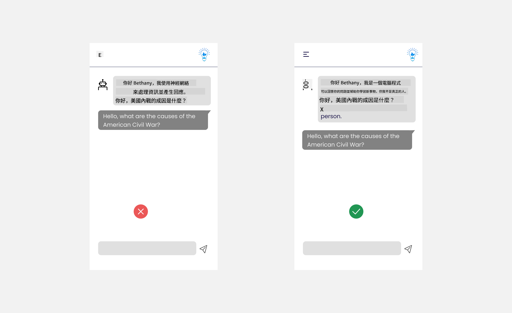

<!--
CO_OP_TRANSLATOR_METADATA:
{
  "original_hash": "78bbeed50fd4dc9fdee931f5daf98cb3",
  "translation_date": "2025-10-17T23:31:09+00:00",
  "source_file": "12-designing-ux-for-ai-applications/README.md",
  "language_code": "hk"
}
-->
# 為人工智能應用設計用戶體驗

> _(點擊上方圖片觀看本課程的視頻)_

用戶體驗是構建應用程式中非常重要的一環。用戶需要能夠高效地使用你的應用程式來完成任務。高效固然重要，但你也需要設計應用程式，使其能夠被所有人使用，從而實現_無障礙使用_。本章將聚焦於這一領域，希望最終你能設計出一款人們能夠並且願意使用的應用程式。

## 簡介

用戶體驗是指用戶如何與特定產品或服務（無論是系統、工具還是設計）進行互動和使用。在開發人工智能應用程式時，開發者不僅需要確保用戶體驗的有效性，還需要考慮其倫理性。在本課程中，我們將探討如何構建滿足用戶需求的人工智能（AI）應用程式。

本課程將涵蓋以下內容：

- 用戶體驗簡介及理解用戶需求
- 為信任和透明性設計人工智能應用程式
- 為協作和反饋設計人工智能應用程式

## 學習目標

完成本課程後，你將能夠：

- 理解如何構建滿足用戶需求的人工智能應用程式。
- 設計促進信任和協作的人工智能應用程式。

### 先修要求

花些時間閱讀更多關於[用戶體驗和設計思維](https://learn.microsoft.com/training/modules/ux-design?WT.mc_id=academic-105485-koreyst)。

## 用戶體驗簡介及理解用戶需求

在我們虛構的教育初創公司中，我們有兩類主要用戶：教師和學生。這兩類用戶各自有著獨特的需求。以用戶為中心的設計優先考慮用戶，確保產品對目標用戶是相關且有益的。

應用程式應該是**有用、可靠、無障礙且令人愉悅**的，以提供良好的用戶體驗。

### 可用性

有用意味著應用程式的功能符合其預期用途，例如自動化評分過程或生成複習用的抽認卡。一個自動化評分的應用程式應能根據預定的標準準確且高效地為學生的作業打分。同樣，一個生成複習抽認卡的應用程式應能根據其數據創建相關且多樣化的問題。

### 可靠性

可靠意味著應用程式能夠一致且無錯誤地執行其任務。然而，人工智能和人類一樣並不完美，可能會出現錯誤。應用程式可能會遇到需要人工干預或修正的錯誤或意外情況。如何處理錯誤？在本課程的最後部分，我們將探討如何設計人工智能系統和應用程式以促進協作和反饋。

### 無障礙性

無障礙性意味著將用戶體驗擴展到具有不同能力的用戶，包括殘障人士，確保沒有人被排除在外。通過遵循無障礙指南和原則，人工智能解決方案變得更加包容、可用且對所有用戶有益。

### 愉悅性

愉悅意味著應用程式使用起來令人愉快。一個吸引人的用戶體驗可以對用戶產生積極影響，鼓勵他們再次使用該應用程式，並增加業務收入。

並非所有挑戰都能通過人工智能解決。人工智能的作用是增強你的用戶體驗，例如自動化手動任務或個性化用戶體驗。

## 為信任和透明性設計人工智能應用程式

在設計人工智能應用程式時，建立信任至關重要。信任確保用戶相信應用程式能完成工作，持續提供結果，並且結果符合用戶需求。在這方面的風險是缺乏信任和過度信任。缺乏信任發生在用戶對人工智能系統幾乎沒有或完全沒有信任，這會導致用戶拒絕你的應用程式。過度信任則發生在用戶高估人工智能系統的能力，導致用戶過於信任人工智能系統。例如，在自動化評分系統中，過度信任可能導致教師不仔細檢查部分試卷，確保評分系統的準確性。這可能導致學生的分數不公平或不準確，或者錯失提供反饋和改進的機會。

確保信任成為設計核心的兩種方法是可解釋性和控制。

### 可解釋性

當人工智能幫助做出決策，例如向下一代傳授知識時，教師和家長了解人工智能如何做出決策至關重要。這就是可解釋性——理解人工智能應用程式如何做出決策。設計可解釋性包括添加細節，突出人工智能如何得出輸出。受眾必須知道輸出是由人工智能生成的，而不是人類。例如，與其說「現在開始與你的導師聊天」，不如說「使用人工智能導師，根據你的需求進行調整，幫助你以自己的節奏學習。」

另一個例子是人工智能如何使用用戶和個人數據。例如，一個具有學生角色的用戶可能會因其角色而受到限制。人工智能可能無法直接提供問題的答案，但可以幫助用戶思考如何解決問題。

可解釋性的另一個重要部分是簡化解釋。學生和教師可能不是人工智能專家，因此應用程式的功能和限制的解釋應該簡單易懂。

### 控制

生成式人工智能創造了人工智能與用戶之間的協作，例如用戶可以修改提示以獲得不同的結果。此外，一旦生成輸出，用戶應能夠修改結果，從而給予他們一定的控制感。例如，在使用 Bing 時，你可以根據格式、語氣和長度調整你的提示。此外，你可以對輸出進行修改，如下所示：

Bing 的另一個功能是允許用戶控制應用程式使用的數據。例如，學校應用程式中的學生可能希望使用自己的筆記以及教師的資源作為複習材料。

> 在設計人工智能應用程式時，故意設計是關鍵，確保用戶不會過度信任，對其能力設置不切實際的期望。一種方法是在提示和結果之間創造摩擦，提醒用戶這是人工智能而不是人類。

## 為協作和反饋設計人工智能應用程式

如前所述，生成式人工智能創造了用戶與人工智能之間的協作。大多數交互是用戶輸入提示，人工智能生成輸出。如果輸出不正確怎麼辦？如果出現錯誤，應用程式如何處理？人工智能是否會責怪用戶，還是會花時間解釋錯誤？

人工智能應用程式應該內置接收和提供反饋的功能。這不僅有助於人工智能系統改進，還能建立用戶的信任。設計中應包括反饋循環，例如可以在輸出上添加簡單的「讚」或「踩」。

另一種處理方式是清楚地傳達系統的能力和限制。如果用戶在請求超出人工智能能力範圍的內容時，也應有一種方式來處理，如下所示。

系統錯誤在應用程式中很常見，例如用戶可能需要超出人工智能範圍的信息，或者應用程式可能對用戶生成摘要的問題/主題數量有限制。例如，一個人工智能應用程式僅使用有限科目（例如歷史和數學）的數據進行訓練，可能無法處理地理相關的問題。為了減輕這種情況，人工智能系統可以給出如下回應：「抱歉，我們的產品僅使用以下科目的數據進行訓練......，我無法回答你提出的問題。」

人工智能應用程式並不完美，因此不可避免地會犯錯。在設計你的應用程式時，你應確保為用戶反饋和錯誤處理創造空間，並以簡單且易於理解的方式進行。

## 作業

檢視你迄今為止構建的任何人工智能應用程式，考慮在你的應用程式中實施以下步驟：

- **愉悅性：** 考慮如何使你的應用程式更愉悅。你是否在每個地方都添加了解釋？你是否鼓勵用戶探索？你的錯誤信息是如何表述的？

- **可用性：** 構建一個網頁應用程式。確保你的應用程式既可以用滑鼠操作，也可以用鍵盤操作。

- **信任和透明性：** 不要完全信任人工智能及其輸出，考慮如何將人類加入到過程中以驗證輸出。此外，考慮並實施其他方法來實現信任和透明性。

- **控制：** 讓用戶控制他們提供給應用程式的數據。實施一種方式，讓用戶可以選擇加入或退出人工智能應用程式的數據收集。

<!-- ## [課後測驗](../../../12-designing-ux-for-ai-applications/quiz-url) -->

## 繼續學習！

完成本課程後，查看我們的[生成式人工智能學習系列](https://aka.ms/genai-collection?WT.mc_id=academic-105485-koreyst)，繼續提升你的生成式人工智能知識！

前往第13課，我們將探討[人工智能應用程式的安全性](../13-securing-ai-applications/README.md?WT.mc_id=academic-105485-koreyst)！

---

**免責聲明**：  
此文件已使用人工智能翻譯服務 [Co-op Translator](https://github.com/Azure/co-op-translator) 進行翻譯。雖然我們致力於提供準確的翻譯，但請注意，自動翻譯可能包含錯誤或不準確之處。原始文件的母語版本應被視為權威來源。對於重要信息，建議使用專業人工翻譯。我們對因使用此翻譯而引起的任何誤解或誤釋不承擔責任。