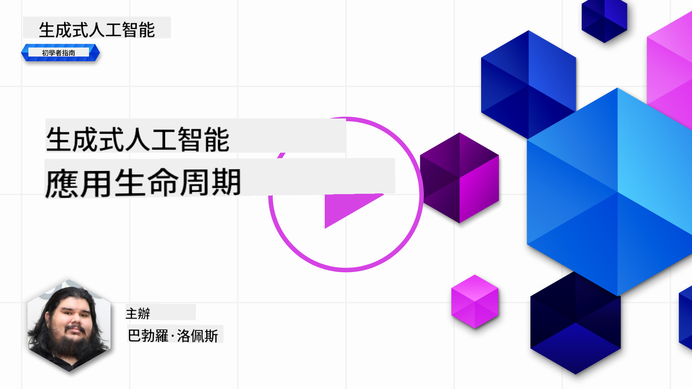
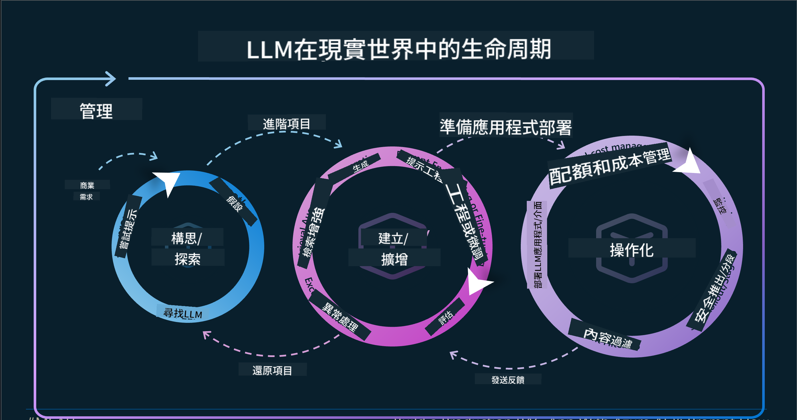
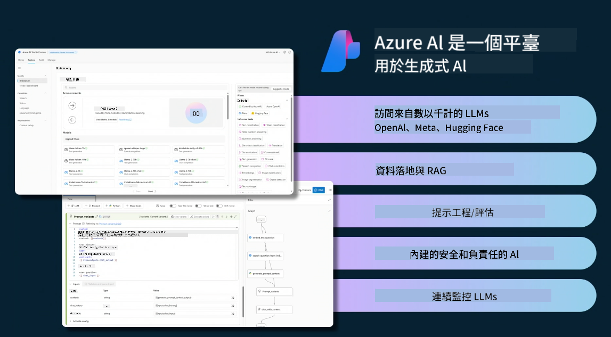
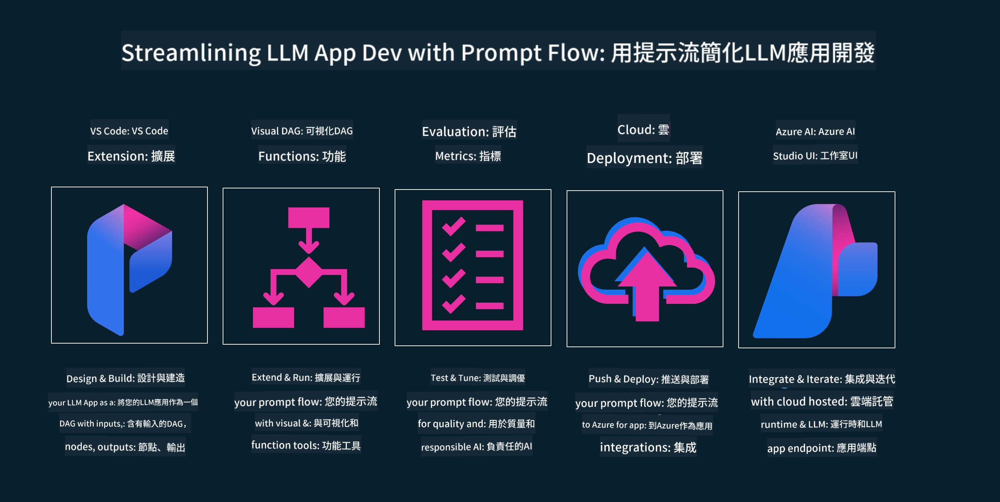

<!--
CO_OP_TRANSLATOR_METADATA:
{
  "original_hash": "27a5347a5022d5ef0a72ab029b03526a",
  "translation_date": "2025-05-19T23:21:34+00:00",
  "source_file": "14-the-generative-ai-application-lifecycle/README.md",
  "language_code": "hk"
}
-->

# 生成式人工智能應用生命周期

對所有人工智能應用來說，一個重要問題是人工智能功能的相關性，因為人工智能是一個快速演變的領域。為了確保你的應用保持相關、可靠和強健，你需要持續監控、評估和改進。這就是生成式人工智能生命周期的作用所在。

生成式人工智能生命周期是一個框架，指導你開發、部署和維護生成式人工智能應用的各個階段。它幫助你定義目標、衡量性能、識別挑戰並實施解決方案。它還幫助你將應用與你所在領域及利益相關者的道德和法律標準保持一致。通過遵循生成式人工智能生命周期，你可以確保你的應用始終提供價值並滿足用戶需求。

## 介紹

在本章中，你將：

- 理解從MLOps到LLMOps的範式轉變
- LLM生命周期
- 生命周期工具
- 生命周期度量和評估

## 理解從MLOps到LLMOps的範式轉變

LLM是人工智能武器庫中的一個新工具，它在應用的分析和生成任務中極其強大。然而，這種力量對我們精簡人工智能和經典機器學習任務的方式有一些影響。

因此，我們需要一個新的範式來動態適應這個工具，並提供正確的激勵。我們可以將舊的人工智能應用分類為“ML應用”，而新的人工智能應用則分類為“GenAI應用”或僅僅是“AI應用”，反映當時主流的技術和方法。這在多個方面改變了我們的敘述，請看以下比較。

注意在LLMOps中，我們更關注應用開發者，使用集成作為關鍵點，使用“模型即服務”並考慮以下指標點。

- 質量：回應質量
- 傷害：負責任的人工智能
- 誠實：回應的合理性（合理嗎？正確嗎？）
- 成本：解決方案預算
- 延遲：平均令牌回應時間

## LLM生命周期

首先，要理解生命周期和修改，請注意下面的資訊圖表。

如你所見，這與通常的MLOps生命周期不同。LLM有許多新要求，如提示、改善質量的不同技術（微調、RAG、Meta-Prompts）、負責任的人工智能的不同評估和責任，最後是新的評估指標（質量、傷害、誠實、成本和延遲）。

例如，看看我們如何構思。使用提示工程來試驗各種LLM以探索可能性，測試它們的假設是否正確。

注意這不是線性的，而是集成的迴圈，迭代的，並且有一個總體循環。

我們如何探索這些步驟？讓我們詳細了解如何構建一個生命周期。

這可能看起來有點複雜，讓我們先專注於三個主要步驟。

1. 構思/探索：探索，在這裡我們可以根據業務需求進行探索。原型設計，創建一個[PromptFlow](https://microsoft.github.io/promptflow/index.html?WT.mc_id=academic-105485-koreyst)並測試它是否足夠有效來支持我們的假設。
2. 構建/增強：實施，現在，我們開始評估更大的數據集，實施技術，如微調和RAG，以檢查我們解決方案的強健性。如果不行，重新實施它，增加流程中的新步驟或重組數據可能會有所幫助。測試我們的流程和規模後，如果它有效並檢查我們的指標，就準備進入下一步。
3. 操作化：集成，現在向系統添加監控和警報系統，部署和應用集成到我們的應用中。

然後，我們有管理的總體循環，專注於安全性、合規性和治理。

恭喜，現在你的人工智能應用已準備好並投入運行。想要親身體驗，請查看[Contoso Chat Demo.](https://nitya.github.io/contoso-chat/?WT.mc_id=academic-105485-koreys)

那麼，我們可以使用什麼工具？

## 生命周期工具

對於工具，Microsoft提供[Azure AI Platform](https://azure.microsoft.com/solutions/ai/?WT.mc_id=academic-105485-koreys)和[PromptFlow](https://microsoft.github.io/promptflow/index.html?WT.mc_id=academic-105485-koreyst)以促進和使你的周期易於實施並準備好。

[Azure AI Platform](https://azure.microsoft.com/solutions/ai/?WT.mc_id=academic-105485-koreys)，允許你使用[AI Studio](https://ai.azure.com/?WT.mc_id=academic-105485-koreys)。AI Studio是一個網絡門戶，允許你探索模型、樣本和工具。管理你的資源、UI開發流程和SDK/CLI選項以進行代碼優先開發。

Azure AI，允許你使用多種資源，以管理你的操作、服務、項目、向量搜索和數據庫需求。

從概念驗證（POC）到大型應用，使用PromptFlow構建：

- 從VS Code設計和構建應用，使用視覺和功能工具
- 測試和微調你的應用以獲得高質量人工智能，輕鬆完成。
- 使用Azure AI Studio進行雲集成和迭代，快速推送和部署。

## 很棒！繼續你的學習！

很棒，現在了解更多關於如何結構化應用以使用概念的[Contoso Chat App](https://nitya.github.io/contoso-chat/?WT.mc_id=academic-105485-koreyst)，查看Cloud Advocacy如何在演示中加入這些概念。想要更多內容，請查看我們的[Ignite breakout session!
](https://www.youtube.com/watch?v=DdOylyrTOWg)

現在，查看第15課，了解如何[檢索增強生成和向量數據庫](../15-rag-and-vector-databases/README.md?WT.mc_id=academic-105485-koreyst)影響生成式人工智能並製作更具吸引力的應用！

**免責聲明**：
本文件已使用AI翻譯服務[Co-op Translator](https://github.com/Azure/co-op-translator)進行翻譯。儘管我們努力確保準確性，但請注意，自動翻譯可能包含錯誤或不準確之處。原始文件的母語版本應被視為權威來源。對於關鍵信息，建議尋求專業人工翻譯。我們對於因使用此翻譯而產生的任何誤解或誤釋不承擔責任。