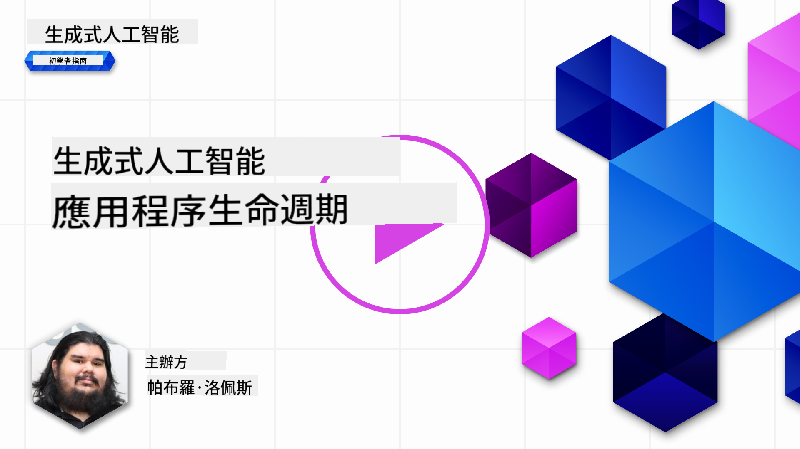
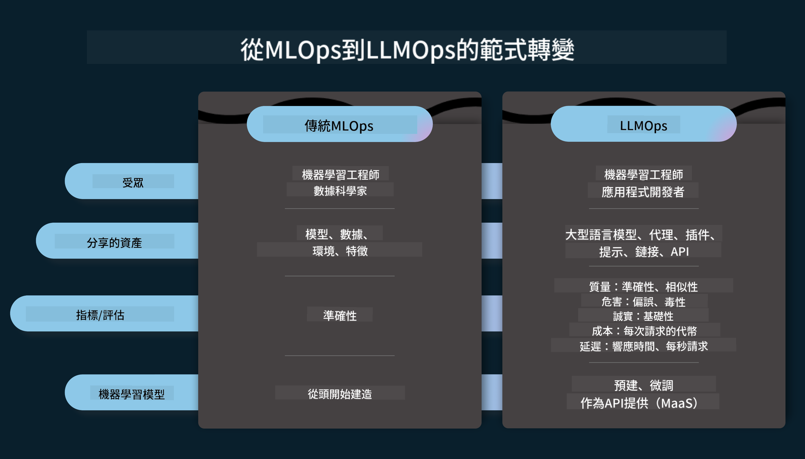
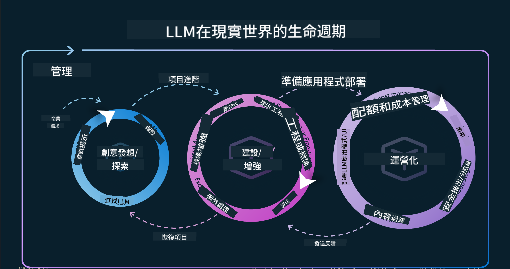
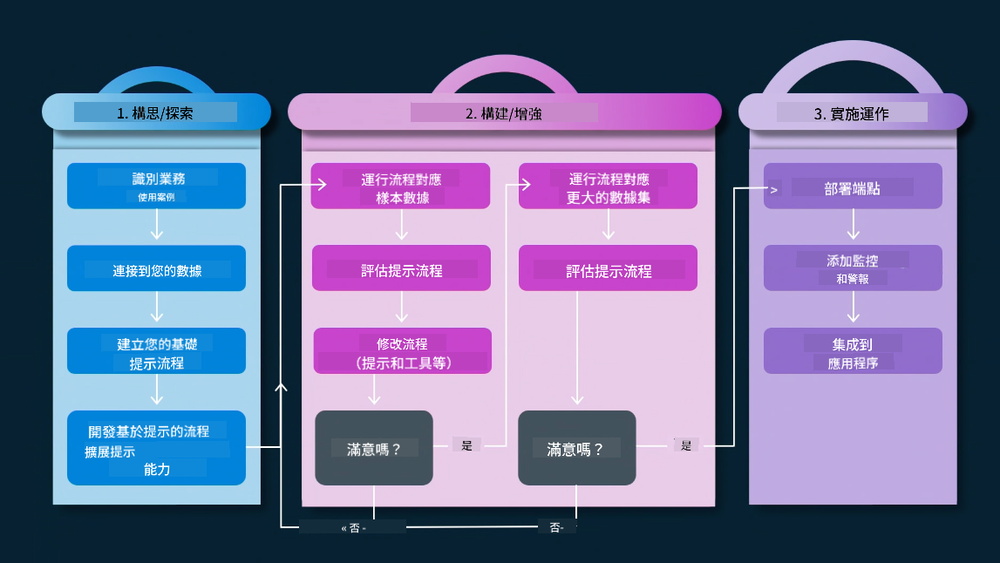
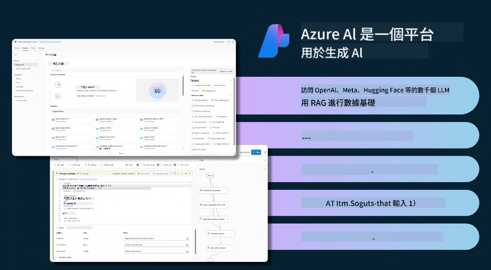
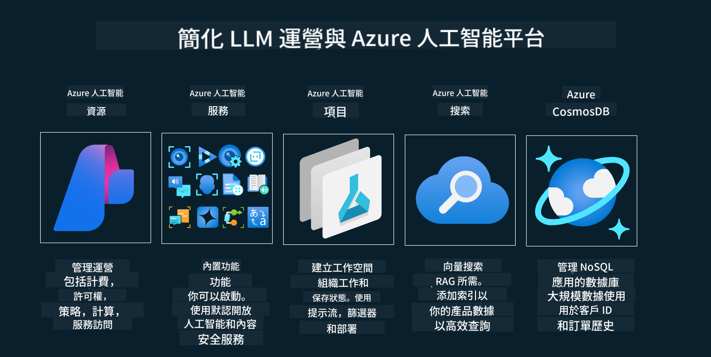
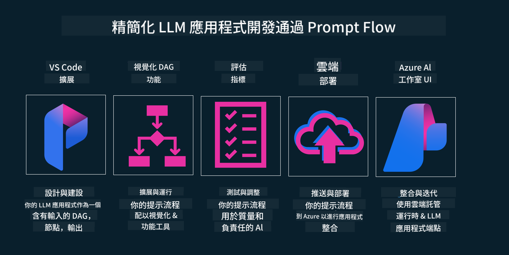

<!--
CO_OP_TRANSLATOR_METADATA:
{
  "original_hash": "27a5347a5022d5ef0a72ab029b03526a",
  "translation_date": "2025-06-25T21:57:11+00:00",
  "source_file": "14-the-generative-ai-application-lifecycle/README.md",
  "language_code": "hk"
}
-->

# 生成式 AI 應用程式生命周期

對於所有 AI 應用程式來說，一個重要問題是 AI 功能的相關性。由於 AI 是一個快速發展的領域，為了確保你的應用程式保持相關性、可靠性和穩健性，你需要持續監控、評估和改進它。這就是生成式 AI 生命周期的作用所在。

生成式 AI 生命周期是一個框架，指導你開發、部署和維護生成式 AI 應用程式的各個階段。它幫助你定義目標、衡量性能、識別挑戰並實施解決方案。它還幫助你將應用程式與你的領域及利益相關者的道德和法律標準保持一致。通過遵循生成式 AI 生命周期，你可以確保你的應用程式始終提供價值並滿足使用者需求。

## 介紹

在本章中，你將：

- 理解從 MLOps 到 LLMOps 的範式轉變
- LLM 生命周期
- 生命周期工具化
- 生命周期度量和評估

## 理解從 MLOps 到 LLMOps 的範式轉變

LLM 是人工智能工具箱中的新工具，它在應用程式的分析和生成任務中非常強大。然而，這種強大在我們精簡 AI 和經典機器學習任務時帶來了一些後果。

因此，我們需要一個新的範式來適應這個工具的動態，並提供正確的激勵。我們可以將舊的 AI 應用程式分類為「ML 應用程式」，而新的 AI 應用程式則為「GenAI 應用程式」或僅僅是「AI 應用程式」，反映當時主流的技術和方法。這在多方面改變了我們的敘述，看看以下比較。

注意在 LLMOps 中，我們更加關注應用程式開發者，使用整合作為關鍵點，使用「模型即服務」，並考慮以下指標點。

- 質量：回應質量
- 傷害：負責任的 AI
- 誠實：回應的基礎（合理嗎？正確嗎？）
- 成本：解決方案預算
- 延遲：平均回應時間

## LLM 生命周期

首先，為了理解生命周期和修改，讓我們注意下一個資訊圖。

如你所見，這與通常的 MLOps 生命周期不同。LLM 有許多新要求，例如提示、提高質量的不同技術（微調、RAG、元提示）、負責任的 AI 的不同評估和責任，最後是新的評估指標（質量、傷害、誠實、成本和延遲）。

例如，看看我們如何構思。使用提示工程來實驗不同的 LLM，以探索可能性並測試它們的假設是否正確。

注意這不是線性的，而是整合的循環，迭代的，並具有一個全面的循環。

我們如何探索這些步驟？讓我們詳細探討如何構建生命周期。

這可能看起來有點複雜，首先讓我們專注於三個大步驟。

1. 構思/探索：探索，在這裡我們可以根據業務需求進行探索。原型設計，創建一個 [PromptFlow](https://microsoft.github.io/promptflow/index.html?WT.mc_id=academic-105485-koreyst)，並測試它是否足夠有效來驗證我們的假設。
1. 建構/增強：實施，現在，我們開始評估更大的數據集，實施技術，如微調和 RAG，以檢查解決方案的穩健性。如果不行，重新實施它，增加新步驟或重構數據可能有幫助。測試流程和規模後，如果它有效並檢查指標，它就準備好進入下一步。
1. 操作化：整合，現在添加監控和警報系統到系統中，部署和應用程式整合到應用程式中。

然後，我們有一個全面的管理循環，專注於安全性、合規性和治理。

恭喜你，現在你的 AI 應用程式已準備好運行並操作。要獲得實踐經驗，看看 [Contoso Chat Demo.](https://nitya.github.io/contoso-chat/?WT.mc_id=academic-105485-koreys)

現在，我們可以使用哪些工具？

## 生命周期工具化

對於工具化，Microsoft 提供 [Azure AI Platform](https://azure.microsoft.com/solutions/ai/?WT.mc_id=academic-105485-koreys) 和 [PromptFlow](https://microsoft.github.io/promptflow/index.html?WT.mc_id=academic-105485-koreyst) 來方便並使你的周期易於實施和準備好運行。

[Azure AI Platform](https://azure.microsoft.com/solutions/ai/?WT.mc_id=academic-105485-koreys) 允許你使用 [AI Studio](https://ai.azure.com/?WT.mc_id=academic-105485-koreys)。AI Studio 是一個網頁門戶，允許你探索模型、樣本和工具。管理你的資源、UI 開發流程和 SDK/CLI 選項以進行代碼優先開發。

Azure AI 允許你使用多個資源來管理你的操作、服務、項目、向量搜索和數據庫需求。

從概念驗證(POC)到大規模應用程式，使用 PromptFlow 構建：

- 從 VS Code 設計和構建應用程式，使用可視化和功能工具
- 輕鬆測試和微調你的應用程式以確保高質量的 AI
- 使用 Azure AI Studio 進行整合和迭代，快速推送和部署以進行整合

## 太好了！繼續學習！

太棒了，現在學習更多關於我們如何構建應用程式以使用 [Contoso Chat App](https://nitya.github.io/contoso-chat/?WT.mc_id=academic-105485-koreyst) 的概念，查看雲端倡導如何在演示中添加這些概念。欲了解更多內容，請查看我們的 [Ignite breakout session!
](https://www.youtube.com/watch?v=DdOylyrTOWg)

現在，查看第 15 課，了解 [檢索增強生成和向量數據庫](../15-rag-and-vector-databases/README.md?WT.mc_id=academic-105485-koreyst) 如何影響生成式 AI 並製作更具吸引力的應用程式！

**免責聲明**：  
本文件是使用AI翻譯服務[Co-op Translator](https://github.com/Azure/co-op-translator)翻譯的。儘管我們努力確保準確性，但請注意，自動翻譯可能包含錯誤或不準確之處。應以原語言的文件作為權威來源。對於關鍵信息，建議使用專業人工翻譯。我們對因使用本翻譯而引起的任何誤解或誤譯不承擔責任。