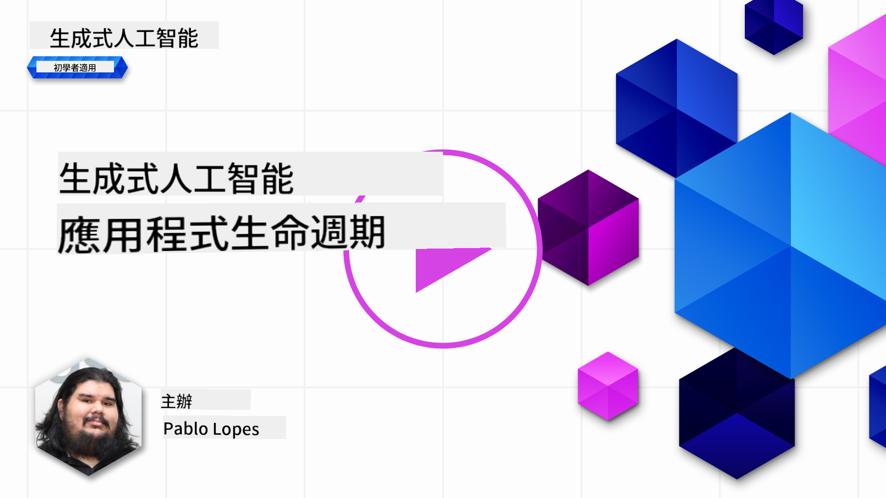
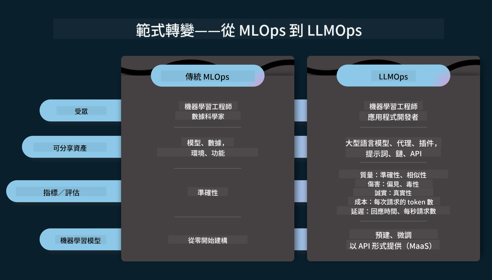
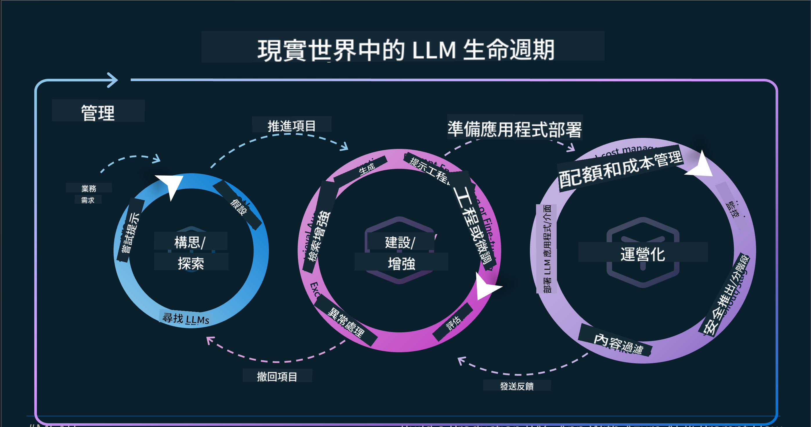
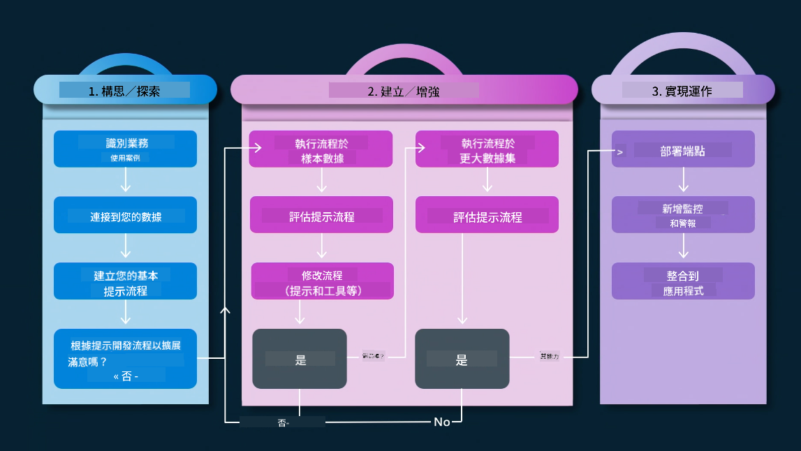
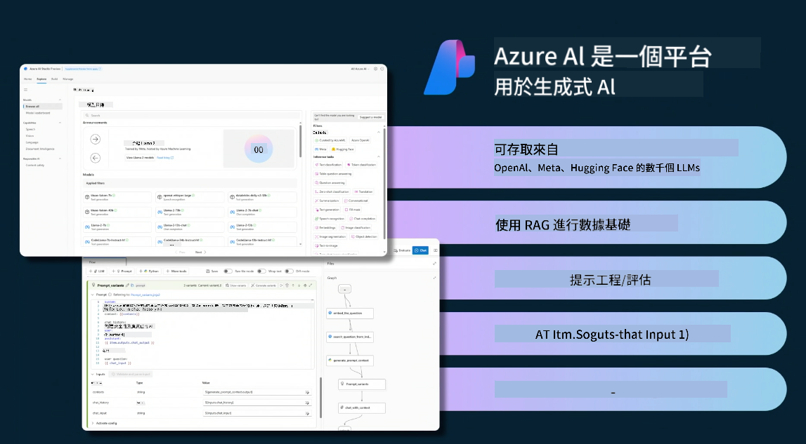
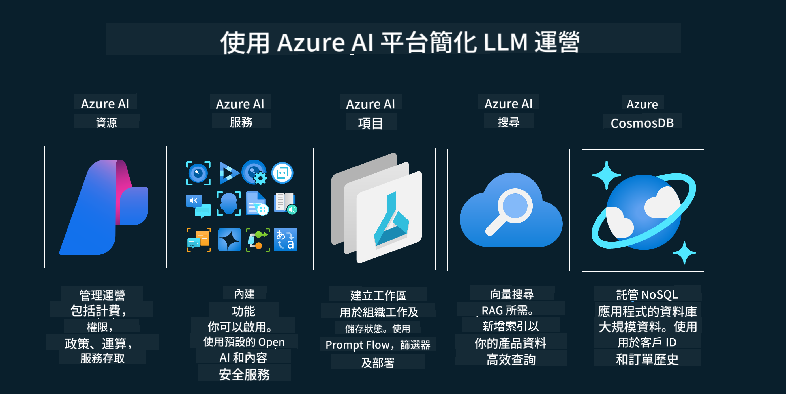
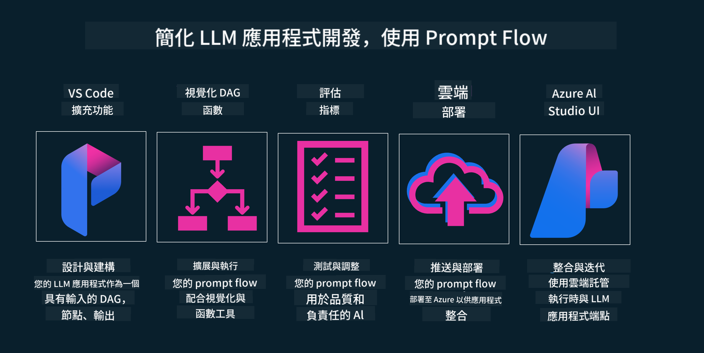

<!--
CO_OP_TRANSLATOR_METADATA:
{
  "original_hash": "27a5347a5022d5ef0a72ab029b03526a",
  "translation_date": "2025-07-09T15:48:57+00:00",
  "source_file": "14-the-generative-ai-application-lifecycle/README.md",
  "language_code": "hk"
}
-->

# 生成式 AI 應用程式生命週期

對所有 AI 應用程式來說，一個重要的問題是 AI 功能的相關性。由於 AI 是一個快速演進的領域，為了確保你的應用程式保持相關性、可靠性和穩健性，你需要持續監控、評估並改進它。這正是生成式 AI 生命週期的用武之地。

生成式 AI 生命週期是一個指引你開發、部署及維護生成式 AI 應用程式的框架。它幫助你明確目標、衡量效能、識別挑戰並實施解決方案。同時，它也協助你使應用程式符合你所屬領域及利益相關者的倫理和法律標準。透過遵循生成式 AI 生命週期，你可以確保應用程式持續提供價值並滿足使用者需求。

## 介紹

在本章節中，你將會：

- 了解從 MLOps 到 LLMOps 的範式轉移
- LLM 生命週期
- 生命週期工具
- 生命週期的度量與評估

## 了解從 MLOps 到 LLMOps 的範式轉移

LLM 是人工智能工具庫中的新利器，它們在分析和生成任務中非常強大，適用於各種應用程式，但這種強大能力也對我們如何簡化 AI 和傳統機器學習任務帶來了一些影響。

因此，我們需要一個新的範式來動態地適應這項工具，並設置正確的激勵機制。我們可以將較舊的 AI 應用程式稱為「ML 應用程式」，而較新的 AI 應用程式則稱為「GenAI 應用程式」或簡稱「AI 應用程式」，以反映當時主流的技術和方法。這在多方面改變了我們的敘事，請看以下比較。

請注意，在 LLMOps 中，我們更關注應用程式開發者，將整合視為關鍵點，採用「模型即服務」的方式，並從以下幾個指標來思考：

- 品質：回應品質
- 風險：負責任的 AI
- 誠實度：回應的依據（合理嗎？正確嗎？）
- 成本：解決方案預算
- 延遲：平均回應時間（以 token 計）

## LLM 生命週期

首先，為了理解生命週期及其變化，請參考下方資訊圖表。

如你所見，這與傳統的 MLOps 生命週期不同。LLM 有許多新需求，例如提示工程、提升品質的不同技術（微調、RAG、元提示）、負責任 AI 的不同評估與責任，以及新的評估指標（品質、風險、誠實度、成本和延遲）。

舉例來說，看看我們如何進行構思。利用提示工程來嘗試不同的 LLM，探索可能性，測試假設是否成立。

請注意，這不是線性的流程，而是整合的迴圈，反覆進行並有一個總體循環。

我們如何探索這些步驟？讓我們深入了解如何建立生命週期。

這看起來可能有點複雜，先聚焦於三個主要步驟。

1. 構思／探索：根據業務需求進行探索。原型設計，建立 [PromptFlow](https://microsoft.github.io/promptflow/index.html?WT.mc_id=academic-105485-koreyst) 並測試是否足夠支持假設。
2. 建置／增強：實作階段，開始評估較大規模資料集，實施技術如微調和 RAG，檢查解決方案的穩健性。如果不理想，重新實作、加入新步驟或重組資料可能有幫助。測試流程和規模後，確認符合指標，即可進入下一階段。
3. 運營化：整合階段，加入監控和警示系統，部署並整合到應用程式中。

接著，是管理的總體循環，專注於安全、合規與治理。

恭喜你，現在你的 AI 應用程式已準備好上線並運作。想親自體驗，請參考 [Contoso Chat Demo](https://nitya.github.io/contoso-chat/?WT.mc_id=academic-105485-koreys)。

那麼，我們可以使用哪些工具呢？

## 生命週期工具

在工具方面，微軟提供了 [Azure AI Platform](https://azure.microsoft.com/solutions/ai/?WT.mc_id=academic-105485-koreys) 和 [PromptFlow](https://microsoft.github.io/promptflow/index.html?WT.mc_id=academic-105485-koreyst)，讓你的生命週期實作更簡單且隨時可用。

[Azure AI Platform](https://azure.microsoft.com/solutions/ai/?WT.mc_id=academic-105485-koreys) 讓你使用 [AI Studio](https://ai.azure.com/?WT.mc_id=academic-105485-koreys)。AI Studio 是一個網頁入口，讓你探索模型、範例和工具，管理資源、UI 開發流程，以及提供 SDK/CLI 選項，支援以程式碼為先的開發。

Azure AI 允許你使用多種資源，管理你的運營、服務、專案、向量搜尋和資料庫需求。

從概念驗證（POC）到大規模應用，使用 PromptFlow：

- 從 VS Code 設計和建置應用程式，結合視覺化和功能性工具
- 輕鬆測試並微調你的應用程式，確保 AI 品質
- 利用 Azure AI Studio 與雲端整合、迭代，快速推送和部署

## 太棒了！繼續學習吧！

很棒，現在進一步了解如何結構應用程式，並運用這些概念，請參考 [Contoso Chat App](https://nitya.github.io/contoso-chat/?WT.mc_id=academic-105485-koreyst)，看看 Cloud Advocacy 如何在示範中加入這些概念。更多內容，請觀看我們的 [Ignite 專題講座！](https://www.youtube.com/watch?v=DdOylyrTOWg)

接著，請查看第 15 課，了解 [Retrieval Augmented Generation 和向量資料庫](../15-rag-and-vector-databases/README.md?WT.mc_id=academic-105485-koreyst) 如何影響生成式 AI，並打造更吸引人的應用程式！

**免責聲明**：  
本文件乃使用 AI 翻譯服務 [Co-op Translator](https://github.com/Azure/co-op-translator) 進行翻譯。雖然我們致力於確保準確性，但請注意，自動翻譯可能包含錯誤或不準確之處。原始文件的母語版本應被視為權威來源。對於重要資訊，建議採用專業人工翻譯。我們不對因使用本翻譯而引起的任何誤解或誤釋承擔責任。