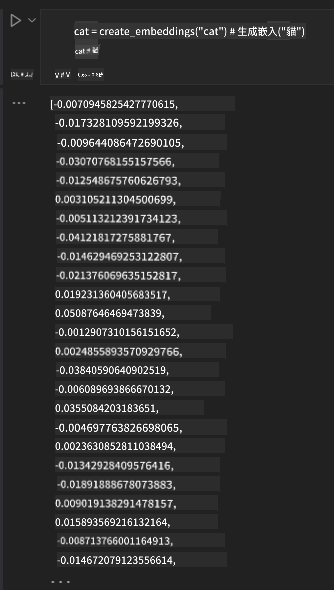

<!--
CO_OP_TRANSLATOR_METADATA:
{
  "original_hash": "e2861bbca91c0567ef32bc77fe054f9e",
  "translation_date": "2025-05-20T01:05:40+00:00",
  "source_file": "15-rag-and-vector-databases/README.md",
  "language_code": "hk"
}
-->
# 檢索增強生成 (RAG) 和向量數據庫

在搜尋應用的課堂中，我們簡單學習了如何將自己的數據整合到大型語言模型 (LLMs) 中。在這節課中，我們將深入探討如何將數據基於LLM應用程序、該過程的機制以及儲存數據的方法，包括嵌入和文本。

> **視頻即將推出**

## 介紹

在這節課中，我們將涵蓋以下內容：

- 介紹什麼是RAG，以及為什麼它在人工智能中被使用。

- 理解什麼是向量數據庫並為我們的應用創建一個。

- 如何將RAG整合到應用中的實際例子。

## 學習目標

完成這節課後，你將能夠：

- 解釋RAG在數據檢索和處理中的重要性。

- 設置RAG應用程序並將你的數據基於LLM。

- 在LLM應用中有效整合RAG和向量數據庫。

## 我們的場景：用我們自己的數據增強LLM

在這節課中，我們希望將自己的筆記添加到教育初創公司中，這樣可以讓聊天機器人獲得更多關於不同主題的信息。通過使用我們的筆記，學習者可以更好地學習和理解不同的主題，使得他們更容易準備考試。為了創建我們的場景，我們將使用：

- `Azure OpenAI:` 我們將用來創建聊天機器人的LLM

- `AI for beginners' lesson on Neural Networks`: 這將是我們基於的LLM數據

- `Azure AI Search` 和 `Azure Cosmos DB:` 向量數據庫來儲存我們的數據並創建一個搜索索引

用戶將能夠從他們的筆記中創建練習測驗、複習閃卡並將其總結為簡潔的概述。讓我們開始了解什麼是RAG以及它如何運作：

## 檢索增強生成 (RAG)

一個由LLM驅動的聊天機器人會處理用戶的提示以生成響應。它被設計為互動性並與用戶在廣泛的主題上交流。然而，它的響應僅限於所提供的上下文及其基礎訓練數據。例如，GPT-4的知識截止日期是2021年9月，這意味著它對此之後發生的事件缺乏了解。此外，用於訓練LLM的數據不包括個人筆記或公司產品手冊等機密信息。

### RAGs (檢索增強生成) 如何運作

假設你想部署一個從筆記中創建測驗的聊天機器人，你將需要連接到知識庫。這就是RAG的用武之地。RAGs的運作如下：

- **知識庫：** 在檢索之前，這些文檔需要被攝取和預處理，通常將大型文檔分解為較小的塊，將它們轉換為文本嵌入並儲存在數據庫中。

- **用戶查詢：** 用戶提出問題

- **檢索：** 當用戶提出問題時，嵌入模型從我們的知識庫中檢索相關信息，以提供更多的上下文，這將被整合到提示中。

- **增強生成：** LLM根據檢索到的數據增強其響應。這使得生成的響應不僅基於預訓練數據，還基於添加的上下文中的相關信息。檢索到的數據被用來增強LLM的響應。然後LLM返回用戶問題的答案。

RAGs的架構是使用由兩部分組成的transformers實現的：編碼器和解碼器。例如，當用戶提出問題時，輸入文本被“編碼”成捕捉單詞意義的向量，然後向量被“解碼”到我們的文檔索引中，並根據用戶查詢生成新文本。LLM使用編碼器-解碼器模型生成輸出。

根據提出的論文： [知識密集型自然語言處理任務的檢索增強生成](https://arxiv.org/pdf/2005.11401.pdf?WT.mc_id=academic-105485-koreyst)，實現RAG時的兩種方法是：

- **_RAG-Sequence_** 使用檢索到的文檔來預測用戶查詢的最佳答案

- **RAG-Token** 使用文檔生成下一個標記，然後檢索它們以回答用戶的查詢

### 為什麼要使用RAGs？

- **信息豐富性：** 確保文本響應是最新的和當前的。因此，它通過訪問內部知識庫來增強在特定領域任務上的性能。

- 通過使用知識庫中的**可驗證數據**來減少捏造，為用戶查詢提供上下文。

- 它是**成本效益**的，因為它們比微調LLM更經濟。

## 創建知識庫

我們的應用基於我們的個人數據，即AI初學者課程中的神經網絡課。

### 向量數據庫

向量數據庫與傳統數據庫不同，是一種專門設計用於儲存、管理和搜索嵌入向量的數據庫。它儲存文檔的數字表示。將數據分解為數字嵌入使得我們的AI系統更容易理解和處理數據。

我們將嵌入儲存在向量數據庫中，因為LLMs對作為輸入接受的標記數量有限。由於你無法將整個嵌入傳遞給LLM，我們需要將它們分解為塊，當用戶提出問題時，最像問題的嵌入將與提示一起返回。分塊還可以降低通過LLM的標記數量的成本。

一些流行的向量數據庫包括Azure Cosmos DB、Clarifyai、Pinecone、Chromadb、ScaNN、Qdrant和DeepLake。你可以使用以下命令使用Azure CLI創建Azure Cosmos DB模型：

```bash
az login
az group create -n <resource-group-name> -l <location>
az cosmosdb create -n <cosmos-db-name> -r <resource-group-name>
az cosmosdb list-keys -n <cosmos-db-name> -g <resource-group-name>
```

### 從文本到嵌入

在我們儲存數據之前，我們需要將其轉換為向量嵌入，然後再將其儲存在數據庫中。如果你正在處理大型文檔或長文本，你可以根據預期的查詢將它們分塊。分塊可以在句子層級或段落層級進行。由於分塊從周圍的單詞中獲取意義，你可以向塊中添加其他上下文，例如，通過添加文檔標題或在塊之前或之後包含一些文本。你可以如下進行分塊：

```python
def split_text(text, max_length, min_length):
    words = text.split()
    chunks = []
    current_chunk = []

    for word in words:
        current_chunk.append(word)
        if len(' '.join(current_chunk)) < max_length and len(' '.join(current_chunk)) > min_length:
            chunks.append(' '.join(current_chunk))
            current_chunk = []

    # If the last chunk didn't reach the minimum length, add it anyway
    if current_chunk:
        chunks.append(' '.join(current_chunk))

    return chunks
```

一旦分塊，我們可以使用不同的嵌入模型來嵌入文本。你可以使用的一些模型包括：word2vec、OpenAI的ada-002、Azure Computer Vision等。選擇使用哪個模型將取決於你使用的語言、編碼的內容類型（文本/圖像/音頻）、可以編碼的輸入大小和嵌入輸出的長度。

使用OpenAI的`text-embedding-ada-002`模型嵌入文本的例子是：


## 檢索和向量搜索

當用戶提出問題時，檢索器會使用查詢編碼器將其轉換為向量，然後在我們的文檔搜索索引中搜索與輸入相關的向量。一旦完成，它會將輸入向量和文檔向量轉換為文本，並通過LLM傳遞。

### 檢索

檢索發生在系統嘗試快速從索引中找到滿足搜索標準的文檔時。檢索器的目標是獲取將用於提供上下文並將LLM基於你的數據的文檔。

在我們的數據庫中執行搜索有多種方式，例如：

- **關鍵字搜索** - 用於文本搜索

- **語義搜索** - 使用單詞的語義意義

- **向量搜索** - 使用嵌入模型將文檔從文本轉換為向量表示。檢索將通過查詢與用戶問題最接近的文檔進行。

- **混合搜索** - 結合關鍵字和向量搜索。

檢索的一個挑戰是在數據庫中沒有與查詢相似的響應時，系統將返回他們能夠獲得的最佳信息，然而，你可以使用一些策略，例如設置最大相關距離或使用結合關鍵字和向量搜索的混合搜索。在這節課中，我們將使用混合搜索，結合向量和關鍵字搜索。我們將數據儲存在具有包含分塊和嵌入的列的數據框中。

### 向量相似性

檢索器將在知識數據庫中搜索彼此接近的嵌入，最近鄰，因為它們是相似的文本。在用戶提出查詢的情況下，它首先被嵌入，然後與相似的嵌入匹配。常用的測量不同向量相似性的方法是餘弦相似性，它基於兩個向量之間的角度。

我們可以使用其他替代方法來測量相似性，例如歐幾里得距離，它是向量端點之間的直線，和點積，它測量兩個向量對應元素的乘積之和。

### 搜索索引

在進行檢索時，我們需要在執行搜索之前為知識庫構建一個搜索索引。索引將儲存我們的嵌入，並且即使在大型數據庫中也能快速檢索最相似的塊。我們可以使用以下方法在本地創建索引：

```python
from sklearn.neighbors import NearestNeighbors

embeddings = flattened_df['embeddings'].to_list()

# Create the search index
nbrs = NearestNeighbors(n_neighbors=5, algorithm='ball_tree').fit(embeddings)

# To query the index, you can use the kneighbors method
distances, indices = nbrs.kneighbors(embeddings)
```

### 重排序

一旦你查詢了數據庫，你可能需要從最相關的結果中進行排序。重排序LLM利用機器學習通過按相關性排序來提高搜索結果的相關性。使用Azure AI Search，重排序會自動為你完成，使用語義重排序器。重排序如何使用最近鄰運作的例子：

```python
# Find the most similar documents
distances, indices = nbrs.kneighbors([query_vector])

index = []
# Print the most similar documents
for i in range(3):
    index = indices[0][i]
    for index in indices[0]:
        print(flattened_df['chunks'].iloc[index])
        print(flattened_df['path'].iloc[index])
        print(flattened_df['distances'].iloc[index])
    else:
        print(f"Index {index} not found in DataFrame")
```

## 將所有內容整合在一起

最後一步是將我們的LLM添加到組合中，以便獲得基於我們數據的響應。我們可以如下實施：

```python
user_input = "what is a perceptron?"

def chatbot(user_input):
    # Convert the question to a query vector
    query_vector = create_embeddings(user_input)

    # Find the most similar documents
    distances, indices = nbrs.kneighbors([query_vector])

    # add documents to query  to provide context
    history = []
    for index in indices[0]:
        history.append(flattened_df['chunks'].iloc[index])

    # combine the history and the user input
    history.append(user_input)

    # create a message object
    messages=[
        {"role": "system", "content": "You are an AI assistant that helps with AI questions."},
        {"role": "user", "content": history[-1]}
    ]

    # use chat completion to generate a response
    response = openai.chat.completions.create(
        model="gpt-4",
        temperature=0.7,
        max_tokens=800,
        messages=messages
    )

    return response.choices[0].message

chatbot(user_input)
```

## 評估我們的應用

### 評估指標

- 提供的響應質量，確保它聽起來自然、流暢和像人類

- 數據的基礎性：評估響應是否來自提供的文檔

- 相關性：評估響應是否與所提問題匹配和相關

- 流暢性 - 評估響應在語法上是否合理

## 使用RAG（檢索增強生成）和向量數據庫的用例

函數調用可以改善應用的許多不同用例，例如：

- 問答系統：將公司的數據基於可以由員工提問的聊天中。

- 推薦系統：你可以創建一個匹配最相似值的系統，例如電影、餐廳等。

- 聊天機器人服務：你可以儲存聊天歷史並根據用戶數據個性化對話。

- 基於向量嵌入的圖像搜索，在進行圖像識別和異常檢測時很有用。

## 總結

我們已經涵蓋了RAG的基本領域，從將我們的數據添加到應用程序、用戶查詢和輸出。為了簡化RAG的創建，你可以使用Semanti Kernel、Langchain或Autogen等框架。

## 作業

為了繼續學習檢索增強生成（RAG），你可以構建：

- 使用你選擇的框架構建應用的前端

- 利用框架，無論是LangChain還是Semantic Kernel，並重建你的應用。

恭喜你完成這節課 👏。

## 學習不止於此，繼續旅程

完成這節課後，查看我們的[生成式AI學習合集](https://aka.ms/genai-collection?WT.mc_id=academic-105485-koreyst)，繼續提升你的生成式AI知識！

**免責聲明**：
本文件已使用AI翻譯服務[Co-op Translator](https://github.com/Azure/co-op-translator)進行翻譯。我們努力確保準確性，但請注意，自動翻譯可能包含錯誤或不準確之處。應將原始語言的文件視為權威來源。對於關鍵信息，建議使用專業人工翻譯。對於因使用本翻譯而產生的任何誤解或誤讀，我們概不負責。