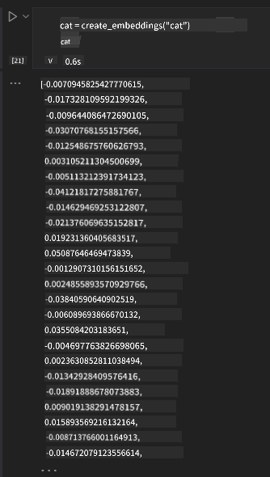

<!--
CO_OP_TRANSLATOR_METADATA:
{
  "original_hash": "e2861bbca91c0567ef32bc77fe054f9e",
  "translation_date": "2025-06-25T22:21:22+00:00",
  "source_file": "15-rag-and-vector-databases/README.md",
  "language_code": "hk"
}
-->
# 檢索增強生成 (RAG) 和向量數據庫

在搜索應用課程中，我們簡要了解了如何將自己的數據整合到大型語言模型 (LLM) 中。在這節課中，我們將深入探討在您的 LLM 應用中將數據扎根的概念、過程的機制以及存儲數據的方法，包括嵌入和文本。

> **視頻即將推出**

## 介紹

在這節課中，我們將涵蓋以下內容：

- RAG 的介紹，它是什麼以及為什麼在人工智能 (AI) 中使用它。

- 理解什麼是向量數據庫並為我們的應用創建一個。

- 如何將 RAG 整合到應用中的實際示例。

## 學習目標

完成本課程後，您將能夠：

- 解釋 RAG 在數據檢索和處理中的重要性。

- 設置 RAG 應用並將您的數據扎根到 LLM

- 在 LLM 應用中有效整合 RAG 和向量數據庫。

## 我們的情境：使用我們自己的數據增強 LLM

在這節課中，我們希望將自己的筆記添加到教育初創公司中，這使得聊天機器人可以獲得更多關於不同主題的信息。使用我們擁有的筆記，學習者將能夠更好地學習和理解不同的主題，從而更容易為考試進行複習。為了創建我們的情境，我們將使用：

- `Azure OpenAI:` 我們將用來創建聊天機器人的 LLM

- `AI for beginners' lesson on Neural Networks`：這將是我們扎根於 LLM 的數據

- `Azure AI Search` 和 `Azure Cosmos DB:` 向量數據庫，用於存儲我們的數據並創建搜索索引

用戶將能夠從他們的筆記中創建練習測驗、複習閃卡並將其總結為簡潔的概述。首先，讓我們看看什麼是 RAG 以及它如何工作：

## 檢索增強生成 (RAG)

由 LLM 驅動的聊天機器人處理用戶提示以生成回應。它旨在與用戶在各種主題上進行互動。然而，它的回應僅限於提供的上下文及其基礎訓練數據。例如，GPT-4 的知識截止日期為 2021 年 9 月，這意味著它缺乏對此後發生事件的了解。此外，用於訓練 LLM 的數據不包括機密信息，例如個人筆記或公司的產品手冊。

### RAGs (檢索增強生成) 的工作原理

假設您想部署一個從筆記中創建測驗的聊天機器人，您將需要與知識庫建立連接。這就是 RAG 發揮作用的地方。RAGs 的運作如下：

- **知識庫：** 在檢索之前，這些文檔需要被攝取和預處理，通常將大型文檔拆分成較小的塊，將它們轉換為文本嵌入並存儲在數據庫中。

- **用戶查詢：** 用戶提出問題

- **檢索：** 當用戶提出問題時，嵌入模型從我們的知識庫中檢索相關信息，以提供更多上下文，這將被納入提示中。

- **增強生成：** LLM 根據檢索到的數據增強其回應。它允許生成的回應不僅基於預訓練數據，還基於添加的上下文中的相關信息。檢索到的數據用於增強 LLM 的回應。然後 LLM 向用戶的問題返回答案。

RAGs 的架構使用由兩部分組成的變壓器實現：編碼器和解碼器。例如，當用戶提出問題時，輸入文本被“編碼”成捕捉單詞意義的向量，並且向量被“解碼”到我們的文檔索引中，並根據用戶查詢生成新文本。LLM 使用編碼器-解碼器模型生成輸出。

根據提出的論文 [檢索增強生成，用於知識密集型 NLP (自然語言處理軟件) 任務](https://arxiv.org/pdf/2005.11401.pdf?WT.mc_id=academic-105485-koreyst)，實施 RAG 的兩種方法是：

- **_RAG-Sequence_** 使用檢索到的文檔來預測用戶查詢的最佳答案

- **RAG-Token** 使用文檔生成下一個標記，然後檢索它們以回答用戶的查詢

### 為什麼要使用 RAGs？

- **信息豐富性：** 確保文本回應是最新和當前的。因此，通過訪問內部知識庫提高在特定領域任務上的性能。

- 通過利用知識庫中的 **可驗證數據** 減少捏造，為用戶查詢提供上下文。

- **成本效益**，因為與微調 LLM 相比，它們更經濟。

## 創建知識庫

我們的應用基於我們的個人數據，即 AI 初學者課程中的神經網絡課程。

### 向量數據庫

向量數據庫不同於傳統數據庫，是專門設計用於存儲、管理和搜索嵌入向量的數據庫。它存儲文檔的數值表示。將數據分解為數值嵌入，使得我們的 AI 系統更容易理解和處理數據。

我們將嵌入存儲在向量數據庫中，因為 LLM 有它們接受的輸入令牌數量的限制。由於您不能將整個嵌入傳遞給 LLM，我們需要將它們分解成塊，當用戶提出問題時，最像問題的嵌入將與提示一起返回。分塊還降低了通過 LLM 傳遞的令牌數量的成本。

一些流行的向量數據庫包括 Azure Cosmos DB、Clarifyai、Pinecone、Chromadb、ScaNN、Qdrant 和 DeepLake。您可以使用以下命令使用 Azure CLI 創建 Azure Cosmos DB 模型：

```bash
az login
az group create -n <resource-group-name> -l <location>
az cosmosdb create -n <cosmos-db-name> -r <resource-group-name>
az cosmosdb list-keys -n <cosmos-db-name> -g <resource-group-name>
```

### 從文本到嵌入

在存儲數據之前，我們需要將其轉換為向量嵌入，然後才能存儲在數據庫中。如果您正在處理大型文檔或長文本，可以根據預期查詢進行分塊。分塊可以在句子級別或段落級別進行。由於分塊從周圍單詞中推導出意義，您可以為分塊添加一些其他上下文，例如添加文檔標題或在分塊前後包括一些文本。您可以按以下方式分塊數據：

```python
def split_text(text, max_length, min_length):
    words = text.split()
    chunks = []
    current_chunk = []

    for word in words:
        current_chunk.append(word)
        if len(' '.join(current_chunk)) < max_length and len(' '.join(current_chunk)) > min_length:
            chunks.append(' '.join(current_chunk))
            current_chunk = []

    # If the last chunk didn't reach the minimum length, add it anyway
    if current_chunk:
        chunks.append(' '.join(current_chunk))

    return chunks
```

分塊後，我們可以使用不同的嵌入模型嵌入文本。您可以使用的一些模型包括：word2vec、OpenAI 的 ada-002、Azure Computer Vision 等。選擇使用的模型將取決於您使用的語言、編碼內容的類型（文本/圖像/音頻）、它可以編碼的輸入大小和嵌入輸出的長度。

使用 OpenAI 的 `text-embedding-ada-002` 模型嵌入文本的示例是：


## 檢索和向量搜索

當用戶提出問題時，檢索器使用查詢編碼器將其轉換為向量，然後在我們的文檔搜索索引中搜索與輸入相關的文檔中相關的向量。完成後，它將輸入向量和文檔向量都轉換為文本並通過 LLM 傳遞。

### 檢索

檢索發生在系統嘗試快速從索引中找到滿足搜索標準的文檔時。檢索器的目標是獲取將用於提供上下文並將 LLM 扎根於您的數據的文檔。

有多種方法可以在我們的數據庫中執行搜索，例如：

- **關鍵字搜索** - 用於文本搜索

- **語義搜索** - 使用單詞的語義意義

- **向量搜索** - 使用嵌入模型將文檔從文本轉換為向量表示。檢索將通過查詢其向量表示最接近用戶問題的文檔來完成。

- **混合** - 關鍵字和向量搜索的結合。

檢索的挑戰在於當數據庫中沒有與查詢類似的回應時，系統將返回它們能獲得的最佳信息，然而，您可以使用一些策略，例如設置最大相關距離或使用結合關鍵字和向量搜索的混合搜索。在這節課中，我們將使用混合搜索，結合向量和關鍵字搜索。我們將數據存儲到一個數據框中，其中包含分塊和嵌入的列。

### 向量相似性

檢索器將在知識數據庫中搜索靠近的嵌入，最近的鄰居，因為它們是相似的文本。在用戶提出查詢的情境中，首先進行嵌入，然後與相似的嵌入匹配。常用的衡量不同向量相似程度的標準是余弦相似性，它基於兩個向量之間的角度。

我們可以使用其他替代方法測量相似性，例如歐幾里得距離，即向量端點之間的直線距離，以及點積，它測量兩個向量的對應元素的乘積之和。

### 搜索索引

進行檢索時，我們需要在執行搜索之前為知識庫建立搜索索引。索引將存儲我們的嵌入，並且即使在大型數據庫中也能快速檢索最相似的分塊。我們可以使用以下方法在本地創建索引：

```python
from sklearn.neighbors import NearestNeighbors

embeddings = flattened_df['embeddings'].to_list()

# Create the search index
nbrs = NearestNeighbors(n_neighbors=5, algorithm='ball_tree').fit(embeddings)

# To query the index, you can use the kneighbors method
distances, indices = nbrs.kneighbors(embeddings)
```

### 重排序

一旦您查詢了數據庫，您可能需要從最相關的排序結果。重排序 LLM 利用機器學習通過從最相關的排序搜索結果來提高搜索結果的相關性。使用 Azure AI 搜索，重排序會自動為您完成，使用語義重排序器。使用最近鄰居重排序的示例：

```python
# Find the most similar documents
distances, indices = nbrs.kneighbors([query_vector])

index = []
# Print the most similar documents
for i in range(3):
    index = indices[0][i]
    for index in indices[0]:
        print(flattened_df['chunks'].iloc[index])
        print(flattened_df['path'].iloc[index])
        print(flattened_df['distances'].iloc[index])
    else:
        print(f"Index {index} not found in DataFrame")
```

## 將所有內容整合在一起

最後一步是將我們的 LLM 添加到混合中，以便能夠獲得基於我們數據的回應。我們可以按以下方式實施：

```python
user_input = "what is a perceptron?"

def chatbot(user_input):
    # Convert the question to a query vector
    query_vector = create_embeddings(user_input)

    # Find the most similar documents
    distances, indices = nbrs.kneighbors([query_vector])

    # add documents to query  to provide context
    history = []
    for index in indices[0]:
        history.append(flattened_df['chunks'].iloc[index])

    # combine the history and the user input
    history.append(user_input)

    # create a message object
    messages=[
        {"role": "system", "content": "You are an AI assistant that helps with AI questions."},
        {"role": "user", "content": history[-1]}
    ]

    # use chat completion to generate a response
    response = openai.chat.completions.create(
        model="gpt-4",
        temperature=0.7,
        max_tokens=800,
        messages=messages
    )

    return response.choices[0].message

chatbot(user_input)
```

## 評估我們的應用

### 評估指標

- 提供的回應質量，確保它聽起來自然、流暢和像人類

- 數據的扎根性：評估回應是否來自提供的文檔

- 相關性：評估回應是否匹配並與提出的問題相關

- 流暢性 - 回應是否在語法上合理

## 使用 RAG (檢索增強生成) 和向量數據庫的用例

有許多不同的用例，函數調用可以改善您的應用，例如：

- 問答：將公司數據扎根到聊天中，員工可以用來提問。

- 推薦系統：您可以創建一個匹配最相似值的系統，例如電影、餐廳等等。

- 聊天機器人服務：您可以存儲聊天歷史並根據用戶數據個性化對話。

- 基於向量嵌入的圖像搜索，當進行圖像識別和異常檢測時非常有用。

## 總結

我們已經涵蓋了 RAG 的基本領域，從將數據添加到應用、用戶查詢到輸出。為了簡化 RAG 的創建，您可以使用 Semanti Kernel、Langchain 或 Autogen 等框架。

## 作業

為了繼續學習檢索增強生成 (RAG)，您可以構建：

- 使用您選擇的框架為應用構建前端

- 利用框架，LangChain 或 Semantic Kernel，重新創建您的應用。

恭喜完成本課程 👏。

## 學習不止於此，繼續旅程

完成本課程後，請查看我們的 [生成式 AI 學習集合](https://aka.ms/genai-collection?WT.mc_id=academic-105485-koreyst)，繼續提升您的生成式 AI 知識！

**免責聲明**:  
此文件已使用 AI 翻譯服務 [Co-op Translator](https://github.com/Azure/co-op-translator) 進行翻譯。我們努力確保準確性，但請注意，自動翻譯可能包含錯誤或不準確之處。應將原始文件的母語版本視為權威來源。對於關鍵信息，建議進行專業人工翻譯。對於因使用此翻譯而引起的任何誤解或誤釋，我們概不負責。