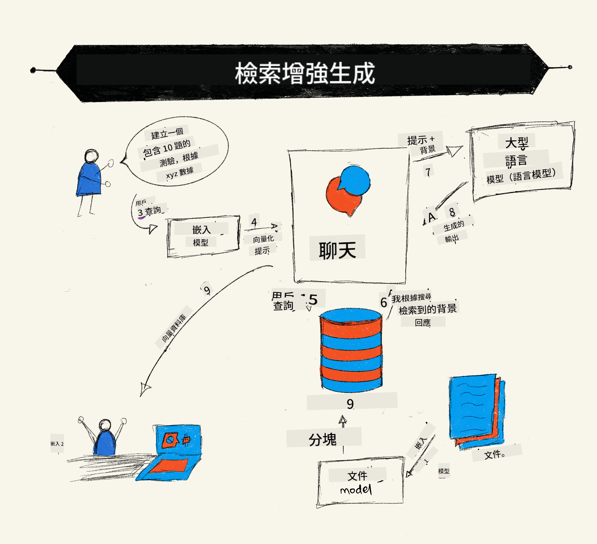
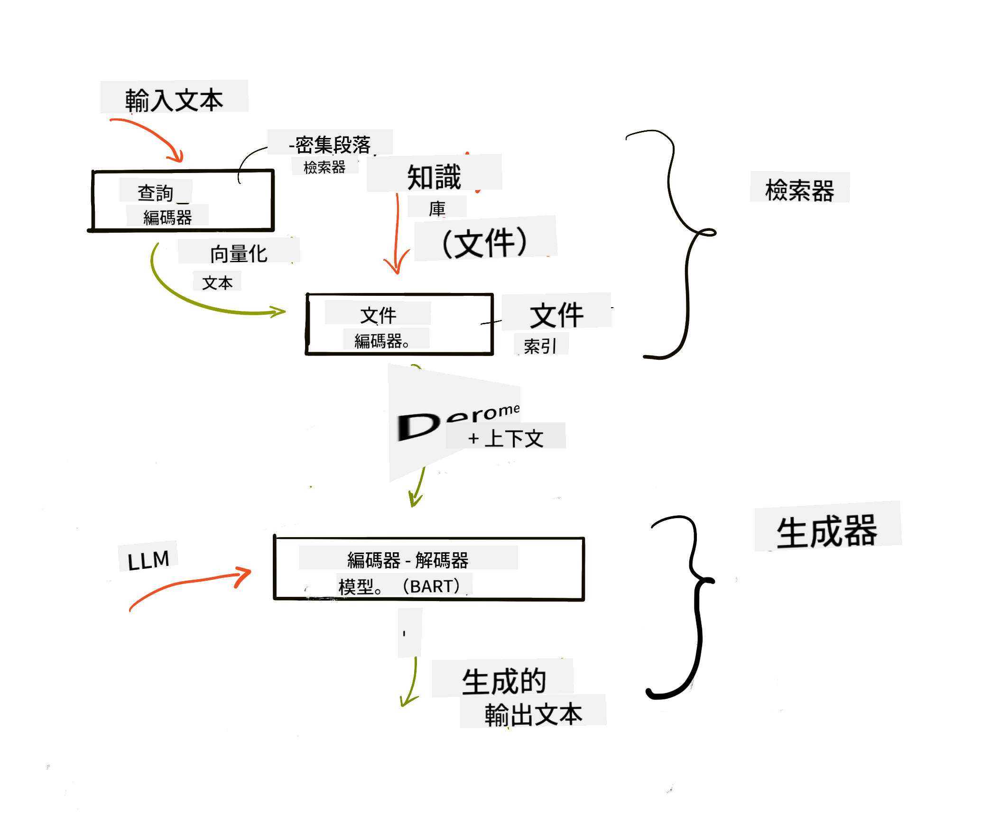

<!--
CO_OP_TRANSLATOR_METADATA:
{
  "original_hash": "b4b0266fbadbba7ded891b6485adc66d",
  "translation_date": "2025-10-17T23:33:38+00:00",
  "source_file": "15-rag-and-vector-databases/README.md",
  "language_code": "hk"
}
-->
# 檢索增強生成 (RAG) 和向量數據庫

[](https://youtu.be/4l8zhHUBeyI?si=BmvDmL1fnHtgQYkL)

在搜索應用的課程中，我們簡單學習了如何將自己的數據整合到大型語言模型 (LLMs) 中。在本課程中，我們將深入探討如何在 LLM 應用中基於自己的數據進行操作的概念、過程的機制以及存儲數據的方法，包括嵌入和文本。

> **影片即將推出**

## 簡介

在本課程中，我們將涵蓋以下內容：

- RAG 的介紹，它是什麼以及為什麼在人工智能 (AI) 中使用它。

- 理解什麼是向量數據庫並為我們的應用創建一個。

- 如何將 RAG 整合到應用中的實際示例。

## 學習目標

完成本課程後，您將能夠：

- 解釋 RAG 在數據檢索和處理中的重要性。

- 設置 RAG 應用並將您的數據基於 LLM。

- 在 LLM 應用中有效整合 RAG 和向量數據庫。

## 我們的場景：用自己的數據增強 LLM

在本課程中，我們希望將自己的筆記添加到教育初創公司中，讓聊天機器人能夠獲取更多有關不同主題的信息。通過我們的筆記，學習者可以更好地學習和理解不同的主題，從而更輕鬆地為考試進行複習。為了創建我們的場景，我們將使用：

- `Azure OpenAI:` 我們用來創建聊天機器人的 LLM

- `AI 初學者課程中的神經網絡`: 我們將基於此數據來構建 LLM

- `Azure AI Search` 和 `Azure Cosmos DB:` 用於存儲數據並創建搜索索引的向量數據庫

用戶將能夠根據自己的筆記創建練習測驗、複習卡片並將其總結為簡潔的概述。讓我們開始了解什麼是 RAG 以及它如何運作：

## 檢索增強生成 (RAG)

一個由 LLM 驅動的聊天機器人通過處理用戶的提示來生成回應。它旨在與用戶進行互動，涵蓋廣泛的主題。然而，它的回應僅限於提供的上下文及其基礎訓練數據。例如，GPT-4 的知識截止日期是 2021 年 9 月，這意味著它缺乏對此日期之後發生的事件的了解。此外，用於訓練 LLM 的數據不包括機密信息，例如個人筆記或公司的產品手冊。

### RAG (檢索增強生成) 的工作原理



假設您想部署一個聊天機器人來根據您的筆記創建測驗，您需要連接到知識庫。這就是 RAG 的作用。RAG 的運作方式如下：

- **知識庫:** 在檢索之前，這些文檔需要被導入和預處理，通常是將大型文檔分解為較小的部分，轉換為文本嵌入並存儲在數據庫中。

- **用戶查詢:** 用戶提出問題。

- **檢索:** 當用戶提出問題時，嵌入模型從我們的知識庫中檢索相關信息，提供更多上下文，並將其整合到提示中。

- **增強生成:** LLM 根據檢索到的數據增強其回應。這使得生成的回應不僅基於預訓練數據，還基於添加的上下文中的相關信息。檢索到的數據用於增強 LLM 的回應。LLM 然後返回用戶問題的答案。



RAG 的架構使用由兩部分組成的 transformer：編碼器和解碼器。例如，當用戶提出問題時，輸入文本被“編碼”為捕捉單詞含義的向量，這些向量被“解碼”到我們的文檔索引中，並根據用戶查詢生成新文本。LLM 使用編碼器-解碼器模型生成輸出。

根據提出的論文 [檢索增強生成用於知識密集型 NLP 任務](https://arxiv.org/pdf/2005.11401.pdf?WT.mc_id=academic-105485-koreyst)，實現 RAG 的兩種方法是：

- **_RAG-Sequence_** 使用檢索到的文檔來預測用戶查詢的最佳答案。

- **RAG-Token** 使用文檔生成下一個 token，然後檢索它們以回答用戶的查詢。

### 為什麼要使用 RAG？

- **信息豐富性:** 確保文本回應是最新的。它通過訪問內部知識庫增強了在特定領域任務上的表現。

- 通過利用知識庫中的 **可驗證數據**，減少虛構內容，為用戶查詢提供上下文。

- 它是 **成本效益高的**，相比於微調 LLM 更經濟。

## 創建知識庫

我們的應用基於我們的個人數據，即 AI 初學者課程中的神經網絡課程。

### 向量數據庫

向量數據庫與傳統數據庫不同，是一種專門設計用於存儲、管理和搜索嵌入向量的數據庫。它存儲文檔的數值表示。將數據分解為數值嵌入使得我們的 AI 系統更容易理解和處理數據。

我們將嵌入存儲在向量數據庫中，因為 LLM 對接受作為輸入的 token 數量有限制。由於無法將整個嵌入傳遞給 LLM，我們需要將它們分解為小塊，當用戶提出問題時，最接近問題的嵌入將與提示一起返回。分塊還可以降低通過 LLM 傳遞 token 的成本。

一些流行的向量數據庫包括 Azure Cosmos DB、Clarifyai、Pinecone、Chromadb、ScaNN、Qdrant 和 DeepLake。您可以使用以下命令通過 Azure CLI 創建 Azure Cosmos DB 模型：

```bash
az login
az group create -n <resource-group-name> -l <location>
az cosmosdb create -n <cosmos-db-name> -r <resource-group-name>
az cosmosdb list-keys -n <cosmos-db-name> -g <resource-group-name>
```

### 從文本到嵌入

在存儲數據之前，我們需要將其轉換為向量嵌入，然後存儲在數據庫中。如果您正在處理大型文檔或長文本，可以根據預期的查詢進行分塊。分塊可以在句子層面或段落層面進行。由於分塊從周圍的單詞中提取含義，您可以向分塊添加一些其他上下文，例如添加文檔標題或在分塊前後包含一些文本。您可以按以下方式進行分塊：

```python
def split_text(text, max_length, min_length):
    words = text.split()
    chunks = []
    current_chunk = []

    for word in words:
        current_chunk.append(word)
        if len(' '.join(current_chunk)) < max_length and len(' '.join(current_chunk)) > min_length:
            chunks.append(' '.join(current_chunk))
            current_chunk = []

    # If the last chunk didn't reach the minimum length, add it anyway
    if current_chunk:
        chunks.append(' '.join(current_chunk))

    return chunks
```

分塊後，我們可以使用不同的嵌入模型嵌入文本。您可以使用的模型包括：word2vec、OpenAI 的 ada-002、Azure Computer Vision 等。選擇使用的模型將取決於您使用的語言、編碼的內容類型（文本/圖像/音頻）、它可以編碼的輸入大小以及嵌入輸出的長度。

使用 OpenAI 的 `text-embedding-ada-002` 模型嵌入文本的示例是：


## 檢索和向量搜索

當用戶提出問題時，檢索器使用查詢編碼器將其轉換為向量，然後在我們的文檔搜索索引中搜索與輸入相關的向量。一旦完成，它將輸入向量和文檔向量轉換為文本並通過 LLM 傳遞。

### 檢索

檢索發生在系統嘗試快速從索引中找到滿足搜索條件的文檔時。檢索器的目標是獲取文檔，這些文檔將用於提供上下文並基於您的數據構建 LLM。

在數據庫中執行搜索有幾種方法，例如：

- **關鍵字搜索** - 用於文本搜索

- **語義搜索** - 使用單詞的語義含義

- **向量搜索** - 使用嵌入模型將文檔從文本轉換為向量表示。檢索將通過查詢與用戶問題最接近的文檔的向量表示來完成。

- **混合搜索** - 結合關鍵字和向量搜索。

檢索的挑戰在於當數據庫中沒有與查詢相似的回應時，系統將返回它能找到的最佳信息。然而，您可以使用一些策略，例如設置最大相關距離或使用結合關鍵字和向量搜索的混合搜索。在本課程中，我們將使用混合搜索，結合向量和關鍵字搜索。我們將數據存儲到一個數據框中，其中包含分塊以及嵌入的列。

### 向量相似度

檢索器將在知識數據庫中搜索彼此接近的嵌入，最近的鄰居，因為它們是相似的文本。在用戶提出查詢的情況下，首先進行嵌入，然後與相似的嵌入進行匹配。用於測量不同向量相似度的常見方法是基於兩個向量之間角度的餘弦相似度。

我們可以使用其他替代方法來測量相似度，例如歐幾里得距離（向量端點之間的直線）和點積（測量兩個向量的對應元素的乘積之和）。

### 搜索索引

進行檢索時，我們需要在執行搜索之前為知識庫構建搜索索引。索引將存儲我們的嵌入，並且即使在大型數據庫中也能快速檢索最相似的分塊。我們可以使用以下方法在本地創建索引：

```python
from sklearn.neighbors import NearestNeighbors

embeddings = flattened_df['embeddings'].to_list()

# Create the search index
nbrs = NearestNeighbors(n_neighbors=5, algorithm='ball_tree').fit(embeddings)

# To query the index, you can use the kneighbors method
distances, indices = nbrs.kneighbors(embeddings)
```

### 重排序

當您查詢數據庫後，可能需要根據最相關的結果對其進行排序。重排序 LLM 利用機器學習通過從最相關的結果開始排序來提高搜索結果的相關性。使用 Azure AI Search，重排序會自動為您完成，使用語義重排序器。以下是使用最近鄰居進行重排序的示例：

```python
# Find the most similar documents
distances, indices = nbrs.kneighbors([query_vector])

index = []
# Print the most similar documents
for i in range(3):
    index = indices[0][i]
    for index in indices[0]:
        print(flattened_df['chunks'].iloc[index])
        print(flattened_df['path'].iloc[index])
        print(flattened_df['distances'].iloc[index])
    else:
        print(f"Index {index} not found in DataFrame")
```

## 整合所有內容

最後一步是將 LLM 添加到系統中，以便能夠生成基於我們數據的回應。我們可以按以下方式實現：

```python
user_input = "what is a perceptron?"

def chatbot(user_input):
    # Convert the question to a query vector
    query_vector = create_embeddings(user_input)

    # Find the most similar documents
    distances, indices = nbrs.kneighbors([query_vector])

    # add documents to query  to provide context
    history = []
    for index in indices[0]:
        history.append(flattened_df['chunks'].iloc[index])

    # combine the history and the user input
    history.append(user_input)

    # create a message object
    messages=[
        {"role": "system", "content": "You are an AI assistant that helps with AI questions."},
        {"role": "user", "content": history[-1]}
    ]

    # use chat completion to generate a response
    response = openai.chat.completions.create(
        model="gpt-4",
        temperature=0.7,
        max_tokens=800,
        messages=messages
    )

    return response.choices[0].message

chatbot(user_input)
```

## 評估我們的應用

### 評估指標

- 提供的回應質量，確保其自然流暢且像人類。

- 數據的基礎性：評估回應是否來自提供的文檔。

- 相關性：評估回應是否與所提問題匹配並相關。

- 流暢性：回應是否在語法上合理。

## 使用 RAG (檢索增強生成) 和向量數據庫的應用場景

使用函數調用可以改善您的應用的許多不同場景，例如：

- 問答系統：將公司數據基於聊天，供員工提問。

- 推薦系統：創建一個系統，匹配最相似的值，例如電影、餐廳等。

- 聊天機器人服務：您可以存儲聊天記錄並根據用戶數據個性化對話。

- 基於向量嵌入的圖像搜索，適用於圖像識別和異常檢測。

## 總結

我們已經涵蓋了 RAG 的基本領域，包括如何將數據添加到應用中、用戶查詢和輸出。為了簡化 RAG 的創建，您可以使用 Semanti Kernel、Langchain 或 Autogen 等框架。

## 作業

為了繼續學習檢索增強生成 (RAG)，您可以：

- 使用您選擇的框架為應用構建前端。

- 使用框架，例如 LangChain 或 Semantic Kernel，重新創建您的應用。

恭喜您完成了本課程 👏。

## 學習不止於此，繼續探索

完成本課程後，請查看我們的 [生成式 AI 學習合集](https://aka.ms/genai-collection?WT.mc_id=academic-105485-koreyst)，繼續提升您的生成式 AI 知識！

---

**免責聲明**：  
此文件已使用人工智能翻譯服務 [Co-op Translator](https://github.com/Azure/co-op-translator) 進行翻譯。我們致力於提供準確的翻譯，但請注意，自動翻譯可能包含錯誤或不準確之處。原始文件的母語版本應被視為權威來源。對於重要信息，建議使用專業人工翻譯。我們對因使用此翻譯而引起的任何誤解或誤釋不承擔責任。